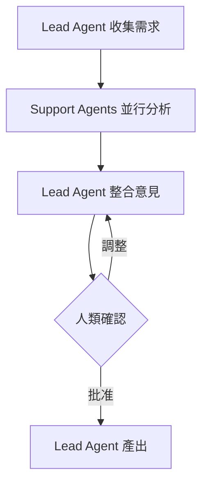
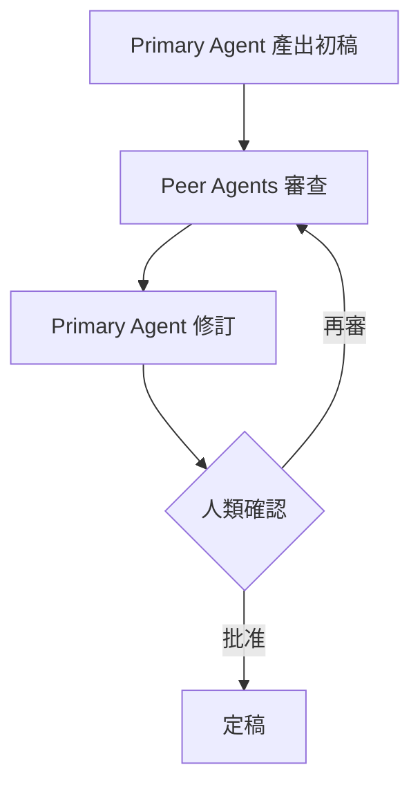
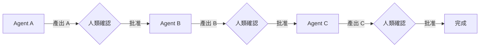
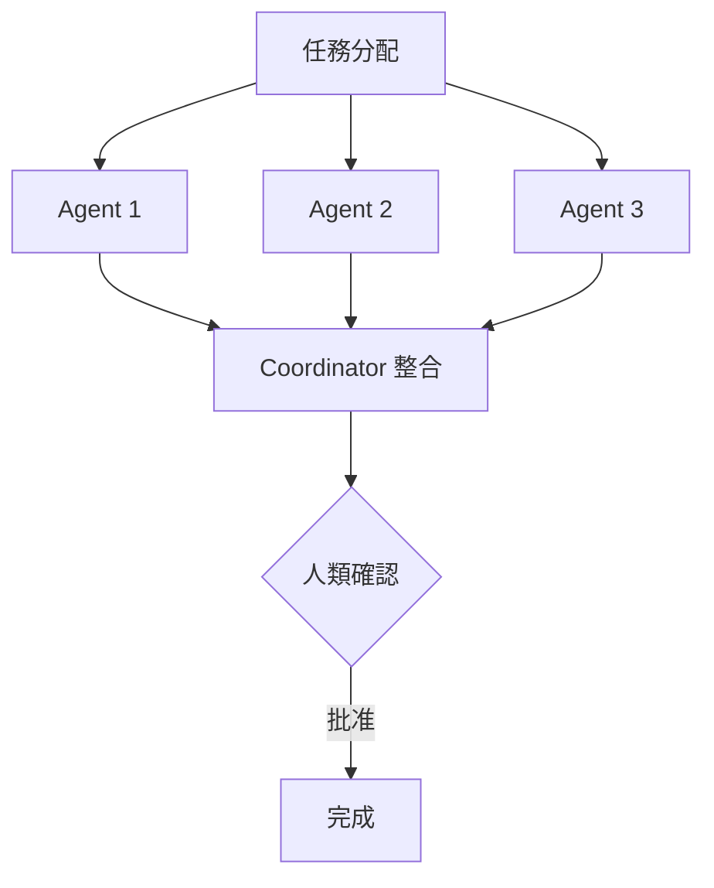
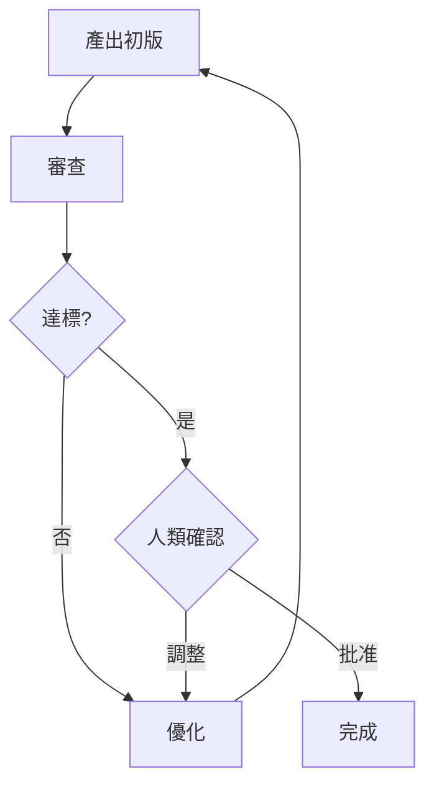

# Agent 協作模式指南
# Agent Collaboration Patterns Guide

**版本**: v0.03-phase2
**建立日期**: 2025-10-23
**適用範圍**: AISDLC v0.03 所有情境

---

## 📋 文檔目的

本文檔定義 AISDLC 框架中 Agent 之間的標準協作模式，幫助：
1. **使用者**：理解不同情境下 Agent 如何協作
2. **AI 助手**：正確執行 Agent 協作流程
3. **框架維護者**：保持協作模式的一致性

---

## 🎯 協作模式概述

AISDLC v0.03 定義了 **5 種標準協作模式**，涵蓋不同的工作場景：

| 協作模式 | 適用場景 | 特點 | 常見情境 |
|---------|---------|------|---------|
| **Lead-Support** | 單一主導者，多個支援者 | 決策集中，分工明確 | Greenfield, Brownfield, Performance |
| **Peer-Review** | 同儕交叉審查 | 品質保證，互相檢核 | FRD/SRD Review, Security Review |
| **Sequential-Handoff** | 順序交接 | 流程清晰，責任明確 | PRD→FRD→SRD, Design→Dev→QA |
| **Parallel-Convergence** | 並行後整合 | 效率高，需協調 | Tech Stack Selection, Multi-platform Testing |
| **Iterative-Refinement** | 迭代精煉 | 持續改進，靈活調整 | API Design, Performance Optimization |

---

## 🔹 Pattern 1: Lead-Support（主導-支援）

### 定義
一個 Lead Agent 主導整個流程，多個 Support Agents 提供專業建議和協助驗證。

### 結構
```
┌─────────────────────────────────────────┐
│            Lead Agent                   │
│         (主導決策、整合意見)              │
└──────────────┬──────────────────────────┘
               │
       ┌───────┼───────┬───────┐
       │       │       │       │
   Support  Support Support Support
   Agent 1  Agent 2 Agent 3 Agent 4
   (專業A)  (專業B) (專業C) (專業D)
```

### 工作流程
1. **Lead Agent 主導需求收集**
   - 收集使用者輸入
   - 初步分析和框架設計

2. **Support Agents 提供專業視角**
   - 各自從專業角度分析
   - 提出建議和潛在風險

3. **Lead Agent 整合意見**
   - 權衡不同建議
   - 做出最終決策

4. **🔴 人類確認**
   - 確認整合方案
   - 批准或要求調整

5. **Lead Agent 主導產出**
   - 產出最終文檔
   - 確保一致性

### 適用範例

#### 範例 1：Greenfield 專案
```yaml
Lead Agent: pm-po-agent (產品經理)
Support Agents:
  - sa-analyst: 系統分析視角
  - ba-business-analyst: 業務驗證視角
  - sd-architect: 技術可行性視角
  - qa-tester: 測試性視角
  - dev-developer: 開發實作視角

流程：
1. pm-po 主導需求收集和優先級排序
2. 各 Support Agent 從專業角度提供建議
3. pm-po 整合意見並決策
4. 🔴 人類確認產品方向
5. pm-po 產出 PRD
```

#### 範例 2：Performance 優化
```yaml
Lead Agent: performance-engineer (效能工程師)
Support Agents:
  - sd-architect: 架構層面建議
  - dev-senior: 代碼層面建議
  - qa-automation: 測試自動化建議

流程：
1. performance-engineer 主導效能剖析
2. sd/dev-senior 提供優化建議
3. performance-engineer 制定優化策略
4. 🔴 人類確認優化方案
5. 執行優化並驗證
```

### 最佳實踐
✅ **DO**:
- Lead Agent 要主動整合意見，避免各說各話
- Support Agents 要聚焦自己的專業領域
- 明確標註誰是 Lead，避免決策混亂

❌ **DON'T**:
- Support Agent 不要越權做決策
- Lead Agent 不要忽略專業建議
- 避免過多 Support Agents（建議 ≤ 5 個）

---

## 🔹 Pattern 2: Peer-Review（同儕審查）

### 定義
一個 Primary Agent 產出初稿，一個或多個 Peer Agents 進行交叉審查。

### 結構
```
┌──────────────────┐
│  Primary Agent   │
│   (產出初稿)      │
└────────┬─────────┘
         │
         ↓
    ┌────────────┐
    │   初稿      │
    └────┬───────┘
         │
    ┌────┴────┬──────────┐
    ↓         ↓          ↓
  Peer 1    Peer 2     Peer 3
  (審查)     (審查)      (審查)
    │         │          │
    └─────────┴──────────┘
              │
              ↓
         修訂並定稿
```

### 工作流程
1. **Primary Agent 產出初稿**
   - 根據需求產出文檔
   - 自我審查

2. **Peer Agents 交叉審查**
   - 從不同角度審查
   - 提出具體改進建議

3. **Primary Agent 修訂**
   - 根據反饋修改
   - 解釋不採納的原因

4. **🔴 人類最終確認**
   - 審查修訂版本
   - 批准定稿

### 適用範例

#### 範例 1：FRD Review
```yaml
Primary Agent: sa-analyst (系統分析師)
Peer Agent: ba-business-analyst (業務分析師)

流程：
1. sa-analyst 根據 PRD 產出 FRD 初稿
2. ba-business-analyst 從業務角度審查
   - 業務邏輯是否正確
   - 利害關係人需求是否涵蓋
   - 業務術語是否準確
3. sa-analyst 修訂 FRD
4. 🔴 人類確認最終版本
```

#### 範例 2：Security Review
```yaml
Primary Agent: security-engineer (安全工程師)
Peer Agents:
  - sd-architect: 架構安全性
  - qa-lead: 測試覆蓋度

流程：
1. security-engineer 產出安全設計初稿
2. sd-architect 審查架構層面安全性
3. qa-lead 審查測試策略
4. security-engineer 整合反饋並修訂
5. 🔴 人類最終批准
```

### 最佳實踐
✅ **DO**:
- Peer Review 要具體，提供可行建議
- Primary Agent 要虛心接受反饋
- 所有建議都要有回應（採納或說明理由）

❌ **DON'T**:
- 不要流於形式，敷衍審查
- 不要過度審查，吹毛求疵
- 不要忽略審查意見

---

## 🔹 Pattern 3: Sequential-Handoff（順序交接）

### 定義
Agent A 完成工作並交接給 Agent B，Agent B 延續並產出，形成流水線式協作。

### 結構
```
Agent A → Output A → Agent B → Output B → Agent C → Final Output
  ↓                    ↓                    ↓
  🔴 確認              🔴 確認              🔴 確認
```

### 工作流程
1. **Agent A 完成並交接**
   - 產出符合交接標準的成果
   - 標註交接點和注意事項

2. **🔴 人類確認交接點**
   - 驗證 Agent A 產出品質
   - 確認可以交接

3. **Agent B 接手並延續**
   - 基於 Agent A 的產出繼續
   - 保持一致性

4. **重複直到完成**
   - 每個交接點都有人類確認
   - 確保可追溯性

### 適用範例

#### 範例 1：文檔產出鏈
```yaml
流程：PRD → FRD → SRD → API Specs

Agent pm-po → PRD → 🔴確認
  ↓
Agent sa → FRD → 🔴確認
  ↓
Agent sd-architect → SRD → 🔴確認
  ↓
Agent sd-architect + dev → API Specs → 🔴確認

交接標準：
- PRD→FRD: 需求清晰、優先級明確、Acceptance Criteria 完整
- FRD→SRD: 功能需求詳細、資料結構定義、介面規格
- SRD→API: 技術架構確定、API 端點列表、資料模型
```

#### 範例 2：Design → Dev → QA
```yaml
流程：設計 → 開發 → 測試

Agent sd-architect → 詳細設計 → 🔴確認
  ↓
Agent dev-developer → 實作評估 → 🔴確認
  ↓
Agent qa-tester → 測試計畫 → 🔴確認

交接標準：
- Design→Dev: 架構圖清晰、元件職責明確、介面定義完整
- Dev→QA: 功能清單、預期行為、邊界條件
```

### 最佳實踐
✅ **DO**:
- 明確定義交接標準
- 每個交接點都要有文檔輸出
- 保持文檔之間的可追溯性（雙向連結）

❌ **DON'T**:
- 不要跳過交接點確認
- 不要在前一階段未完成時強行交接
- 不要忽略上游產出，重新開始

---

## 🔹 Pattern 4: Parallel-Convergence（並行收斂）

### 定義
多個 Agents 同時並行工作，最後由 Coordinator Agent 整合結果。

### 結構
```
         任務分配
              │
    ┌─────────┼─────────┬─────────┐
    ↓         ↓         ↓         ↓
 Agent A   Agent B   Agent C   Agent D
 (並行)     (並行)     (並行)     (並行)
    │         │         │         │
    └─────────┴─────────┴─────────┘
              │
              ↓
       Coordinator Agent
         (整合收斂)
              │
              ↓
          🔴 確認
```

### 工作流程
1. **分配並行任務**
   - 將任務分解為獨立子任務
   - 分配給適合的 Agents

2. **各 Agent 獨立執行**
   - 各自完成負責的部分
   - 不相互依賴

3. **Coordinator Agent 整合**
   - 收集所有結果
   - 解決衝突
   - 統一格式

4. **🔴 人類確認整合結果**
   - 驗證整合一致性
   - 批准最終產出

### 適用範例

#### 範例 1：Tech Stack Selection
```yaml
Coordinator: sd-architect (架構師)
Parallel Agents:
  - sd-web-architect: Web 技術棧評估
  - sd-mobile-architect: Mobile 技術棧評估

流程：
1. 任務分配：Web 和 Mobile 技術選型
2. 並行執行：
   - sd-web: React vs Vue vs Angular
   - sd-mobile: Native vs Flutter vs React Native
3. sd-architect 整合：
   - 統一技術風格
   - 考慮跨平台可能性
   - 評估團隊技能
4. 🔴 人類確認技術棧決策
```

#### 範例 2：Multi-platform Testing
```yaml
Coordinator: qa-lead (測試主管)
Parallel Agents:
  - qa-web-tester: Web 測試
  - qa-mobile-tester: Mobile 測試
  - qa-automation: 自動化測試

流程：
1. 任務分配：各平台測試計畫
2. 並行執行：
   - qa-web: Web 測試案例設計
   - qa-mobile: Mobile 測試案例設計
   - qa-automation: 自動化框架選擇
3. qa-lead 整合：
   - 統一測試標準
   - 整合測試報告格式
   - 制定測試排程
4. 🔴 人類確認測試策略
```

### 最佳實踐
✅ **DO**:
- 確保並行任務真的獨立（無依賴）
- Coordinator 要有明確整合標準
- 預先定義衝突解決機制

❌ **DON'T**:
- 不要將有依賴關係的任務並行
- 不要讓 Agents 各自為政，缺少整合
- 不要忽略一致性問題

---

## 🔹 Pattern 5: Iterative-Refinement（迭代精煉）

### 定義
Agent 產出初版，經過內部或外部審查，根據反饋持續優化，直到達標。

### 結構
```
┌──────────────────────────────────────┐
│                                      │
│   Agent → 初版 → 審查 → 反饋         │
│     ↑                      ↓         │
│     └──────── 優化 ─────────┘        │
│                                      │
│   迭代直到達標                         │
│                                      │
└──────────────┬───────────────────────┘
               ↓
           🔴 最終批准
```

### 工作流程
1. **Agent 產出初版**
   - 根據需求產出 MVP 版本
   - 識別已知不足

2. **內部審查（AI 或人類）**
   - 檢查是否符合標準
   - 提供具體改進建議

3. **根據反饋優化**
   - 逐項改進
   - 記錄改進內容

4. **迭代直到達標**
   - 重複 2-3 步驟
   - 達到品質門檻

5. **🔴 人類最終批准**
   - 確認達到預期
   - 批准發布

### 適用範例

#### 範例 1：API Design
```yaml
Primary Agent: sd-architect
Reviewers:
  - dev-developer: 實作可行性
  - qa-tester: 測試性

迭代流程：
Iteration 1:
  - sd-architect 產出 API 初稿
  - dev review: 建議簡化某些端點
  - 優化並產出 v2

Iteration 2:
  - qa review: 建議增加錯誤碼定義
  - 優化並產出 v3

Iteration 3:
  - 所有 reviewers 滿意
  - 🔴 人類最終批准
```

#### 範例 2：Performance Optimization
```yaml
Primary Agent: performance-engineer

迭代流程：
Iteration 1:
  - 識別瓶頸
  - 實施優化方案 A
  - 測量：改善 20%（未達標）

Iteration 2:
  - 分析仍慢的原因
  - 實施優化方案 B
  - 測量：改善 45%（接近目標）

Iteration 3:
  - 微調配置
  - 測量：改善 60%（達標）
  - 🔴 人類確認效能滿意
```

### 最佳實踐
✅ **DO**:
- 設定明確的達標標準
- 每次迭代都要有可衡量的改進
- 記錄每次迭代的改進內容

❌ **DON'T**:
- 不要無止境迭代（設定最大迭代次數）
- 不要每次迭代改動過大（小步快跑）
- 不要忽略中間版本的記錄

---

## 🎯 協作模式選擇指南

### 選擇流程圖
```
開始
  │
  ↓
是否需要單一決策者？
  ├─ 是 → Lead-Support
  └─ 否
      │
      ↓
    是否需要品質審查？
      ├─ 是 → Peer-Review
      └─ 否
          │
          ↓
        是否有明確順序流程？
          ├─ 是 → Sequential-Handoff
          └─ 否
              │
              ↓
            是否可並行執行？
              ├─ 是 → Parallel-Convergence
              └─ 否 → Iterative-Refinement
```

### 情境推薦表

| 情境 | 主要協作模式 | 次要協作模式 |
|------|-------------|-------------|
| **Greenfield** | Lead-Support | Sequential-Handoff |
| **Brownfield** | Lead-Support | Peer-Review |
| **Refactoring** | Lead-Support | Iterative-Refinement |
| **Performance** | Lead-Support | Iterative-Refinement |
| **Integration** | Lead-Support | Sequential-Handoff |
| **DevOps** | Lead-Support | Parallel-Convergence |
| **Testing** | Parallel-Convergence | Peer-Review |
| **Documentation** | Sequential-Handoff | Peer-Review |
| **Security** | Peer-Review | Lead-Support |

---

## 📊 協作模式視覺化流程圖

### Lead-Support 流程


### Peer-Review 流程


### Sequential-Handoff 流程


### Parallel-Convergence 流程


### Iterative-Refinement 流程


---

## 💡 最佳實踐與注意事項

### 通用最佳實踐

1. **明確角色分工**
   - 每個 Agent 都要清楚自己的角色（Lead/Support/Primary/Peer）
   - 避免角色模糊導致的責任混亂

2. **人類確認點必不可少**
   - 所有協作模式都要有 🔴 人類確認點
   - 確認點位置要合理（關鍵決策後、交接前）

3. **保持溝通透明**
   - Agent 之間的互動要可追溯
   - 重要決策要有記錄

4. **適度協作**
   - 不要過度依賴協作（簡單任務單一 Agent 即可）
   - 不要協作不足（複雜任務需要多方視角）

### 常見陷阱

❌ **陷阱 1：過度協作**
- 問題：所有任務都使用多 Agent 協作
- 影響：效率低下，溝通成本高
- 解決：簡單任務單一 Agent，複雜任務才協作

❌ **陷阱 2：角色混亂**
- 問題：不清楚誰主導、誰支援
- 影響：決策混亂，互相推諉
- 解決：明確標註 Lead/Support 角色

❌ **陷阱 3：跳過確認點**
- 問題：為了快速完成跳過人類確認
- 影響：方向錯誤，返工成本高
- 解決：嚴格執行所有 🔴 確認點

❌ **陷阱 4：協作模式混用**
- 問題：在一個流程中混用多種模式
- 影響：流程混亂，難以追蹤
- 解決：一個流程階段使用一種主要模式

### 效率提升技巧

✅ **技巧 1：預先分工**
- 在 SOP 中明確標註每個階段使用的協作模式
- Agent 配置文件中標註適用的協作模式

✅ **技巧 2：標準化產出**
- 定義每個協作模式的標準產出格式
- 減少溝通成本

✅ **技巧 3：適時並行**
- 識別可並行的任務
- 使用 Parallel-Convergence 提升效率

✅ **技巧 4：快速迭代**
- 對於不確定的設計使用 Iterative-Refinement
- 小步快跑，降低風險

---

## 📚 延伸閱讀

### 相關文檔
- `scenarios/SCENARIO_AGENT_MAPPING.md`: 情境 Agent 配置表
- `agent/core/*.yaml`: 各 Agent 的協作模式配置
- `scenarios/*/SOP.md`: 各情境的協作模式實例

### 使用範例
- Greenfield SOP: Lead-Support + Sequential-Handoff 範例
- Integration SOP: Lead-Support 範例
- Security 情境: Peer-Review 範例

---

## 🔄 版本歷史

### v0.03-phase2 (2025-10-23)
- ✅ 初版建立
- ✅ 定義 5 種標準協作模式
- ✅ 提供詳細範例和最佳實踐
- ✅ 建立選擇指南和視覺化流程圖

---

**維護者**: AISDLC Framework Team
**最後更新**: 2025-10-23
**反饋**: 如有建議請提交 Issue 或 PR
