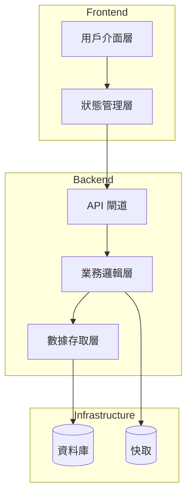
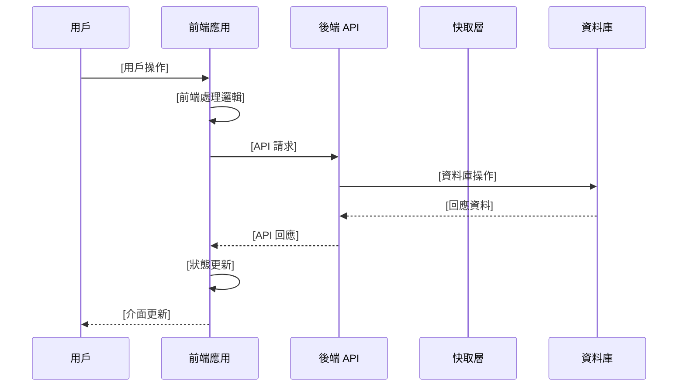
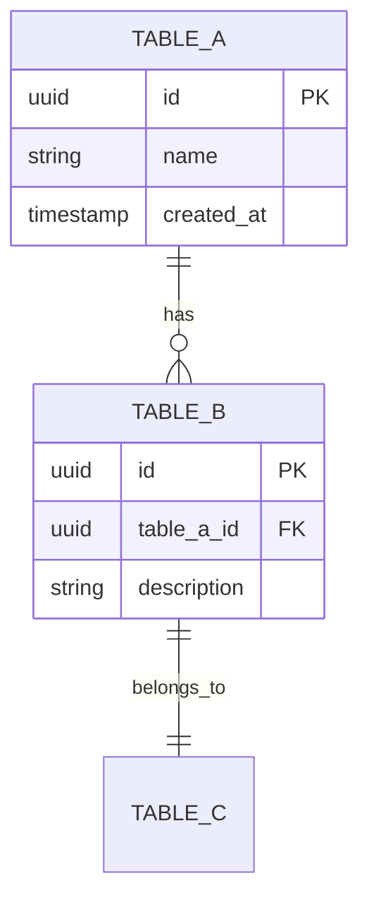

# SRD - [系統/模組名稱]

**版本**: v0.09
**適用情境**: All Scenarios (Greenfield, Brownfield, Refactoring, Performance, Integration)
**負責 Agent**: sd-architect, sd-web-architect, sd-mobile-architect
**產出時機**: 技術設計階段

*填寫說明：定義技術實現規格，對應 FRD 中的功能需求*
*檔名格式：SRD_模組名.md 或 SRD_System_Architecture.md*

---

## 📋 文檔元資料

| 項目 | 內容 |
|------|------|
| 文檔標題 | [由 AI 填寫] |
| 文檔 ID | SRD-[模組名]-[編號] |
| 版本 | v1.0 |
| 創建日期 | [YYYY-MM-DD] |
| 最後更新 | [YYYY-MM-DD] |
| 負責人 | [系統架構師姓名] |
| 審查人 | [Tech Lead 姓名] |
| 狀態 | [草稿/審查中/已批准] |
| 適用情境 | [Greenfield/Brownfield/Refactoring/Performance/Integration] |

---

## 1. 技術架構總覽 (Technical Overview)
*填寫說明：描述此模組的技術架構和設計決策*

### 架構圖
*插入架構圖或使用 Mermaid 語法繪製*



### 技術選型
*說明選擇的技術堆疊和理由*

> 📋 **參考文檔**: [Tech_Stack_Selection_Matrix.md](../../../guides/system/planning/Tech_Stack_Selection_Matrix.md) - 技術選型評估矩陣 🆕 (v0.09 新增)
>
> **重要**: 重大技術選型決策應記錄完整評估過程，包含評估維度、候選方案對比、加權總分等。

#### 前端技術 (若適用)
- **框架**: [React/Vue/Angular/等]
- **狀態管理**: [Redux/Vuex/MobX/等]
- **UI 組件庫**: [Material-UI/Ant Design/等]
- **選擇理由**: [說明為何選擇這些技術]
- **評估結果** 🆕 (v0.09 新增): [如有進行技術選型評估矩陣，請貼上加權總分和決策理由]

#### 後端技術
- **語言**: [Node.js/Python/Java/Go/等]
- **框架**: [Express/Django/Spring Boot/等]
- **ORM/資料庫工具**: [Sequelize/TypeORM/SQLAlchemy/等]
- **選擇理由**: [說明技術選型依據]
- **評估結果** 🆕 (v0.09 新增): [如有進行技術選型評估矩陣，請貼上加權總分和決策理由]

#### 後端技術（Spring Boot 範例）🆕 (v0.09 新增)
*若後端使用 Java/Spring Boot，建議採用以下架構*

- **語言**: Java 17+
- **框架**: Spring Boot 3.x
- **ORM**: Spring Data JPA + Hibernate
- **資料庫遷移**: Flyway
- **安全**: Spring Security + JWT
- **API 文件**: SpringDoc OpenAPI (Swagger)
- **建置工具**: Gradle (Kotlin DSL) / Maven
- **測試**: JUnit 5 + Mockito + TestContainers

**Spring Boot 模組結構**:
```
src/main/java/com/example/project/
├── config/          # @Configuration（Security, CORS, WebSocket）
├── controller/      # @RestController（API 端點）
├── service/         # @Service（業務邏輯）
├── repository/      # JpaRepository（資料存取）
├── model/
│   ├── entity/      # @Entity（JPA 實體）
│   └── dto/         # DTO（Request/Response）
├── exception/       # @ExceptionHandler（統一錯誤處理）
├── security/        # JWT Filter、UserDetailsService
└── util/            # 工具類
```

#### Desktop App 架構（若適用）🆕 (v0.09 新增)
*若專案包含桌面應用程式，填寫此區塊*

- **平台**: [macOS / Windows / 跨平台]
- **技術框架**: [SwiftUI / Electron / Tauri / .NET WPF]
- **與後端通訊**: [REST API / WebSocket / gRPC]
- **離線支援**: [是/否 - 離線快取策略]
- **原生功能**: [掃碼（AVFoundation）、檔案系統、通知、印表機整合]

**macOS SwiftUI 架構範例**:
```
InvMaster-macOS/
├── App/                # @main App 入口
├── Views/              # SwiftUI View
├── ViewModels/         # ObservableObject ViewModel
├── Models/             # Codable 資料模型
├── Services/
│   ├── APIService/     # URLSession API 呼叫
│   ├── ScannerService/ # AVFoundation 掃碼
│   └── CacheService/   # CoreData 離線快取
└── Utilities/          # 工具和擴展
```

**Electron/Tauri 跨平台架構範例**:
```
desktop-app/
├── src/
│   ├── main/           # 主程序（Node.js / Rust）
│   ├── renderer/       # 渲染程序（React/Vue）
│   ├── preload/        # 預載腳本（安全橋接）
│   └── shared/         # 共用邏輯
├── resources/          # 靜態資源、圖標
└── build/              # 打包配置
```

#### 資料庫
- **主要資料庫**: [PostgreSQL/MySQL/MongoDB/等]
- **快取層**: [Redis/Memcached/等]
- **選擇理由**: [說明資料庫選型原因]
- **評估結果** 🆕 (v0.09 新增): [如有進行技術選型評估矩陣，請貼上加權總分和決策理由]

#### 技術選型評估記錄 🆕 (v0.09 新增)

*適用於重大技術選型決策（Backend Framework / Database / Cloud Provider / Frontend Framework），記錄完整評估過程*

**評估日期**: [YYYY-MM-DD]
**評估人員**: [SD-Architect 姓名]
**選型類別**: [Backend Framework / Database / Cloud Provider / etc.]

**候選方案**:
| # | 技術方案 | 版本 | 授權 | 備註 |
|---|---------|------|------|------|
| A | [方案 A] | [版本] | [開源/付費] | [簡述] |
| B | [方案 B] | [版本] | [開源/付費] | [簡述] |
| C | [方案 C] | [版本] | [開源/付費] | [簡述] |

**評估矩陣**:
| 評估維度 | 權重 | 方案 A | 方案 B | 方案 C |
|---------|------|--------|--------|--------|
| **1. 功能性** | 30% | [評分 1-5] | [評分 1-5] | [評分 1-5] |
| **2. 成本** | 25% | [評分 1-5] | [評分 1-5] | [評分 1-5] |
| **3. 學習曲線** | 20% | [評分 1-5] | [評分 1-5] | [評分 1-5] |
| **4. 社群支援** | 15% | [評分 1-5] | [評分 1-5] | [評分 1-5] |
| **5. 風險評估** | 10% | [評分 1-5] | [評分 1-5] | [評分 1-5] |
| **加權總分** | 100% | [計算結果] | [計算結果] | [計算結果] |

**決策結果**: 選擇 **[方案名稱]**

**決策理由**:
1. **功能性**: [說明功能性評分理由]
2. **成本**: [說明 TCO 3 年成本評估]
3. **學習曲線**: [說明團隊技能匹配度]
4. **社群支援**: [說明生態系統成熟度]
5. **風險評估**: [說明風險評估結果]

**替代方案**: [記錄未選擇的方案及理由]

### 設計模式
*採用的設計模式（如 MVC、Repository Pattern、CQRS 等）*

### 對應需求
此設計支援以下功能需求：
- [FRD 功能模組 1](../frd/FRD_模組名.md)
- [FRD 功能模組 2](../frd/FRD_模組名2.md)

---

## 2. API 設計 (API Specifications)

*填寫說明：定義此模組的 API 端點*
*詳細 API 規格請參考 API Index 和個別 API 規格文件*

### API 總覽

| API 名稱 | HTTP 方法 | 路徑 | 對應需求 | 詳細規格 |
|---------|----------|------|----------|----------|
| [API 名稱 1] | GET | /api/v1/resource | [US-XXX](../frd/FRD_模組.md#us-xxx) | [API_Module_Get.md](./api/API_Module_Get.md) |
| [API 名稱 2] | POST | /api/v1/resource | [US-YYY](../frd/FRD_模組.md#us-yyy) | [API_Module_Post.md](./api/API_Module_Post.md) |

### API 索引
完整 API 列表和導航請參考：[API_Index.md](./api/API_Index.md)

### API: [端點名稱示例]

- **端點**: `[HTTP Method] /api/v1/[resource]`
- **描述**: *此 API 的功能*
- **對應需求**: [US-XXX](../frd/FRD_模組名.md#us-xxx)

#### Request
```json
{
  "headers": {
    "Authorization": "Bearer {token}",
    "Content-Type": "application/json"
  },
  "parameters": {
    "id": "string (路徑參數)"
  },
  "body": {
    "field1": "value",
    "field2": 123
  }
}
```

#### Response
```json
{
  "success": {
    "code": 200,
    "data": {
      "id": "uuid",
      "field1": "value",
      "field2": 123
    }
  },
  "error": {
    "code": 400,
    "message": "錯誤訊息",
    "details": {}
  }
}
```

#### 範例
```bash
curl -X GET https://api.example.com/v1/resource/123 \
  -H "Authorization: Bearer {token}" \
  -H "Content-Type: application/json"
```

---

## 3. 前後端交互流程 (Frontend-Backend Interaction Flow)

*填寫說明：定義完整的前後端協作流程，確保開發團隊理解業務流程中的交互時機*

### 3.1 業務流程序列圖

*填寫說明：使用 Mermaid 繪製主要業務流程的前後端交互序列圖*

#### [主要業務流程名稱]



*根據實際需求調整參與者和交互步驟*

### 3.2 API 調用時序與依賴

*填寫說明：定義 API 的調用順序、依賴關係和前置條件*

#### [功能模組] API 調用流程

**主要流程**：
1. **前置檢查階段**
   - 前端驗證：[驗證項目]
   - 權限檢查：[權限要求]
   - 狀態檢查：[必要的前端狀態]

2. **核心 API 調用**
   - **主要請求**：[主要 API 端點] → [對應需求 US-XXX](../frd/FRD_模組名.md#us-xxx)
   - **依賴 API**：[相關的依賴 API 調用]
   - **並行請求**：[可並行執行的 API 請求]

3. **後續處理階段**
   - **成功路徑**：[成功時的後續動作]
   - **錯誤處理**：[各種錯誤情況的處理]
   - **狀態同步**：[前端狀態更新邏輯]

**調用依賴關係**：
- [API A] → [API B]（[依賴原因]）
- [API C] ⟷ [API D]（[互相依賴說明]）

### 3.3 前端狀態管理與同步

*填寫說明：定義前端狀態管理策略和與後端的同步機制*

#### 狀態結構設計
```typescript
// 前端狀態示例（可用 TypeScript、JavaScript 或偽代碼）
interface ModuleState {
  data: DataType[],
  loading: boolean,
  error: string | null,
  lastUpdated: timestamp,
  filters: FilterType,
  pagination: PaginationType
}
```

#### 狀態同步策略
- **初始載入**：[初始資料載入方式]
- **增量更新**：[資料變更時的更新策略]
- **即時同步**：[需要即時同步的資料項目]
- **離線處理**：[網路中斷時的資料處理]

#### 快取策略
- **前端快取**：[前端資料快取機制]
- **快取失效**：[快取過期和更新條件]
- **快取穿透**：[繞過快取的條件]

### 3.4 異常處理與容錯機制

*填寫說明：定義異常情況下的前後端協作處理流程*

#### 網路異常處理
- **連線超時**：[超時處理策略]
- **網路中斷**：[斷線重連機制]
- **請求失敗**：[失敗重試邏輯]

#### 業務異常處理
- **權限不足**：[權限檢查失敗的處理]
- **資料衝突**：[併發操作衝突的解決]
- **驗證失敗**：[資料驗證錯誤的回饋]

#### 用戶體驗保障
- **載入狀態**：[載入中的介面顯示]
- **錯誤提示**：[使用者友善的錯誤訊息]
- **降級方案**：[部分功能不可用時的替代方案]

### 3.5 效能優化交互

*填寫說明：前後端協作的效能優化策略*

#### 請求優化
- **批次請求**：[多個請求的合併策略]
- **分頁載入**：[大量資料的分批載入]
- **預先載入**：[預期資料的提前載入]

#### 回應優化
- **資料壓縮**：[回應資料的壓縮方式]
- **欄位過濾**：[按需回傳欄位的機制]
- **快取控制**：[HTTP 快取頭的設定策略]

---

## 4. 資料模型 (Data Model)

*填寫說明：定義資料庫結構*

### Table: [資料表名稱]
*對應需求：[US-XXX](../frd/FRD_模組名.md#us-xxx)*

| 欄位名 | 型別 | 限制 | 描述 | 索引 |
|--------|------|------|------|------|
| id | UUID | PK, NOT NULL | 主鍵 | PRIMARY |
| created_at | TIMESTAMP | NOT NULL | 創建時間 | INDEX |
| updated_at | TIMESTAMP | NOT NULL | 更新時間 | - |
| column_name | VARCHAR(255) | NOT NULL | 說明 | INDEX |

### 關聯關係
*描述資料表之間的關聯*



### 索引設計
*列出需要建立的索引*
- **PRIMARY KEY**: id
- **INDEX**: created_at, updated_at
- **UNIQUE**: email (若適用)
- **COMPOSITE INDEX**: (user_id, status)

---

## 5. 系統整合 (System Integration)

*填寫說明：描述與其他系統或服務的整合*

### 內部整合
*與其他模組的介面*
- **模組 A**: [整合方式和協議]
- **模組 B**: [整合方式和協議]

### 外部整合
*第三方服務或 API*
- **第三方服務名稱**: [用途、API 版本、認證方式]
- **整合方式**: [RESTful API/GraphQL/gRPC/等]

### 訊息佇列/事件
*非同步通訊機制*
- **訊息佇列**: [RabbitMQ/Kafka/等]
- **事件類型**: [定義的事件及其觸發條件]

---

## 6. 安全架構設計 (Security Architecture Design)

> 📋 **參考文檔**:
> - [Security_Architecture_Checklist.md](../../../guides/system/architecture/Security_Architecture_Checklist.md) - 安全元件設計檢查清單
> - [Security_Threat_Modeling_Guide.md](../../../guides/system/quality/Security_Threat_Modeling_Guide.md) - STRIDE 威脅建模指南
> - Stage 2 STRIDE 分析報告（連結到專案實際產出）
> - FRD NFR-SEC 安全需求（連結到 [FRD](../frd/FRD_Module.md#62-安全需求)）

**本章節目的**: 將 Stage 2 STRIDE 威脅建模產出的 **NFR-SEC 安全需求** 轉換為具體的 **技術架構設計**，確保 C4 Model Level 2/3 包含完整安全元件。

---

### 6.1 安全元件架構總覽

**C4 Model Level 2 - Security Containers**:
```
[標示安全相關容器在整體架構中的位置]

範例：
┌────────────────────────────────────────┐
│  BnB Platform - Security Containers   │
└────────────────────────────────────────┘

👤 使用者
   │ HTTPS (TLS 1.3)
   ↓
┌──────────────────────┐
│  API Gateway         │ ← 3️⃣ Rate Limiting / WAF
└──────────────────────┘
   │
   ├─→ ┌──────────────────┐
   │   │  Auth Service    │ ← 1️⃣ JWT / OAuth 2.0
   │   └──────────────────┘
   │
   ├─→ ┌──────────────────┐
   │   │  Booking Service │ ← 1️⃣ Permission Check
   │   └──────────────────┘
   │
   └─→ 🗄️ PostgreSQL (2️⃣ TDE 加密)

        ┌──────────────────┐
        │  ELK Stack       │ ← 4️⃣ Centralized Logging
        └──────────────────┘
```

**安全元件對應表**:
| 安全元件類別 | C4 Level 2 容器 | C4 Level 3 元件 | 對應 NFR-SEC |
|------------|----------------|----------------|-------------|
| 1️⃣ 認證與授權 | Auth Service | JWT Handler, Permission Checker | NFR-SEC-001 |
| 2️⃣ 加密 | Encryption Service, KMS | Password Hash, Data Encryption | NFR-SEC-003 |
| 3️⃣ 輸入驗證 | API Gateway, WAF | Request Validator, SQL/XSS/CSRF Prevention | NFR-SEC-002 |
| 4️⃣ 日誌與審計 | Logging Service | Security Event Logger, Audit Trail | NFR-SEC-004, NFR-SEC-005 |

---

### 6.2 認證與授權元件 (對應 NFR-SEC-001)

#### 6.2.1 認證機制（Authentication）

**技術選型**:
- **認證方式**: JWT (JSON Web Token)
- **演算法**: RS256 (非對稱加密，私鑰簽名，公鑰驗證)
- **Token 類型**:
  - Access Token: 有效期 30 分鐘
  - Refresh Token: 有效期 30 天（HttpOnly Cookie）

**C4 Level 3 Component: JWT Handler**
```
職責:
- Token 生成（/auth/login）
- Token 驗證（每個 API 請求）
- Token 刷新（/auth/refresh）

技術實作:
- Library: jsonwebtoken (Node.js) / jose (TypeScript)
- Key 儲存: 環境變數（開發）/ AWS KMS（生產）
- Token Payload:
  {
    "sub": "user_id",
    "role": "user|host|admin",
    "iat": 1234567890,
    "exp": 1234569690
  }
```

**Token 管理流程**:
1. 登入成功 → 生成 Access Token (30 min) + Refresh Token (30 days)
2. Access Token 過期 → 使用 Refresh Token 刷新
3. Refresh Token 過期 → 重新登入
4. 登出 → 刪除 Refresh Token（黑名單機制）

**Multi-Factor Authentication (MFA)**:
- **適用場景**: 高敏感操作（付款、刪除資料、權限變更）
- **實作方式**: TOTP (Time-based One-Time Password)
- **Library**: speakeasy (Node.js) / google-authenticator

#### 6.2.2 授權控制（Authorization）

**權限模型**: RBAC (Role-Based Access Control)

**角色定義**:
| 角色 | 權限範圍 | 範例操作 |
|-----|---------|---------|
| **Admin** | 所有資源 CRUD | 管理使用者、查看所有訂單 |
| **Host** | 自己的房源 CRUD | 管理房源、查看自己的訂單 |
| **User** | 自己的資料 CRUD | 預訂房源、查看自己的訂單 |

**C4 Level 3 Component: Permission Checker**
```
職責:
- API 請求權限驗證
- 資料層權限過濾（Row-Level Security）

技術實作:
- Middleware: 每個 API 端點執行權限檢查
- Database: PostgreSQL Row-Level Security (RLS)
- Cache: Redis 快取權限資料（TTL = 5 分鐘）

範例 Middleware:
async function checkPermission(req, res, next) {
  const { user, resource, action } = req;
  if (!hasPermission(user.role, resource, action)) {
    return res.status(403).json({ error: 'Forbidden' });
  }
  next();
}
```

**權限檢查點**:
- **API Gateway**: JWT 驗證
- **Application Layer**: 角色權限檢查
- **Database Layer**: Row-Level Security（使用者僅能讀取自己的資料）

---

### 6.3 加密元件 (對應 NFR-SEC-003)

#### 6.3.1 傳輸加密

**TLS/SSL Termination**:
- **位置**: Load Balancer (AWS ALB / Cloudflare)
- **TLS 版本**: TLS 1.3（禁止 TLS 1.0/1.1）
- **憑證管理**: Let's Encrypt（自動更新）/ AWS ACM

**HTTPS 強制**:
- **C4 Level 3 Component**: HTTPS Redirect Middleware
- **實作**: 所有 HTTP 請求自動重導向至 HTTPS
- **HSTS Header**: `Strict-Transport-Security: max-age=31536000; includeSubDomains`

#### 6.3.2 資料加密

**C4 Level 3 Component: Password Hash**
- **演算法**: bcrypt (cost factor = 12)
- **Library**: bcrypt (Node.js) / bcryptjs
- **流程**:
  1. 註冊時：`hashedPassword = bcrypt.hash(plainPassword, 12)`
  2. 登入時：`isValid = bcrypt.compare(plainPassword, hashedPassword)`

**C4 Level 3 Component: Data Encryption**
- **加密範圍**:
  - PII（身分證、護照號碼）: AES-256-GCM
  - Payment Info（信用卡）: PCI-DSS 合規加密（外包給 Stripe/PayPal）
- **金鑰管理**:
  - **開發環境**: 環境變數
  - **生產環境**: AWS KMS (Key Management Service)
  - **金鑰輪換**: 每 90 天輪換一次

**Database Encryption**:
- **Encryption at Rest**: PostgreSQL Transparent Data Encryption (TDE)
- **Backup Encryption**: 備份檔案使用 AES-256 加密

---

### 6.4 輸入驗證與防護元件 (對應 NFR-SEC-002)

#### 6.4.1 API Gateway / WAF

**C4 Level 2 Container**: Kong API Gateway / AWS WAF
- **功能**:
  - Rate Limiting（防 DDoS）
  - IP Whitelist/Blacklist
  - SQL Injection Pattern 偵測
  - XSS Pattern 偵測

**Rate Limiting 規則**:
| API 類型 | 限制 | 超過限制回應 |
|---------|------|------------|
| 登入 API | 每 IP 每分鐘 5 次 | 429 Too Many Requests |
| 一般 API | 每使用者每秒 10 次 | 429 Too Many Requests |
| Public API | 每 IP 每分鐘 100 次 | 429 Too Many Requests |

#### 6.4.2 Input Validation Components

**C4 Level 3 Component: Request Validator**
- **技術**: JSON Schema Validator (Joi / Yup / Zod)
- **驗證層次**:
  - 前端驗證（User Experience）: 即時回饋
  - 後端驗證（Security）: 最終防線
- **驗證項目**:
  - 資料類型（String, Number, Boolean）
  - 資料長度（min/max length）
  - 資料格式（Email, URL, Phone）
  - 允許值範圍（Enum）

**C4 Level 3 Component: SQL Injection Prevention**
- **技術**: ORM Prepared Statements（Sequelize / TypeORM / Prisma）
- **規則**: 禁止字串拼接 SQL
- **錯誤處理**: 不回傳 SQL 錯誤訊息給前端

**C4 Level 3 Component: XSS Prevention**
- **技術**:
  - HTML 編碼輸出（DOMPurify / he）
  - Content-Security-Policy (CSP) Header
  - 禁止 `eval()` 和 `innerHTML`

**C4 Level 3 Component: CSRF Prevention**
- **技術**:
  - CSRF Token（同步 Token 模式）
  - SameSite Cookie 屬性
  - Double Submit Cookie

---

### 6.5 日誌與審計元件 (對應 NFR-SEC-004, NFR-SEC-005)

#### 6.5.1 Centralized Logging Service

**C4 Level 2 Container**: ELK Stack (Elasticsearch, Logstash, Kibana)
- **日誌來源**:
  - Application Logs（應用程式日誌）
  - API Gateway Logs（API 請求日誌）
  - Database Audit Logs（資料庫稽核日誌）
  - Security Event Logs（安全事件日誌）

**日誌保留期限**: 90 天

#### 6.5.2 Audit Trail Components

**C4 Level 3 Component: Security Event Logger**
- **記錄事件**:
  - 登入成功/失敗（包含 IP、UserAgent）
  - 密碼修改
  - 權限變更
  - 敏感操作（刪除、匯出資料）

**日誌格式**:
```json
{
  "timestamp": "2025-12-13T10:30:00Z",
  "event_type": "LOGIN_SUCCESS",
  "user_id": "U-12345",
  "ip_address": "192.168.1.100",
  "user_agent": "Mozilla/5.0...",
  "result": "success"
}
```

**C4 Level 3 Component: Audit Trail**
- **記錄業務操作**:
  - 建立訂單、取消訂單、付款
  - 資料變更（UPDATE/DELETE）
- **記錄內容**: 時間戳、使用者 ID、操作類型、資源 ID、結果

**C4 Level 3 Component: Data Masking**
- **遮罩欄位**:
  - 密碼（完全遮罩: `******`）
  - 信用卡號（顯示後 4 碼: `****-****-****-1234`）
  - Email（部分遮罩: `u***@example.com`）

**C4 Level 3 Component: Anomaly Detection**
- **偵測項目**:
  - 連續登入失敗 ≥ 5 次 → 觸發警報
  - 異地登入（IP 位置異常變化）→ 發送通知
  - 異常 API 呼叫頻率（暴力破解）→ 自動封鎖 IP

---

### 6.6 安全配置需求

**Security HTTP Headers**:
```
Strict-Transport-Security: max-age=31536000; includeSubDomains
Content-Security-Policy: default-src 'self'; script-src 'self' 'unsafe-inline'
X-Frame-Options: DENY
X-Content-Type-Options: nosniff
X-XSS-Protection: 1; mode=block
```

**環境變數管理**:
- **開發環境**: `.env` 檔案（加入 `.gitignore`）
- **生產環境**: AWS Secrets Manager / HashiCorp Vault
- **禁止**: 硬編碼 API 金鑰、密碼、Database 連線字串

**最小權限原則**:
- **應用層 Database 帳號**: 僅 CRUD 權限（非 root）
- **檔案系統權限**: 應用程式僅能讀寫特定目錄
- **容器權限**: 以非 root 使用者執行容器

---

### 6.7 安全測試計畫

**安全測試類型**:
- [ ] **OWASP ZAP 掃描**: 自動化 Web 漏洞掃描
- [ ] **Burp Suite**: 滲透測試
- [ ] **Dependency 漏洞掃描**: npm audit / Snyk
- [ ] **Code Review**: 安全 Code Review Checklist

**滲透測試計畫**:
- **執行時機**: Stage 9 實施與測試
- **測試範圍**: OWASP Top 10
- **驗收標準**: 無 High / Critical 等級漏洞

---

## 7. 效能設計 (Performance Design)

*填寫說明：效能優化相關設計*

### 快取策略
*使用的快取機制*
- **快取層級**: [瀏覽器快取/CDN/應用快取/資料庫快取]
- **快取工具**: [Redis/Memcached/等]
- **快取策略**: [快取過期、更新策略]

### 資料庫優化
*查詢優化、分片等*
- **查詢優化**: [索引策略、查詢改寫]
- **連線池**: [連線池大小、配置]
- **讀寫分離**: [是否實施、架構]
- **分片策略**: [水平/垂直分片方案]

### 負載平衡
*流量分配策略*
- **負載平衡器**: [Nginx/HAProxy/雲端LB]
- **分配演算法**: [Round Robin/Least Connections/等]
- **健康檢查**: [檢查機制和頻率]

### 效能指標
- **回應時間**: ≤ [X] ms (95th percentile)
- **吞吐量**: ≥ [Y] requests/second
- **併發數**: 支援 [Z] concurrent users

---

## 8. 部署架構與高可用性設計 (Deployment & HA Architecture)

> 📋 **參考文檔**: [High_Availability_Architecture_Checklist.md](../../../guides/system/architecture/High_Availability_Architecture_Checklist.md)

*填寫說明：部署相關的技術細節及高可用性架構設計*

### 8.1 環境配置
*開發、測試、生產環境差異*

| 環境 | 伺服器規格 | 資料庫 | 快取 | 備註 |
|------|-----------|--------|------|------|
| Development | 2 vCPU, 4GB RAM | Dev DB | Local Redis | 本地開發 |
| Staging | 4 vCPU, 8GB RAM | Stage DB | Redis Cluster | 測試環境 |
| Production | 8 vCPU, 16GB RAM | Prod DB (HA) | Redis Cluster (HA) | 高可用配置 |

### 8.2 高可用性架構設計 (🆕 v0.09 新增)

> **目的**: 確保系統 SLA 達到 99.9% (年度停機時間 < 8.76 小時)
> **對應 NFR**: NFR-AVL-001 ~ NFR-AVL-004

#### 8.2.1 負載均衡器設計 (對應 NFR-AVL-001)

**技術選型**:
- **Load Balancer**: AWS Application Load Balancer (ALB)
- **部署架構**: Multi-AZ (ap-northeast-1a, 1c)
- **負載分配策略**: Round Robin

**健康檢查配置**:
```yaml
Health Check:
  Protocol: HTTP
  Path: /health
  Interval: 30 seconds
  Timeout: 5 seconds
  Healthy Threshold: 2
  Unhealthy Threshold: 3
```

**Auto Scaling Policy**:
| 條件 | Scaling Action | Min/Max Instances |
|------|----------------|-------------------|
| CPU > 70% | Scale Out (+2 instances) | Min: 2, Max: 10 |
| CPU < 30% (持續 10 分鐘) | Scale In (-1 instance) | Min: 2, Max: 10 |
| Request Count > 1000/min | Scale Out (+2 instances) | Min: 2, Max: 10 |

#### 8.2.2 應用層高可用性設計 (對應 NFR-AVL-002)

**多實例部署配置**:
```
Production Environment:
  - API Server: 4 instances (2 per AZ)
  - Booking Service: 4 instances (2 per AZ)
  - Payment Service: 4 instances (2 per AZ)

Container Orchestration: Kubernetes (EKS)
  - Deployment Strategy: Rolling Update
  - Max Surge: 1
  - Max Unavailable: 0
```

**Session 管理策略**:
- **架構**: Stateless Design（推薦）
- **Session Store**: Redis Cluster（如需 Stateful）
- **Session TTL**: 30 分鐘

**Kubernetes 配置範例**:
```yaml
apiVersion: apps/v1
kind: Deployment
metadata:
  name: api-server
spec:
  replicas: 4
  strategy:
    type: RollingUpdate
    rollingUpdate:
      maxSurge: 1
      maxUnavailable: 0
  template:
    spec:
      affinity:
        podAntiAffinity:
          requiredDuringSchedulingIgnoredDuringExecution:
          - labelSelector:
              matchExpressions:
              - key: app
                operator: In
                values:
                - api-server
            topologyKey: "kubernetes.io/hostname"
```

#### 8.2.3 資料庫高可用性設計 (對應 NFR-AVL-003)

**Replication 架構**:
- **技術**: AWS RDS PostgreSQL Multi-AZ
- **Master Node**: ap-northeast-1a
- **Standby Node**: ap-northeast-1c（同步複製）
- **Read Replicas**: 2 個（ap-northeast-1a, 1c）

**讀寫分離架構**:
```
Application Layer
  │
  ├─ Write Operations → Master DB (ap-northeast-1a)
  │                       │
  │                       └─ Sync Replication → Standby (ap-northeast-1c)
  │
  └─ Read Operations  → Read Replica 1 (ap-northeast-1a)
                      → Read Replica 2 (ap-northeast-1c)
```

**自動故障轉移 (Automatic Failover)**:
- **RTO (Recovery Time Objective)**: < 2 分鐘
- **RPO (Recovery Point Objective)**: < 30 秒
- **Failover 流程**:
  1. RDS 自動偵測 Master 節點故障（心跳檢測 30 秒）
  2. Promote Standby 為新 Master（< 1 分鐘）
  3. 更新 DNS CNAME 指向新 Master（< 30 秒）
  4. Application 自動重連至新 Master

**備份策略**:
- **自動備份**: 每日 03:00 AM (UTC+8)
- **備份保留期限**: 7 天
- **Point-in-Time Recovery**: 支援（最近 7 天任意時間點還原）
- **備份驗證**: 每月第一個週日執行還原測試

#### 8.2.4 快取與佇列高可用性設計 (對應 NFR-AVL-004)

**Redis Cluster 配置**:
- **技術**: AWS ElastiCache for Redis (Cluster Mode Enabled)
- **節點配置**:
  - Primary Nodes: 3 個（跨 3 個 AZ）
  - Replica Nodes: 6 個（每個 Primary 對應 2 個 Replica）
  - Total Nodes: 9 個

**Cluster 架構圖**:
```
AZ-1a: Primary-1 → Replica-1.1, Replica-1.2
AZ-1c: Primary-2 → Replica-2.1, Replica-2.2
AZ-1d: Primary-3 → Replica-3.1, Replica-3.2
```

**持久化策略**:
- **RDB**: 每 1 小時執行一次快照
- **AOF**: 每秒 fsync（appendfsync everysec）
- **持久化保證**: 最多遺失 1 秒資料

**Message Queue HA (如適用)**:
- **技術**: RabbitMQ Cluster (3 Nodes)
- **Replication Factor**: 3（所有 Queue 鏡像至 3 個節點）
- **Quorum Queue**: 啟用（至少 2/3 節點確認寫入）

#### 8.2.5 監控與告警設計

**關鍵監控指標**:
| 元件 | 監控指標 | 告警閾值 | 告警動作 |
|------|---------|---------|---------|
| ALB | 5xx Error Rate | > 5% | PagerDuty 通知 On-Call Engineer |
| API Server | CPU Usage | > 80% (持續 5 分鐘) | Auto Scaling + Slack 通知 |
| RDS | Replication Lag | > 10 秒 | Email 通知 DBA + Slack 通知 |
| Redis | Memory Usage | > 85% | Slack 通知 + 評估擴容 |
| Disk | Disk Usage | > 80% | Email 通知 + 評估擴容 |

**告警升級流程**:
```
Level 1 (Warning): Slack 通知
  ↓ (未解決，持續 15 分鐘)
Level 2 (Critical): PagerDuty 通知 On-Call Engineer
  ↓ (未回應，持續 5 分鐘)
Level 3 (Emergency): 電話通知 Team Lead + Engineering Manager
```

#### 8.2.6 災難復原計畫 (Disaster Recovery Plan)

**RTO/RPO 目標**:
| 元件 | RTO | RPO |
|------|-----|-----|
| Application Layer | < 5 分鐘 | 0 (Stateless) |
| Database | < 2 分鐘 | < 30 秒 |
| Redis Cache | < 3 分鐘 | < 1 秒 |

**Failover 測試計畫**:
- **頻率**: 每季執行一次 DR 演練
- **測試範圍**: Database Failover, Redis Failover, Multi-AZ Failover
- **驗收標準**: RTO/RPO 達標，服務無中斷

**SLA 計算**:
```
整體系統 SLA = ALB SLA × App SLA × DB SLA × Redis SLA
                = 99.99% × 99.95% × 99.95% × 99.9%
                = 99.79% ≈ 99.8%

年度停機時間 = 365 × 24 × (1 - 0.998) = 17.52 小時
```

**SLA 改進方案**（達到 99.9%）:
1. 提升 Redis SLA 至 99.95%（使用 Multi-AZ + Auto Failover）
2. 優化 Application Layer 部署流程（減少部署停機時間）
3. 實施更頻繁的健康檢查（降低故障偵測時間）

### 容器化
*Docker、Kubernetes 配置*

```yaml
# Docker Compose 示例
version: '3.8'
services:
  app:
    image: app:latest
    ports:
      - "3000:3000"
    environment:
      - NODE_ENV=production
  db:
    image: postgres:14
    volumes:
      - db-data:/var/lib/postgresql/data
```

### 監控與日誌
*監控指標和日誌策略*
- **監控工具**: [Prometheus/Grafana/Datadog/等]
- **日誌收集**: [ELK Stack/Splunk/CloudWatch/等]
- **告警機制**: [告警規則、通知方式]

---

## 9. 技術債與限制 (Technical Debt & Limitations)

*填寫說明：已知的技術限制或需要改進的地方*

### 當前限制
- *限制 1*: [描述技術限制]
- *限制 2*: [描述架構限制]

### 技術債清單
- *技術債 1*: [描述、影響、優先級]
- *技術債 2*: [描述、影響、優先級]

### 改進計劃
- *改進項目 1*: [計劃時程、負責人]
- *改進項目 2*: [計劃時程、負責人]

---

## 10. 追溯性 (Traceability)

### 上游文檔
- **功能需求文檔**: [FRD 連結列表]
- **User Stories**: [US-XXX, US-YYY]

### 下游文檔
- **API 規格文檔**: [API_Index.md](./api/API_Index.md)
- **測試案例**: [AT 連結列表]
- **部署文檔**: [Deployment Guide](../operations/Deployment_Guide.md)

---

## 🔍 質量標準

### 完整性檢查
- [ ] 所有功能需求都有對應的技術設計
- [ ] API 設計完整且有詳細規格文檔
- [ ] 資料模型已定義且關聯關係清晰
- [ ] 安全設計符合公司標準
- [ ] 效能目標明確且可衡量

### 可追溯性檢查
- [ ] 每個技術設計可追溯到 FRD 需求
- [ ] 每個 API 可追溯到 User Story
- [ ] 每個資料表可追溯到業務需求

---

## 11. 修訂歷史

| 版本 | 日期 | 作者 | 變更說明 |
|------|------|------|----------|
| 0.1 | YYYY-MM-DD | [架構師] | 初始版本 |
| 1.0 | YYYY-MM-DD | [架構師] | 技術審查通過 |

---

**文檔版本**: AISDLC v0.09
**模板維護**: AISDLC Framework Team
**最後更新**: 2025-10-22
