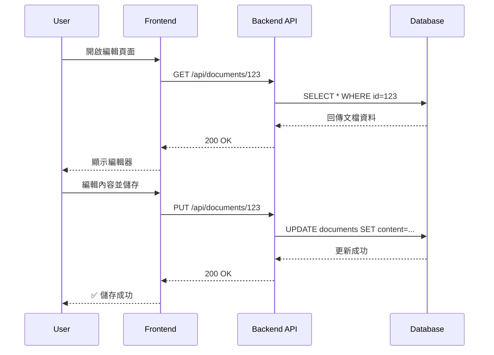
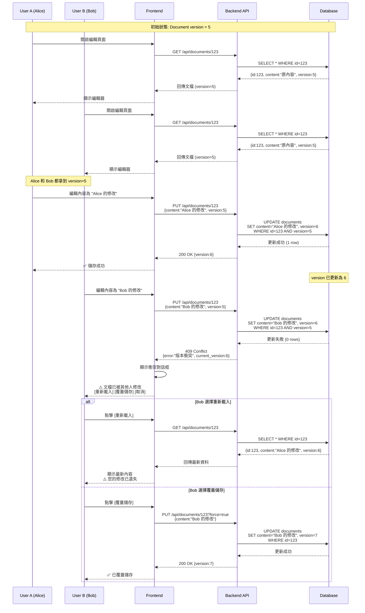

# 並發操作序列圖範本
# Concurrent Sequence Diagram Template

**文檔版本**: v1.0
**最後更新**: 2025-11-28
**適用 AISDLC 版本**: v0.09+
**文檔類型**: 技術設計文檔 | 並發處理設計
**文檔用途**: 記錄並發場景的交互流程與處理策略

---

## 📋 文檔資訊

| 項目 | 內容 |
|------|------|
| **專案名稱** | [專案名稱] |
| **並發場景** | [場景名稱,例如: 多使用者同時編輯文檔] |
| **涉及功能** | [功能模組名稱] |
| **相關 User Story** | [US-XXX, US-YYY] |
| **相關 API** | [API-XXX, API-YYY] |
| **負責人** | [SD/開發者姓名] |
| **創建日期** | YYYY-MM-DD |
| **審查狀態** | ⏳ 草稿 / ✅ 已審查 / 🚀 已實作 |

---

## 🎯 場景說明

### 場景描述

[詳細描述並發情況發生的業務場景]

**範例**:
> 在協作編輯系統中,當多個使用者同時開啟並編輯同一份文檔時,如果 User A 和 User B 都修改了文檔內容並嘗試儲存,系統需要避免資料覆蓋或不一致的問題。

### 並發類型

選擇適用的並發類型（可多選）:

- [ ] **多使用者競爭** - 多個使用者同時修改同一資源
- [ ] **多裝置同步** - 同一使用者在多裝置操作
- [ ] **快速連續操作** - 使用者快速點擊/提交表單
- [ ] **背景同步衝突** - 背景自動同步與使用者操作衝突
- [ ] **長時間操作中斷** - 長時間操作過程中資料被其他人修改

### 觸發條件

[描述什麼情況下會觸發此並發場景]

**範例**:
- User A 和 User B 同時開啟文檔編輯頁面 (間隔 < 5 分鐘)
- 兩人都進行編輯操作
- 兩人嘗試儲存的時間差 < 30 秒

### 影響範圍

| 影響面向 | 描述 |
|---------|------|
| **資料一致性** | [可能導致的資料不一致問題] |
| **使用者體驗** | [對使用者的影響] |
| **系統效能** | [對系統效能的影響] |
| **業務邏輯** | [對業務流程的影響] |

---

## ⚠️ 風險評估

### 風險等級

- [ ] **高 (High)** - 可能導致資料不一致、資料遺失或業務邏輯錯誤
- [ ] **中 (Medium)** - 可能影響使用者體驗但不影響資料正確性
- [ ] **低 (Low)** - 影響極小,僅造成輕微不便

### 風險分析

| 風險項目 | 描述 | 發生機率 | 影響程度 | 風險等級 |
|---------|------|---------|---------|---------|
| **資料覆蓋** | [後儲存覆蓋先儲存的資料] | 高/中/低 | 高/中/低 | P0/P1/P2 |
| **資料不一致** | [不同副本的資料不同步] | 高/中/低 | 高/中/低 | P0/P1/P2 |
| **重複操作** | [同一操作被執行多次] | 高/中/低 | 高/中/低 | P0/P1/P2 |
| **鎖定衝突** | [多個使用者互相等待] | 高/中/低 | 高/中/低 | P0/P1/P2 |

---

## 🛡️ 處理策略

### 採用策略

選擇適用的並發處理策略:

- [ ] **樂觀鎖 (Optimistic Locking)** - 版本號或時間戳記
- [ ] **悲觀鎖 (Pessimistic Locking)** - 資料庫行級鎖
- [ ] **防抖 (Debounce)** - 延遲執行,合併多次請求
- [ ] **節流 (Throttle)** - 限制執行頻率
- [ ] **唯一性約束 (Unique Constraint)** - 資料庫層級防重複
- [ ] **冪等性金鑰 (Idempotent Key)** - API 層級去重
- [ ] **分散式鎖 (Distributed Lock)** - Redis/ZooKeeper
- [ ] **最後寫入勝出 (Last Write Wins)** - 不做衝突檢測
- [ ] **CRDT (Conflict-free Replicated Data Type)** - 無衝突複製資料類型
- [ ] **其他**: [自訂策略名稱]

### 策略詳細說明

**策略名稱**: [選擇的策略名稱]

**選擇理由**:
- [為什麼選擇此策略]
- [此策略的優勢]
- [為什麼不選擇其他策略]

**實作層級**:

| 層級 | 實作方式 | 技術細節 |
|------|---------|---------|
| **前端 (Frontend)** | [實作描述] | [例如: debounce 500ms, 提交時禁用按鈕] |
| **後端 (Backend API)** | [實作描述] | [例如: 檢查 version 欄位,衝突時回傳 409] |
| **資料庫 (Database)** | [實作描述] | [例如: 新增 version INTEGER 欄位,預設值 1] |
| **快取 (Cache)** | [實作描述] | [例如: Redis SETNX 實作分散式鎖] |

---

## 📊 序列圖

### 正常流程（無並發）

[先展示沒有並發時的正常流程,作為對照]



---

### 並發流程（含衝突處理）

[展示並發情況下的完整處理流程,包含衝突偵測和解決]



---

### 額外場景圖（如適用）

[如果有其他重要的並發場景變化,可以新增更多序列圖]

**場景 2**: [場景名稱,例如: 網路延遲導致的重複提交]

```mermaid
[序列圖]
```

---

## 🔧 實作細節

### 資料結構變更

**新增欄位**:

```sql
-- 樂觀鎖範例: 新增 version 欄位
ALTER TABLE documents
ADD COLUMN version INTEGER NOT NULL DEFAULT 1;

-- 或使用時間戳記
ALTER TABLE documents
ADD COLUMN updated_at TIMESTAMP NOT NULL DEFAULT CURRENT_TIMESTAMP;
```

**索引建立**:

```sql
-- 如需唯一性約束
CREATE UNIQUE INDEX idx_unique_order_idempotency_key
ON orders(idempotency_key);
```

---

### API 規格變更

**請求變更**:

```http
# 原請求
PUT /api/documents/123
Content-Type: application/json

{
  "content": "修改後的內容"
}

# 新請求 (加入 version)
PUT /api/documents/123
Content-Type: application/json

{
  "content": "修改後的內容",
  "version": 5
}
```

**回應變更**:

```http
# 成功回應 (200 OK)
{
  "id": 123,
  "content": "修改後的內容",
  "version": 6,
  "updated_at": "2025-11-28T10:30:00Z"
}

# 衝突回應 (409 Conflict)
{
  "error": "VERSION_CONFLICT",
  "message": "文檔已被其他使用者修改",
  "current_version": 6,
  "your_version": 5,
  "conflict_resolution_options": ["reload", "force_overwrite"]
}
```

---

### 前端實作

**防抖範例** (Debounce):

```typescript
// 自動儲存功能,延遲 500ms 執行
import { debounce } from 'lodash';

const autoSave = debounce(async (content: string) => {
  try {
    await saveDocument(documentId, content, currentVersion);
  } catch (error) {
    if (error.status === 409) {
      // 處理版本衝突
      showConflictDialog(error.data);
    }
  }
}, 500);

// 每次內容變更時調用
editor.onChange((content) => {
  autoSave(content);
});
```

**樂觀鎖前端處理**:

```typescript
// 儲存文檔時帶上版本號
async function saveDocument(id: string, content: string, version: number) {
  try {
    const response = await api.put(`/api/documents/${id}`, {
      content,
      version
    });

    // 更新本地版本號
    currentVersion = response.data.version;
    showSuccess('儲存成功');

  } catch (error) {
    if (error.status === 409) {
      // 版本衝突
      const choice = await showConflictDialog({
        message: '文檔已被其他人修改',
        currentVersion: error.data.current_version
      });

      if (choice === 'reload') {
        // 重新載入最新版本
        await loadDocument(id);
      } else if (choice === 'force') {
        // 強制覆蓋
        await forceUpdateDocument(id, content);
      }
    } else {
      showError('儲存失敗');
    }
  }
}
```

---

### 後端實作

**樂觀鎖範例** (Node.js/Sequelize):

```javascript
// PUT /api/documents/:id
async function updateDocument(req, res) {
  const { id } = req.params;
  const { content, version } = req.body;

  try {
    // 使用樂觀鎖更新
    const [updatedRows] = await Document.update(
      {
        content,
        version: version + 1  // 版本號 +1
      },
      {
        where: {
          id,
          version  // 必須版本號匹配
        }
      }
    );

    if (updatedRows === 0) {
      // 版本不匹配,表示已被其他人修改
      const currentDoc = await Document.findByPk(id);

      return res.status(409).json({
        error: 'VERSION_CONFLICT',
        message: '文檔已被其他使用者修改',
        current_version: currentDoc.version,
        your_version: version
      });
    }

    // 更新成功
    const updated = await Document.findByPk(id);
    res.json(updated);

  } catch (error) {
    res.status(500).json({ error: '伺服器錯誤' });
  }
}
```

**冪等性金鑰範例** (Redis):

```javascript
// POST /api/orders
async function createOrder(req, res) {
  const idempotencyKey = req.headers['idempotency-key'];
  const orderData = req.body;

  if (!idempotencyKey) {
    return res.status(400).json({ error: '缺少 Idempotency-Key' });
  }

  try {
    // 檢查是否已處理過
    const cached = await redis.get(`order:${idempotencyKey}`);

    if (cached) {
      const result = JSON.parse(cached);
      // 回傳之前的結果
      return res.status(200).json({
        ...result,
        is_duplicate: true
      });
    }

    // 設定處理中狀態
    await redis.setex(`order:${idempotencyKey}`, 600, 'PROCESSING');

    // 建立訂單
    const order = await Order.create(orderData);

    // 快取結果 (24 小時)
    await redis.setex(
      `order:${idempotencyKey}`,
      86400,
      JSON.stringify({ order_id: order.id, status: 'created' })
    );

    res.status(201).json({
      order_id: order.id,
      status: 'created',
      is_duplicate: false
    });

  } catch (error) {
    // 清除處理中狀態
    await redis.del(`order:${idempotencyKey}`);
    res.status(500).json({ error: '訂單建立失敗' });
  }
}
```

---

## 🧪 測試策略

### 單元測試

**測試項目**:
- [ ] 正常情況下的版本號遞增
- [ ] 版本衝突時回傳 409 錯誤
- [ ] 強制更新時略過版本檢查
- [ ] 冪等性金鑰去重邏輯

**測試範例**:

```javascript
describe('Document Update - Optimistic Locking', () => {
  it('should update document when version matches', async () => {
    const doc = await Document.create({ content: 'initial', version: 1 });

    const result = await updateDocument(doc.id, {
      content: 'updated',
      version: 1
    });

    expect(result.version).toBe(2);
    expect(result.content).toBe('updated');
  });

  it('should return 409 when version conflict', async () => {
    const doc = await Document.create({ content: 'initial', version: 5 });

    const result = await updateDocument(doc.id, {
      content: 'updated',
      version: 3  // 過期版本
    });

    expect(result.status).toBe(409);
    expect(result.error).toBe('VERSION_CONFLICT');
  });
});
```

---

### 整合測試

**測試項目**:
- [ ] 模擬多個使用者同時編輯
- [ ] 測試衝突提示與解決流程
- [ ] 驗證資料最終一致性

**測試範例**:

```javascript
describe('Concurrent Edit Integration Test', () => {
  it('should handle concurrent edits correctly', async () => {
    // User A 和 User B 同時取得文檔
    const [docA, docB] = await Promise.all([
      api.get('/api/documents/123'),
      api.get('/api/documents/123')
    ]);

    expect(docA.version).toBe(docB.version); // 同版本

    // User A 先儲存
    const resultA = await api.put('/api/documents/123', {
      content: 'A的修改',
      version: docA.version
    });
    expect(resultA.status).toBe(200);

    // User B 後儲存 (使用舊版本)
    const resultB = await api.put('/api/documents/123', {
      content: 'B的修改',
      version: docB.version
    });
    expect(resultB.status).toBe(409); // 衝突
  });
});
```

---

### 壓力測試

**測試項目**:
- [ ] 高並發下的鎖定機制穩定性
- [ ] 資料庫連線池處理能力
- [ ] 快取系統回應速度

**測試工具**: JMeter, k6, Apache Bench

**測試場景**:
- 100 個並發使用者同時更新同一文檔
- 1000 TPS 的訂單提交請求
- 持續 5 分鐘的高負載測試

---

## 📝 使用者體驗設計

### 衝突提示介面

**設計原則**:
- 清楚說明衝突原因
- 提供多種解決選項
- 避免資料遺失

**UI 範例**:

```
┌──────────────────────────────────────┐
│  ⚠️  文檔已被其他人修改              │
├──────────────────────────────────────┤
│                                      │
│  您正在編輯的文檔已被 Alice 於       │
│  2025-11-28 10:30 更新。             │
│                                      │
│  您的版本: v5                        │
│  目前版本: v6                        │
│                                      │
│  請選擇處理方式:                     │
│                                      │
│  [🔄 重新載入]  [⚠️ 覆蓋儲存]  [✖ 取消] │
│                                      │
│  提示: 選擇「覆蓋儲存」將遺失 Alice   │
│        的修改,請謹慎使用。           │
└──────────────────────────────────────┘
```

### 防抖提示

**使用者回饋**:
- 自動儲存中: 顯示「儲存中...」提示
- 儲存成功: 顯示 Toast 通知「已自動儲存」
- 儲存失敗: 顯示錯誤並提供重試選項

---

## 📚 相關文檔

### 追蹤關係

| 文檔類型 | 文檔 ID | 文檔名稱 | 關係 |
|---------|--------|---------|------|
| **上游文檔** | US-XXX | [User Story] | 此序列圖實現的功能 |
| **平行文檔** | API-XXX | [API 規格] | 定義的 API 介面 |
| **下游文檔** | TC-XXX | [測試案例] | 驗證此設計的測試 |

### 參考資料

- [FE-BE Interaction Analysis](../../workflow/core/interaction-analysis.md) - 交互分析 Workflow
- [API Specification Template](./API_Specification_Template.md) - API 規格範本
- [Data Access Layer Template](./Data_Access_Layer_Template.md) - 資料存取層設計

### 決策記錄

如有相關的架構決策記錄 (ADR),請列於此:

- [ADR-XXX: 選擇樂觀鎖而非悲觀鎖的原因](../../docs/adr/ADR-XXX.md)

---

## ✅ 審查檢查清單

### 設計審查

- [ ] 並發場景識別完整且準確
- [ ] 風險評估合理
- [ ] 處理策略選擇恰當
- [ ] 序列圖清晰展示並發流程
- [ ] 衝突解決機制明確

### 技術審查

- [ ] 資料庫欄位設計正確
- [ ] API 介面設計符合規範
- [ ] 前端實作邏輯清晰
- [ ] 後端實作考慮效能與穩定性
- [ ] 錯誤處理完整

### 測試審查

- [ ] 測試策略涵蓋主要場景
- [ ] 單元測試覆蓋核心邏輯
- [ ] 整合測試驗證並發行為
- [ ] 壓力測試評估系統負載能力

---

## 📌 版本歷史

| 版本 | 日期 | 修改人 | 修改內容 |
|------|------|--------|---------|
| v1.0 | 2025-11-28 | [SD 姓名] | 初始版本 |
| v1.1 | YYYY-MM-DD | [修改人] | [修改說明] |

---

**文檔維護者**: [SD 姓名]
**最後審查日期**: YYYY-MM-DD
**審查人員**: [審查者姓名]

---

## 📖 使用說明

### 如何使用本範本

1. **複製本範本** 並重新命名為具體場景,例如: `Concurrent_Edit_Document.md`

2. **填寫文檔資訊** 包括專案名稱、並發場景、相關 User Story 等

3. **詳細描述場景** 說明並發情況、觸發條件、影響範圍

4. **評估風險** 分析可能的風險項目及其嚴重程度

5. **選擇處理策略** 根據場景特性選擇合適的並發處理策略

6. **繪製序列圖** 使用 Mermaid 繪製詳細的並發操作序列圖

7. **撰寫實作細節** 包含資料庫變更、API 規格、前後端程式碼範例

8. **規劃測試** 定義單元測試、整合測試、壓力測試策略

9. **審查與批准** 經 SD、SA、QA 審查後標記為「已審查」

10. **實作與追蹤** 實作完成後更新狀態為「已實作」並記錄版本歷史

---

**本範本適用於**: AISDLC v0.09+
**相關 Workflow**: [FE-BE Interaction Analysis](../../workflow/core/interaction-analysis.md)
**範本維護者**: AISDLC Framework Team
