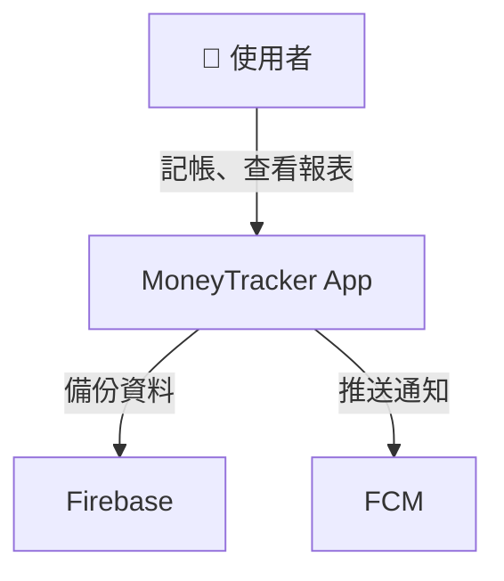

# C4 Model Guidelines
# C4 Model 架構設計指南

> **文檔版本**: v1.0
> **適用框架**: AISDLC v0.09
> **建立日期**: 2025-11-12
> **最後更新**: 2025-11-12
> **維護者**: SD Agent (Marcus)

---

## 📋 目的 (Purpose)

本文檔提供 **C4 Model (Context, Container, Component, Code)** 的使用指南，協助 **SD-Architect Agent** 與開發團隊：

1. **統一架構視覺化語言**：建立共同的架構溝通方式
2. **分層次設計架構**：從宏觀到微觀，循序漸進設計系統
3. **選擇適當層級**：根據專案規模與複雜度，決定需要哪些層級
4. **提升溝通效率**：讓技術與非技術人員都能理解架構
5. **文檔化架構決策**：記錄為什麼這樣設計，便於後續維護

---

## 🎯 適用範圍 (Scope)

本指南適用於：

- ✅ **Greenfield (新專案)**：從零開始設計架構
- ✅ **Brownfield (舊專案重構)**：梳理既有系統架構
- ✅ **技術方案評估**：比較不同架構選擇
- ✅ **團隊知識傳承**：新成員快速理解系統架構

**不適用**：
- ❌ 純業務流程圖（使用 BPMN）
- ❌ 資料庫 ER 圖（使用 ERD）
- ❌ 使用者體驗流程（使用 User Flow）

---

## 📚 什麼是 C4 Model？ (What is C4 Model?)

**C4 Model** 由 Simon Brown 於 2006 年提出，是一種 **軟體架構視覺化方法**，靈感來自 **Google Maps** 的縮放概念：

```
Level 1: Context (背景)     → 🗺️ 世界地圖 (誰使用系統？系統與外部如何互動？)
Level 2: Container (容器)   → 🏙️ 城市地圖 (系統由哪些容器組成？)
Level 3: Component (元件)   → 🏘️ 街區地圖 (容器內有哪些元件？)
Level 4: Code (程式碼)      → 🏠 建築藍圖 (元件如何實作？)
```

**核心概念**：
- **漸進式細化**：從高階概觀逐步深入細節
- **關注受眾**：不同層級適合不同角色（CEO vs 開發者）
- **適度建模**：只畫需要的層級，避免過度設計

---

## 🏗️ 第一部分：C4 Model 四個層級詳解

### Level 1: System Context Diagram (系統背景圖)

#### 📋 定義
- **目的**：展示系統在更大環境中的位置，回答「**這個系統與誰互動？**」
- **受眾**：所有人（包含非技術人員、管理層、產品經理）
- **粒度**：最粗略，只顯示系統邊界與外部實體

#### 📦 圖形元素

| 元素類型 | 符號 | 說明 |
|---------|-----|------|
| **Person (使用者)** | 👤 人形圖示 | 系統的使用者 (可以是真人或其他系統的使用者角色) |
| **Software System (軟體系統)** | ▭ 矩形方框 | 你正在開發的系統 (通常標記為藍色或高亮) |
| **External System (外部系統)** | ▭ 矩形方框 | 其他系統 (通常標記為灰色) |
| **Relationship (關係)** | → 箭頭 | 互動關係，箭頭上標註互動內容 |

#### 🎨 範例：MoneyTracker System Context

```
┌────────────────────────────────────────────────────────────┐
│                      System Context                        │
└────────────────────────────────────────────────────────────┘

   👤 使用者
   (User)
      │
      │ 記帳、查看報表、設定預算
      ↓
   ┌──────────────────────┐
   │  MoneyTracker App    │ ←──── 你正在開發的系統
   │  [Software System]   │
   └──────────────────────┘
      │                    │
      │ 備份資料            │ 推送通知
      ↓                    ↓
   ┌──────────────┐     ┌────────────────┐
   │  Firebase    │     │  FCM           │
   │ [External]   │     │ [External]     │
   └──────────────┘     └────────────────┘
```

**文字描述**：
- **MoneyTracker App**: 個人記帳 App，幫助使用者記錄支出與收入
- **使用者**: 想要管理個人財務的人
- **Firebase**: 提供雲端備份與同步服務
- **FCM (Firebase Cloud Messaging)**: 推送預算超支提醒通知

#### ✅ Level 1 檢查清單

- [ ] 是否清楚標示「你的系統」與「外部系統」？
- [ ] 是否列出所有使用者類型？
- [ ] 是否標註所有外部系統的互動方式？
- [ ] 非技術人員是否能看懂？

---

### Level 2: Container Diagram (容器圖)

#### 📋 定義
- **目的**：展示系統內部的「容器」(Container)，回答「**系統由哪些部分組成？**」
- **受眾**：技術團隊（開發者、架構師、DevOps）
- **粒度**：顯示可獨立部署的單元（如 Web App、Mobile App、API Server、Database）

> **容器 (Container)** ≠ Docker Container，而是指「**可獨立執行的單元**」

#### 📦 圖形元素

| 元素類型 | 符號 | 說明 |
|---------|-----|------|
| **Person (使用者)** | 👤 人形圖示 | 與 Level 1 相同 |
| **Container (容器)** | ▭ 矩形方框 | 可獨立部署的單元，需標註技術棧 |
| **Database (資料庫)** | 🗄️ 圓柱體圖示 | 資料儲存容器 |
| **External System** | ▭ 矩形方框 | 外部系統 |
| **Relationship** | → 箭頭 | 互動關係，標註協議 (HTTP, WebSocket, SQL) |

#### 🎨 範例：MoneyTracker Container Diagram

```
┌────────────────────────────────────────────────────────────┐
│                     Container Diagram                      │
└────────────────────────────────────────────────────────────┘

   👤 使用者 (iOS/Android 手機)
      │
      │ 使用
      ↓
   ┌─────────────────────────────┐
   │  Mobile App                 │
   │  [Container: React Native]  │ ←─── 前端容器
   └─────────────────────────────┘
      │
      │ HTTPS/JSON (RESTful API)
      ↓
   ┌─────────────────────────────┐
   │  API Server                 │
   │  [Container: Node.js]       │ ←─── 後端容器
   └─────────────────────────────┘
      │                    │
      │ SQL Queries        │ Firebase SDK
      ↓                    ↓
   ┌──────────────┐     ┌────────────────┐
   │  Database    │     │  Firebase      │
   │ [PostgreSQL] │     │ [External]     │
   └──────────────┘     └────────────────┘
```

**容器詳細說明**：

| 容器名稱 | 技術棧 | 職責 | 部署方式 |
|---------|-------|------|---------|
| **Mobile App** | React Native | 使用者介面、本地儲存 (SQLite) | iOS App Store / Google Play |
| **API Server** | Node.js + Express | 業務邏輯、資料驗證、權限控管 | AWS EC2 / Heroku |
| **Database** | PostgreSQL | 持久化儲存使用者資料 | AWS RDS |
| **Firebase** | Firebase SDK | 雲端備份、推送通知 | Google Firebase |

#### ✅ Level 2 檢查清單

- [ ] 是否列出所有可獨立部署的容器？
- [ ] 是否標註每個容器的技術棧？
- [ ] 是否標註容器間的通訊協議 (HTTP, gRPC, WebSocket)？
- [ ] 是否標示資料儲存容器？

**🆕 v0.09 安全元件強制檢查** (參考 [Security_Architecture_Checklist.md](./Security_Architecture_Checklist.md)):
- [ ] **認證與授權容器**: Authentication Service / Authorization Engine 已標示
- [ ] **加密容器**: TLS/SSL Termination / Encryption Service / KMS 已標示
- [ ] **輸入防護容器**: API Gateway / WAF / Input Validation Service 已標示
- [ ] **日誌與審計容器**: Centralized Logging Service / Audit Trail Database 已標示

**🆕 v0.09 高可用性容器強制檢查** (參考 [High_Availability_Architecture_Checklist.md](./High_Availability_Architecture_Checklist.md)):
- [ ] **負載均衡器容器**: Application Load Balancer (ALB/NGINX) 已標示
- [ ] **多實例容器**: Application Server ≥ 2 instances, Multi-AZ 部署已標示
- [ ] **資料庫 HA 容器**: Master-Slave Replication, Read Replicas 已標示
- [ ] **快取 HA 容器**: Redis Cluster/Sentinel, Message Queue Cluster 已標示

---

### Level 3: Component Diagram (元件圖)

#### 📋 定義
- **目的**：展示單一容器內的「元件」(Component)，回答「**這個容器內有哪些模組？**」
- **受眾**：開發團隊
- **粒度**：顯示容器內的主要模組/類別群組

> **元件 (Component)** = 一組相關的功能模組 (如 Controller, Service, Repository)

#### 📦 圖形元素

| 元素類型 | 符號 | 說明 |
|---------|-----|------|
| **Component (元件)** | ▭ 矩形方框 | 容器內的主要模組 |
| **Relationship** | → 箭頭 | 元件間的依賴關係 |

#### 🎨 範例：MoneyTracker API Server Component Diagram

```
┌────────────────────────────────────────────────────────────┐
│       Component Diagram: API Server (Node.js)              │
└────────────────────────────────────────────────────────────┘

   👤 Mobile App
      │
      │ HTTPS/JSON
      ↓
   ┌─────────────────────────────┐
   │  API Gateway                │
   │  [Component: Express Router]│
   └─────────────────────────────┘
      │
      ├──→ ┌─────────────────────────┐
      │    │ Transaction Controller  │
      │    │ [Component]             │
      │    └─────────────────────────┘
      │           │
      │           ↓
      │    ┌─────────────────────────┐
      │    │ Transaction Service     │
      │    │ [Component]             │
      │    └─────────────────────────┘
      │           │
      │           ↓
      │    ┌─────────────────────────┐
      │    │ Transaction Repository  │
      │    │ [Component]             │
      │    └─────────────────────────┘
      │           │
      ├──→ ┌─────────────────────────┐
      │    │ Budget Controller       │
      │    │ [Component]             │
      │    └─────────────────────────┘
      │           │
      └──→ ┌─────────────────────────┐
           │ Auth Middleware         │
           │ [Component]             │
           └─────────────────────────┘
                  │
                  ↓
           ┌─────────────────────────┐
           │ Database                │
           │ [PostgreSQL]            │
           └─────────────────────────┘
```

**元件職責說明**：

| 元件名稱 | 職責 | 依賴 |
|---------|-----|------|
| **API Gateway** | 路由請求到對應的 Controller | Express Router |
| **Transaction Controller** | 處理記帳相關的 HTTP 請求 | Transaction Service |
| **Transaction Service** | 業務邏輯（如計算總支出、分類統計） | Transaction Repository |
| **Transaction Repository** | 資料存取層 (Data Access Layer) | PostgreSQL |
| **Budget Controller** | 處理預算設定與提醒 | Budget Service |
| **Auth Middleware** | JWT Token 驗證、權限檢查 | JWT Library |

#### ✅ Level 3 檢查清單

- [ ] 是否清楚劃分層級 (Controller → Service → Repository)？
- [ ] 是否標註元件間的依賴關係？
- [ ] 是否避免迴圈依賴？
- [ ] 是否符合「單一職責原則」(每個元件只做一件事)？

**🆕 v0.09 安全元件強制檢查** (參考 [Security_Architecture_Checklist.md](./Security_Architecture_Checklist.md)):
- [ ] **認證與授權元件**: JWT Handler / Permission Checker / MFA Component 已設計
- [ ] **加密元件**: Password Hash / Data Encryption / HTTPS Redirect Component 已設計
- [ ] **輸入驗證元件**: Request Validator / SQL Injection Prevention / XSS Prevention / CSRF Prevention Component 已設計
- [ ] **日誌與審計元件**: Security Event Logger / Audit Trail / Data Masking / Anomaly Detection Component 已設計

**🆕 v0.09 高可用性架構強制檢查** (參考 [High_Availability_Architecture_Checklist.md](./High_Availability_Architecture_Checklist.md)):
- [ ] **HA 架構設計**: Multi-AZ 部署、Auto Scaling、Failover 機制已設計
- [ ] **部署架構圖**: Deployment Diagram 包含 Load Balancer、Multi-Instance、Replication 已繪製
- [ ] **災難復原計畫**: RTO/RPO 目標、Backup Strategy、DR 測試計畫已撰寫
- [ ] **SLA 計算**: 整體系統 SLA 已計算，識別瓶頸元件並提出改進方案

---

### Level 4: Code Diagram (程式碼圖)

#### 📋 定義
- **目的**：展示單一元件的內部實作，通常使用 **UML 類別圖**
- **受眾**：開發者
- **粒度**：最細緻，顯示類別、介面、方法、屬性及其關係

> **重要原則**：Level 4 通常由 IDE 自動生成（如 IntelliJ IDEA, Visual Studio），**不建議手動維護**

#### 🎯 何時使用 Level 4？

**建議使用的場景**：
- ✅ **複雜設計模式實作**：使用 Factory, Strategy, Observer 等設計模式的元件
- ✅ **核心業務邏輯**：包含複雜業務規則的類別，需要清楚說明
- ✅ **新成員培訓**：幫助新加入團隊的開發者理解關鍵元件
- ✅ **Code Review 前準備**：重要功能上線前，用圖表輔助審查
- ✅ **技術文檔化**：需要長期維護的核心元件

**不建議使用的場景**：
- ❌ **簡單 CRUD 操作**：標準的增刪改查邏輯不需要 Level 4
- ❌ **工具類別 (Utility Classes)**：靜態方法集合無需詳細圖表
- ❌ **臨時性程式碼**：實驗性或臨時功能
- ❌ **頻繁變動的模組**：維護成本過高

#### 🛠️ IDE 自動生成 Level 4 圖的工具

| IDE / 工具 | 支援語言 | 操作方式 | 輸出格式 |
|-----------|---------|---------|---------|
| **IntelliJ IDEA** | Java, Kotlin | 右鍵 → Diagrams → Show Diagram | PNG, SVG, PlantUML |
| **Visual Studio** | C#, VB.NET | Class Designer (內建) | PNG, SVG |
| **Eclipse** | Java | Plugins: ObjectAid UML Explorer | UML, PNG |
| **VS Code** | 多語言 | Extension: PlantUML, Mermaid | PlantUML, Mermaid |
| **PyCharm** | Python | 右鍵 → Diagrams → Show Diagram | PNG, SVG, PlantUML |
| **Doxygen** | C++, Java, Python | 自動文檔生成工具 | HTML, PDF |

#### 📋 Level 4 維護策略

**原則**：Level 4 應該「按需生成、快照保存」，而非「持續手動維護」

| 策略 | 說明 | 適用場景 |
|------|-----|---------|
| **即時生成** | 需要時透過 IDE 生成，不儲存到 Git | 日常開發、快速查閱 |
| **快照保存** | 重要版本發布時生成快照，存入 `/docs/architecture/` | 版本里程碑、重大重構 |
| **自動化生成** | CI/CD 流程中自動生成並發佈到文檔網站 | 大型專案、持續文檔化需求 |

**檔案命名規範**：
```
04_code_diagram_{元件名稱}_{版本}.png
範例: 04_code_diagram_TransactionService_v1.2.png
```

#### 📦 圖形元素

| 元素類型 | 符號 | 說明 |
|---------|-----|------|
| **Class (類別)** | ▭ 矩形方框 | 包含屬性與方法 |
| **Interface (介面)** | ▭ 矩形方框 + `<<interface>>` | 抽象介面 |
| **Relationship** | → 箭頭 | 繼承、實作、依賴、關聯 |

#### 🎨 範例：TransactionService 類別圖

```
┌────────────────────────────────────────────────────────────┐
│       Code Diagram: TransactionService (UML Class)         │
└────────────────────────────────────────────────────────────┘

   ┌────────────────────────────────┐
   │  <<interface>>                 │
   │  ITransactionRepository        │
   ├────────────────────────────────┤
   │ + create(data): Transaction    │
   │ + findById(id): Transaction    │
   │ + findAll(): Transaction[]     │
   │ + update(id, data): Transaction│
   │ + delete(id): boolean          │
   └────────────────────────────────┘
              △ (實作)
              │
   ┌────────────────────────────────┐
   │  TransactionRepository         │
   ├────────────────────────────────┤
   │ - db: DatabaseConnection       │
   ├────────────────────────────────┤
   │ + create(data): Transaction    │
   │ + findById(id): Transaction    │
   │ + findAll(): Transaction[]     │
   │ + update(id, data): Transaction│
   │ + delete(id): boolean          │
   └────────────────────────────────┘
              △ (依賴)
              │
   ┌────────────────────────────────┐
   │  TransactionService            │
   ├────────────────────────────────┤
   │ - repo: ITransactionRepository │
   ├────────────────────────────────┤
   │ + addTransaction(data): void   │
   │ + getTransactionById(id): Tx   │
   │ + calculateTotalExpense(): num │
   │ + getCategoryStats(): Stats[]  │
   └────────────────────────────────┘
```

#### 🎨 範例 2：設計模式應用（Strategy Pattern）

**場景**：MoneyTracker 支援多種匯率計算策略（固定匯率、即時匯率、歷史匯率）

```
┌────────────────────────────────────────────────────────────┐
│    Code Diagram: ExchangeRateService (Strategy Pattern)   │
└────────────────────────────────────────────────────────────┘

   ┌────────────────────────────────┐
   │  <<interface>>                 │
   │  IExchangeRateStrategy         │
   ├────────────────────────────────┤
   │ + getRate(from, to): number    │
   └────────────────────────────────┘
              △ (實作)
              │
      ┌───────┴───────────┬──────────────┐
      │                   │              │
┌─────────────┐   ┌──────────────┐  ┌────────────────┐
│ FixedRate   │   │ RealTimeRate │  │ HistoricalRate │
│ Strategy    │   │ Strategy     │  │ Strategy       │
├─────────────┤   ├──────────────┤  ├────────────────┤
│ - rates:Map │   │ - apiClient  │  │ - dbRepo       │
├─────────────┤   ├──────────────┤  ├────────────────┤
│ + getRate() │   │ + getRate()  │  │ + getRate()    │
└─────────────┘   └──────────────┘  └────────────────┘
      △                  △                   △
      └──────────────────┴───────────────────┘
                         │ (依賴)
              ┌────────────────────────────┐
              │ ExchangeRateService        │
              ├────────────────────────────┤
              │ - strategy: IExchangeRate  │
              ├────────────────────────────┤
              │ + setStrategy(s): void     │
              │ + convert(amount, ...): $  │
              └────────────────────────────┘
```

**說明**：
- **設計模式**: Strategy Pattern（策略模式）
- **優點**: 易於擴充新的匯率策略，符合開放封閉原則
- **使用時機**: 當需要靈活切換不同算法或行為時

---

#### 🎨 範例 3：複雜業務邏輯（Factory Pattern）

**場景**：根據不同交易類型創建對應的 Transaction 物件

```
┌────────────────────────────────────────────────────────────┐
│    Code Diagram: TransactionFactory (Factory Pattern)     │
└────────────────────────────────────────────────────────────┘

                ┌────────────────────────────┐
                │ <<abstract>>               │
                │ Transaction                │
                ├────────────────────────────┤
                │ # id: string               │
                │ # amount: number           │
                │ # date: Date               │
                ├────────────────────────────┤
                │ + validate(): boolean      │
                │ + calculateFee(): number   │ (抽象方法)
                └────────────────────────────┘
                          △ (繼承)
                          │
      ┌───────────────────┼───────────────────┐
      │                   │                   │
┌─────────────┐   ┌──────────────┐   ┌──────────────┐
│ Income      │   │ Expense      │   │ Transfer     │
│ Transaction │   │ Transaction  │   │ Transaction  │
├─────────────┤   ├──────────────┤   ├──────────────┤
│ + source    │   │ + category   │   │ + fromAcct   │
│             │   │              │   │ + toAcct     │
├─────────────┤   ├──────────────┤   ├──────────────┤
│ + calcFee() │   │ + calcFee()  │   │ + calcFee()  │
└─────────────┘   └──────────────┘   └──────────────┘
      △                  △                   △
      └──────────────────┴───────────────────┘
                         │ (創建)
              ┌────────────────────────────┐
              │ TransactionFactory         │
              ├────────────────────────────┤
              │ (靜態工廠方法)              │
              ├────────────────────────────┤
              │ + create(type, data): Tx   │
              └────────────────────────────┘
```

**說明**：
- **設計模式**: Factory Pattern（工廠模式）+ Template Method Pattern（模板方法模式）
- **優點**: 封裝物件創建邏輯，避免客戶端直接依賴具體類別
- **使用時機**: 當有多種類別需要根據條件動態創建時

---

#### 📊 Level 4 與其他工具的整合

**1. 與 PlantUML 整合（自動化文檔）**

```bash
# 安裝 PlantUML CLI
brew install plantuml  # macOS
apt-get install plantuml  # Linux

# 生成類別圖
plantuml code_diagram.puml

# 整合到 CI/CD
# .github/workflows/docs.yml
- name: Generate UML Diagrams
  run: |
    find docs -name "*.puml" -exec plantuml {} \;
```

**2. 與 Doxygen 整合（C++/Java 自動文檔）**

```bash
# 安裝 Doxygen
brew install doxygen graphviz

# 配置 Doxyfile
doxygen -g  # 生成配置文件

# 關鍵配置項
EXTRACT_ALL            = YES
UML_LOOK              = YES
HAVE_DOT              = YES
CALL_GRAPH            = YES
CALLER_GRAPH          = YES

# 生成文檔
doxygen Doxyfile
```

**3. 與 Swagger/OpenAPI 整合（API 類別）**

```yaml
# 在 API 文檔中引用 UML 類別圖
components:
  schemas:
    Transaction:
      type: object
      x-uml-diagram: "./docs/architecture/04_code_diagram_Transaction.png"
      properties:
        id:
          type: string
        amount:
          type: number
```

---

#### ✅ Level 4 檢查清單

**基礎要求**：
- [ ] 是否清楚標註類別屬性與方法？
- [ ] 是否標註訪問修飾符（public +, private -, protected #）？
- [ ] 是否標註類別間的關係（繼承、實作、組合、聚合、依賴）？
- [ ] 箭頭方向是否正確？

**進階要求**：
- [ ] 是否使用介面 (Interface) 實現依賴反轉？
- [ ] 是否標註重要的設計模式？
- [ ] 是否避免手動維護（由 IDE 自動生成）？
- [ ] 是否在版本發布時保存快照到文檔目錄？

**複雜度控制**：
- [ ] 單張圖的類別數量是否適中（建議 3-8 個）？
- [ ] 是否隱藏不重要的細節（如 getter/setter）？
- [ ] 是否將複雜圖拆分為多張子圖？

**文檔化檢查**：
- [ ] 是否附有文字說明（設計意圖、使用場景）？
- [ ] 是否註明圖表生成日期和工具？
- [ ] 是否與程式碼保持同步（或說明為快照）？

---

## 📏 第二部分：如何選擇 C4 層級？ (Which Levels to Use?)

### 2.1 依專案規模選擇

| 專案規模 | 描述 | 建議層級 | 原因 |
|---------|-----|---------|-----|
| **極小型** | 單人開發、≤ 3 個功能 | Level 1 | 系統簡單，不需詳細架構圖 |
| **小型** | 2-3 人團隊、≤ 10 個功能 | Level 1 + Level 2 | 需說明容器分工 (前端/後端/資料庫) |
| **中型** | 5-10 人團隊、10-30 個功能 | Level 1 + Level 2 + Level 3 | 需說明模組劃分與職責 |
| **大型** | 10+ 人團隊、30+ 個功能 | Level 1 + Level 2 + Level 3 + (部分) Level 4 | 複雜系統需細緻設計 |

---

### 2.2 依專案類型選擇

| 專案類型 | 建議層級 | 原因 |
|---------|---------|-----|
| **Greenfield (新專案)** | Level 1 → Level 2 → Level 3 | 從宏觀設計到細節實作 |
| **Brownfield (舊系統重構)** | Level 2 → Level 3 | 梳理既有架構，識別改進點 |
| **第三方整合** | Level 1 + Level 2 | 重點在系統邊界與外部互動 |
| **微服務架構** | Level 1 + Level 2 (多個) | 每個微服務需獨立 Container Diagram |

---

### 2.3 依受眾選擇

| 受眾 | 建議層級 | 原因 |
|-----|---------|-----|
| **CEO / 產品經理** | Level 1 | 只需理解系統與外部如何互動 |
| **BA / PM** | Level 1 + Level 2 | 理解系統組成與技術棧 |
| **SD-Architect** | Level 1 + Level 2 + Level 3 | 設計整體架構 |
| **開發者** | Level 2 + Level 3 + (部分) Level 4 | 實作細節 |
| **DevOps** | Level 2 | 理解部署單元與基礎設施需求 |

---

## 🎨 第三部分：繪製 C4 圖的工具與方法 (Tools & Methods)

### 3.1 推薦工具

| 工具 | 類型 | 優點 | 缺點 | 適用場景 |
|-----|------|-----|------|---------|
| **Structurizr** | 程式碼定義架構圖 (DSL) | 版本控制友善、自動排版 | 學習曲線高 | 大型專案、需版本追蹤 |
| **draw.io (diagrams.net)** | 拖拉式繪圖工具 | 免費、易上手、整合 VSCode | 手動排版費時 | 快速草圖、中小型專案 |
| **PlantUML** | 程式碼定義圖表 | 版本控制友善、支援多種圖 | 排版不夠美觀 | 技術團隊、CI/CD 整合 |
| **Mermaid** | Markdown 內嵌圖表 | 輕量、整合 GitHub/GitLab | 功能有限 | 文檔內嵌圖表 |
| **Lucidchart** | 線上繪圖工具 | 美觀、協作方便 | 付費 | 商業專案、多人協作 |

---

### 3.2 Structurizr DSL 範例

**Structurizr** 使用 **DSL (Domain Specific Language)** 定義架構圖，支援自動生成 C4 圖。

**範例：MoneyTracker Workspace**

```dsl
workspace "MoneyTracker" "個人記帳 App" {
    model {
        user = person "使用者" "想要管理個人財務的人"

        moneytracker = softwareSystem "MoneyTracker App" "個人記帳 App" {
            mobileApp = container "Mobile App" "使用者介面" "React Native"
            apiServer = container "API Server" "業務邏輯與資料驗證" "Node.js + Express"
            database = container "Database" "持久化儲存" "PostgreSQL" "Database"
        }

        firebase = softwareSystem "Firebase" "雲端備份與推送通知" "External"

        user -> mobileApp "使用"
        mobileApp -> apiServer "呼叫 API (HTTPS/JSON)"
        apiServer -> database "讀寫資料 (SQL)"
        apiServer -> firebase "備份與推送 (Firebase SDK)"
    }

    views {
        systemContext moneytracker "SystemContext" {
            include *
            autoLayout
        }

        container moneytracker "Containers" {
            include *
            autoLayout
        }

        styles {
            element "Software System" {
                background #1168bd
                color #ffffff
            }
            element "External" {
                background #999999
                color #ffffff
            }
            element "Person" {
                shape person
                background #08427b
                color #ffffff
            }
            element "Database" {
                shape cylinder
            }
        }
    }
}
```

**生成圖表**：
1. 將 DSL 儲存為 `workspace.dsl`
2. 使用 Structurizr CLI 生成圖表：
   ```bash
   structurizr-cli push -workspace workspace.dsl
   ```

---

### 3.3 PlantUML 範例

**PlantUML** 使用簡單的文字語法定義圖表，適合整合到 CI/CD。

**範例：Level 2 Container Diagram**

```plantuml
@startuml MoneyTracker_Container
!include https://raw.githubusercontent.com/plantuml-stdlib/C4-PlantUML/master/C4_Container.puml

Person(user, "使用者", "想要管理個人財務的人")

System_Boundary(moneytracker, "MoneyTracker App") {
    Container(mobile, "Mobile App", "React Native", "使用者介面、本地儲存")
    Container(api, "API Server", "Node.js + Express", "業務邏輯、資料驗證")
    ContainerDb(db, "Database", "PostgreSQL", "持久化儲存使用者資料")
}

System_Ext(firebase, "Firebase", "雲端備份與推送通知")

Rel(user, mobile, "使用")
Rel(mobile, api, "呼叫 API", "HTTPS/JSON")
Rel(api, db, "讀寫資料", "SQL")
Rel(api, firebase, "備份與推送", "Firebase SDK")

@enduml
```

**生成圖表**：
```bash
plantuml MoneyTracker_Container.puml
```

---

### 3.4 Mermaid 範例 (Markdown 內嵌)

**Mermaid** 語法輕量，可直接內嵌在 Markdown 文件中，GitHub/GitLab 原生支援。

**範例：Level 1 System Context**

```markdown
# MoneyTracker 架構

## System Context Diagram

\```mermaid
graph TD
    User[👤 使用者] -->|記帳、查看報表| MoneyTracker[MoneyTracker App]
    MoneyTracker -->|備份資料| Firebase[Firebase]
    MoneyTracker -->|推送通知| FCM[FCM]
\```
```

**渲染效果**（在 GitHub README.md 中會自動渲染）：



---

## 📋 第四部分：AISDLC 框架中的 C4 使用指南

### 4.1 在 Greenfield SOP 中的應用

| AISDLC 階段 | C4 層級 | 時機 | 輸出文檔 |
|-----------|---------|-----|---------|
| **階段 3: 技術選型** | Level 1 | 確認外部依賴（第三方 API、雲端服務） | SRD (System Requirements Document) |
| **階段 5: 架構設計** | Level 2 | 決定容器劃分（前端/後端/資料庫） | SRD (System Architecture Section) |
| **階段 5: 架構設計** | Level 3 | 設計模組劃分（Controller/Service/Repository） | SRD (Component Design Section) |
| **階段 6: 實作** | Level 4 (選用) | 複雜模組需 UML 類別圖 | Code Comments / Wiki |

---

### 4.2 SD-Architect Agent 的職責

**Marcus (SD-Architect Agent)** 在 AISDLC 中負責：

1. **繪製 Level 1 (System Context)**：
   - 輸入：PRD, FRD
   - 輸出：系統背景圖，標註所有外部依賴

2. **繪製 Level 2 (Container Diagram)**：
   - 輸入：技術選型決策
   - 輸出：容器架構圖，標註技術棧與通訊協議

3. **繪製 Level 3 (Component Diagram)**：
   - 輸入：功能需求 (FRD)
   - 輸出：元件設計圖，標註模組職責與依賴

4. **更新架構圖**：
   - 當需求變更時，更新對應的 C4 圖
   - 維護架構決策記錄 (ADR)

---

### 4.3 架構圖文檔化標準

**儲存位置**：

```
project/
├── docs/
│   ├── architecture/
│   │   ├── 01_system_context.png
│   │   ├── 02_container_diagram.png
│   │   ├── 03_component_diagram_api_server.png
│   │   ├── workspace.dsl (Structurizr DSL)
│   │   └── README.md (架構說明文件)
```

**README.md 範本**：

```markdown
# MoneyTracker 架構文檔

## 1. System Context (系統背景)


**說明**：
- **使用者**: 想要管理個人財務的人
- **MoneyTracker App**: 個人記帳 App
- **Firebase**: 提供雲端備份與同步
- **FCM**: 推送預算超支提醒通知

## 2. Container Diagram (容器架構)


**容器說明**：

| 容器 | 技術棧 | 職責 |
|-----|-------|------|
| Mobile App | React Native | 使用者介面、本地儲存 |
| API Server | Node.js + Express | 業務邏輯、資料驗證 |
| Database | PostgreSQL | 持久化儲存 |

## 3. Component Diagram: API Server


**元件說明**：
- **TransactionController**: 處理記帳相關的 HTTP 請求
- **TransactionService**: 業務邏輯（計算總支出、分類統計）
- **TransactionRepository**: 資料存取層
```

---

## 🔍 第五部分：C4 最佳實踐與常見錯誤 (Best Practices & Anti-Patterns)

### 5.1 最佳實踐 ✅

#### 1. **漸進式細化，不要一次畫完所有層級**

❌ 錯誤做法：
```
一開始就畫 Level 4 類別圖，結果需求變更時圖全部要重畫
```

✅ 正確做法：
```
1. 先畫 Level 1 (System Context)，確認外部依賴
2. 再畫 Level 2 (Container Diagram)，確認技術棧
3. 開發時才畫 Level 3 (Component Diagram)
4. Level 4 由 IDE 自動生成，不手動維護
```

---

#### 2. **使用一致的命名慣例**

❌ 錯誤做法：
```
- Level 1: "MoneyTracker"
- Level 2: "Money Tracker System"
- Level 3: "MT Backend"
```

✅ 正確做法：
```
- Level 1: "MoneyTracker App"
- Level 2: "MoneyTracker App - API Server"
- Level 3: "MoneyTracker App - API Server - Transaction Module"
```

---

#### 3. **標註技術棧與協議**

❌ 錯誤做法：
```
[Mobile App] → [API Server]
```

✅ 正確做法：
```
[Mobile App: React Native] → [API Server: Node.js + Express]
    ↑ HTTPS/JSON (RESTful API)
```

---

#### 4. **避免過度細節**

❌ 錯誤做法（Level 2 容器圖包含太多細節）：
```
[API Server]
  ├─ TransactionController
  ├─ TransactionService
  ├─ TransactionRepository
  └─ ...
```

✅ 正確做法（細節留到 Level 3）：
```
Level 2: [API Server: Node.js + Express]
Level 3: 才展開內部元件
```

---

### 5.2 常見錯誤 ❌

#### 錯誤 1: 混淆 Container 與 Component

**錯誤範例**：
```
Level 2 容器圖中畫了 "TransactionController"
```

**原因**：`TransactionController` 是元件 (Component)，應在 Level 3 出現。

**修正**：
```
Level 2: [API Server: Node.js]
Level 3: [TransactionController]
```

---

#### 錯誤 2: 忘記標註外部系統

**錯誤範例**：
```
Level 1 只畫了自己的系統，沒畫 Firebase、FCM
```

**原因**：Level 1 的目的就是展示系統與外部的互動。

**修正**：
```
[MoneyTracker App] → [Firebase]
[MoneyTracker App] → [FCM]
```

---

#### 錯誤 3: 箭頭方向錯誤

**錯誤範例**：
```
[Database] → [API Server]  ❌
```

**原因**：應該是 API Server 主動呼叫 Database，而非反向。

**修正**：
```
[API Server] → [Database]  ✅
```

---

#### 錯誤 4: 過時的架構圖

**錯誤範例**：
```
架構圖顯示使用 MySQL，但實際已改用 PostgreSQL
```

**預防措施**：
- 架構圖納入版本控制 (Git)
- 每次架構變更時同步更新圖表
- 使用 Structurizr/PlantUML 自動生成圖表

---

## 📚 第六部分：延伸閱讀與資源 (Resources)

### 6.1 官方資源

- **C4 Model 官方網站**: https://c4model.com/
- **Structurizr**: https://structurizr.com/
- **PlantUML C4 擴充**: https://github.com/plantuml-stdlib/C4-PlantUML

---

### 6.2 推薦書籍

1. **《Software Architecture for Developers》** by Simon Brown
   - C4 Model 創始人撰寫，深入講解架構視覺化

2. **《Documenting Software Architectures》** by Paul Clements et al.
   - 軟體架構文檔化經典著作

3. **《Clean Architecture》** by Robert C. Martin
   - 如何設計可維護的架構

---

### 6.3 相關 AISDLC 文檔

- **SRD Template**: `docs_template/srd/SRD_Template.md`
- **Greenfield SOP**: `scenarios/greenfield/SOP.md`
- **Estimation Standards**: `guides/Estimation_Standards.md`

---

## ✅ C4 圖品質檢查清單 (Quality Checklist)

### Level 1 (System Context) 檢查清單

- [ ] 是否清楚標示「你的系統」？
- [ ] 是否列出所有使用者類型？
- [ ] 是否列出所有外部系統？
- [ ] 箭頭方向是否正確？
- [ ] 非技術人員是否能看懂？

### Level 2 (Container Diagram) 檢查清單

- [ ] 是否列出所有可獨立部署的容器？
- [ ] 是否標註每個容器的技術棧？
- [ ] 是否標註容器間的通訊協議？
- [ ] 是否標示資料庫容器？
- [ ] 箭頭是否標註資料流方向？

### Level 3 (Component Diagram) 檢查清單

- [ ] 是否清楚劃分層級 (Controller → Service → Repository)？
- [ ] 是否標註元件間的依賴關係？
- [ ] 是否避免迴圈依賴？
- [ ] 是否符合單一職責原則？
- [ ] 元件數量是否適中 (5-10 個)？

### Level 4 (Code Diagram) 檢查清單

**基礎要求**：
- [ ] 是否由 IDE 自動生成（避免手動維護）？
- [ ] 是否清楚標註類別屬性與方法？
- [ ] 是否標註訪問修飾符（+ public, - private, # protected）？
- [ ] 是否標註類別間的關係（繼承、實作、組合、聚合、依賴）？
- [ ] 箭頭方向是否正確？

**進階要求**：
- [ ] 是否使用介面 (Interface) 實現依賴反轉？
- [ ] 是否標註重要的設計模式（如 Factory, Strategy, Observer）？
- [ ] 是否僅針對複雜元件繪製（避免為簡單 CRUD 繪圖）？
- [ ] 是否在版本發布時保存快照到 `/docs/architecture/`？

**複雜度控制**：
- [ ] 單張圖的類別數量是否適中（建議 3-8 個）？
- [ ] 是否隱藏不重要的細節（如 getter/setter）？
- [ ] 是否將過於複雜的圖拆分為多張子圖？

**文檔化檢查**：
- [ ] 是否附有文字說明（設計意圖、使用場景）？
- [ ] 是否註明圖表生成日期和工具（如 IntelliJ IDEA 2024.1）？
- [ ] 是否說明圖表狀態（即時生成 / 快照）？

---

## 📝 變更記錄 (Change Log)

| 版本 | 日期 | 修改人 | 修改內容 |
|-----|------|--------|---------|
| v1.1 | 2025-11-25 | AISDLC Team | **修正問題 #1 (Stage 5-6)**：Level 4 指引不明確<br>- 新增「何時使用 Level 4」的明確指引<br>- 新增 IDE 自動生成工具對照表<br>- 新增 Level 4 維護策略說明<br>- 新增設計模式範例（Strategy, Factory Pattern）<br>- 新增與工具整合指引（PlantUML, Doxygen, Swagger）<br>- 強化 Level 4 檢查清單（基礎/進階/複雜度/文檔化） |
| v1.0 | 2025-11-12 | Marcus (SD) | 初版建立，定義 C4 Model 使用標準 |

---

**文檔結束 (End of Document)**
