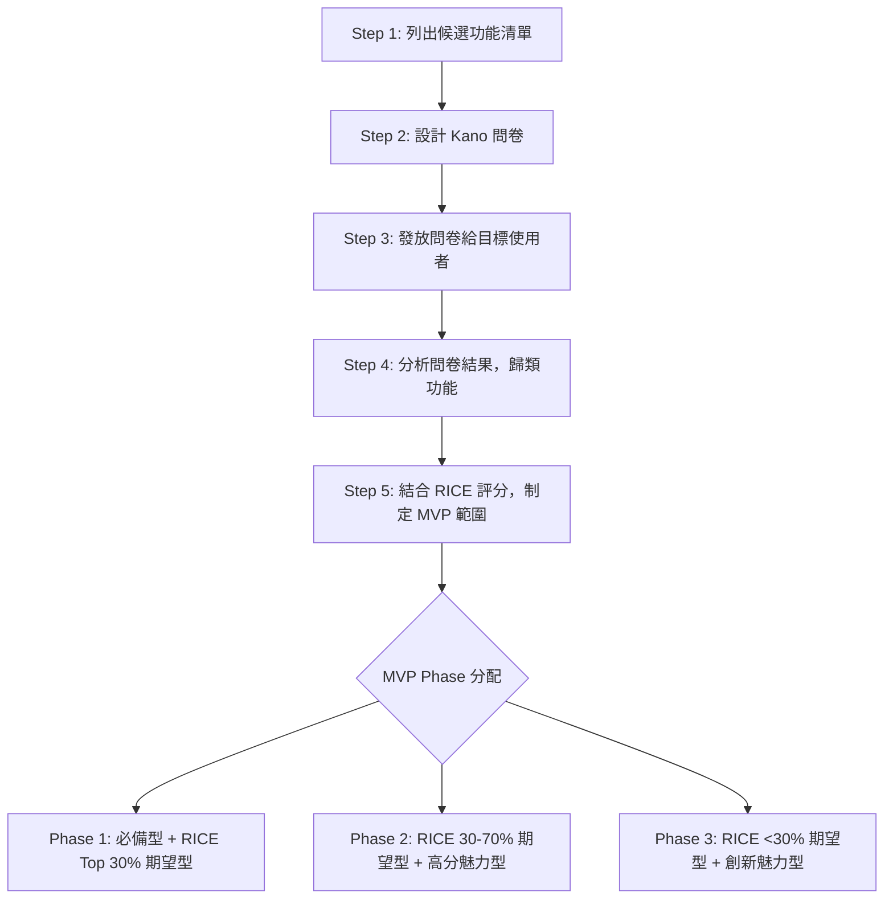
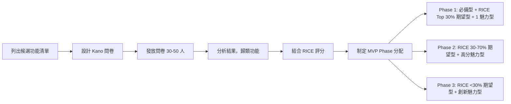

# Kano 模型功能分類指引
# Kano Model Guide for Feature Classification

**文件版本**: v1.0
**建立日期**: 2025-11-26
**最後更新**: 2025-11-26
**文件類型**: 指引文件
**適用範圍**: Greenfield SOP Stage 4 步驟 4.2 - MVP 範圍界定

---

## 📋 目錄

1. [什麼是 Kano 模型？](#什麼是-kano-模型)
2. [Kano 模型五大分類](#kano-模型五大分類)
3. [Kano 模型應用流程](#kano-模型應用流程)
4. [Kano 問卷設計與執行](#kano-問卷設計與執行)
5. [Kano 結果分析與解讀](#kano-結果分析與解讀)
6. [Kano 與 RICE 整合應用](#kano-與-rice-整合應用)
7. [完整案例分析](#完整案例分析)
8. [常見問題 FAQ](#常見問題-faq)

---

## 什麼是 Kano 模型？

**Kano 模型** (Kano Model) 是由日本學者 **狩野紀昭** (Noriaki Kano) 於 1984 年提出的**顧客滿意度分析工具**，用於**分類產品功能與使用者滿意度之間的非線性關係**。

### 核心概念

Kano 模型將產品功能分為 **5 大類別**，每種功能類別與「使用者滿意度」的關係不同：

```
滿意度 ↑
    │          ╱ Attractive (魅力型)
    │        ╱
    │      ╱
    │    ╱
    │  ─────────── One-dimensional (期望型)
    │╱
────┼────────────────────────► 功能完善度
    │
    │ Must-be (必備型)
    │
滿意度 ↓
```

**關鍵洞察**：
- ❌ **並非所有功能都是「越多越好」**
- ✅ **功能優先級應該基於「使用者滿意度影響」**
- ✅ **資源有限時，應先開發「必備型」，再開發「期望型」，最後考慮「魅力型」**

### 為什麼需要 Kano 模型？

在 **Greenfield SOP Stage 4 步驟 4.2** 進行 MVP 範圍界定時，Kano 模型可以幫助你：

1. **避免功能堆砌** - 不是所有功能都要在 MVP 階段開發
2. **優化資源分配** - 先開發影響滿意度最大的功能
3. **降低開發風險** - MVP 只包含必備型功能 + 高分期望型功能
4. **提升產品競爭力** - 找到「魅力型」功能作為差異化亮點

---

## Kano 模型五大分類

### 🔴 1. Must-be (必備型) - 基本需求

**定義**：使用者認為「理所當然」的功能，**缺少會不滿，具備不會特別滿意**。

**特徵**：
- ❌ **缺少會導致使用者放棄產品**（嚴重不滿）
- ✅ **具備只是「達到基本標準」**（不會加分）
- 📌 **是產品的「入場券」，不是「差異化」**

**判斷標準**：
- 如果缺少這個功能，產品是否無法使用？
- 如果缺少這個功能，使用者會立即流失嗎？
- 競品是否 100% 都有這個功能？

**範例**：

| 產品類型 | 必備型功能範例 | 解釋 |
|---------|--------------|------|
| **記帳 App** | 新增/刪除記帳記錄 | 沒有這個功能就不是記帳 App |
| **電商平台** | 購物車、結帳、付款 | 無法下單就不是電商 |
| **社群 App** | 註冊、登入、發文、追蹤 | 基本互動功能，缺一不可 |
| **外送平台** | 瀏覽餐廳、下單、追蹤配送 | 核心流程，必須完整 |

**MVP 策略**：
- ✅ **必須 100% 包含在 Phase 1 (MVP)**
- ⚠️ **不需要過度打磨 UI/UX**（只要能用即可）
- ⚠️ **不需要進階功能**（例如：記帳 App 的「快速輸入」是期望型，不是必備型）

---

### 🟡 2. One-dimensional (期望型) - 線性需求

**定義**：使用者期待的功能，**越好越滿意，越差越不滿**（滿意度與功能完善度呈線性關係）。

**特徵**：
- 📈 **功能完善度提升 → 滿意度提升**
- 📉 **功能完善度降低 → 滿意度降低**
- 💡 **是產品品質的「主要戰場」**

**判斷標準**：
- 使用者會主動要求這個功能嗎？
- 使用者會比較不同產品的這個功能差異嗎？
- 功能完善度會影響使用者的選擇嗎？

**範例**：

| 產品類型 | 期望型功能範例 | 線性關係說明 |
|---------|--------------|-------------|
| **記帳 App** | 圖表分析（餅圖/折線圖） | 圖表越清晰 → 滿意度越高 |
| **電商平台** | 搜尋精準度、推薦演算法 | 搜尋越準確 → 轉換率越高 |
| **社群 App** | 動態載入速度、圖片畫質 | 速度越快 → 使用者黏性越高 |
| **外送平台** | 配送速度、訂單追蹤精準度 | 配送越快 → NPS 越高 |

**MVP 策略**：
- ✅ **Phase 1 (MVP) 應包含「RICE Top 30%」的期望型功能**
- ⭐ **期望型功能是「產品品質」的關鍵**（需要精心打磨）
- ⚠️ **Phase 2 包含「RICE 30-70%」的期望型功能**
- ❌ **RICE <30% 的期望型功能排入 Phase 3 或不開發**

---

### 🟢 3. Attractive (魅力型) - 驚喜需求

**定義**：使用者未預期的創新功能，**有會驚喜，沒有也不會不滿**。

**特徵**：
- 🎁 **有這個功能會「WOW」**（驚喜感）
- 😐 **沒有這個功能「也沒關係」**（不影響基本滿意度）
- 🚀 **是產品的「差異化亮點」**（競爭優勢）

**判斷標準**：
- 使用者會主動提到這個功能很酷嗎？
- 這個功能是競品沒有的創新嗎？
- 這個功能會成為產品的「傳播點」嗎？

**範例**：

| 產品類型 | 魅力型功能範例 | 驚喜點 |
|---------|--------------|-------|
| **記帳 App** | AI 智能分類、拍照記帳（OCR） | 「哇！不用手動輸入金額」 |
| **電商平台** | AR 虛擬試穿、AI 風格推薦 | 「太酷了！像我的私人造型師」 |
| **社群 App** | AI 生成貼文、動態特效 | 「好玩！我要分享給朋友」 |
| **外送平台** | 配送無人機、訂單分享功能 | 「未來感十足！」 |

**MVP 策略**：
- ⭐ **Phase 1 (MVP) 可考慮包含「1 個高 RICE 的魅力型功能」**（作為產品亮點）
- ✅ **Phase 2 包含「高分魅力型功能」**（提升使用者黏性）
- ⚠️ **注意開發成本** - 魅力型功能通常技術複雜度高
- ❌ **避免為了「酷」而犧牲「必備型」和「高分期望型」**

**⚠️ 重要提醒**：
- 魅力型功能**隨時間會降級為期望型或必備型**
  - 例如：2015 年「拍照記帳」是魅力型，2025 年已成為期望型
- **不要過度依賴魅力型功能** - 基本功能做不好，魅力型也救不了產品

---

### ⚪ 4. Indifferent (無差異) - 冷漠需求

**定義**：使用者不在意的功能，**有沒有都一樣**（滿意度不受影響）。

**特徵**：
- 😐 **使用者對這個功能「無感」**
- 💸 **開發這個功能是「浪費資源」**
- ⚠️ **可能是「偽需求」或「過度設計」**

**判斷標準**：
- 使用者會用這個功能嗎？（<10% 使用率）
- 這個功能對核心價值有貢獻嗎？
- 移除這個功能會有使用者抱怨嗎？

**範例**：

| 產品類型 | 無差異功能範例 | 為什麼無差異？ |
|---------|--------------|---------------|
| **記帳 App** | 更換主題顏色、多語言切換（僅台灣市場） | 使用者不在意外觀，專注記帳功能 |
| **電商平台** | 商品瀏覽歷史記錄、商品比較功能（低使用率） | 使用者習慣直接搜尋或推薦 |
| **社群 App** | 動態背景音樂、自訂字型 | 使用者在意內容，不在意樣式 |
| **外送平台** | 餐點熱量計算、營養建議（低使用率） | 使用者點外送是為了方便，不是健康 |

**MVP 策略**：
- ❌ **不開發**（除非成本極低且不影響核心功能）
- ⚠️ **Phase 2/3 也不需要開發**（資源應投入期望型/魅力型）
- 💡 **如果已經開發了，考慮移除**（減少維護成本）

---

### 🔵 5. Reverse (反向) - 反感需求

**定義**：使用者不想要的功能，**有了反而不滿**（負面影響）。

**特徵**：
- 😠 **有這個功能會讓使用者「不爽」**
- ❌ **是產品的「扣分項」**
- ⚠️ **可能是「誤解使用者需求」或「違反直覺」**

**判斷標準**：
- 使用者會抱怨這個功能嗎？
- 這個功能會讓操作變複雜嗎？
- 這個功能會侵犯隱私或造成困擾嗎？

**範例**：

| 產品類型 | 反向功能範例 | 為什麼反向？ |
|---------|------------|-------------|
| **記帳 App** | 強制看廣告才能記帳、分享記帳到社群 | 記帳是隱私行為，不想被打擾或曝光 |
| **電商平台** | 強制註冊才能瀏覽、自動加入購物車 | 使用者反感被迫註冊、誤操作導致困擾 |
| **社群 App** | 強制實名制、公開瀏覽歷史 | 侵犯隱私、降低分享意願 |
| **外送平台** | 自動訂閱會員、預設小費 20% | 使用者反感「暗黑模式」（Dark Patterns） |

**MVP 策略**：
- ❌ **絕對不開發**（會損害使用者信任）
- ⚠️ **如果已經開發了，立即移除**（負面影響遠大於成本）
- 💡 **重新思考需求來源** - 可能是「商業需求」而非「使用者需求」

**⚠️ 常見錯誤**：
- **混淆「商業需求」與「使用者需求」**
  - 例如：「廣告」是商業需求（獲利），但對使用者是反向需求（干擾）
  - 解決方案：設計「非侵入式」的商業模式（如：訂閱制、增值服務）

---

## Kano 模型應用流程

在 **Greenfield SOP Stage 4 步驟 4.2** 使用 Kano 模型，建議按以下 **5 步驟流程**：

### 📊 流程圖



### Step 1: 列出候選功能清單

**輸入**：
- Greenfield SOP Stage 2 產出的「功能清單」（已初步整理）
- Stakeholder 提出的「功能需求」
- 競品分析結果

**輸出**：
- 候選功能清單（10-30 個功能）
- 每個功能的簡短描述（1 句話）

**範例**（記帳 App）：
| 功能 ID | 功能名稱 | 簡短描述 |
|--------|---------|---------|
| F-001 | 快速記帳 | 使用者可以輸入金額、分類、備註並儲存 |
| F-002 | 拍照記帳 (OCR) | 拍攝收據照片，自動識別金額 |
| F-003 | 支出總覽 | 顯示本月/本年總支出金額 |
| F-004 | 分類統計圖表 | 餅圖顯示各分類支出佔比 |
| F-005 | 預算設定與提醒 | 設定每月預算，超支時提醒 |
| ... | ... | ... |

---

### Step 2: 設計 Kano 問卷

Kano 問卷採用 **「正向問題」 + 「反向問題」** 的成對設計，每個功能詢問 2 題。

#### Kano 問卷標準格式

**正向問題**（Functional Question）：「如果產品**有**這個功能，你會覺得如何？」
**反向問題**（Dysfunctional Question）：「如果產品**沒有**這個功能，你會覺得如何？」

**回答選項**（5 選 1）：
1. ✅ **我喜歡這樣** (Like)
2. 😊 **這是理所當然的** (Expect)
3. 😐 **我無所謂** (Neutral)
4. 😕 **我可以忍受** (Live with)
5. ❌ **我不喜歡這樣** (Dislike)

#### Kano 問卷範例（記帳 App - F-002 拍照記帳功能）

| 問題類型 | 問題內容 | 回答選項 |
|---------|---------|---------|
| **正向問題** | 如果記帳 App **有「拍照記帳（OCR 自動識別金額）」**功能，你會覺得如何？ | 1. ✅ 我喜歡這樣<br>2. 😊 這是理所當然的<br>3. 😐 我無所謂<br>4. 😕 我可以忍受<br>5. ❌ 我不喜歡這樣 |
| **反向問題** | 如果記帳 App **沒有「拍照記帳（OCR 自動識別金額）」**功能，你會覺得如何？ | 1. ✅ 我喜歡這樣<br>2. 😊 這是理所當然的<br>3. 😐 我無所謂<br>4. 😕 我可以忍受<br>5. ❌ 我不喜歡這樣 |

**問卷設計注意事項**：
- ✅ **每個功能詢問 2 題**（正向 + 反向）
- ✅ **問卷長度控制在 5-10 分鐘內**（建議 10-15 個功能，共 20-30 題）
- ✅ **功能描述簡潔明確**（1 句話，避免模糊）
- ❌ **不要引導性問題**（例如：「如果有這個超棒的功能...」）
- ❌ **不要技術術語**（例如：「SSO 單點登入」→「使用 Google 帳號登入」）

---

### Step 3: 發放問卷給目標使用者

**目標受訪者**：
- **數量**: 30-50 人（統計顯著性）
- **來源**: 目標使用者群體（非團隊內部人員）
- **多樣性**: 包含不同年齡/性別/使用習慣的使用者

**發放管道**：
- 📧 Email 邀請（提供獎勵：折扣碼/抽獎）
- 📱 社群媒體（Facebook/Instagram/LINE 群組）
- 🏢 使用者訪談（面對面填寫問卷）
- 💻 線上問卷工具（Google Forms/Typeform/SurveyCake）

**時程**：
- 問卷發放 → 回收：**3-7 天**
- 資料分析：**1 天**

---

### Step 4: 分析問卷結果，歸類功能

#### Kano 分類判斷表

根據「正向問題」與「反向問題」的回答組合，查表決定功能類別：

| 反向問題 ↓<br>正向問題 → | ✅ Like | 😊 Expect | 😐 Neutral | 😕 Live with | ❌ Dislike |
|---|---|---|---|---|---|
| **✅ Like** | ❓ Q | 🟢 A | 🟢 A | 🟢 A | 🟡 O |
| **😊 Expect** | 🔵 R | ⚪ I | ⚪ I | ⚪ I | 🔴 M |
| **😐 Neutral** | 🔵 R | ⚪ I | ⚪ I | ⚪ I | 🔴 M |
| **😕 Live with** | 🔵 R | ⚪ I | ⚪ I | ⚪ I | 🔴 M |
| **❌ Dislike** | 🔵 R | 🔵 R | 🔵 R | 🔵 R | ❓ Q |

**圖例**：
- 🔴 **M** (Must-be) - 必備型
- 🟡 **O** (One-dimensional) - 期望型
- 🟢 **A** (Attractive) - 魅力型
- ⚪ **I** (Indifferent) - 無差異
- 🔵 **R** (Reverse) - 反向
- ❓ **Q** (Questionable) - 問卷填寫錯誤（矛盾回答）

#### 分類結果統計

收集所有受訪者的回答後，統計每個功能的分類結果：

**範例**（F-002 拍照記帳功能，50 位受訪者）：

| 分類 | 人數 | 佔比 | 判斷 |
|-----|-----|------|------|
| 🟢 Attractive (魅力型) | 28 | 56% | ✅ **最多票** |
| 🟡 One-dimensional (期望型) | 12 | 24% | - |
| 🔴 Must-be (必備型) | 5 | 10% | - |
| ⚪ Indifferent (無差異) | 4 | 8% | - |
| 🔵 Reverse (反向) | 1 | 2% | - |

**判斷結果**：F-002 拍照記帳功能 = **🟢 魅力型**（56% 受訪者認為是驚喜功能）

#### 分類決策規則

當分類結果分散時，使用以下**優先級規則**：

1. **如果「必備型 + 期望型」合計 > 50%** → 歸類為 **必備型**（保守策略）
2. **如果「魅力型」> 40%** → 歸類為 **魅力型**
3. **如果「期望型」> 40%** → 歸類為 **期望型**
4. **如果「無差異」> 50%** → 歸類為 **無差異**（不開發）
5. **如果「反向」> 30%** → 歸類為 **反向**（不開發）

---

### Step 5: 結合 RICE 評分，制定 MVP 範圍

Kano 模型告訴你「功能類別」，RICE 評分告訴你「功能優先級」，**兩者結合**才能制定最佳 MVP 範圍。

#### RICE 評分快速回顧

**RICE 分數 = (Reach × Impact × Confidence) / Effort**

- **Reach** (觸及人數): 預估使用此功能的使用者數量（每月）
- **Impact** (影響程度): 對使用者的影響（3=巨大, 2=高, 1=中, 0.5=低, 0.25=微小）
- **Confidence** (信心指數): 估算的可信度（100%=高, 80%=中, 50%=低）
- **Effort** (工作量): 預估開發所需人月（Person-Months）

**計算範例**（F-002 拍照記帳功能）：
- Reach: 5000 人/月（50% 的月活使用者會使用）
- Impact: 2（高影響 - 顯著提升記帳效率）
- Confidence: 80%（中信心 - 有競品驗證）
- Effort: 3 人月（OCR 整合需要時間）
- **RICE 分數 = (5000 × 2 × 0.8) / 3 = 2667**

#### MVP Phase 分配規則

根據 **Kano 分類 + RICE 分數**，將功能分配到 3 個 Phase：

| MVP Phase | 包含功能 | 時程 | 目標 |
|----------|---------|------|------|
| **Phase 1 (MVP)** | 🔴 所有必備型 +<br>🟡 RICE Top 30% 期望型 +<br>🟢 (可選) 1 個高 RICE 魅力型 | 2-3 個月 | 最小可行產品，驗證核心假設 |
| **Phase 2** | 🟡 RICE 30-70% 期望型 +<br>🟢 RICE > 1000 魅力型 | 3-4 個月 | 強化核心體驗，增加使用者黏性 |
| **Phase 3** | 🟡 RICE <30% 期望型 +<br>🟢 創新魅力型 | 待定 | 差異化功能，提升競爭力 |

#### 決策矩陣

| Kano 分類 | RICE 分數 | Phase 分配 | 理由 |
|----------|----------|----------|------|
| 🔴 必備型 | 任何分數 | **Phase 1** | 缺少會導致產品無法使用 |
| 🟡 期望型 | ≥ 70th percentile | **Phase 1** | 高價值期望型，必須優先開發 |
| 🟡 期望型 | 30-70th percentile | **Phase 2** | 中等價值期望型，強化產品體驗 |
| 🟡 期望型 | <30th percentile | **Phase 3** | 低價值期望型，視資源決定是否開發 |
| 🟢 魅力型 | ≥ 2000 | **Phase 1** (可選 1 個) | 高價值魅力型，作為產品亮點 |
| 🟢 魅力型 | 1000-2000 | **Phase 2** | 中等價值魅力型，提升使用者驚喜感 |
| 🟢 魅力型 | <1000 | **Phase 3** | 創新實驗，視預算決定 |
| ⚪ 無差異 | 任何分數 | **不開發** | 浪費資源 |
| 🔵 反向 | 任何分數 | **不開發** | 負面影響 |

---

## Kano 問卷設計與執行

### 完整問卷範本（記帳 App 範例）

```markdown
# 記帳 App 功能需求調查問卷

感謝您參與本次問卷！本問卷旨在了解您對記帳 App 功能的偏好，協助我們打造最符合需求的產品。
預計填寫時間：5-8 分鐘。完成問卷可獲得「早鳥優惠碼」（產品上線後可享 8 折優惠）。

---

## 基本資料

1. 您目前有在使用記帳 App 嗎？
   - [ ] 有（請註明：________）
   - [ ] 沒有

2. 您平均每月記帳次數？
   - [ ] 0-5 次
   - [ ] 6-15 次
   - [ ] 16-30 次
   - [ ] 31 次以上（每日記帳）

---

## 功能需求調查

請針對以下 10 個功能，回答「正向問題」與「反向問題」。

### 功能 1: 快速記帳

**正向問題**：如果記帳 App **有「快速記帳（輸入金額、分類、備註並儲存）」**功能，你會覺得如何？
- [ ] ✅ 我喜歡這樣
- [ ] 😊 這是理所當然的
- [ ] 😐 我無所謂
- [ ] 😕 我可以忍受
- [ ] ❌ 我不喜歡這樣

**反向問題**：如果記帳 App **沒有「快速記帳」**功能，你會覺得如何？
- [ ] ✅ 我喜歡這樣
- [ ] 😊 這是理所當然的
- [ ] 😐 我無所謂
- [ ] 😕 我可以忍受
- [ ] ❌ 我不喜歡這樣

---

### 功能 2: 拍照記帳 (OCR)

**正向問題**：如果記帳 App **有「拍照記帳（拍攝收據照片，自動識別金額）」**功能，你會覺得如何？
- [ ] ✅ 我喜歡這樣
- [ ] 😊 這是理所當然的
- [ ] 😐 我無所謂
- [ ] 😕 我可以忍受
- [ ] ❌ 我不喜歡這樣

**反向問題**：如果記帳 App **沒有「拍照記帳（OCR）」**功能，你會覺得如何？
- [ ] ✅ 我喜歡這樣
- [ ] 😊 這是理所當然的
- [ ] 😐 我無所謂
- [ ] 😕 我可以忍受
- [ ] ❌ 我不喜歡這樣

---

（依此類推，涵蓋 10 個功能，共 20 題）

---

## 開放式問題（選填）

1. 您最希望記帳 App 擁有哪個功能？（請簡短描述）
   _____________________________________________________

2. 您最不希望記帳 App 有哪個功能？（請簡短描述）
   _____________________________________________________

---

問卷結束！感謝您的參與 🎉
```

### 問卷發放最佳實踐

1. **提供獎勵** - 提高回覆率（折扣碼/抽獎/小禮物）
2. **控制問卷長度** - 5-10 分鐘內完成（10-15 個功能，20-30 題）
3. **測試問卷** - 先讓 3-5 人試填，確保問題清晰
4. **目標受訪者** - 確保受訪者是「真實目標使用者」（非團隊內部）
5. **追蹤回覆率** - 目標 30-50 份有效問卷（統計顯著性）

---

## Kano 結果分析與解讀

### 完整分析範例（記帳 App - 10 個功能）

假設我們收集了 **50 份有效問卷**，分析結果如下：

| 功能 ID | 功能名稱 | Kano 分類 | 必備型 % | 期望型 % | 魅力型 % | 無差異 % | 反向 % |
|--------|---------|----------|---------|---------|---------|---------|--------|
| F-001 | 快速記帳 | 🔴 必備型 | **62%** | 28% | 8% | 2% | 0% |
| F-002 | 拍照記帳 (OCR) | 🟢 魅力型 | 10% | 24% | **56%** | 8% | 2% |
| F-003 | 支出總覽 | 🔴 必備型 | **58%** | 32% | 8% | 2% | 0% |
| F-004 | 分類統計圖表 | 🟡 期望型 | 18% | **48%** | 28% | 6% | 0% |
| F-005 | 預算設定與提醒 | 🟡 期望型 | 22% | **44%** | 26% | 8% | 0% |
| F-006 | 收入記錄 | 🔴 必備型 | **52%** | 34% | 10% | 4% | 0% |
| F-007 | 雲端備份與同步 | 🟡 期望型 | 16% | **42%** | 32% | 10% | 0% |
| F-008 | 多幣別記帳 | ⚪ 無差異 | 8% | 14% | 18% | **56%** | 4% |
| F-009 | 更換主題顏色 | ⚪ 無差異 | 2% | 6% | 22% | **64%** | 6% |
| F-010 | 強制看廣告才能記帳 | 🔵 反向 | 0% | 2% | 0% | 18% | **80%** |

**關鍵洞察**：
1. **3 個必備型功能**（F-001, F-003, F-006）- 必須 100% 包含在 Phase 1
2. **4 個期望型功能**（F-004, F-005, F-007）- 需結合 RICE 評分決定 Phase
3. **1 個魅力型功能**（F-002）- OCR 拍照記帳是「驚喜功能」，可作為產品亮點
4. **2 個無差異功能**（F-008, F-009）- 不開發（浪費資源）
5. **1 個反向功能**（F-010）- 絕對不開發（80% 使用者反感）

---

## Kano 與 RICE 整合應用

### Step 1: 計算所有功能的 RICE 分數

| 功能 ID | 功能名稱 | Reach | Impact | Confidence | Effort | RICE 分數 | Kano 分類 |
|--------|---------|------|--------|-----------|--------|----------|----------|
| F-001 | 快速記帳 | 10000 | 3.0 | 100% | 2 | **15000** | 🔴 必備型 |
| F-002 | 拍照記帳 (OCR) | 5000 | 2.0 | 80% | 3 | **2667** | 🟢 魅力型 |
| F-003 | 支出總覽 | 10000 | 2.0 | 100% | 1 | **20000** | 🔴 必備型 |
| F-004 | 分類統計圖表 | 8000 | 1.5 | 100% | 1.5 | **8000** | 🟡 期望型 |
| F-005 | 預算設定與提醒 | 7000 | 2.0 | 80% | 2 | **5600** | 🟡 期望型 |
| F-006 | 收入記錄 | 6000 | 1.0 | 100% | 1 | **6000** | 🔴 必備型 |
| F-007 | 雲端備份與同步 | 4000 | 1.5 | 80% | 3 | **1600** | 🟡 期望型 |

### Step 2: 計算 RICE 分數的百分位數

對期望型功能按 RICE 分數排序，計算百分位數：

| 功能 ID | 功能名稱 | RICE 分數 | 百分位數 | Phase 分配 |
|--------|---------|----------|---------|----------|
| F-004 | 分類統計圖表 | 8000 | **Top 25%** (1/4) | Phase 1 |
| F-005 | 預算設定與提醒 | 5600 | **50th** (2/4) | Phase 2 |
| F-007 | 雲端備份與同步 | 1600 | **75th** (3/4) | Phase 2 |

### Step 3: 制定 MVP Phase 分配

| MVP Phase | 包含功能 | Story Points | 時程 |
|----------|---------|-------------|------|
| **Phase 1 (MVP)** | 🔴 F-001 快速記帳 (8 SP)<br>🔴 F-003 支出總覽 (3 SP)<br>🔴 F-006 收入記錄 (5 SP)<br>🟡 F-004 分類統計圖表 (8 SP)<br>🟢 F-002 拍照記帳 OCR (13 SP) | **37 SP** | **4 週** |
| **Phase 2** | 🟡 F-005 預算設定與提醒 (8 SP)<br>🟡 F-007 雲端備份與同步 (13 SP) | **21 SP** | **3 週** |
| **Phase 3** | （目前無功能規劃） | **0 SP** | - |
| **不開發** | ⚪ F-008 多幣別記帳<br>⚪ F-009 更換主題顏色<br>🔵 F-010 強制看廣告 | - | - |

---

## 完整案例分析

### 案例：B&B 民宿訂房平台 Kano 分析

**背景**：
- 產品：B&B 民宿訂房平台（雙邊市場：房東 + 房客）
- 目標：界定 MVP 範圍，6 個月內上線
- 競品：Airbnb, Booking.com, Agoda

**Step 1: 列出候選功能清單（20 個功能）**

| 功能 ID | 功能名稱 | 功能描述 |
|--------|---------|---------|
| F-001 | 房源瀏覽 | 房客可以瀏覽所有可訂房源 |
| F-002 | 房源搜尋與篩選 | 房客可以依地點/價格/設施搜尋 |
| F-003 | 房源詳細頁 | 顯示房間照片/描述/設施/評價 |
| F-004 | 線上訂房 | 房客可以選擇日期並下訂 |
| F-005 | 線上付款 | 信用卡/第三方支付（綠界/藍新） |
| F-006 | 訂單管理 | 房客可以查看/取消訂單 |
| F-007 | 房東註冊與登入 | 房東可以註冊帳號並登入 |
| F-008 | 房源刊登管理 | 房東可以新增/編輯/下架房源 |
| F-009 | 訂單通知 | 房東收到新訂單時推送通知 |
| F-010 | 即時客服聊天 | 房客與房東可以即時聊天 |
| F-011 | 評價系統 | 房客可以評價房源（1-5 星） |
| F-012 | AI 智能推薦 | 根據瀏覽歷史推薦房源 |
| F-013 | 動態定價 | 根據需求自動調整房價 |
| F-014 | VR 虛擬實境看房 | 360 度全景照片 |
| F-015 | 社群分享功能 | 分享房源到 Facebook/IG |
| F-016 | 多語言支援 | 中文/英文/日文切換 |
| F-017 | 優惠券與折扣碼 | 行銷促銷活動 |
| F-018 | 會員等級制度 | 訂房次數累積等級，享專屬優惠 |
| F-019 | 自動取消訂單 | 未付款超過 30 分鐘自動取消 |
| F-020 | 房源比較功能 | 最多可比較 3 個房源 |

**Step 2: Kano 問卷設計**

設計 40 題問卷（20 個功能 × 2 題），發放給 50 位目標使用者（25 位房客 + 25 位潛在房東）。

**Step 3: Kano 分類結果**

| 功能 ID | 功能名稱 | Kano 分類 | 必備型 % | 期望型 % | 魅力型 % | 無差異 % |
|--------|---------|----------|---------|---------|---------|---------|
| F-001 | 房源瀏覽 | 🔴 必備型 | **74%** | 20% | 4% | 2% |
| F-002 | 房源搜尋與篩選 | 🔴 必備型 | **68%** | 26% | 4% | 2% |
| F-003 | 房源詳細頁 | 🔴 必備型 | **70%** | 24% | 4% | 2% |
| F-004 | 線上訂房 | 🔴 必備型 | **76%** | 18% | 4% | 2% |
| F-005 | 線上付款 | 🔴 必備型 | **72%** | 22% | 4% | 2% |
| F-006 | 訂單管理 | 🔴 必備型 | **66%** | 28% | 4% | 2% |
| F-007 | 房東註冊與登入 | 🔴 必備型 | **70%** | 24% | 4% | 2% |
| F-008 | 房源刊登管理 | 🔴 必備型 | **68%** | 26% | 4% | 2% |
| F-009 | 訂單通知 | 🟡 期望型 | 32% | **52%** | 12% | 4% |
| F-010 | 即時客服聊天 | 🟡 期望型 | 28% | **46%** | 22% | 4% |
| F-011 | 評價系統 | 🟡 期望型 | 34% | **48%** | 14% | 4% |
| F-012 | AI 智能推薦 | 🟢 魅力型 | 8% | 26% | **58%** | 8% |
| F-013 | 動態定價 | 🟢 魅力型 | 6% | 22% | **54%** | 18% |
| F-014 | VR 虛擬實境看房 | 🟢 魅力型 | 4% | 18% | **62%** | 16% |
| F-015 | 社群分享功能 | ⚪ 無差異 | 6% | 12% | 24% | **58%** |
| F-016 | 多語言支援 | ⚪ 無差異 | 8% | 16% | 18% | **54%** |
| F-017 | 優惠券與折扣碼 | 🟡 期望型 | 18% | **44%** | 32% | 6% |
| F-018 | 會員等級制度 | 🟡 期望型 | 14% | **42%** | 36% | 8% |
| F-019 | 自動取消訂單 | 🟡 期望型 | 24% | **46%** | 22% | 8% |
| F-020 | 房源比較功能 | ⚪ 無差異 | 4% | 12% | 22% | **58%** |

**Step 4: 結合 RICE 評分**

| 功能 ID | 功能名稱 | Kano 分類 | RICE 分數 | 百分位數 | Phase 分配 |
|--------|---------|----------|----------|---------|----------|
| F-001 | 房源瀏覽 | 🔴 必備型 | 18000 | - | **Phase 1** |
| F-002 | 房源搜尋與篩選 | 🔴 必備型 | 16000 | - | **Phase 1** |
| F-003 | 房源詳細頁 | 🔴 必備型 | 17000 | - | **Phase 1** |
| F-004 | 線上訂房 | 🔴 必備型 | 20000 | - | **Phase 1** |
| F-005 | 線上付款 | 🔴 必備型 | 19000 | - | **Phase 1** |
| F-006 | 訂單管理 | 🔴 必備型 | 15000 | - | **Phase 1** |
| F-007 | 房東註冊與登入 | 🔴 必備型 | 14000 | - | **Phase 1** |
| F-008 | 房源刊登管理 | 🔴 必備型 | 16000 | - | **Phase 1** |
| F-009 | 訂單通知 | 🟡 期望型 | **8000** | **Top 14%** (1/7) | **Phase 1** |
| F-011 | 評價系統 | 🟡 期望型 | **7200** | **Top 29%** (2/7) | **Phase 1** |
| F-019 | 自動取消訂單 | 🟡 期望型 | **6400** | **Top 43%** (3/7) | **Phase 2** |
| F-010 | 即時客服聊天 | 🟡 期望型 | 5600 | 57th (4/7) | Phase 2 |
| F-017 | 優惠券與折扣碼 | 🟡 期望型 | 4800 | 71st (5/7) | Phase 2 |
| F-018 | 會員等級制度 | 🟡 期望型 | 3200 | 86th (6/7) | Phase 3 |
| F-012 | AI 智能推薦 | 🟢 魅力型 | **3600** | - | **Phase 1** ⭐ |
| F-014 | VR 虛擬實境看房 | 🟢 魅力型 | 2400 | - | Phase 2 |
| F-013 | 動態定價 | 🟢 魅力型 | 1800 | - | Phase 3 |
| F-015 | 社群分享功能 | ⚪ 無差異 | - | - | **不開發** |
| F-016 | 多語言支援 | ⚪ 無差異 | - | - | **不開發** |
| F-020 | 房源比較功能 | ⚪ 無差異 | - | - | **不開發** |

**Step 5: MVP Phase 分配最終結果**

| MVP Phase | 包含功能 | Story Points | 時程 | 目標 |
|----------|---------|-------------|------|------|
| **Phase 1 (MVP)** | 🔴 8 個必備型功能（F-001 ~ F-008）<br>🟡 2 個高分期望型（F-009, F-011）<br>🟢 1 個魅力型亮點（F-012 AI 推薦） | **89 SP** | **12 週** | 驗證核心假設（房東願意刊登、房客願意訂房） |
| **Phase 2** | 🟡 3 個中分期望型（F-019, F-010, F-017）<br>🟢 1 個魅力型（F-014 VR 看房） | **42 SP** | **6 週** | 提升使用者體驗、增加黏性 |
| **Phase 3** | 🟡 1 個低分期望型（F-018）<br>🟢 1 個魅力型（F-013 動態定價） | **21 SP** | **待定** | 差異化功能、提升競爭力 |
| **不開發** | ⚪ 3 個無差異功能（F-015, F-016, F-020） | - | - | 使用者不在意，節省資源 |

**關鍵決策理由**：
1. **AI 智能推薦（F-012）雖是魅力型，但 RICE=3600 高分** → 選為 Phase 1 的「產品亮點」
2. **即時客服聊天（F-010）雖是期望型，但 RICE=5600 中等** → 延後到 Phase 2（優先更高分功能）
3. **多語言支援（F-016）雖是常見功能，但 Kano 顯示為無差異** → 不開發（台灣市場為主）

---

## 常見問題 FAQ

### Q1: Kano 問卷需要多少受訪者？

**A**: 建議 **30-50 位受訪者**（統計顯著性）。
- **最少**: 20 人（僅供參考）
- **理想**: 50-100 人（結果可信）
- **專業**: 200+ 人（高信度，但成本高）

**注意**: 受訪者必須是「真實目標使用者」，而非團隊內部人員或親友。

---

### Q2: Kano 分類結果分散時怎麼辦？

**A**: 使用**優先級規則**：
1. 如果「必備型 + 期望型」合計 > 50% → 歸類為 **必備型**（保守策略，避免缺失關鍵功能）
2. 如果「魅力型」> 40% → 歸類為 **魅力型**
3. 如果「期望型」> 40% → 歸類為 **期望型**
4. 如果結果仍分散（例如：必備型 35%、期望型 35%、魅力型 25%）：
   - **進行使用者訪談**（質化研究），深入了解使用者心態
   - **參考競品**（競品都有 → 必備型；競品沒有 → 魅力型）

**範例**：
| 分類 | 佔比 | 判斷 |
|-----|-----|------|
| 必備型 | 38% | 必備+期望 = 38%+34% = 72% > 50% |
| 期望型 | 34% | → **歸類為必備型** |
| 魅力型 | 22% | - |
| 無差異 | 6% | - |

---

### Q3: Kano 模型與 RICE 評分有什麼不同？

**A**: 兩者互補，解決不同問題：

| 比較維度 | Kano 模型 | RICE 評分 |
|---------|----------|---------|
| **回答問題** | 這個功能對使用者滿意度的影響？ | 這個功能的商業價值有多高？ |
| **分類結果** | 5 種類別（必備/期望/魅力/無差異/反向） | 數值分數（越高越優先） |
| **使用時機** | MVP 範圍界定、功能分類 | 功能優先級排序 |
| **資料來源** | 使用者問卷（主觀） | 團隊估算（客觀 + 主觀） |
| **優點** | 避免遺漏必備型功能、找到魅力型亮點 | 量化比較、資源分配效率高 |
| **缺點** | 無法排序同類別功能 | 無法區分「必備」vs「錦上添花」 |

**最佳實踐**：
1. **先用 Kano 分類** → 區分必備型/期望型/魅力型
2. **再用 RICE 排序** → 在同類別中排優先級
3. **兩者結合** → 制定 MVP Phase 分配

---

### Q4: Kano 問卷的「反向問題」可以省略嗎？

**A**: ❌ **不建議省略**。反向問題是 Kano 模型的核心設計，用於：

1. **區分「必備型」 vs「期望型」**：
   - 正向問題回答「喜歡」 + 反向問題回答「不喜歡」 = 期望型
   - 正向問題回答「理所當然」 + 反向問題回答「不喜歡」 = 必備型

2. **檢測矛盾回答**（Questionable）：
   - 正向問題回答「喜歡」 + 反向問題也回答「喜歡」 = 矛盾（Q）
   - 幫助排除無效問卷

3. **識別反向需求**（Reverse）：
   - 正向問題回答「不喜歡」 + 反向問題回答「理所當然」 = 反向
   - 避免開發使用者不想要的功能

**如果問卷太長**：
- 減少功能數量（10 個 vs 20 個）
- 不要省略反向問題（會失去 Kano 模型的核心價值）

---

### Q5: Kano 模型適用於 B2B 產品嗎？

**A**: ✅ **適用**，但需調整執行方式：

**B2B vs B2C 差異**：

| 項目 | B2C 產品 | B2B 產品 |
|-----|---------|---------|
| **受訪者數量** | 50-100 人 | 10-20 人（關鍵決策者） |
| **問卷發放** | 線上問卷（Google Forms） | 使用者訪談（面對面/視訊） |
| **受訪者角色** | 終端使用者 | 多角色（決策者/使用者/採購） |
| **分析重點** | 滿意度影響 | 採購決策影響 |

**B2B 產品 Kano 問卷範例**：
- **受訪者**: CTO、IT 主管、實際使用者
- **方式**: 1 對 1 深度訪談（30-45 分鐘）
- **問題調整**:
  - 正向問題：「如果產品**有**這個功能，**您的團隊**會覺得如何？」
  - 反向問題：「如果產品**沒有**這個功能，**是否會影響採購決策**？」

**B2B 注意事項**：
- **決策者 ≠ 使用者** → 需同時訪談兩種角色
- **採購流程長** → Kano 結果需搭配「採購決策權重」調整
- **客製化需求高** → 可能出現「必備型功能因客戶而異」

---

### Q6: Kano 模型的「魅力型」功能會隨時間降級嗎？

**A**: ✅ **會！** 這是 Kano 模型的重要洞察：**功能類別會隨時間演變**。

**演變路徑**：

```
🟢 魅力型 ──(時間)──> 🟡 期望型 ──(時間)──> 🔴 必備型
```

**實際範例**：

| 功能 | 2015 年 | 2020 年 | 2025 年 |
|-----|--------|--------|--------|
| **手機 App** | 🟢 魅力型（網站為主） | 🟡 期望型（50% 使用者期待） | 🔴 必備型（沒有 App 就放棄） |
| **拍照記帳 (OCR)** | 🟢 魅力型（創新功能） | 🟡 期望型（多數 App 有） | 🟡 期望型（仍是加分項） |
| **即時通訊** | 🟢 魅力型（早期 MSN） | 🔴 必備型（LINE/WhatsApp） | 🔴 必備型（無法想像沒有） |

**策略建議**：
1. **每年重新執行 Kano 問卷**（檢查分類是否改變）
2. **追蹤競品**（競品普及 → 魅力型降級為期望型）
3. **優先開發「穩定必備型/期望型」**（避免追逐短期魅力型）
4. **持續創新「新魅力型」**（保持產品競爭力）

---

### Q7: 我可以不做 Kano 問卷，直接用團隊判斷嗎？

**A**: ⚠️ **不建議**，原因：

**團隊判斷的常見偏誤**：

| 偏誤類型 | 說明 | 範例 |
|---------|------|------|
| **過度自信** | 團隊認為「這個功能一定很酷」 | 團隊覺得「VR 看房」超酷，但使用者覺得「沒必要」（無差異） |
| **技術導向** | 工程師喜歡炫技，忽略使用者需求 | 開發「AI 動態定價」（魅力型），但使用者更需要「搜尋篩選」（必備型） |
| **忽略必備型** | 團隊專注創新功能，忽略基本功能 | 花 3 個月開發「社群分享」（無差異），卻沒有「訂單管理」（必備型） |
| **誤判反向** | 團隊認為「強制註冊」合理，但使用者反感 | 「必須看完廣告才能使用」→ 80% 使用者反感（反向） |

**Kano 問卷的價值**：
- ✅ **避免主觀判斷**（資料驅動決策）
- ✅ **發現「反直覺」的結果**（例如：團隊覺得重要，使用者覺得無差異）
- ✅ **提高 MVP 成功率**（專注必備型 + 高分期望型）

**折衷方案**（預算/時間有限）：
1. **簡化問卷** - 僅調查 5-10 個關鍵功能（10-20 題）
2. **小樣本** - 訪談 10-15 位使用者（質化研究）
3. **快速驗證** - 使用「Landing Page + 功能清單」，追蹤點擊率/留名率

---

## 結論與後續行動

### Kano 模型關鍵要點

1. **功能並非越多越好** - 必備型 > 期望型 > 魅力型 > 無差異/反向
2. **資料驅動決策** - 使用 Kano 問卷，避免主觀判斷
3. **與 RICE 整合** - Kano 分類 + RICE 排序 = 最佳 MVP 範圍
4. **定期重新評估** - 功能類別會隨時間演變（魅力型 → 期望型 → 必備型）

### 在 AISDLC Greenfield SOP 中的應用

**Stage 4 步驟 4.2 - MVP 範圍界定**：



**時間分配**：
- 列出功能清單：15 分鐘
- 設計問卷：30 分鐘
- 發放問卷 → 回收：3-7 天
- 分析結果：2 小時
- 結合 RICE，制定 MVP：1 小時

**總時程**：約 **1 週**（主要等待問卷回收）

### 相關資源

- 📋 [AISDLC_ID_Naming_Convention.md](./AISDLC_ID_Naming_Convention.md) - Feature ID 命名規範
- 📊 [Estimation_Standards.md](./Estimation_Standards.md) - RICE 評分與 Story Points 估算
- 📝 [MVP_Definition_Template.md](../docs_template/core/prd/MVP_Definition_Template.md) - MVP 定義文件範本
- 🎯 [Greenfield SOP Stage 4](../scenarios/greenfield/SOP.md#stage-4) - PRD/FRD 與 MVP 界定流程

---

**文件歷史**:
- 2025-11-26: v1.0 初版發布（基於 Greenfield Stage 3-4 模擬測試改進）

**維護者**: AISDLC Framework Team
**意見回饋**: 請至 GitHub Issues 提交
