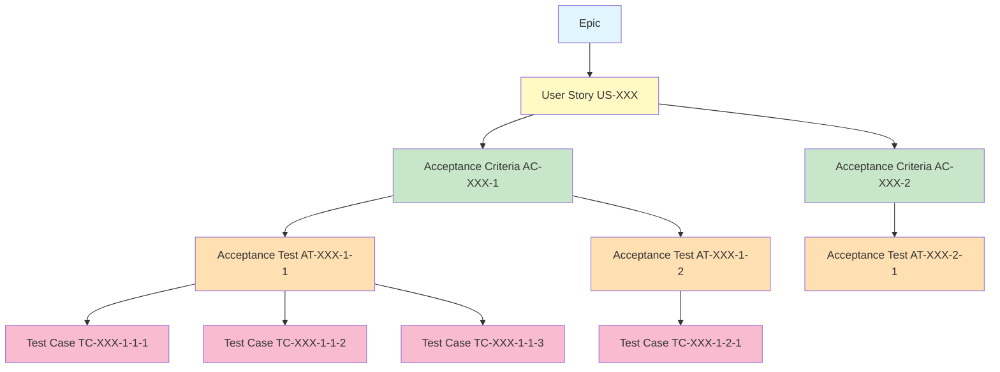

# Acceptance Test (AT) vs Test Case (TC) 區分指引
# Acceptance Test vs Test Case Differentiation Guide

**版本**: v1.0
**建立日期**: 2025-11-25
**最後更新**: 2025-11-25
**適用範圍**: 所有需要測試的專案（Greenfield, Brownfield, Integration）
**文檔目的**: 明確定義 AT 與 TC 的差異、關係和協作流程，避免團隊混淆兩者用途

---

## 📋 文檔概述

### 為什麼需要這份指引？

在軟體開發流程中，**Acceptance Test (AT)** 和 **Test Case (TC)** 經常被混淆或誤用。本指引提供：

- ✅ **明確定義**：AT 和 TC 的核心差異
- ✅ **協作流程**：從 User Story → AC → AT → TC 的完整追蹤鏈
- ✅ **實際範例**：完整的電商專案範例展示
- ✅ **最佳實踐**：撰寫 AT 和 TC 的品質標準

### 核心差異速覽

| 項目 | Acceptance Test (AT) | Test Case (TC) |
|------|---------------------|----------------|
| **目的** | 驗證是否滿足業務需求（AC） | 驗證系統功能的具體實作 |
| **粒度** | 高階（業務視角） | 細節（技術視角） |
| **撰寫者** | SA + BA + QA | QA |
| **撰寫時機** | User Story 定義後 | 開發開始前/中 |
| **執行時機** | Sprint Review / UAT | 開發過程中、CI/CD |
| **自動化** | 部分（E2E 測試） | 大部分（單元/整合測試） |
| **焦點** | "What"（做什麼） | "How"（怎麼做） |
| **範例** | "使用者能成功註冊" | "POST /api/register 返回 201" |

---

## 1. Acceptance Test (AT) 定義

### 1.1 什麼是 Acceptance Test？

**Acceptance Test (AT)** 是驗證軟體是否滿足 **Acceptance Criteria (AC)** 的測試，確保功能符合業務需求和使用者期望。

**關鍵特徵**：
- 🎯 **業務導向**：從使用者角度驗證功能
- 📝 **高階描述**：描述「應該發生什麼」，而非「如何實現」
- ✅ **驗收標準對應**：每個 AC 對應 1-3 個 AT
- 👥 **多方協作**：SA、BA、QA 共同定義

### 1.2 AT 的 ID 命名規範

根據 [AISDLC_ID_Naming_Convention.md](AISDLC_ID_Naming_Convention.md)：

**格式**: `AT-XXX-Y-Z`

- **AT**: Acceptance Test 標識
- **XXX**: User Story ID（例如 001, 002）
- **Y**: Acceptance Criteria 編號（例如 1, 2, 3）
- **Z**: 同一 AC 下的 AT 序號（例如 1, 2）

**範例**：
- `AT-001-1-1`: User Story 001 的 AC-1 的第 1 個 Acceptance Test
- `AT-001-1-2`: User Story 001 的 AC-1 的第 2 個 Acceptance Test
- `AT-001-2-1`: User Story 001 的 AC-2 的第 1 個 Acceptance Test

### 1.3 AT 的撰寫格式

**標準格式**：

```markdown
### AT-XXX-Y-Z: [測試標題]

**對應需求**:
- User Story: US-XXX - [Story 標題]
- Acceptance Criteria: AC-XXX-Y - [AC 內容]

**測試目的**: [說明此 AT 要驗證什麼業務需求]

**前置條件**:
1. [條件 1]
2. [條件 2]

**測試步驟**:
1. [高階步驟 1]
2. [高階步驟 2]
3. [高階步驟 3]

**預期結果**:
- [結果 1]
- [結果 2]

**實際結果**: [填寫執行後的結果]

**狀態**: [待執行 / 通過 / 失敗 / 阻塞]
```

---

## 2. Test Case (TC) 定義

### 2.1 什麼是 Test Case？

**Test Case (TC)** 是詳細的測試腳本，定義具體的測試步驟、輸入資料、預期輸出，用於驗證系統的技術實作。

**關鍵特徵**：
- 🔧 **技術導向**：從系統實作角度驗證功能
- 📋 **詳細步驟**：包含具體操作、API 呼叫、資料庫查詢
- 🤖 **可自動化**：大部分 TC 可轉換為自動化測試
- 🧪 **QA 主導**：由 QA 團隊撰寫和維護

### 2.2 TC 的 ID 命名規範

根據 [AISDLC_ID_Naming_Convention.md](AISDLC_ID_Naming_Convention.md)：

**格式**: `TC-XXX-Y-Z-N`

- **TC**: Test Case 標識
- **XXX**: User Story ID（例如 001, 002）
- **Y**: Acceptance Criteria 編號（例如 1, 2）
- **Z**: Acceptance Test 編號（例如 1, 2）
- **N**: Test Case 序號（例如 1, 2, 3）

**範例**：
- `TC-001-1-1-1`: AT-001-1-1 的第 1 個 Test Case
- `TC-001-1-1-2`: AT-001-1-1 的第 2 個 Test Case
- `TC-001-1-1-3`: AT-001-1-1 的第 3 個 Test Case

### 2.3 TC 的撰寫格式

**標準格式**：

```markdown
### TC-XXX-Y-Z-N: [測試案例標題]

**對應需求**:
- User Story: US-XXX
- Acceptance Criteria: AC-XXX-Y
- Acceptance Test: AT-XXX-Y-Z

**測試類型**: [單元測試 / 整合測試 / E2E 測試 / 效能測試]

**前置條件**:
1. [具體條件 1（如資料庫狀態、API endpoint）]
2. [具體條件 2]

**測試資料**:
| 欄位 | 值 | 說明 |
|------|-------|------|
| email | test@example.com | 測試用 Email |
| password | Test123! | 符合密碼規則 |

**測試步驟**:
1. [詳細步驟 1（如：呼叫 POST /api/register）]
2. [詳細步驟 2（如：驗證 HTTP 狀態碼 201）]
3. [詳細步驟 3（如：檢查資料庫 users 表新增記錄）]

**預期結果**:
- HTTP Status: 201 Created
- Response Body: `{"id": "user_001", "email": "test@example.com"}`
- Database: users 表新增 1 筆記錄

**實際結果**: [填寫執行後的結果]

**狀態**: [待執行 / 通過 / 失敗 / 阻塞]

**自動化腳本**: [連結到自動化測試程式碼]
```

---

## 3. AT 與 TC 的核心差異

### 3.1 目的與視角

| 差異維度 | Acceptance Test (AT) | Test Case (TC) |
|---------|---------------------|----------------|
| **驗證對象** | 業務需求（AC） | 技術實作 |
| **視角** | 業務視角（使用者能做什麼） | 技術視角（系統如何運作） |
| **問題** | "功能是否滿足需求？" | "功能是否正確實作？" |
| **範例問題** | "使用者能成功註冊嗎？" | "POST /api/register 返回正確嗎？" |

### 3.2 粒度與細節

| 粒度 | Acceptance Test (AT) | Test Case (TC) |
|------|---------------------|----------------|
| **描述層次** | 高階（What） | 細節（How） |
| **步驟數量** | 3-5 個高階步驟 | 10-20 個詳細步驟 |
| **技術細節** | 不包含 API/資料庫細節 | 包含 HTTP 方法、狀態碼、SQL 查詢 |
| **範例** | "填寫註冊表單並送出" | "輸入 email、password、呼叫 POST /api/register" |

### 3.3 撰寫者與時機

| 項目 | Acceptance Test (AT) | Test Case (TC) |
|------|---------------------|----------------|
| **撰寫者** | SA + BA + QA（協作） | QA |
| **撰寫時機** | User Story 定義後（Sprint Planning） | 開發開始前/中 |
| **審查者** | PM/PO, SA, BA | QA Lead, Dev |
| **變更頻率** | 低（需求穩定後很少變） | 中（隨實作調整） |

### 3.4 執行時機與自動化

| 項目 | Acceptance Test (AT) | Test Case (TC) |
|------|---------------------|----------------|
| **執行時機** | Sprint Review、UAT | 開發過程中、CI/CD |
| **執行者** | QA + BA + 利害關係人 | QA + 自動化測試 |
| **自動化程度** | 部分（E2E 測試） | 高（單元/整合測試） |
| **自動化工具** | Selenium, Playwright, Cypress | Jest, JUnit, Postman, pytest |

---

## 4. AT 與 TC 的協作流程

### 4.1 從 User Story 到 TC 的完整追蹤鏈



### 4.2 協作流程（6 步驟）

**Step 1: 定義 User Story 和 Acceptance Criteria**
- **負責人**: PM/PO + SA + BA
- **產出**: User Story (US-XXX) 和 Acceptance Criteria (AC-XXX-Y)
- **時機**: Sprint Planning 前

**Step 2: 定義 Acceptance Tests**
- **負責人**: SA + BA + QA
- **產出**: Acceptance Test (AT-XXX-Y-Z)
- **時機**: Sprint Planning
- **目的**: 確保 AC 可測試，達成共識

**Step 3: QA 拆解 Test Cases**
- **負責人**: QA
- **產出**: Test Case (TC-XXX-Y-Z-N)
- **時機**: Sprint 開始後、開發前
- **目的**: 將高階 AT 拆解為可執行的詳細測試

**Step 4: 開發與測試**
- **負責人**: Dev + QA
- **執行**: TC 的單元測試和整合測試
- **時機**: 開發過程中
- **目的**: 確保功能正確實作

**Step 5: Acceptance Testing**
- **負責人**: QA + BA
- **執行**: AT 的驗收測試
- **時機**: 功能開發完成後
- **目的**: 確認功能滿足 AC

**Step 6: Sprint Review**
- **負責人**: PM/PO + BA + 利害關係人
- **展示**: 通過的 AT
- **時機**: Sprint 結束時
- **目的**: 向利害關係人展示功能

---

## 5. 完整範例：電商「使用者註冊」功能

### 5.1 User Story

```markdown
### US-001: 使用者註冊

**As a** 新訪客
**I want to** 註冊成為會員
**So that** 我可以登入並購物

**Business Value**: 擴大會員基礎，提升銷售轉換率

**Story Points**: 8

**Acceptance Criteria**:

#### AC-001-1: 成功註冊
- **Given** 使用者在註冊頁面
- **When** 填寫有效的 email、密碼、姓名並送出
- **Then** 系統建立新帳號，發送驗證郵件，並導向「驗證郵件已送出」頁面

#### AC-001-2: Email 已被註冊
- **Given** Email 已存在於系統中
- **When** 使用者嘗試用該 Email 註冊
- **Then** 系統顯示錯誤訊息「此 Email 已被註冊」

#### AC-001-3: 密碼強度不足
- **Given** 使用者在註冊頁面
- **When** 輸入的密碼不符合規則（少於 8 字元或缺少數字/大小寫字母）
- **Then** 系統即時顯示錯誤提示，不允許送出
```

### 5.2 Acceptance Tests (AT)

#### AT-001-1-1: 新使用者成功註冊

```markdown
### AT-001-1-1: 新使用者成功註冊

**對應需求**:
- User Story: US-001 - 使用者註冊
- Acceptance Criteria: AC-001-1 - 成功註冊

**測試目的**: 驗證新使用者能成功註冊並收到驗證郵件

**前置條件**:
1. 使用者未曾註冊（Email 不存在於系統）
2. 驗證郵件服務正常運作

**測試步驟**:
1. 訪問註冊頁面
2. 填寫有效的註冊資訊（Email、密碼、姓名）
3. 點擊「註冊」按鈕
4. 檢查頁面導向「驗證郵件已送出」頁面
5. 檢查收到驗證郵件

**預期結果**:
- 頁面顯示「驗證郵件已送出至 [email]」訊息
- 使用者的 Email 收到驗證郵件
- 驗證郵件包含註冊連結

**實際結果**: [待填寫]

**狀態**: 待執行
```

#### AT-001-2-1: 重複 Email 註冊被阻擋

```markdown
### AT-001-2-1: 重複 Email 註冊被阻擋

**對應需求**:
- User Story: US-001 - 使用者註冊
- Acceptance Criteria: AC-001-2 - Email 已被註冊

**測試目的**: 驗證系統能阻止重複 Email 註冊

**前置條件**:
1. Email "existing@example.com" 已存在於系統中

**測試步驟**:
1. 訪問註冊頁面
2. 填寫已存在的 Email "existing@example.com"
3. 填寫其他有效資訊（密碼、姓名）
4. 點擊「註冊」按鈕

**預期結果**:
- 頁面顯示錯誤訊息「此 Email 已被註冊，請登入或使用其他 Email」
- Email 欄位標記為錯誤狀態（紅色邊框）
- 使用者停留在註冊頁面，不會建立新帳號

**實際結果**: [待填寫]

**狀態**: 待執行
```

### 5.3 Test Cases (TC)

#### TC-001-1-1-1: API 註冊成功返回 201

```markdown
### TC-001-1-1-1: API 註冊成功返回 201

**對應需求**:
- User Story: US-001
- Acceptance Criteria: AC-001-1
- Acceptance Test: AT-001-1-1

**測試類型**: API 整合測試

**前置條件**:
1. 資料庫 users 表為空（或不存在 test@example.com）
2. Email 驗證服務 Mock 已啟動

**測試資料**:
| 欄位 | 值 | 說明 |
|------|-------|------|
| email | test@example.com | 有效 Email |
| password | Test123! | 符合規則：8 字元+大小寫+數字 |
| name | Test User | 使用者姓名 |

**測試步驟**:
1. 呼叫 `POST /api/v1/auth/register`
2. Request Body:
   ```json
   {
     "email": "test@example.com",
     "password": "Test123!",
     "name": "Test User"
   }
   ```
3. 驗證 HTTP Status Code = 201
4. 驗證 Response Body 包含 `id`, `email`, `name`
5. 驗證資料庫 users 表新增 1 筆記錄
6. 驗證 Email 驗證服務被呼叫 1 次

**預期結果**:
- HTTP Status: 201 Created
- Response Body:
  ```json
  {
    "code": 201,
    "message": "Registration successful",
    "data": {
      "id": "user_001",
      "email": "test@example.com",
      "name": "Test User",
      "emailVerified": false
    }
  }
  ```
- Database: users 表有 1 筆記錄，email = "test@example.com"
- Email Service: 呼叫 `sendVerificationEmail("test@example.com")`

**實際結果**: [待填寫]

**狀態**: 待執行

**自動化腳本**: `tests/integration/auth.test.js::test_register_success`
```

#### TC-001-1-1-2: 資料庫正確儲存使用者資訊

```markdown
### TC-001-1-1-2: 資料庫正確儲存使用者資訊

**對應需求**:
- User Story: US-001
- Acceptance Criteria: AC-001-1
- Acceptance Test: AT-001-1-1

**測試類型**: 資料庫整合測試

**前置條件**:
1. 資料庫 users 表為空

**測試資料**:
（同 TC-001-1-1-1）

**測試步驟**:
1. 執行註冊 API（同 TC-001-1-1-1）
2. 查詢資料庫：`SELECT * FROM users WHERE email = 'test@example.com'`
3. 驗證欄位值：
   - `email` = "test@example.com"
   - `name` = "Test User"
   - `password_hash` ≠ "Test123!" （已加密）
   - `email_verified` = false
   - `created_at` = 當前時間（誤差 < 1 秒）

**預期結果**:
- 資料庫查詢返回 1 筆記錄
- 所有欄位值正確
- 密碼已加密（使用 bcrypt，開頭為 `$2b$`）

**實際結果**: [待填寫]

**狀態**: 待執行

**自動化腳本**: `tests/integration/auth.test.js::test_register_database`
```

#### TC-001-2-1-1: 重複 Email 返回 409 衝突

```markdown
### TC-001-2-1-1: 重複 Email 返回 409 衝突

**對應需求**:
- User Story: US-001
- Acceptance Criteria: AC-001-2
- Acceptance Test: AT-001-2-1

**測試類型**: API 整合測試

**前置條件**:
1. 資料庫 users 表已有記錄：email = "existing@example.com"

**測試資料**:
| 欄位 | 值 | 說明 |
|------|-------|------|
| email | existing@example.com | 已存在的 Email |
| password | Test123! | 有效密碼 |
| name | New User | 新使用者姓名 |

**測試步驟**:
1. 呼叫 `POST /api/v1/auth/register`
2. Request Body:
   ```json
   {
     "email": "existing@example.com",
     "password": "Test123!",
     "name": "New User"
   }
   ```
3. 驗證 HTTP Status Code = 409 Conflict
4. 驗證錯誤訊息正確
5. 驗證資料庫 users 表記錄數量不變

**預期結果**:
- HTTP Status: 409 Conflict
- Response Body:
  ```json
  {
    "code": 409,
    "message": "Email already registered",
    "errors": [
      {
        "field": "email",
        "message": "This email is already in use. Please login or use a different email."
      }
    ]
  }
  ```
- Database: users 表記錄數量不變（仍為 1 筆）

**實際結果**: [待填寫]

**狀態**: 待執行

**自動化腳本**: `tests/integration/auth.test.js::test_register_duplicate_email`
```

---

## 6. AT 與 TC 的追蹤機制

### 6.1 追蹤矩陣（RTM - Requirements Traceability Matrix）

| User Story | AC | AT | TC | 測試類型 | 自動化 | 狀態 |
|-----------|----|----|----|---------|----|-----|
| US-001 | AC-001-1 | AT-001-1-1 | TC-001-1-1-1 | API 整合測試 | ✅ | ✅ 通過 |
| US-001 | AC-001-1 | AT-001-1-1 | TC-001-1-1-2 | 資料庫測試 | ✅ | ✅ 通過 |
| US-001 | AC-001-1 | AT-001-1-1 | TC-001-1-1-3 | E2E 測試 | ✅ | ⏳ 執行中 |
| US-001 | AC-001-2 | AT-001-2-1 | TC-001-2-1-1 | API 整合測試 | ✅ | ✅ 通過 |
| US-001 | AC-001-2 | AT-001-2-1 | TC-001-2-1-2 | E2E 測試 | ✅ | ❌ 失敗 |
| US-001 | AC-001-3 | AT-001-3-1 | TC-001-3-1-1 | 前端單元測試 | ✅ | ✅ 通過 |

**圖例**：
- ✅ 通過
- ❌ 失敗
- ⏳ 執行中
- ⏸️ 阻塞

### 6.2 AT 與 TC 的數量比例建議

| User Story 複雜度 | AC 數量 | AT 數量 | TC 數量 | AT:TC 比例 |
|-----------------|--------|--------|--------|-----------|
| 簡單（1-3 SP） | 1-2 | 1-3 | 3-10 | 1:3-5 |
| 中等（5-8 SP） | 2-4 | 3-8 | 10-30 | 1:3-4 |
| 複雜（13 SP） | 4-6 | 6-12 | 30-60 | 1:4-5 |

**說明**：
- 每個 AC 通常對應 1-3 個 AT
- 每個 AT 通常對應 3-5 個 TC（含單元/整合/E2E 測試）

---

## 7. AT 與 TC 的品質標準

### 7.1 Acceptance Test 品質標準

**好的 AT 應該**：
- ✅ 使用業務語言，避免技術術語
- ✅ 可被非技術人員理解（PM/PO/BA）
- ✅ 明確對應到 Acceptance Criteria
- ✅ 包含清楚的前置條件和預期結果
- ✅ 獨立執行，不依賴其他 AT 的順序

**壞的 AT 範例**：
```markdown
❌ AT-001-1-1: 測試註冊 API
- 呼叫 POST /api/register
- 檢查返回 201
- 檢查資料庫有新記錄
```
**問題**: 太技術化，缺少業務脈絡，無法被非技術人員理解。

**好的 AT 範例**：
```markdown
✅ AT-001-1-1: 新使用者成功註冊並收到驗證郵件
- 前置條件: 使用者未曾註冊
- 步驟: 填寫有效的註冊資訊並送出
- 預期結果: 系統建立帳號，發送驗證郵件，顯示成功訊息
```

### 7.2 Test Case 品質標準

**好的 TC 應該**：
- ✅ 包含詳細的測試步驟（API endpoint, HTTP method）
- ✅ 明確定義測試資料和預期結果
- ✅ 可重複執行，結果穩定
- ✅ 可自動化（至少 80% 的 TC）
- ✅ 包含錯誤處理和邊界情況測試

**壞的 TC 範例**：
```markdown
❌ TC-001-1-1-1: 測試註冊
- 輸入資料
- 送出
- 檢查成功
```
**問題**: 太模糊，無法執行，缺少具體資料和驗證點。

**好的 TC 範例**：
```markdown
✅ TC-001-1-1-1: API 註冊成功返回 201
- API: POST /api/v1/auth/register
- 測試資料: {"email": "test@example.com", "password": "Test123!"}
- 預期結果: HTTP 201, Response Body 包含 id, email, name
- 資料庫: users 表新增 1 筆記錄
```

---

## 8. 常見問題 (FAQ)

### Q1: AT 和 TC 一定要分開寫嗎？

**A**: 建議分開。AT 聚焦於「業務需求驗證」，TC 聚焦於「技術實作驗證」。分開撰寫有以下好處：
- AT 可作為與利害關係人溝通的基礎
- TC 可由 QA 獨立維護，不影響業務需求文檔
- 追蹤鏈清晰：US → AC → AT → TC

### Q2: 所有 AT 都需要對應 TC 嗎？

**A**: 是的。每個 AT 都應該至少有 1 個 TC。AT 是高階驗收，TC 是技術實作。若 AT 沒有對應 TC，表示缺少技術層面的驗證。

### Q3: TC 數量很多，會不會太冗餘？

**A**: 不會。TC 是技術驗證的基礎，應涵蓋：
- **Happy Path**: 正常流程測試
- **Edge Cases**: 邊界情況測試
- **Error Handling**: 錯誤處理測試

建議 AT:TC 比例為 1:3-5。

### Q4: AT 需要自動化嗎？

**A**: 部分 AT 可自動化（通常是 E2E 測試），但不是全部。AT 的主要目的是**業務驗收**，需要人工判斷是否滿足需求。TC 則應盡量自動化（80%+）。

### Q5: 如何確保 AT 和 TC 同步？

**A**: 使用追蹤矩陣（RTM）和版本控制：
- 將 AT 和 TC 納入 Git 版本控制
- 每次修改 AC 時，同步檢查 AT 和 TC
- 使用自動化工具（如 Jira, Azure DevOps）追蹤關聯

---

## 9. 工具與自動化

### 9.1 推薦工具

| 用途 | 工具 | 說明 |
|------|------|------|
| **AT 管理** | Jira, Azure DevOps, Notion | 追蹤 AT 與 AC 的關聯 |
| **TC 管理** | TestRail, Zephyr, qTest | 專業測試管理工具 |
| **E2E 測試** | Selenium, Playwright, Cypress | AT 的 E2E 自動化 |
| **API 測試** | Postman, REST Assured, Supertest | TC 的 API 自動化 |
| **單元測試** | Jest, JUnit, pytest, xUnit | TC 的單元測試自動化 |

### 9.2 自動化範例

**E2E 測試（Playwright）** - AT-001-1-1:

```javascript
// tests/e2e/auth.spec.js
test('AT-001-1-1: 新使用者成功註冊', async ({ page }) => {
  // 前置條件
  await page.goto('/register');

  // 測試步驟
  await page.fill('input[name="email"]', 'test@example.com');
  await page.fill('input[name="password"]', 'Test123!');
  await page.fill('input[name="name"]', 'Test User');
  await page.click('button[type="submit"]');

  // 預期結果
  await expect(page).toHaveURL('/verify-email-sent');
  await expect(page.locator('.success-message')).toContainText('驗證郵件已送出');
});
```

**API 測試（Supertest）** - TC-001-1-1-1:

```javascript
// tests/integration/auth.test.js
describe('TC-001-1-1-1: API 註冊成功返回 201', () => {
  it('should return 201 and create user', async () => {
    const response = await request(app)
      .post('/api/v1/auth/register')
      .send({
        email: 'test@example.com',
        password: 'Test123!',
        name: 'Test User'
      });

    expect(response.status).toBe(201);
    expect(response.body.data).toHaveProperty('id');
    expect(response.body.data.email).toBe('test@example.com');

    // 驗證資料庫
    const user = await User.findOne({ email: 'test@example.com' });
    expect(user).toBeDefined();
  });
});
```

---

## 10. 相關文檔連結

### AISDLC 框架文檔
- [AISDLC_ID_Naming_Convention.md](AISDLC_ID_Naming_Convention.md) - ID 命名規範
- [User_Story_Template.md](../docs_template/scenario_specific/agile/User_Story_Template.md) - User Story 範本
- [AT_Module_Template.md](../../../docs_template/core/tests/AT_Module_Template.md) - AT 範本
- [Test_Report_Template.md](../../../docs_template/core/tests/Test_Report_Template.md) - 測試報告範本
- [Estimation_Standards.md](Estimation_Standards.md) - 估算標準

### Greenfield SOP
- [Greenfield SOP.md](../scenarios/greenfield/SOP.md) - Stage 6: User Story 與 AT 定義
- [Greenfield SOP.md](../scenarios/greenfield/SOP.md) - Stage 8: 測試執行

---

## 版本歷史

| 版本 | 日期 | 變更說明 |
|-----|------|---------|
| v1.0 | 2025-11-25 | 初版建立 - Phase 3 P2 問題修復 (Task 3.7) |

---

**文檔維護者**: AISDLC Framework Team
**最後更新**: 2025-11-25
**狀態**: ✅ Active

---

**End of Document**
