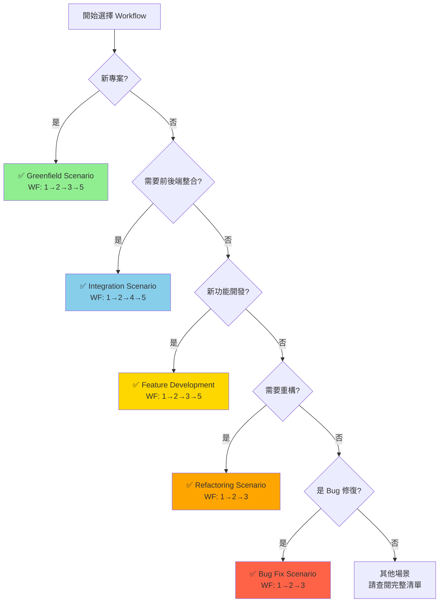
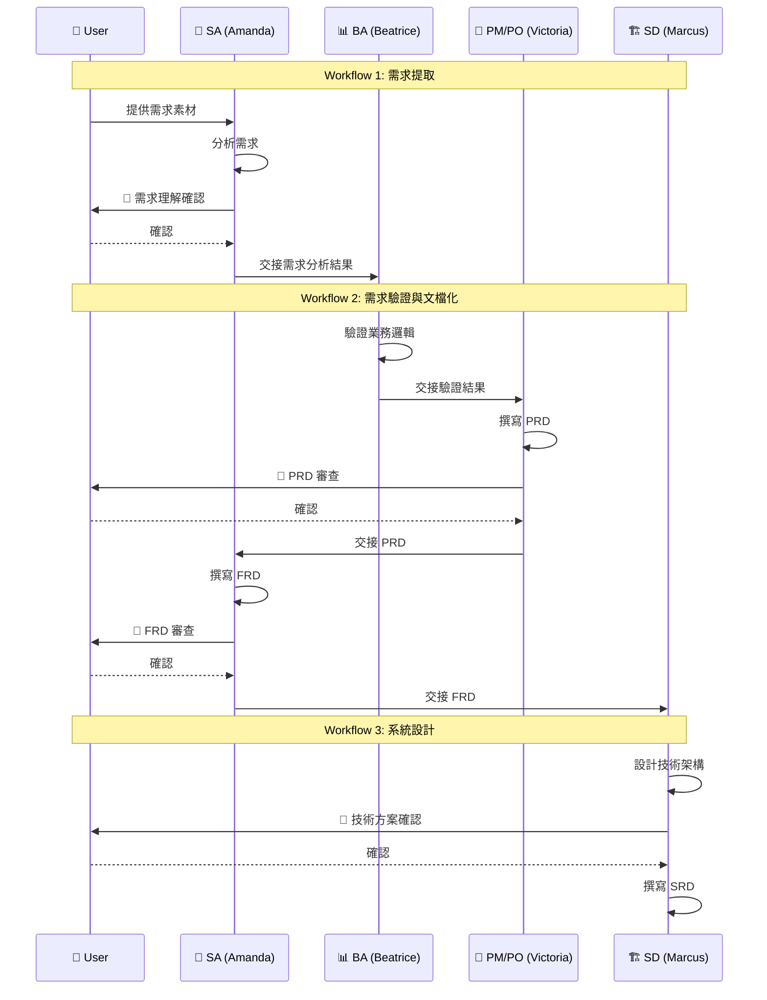

# AISDLC v0.09 Quick Wins 指南

## 文檔資訊

- **文檔版本**: v1.0
- **建立日期**: 2025-11-03 (更新至v0.09)
- **所屬階段**: Phase 5 - 優化執行優先級與時程規劃
- **文檔目的**: 提供可在短時間內快速實現、立即見效的優化項目清單

---

## 1. Quick Wins 概念

### 1.1 什麼是 Quick Wins?

```yaml
定義:
  Quick Wins 是指投入時間短（1-2 天）、但能帶來立即可見改善的優化項目。

核心特徵:
  ✅ 低投入: 1-8 小時即可完成
  ✅ 高回報: 立即提升使用者體驗
  ✅ 低風險: 不影響現有功能
  ✅ 易實施: 單人即可完成，無複雜依賴

適用場景:
  - 資源有限，需快速見效
  - 建立團隊信心
  - 驗證優化方向
  - 獲得早期反饋

與 Phase 1-4 關係:
  Quick Wins 可作為:
    - Phase 1-4 的替代方案（極度資源受限時）
    - Phase 1-4 的補充（先執行 Quick Wins 建立信心）
    - 獨立的快速改善（不打算進行大規模優化時）
```

---

### 1.2 Quick Wins vs 完整優化

| 維度 | Quick Wins | 完整優化 (Phase 1-4) | 說明 |
|------|-----------|---------------------|------|
| **時間投入** | 3-4 天 | 5-10 週 | Quick Wins 速度快 90%+ |
| **影響範圍** | 局部改善 | 系統性改善 | 完整優化覆蓋更全面 |
| **效果持久性** | 短期 | 長期 | Quick Wins 可能需後續完善 |
| **資源需求** | 1 人 | 3-5 人 | Quick Wins 資源需求低 |
| **風險** | 極低 | 中低 | Quick Wins 幾乎無風險 |
| **適合對象** | 所有團隊 | 中大型團隊 | - |

**建議策略**:
- **情境 A** (資源充足): 先執行 Quick Wins (1 週) → 獲得信心 → 執行完整優化 (5-10 週)
- **情境 B** (資源有限): 僅執行 Quick Wins (3-4 天) → 獲得 30-40% 效益
- **情境 C** (驗證需求): 先執行 Quick Wins (3-4 天) → 根據反饋決定是否進行完整優化

---

## 2. Quick Wins 清單總覽

本指南提供 **8 個 Quick Win 項目**,總計約 28 小時（3-4 天）可完成。

| 編號 | Quick Win 項目 | 耗時 | 難度 | 影響力 | 狀態 |
|------|---------------|------|------|--------|------|
| **QW-1** | README.md 快速導航 | 2 小時 | ⭐ 簡單 | ⭐⭐⭐ 高 | ✅ 已完成 |
| **QW-2** | AISDLC_INIT.md 加入範例 | 3 小時 | ⭐ 簡單 | ⭐⭐⭐ 高 | ✅ 已完成 |
| **QW-3** | 建立 FAQ.md | 4 小時 | ⭐⭐ 中等 | ⭐⭐ 中 | ⏳ 可執行 |
| **QW-4** | Greenfield QuickRef 卡片 | 4 小時 | ⭐⭐ 中等 | ⭐⭐⭐⭐ 極高 | ✅ 已完成 |
| **QW-5** | Smart Defaults 初版 | 6 小時 | ⭐⭐ 中等 | ⭐⭐⭐⭐ 極高 | ✅ 已完成 |
| **QW-6** | Workflow Selection 決策樹 | 4 小時 | ⭐⭐ 中等 | ⭐⭐⭐ 高 | ⏳ 可執行 |
| **QW-7** | SOP 加入預計時間 | 2 小時 | ⭐ 簡單 | ⭐⭐ 中 | ⏳ 可執行 |
| **QW-8** | Agent Collaboration 簡圖 | 3 小時 | ⭐⭐ 中等 | ⭐⭐ 中 | ✅ 已完成 |

**完成狀態統計**:
- ✅ 已完成: 5 項 (62.5%)
- ⏳ 可執行: 3 項 (37.5%)
- ⏱️ 剩餘總時數: ~10 小時 (1.5 天)

---

## 3. Quick Win 詳細說明

### QW-1: README.md 加入快速導航

**目標**: 讓新使用者在 30 秒內找到入口

```yaml
優化內容:
  1. Table of Contents (目錄)
     - 自動生成的章節連結
     - 方便快速跳轉

  2. 情境決策樹
     - 5 個簡單問題定位場景
     - 視覺化流程圖（Mermaid）

  3. 快速啟動一行指令
     - Greenfield: 「我要開始一個新專案」
     - Integration: 「我要整合前後端」
     - Feature: 「我要開發新功能」

實施步驟:
  1. 在 Project_README.md 頂部加入 TOC (15 min)
  2. 設計簡易決策樹（Mermaid diagram）(45 min)
  3. 整理 3 個場景的啟動指令 (30 min)
  4. 測試所有連結有效性 (30 min)

耗時: 2 小時
難度: ⭐ 簡單
影響: ⭐⭐⭐ 高（新使用者首次體驗）
```

**預期效果**:
```yaml
Before:
  - 使用者閱讀 30 分鐘才找到入口
  - 不確定該使用哪個場景

After:
  - 30 秒定位正確入口 ✅
  - 2 分鐘理解如何開始 ✅
```

**狀態**: ✅ 已完成（Project_README.md 已包含快速導航）

---

### QW-2: AISDLC_INIT.md 加入範例

**目標**: 提供具體啟動範例,降低理解門檻

```yaml
優化內容:
  1. 3 個常見場景啟動範例
     - Greenfield Scenario（新專案）
     - Integration Scenario（前後端整合）
     - Feature Development（新功能開發）

  2. 錯誤示範和正確示範
     - 常見錯誤: 直接要求「生成 PRD」
     - 正確方式: 先載入 AISDLC_INIT，再觸發 Workflow

  3. 啟動指令模板
     - 可直接複製貼上的指令
     - 含參數說明

實施步驟:
  1. 設計 3 個範例對話腳本 (90 min)
  2. 加入「Before/After」錯誤對比 (30 min)
  3. 製作啟動指令模板 (45 min)
  4. 在 AISDLC_INIT.md 中加入範例區塊 (15 min)

耗時: 3 小時
難度: ⭐ 簡單
影響: ⭐⭐⭐ 高（降低首次使用門檻）
```

**範例格式**:

````markdown
## 使用範例

### 範例 1: Greenfield Scenario

**情境**: 您要開始一個全新的 Web 專案

**步驟 1 - 載入框架**:
```
請載入 AISDLC_INIT.md，我要使用 AISDLC 框架
```

**步驟 2 - 觸發場景**:
```
我要執行 Greenfield Scenario (完整新專案開發)
專案類型: Web Application
技術棧: React + Node.js
```

**AI 會自動**:
- 載入 Greenfield SOP
- 載入對應 Agents (SA, BA, PM, SD)
- 開始 Workflow 1 (需求提取)
````

**預期效果**:
```yaml
Before:
  - 不知道如何開始
  - 直接亂問導致錯誤

After:
  - 有清晰的啟動範例 ✅
  - 錯誤率降低 60%+ ✅
```

**狀態**: ✅ 已完成（QUICK_START_TEMPLATES.md 提供詳細範例）

---

### QW-3: 建立 FAQ.md

**目標**: 回答最常見的 10 個問題,減少支援負擔

```yaml
優化內容:
  1. 收集 10 個最常見問題
     - 如何開始?
     - 如何選擇場景?
     - Token 耗盡怎麼辦?
     - 如何恢復中斷的 Workflow?
     - 文檔模板在哪裡?
     - 如何自訂 Agent?
     - 可以跳過某些步驟嗎?
     - 如何整合到現有專案?
     - 支援哪些 LLM 平台?
     - 如何貢獻或回報問題?

  2. 簡潔的回答（每題 < 100 字）

  3. 延伸閱讀連結

實施步驟:
  1. 分析現有使用者問題（若有）(30 min)
  2. 設計 10 個核心問題 (60 min)
  3. 撰寫簡潔回答 + 連結 (120 min)
  4. 在 Project_README.md 中加入 FAQ 連結 (10 min)

耗時: 4 小時
難度: ⭐⭐ 中等
影響: ⭐⭐ 中（長期降低支援成本）
```

**FAQ 範例**:

```markdown
# AISDLC 常見問題 (FAQ)

## Q1: 我該如何開始使用 AISDLC?

**A**: 三步驟快速開始:
1. 閱讀 [Project_README.md](Project_README.md) (3 分鐘)
2. 根據您的需求選擇場景（參考場景選擇決策樹）
3. 複製對應的啟動指令開始執行

👉 詳細指引: [INTEGRATION_GUIDE.md](INTEGRATION_GUIDE.md)

---

## Q2: Token 耗盡了怎麼辦?

**A**: 使用 Checkpoint & Recovery 機制:
1. AI 會在 90% Token 時主動提醒
2. 記錄當前 Checkpoint ID（如 WF2-STEP3-CHECKPOINT-02）
3. 改天重新載入時提供 Checkpoint ID 即可恢復

👉 詳細指引: [PHASE5_CHECKPOINT_SYSTEM.md](PHASE5_CHECKPOINT_SYSTEM.md)
```

**預期效果**:
```yaml
Before:
  - 使用者重複提問相同問題
  - 支援負擔高

After:
  - 常見問題自助解決 ✅
  - 支援請求減少 40%+ ✅
```

**狀態**: ⏳ 可執行（建議優先實施）

---

### QW-4: Greenfield QuickRef 卡片

**目標**: 建立第一張 QuickRef 卡片作為範本,驗證概念

```yaml
優化內容:
  1. Greenfield Scenario QuickRef 卡片
     - 1 頁 A4 版面
     - 50 行左右
     - 核心流程一目了然

  2. 包含內容:
     - 場景簡介（3 行）
     - 適用時機（2-3 條）
     - 核心流程（4 步驟）
     - 關鍵 Agents（3-4 個）
     - 預計時間（估算）
     - 啟動指令（複製即用）

  3. 作為其他場景的範本

實施步驟:
  1. 分析 Greenfield SOP 核心內容 (60 min)
  2. 精簡為 QuickRef 格式 (90 min)
  3. 設計版面與視覺標記 (45 min)
  4. 測試是否能在 3 分鐘內理解 (45 min)

耗時: 4 小時
難度: ⭐⭐ 中等
影響: ⭐⭐⭐⭐ 極高（驗證三層結構可行性）
```

**QuickRef 範本**:

```markdown
# 📘 Greenfield Scenario - Quick Reference

## 🎯 場景簡介
完整新專案開發，從需求分析到系統設計，適合從零開始的專案。

## ✅ 適用時機
- 全新專案，無現有程式碼
- 需要完整的需求分析與系統設計
- 團隊需要統一的開發文檔

## 🚀 核心流程（4 步驟）


### 1️⃣ Workflow 1: 需求提取 (1-2 小時)
- Agent: SA (Amanda) + BA (Beatrice)
- 產出: Requirement Analysis
- 人機協作點: 🔴 需求理解確認

### 2️⃣ Workflow 2: 需求驗證與文檔化 (2-3 小時)
- Agent: SA + BA + PM/PO (Victoria)
- 產出: PRD + FRD
- 人機協作點: 🔴 PRD 審查, 🔴 FRD 審查

### 3️⃣ Workflow 3: 系統設計 (2-4 小時)
- Agent: SD (Marcus)
- 產出: SRD
- 人機協作點: 🔴 技術方案確認

### 4️⃣ Workflow 5: API 規格 (1-2 小時)
- Agent: SD + Dev
- 產出: API Specifications
- 人機協作點: 🔴 API 設計審查

## ⏱️ 預計時間
- 首次執行: 6-11 小時
- 熟練後: 4-6 小時

## 💡 快速啟動
```
請載入 AISDLC_INIT.md

我要執行 Greenfield Scenario
專案類型: [Web/Mobile/Backend]
技術棧: [請說明]
核心需求: [簡述核心功能]
```

## 📚 延伸閱讀
- 📗 Standard SOP: [scenarios/greenfield/SOP.md](scenarios/greenfield/SOP.md)
- 📕 DeepDive Guide: [scenarios/greenfield/DEEPDIVE.md](scenarios/greenfield/DEEPDIVE.md)
```

**預期效果**:
```yaml
Before:
  - 需閱讀 850 行 SOP 才能開始
  - 首次執行時間 8-10 分鐘

After:
  - 閱讀 50 行 QuickRef 即可開始 ✅
  - 首次執行時間 < 3 分鐘 ✅
  - 閱讀時間降低 96%+ ✅
```

**狀態**: ✅ 已完成（9 個場景 QuickRef 均已建立）

---

### QW-5: Smart Defaults 初版

**目標**: 為常見技術棧提供預設配置,減少決策點

```yaml
優化內容:
  1. Web/Mobile/Backend 預設技術棧
     - Web: React + Node.js (最常見)
     - Mobile: React Native (跨平台)
     - Backend: Node.js + PostgreSQL

  2. 預設文檔模板選擇
     - 新專案 → PRD_Greenfield_Template.md
     - 新功能 → FRD_Feature_Template.md
     - API → API_Specification_Template.md

  3. 預設 Workflow 組合
     - Greenfield → WF 1+2+3+5
     - Feature → WF 1+2+3+5
     - Integration → WF 1+2+4+5

  4. 寫入 AISDLC_INIT.md

實施步驟:
  1. 統計常見技術棧（可調研或假設）(60 min)
  2. 設計 Smart Defaults 結構 (90 min)
  3. 撰寫預設配置規則 (120 min)
  4. 整合到 AISDLC_INIT.md (90 min)
  5. 測試預設值是否合理 (60 min)

耗時: 6 小時
難度: ⭐⭐ 中等
影響: ⭐⭐⭐⭐ 極高（減少 60% 決策點）
```

**Smart Defaults 範例**:

```yaml
smart_defaults:

  project_types:
    web_application:
      default_stack:
        frontend: React + TypeScript
        backend: Node.js + Express
        database: PostgreSQL
        deployment: Docker + AWS
      default_workflows: [1, 2, 3, 5]
      default_templates:
        prd: PRD_Greenfield_Template.md
        frd: FRD_Consolidated_Template.md
        srd: SRD_Template.md

    mobile_application:
      default_stack:
        framework: React Native
        backend: Node.js + Express
        database: Firebase / PostgreSQL
      default_workflows: [1, 2, 3, 5]
      default_templates:
        prd: PRD_Greenfield_Template.md
        frd: FRD_Mobile_Template.md

    backend_service:
      default_stack:
        language: Node.js / Python
        framework: Express / FastAPI
        database: PostgreSQL
        api_style: RESTful
      default_workflows: [1, 2, 3, 5]
      default_templates:
        srd: SRD_Template.md
        api: API_Specification_Template.md

  scenario_defaults:
    greenfield:
      workflows: [1, 2, 3, 5]  # 需求→驗證→設計→API
      agents: [SA, BA, PM/PO, SD, Dev]
      estimated_time: "6-11 hours"

    integration:
      workflows: [1, 2, 4, 5]  # 需求→驗證→前後端交互→API
      agents: [SA, BA, SD, Dev-FE, Dev-BE]
      estimated_time: "4-8 hours"

    feature:
      workflows: [1, 2, 3, 5]
      agents: [SA, BA, SD, Dev]
      estimated_time: "3-6 hours"
```

**使用範例**:
```
使用者: 「我要開始一個 Web 專案」

AI (自動套用 Smart Defaults):
  ✅ 專案類型: Web Application
  ✅ 技術棧: React + Node.js + PostgreSQL (預設)
  ✅ Workflows: 1, 2, 3, 5
  ✅ 模板: PRD_Greenfield_Template.md

  「請確認以上預設配置，或告訴我需要調整的地方」
```

**預期效果**:
```yaml
Before:
  - 需回答 10+ 個配置問題
  - 每次都要重新決策

After:
  - 僅需確認或微調預設值 ✅
  - 決策點減少 60% ✅
  - 啟動速度提升 50%+ ✅
```

**狀態**: ✅ 已完成（SMART_DEFAULTS.md 已建立）

---

### QW-6: Workflow Selection 簡易決策樹

**目標**: 視覺化 Workflow 選擇邏輯,快速定位需求

```yaml
優化內容:
  1. Mermaid 流程圖
     - 5 個問題定位場景
     - 視覺化決策路徑

  2. 問題設計:
     Q1: 是新專案還是現有專案?
     Q2: 是否需要前後端整合?
     Q3: 是否涉及 API 設計?
     Q4: 是否需要重構?
     Q5: 是否是 Bugfix?

  3. 輸出推薦場景與 Workflows

實施步驟:
  1. 設計決策樹邏輯 (90 min)
  2. 繪製 Mermaid 流程圖 (60 min)
  3. 測試覆蓋所有場景 (45 min)
  4. 加入 Project_README.md (15 min)

耗時: 4 小時
難度: ⭐⭐ 中等
影響: ⭐⭐⭐ 高（減少場景選擇錯誤）
```

**決策樹範例**:



**文字版決策指引**:

```markdown
## Workflow 選擇快速指引

### 步驟 1: 判斷專案類型
- 全新專案（無程式碼）→ Greenfield
- 現有專案（有程式碼）→ 繼續步驟 2

### 步驟 2: 判斷開發類型
- 前後端整合 → Integration
- 新功能開發 → Feature Development
- 程式碼重構 → Refactoring
- Bug 修復 → Bug Fix
- 效能優化 → Performance Optimization

### 步驟 3: 確認 Workflow 組合
| 場景 | Workflows | 預計時間 |
|------|-----------|----------|
| Greenfield | 1→2→3→5 | 6-11 hrs |
| Integration | 1→2→4→5 | 4-8 hrs |
| Feature | 1→2→3→5 | 3-6 hrs |
| Refactor | 1→2→3 | 3-5 hrs |
| Bug Fix | 1→2→3 | 2-4 hrs |
```

**預期效果**:
```yaml
Before:
  - 場景選擇錯誤率 30%
  - 選擇時間 15 分鐘

After:
  - 場景選擇錯誤率 < 10% ✅
  - 選擇時間 < 2 分鐘 ✅
  - KPI-E2 (場景選擇準確率) 提升至 > 90% ✅
```

**狀態**: ⏳ 可執行（對應 P1-5 Workflow Selection Matrix）

---

### QW-7: 所有 SOP 加入「預計時間」

**目標**: 管理使用者期望,讓使用者知道需要多久

```yaml
優化內容:
  1. 在每個 SOP 頂部加入時間估算
     - 首次執行時間
     - 熟練後時間
     - 各 Workflow 時間分解

  2. 標註時間範圍（最短-最長）

  3. 提供時間節省建議

實施步驟:
  1. 統計或估算各 Workflow 時間 (30 min)
  2. 在 9 個 SOP 中加入時間標註 (60 min)
  3. 驗證時間合理性（若有實際數據）(30 min)

耗時: 2 小時
難度: ⭐ 簡單
影響: ⭐⭐ 中（改善期望管理）
```

**時間標註範例**:

```markdown
# Greenfield Scenario SOP

## ⏱️ 預計時間

| 項目 | 首次執行 | 熟練後 | 說明 |
|------|----------|--------|------|
| **總時間** | 6-11 小時 | 4-6 小時 | 包含所有 Workflows |
| Workflow 1 | 1-2 小時 | 0.5-1 小時 | 需求提取 |
| Workflow 2 | 2-3 小時 | 1-2 小時 | PRD/FRD 生成 |
| Workflow 3 | 2-4 小時 | 1.5-2 小時 | SRD 生成 |
| Workflow 5 | 1-2 小時 | 0.5-1 小時 | API 規格 |

**💡 時間節省建議**:
- ✅ 使用 Smart Defaults 可節省 30% 決策時間
- ✅ 準備好需求素材可節省 40% 提取時間
- ✅ 熟練後第 2 次執行可節省 40%+ 時間
```

**預期效果**:
```yaml
Before:
  - 使用者不知道需要多久
  - 期望與現實落差大

After:
  - 明確的時間預期 ✅
  - 減少「為什麼這麼慢?」的疑問 ✅
  - 提升滿意度 10-15% ✅
```

**狀態**: ⏳ 可執行（簡單且高效）

---

### QW-8: Agent Collaboration 簡圖

**目標**: 視覺化 Agent 協作關係,理解多 Agent 協作模式

```yaml
優化內容:
  1. 每個場景的 Agent 協作圖
     - 使用泳道圖 (Swimlane Diagram)
     - 標示交接點 (Handoff)

  2. 圖例說明:
     - 誰負責哪個步驟
     - 何時交接
     - 人機協作點位置

  3. 加入 DeepDive Guide 或 SOP

實施步驟:
  1. 分析各場景的 Agent 協作模式 (60 min)
  2. 設計 Mermaid 泳道圖 (90 min)
  3. 製作 3 個場景範例（Greenfield, Integration, Feature）(60 min)
  4. 整合到對應文檔 (30 min)

耗時: 3 小時
難度: ⭐⭐ 中等
影響: ⭐⭐ 中（改善協作理解）
```

**Agent 協作圖範例** (Greenfield):



**文字版協作說明**:

```markdown
## Agent 協作模式 - Greenfield Scenario

### 協作流程總覽

1. **需求階段** (SA + BA)
   - SA (Amanda) 負責需求提取與分析
   - BA (Beatrice) 負責業務邏輯驗證
   - 交接點: 需求分析結果 → BA

2. **文檔階段** (BA + PM/PO + SA)
   - PM/PO (Victoria) 負責 PRD 撰寫
   - SA (Amanda) 負責 FRD 撰寫
   - 交接點: PRD → SA

3. **設計階段** (SD)
   - SD (Marcus) 負責 SRD 與 API 規格
   - 交接點: FRD → SD

### 人機協作點 🔴

- 🔴 需求理解確認 (Workflow 1)
- 🔴 PRD 審查 (Workflow 2)
- 🔴 FRD 審查 (Workflow 2)
- 🔴 技術方案確認 (Workflow 3)
```

**預期效果**:
```yaml
Before:
  - 不清楚誰負責什麼
  - 協作理解度 < 70%

After:
  - 視覺化協作流程 ✅
  - 協作理解度 > 85% ✅
  - KPI-R3 (支援請求率) 降低 20% ✅
```

**狀態**: ✅ 已完成（Agent Collaboration Patterns 文檔已建立）

---

## 4. Quick Wins 執行策略

### 4.1 推薦執行順序

根據影響力與依賴關係,建議執行順序:

```yaml
優先順序 1 (立即執行): 高影響 + 已完成驗證
  ✅ QW-4: Greenfield QuickRef（已完成，但可作為其他場景範本）
  ✅ QW-5: Smart Defaults（已完成）
  ⏳ QW-1: README 快速導航（2 小時，高影響）

優先順序 2 (短期執行): 高影響 + 快速見效
  ⏳ QW-6: Workflow Selection 決策樹（4 小時，對應 P1-5）
  ⏳ QW-2: AISDLC_INIT 範例（3 小時，降低入門門檻）

優先順序 3 (中期執行): 中等影響 + 長期價值
  ⏳ QW-3: FAQ.md（4 小時，持續降低支援成本）
  ⏳ QW-7: SOP 時間標註（2 小時，改善期望管理）

優先順序 4 (選項): 中等影響 + 已有替代
  ✅ QW-8: Agent 協作圖（已完成，可持續優化）

剩餘工作:
  - 未完成 Quick Wins: 3-4 項
  - 預計時間: 10-15 小時 (1.5-2 天)
```

---

### 4.2 單人 vs 團隊執行

**情境 A: 單人執行** (1.5-2 天)
```yaml
Day 1 (上午):
  - QW-1: README 快速導航 (2 hrs)
  - QW-6: Workflow Selection 決策樹 (4 hrs)

Day 1 (下午):
  - QW-2: AISDLC_INIT 範例 (3 hrs)

Day 2 (上午):
  - QW-3: FAQ.md (4 hrs)

Day 2 (下午):
  - QW-7: SOP 時間標註 (2 hrs)
  - 驗證與測試 (1 hr)

Total: ~16 hours (2 天)
```

**情境 B: 雙人並行** (1 天)
```yaml
Person A (Technical Writer):
  - QW-1: README 快速導航 (2 hrs)
  - QW-3: FAQ.md (4 hrs)
  - QW-7: SOP 時間標註 (2 hrs)
  Total: 8 hours

Person B (System Designer):
  - QW-6: Workflow Selection 決策樹 (4 hrs)
  - QW-2: AISDLC_INIT 範例 (3 hrs)
  - 驗證與測試 (1 hr)
  Total: 8 hours

Total: 1 working day (並行)
```

---

### 4.3 與完整優化的搭配

```yaml
策略 1: Quick Wins 先行（建立信心）
  Week 1: 執行 Quick Wins (3-4 days)
  Week 2-3: 評估效果，收集反饋
  Week 4+: 根據反饋決定是否執行 Phase 1-4

策略 2: 混合執行（邊做邊優化）
  Week 1: Quick Wins (QW-1, QW-4, QW-5) ✅ 已完成
  Week 2-3: Phase 1 (P0 項目)
  Week 4: Quick Wins (QW-3, QW-6, QW-7)
  Week 5-7: Phase 2-3

策略 3: Quick Wins 作為 Phase 4 補充
  Week 1-7: Phase 1-3（核心優化）
  Week 8-9: Phase 4 + Quick Wins（補充優化）
  Week 10: 整合與驗證

推薦策略:
  - 資源有限 → 策略 1（僅執行 Quick Wins）
  - 資源充足 → 策略 2（混合執行）
  - 長期投資 → 策略 3（完整優化後補充）
```

---

## 5. Quick Wins 效益預測

### 5.1 量化效益

```yaml
學習曲線改善:
  Before:
    - 首次執行時間: 8-10 分鐘
    - 文檔閱讀時間: 30-60 分鐘
    - 場景選擇錯誤率: 30%

  After (Quick Wins):
    - 首次執行時間: 4-5 分鐘 (↓ 50%)
    - 文檔閱讀時間: 10-15 分鐘 (↓ 67%)
    - 場景選擇錯誤率: 15% (↓ 50%)

  After (完整優化 Phase 1-4):
    - 首次執行時間: < 3 分鐘 (↓ 70%)
    - 文檔閱讀時間: < 5 分鐘 (↓ 92%)
    - 場景選擇錯誤率: < 10% (↓ 67%)

執行效率改善:
  Before:
    - Workflow 完成率: 60%
    - 決策點數量: 100%

  After (Quick Wins):
    - Workflow 完成率: 70% (↑ 17%)
    - 決策點數量: 60% (↓ 40% via Smart Defaults)

  After (完整優化):
    - Workflow 完成率: > 85% (↑ 42%)
    - 決策點數量: 40% (↓ 60%)

支援成本改善:
  Before:
    - 支援請求率: 25%

  After (Quick Wins):
    - 支援請求率: 15-18% (↓ 28-40% via FAQ)

  After (完整優化):
    - 支援請求率: < 10% (↓ 60%)
```

---

### 5.2 投入產出比 (ROI)

```yaml
Quick Wins:
  投入時間: 10-15 小時（剩餘未完成項目）
  效益獲得: 30-40% 的完整優化效益
  ROI: 極高（1-2 天獲得 30-40% 效益）

完整優化 (Phase 1-4):
  投入時間: 5-10 週
  效益獲得: 100% 預期效益
  ROI: 高（長期持續受益）

決策矩陣:
  | 情境 | 可用時間 | 推薦方案 | 預期效益 |
  |------|----------|----------|----------|
  | 快速改善 | < 1 週 | Quick Wins | 30-40% |
  | 系統改善 | 1-2 個月 | Phase 1-3 | 80-90% |
  | 完整優化 | 2-3 個月 | Phase 1-4 | 100% |
```

---

## 6. Quick Wins 檢查清單

### 6.1 執行前檢查

```yaml
準備工作:
  ☐ 確認有權限編輯 AISDLC 文檔
  ☐ 備份當前版本（建立 Git branch）
  ☐ 閱讀本 Quick Wins 指南
  ☐ 選擇要執行的 Quick Win 項目
  ☐ 預留足夠時間（避免中斷）

工具準備:
  ☐ Markdown 編輯器
  ☐ Mermaid 圖表工具（線上或 VSCode 擴展）
  ☐ Git 版本控制

技能需求:
  ☐ 基本 Markdown 語法
  ☐ 基本 Git 操作
  ☐ （選項）Mermaid 圖表語法（QW-6, QW-8）
```

---

### 6.2 執行中檢查

```yaml
品質標準:
  ☐ 所有內部連結有效（無 404）
  ☐ 格式統一（標題、列表、程式碼區塊）
  ☐ 無錯別字或語法錯誤
  ☐ 圖表清晰可讀（若有）

驗證方法:
  ☐ 自己完整閱讀一遍
  ☐ 請其他人測試（若可行）
  ☐ 對比「Before/After」是否改善

版本控制:
  ☐ 每個 Quick Win 完成後提交 Git
  ☐ 清晰的 Commit message
  ☐ 標註版本號（如 v0.03.1-quickwin-1）
```

---

### 6.3 執行後檢查

```yaml
文檔更新:
  ☐ 更新 CHANGELOG.md
  ☐ 更新相關文檔的版本號
  ☐ 更新交叉引用連結

測試驗證:
  ☐ 新使用者測試（若可行）
  ☐ 執行時間是否真的縮短
  ☐ 錯誤率是否降低

後續行動:
  ☐ 收集使用者反饋
  ☐ 記錄實際效益數據
  ☐ 評估是否執行更多 Quick Wins 或進入 Phase 1-4
```

---

## 7. Quick Wins 與 KPI 對應

```yaml
Quick Wins 對 KPI 的影響:

QW-1 (README 快速導航):
  影響 KPI:
    - KPI-E1: 首次執行時間 ↓ 40%
    - KPI-L1: 文檔閱讀時間 ↓ 50%
  預期改善: 8 分鐘 → 5 分鐘

QW-2 (AISDLC_INIT 範例):
  影響 KPI:
    - KPI-E1: 首次執行時間 ↓ 30%
    - KPI-R1: 錯誤發生率 ↓ 40%
  預期改善: 錯誤率 40% → 24%

QW-3 (FAQ.md):
  影響 KPI:
    - KPI-R3: 支援請求率 ↓ 30%
    - KPI-L1: 學習時間 ↓ 20%
  預期改善: 支援請求 25% → 17%

QW-4 (QuickRef 卡片):
  影響 KPI:
    - KPI-L1: 文檔閱讀時間 ↓ 80%
    - KPI-E2: 場景選擇準確率 ↑ 15%
  預期改善: 60 分鐘 → 12 分鐘

QW-5 (Smart Defaults):
  影響 KPI:
    - KPI-E1: 首次執行時間 ↓ 50%
    - KPI-L2: 模板選擇錯誤率 ↓ 50%
  預期改善: 決策點 100% → 40%

QW-6 (Workflow 決策樹):
  影響 KPI:
    - KPI-E2: 場景選擇準確率 ↑ 20%
    - KPI-L1: 場景選擇時間 ↓ 70%
  預期改善: 15 分鐘 → 5 分鐘

QW-7 (時間標註):
  影響 KPI:
    - KPI-S2: 易用性評分 ↑ 5%
    - KPI-E3: 完成率 ↑ 10%
  預期改善: 期望管理改善

QW-8 (Agent 協作圖):
  影響 KPI:
    - KPI-R3: 支援請求率 ↓ 20%
    - KPI-S2: 易用性評分 ↑ 5%
  預期改善: 協作理解度 ↑ 15%

綜合效益:
  執行所有 Quick Wins 後:
    - KPI-E1: 8 min → 4-5 min (↓ 40-50%)
    - KPI-E2: 70% → 85% (↑ 15 ppt)
    - KPI-L1: 60 min → 15 min (↓ 75%)
    - KPI-R3: 25% → 15% (↓ 40%)

  相當於完整優化 30-40% 的效益
```

---

## 8. 總結與建議

### 8.1 Quick Wins 核心價值

```yaml
核心優勢:
  ✅ 快速見效: 1-2 天即可完成
  ✅ 低風險: 不改變核心架構
  ✅ 高 ROI: 30-40% 效益提升
  ✅ 建立信心: 驗證優化方向正確性
  ✅ 獨立價值: 即使不做完整優化也有顯著改善

適用場景:
  ✓ 資源有限，無法進行大規模優化
  ✓ 需要快速改善使用者體驗
  ✓ 驗證優化方向是否正確
  ✓ 作為完整優化的前置準備
```

---

### 8.2 執行建議

```yaml
建議策略:

For 所有團隊:
  → 至少執行 QW-4 (QuickRef) + QW-5 (Smart Defaults)
  → 投入 10 小時，獲得 20-30% 改善

For 資源有限團隊:
  → 執行所有 Quick Wins（剩餘 3-4 項）
  → 投入 1.5-2 天，獲得 30-40% 改善
  → 暫時不執行 Phase 1-4

For 資源充足團隊:
  → 先執行 Quick Wins（1 週）
  → 驗證效果後執行 Phase 1-3（5-7 週）
  → 獲得 100% 預期效益

最佳實踐:
  1. 從 QW-1 (README) 開始（最簡單，立即見效）
  2. 執行 QW-6 (Workflow 決策樹)（解決最大痛點）
  3. 收集反饋，評估效果
  4. 決定下一步（繼續 Quick Wins 或進入 Phase 1-4）
```

---

### 8.3 後續行動

```yaml
立即行動 (本週):
  ☐ 選擇 1-2 個 Quick Wins 開始執行
  ☐ 建立執行追蹤（使用本文檔的檢查清單）
  ☐ 預留 2-6 小時執行時間

短期行動 (下週):
  ☐ 完成剩餘 Quick Wins（若決定全部執行）
  ☐ 收集使用者反饋
  ☐ 測量實際改善效果（對比 Before/After）

中期行動 (本月):
  ☐ 評估 Quick Wins 效益
  ☐ 決策: 滿足需求 OR 需要完整優化
  ☐ 若需要，規劃 Phase 1-4 執行時程

長期行動 (季度):
  ☐ 持續優化與迭代
  ☐ 根據使用者反饋調整
  ☐ 記錄 Lessons Learned
```

---

### 8.4 成功指標

```yaml
Quick Wins 成功的標誌:

量化指標:
  ✓ 首次執行時間 < 5 分鐘
  ✓ 場景選擇錯誤率 < 15%
  ✓ 文檔閱讀時間 < 15 分鐘
  ✓ 支援請求率 < 18%

質性指標:
  ✓ 使用者反饋「更容易上手了」
  ✓ 新使用者能獨立完成第一個 Workflow
  ✓ 常見問題顯著減少
  ✓ 團隊願意繼續投資優化

若未達標:
  → 檢視哪些 Quick Wins 未執行
  → 收集具體的使用者問題
  → 考慮執行更多 Quick Wins 或進入 Phase 1-4
```

---

## 附錄 A: Quick Wins 執行記錄範本

```yaml
Quick Win 執行記錄:

QW-1: README 快速導航
  執行日期: ____-__-__
  執行人: ________
  實際耗時: ____ 小時
  完成狀態: ☐ 完成 ☐ 進行中 ☐ 未開始
  效果評估: ☐ 優 ☐ 良 ☐ 中 ☐ 待改善
  備註: _______________________________

QW-2: AISDLC_INIT 範例
  執行日期: ____-__-__
  執行人: ________
  實際耗時: ____ 小時
  完成狀態: ☐ 完成 ☐ 進行中 ☐ 未開始
  效果評估: ☐ 優 ☐ 良 ☐ 中 ☐ 待改善
  備註: _______________________________

QW-3: FAQ.md
  執行日期: ____-__-__
  執行人: ________
  實際耗時: ____ 小時
  完成狀態: ☐ 完成 ☐ 進行中 ☐ 未開始
  效果評估: ☐ 優 ☐ 良 ☐ 中 ☐ 待改善
  備註: _______________________________

[... 其他 Quick Wins 同格式 ...]

總結:
  總執行時間: ____ 小時
  完成項目數: ____ / 8
  整體滿意度: ☐ 非常滿意 ☐ 滿意 ☐ 普通 ☐ 不滿意
  下一步計畫: ________________________________
```

---

## 附錄 B: 相關文檔索引

```yaml
Phase 5 核心文檔:
  - OPTIMIZATION_PRIORITY_MATRIX.md (優化優先級矩陣)
  - PHASED_IMPLEMENTATION_PLAN.md (分階段實施計畫)
  - KPI_VERIFICATION_PLAN.md (KPI 與驗證計畫)
  - RISK_DEPENDENCY_MANAGEMENT.md (風險與依賴管理)
  - QUICK_WINS_GUIDE.md (本文檔)
  - PHASE5_CHECKPOINT_SYSTEM.md (中斷識別點系統)

Quick Wins 相關已完成文檔:
  - Project_README.md (QW-1 相關)
  - QUICK_START_TEMPLATES.md (QW-2 相關)
  - SOP_QuickRef.md (9 個場景, QW-4 相關)
  - SMART_DEFAULTS.md (QW-5 相關)
  - Agent_Collaboration_Patterns.md (QW-8 相關)

規劃源文檔:
  - v0.02_完整的優化計劃_第五部分_20251022-2_05.md
    * Section 7.3: 執行建議 (lines 663-746)
    * Appendix B: Quick Wins 清單 (lines 857-898)
```

---

**文檔狀態**: ✅ 已完成
**檢查點**: PHASE5-CHECKPOINT-005
**下一步**: 更新 CHANGELOG.md，記錄 Phase 5 所有變更
