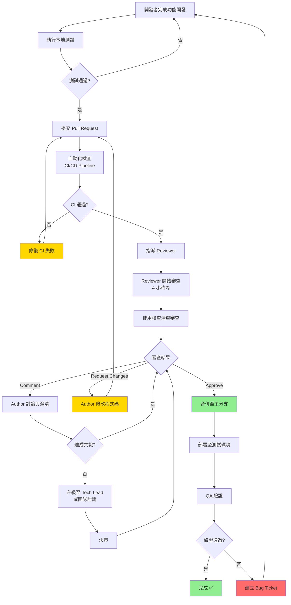
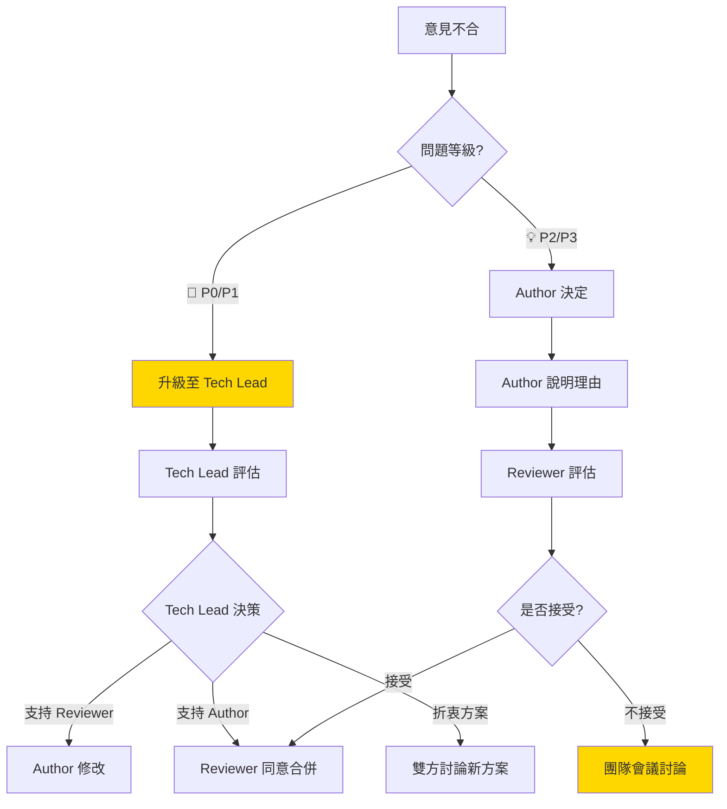

# Code Review 指南
# Code Review Guidelines

> **🎯 文檔目的**
>
> 本檔案提供 **Code Review 的完整標準化流程與檢查清單**，協助團隊建立高品質的程式碼審查機制。
>
> - **適用階段**: Stage 7-8 - 開發與測試階段
> - **執行時機**: 每個 Pull Request/Merge Request 送出後
> - **執行角色**: Dev (Reviewer) + Dev (Author) + QA (選填)
> - **目標**: 確保程式碼品質、知識分享、降低技術債務

---

**版本**: v1.0
**最後更新**: 2025-11-21
**文檔類型**: 開發指南 | 品質管理
**相關文檔**:
- [code-analysis-flow.md](../workflow/scenario-specific/code-analysis-flow.md) - 代碼分析流程
- [Security_Design_Checklist.md](./Security_Design_Checklist.md) - 安全性設計檢查清單
- [Document_Quality_Checklist.md](./Document_Quality_Checklist.md) - 文檔品質檢查清單

---

## 📋 目錄

1. [Code Review 總覽](#code-review-總覽)
2. [Code Review 流程](#code-review-流程)
3. [Code Review 檢查清單](#code-review-檢查清單)
4. [不同類型 PR 的審查重點](#不同類型-pr-的審查重點)
5. [Code Review 最佳實踐](#code-review-最佳實踐)
6. [常見問題與處理方式](#常見問題與處理方式)
7. [Code Review 工具與自動化](#code-review-工具與自動化)
8. [Code Review 範例與案例](#code-review-範例與案例)

---

## Code Review 總覽

### 什麼是 Code Review？

**Code Review（程式碼審查）** 是團隊成員在程式碼合併至主分支前，系統性檢查程式碼品質、邏輯正確性、安全性與可維護性的流程。

### 為什麼需要 Code Review？

| 目標 | 說明 | 預期效益 |
|------|------|---------|
| **品質把關** | 及早發現 Bug、邏輯錯誤、安全漏洞 | 減少 70-90% 上線前缺陷 |
| **知識分享** | 團隊成員互相學習最佳實踐 | 提升團隊整體技術水平 |
| **代碼一致性** | 確保符合 Coding Style 與架構設計 | 降低維護成本 30-50% |
| **降低技術債務** | 避免臨時解法累積 | 長期開發速度提升 20-40% |
| **促進協作** | 建立溝通與回饋文化 | 團隊凝聚力提升 |

### Code Review 的黃金原則

| 原則 | 說明 |
|------|------|
| **🚀 快速回應** | PR 送出後 4 小時內開始審查，24 小時內完成 |
| **🎯 專注重點** | 單次 PR ≤ 400 行程式碼，專注核心問題 |
| **💬 建設性回饋** | 提出問題時附上建議解法或參考資料 |
| **🤝 尊重與協作** | 討論程式碼而非人，保持專業與友善 |
| **📚 持續改進** | 記錄常見問題，定期回顧與優化流程 |

---

## Code Review 流程

### 標準流程圖



### 流程步驟詳解

#### 步驟 1: 開發者準備 PR（5-15 分鐘）

**準備事項**:
- ✅ 完成功能開發，通過本地測試
- ✅ 確保符合 Coding Style（執行 Linter/Formatter）
- ✅ 撰寫或更新單元測試（測試覆蓋率 ≥ 80%）
- ✅ 更新相關文檔（README、API Spec、註解）
- ✅ 自我審查（使用本文件的檢查清單）

**PR 描述範本**:

```markdown
## 📋 PR 類型
- [ ] 🚀 新功能 (Feature)
- [ ] 🐛 Bug 修復 (Bug Fix)
- [ ] 🔧 重構 (Refactor)
- [ ] 📝 文檔更新 (Documentation)
- [ ] ⚡ 效能優化 (Performance)
- [ ] 🔒 安全性修復 (Security)

## 🎯 目標與背景
**關聯 Issue/Story**: #123 (US-456: 使用者可以重設密碼)

**問題描述**:
- 目前系統沒有「忘記密碼」功能
- 使用者無法自助重設密碼，需聯繫客服

**解決方案**:
- 新增「忘記密碼」功能
- 寄送驗證碼至使用者 Email
- 使用者輸入驗證碼後可設定新密碼

## 🔄 變更內容
- **新增檔案**:
  - `src/services/PasswordResetService.ts` - 密碼重設服務
  - `src/components/ForgotPasswordForm.tsx` - 忘記密碼表單
- **修改檔案**:
  - `src/routes/auth.ts` - 新增 `/forgot-password` 與 `/reset-password` 路由
  - `src/utils/email.ts` - 新增驗證碼 Email 模板
- **刪除檔案**: 無

## ✅ 測試
- [x] 單元測試（新增 15 個測試案例，覆蓋率 92%）
- [x] 整合測試（測試完整密碼重設流程）
- [x] 手動測試（測試成功/失敗情境）
- [x] 跨瀏覽器測試（Chrome, Firefox, Safari）

**測試案例**:
1. ✅ 輸入註冊 Email，成功收到驗證碼
2. ✅ 輸入正確驗證碼，成功重設密碼
3. ✅ 輸入錯誤驗證碼，顯示錯誤訊息
4. ✅ 驗證碼過期（15 分鐘），無法重設
5. ✅ 驗證碼連續錯誤 5 次，鎖定 30 分鐘

## 📸 截圖/影片


## ⚠️ 特殊注意事項
- 驗證碼有效期限為 15 分鐘
- 需確保 Email 服務正常運作
- 新增環境變數：`SMTP_HOST`, `SMTP_USER`, `SMTP_PASSWORD`

## 📝 自我審查確認
- [x] 程式碼符合 Coding Style（執行 ESLint/Prettier）
- [x] 無 console.log 或 debugger
- [x] 敏感資訊已移除（API Key、密碼）
- [x] 測試覆蓋率 ≥ 80%
- [x] API 文檔已更新

## 🔗 相關連結
- **Design Spec**: [Figma - 忘記密碼流程](https://figma.com/xxx)
- **API Spec**: [API_Auth_ForgotPassword.md](docs/api/API_Auth_ForgotPassword.md)
- **User Story**: [US-456](https://jira.example.com/US-456)
```

---

#### 步驟 2: 自動化檢查（1-5 分鐘）

**CI/CD Pipeline 自動檢查項目**:

| 檢查項目 | 工具範例 | 通過標準 |
|---------|---------|---------|
| **Linting** | ESLint, Pylint, RuboCop | 0 個 Error，Warning ≤ 5 個 |
| **Coding Style** | Prettier, Black, gofmt | 100% 符合規範 |
| **單元測試** | Jest, pytest, JUnit | 通過率 100%，覆蓋率 ≥ 80% |
| **安全性掃描** | Snyk, OWASP Dependency-Check | 無 Critical/High 漏洞 |
| **程式碼複雜度** | SonarQube, Code Climate | Cyclomatic Complexity ≤ 10 |
| **效能測試** | Lighthouse, K6 | 回應時間 < 200ms |
| **建置測試** | Docker Build, npm build | 建置成功 |

**CI 失敗處理**:
- ❌ CI 失敗 → Author 修復 → 重新提交
- ⚠️ Warning 過多 → Reviewer 評估是否需要修復
- ✅ 全部通過 → 進入人工審查階段

---

#### 步驟 3: Reviewer 審查（20-40 分鐘，視 PR 大小）

**審查時機**:
- ⏰ PR 送出後 **4 小時內**開始審查
- 🎯 單次審查時間 **20-40 分鐘**（超過建議拆分 PR）
- 📅 每日固定時段審查（如 10:00-11:00, 15:00-16:00）

**審查步驟**:

1. **快速掃描（5 分鐘）**:
   - 閱讀 PR 描述，理解變更目的
   - 檢視變更檔案清單與行數
   - 確認 CI 通過狀態

2. **深度審查（15-30 分鐘）**:
   - 使用 [Code Review 檢查清單](#code-review-檢查清單)
   - 逐檔案審查，標記問題與建議
   - 測試關鍵邏輯（必要時本地 Checkout）

3. **撰寫回饋（5 分鐘）**:
   - 分類問題（🚨 Must Fix, ⚠️ Should Fix, 💡 Suggestion）
   - 每個問題附上說明與建議
   - 總結審查結果

**審查結果**:

| 狀態 | 說明 | 後續動作 |
|------|------|---------|
| **✅ Approve** | 程式碼品質良好，可合併 | Author 合併 PR |
| **⚠️ Request Changes** | 有需要修正的問題（🚨 Must Fix） | Author 修改程式碼 |
| **💬 Comment** | 有建議或疑問，但不阻擋合併 | Author 評估是否採納 |

---

#### 步驟 4: Author 回應與修改（10-30 分鐘）

**回應方式**:

```markdown
### 🚨 Must Fix - 安全性問題

**Reviewer**: 密碼明文儲存，有安全風險
**檔案**: `src/services/UserService.ts:45`

**Author 回應**:
✅ **已修正** - 改用 bcrypt 加密密碼，salt rounds = 10
**Commit**: abc1234

---

### ⚠️ Should Fix - 效能問題

**Reviewer**: 使用 `for` 迴圈查詢資料庫，N+1 問題
**檔案**: `src/services/OrderService.ts:120`

**Author 回應**:
✅ **已修正** - 改用 `Promise.all()` 批次查詢
**效能改善**: 查詢時間從 2.5s 降至 0.3s
**Commit**: def5678

---

### 💡 Suggestion - 命名建議

**Reviewer**: 變數名稱 `tmp` 不夠清楚
**檔案**: `src/utils/formatter.ts:33`

**Author 回應**:
✅ **已修正** - 改名為 `formattedDate`
**Commit**: ghi9012

---

### 💡 Suggestion - 新增註解

**Reviewer**: 複雜邏輯建議加上註解
**檔案**: `src/algorithms/sort.ts:67`

**Author 回應**:
📝 **下個 PR 處理** - 建立 Ticket #789 追蹤
**理由**: 此 PR 專注功能開發，註解優化拆分至獨立 PR
```

---

#### 步驟 5: 合併與部署（5-10 分鐘）

**合併策略**:

| 策略 | 說明 | 適用情境 |
|------|------|---------|
| **Merge Commit** | 保留完整歷史記錄 | Feature Branch 合併至 Main |
| **Squash Merge** | 合併為單一 Commit | 多個小 Commit 整合 |
| **Rebase Merge** | 線性歷史記錄 | 保持主分支整潔 |

**合併後檢查**:
- ✅ 自動部署至測試環境
- ✅ 執行 Smoke Test（關鍵功能驗證）
- ✅ 通知 QA 進行驗證
- ✅ 更新 Jira/Issue 狀態

---

## Code Review 檢查清單

### 1. 功能正確性（Functionality）

| # | 檢查項目 | ✅/❌ | 備註 |
|---|---------|-------|------|
| 1.1 | 功能符合 User Story/Issue 需求 | [ ] | |
| 1.2 | Acceptance Criteria 全部滿足 | [ ] | |
| 1.3 | 邊界條件處理（空值、極端值、異常輸入） | [ ] | |
| 1.4 | 錯誤處理完整（try-catch、error handling） | [ ] | |
| 1.5 | 正向與負向情境都有測試 | [ ] | |

**範例問題**:
- ❌ 未處理 `null` 或 `undefined` 輸入 → 可能導致 Runtime Error
- ❌ 缺少錯誤處理 → 使用者看到空白頁面或系統崩潰

---

### 2. 程式碼品質（Code Quality）

| # | 檢查項目 | ✅/❌ | 備註 |
|---|---------|-------|------|
| 2.1 | 命名清晰（變數、函式、類別） | [ ] | |
| 2.2 | 函式職責單一（Single Responsibility） | [ ] | |
| 2.3 | 函式長度合理（≤ 50 行） | [ ] | |
| 2.4 | 程式碼複雜度低（Cyclomatic Complexity ≤ 10） | [ ] | |
| 2.5 | 無重複程式碼（DRY 原則） | [ ] | |
| 2.6 | 無註解掉的程式碼（Dead Code） | [ ] | |
| 2.7 | 無 `console.log`, `debugger`, `TODO` | [ ] | |
| 2.8 | Magic Number 使用常數定義 | [ ] | |

**範例問題**:
- ❌ `function processData(d, u, t)` → 參數名稱不清楚
  - ✅ 改為 `function processUserData(data, userId, timestamp)`
- ❌ 函式 100 行 → 職責過多，難以測試
  - ✅ 拆分為 3 個小函式，各自 30-40 行

---

### 3. 測試覆蓋（Test Coverage）

| # | 檢查項目 | ✅/❌ | 備註 |
|---|---------|-------|------|
| 3.1 | 單元測試覆蓋率 ≥ 80% | [ ] | |
| 3.2 | 測試案例涵蓋正向與負向情境 | [ ] | |
| 3.3 | 測試命名清楚（描述測試目的） | [ ] | |
| 3.4 | 測試獨立（不依賴執行順序） | [ ] | |
| 3.5 | 關鍵邏輯有整合測試 | [ ] | |
| 3.6 | Mock/Stub 使用合理 | [ ] | |

**範例問題**:
- ❌ 測試覆蓋率僅 50% → 關鍵錯誤處理未測試
  - ✅ 補充測試案例至 85%
- ❌ `test('it works')` → 測試名稱不清楚
  - ✅ 改為 `test('should return 400 when email format is invalid')`

---

### 4. 效能（Performance）

| # | 檢查項目 | ✅/❌ | 備註 |
|---|---------|-------|------|
| 4.1 | 無 N+1 查詢問題 | [ ] | |
| 4.2 | 資料庫查詢有適當索引 | [ ] | |
| 4.3 | 大資料集使用分頁或串流處理 | [ ] | |
| 4.4 | 避免不必要的重新渲染（React/Vue） | [ ] | |
| 4.5 | 快取機制使用合理 | [ ] | |
| 4.6 | API 回應時間 < 200ms（P95） | [ ] | |

**範例問題**:
- ❌ `for` 迴圈內執行 SQL 查詢 → N+1 問題
  - ✅ 改用 `SELECT ... WHERE id IN (...)` 批次查詢
- ❌ 每次 API 呼叫都重新計算 → 效能浪費
  - ✅ 使用 Redis 快取計算結果（TTL 5 分鐘）

---

### 5. 安全性（Security）

| # | 檢查項目 | ✅/❌ | 備註 |
|---|---------|-------|------|
| 5.1 | 無 SQL Injection 風險（使用 Prepared Statement） | [ ] | |
| 5.2 | 無 XSS 風險（輸出編碼） | [ ] | |
| 5.3 | 無 CSRF 風險（使用 CSRF Token） | [ ] | |
| 5.4 | 敏感資料加密（密碼、信用卡號） | [ ] | |
| 5.5 | API 有適當的驗證與授權 | [ ] | |
| 5.6 | 無敏感資訊在程式碼中（API Key、密碼） | [ ] | |
| 5.7 | 第三方套件無已知漏洞 | [ ] | |

**範例問題**:
- ❌ `query = "SELECT * FROM users WHERE id = " + userId` → SQL Injection
  - ✅ 改用 `query = "SELECT * FROM users WHERE id = ?"` + Prepared Statement
- ❌ 密碼明文儲存 → 安全風險
  - ✅ 使用 bcrypt/Argon2 加密

---

### 6. 可維護性（Maintainability）

| # | 檢查項目 | ✅/❌ | 備註 |
|---|---------|-------|------|
| 6.1 | 程式碼符合專案 Coding Style | [ ] | |
| 6.2 | 複雜邏輯有註解說明 | [ ] | |
| 6.3 | API 文檔已更新 | [ ] | |
| 6.4 | README 或相關文檔已更新 | [ ] | |
| 6.5 | 新增或修改環境變數已記錄 | [ ] | |
| 6.6 | 資料庫 Schema 變更有 Migration Script | [ ] | |

**範例問題**:
- ❌ 複雜演算法無註解 → 其他人難以理解
  - ✅ 新增註解說明演算法原理與時間複雜度
- ❌ API 有重大變更但文檔未更新 → 其他團隊串接錯誤
  - ✅ 更新 API Spec 並通知相關團隊

---

### 7. 架構與設計（Architecture & Design）

| # | 檢查項目 | ✅/❌ | 備註 |
|---|---------|-------|------|
| 7.1 | 符合專案架構規範（MVC、Clean Architecture） | [ ] | |
| 7.2 | 模組職責清晰（Separation of Concerns） | [ ] | |
| 7.3 | 依賴注入使用合理 | [ ] | |
| 7.4 | 設計模式使用適當（不過度設計） | [ ] | |
| 7.5 | 資料模型設計合理 | [ ] | |
| 7.6 | API 設計符合 RESTful 原則 | [ ] | |

**範例問題**:
- ❌ Controller 直接操作資料庫 → 違反 MVC 架構
  - ✅ 改為 Controller → Service → Repository 架構
- ❌ API 使用 `GET /deleteUser?id=123` → 不符合 RESTful
  - ✅ 改為 `DELETE /users/123`

---

### 8. 向下相容性（Backward Compatibility）

| # | 檢查項目 | ✅/❌ | 備註 |
|---|---------|-------|------|
| 8.1 | API 變更不破壞既有客戶端 | [ ] | |
| 8.2 | 資料庫 Schema 變更有遷移計畫 | [ ] | |
| 8.3 | 功能棄用有明確的 Deprecation 通知 | [ ] | |
| 8.4 | 環境變數變更有向下相容處理 | [ ] | |

**範例問題**:
- ❌ 移除 API 欄位 → 舊版 App 崩潰
  - ✅ 標記為 Deprecated，保留 2 個版本後再移除
- ❌ 資料庫欄位改名 → 舊資料無法讀取
  - ✅ 新增欄位，保留舊欄位，逐步遷移

---

## 不同類型 PR 的審查重點

### 1. 新功能 (Feature)

**審查重點**:
- ✅ 功能符合 User Story 與 Acceptance Criteria
- ✅ 測試覆蓋率 ≥ 80%（包含邊界條件）
- ✅ API 文檔完整
- ✅ 效能符合 SLA（回應時間 < 200ms）
- ✅ 安全性檢查（驗證、授權、輸入驗證）

**常見問題**:
- 功能不完整（部分 AC 未滿足）
- 缺少錯誤處理
- 測試覆蓋不足

---

### 2. Bug 修復 (Bug Fix)

**審查重點**:
- ✅ 修復根本原因（而非症狀）
- ✅ 新增回歸測試（避免相同問題再發生）
- ✅ 修復不影響其他功能
- ✅ 修復後的效能與安全性

**常見問題**:
- 只修復表面問題，未解決根本原因
- 缺少回歸測試
- 修復導致其他功能異常

---

### 3. 重構 (Refactor)

**審查重點**:
- ✅ 行為不變（功能完全相同）
- ✅ 測試全部通過（包含既有測試）
- ✅ 程式碼品質提升（複雜度降低、可讀性提高）
- ✅ 效能不劣化（必要時進行效能測試）

**常見問題**:
- 重構改變行為（引入新 Bug）
- 過度設計（增加不必要的抽象層）
- 效能劣化

---

### 4. 效能優化 (Performance)

**審查重點**:
- ✅ 有效能測試數據支持（Before/After 比較）
- ✅ 優化目標明確（如回應時間從 2s → 500ms）
- ✅ 優化不影響功能正確性
- ✅ 考慮可擴展性（負載增加時是否仍有效）

**常見問題**:
- 缺少效能數據（無法證明改善）
- 犧牲可讀性換取微小效能提升
- 引入新的效能瓶頸

---

### 5. 安全性修復 (Security)

**審查重點**:
- ✅ 完全修復漏洞（不只是緩解）
- ✅ 參考 OWASP Top 10 標準
- ✅ 有安全性測試驗證（Penetration Test）
- ✅ 修復後的效能與可用性

**常見問題**:
- 修復不完整（仍有繞過方式）
- 過度限制（影響正常使用）
- 缺少安全性測試

---

## Code Review 最佳實踐

### For Reviewer（審查者）

#### 1. 快速回應 ⏰

| 原則 | 說明 | 目標時間 |
|------|------|---------|
| **4 小時規則** | PR 送出後 4 小時內開始審查 | 4 小時 |
| **24 小時規則** | PR 送出後 24 小時內完成審查 | 24 小時 |
| **避免阻塞** | 不要讓 PR 等待超過 1 個工作日 | 1 天 |

**實踐方法**:
- 每日固定時段審查 PR（如 10:00-11:00, 15:00-16:00）
- 設定 PR 通知（Email/Slack）
- 使用看板追蹤待審查 PR

---

#### 2. 建設性回饋 💬

**回饋範本**:

```markdown
### 🚨 Must Fix - [問題類別]

**問題**: [清楚描述問題]
**檔案**: `src/path/to/file.ts:45`
**影響**: [說明為何需要修復]

**建議解法**:
[選項 1] [描述與範例程式碼]
[選項 2] [描述與範例程式碼]

**參考資料**: [連結至相關文檔或 Stack Overflow]
```

**良好範例**:

```markdown
### 🚨 Must Fix - 安全性問題

**問題**: 密碼明文儲存，有安全風險
**檔案**: `src/services/UserService.ts:45`
**影響**: 資料庫被入侵時，所有使用者密碼外洩

**建議解法**:
[選項 1] 使用 bcrypt 加密（推薦）
```typescript
import bcrypt from 'bcrypt';

const saltRounds = 10;
const hashedPassword = await bcrypt.hash(password, saltRounds);
```

[選項 2] 使用 Argon2（更安全，效能稍差）
```typescript
import argon2 from 'argon2';

const hashedPassword = await argon2.hash(password);
```

**參考資料**:
- [OWASP Password Storage Cheat Sheet](https://cheatsheetseries.owasp.org/cheatsheets/Password_Storage_Cheat_Sheet.html)
- [bcrypt vs Argon2 比較](https://example.com/article)
```

**不良範例**:

```markdown
### ❌ 不良範例

**問題**: 這個不行
**檔案**: UserService.ts

**建議**: 改一下
```

**問題分析**:
- ❌ 問題描述不清楚（「這個不行」是什麼？）
- ❌ 未說明為何需要修復
- ❌ 無具體建議（「改一下」要怎麼改？）
- ❌ 無參考資料

---

#### 3. 專注重點 🎯

**優先順序**:

| 優先級 | 類別 | 是否阻擋合併 | 範例 |
|--------|------|-------------|------|
| **🚨 P0** | 功能錯誤、安全漏洞、嚴重效能問題 | ✅ 是 | SQL Injection、功能異常 |
| **⚠️ P1** | 程式碼品質、測試不足、可維護性 | ✅ 是 | 複雜度過高、測試覆蓋率不足 |
| **💡 P2** | 命名、註解、風格優化 | ❌ 否 | 變數命名不清楚、缺少註解 |
| **📝 P3** | 文檔、最佳實踐建議 | ❌ 否 | README 更新、設計模式建議 |

**審查時間分配**:
- 🚨 P0（40%）- 功能正確性、安全性、效能
- ⚠️ P1（30%）- 程式碼品質、測試覆蓋
- 💡 P2（20%）- 可維護性、命名
- 📝 P3（10%）- 文檔、最佳實踐

---

#### 4. 保持專業與友善 🤝

**良好範例**:

```markdown
### 💡 Suggestion - 命名建議

我注意到這個變數名稱 `tmp` 不夠清楚，建議改為 `formattedDate` 讓程式碼更易讀。

**原因**: 其他開發者看到 `tmp` 需要往上追蹤才能理解用途，
而 `formattedDate` 一眼就知道是格式化後的日期。

如果你有其他考量（如這是暫時變數），也歡迎討論 😊
```

**不良範例**:

```markdown
### ❌ 不良範例

這個命名太爛了，怎麼會這樣寫？
改成 `formattedDate`，這是常識！
```

**原則**:
- ✅ 討論程式碼，不評論人
- ✅ 用「建議」而非「命令」
- ✅ 說明「為什麼」，不只是「怎麼做」
- ✅ 保持友善語氣
- ✅ 給予正面回饋（好的部分也要稱讚）

---

### For Author（開發者）

#### 1. 保持 PR 小而專注 📏

**PR 大小指引**:

| PR 大小 | 程式碼行數 | 審查時間 | 建議 |
|---------|-----------|---------|------|
| **Small** | < 100 行 | 10-15 分鐘 | ✅ 理想大小 |
| **Medium** | 100-400 行 | 20-40 分鐘 | ✅ 可接受 |
| **Large** | 400-1000 行 | 1-2 小時 | ⚠️ 建議拆分 |
| **Huge** | > 1000 行 | > 2 小時 | ❌ 必須拆分 |

**拆分策略**:

```markdown
### ❌ 原始 PR (1200 行)
[Feature] 實作使用者管理系統

變更內容:
- 使用者註冊
- 使用者登入
- 密碼重設
- 個人資料編輯
- 權限管理

### ✅ 拆分為 5 個 PR (每個 200-300 行)

PR #1 (250 行): [Feature] 使用者註冊功能
PR #2 (280 行): [Feature] 使用者登入功能
PR #3 (240 行): [Feature] 密碼重設功能
PR #4 (220 行): [Feature] 個人資料編輯
PR #5 (210 行): [Feature] 權限管理
```

---

#### 2. 自我審查 🔍

**提交 PR 前檢查清單**:

```markdown
## 自我審查確認清單

### 功能
- [ ] 功能符合 User Story/Issue 需求
- [ ] Acceptance Criteria 全部滿足
- [ ] 邊界條件處理（null、空陣列、極端值）
- [ ] 錯誤處理完整

### 測試
- [ ] 單元測試覆蓋率 ≥ 80%
- [ ] 所有測試通過（本地執行）
- [ ] 測試涵蓋正向與負向情境
- [ ] 手動測試關鍵流程

### 程式碼品質
- [ ] 符合 Coding Style（執行 Linter/Formatter）
- [ ] 函式職責單一（≤ 50 行）
- [ ] 命名清晰（變數、函式、類別）
- [ ] 無註解掉的程式碼
- [ ] 無 console.log, debugger, TODO
- [ ] 複雜邏輯有註解說明

### 效能
- [ ] 無 N+1 查詢問題
- [ ] 資料庫查詢有適當索引
- [ ] API 回應時間 < 200ms

### 安全性
- [ ] 無 SQL Injection 風險
- [ ] 無 XSS 風險
- [ ] 敏感資料已加密
- [ ] 無敏感資訊在程式碼中（API Key、密碼）

### 文檔
- [ ] API 文檔已更新
- [ ] README 已更新（若有新功能）
- [ ] 環境變數變更已記錄
- [ ] PR 描述完整（包含截圖/影片）

### CI/CD
- [ ] CI 全部通過
- [ ] 建置成功
```

---

#### 3. 積極回應與討論 💬

**回應時效**:
- ⏰ Reviewer 留言後 **2 小時內**回應
- 🎯 修改程式碼後 **4 小時內**更新 PR
- 📅 避免讓 PR 擱置超過 1 個工作日

**回應範本**:

```markdown
### 範例 1: 接受建議並修改

**Reviewer**: 建議使用 bcrypt 加密密碼
**Author**: ✅ **已修正** - 改用 bcrypt 加密，salt rounds = 10
**Commit**: abc1234
**測試**: 新增 3 個測試案例驗證加密功能

---

### 範例 2: 解釋原有設計，尋求共識

**Reviewer**: 為何使用 `for` 迴圈而非 `map()`？
**Author**: 📝 **原因說明**:
- 資料量可能很大（> 10,000 筆）
- `for` 迴圈可提早中斷（找到符合條件即停止）
- 效能測試顯示 `for` 快 30%（1000 筆資料）

如果你覺得可讀性更重要，我可以改用 `map()` + `filter()`，
或新增註解說明為何使用 `for` 迴圈？

---

### 範例 3: 拒絕建議，說明理由

**Reviewer**: 建議拆分為 3 個函式
**Author**: 📝 **暫不採納**:
- 此函式已符合 Single Responsibility（單一職責）
- 函式長度 45 行，符合專案規範（≤ 50 行）
- 拆分後需新增 3 個僅被呼叫 1 次的函式，增加複雜度

若未來有其他地方需要重複使用，再考慮拆分。
你覺得如何？
```

---

## 常見問題與處理方式

### 問題 1: Reviewer 與 Author 意見不合

**情境**: Reviewer 要求重構，Author 認為不必要

**處理流程**:



**實際案例**:

```markdown
### 案例: 重構爭議

**Reviewer**: 建議將此 100 行函式拆分為 5 個函式
**Author**: 認為拆分後增加複雜度，暫不採納

**Tech Lead 評估**:
- 函式確實過長，但拆分為 5 個太細
- 折衷方案：拆分為 2 個函式（核心邏輯 + 輸入驗證）
- 未來若有重複使用需求，再進一步拆分

**結論**: Author 接受折衷方案，拆分為 2 個函式
```

---

### 問題 2: PR 太大，無法有效審查

**情境**: PR 包含 1500 行程式碼變更

**處理方式**:

| 方法 | 說明 | 適用情境 |
|------|------|---------|
| **方法 1: 拆分 PR** | 依功能拆分為多個小 PR | 變更相對獨立 |
| **方法 2: 分階段審查** | Reviewer 分多次審查（每次 400 行） | 變更互相依賴，無法拆分 |
| **方法 3: 結對審查** | 2 位 Reviewer 一起審查 | 時間緊急，需快速審查 |
| **方法 4: 重構 + 功能分離** | 重構與功能分別提交 | 包含大量重構 |

---

### 問題 3: CI 失敗，但 Author 認為是誤報

**情境**: Linter 報錯，但 Author 認為該規則不合理

**處理流程**:

```markdown
步驟 1: Author 提供證據
  - 說明為何認為是誤報
  - 提供參考資料（官方文檔、最佳實踐）

步驟 2: Reviewer/Tech Lead 評估
  - 檢視規則合理性
  - 評估是否需要調整專案規範

步驟 3: 決策
  - [選項 1] 規則合理，Author 修改程式碼
  - [選項 2] 規則不合理，更新 Linter 設定
  - [選項 3] 特例處理，使用 `eslint-disable` 並註解說明
```

---

### 問題 4: PR 等待審查時間過長

**情境**: PR 送出 3 天仍未開始審查

**預防措施**:

| 措施 | 說明 | 責任人 |
|------|------|-------|
| **SLA 設定** | PR 審查 SLA: 4 小時開始，24 小時完成 | Tech Lead |
| **輪值制度** | 每日指派 2 位 Reviewer 輪值 | PM/Tech Lead |
| **Dashboard 追蹤** | 視覺化待審查 PR 數量與等待時間 | Tech Lead |
| **自動提醒** | PR 超過 24 小時未審查，自動通知 Tech Lead | DevOps |
| **優先級標記** | 緊急 PR 標記 `priority:high` | Author |

---

## Code Review 工具與自動化

### 1. 靜態分析工具

| 工具 | 語言 | 功能 | 免費/付費 |
|------|------|------|----------|
| **ESLint** | JavaScript/TypeScript | Linting、Coding Style | 免費 |
| **Prettier** | 多語言 | 程式碼格式化 | 免費 |
| **SonarQube** | 多語言 | 程式碼品質、安全性、技術債 | 免費/付費 |
| **CodeClimate** | 多語言 | 程式碼品質、測試覆蓋率 | 付費 |
| **Pylint** | Python | Linting、Coding Style | 免費 |
| **RuboCop** | Ruby | Linting、Coding Style | 免費 |
| **golangci-lint** | Go | Linting、Coding Style | 免費 |

---

### 2. 安全性掃描工具

| 工具 | 功能 | 免費/付費 |
|------|------|----------|
| **Snyk** | 依賴安全性掃描、漏洞修復建議 | 免費/付費 |
| **OWASP Dependency-Check** | 依賴安全性掃描 | 免費 |
| **npm audit** | Node.js 依賴安全性掃描 | 免費 |
| **Bandit** | Python 安全性掃描 | 免費 |
| **Brakeman** | Ruby on Rails 安全性掃描 | 免費 |

---

### 3. CI/CD 整合

**GitHub Actions 範例**:

```yaml
name: Code Review Automation

on:
  pull_request:
    types: [opened, synchronize, reopened]

jobs:
  code-quality:
    runs-on: ubuntu-latest
    steps:
      - uses: actions/checkout@v3

      # Linting
      - name: ESLint
        run: npm run lint

      # Testing
      - name: Run Tests
        run: npm test

      # Code Coverage
      - name: Code Coverage
        run: npm run coverage

      - name: Coverage Report
        uses: codecov/codecov-action@v3
        with:
          token: ${{ secrets.CODECOV_TOKEN }}
          fail_ci_if_error: true

      # Security Scan
      - name: Snyk Security Scan
        uses: snyk/actions/node@master
        env:
          SNYK_TOKEN: ${{ secrets.SNYK_TOKEN }}

      # Code Quality
      - name: SonarQube Scan
        uses: SonarSource/sonarcloud-github-action@master
        env:
          GITHUB_TOKEN: ${{ secrets.GITHUB_TOKEN }}
          SONAR_TOKEN: ${{ secrets.SONAR_TOKEN }}

      # PR Size Check
      - name: PR Size Check
        uses: marketplace/actions/pr-size-labeler@v1
        with:
          GITHUB_TOKEN: ${{ secrets.GITHUB_TOKEN }}
          xs_max_size: 100
          s_max_size: 400
          m_max_size: 1000
```

---

### 4. AI 輔助審查工具

| 工具 | 功能 | 免費/付費 |
|------|------|----------|
| **GitHub Copilot** | 程式碼建議、Bug 偵測 | 付費 |
| **CodeRabbit** | AI PR 審查、問題偵測 | 付費 |
| **Sourcery** | Python 程式碼優化建議 | 免費/付費 |
| **DeepCode** | AI 程式碼分析 | 免費/付費 |

---

## Code Review 範例與案例

### 案例 1: 安全性問題 - SQL Injection

**PR 內容**:

```typescript
// ❌ 不安全的程式碼
async function getUserById(userId: string) {
  const query = `SELECT * FROM users WHERE id = ${userId}`;
  const result = await db.query(query);
  return result.rows[0];
}
```

**Reviewer 回饋**:

```markdown
### 🚨 Must Fix - 安全性問題

**問題**: SQL Injection 風險
**檔案**: `src/services/UserService.ts:12`
**影響**: 惡意使用者可輸入 `1 OR 1=1` 取得所有使用者資料

**測試案例**:
```typescript
// 惡意輸入
getUserById("1 OR 1=1"); // 返回所有使用者資料
getUserById("1; DROP TABLE users;"); // 刪除使用者資料表
```

**建議解法**: 使用 Prepared Statement

```typescript
// ✅ 安全的程式碼
async function getUserById(userId: string) {
  const query = 'SELECT * FROM users WHERE id = $1';
  const result = await db.query(query, [userId]);
  return result.rows[0];
}
```

**參考資料**:
- [OWASP SQL Injection](https://owasp.org/www-community/attacks/SQL_Injection)
- [Node.js Postgres Prepared Statements](https://node-postgres.com/features/queries)
```

**Author 回應**:

```markdown
✅ **已修正** - 改用 Prepared Statement
**Commit**: abc1234
**測試**: 新增 SQL Injection 測試案例，驗證無法成功攻擊
```

---

### 案例 2: 效能問題 - N+1 查詢

**PR 內容**:

```typescript
// ❌ N+1 查詢問題
async function getOrdersWithItems(userId: string) {
  const orders = await db.query(
    'SELECT * FROM orders WHERE user_id = $1',
    [userId]
  );

  for (const order of orders.rows) {
    // N+1 問題：每個訂單執行一次查詢
    const items = await db.query(
      'SELECT * FROM order_items WHERE order_id = $1',
      [order.id]
    );
    order.items = items.rows;
  }

  return orders.rows;
}
```

**Reviewer 回饋**:

```markdown
### ⚠️ Should Fix - 效能問題

**問題**: N+1 查詢問題
**檔案**: `src/services/OrderService.ts:45`
**影響**: 若使用者有 100 筆訂單，需執行 101 次 SQL 查詢（1 + 100）

**效能測試數據**:
- 100 筆訂單：執行時間 2.5 秒
- 資料庫負載：101 次查詢

**建議解法**: 使用 JOIN 或批次查詢

**方法 1: 使用 JOIN（推薦）**
```typescript
// ✅ 單一查詢
async function getOrdersWithItems(userId: string) {
  const result = await db.query(`
    SELECT
      o.*,
      json_agg(
        json_build_object(
          'id', oi.id,
          'product_id', oi.product_id,
          'quantity', oi.quantity
        )
      ) as items
    FROM orders o
    LEFT JOIN order_items oi ON o.id = oi.order_id
    WHERE o.user_id = $1
    GROUP BY o.id
  `, [userId]);

  return result.rows;
}
```

**方法 2: 批次查詢**
```typescript
// ✅ 2 次查詢（適用於複雜情境）
async function getOrdersWithItems(userId: string) {
  const orders = await db.query(
    'SELECT * FROM orders WHERE user_id = $1',
    [userId]
  );

  const orderIds = orders.rows.map(o => o.id);
  const items = await db.query(
    'SELECT * FROM order_items WHERE order_id = ANY($1)',
    [orderIds]
  );

  // 組合資料
  const itemsByOrderId = items.rows.reduce((acc, item) => {
    if (!acc[item.order_id]) acc[item.order_id] = [];
    acc[item.order_id].push(item);
    return acc;
  }, {});

  orders.rows.forEach(order => {
    order.items = itemsByOrderId[order.id] || [];
  });

  return orders.rows;
}
```

**預期改善**: 查詢次數從 101 次降至 1 次，執行時間從 2.5s 降至 0.3s
```

**Author 回應**:

```markdown
✅ **已修正** - 採用方法 1（使用 JOIN）
**Commit**: def5678
**效能測試結果**:
- 100 筆訂單：執行時間 0.28 秒（改善 89%）
- 資料庫負載：1 次查詢（改善 99%）
```

---

## 總結與持續改進

### Code Review 成功指標

| 指標 | 目標值 | 測量方式 |
|------|--------|---------|
| **PR 審查時效** | 4 小時開始，24 小時完成 | Git Platform 統計 |
| **PR 大小** | 平均 < 400 行 | Git Platform 統計 |
| **審查品質** | 上線後缺陷率 < 5% | Bug Tracking 系統 |
| **團隊滿意度** | ≥ 4/5 分 | 季度團隊問卷 |
| **知識分享** | 每週至少 3 個學習點 | Code Review 記錄 |

---

### 持續改進機制

#### 1. 每月回顧會議（30 分鐘）

**議程**:
- 回顧本月 Code Review 數據（PR 數量、平均審查時間）
- 討論常見問題與改進方法
- 分享本月學習亮點（3-5 個）
- 更新 Code Review Guidelines（若有需要）

---

#### 2. Code Review 知識庫

建立團隊共享的知識庫，記錄：
- 常見問題與解法（FAQ）
- 最佳實踐範例
- 值得學習的 PR（標記為 "Good Example"）
- Code Review 統計數據

---

#### 3. 新人訓練

**訓練內容**:
- Code Review 流程與工具（1 小時）
- 使用本指南進行實戰演練（2 小時）
- Pair Review（新人與資深開發者一起審查 PR，1 週）

---

## 變更歷史

| 版本 | 日期 | 變更內容 | 作者 |
|------|------|---------|------|
| v1.0 | 2025-11-21 | 初版建立：完整 Code Review 流程、檢查清單（8 大類 50+ 檢查點）、最佳實踐、工具推薦、2 個實際案例 | AISDLC Team |

---

## 授權與使用

本文檔為 **AISDLC Framework v0.09** 的一部分，遵循專案整體授權條款。

**使用建議**:
- ✅ 可自由複製、修改此指南，以符合團隊需求
- ✅ 可整合至團隊的 GitHub/GitLab/Bitbucket PR Template
- ✅ 建議印製檢查清單，放在開發者桌上
- ✅ 建議將常見問題範例加入團隊 Wiki

---

**🔗 相關文檔**:
- [code-analysis-flow.md](../workflow/scenario-specific/code-analysis-flow.md) - 既有代碼深度分析流程
- [Security_Design_Checklist.md](./Security_Design_Checklist.md) - 安全性設計檢查清單
- [Document_Quality_Checklist.md](./Document_Quality_Checklist.md) - 文檔品質檢查清單
- [Estimation_Standards.md](./Estimation_Standards.md) - Story Point 估算標準
