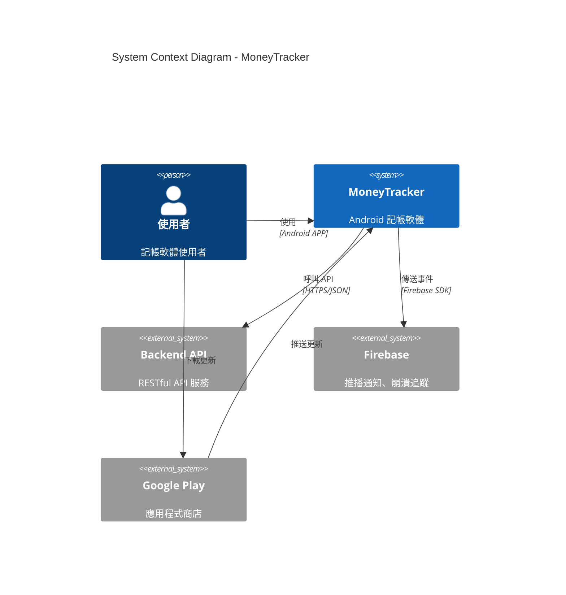
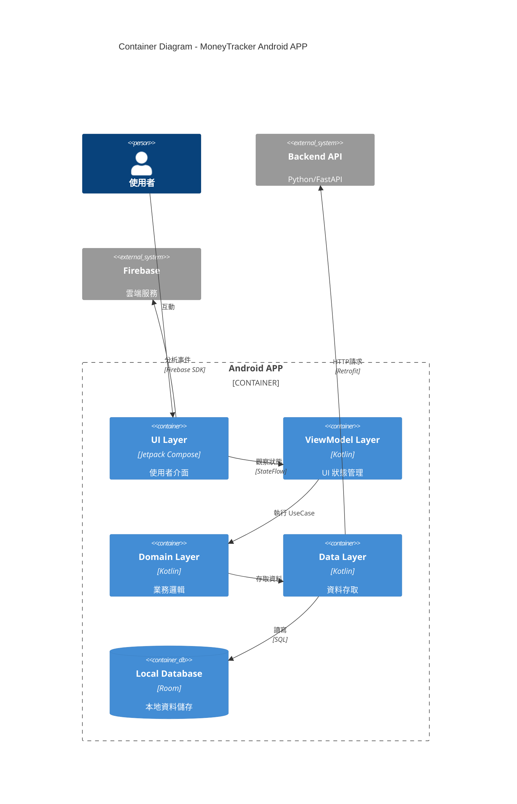
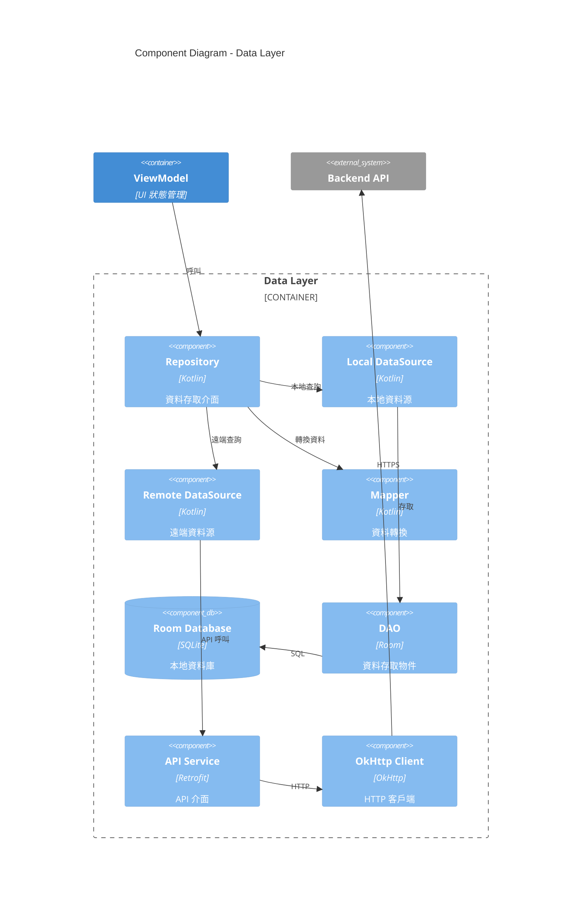

# AISDLC 文件維護實戰範例：Android 記帳 APP

**版本**: v0.09
**最後更新**: 2025-12-16
**情境**: 文件維護 (Documentation)
**平台**: Android
**技術棧**: Kotlin, Jetpack Compose, MVVM, Hilt, Python/FastAPI

---

## 📋 範例概述

本文檔展示如何使用 **AISDLC v0.09** 在 **Cursor AI** 環境中，透過 **Claude Code** 為 Android 記帳軟體建立和維護完整的技術文檔。

**文檔類型**:
- **技術文檔**: API 文檔、架構文檔、程式碼註解
- **使用者文檔**: 使用手冊、FAQ、Release Notes
- **開發者文檔**: 開發指南、貢獻指南、維護手冊

---

## 🎯 第一部分：環境設定

### 步驟 1.1: 設定 Cursor AI 專案路徑

```bash
# 創建專案目錄
mkdir -p ~/projects/MoneyTrackerDocs
cd ~/projects/MoneyTrackerDocs

# 創建文檔目錄結構
mkdir -p docs/{api,architecture,user-guide,dev-guide,changelog}
mkdir -p android backend
```

### 步驟 1.2: 安裝設定 AISDLC v0.09

```bash
cd ~/projects/MoneyTrackerDocs
ln -s ~/projects/AISDLC_ALL/AISDLC_v0.09 ./AISDLC
```

**創建 CLAUDE.md**:

```bash
cat > CLAUDE.md << 'EOF'
# MoneyTracker 文件維護專案指引

**專案**: 記帳軟體文件維護
**AISDLC**: v0.09
**情境**: Documentation

## 文檔目標
1. 完整的 API 文檔 (Swagger/OpenAPI)
2. 架構設計文檔 (ADR + C4 Model)
3. 使用者手冊 (繁體中文)
4. 開發者指南 (設定、建置、測試)
5. 程式碼註解規範 (KDoc, Javadoc)

## AISDLC 路徑
- 框架: `./AISDLC/`
- SOP: `AISDLC/scenarios/documentation/SOP.md`
EOF
```

---

## 🚀 第二部分：使用 Claude Code 維護文檔

### 步驟 2.1: 啟動並分析需求

💬 **您對 Claude 說**：
```
我要為 Android 記帳 APP 建立完整的技術文檔。

專案資訊:
- Android: Kotlin + Jetpack Compose + MVVM + Hilt
- Backend: Python + FastAPI + PostgreSQL
- 目標使用者: 開發者 + 終端使用者

文檔需求:
1. API 文檔 (Swagger/OpenAPI)
2. 架構設計文檔 (ADR + C4 Model)
3. 使用者手冊 (繁體中文)
4. 開發者指南
5. 程式碼註解標準

請執行:
1. 讀取 AISDLC/AISDLC_INIT.md
2. 讀取 AISDLC/scenarios/documentation/SOP.md
3. 建議文檔架構
```

🤖 **Claude 回應**：
```
已讀取 AISDLC Documentation SOP。

建議文檔架構:

【技術文檔 (Technical Documentation)】
1. ✅ API Reference (Swagger/OpenAPI 3.0)
2. ✅ Architecture Design Records (ADR)
3. ✅ C4 Model Diagrams (Context/Container/Component)
4. ✅ Database Schema Documentation
5. ✅ Code Style Guide (Kotlin + Python)

【使用者文檔 (User Documentation)】
1. ✅ 快速開始指南
2. ✅ 功能使用說明
3. ✅ 常見問題 (FAQ)
4. ✅ 故障排除 (Troubleshooting)

【開發者文檔 (Developer Documentation)】
1. ✅ 環境設定指南
2. ✅ 建置與測試指南
3. ✅ 貢獻指南 (CONTRIBUTING.md)
4. ✅ 版本發布流程

【維護文檔 (Maintenance Documentation)】
1. ✅ Release Notes
2. ✅ CHANGELOG
3. ✅ Migration Guides

請確認需求並開始生成。
```

---

### 步驟 2.2: 生成 API 文檔

**2.2.1 生成 OpenAPI 規格**

💬 **您對 Claude 說**：
```
請為 Python Backend 生成完整的 OpenAPI 3.0 規格:

API 端點:
1. POST /api/v1/auth/register
2. POST /api/v1/auth/login
3. GET /api/v1/transactions
4. POST /api/v1/transactions
5. GET /api/v1/categories
6. POST /api/v1/reports/monthly

請包含:
- 完整的 Request/Response Schema
- 範例資料
- 錯誤代碼定義
```

🤖 **Claude 執行**：
```
✅ 已生成 API 文檔:

docs/api/openapi.yaml

openapi: 3.0.3
info:
  title: MoneyTracker API
  version: 1.0.0
  description: |
    記帳軟體 RESTful API 文檔

    ## 認證
    使用 Bearer Token (JWT) 認證
    ```
    Authorization: Bearer <your-token>
    ```

  contact:
    email: support@moneytracker.com
  license:
    name: MIT

servers:
  - url: https://api.moneytracker.com/v1
    description: Production
  - url: https://staging-api.moneytracker.com/v1
    description: Staging

tags:
  - name: Auth
    description: 使用者認證
  - name: Transactions
    description: 交易記錄管理
  - name: Categories
    description: 分類管理
  - name: Reports
    description: 報表生成

paths:
  /auth/register:
    post:
      tags: [Auth]
      summary: 使用者註冊
      description: 建立新的使用者帳號
      operationId: registerUser
      requestBody:
        required: true
        content:
          application/json:
            schema:
              $ref: '#/components/schemas/RegisterRequest'
            examples:
              example1:
                summary: 一般註冊
                value:
                  email: user@example.com
                  password: SecurePass123!
                  name: 王小明
      responses:
        '201':
          description: 註冊成功
          content:
            application/json:
              schema:
                $ref: '#/components/schemas/UserResponse'
        '400':
          description: 請求參數錯誤
          content:
            application/json:
              schema:
                $ref: '#/components/schemas/ErrorResponse'
              examples:
                emailExists:
                  summary: Email 已存在
                  value:
                    error: EMAIL_ALREADY_EXISTS
                    message: 此 Email 已被註冊

  /transactions:
    get:
      tags: [Transactions]
      summary: 查詢交易記錄
      description: 取得使用者的交易記錄清單
      operationId: getTransactions
      security:
        - bearerAuth: []
      parameters:
        - name: start_date
          in: query
          schema:
            type: string
            format: date
          example: "2025-01-01"
        - name: end_date
          in: query
          schema:
            type: string
            format: date
          example: "2025-01-31"
        - name: category_id
          in: query
          schema:
            type: integer
        - name: page
          in: query
          schema:
            type: integer
            default: 1
        - name: limit
          in: query
          schema:
            type: integer
            default: 20
      responses:
        '200':
          description: 查詢成功
          content:
            application/json:
              schema:
                $ref: '#/components/schemas/TransactionListResponse'

    post:
      tags: [Transactions]
      summary: 新增交易記錄
      security:
        - bearerAuth: []
      requestBody:
        required: true
        content:
          application/json:
            schema:
              $ref: '#/components/schemas/CreateTransactionRequest'
      responses:
        '201':
          description: 新增成功
          content:
            application/json:
              schema:
                $ref: '#/components/schemas/TransactionResponse'

components:
  securitySchemes:
    bearerAuth:
      type: http
      scheme: bearer
      bearerFormat: JWT

  schemas:
    RegisterRequest:
      type: object
      required:
        - email
        - password
        - name
      properties:
        email:
          type: string
          format: email
          example: user@example.com
        password:
          type: string
          format: password
          minLength: 8
          example: SecurePass123!
        name:
          type: string
          minLength: 2
          maxLength: 50
          example: 王小明

    UserResponse:
      type: object
      properties:
        id:
          type: integer
          example: 1
        email:
          type: string
          example: user@example.com
        name:
          type: string
          example: 王小明
        created_at:
          type: string
          format: date-time
          example: "2025-01-15T10:30:00Z"

    CreateTransactionRequest:
      type: object
      required:
        - amount
        - category_id
        - type
        - date
      properties:
        amount:
          type: number
          format: decimal
          minimum: 0.01
          example: 350.50
        category_id:
          type: integer
          example: 5
        type:
          type: string
          enum: [income, expense]
          example: expense
        date:
          type: string
          format: date
          example: "2025-01-15"
        note:
          type: string
          maxLength: 500
          example: 午餐便當

    TransactionResponse:
      allOf:
        - $ref: '#/components/schemas/CreateTransactionRequest'
        - type: object
          properties:
            id:
              type: integer
              example: 123
            user_id:
              type: integer
              example: 1
            category_name:
              type: string
              example: 飲食
            created_at:
              type: string
              format: date-time

    ErrorResponse:
      type: object
      properties:
        error:
          type: string
          example: VALIDATION_ERROR
        message:
          type: string
          example: 請求參數驗證失敗
        details:
          type: object
          additionalProperties: true

已生成完整 OpenAPI 規格！

可使用 Swagger UI 預覽:
https://editor.swagger.io/

或在 FastAPI 自動生成:
http://localhost:8000/docs
```

---

**2.2.2 生成 Android API Client 文檔**

💬 **您對 Claude 說**：
```
請生成 Android Kotlin API Client 的使用文檔:

1. Retrofit 設定
2. API Service 介面定義
3. 使用範例
4. 錯誤處理
```

🤖 **Claude 執行**：
```
✅ 已生成:

docs/api/Android_API_Client_Guide.md

# Android API Client 使用指南

## 1. Retrofit 設定

```kotlin
// di/NetworkModule.kt
@Module
@InstallIn(SingletonComponent::class)
object NetworkModule {

    @Provides
    @Singleton
    fun provideOkHttpClient(
        authInterceptor: AuthInterceptor
    ): OkHttpClient = OkHttpClient.Builder()
        .addInterceptor(authInterceptor)
        .addInterceptor(HttpLoggingInterceptor().apply {
            level = if (BuildConfig.DEBUG)
                HttpLoggingInterceptor.Level.BODY
            else
                HttpLoggingInterceptor.Level.NONE
        })
        .connectTimeout(30, TimeUnit.SECONDS)
        .readTimeout(30, TimeUnit.SECONDS)
        .build()

    @Provides
    @Singleton
    fun provideRetrofit(
        okHttpClient: OkHttpClient
    ): Retrofit = Retrofit.Builder()
        .baseUrl("https://api.moneytracker.com/v1/")
        .client(okHttpClient)
        .addConverterFactory(GsonConverterFactory.create())
        .build()

    @Provides
    @Singleton
    fun provideApiService(retrofit: Retrofit): ApiService =
        retrofit.create(ApiService::class.java)
}
```

## 2. API Service 定義

```kotlin
// data/remote/ApiService.kt
interface ApiService {

    /**
     * 使用者註冊
     *
     * @param request 註冊資訊
     * @return 使用者資料
     * @throws HttpException 當 Email 已存在時回傳 400
     */
    @POST("auth/register")
    suspend fun register(
        @Body request: RegisterRequest
    ): UserResponse

    /**
     * 使用者登入
     *
     * @param request 登入憑證
     * @return 包含 JWT Token 的使用者資料
     */
    @POST("auth/login")
    suspend fun login(
        @Body request: LoginRequest
    ): LoginResponse

    /**
     * 查詢交易記錄
     *
     * @param startDate 開始日期 (格式: yyyy-MM-dd)
     * @param endDate 結束日期
     * @param categoryId 分類 ID (可選)
     * @param page 頁碼 (從 1 開始)
     * @param limit 每頁筆數 (預設 20)
     * @return 交易記錄分頁列表
     */
    @GET("transactions")
    suspend fun getTransactions(
        @Query("start_date") startDate: String? = null,
        @Query("end_date") endDate: String? = null,
        @Query("category_id") categoryId: Int? = null,
        @Query("page") page: Int = 1,
        @Query("limit") limit: Int = 20
    ): TransactionListResponse

    /**
     * 新增交易記錄
     *
     * @param request 交易資料
     * @return 已建立的交易記錄
     */
    @POST("transactions")
    suspend fun createTransaction(
        @Body request: CreateTransactionRequest
    ): TransactionResponse
}
```

## 3. Repository 使用範例

```kotlin
// data/repository/TransactionRepositoryImpl.kt
class TransactionRepositoryImpl @Inject constructor(
    private val apiService: ApiService
) : TransactionRepository {

    override suspend fun getTransactions(
        startDate: LocalDate?,
        endDate: LocalDate?,
        categoryId: Int?
    ): Result<List<Transaction>> = withContext(Dispatchers.IO) {
        try {
            val response = apiService.getTransactions(
                startDate = startDate?.toString(),
                endDate = endDate?.toString(),
                categoryId = categoryId
            )
            Result.success(response.data.map { it.toDomain() })
        } catch (e: HttpException) {
            Result.failure(handleHttpException(e))
        } catch (e: IOException) {
            Result.failure(NetworkException("網路連線失敗，請檢查網路設定"))
        }
    }
}
```

## 4. ViewModel 使用

```kotlin
// presentation/viewmodel/TransactionViewModel.kt
@HiltViewModel
class TransactionViewModel @Inject constructor(
    private val getTransactionsUseCase: GetTransactionsUseCase
) : ViewModel() {

    private val _transactions = MutableStateFlow<UiState<List<Transaction>>>(UiState.Loading)
    val transactions: StateFlow<UiState<List<Transaction>>> = _transactions.asStateFlow()

    fun loadTransactions(
        startDate: LocalDate? = null,
        endDate: LocalDate? = null
    ) {
        viewModelScope.launch {
            _transactions.value = UiState.Loading

            getTransactionsUseCase(startDate, endDate)
                .onSuccess { data ->
                    _transactions.value = UiState.Success(data)
                }
                .onFailure { error ->
                    _transactions.value = UiState.Error(
                        error.message ?: "未知錯誤"
                    )
                }
        }
    }
}
```

## 5. 錯誤處理

```kotlin
// data/remote/ErrorHandler.kt
fun handleHttpException(e: HttpException): AppException {
    return when (e.code()) {
        400 -> {
            val errorBody = e.response()?.errorBody()?.string()
            val error = parseErrorResponse(errorBody)
            ValidationException(error.message)
        }
        401 -> UnauthorizedException("請重新登入")
        403 -> ForbiddenException("您沒有權限執行此操作")
        404 -> NotFoundException("找不到資源")
        500 -> ServerException("伺服器錯誤，請稍後再試")
        else -> UnknownException("未知錯誤: ${e.message}")
    }
}

private fun parseErrorResponse(json: String?): ErrorResponse {
    return try {
        Gson().fromJson(json, ErrorResponse::class.java)
    } catch (e: Exception) {
        ErrorResponse("UNKNOWN_ERROR", "解析錯誤回應失敗")
    }
}
```

## 6. 測試範例

```kotlin
// TransactionRepositoryTest.kt
@Test
fun `getTransactions should return success when API call succeeds`() = runTest {
    // Given
    val mockResponse = TransactionListResponse(
        data = listOf(
            TransactionDto(id = 1, amount = 100.0, type = "expense")
        )
    )
    coEvery { apiService.getTransactions(any(), any(), any()) } returns mockResponse

    // When
    val result = repository.getTransactions(
        startDate = LocalDate.of(2025, 1, 1),
        endDate = LocalDate.of(2025, 1, 31)
    )

    // Then
    assertTrue(result.isSuccess)
    assertEquals(1, result.getOrNull()?.size)
}
```

已生成完整 Android API Client 文檔！
```

---

### 步驟 2.3: 生成架構設計文檔

**2.3.1 生成 ADR (Architecture Decision Records)**

💬 **您對 Claude 說**：
```
請生成 Architecture Decision Records:

決策主題:
1. 為何選擇 MVVM 架構
2. 為何選擇 Hilt 而非 Dagger
3. 為何選擇 Room 而非 SQLite
4. 為何選擇 Jetpack Compose
```

🤖 **Claude 執行**：
```
✅ 已生成 ADR:

docs/architecture/adr/
├── 001-mvvm-architecture.md
├── 002-dependency-injection-hilt.md
├── 003-local-database-room.md
└── 004-ui-framework-jetpack-compose.md

【001-mvvm-architecture.md】
# ADR-001: 採用 MVVM 架構模式

## 狀態
✅ 已接受 (2025-01-10)

## 背景
MoneyTracker 需要清晰的架構模式來分離關注點，確保程式碼可測試性和可維護性。

## 決策
採用 MVVM (Model-View-ViewModel) 架構模式。

## 理由

### 優點
1. **關注點分離**: View(UI) / ViewModel(業務邏輯) / Model(資料)
2. **可測試性**: ViewModel 可獨立進行單元測試
3. **生命週期感知**: 與 Android Lifecycle 整合良好
4. **官方推薦**: Google Android 官方推薦的架構模式
5. **社群支援**: 豐富的教學資源與最佳實踐

### 缺點
1. **學習曲線**: 新手需要理解 LiveData/StateFlow
2. **樣板代碼**: 需要為每個畫面建立 ViewModel

### 替代方案
- **MVI (Model-View-Intent)**: 單向資料流，但對小團隊過於複雜
- **MVP (Model-View-Presenter)**: 缺乏生命週期感知
- **Clean Architecture**: 對中小型專案過度設計

## 影響
- 所有新功能必須遵循 MVVM 模式
- ViewModel 不可直接持有 Activity/Fragment 引用
- UI 狀態使用 StateFlow 管理

## 程式碼範例

```kotlin
// ViewModel
@HiltViewModel
class TransactionViewModel @Inject constructor(
    private val getTransactionsUseCase: GetTransactionsUseCase
) : ViewModel() {

    private val _uiState = MutableStateFlow<UiState>(UiState.Loading)
    val uiState: StateFlow<UiState> = _uiState.asStateFlow()

    fun loadTransactions() {
        viewModelScope.launch {
            // 業務邏輯
        }
    }
}

// View (Compose)
@Composable
fun TransactionScreen(viewModel: TransactionViewModel = hiltViewModel()) {
    val uiState by viewModel.uiState.collectAsStateWithLifecycle()

    when (uiState) {
        is UiState.Loading -> LoadingIndicator()
        is UiState.Success -> TransactionList(uiState.data)
        is UiState.Error -> ErrorMessage(uiState.message)
    }
}
```

## 參考資料
- [Android MVVM Guide](https://developer.android.com/topic/architecture)
- [ViewModel Overview](https://developer.android.com/topic/libraries/architecture/viewmodel)

---

【002-dependency-injection-hilt.md】
# ADR-002: 選擇 Hilt 作為依賴注入框架

## 狀態
✅ 已接受 (2025-01-10)

## 背景
需要依賴注入框架來管理物件生命週期和依賴關係。

## 決策
使用 Hilt (Dagger 的封裝) 作為依賴注入框架。

## 理由

### Hilt 優點
1. **減少樣板代碼**: 相較於 Dagger，設定更簡單
2. **Android 整合**: 原生支援 ViewModel, WorkManager
3. **編譯時驗證**: 在編譯時檢查依賴圖
4. **官方推薦**: Google 官方推薦的 DI 解決方案
5. **效能**: 編譯時產生程式碼，執行時效能優異

### 相較於 Dagger 的優勢
```kotlin
// Dagger (複雜)
@Component(modules = [AppModule::class])
interface AppComponent {
    fun inject(activity: MainActivity)
}

// Hilt (簡單)
@HiltAndroidApp
class App : Application()

@AndroidEntryPoint
class MainActivity : AppCompatActivity()
```

### 替代方案
- **Koin**: 使用反射，執行時效能較差
- **手動 DI**: 程式碼冗長，易出錯
- **Dagger**: 設定複雜，學習曲線陡峭

## 影響
- 所有 Activity/Fragment 需加上 `@AndroidEntryPoint`
- 使用 `@HiltViewModel` 注入 ViewModel
- 模組化時需注意 Hilt 的 Component 階層

## 設定範例

```kotlin
// Application
@HiltAndroidApp
class MoneyTrackerApp : Application()

// Module
@Module
@InstallIn(SingletonComponent::class)
object NetworkModule {

    @Provides
    @Singleton
    fun provideApiService(retrofit: Retrofit): ApiService =
        retrofit.create(ApiService::class.java)
}

// ViewModel 注入
@HiltViewModel
class TransactionViewModel @Inject constructor(
    private val repository: TransactionRepository
) : ViewModel()

// Activity 使用
@AndroidEntryPoint
class MainActivity : ComponentActivity()
```

## 參考資料
- [Hilt Official Guide](https://developer.android.com/training/dependency-injection/hilt-android)

已生成 4 個完整的 ADR 文檔！
```

---

**2.3.2 生成 C4 Model 架構圖**

💬 **您對 Claude 說**：
```
請生成 C4 Model 架構圖文檔:

1. Context Diagram (系統情境圖)
2. Container Diagram (容器圖)
3. Component Diagram (元件圖)

使用 Mermaid 語法。
```

🤖 **Claude 執行**：
```
✅ 已生成:

docs/architecture/C4_Model_Diagrams.md

# MoneyTracker C4 Model 架構圖

## Level 1: Context Diagram (系統情境圖)



## Level 2: Container Diagram (容器圖)



## Level 3: Component Diagram (元件圖 - Data Layer)



## 架構說明

### UI Layer
- **技術**: Jetpack Compose
- **職責**: 渲染 UI、處理使用者輸入
- **特點**: 宣告式 UI、狀態驅動

### ViewModel Layer
- **技術**: Android ViewModel + StateFlow
- **職責**: 管理 UI 狀態、協調 UseCase
- **特點**: 生命週期感知、配置變更存活

### Domain Layer
- **技術**: Pure Kotlin
- **職責**: 業務邏輯、UseCase
- **特點**: 不依賴 Android Framework

### Data Layer
- **技術**: Repository Pattern + Room + Retrofit
- **職責**: 資料存取、快取策略
- **特點**: 單一資料來源 (Single Source of Truth)

## 資料流程

### 讀取流程
```
User Input → Compose UI → ViewModel → UseCase → Repository
         → Local DataSource → Room DAO → SQLite
         → Remote DataSource → Retrofit → Backend API
         → Mapper → Domain Model → UI State → Compose UI
```

### 寫入流程
```
User Action → ViewModel → UseCase → Repository
         → Remote DataSource → POST API → Backend
         → (成功後) Local DataSource → Room DAO → SQLite
         → UI State Updated
```

已生成完整 C4 Model 文檔！
```

---

### 步驟 2.4: 生成使用者文檔

**2.4.1 生成快速開始指南**

💬 **您對 Claude 說**：
```
請生成繁體中文的使用者快速開始指南:

1. 安裝步驟
2. 首次設定
3. 核心功能介紹
4. 常見問題

目標讀者: 非技術背景的一般使用者
```

🤖 **Claude 執行**：
```
✅ 已生成:

docs/user-guide/Quick_Start_Guide_zh-TW.md

# MoneyTracker 快速開始指南

## 📱 安裝應用程式

### 方法 1: 從 Google Play 下載 (推薦)
1. 開啟 Google Play 商店
2. 搜尋「MoneyTracker 記帳」
3. 點擊「安裝」
4. 等待下載完成

### 方法 2: 從官網下載 APK
1. 前往 [官方網站](https://moneytracker.com/download)
2. 下載最新版本 APK
3. 在手機設定中允許「安裝未知來源的應用程式」
4. 開啟 APK 檔案進行安裝

## 🎯 首次設定

### 步驟 1: 註冊帳號
1. 開啟應用程式
2. 點擊「註冊新帳號」
3. 輸入 Email 和密碼
4. 點擊「完成註冊」


### 步驟 2: 設定基本資訊
1. 選擇您的貨幣 (預設: 新台幣 TWD)
2. 設定每月預算 (可選)
3. 選擇常用分類

### 步驟 3: 開始記帳
恭喜！您已完成設定，可以開始記帳了！

## 💰 核心功能

### 1. 記錄收入/支出

#### 新增支出
1. 點擊首頁下方的 **「＋」** 按鈕
2. 選擇「支出」
3. 輸入金額
4. 選擇分類 (例如: 飲食、交通、娛樂)
5. 輸入備註 (可選)
6. 點擊「儲存」


#### 新增收入
步驟同上，但選擇「收入」類型

### 2. 查看帳務報表

#### 每日明細
- 在首頁可看到今日所有交易
- 左右滑動切換日期

#### 每月統計
1. 點擊底部「統計」圖示
2. 查看本月收支圓餅圖
3. 查看各分類支出排行


#### 年度報表
1. 進入「統計」頁面
2. 點擊右上角切換至「年度」
3. 查看全年收支趨勢折線圖

### 3. 分類管理

#### 新增自訂分類
1. 進入「設定」→「分類管理」
2. 點擊「新增分類」
3. 輸入分類名稱 (例如: 寵物、學習)
4. 選擇圖示和顏色
5. 點擊「儲存」

#### 編輯/刪除分類
- 長按分類即可編輯或刪除

### 4. 預算設定

#### 設定每月預算
1. 進入「設定」→「預算管理」
2. 輸入總預算金額
3. 為各分類設定個別預算 (可選)
4. 點擊「儲存」

#### 預算提醒
- 當支出接近預算 (80%) 時，會收到推播通知
- 首頁會顯示預算使用百分比

### 5. 資料同步

#### 啟用雲端同步
1. 進入「設定」→「帳號與同步」
2. 確認已登入
3. 開啟「自動同步」
4. 選擇同步頻率 (即時/每小時/每日)

#### 在多裝置使用
- 使用相同帳號登入其他裝置
- 資料會自動同步

## ❓ 常見問題 (FAQ)

### Q1: 忘記密碼怎麼辦？
**A**:
1. 在登入頁面點擊「忘記密碼」
2. 輸入註冊時的 Email
3. 檢查信箱收取重設密碼連結
4. 點擊連結設定新密碼

### Q2: 可以匯出資料嗎？
**A**: 可以！
1. 進入「設定」→「匯出資料」
2. 選擇日期範圍
3. 選擇匯出格式 (CSV / Excel)
4. 點擊「匯出」
5. 檔案會儲存至手機「下載」資料夾

### Q3: 如何刪除交易記錄？
**A**:
1. 在首頁找到該筆交易
2. 向左滑動該筆交易
3. 點擊「刪除」圖示
4. 確認刪除

### Q4: 可以離線使用嗎？
**A**: 可以！
- 所有資料都儲存在手機本地
- 離線時仍可正常記帳
- 連上網路後會自動同步至雲端

### Q5: 如何更換貨幣？
**A**:
1. 進入「設定」→「貨幣設定」
2. 選擇新的貨幣
3. 選擇是否轉換現有資料
4. 點擊「確認」

### Q6: 支援多人共用帳本嗎？
**A**: 目前版本尚未支援，此功能已列入開發計劃。

## 💡 使用小技巧

### 技巧 1: 快速記帳
- 首頁長按「＋」按鈕可開啟快速記帳
- 自動填入最近使用的分類

### 技巧 2: 語音輸入
- 在金額輸入框可使用語音輸入
- 點擊鍵盤的麥克風圖示

### 技巧 3: 重複交易
- 長按任一筆交易可「複製」
- 適合記錄每月固定支出 (房租、保費等)

### 技巧 4: 快速搜尋
- 在首頁向下拉即可開啟搜尋
- 可搜尋金額、分類、備註

## 📞 需要協助？

### 聯絡我們
- **Email**: support@moneytracker.com
- **LINE 官方帳號**: @moneytracker
- **Facebook**: MoneyTracker 台灣
- **客服時間**: 週一至週五 09:00-18:00

### 意見回饋
我們重視您的意見！
1. 進入「設定」→「意見回饋」
2. 描述您的問題或建議
3. 附上螢幕截圖 (可選)
4. 點擊「送出」

---

**文檔版本**: v1.0
**最後更新**: 2025-01-15
**適用版本**: MoneyTracker v1.0.0+

已生成完整的使用者快速開始指南！
```

---

### 步驟 2.5: 生成開發者文檔

**2.5.1 生成開發環境設定指南**

💬 **您對 Claude 說**：
```
請生成開發者環境設定指南:

1. 環境需求
2. 專案設定步驟
3. 建置指令
4. 測試指令
5. 常見問題排除
```

🤖 **Claude 執行**：
```
✅ 已生成:

docs/dev-guide/Development_Setup_Guide.md

# MoneyTracker 開發環境設定指南

## 📋 環境需求

### 必要軟體
- **Android Studio**: Hedgehog (2023.1.1) 或更新版本
- **JDK**: 17 或更新版本
- **Kotlin**: 1.9.0+
- **Gradle**: 8.2+ (由 Wrapper 管理)

### 選用軟體
- **Git**: 版本控制
- **Python 3.11+**: 如需執行 Backend (本地開發)
- **PostgreSQL 15+**: Backend 資料庫

### Android SDK 需求
```gradle
compileSdk = 34
minSdk = 24      // Android 7.0+
targetSdk = 34   // Android 14
```

## 🚀 專案設定

### 步驟 1: Clone 專案
```bash
git clone https://github.com/your-org/moneytracker-android.git
cd moneytracker-android
```

### 步驟 2: 開啟專案
1. 啟動 Android Studio
2. File → Open → 選擇專案目錄
3. 等待 Gradle Sync 完成

### 步驟 3: 設定環境變數
建立 `local.properties` (不會被 Git 追蹤):
```properties
# API Keys (從團隊管理員取得)
API_BASE_URL=https://staging-api.moneytracker.com/v1/
FIREBASE_API_KEY=AIzaSyXXXXXXXXXXXXXXXXXXXXXXXXXXXXXX

# Keystore (本地開發用)
KEYSTORE_PATH=/path/to/debug.keystore
KEYSTORE_PASSWORD=android
KEY_ALIAS=androiddebugkey
KEY_PASSWORD=android
```

### 步驟 4: Gradle Sync
```bash
./gradlew sync
```

如遇到錯誤:
```bash
# 清除快取並重新同步
./gradlew clean build --refresh-dependencies
```

## 🏗️ 建置專案

### Debug 建置
```bash
./gradlew assembleDebug
```
輸出: `app/build/outputs/apk/debug/app-debug.apk`

### Release 建置
```bash
./gradlew assembleRelease
```
輸出: `app/build/outputs/apk/release/app-release.apk`

### Build Variants
```bash
# Staging 環境
./gradlew assembleStaging

# Production 環境
./gradlew assembleProduction
```

## 🧪 執行測試

### 單元測試
```bash
# 執行所有單元測試
./gradlew test

# 執行特定模組測試
./gradlew :app:test

# 執行特定測試類別
./gradlew test --tests TransactionViewModelTest

# 產生覆蓋率報告
./gradlew testDebugUnitTest jacocoTestReport
```
報告位置: `app/build/reports/jacoco/test/html/index.html`

### UI 測試 (Instrumented Tests)
```bash
# 啟動 Emulator 或連接實體裝置

# 執行所有 UI 測試
./gradlew connectedAndroidTest

# 執行特定測試
./gradlew connectedAndroidTest \
  -Pandroid.testInstrumentationRunnerArguments.class=\
  com.example.moneytracker.TransactionScreenTest
```

### 程式碼品質檢查
```bash
# Lint 檢查
./gradlew lint

# Detekt (Kotlin 靜態分析)
./gradlew detekt

# Checkstyle
./gradlew checkstyle
```

## 🐛 偵錯技巧

### Logcat 篩選
```bash
# 只顯示應用程式的 Log
adb logcat -s MoneyTracker

# 篩選特定 Tag
adb logcat | grep "TransactionViewModel"
```

### Database Inspector
1. 執行應用程式 (Debug 模式)
2. View → Tool Windows → App Inspection
3. 選擇 Database Inspector
4. 即時查看 Room 資料庫內容

### Layout Inspector
1. View → Tool Windows → Layout Inspector
2. 選擇執行中的裝置
3. 即時檢視 Compose UI 階層

### Network Profiler
1. View → Tool Windows → Profiler
2. 選擇 Network
3. 監控 API 請求/回應

## 🔧 常見問題排除

### Q1: Gradle Sync 失敗
```bash
# 解決方案 1: 清除快取
./gradlew clean
rm -rf ~/.gradle/caches/

# 解決方案 2: 檢查 Java 版本
java -version  # 應為 17+

# 解決方案 3: 使用 Gradle Wrapper
./gradlew wrapper --gradle-version=8.2
```

### Q2: Build 失敗 - "Duplicate class"
```bash
# 檢查依賴衝突
./gradlew :app:dependencies

# 排除重複依賴
implementation("com.squareup.retrofit2:retrofit:2.9.0") {
    exclude group: 'com.squareup.okhttp3'
}
```

### Q3: Emulator 無法啟動
```bash
# 檢查 Emulator 狀態
emulator -list-avds

# 從終端機啟動
emulator -avd Pixel_7_API_34 -no-snapshot-load
```

### Q4: Hilt 注入失敗
```kotlin
// 確認已加上 @AndroidEntryPoint
@AndroidEntryPoint
class MainActivity : ComponentActivity()

// 確認 Application 類別
@HiltAndroidApp
class MoneyTrackerApp : Application()
```

### Q5: Room 遷移錯誤
```kotlin
// 臨時解決 (僅開發環境)
Room.databaseBuilder(context, AppDatabase::class.java, "moneytracker.db")
    .fallbackToDestructiveMigration()  // ⚠️ 會刪除資料
    .build()

// 正確解決: 撰寫 Migration
val MIGRATION_1_2 = object : Migration(1, 2) {
    override fun migrate(database: SupportSQLiteDatabase) {
        database.execSQL("ALTER TABLE transactions ADD COLUMN note TEXT")
    }
}
```

## 📚 推薦開發工具

### Android Studio Plugins
- **Kotlin Multiplatform Mobile**: Kotlin 多平台支援
- **Rainbow Brackets**: 括號顏色標示
- **GitToolBox**: Git 增強功能
- **ADB Idea**: ADB 指令快捷鍵

### 命令列工具
```bash
# 安裝 scrcpy (螢幕鏡像)
brew install scrcpy
scrcpy

# 安裝 pidcat (彩色 Logcat)
brew install pidcat
pidcat com.example.moneytracker
```

## 🔗 相關文檔
- [貢獻指南](CONTRIBUTING.md)
- [程式碼風格指南](Code_Style_Guide.md)
- [測試策略](Testing_Strategy.md)
- [CI/CD 流程](../devops/CICD_Architecture.md)

---

**文檔版本**: v1.0
**最後更新**: 2025-01-15

已生成完整的開發環境設定指南！
```

---

## 📊 第三部分：文檔維護流程總結

### 3.1 文檔類型清單

```
MoneyTracker 完整文檔架構:

docs/
├── api/
│   ├── openapi.yaml                 # OpenAPI 3.0 規格
│   └── Android_API_Client_Guide.md  # Kotlin Client 指南
│
├── architecture/
│   ├── adr/                         # Architecture Decision Records
│   │   ├── 001-mvvm-architecture.md
│   │   ├── 002-dependency-injection-hilt.md
│   │   ├── 003-local-database-room.md
│   │   └── 004-ui-framework-jetpack-compose.md
│   ├── C4_Model_Diagrams.md         # C4 架構圖
│   └── Database_Schema.md           # 資料庫結構
│
├── user-guide/
│   ├── Quick_Start_Guide_zh-TW.md   # 快速開始
│   ├── Feature_Guide_zh-TW.md       # 功能說明
│   ├── FAQ_zh-TW.md                 # 常見問題
│   └── Troubleshooting_zh-TW.md     # 故障排除
│
├── dev-guide/
│   ├── Development_Setup_Guide.md   # 環境設定
│   ├── Build_and_Test_Guide.md      # 建置測試
│   ├── Code_Style_Guide.md          # 程式碼風格
│   ├── Testing_Strategy.md          # 測試策略
│   └── CONTRIBUTING.md              # 貢獻指南
│
└── changelog/
    ├── CHANGELOG.md                 # 版本記錄
    ├── RELEASE_NOTES_v1.0.0.md      # 發布說明
    └── MIGRATION_GUIDE_v0.9_to_v1.0.md  # 遷移指南
```

### 3.2 文檔維護週期

| 文檔類型 | 更新時機 | 負責人 | 審查者 |
|---------|---------|-------|-------|
| API 文檔 | API 變更時 | Backend Dev | Tech Lead |
| ADR | 重大技術決策時 | Architect | Team |
| 使用者手冊 | 功能新增/變更時 | PM/UX Writer | QA |
| 開發指南 | 開發流程變更時 | Tech Lead | Team |
| CHANGELOG | 每次 Release | Release Manager | All |

### 3.3 文檔品質檢查

使用 AISDLC Document Quality Checklist:

```bash
# 讀取 AISDLC 品質檢查清單
cat AISDLC/guides/system/quality/Document_Quality_Checklist.md

檢查項目:
- [ ] 標題清晰明確
- [ ] 目錄完整 (超過 3 頁需有目錄)
- [ ] 程式碼範例可執行
- [ ] 圖表清晰易懂
- [ ] 繁體中文無錯別字
- [ ] 連結可正常訪問
- [ ] 版本號與日期已更新
- [ ] 已通過同儕審查
```

---

## 🎓 第四部分：進階文檔技巧

### 4.1 自動生成 API 文檔

💬 **命令範例**：
```
請設定自動生成 API 文檔:

1. FastAPI 自動生成 Swagger UI
2. Kotlin 程式碼註解轉 KDoc
3. CI/CD 自動更新文檔網站
```

### 4.2 多語系文檔管理

💬 **命令範例**：
```
請建立多語系文檔結構:

語言:
- 繁體中文 (主要)
- 英文 (次要)

文檔:
- Quick_Start_Guide_zh-TW.md
- Quick_Start_Guide_en-US.md
```

### 4.3 互動式文檔

💬 **命令範例**：
```
請建立互動式 API 文檔:

工具: Swagger UI + Postman Collection
功能: 可直接在文檔中測試 API
```

---

## ✅ 結論

透過本範例，您已學會:

1. ✅ 生成完整的 API 文檔 (OpenAPI 3.0)
2. ✅ 撰寫 ADR (架構決策記錄)
3. ✅ 繪製 C4 Model 架構圖
4. ✅ 撰寫使用者友善的繁體中文手冊
5. ✅ 建立開發者環境設定指南
6. ✅ 建立文檔維護流程

**核心價值**: AISDLC Documentation SOP 確保技術文檔的完整性、可讀性和可維護性，讓新團隊成員快速上手，使用者輕鬆使用。

**下一步建議**:
1. 實際生成專案文檔
2. 閱讀 [Documentation SOP](../../scenarios/documentation/SOP.md)
3. 使用 [Document Quality Checklist](../../guides/system/quality/Document_Quality_Checklist.md)

---

**文檔版本**: v1.0
**適用 AISDLC 版本**: v0.09
**最後更新**: 2025-12-16
**作者**: AISDLC 框架維護團隊
