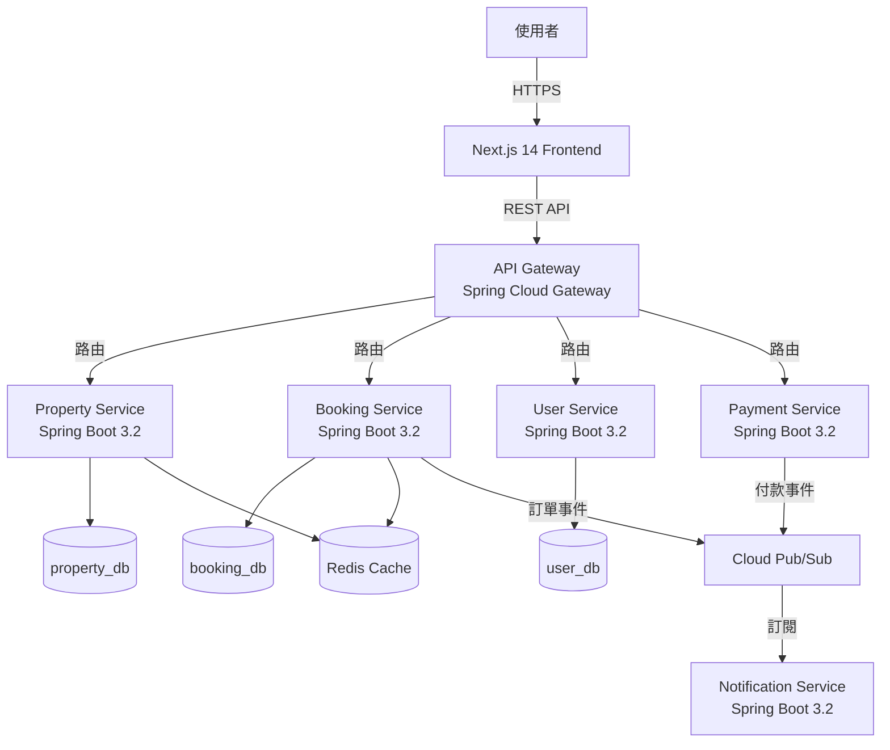
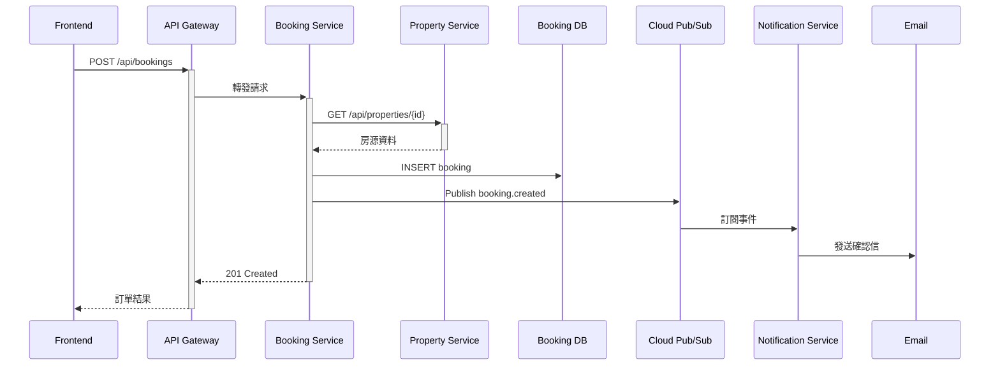

# 系統重構：電子商務網站（民宿預訂平台）

> **場景**: Refactoring - 將 Monolithic 架構重構為 Microservices + Next.js 14 App Router
> **技術棧**: Next.js 14 (App Router) + Spring Boot 3.2 + PostgreSQL + Google Cloud
> **AISDLC 版本**: v0.09
> **更新日期**: 2025-12-15

---

## 📋 目錄

1. [第一步：Cursor AI 專案路徑設定](#第一步cursor-ai-專案路徑設定)
2. [第二步：AISDLC 框架安裝](#第二步aisdlc-框架安裝)
3. [第三步：Claude Code 完整重構流程](#第三步claude-code-完整重構流程)
4. [附錄：命令速查表](#附錄命令速查表)

---

## 第一步：Cursor AI 專案路徑設定

### 1.1 分析現有專案結構

**假設現有專案結構** (Monolithic):
```
BnB-Platform/
├── frontend/                     # React 17 (Pages Router)
│   ├── pages/
│   ├── components/
│   ├── styles/
│   └── package.json
├── backend/                      # Spring Boot 2.7 Monolith
│   ├── src/main/java/com/bnb/
│   │   ├── controller/
│   │   ├── service/
│   │   ├── repository/
│   │   └── model/
│   ├── pom.xml
│   └── application.properties
├── database/
│   └── init.sql
└── docker-compose.yml
```

**問題診斷**:
- ❌ Monolithic Backend (所有功能在單一服務)
- ❌ React Pages Router (效能較差)
- ❌ 無 API Gateway
- ❌ 前後端耦合部署
- ❌ 資料庫無讀寫分離

### 1.2 建立重構專案結構

**在終端機執行**:
```bash
cd ~/Projects/BnB-Platform

# 建立新架構目錄
mkdir -p microservices/property-service       # 房源服務
mkdir -p microservices/booking-service        # 訂房服務
mkdir -p microservices/user-service           # 使用者服務
mkdir -p microservices/payment-service        # 付款服務
mkdir -p microservices/notification-service   # 通知服務
mkdir -p microservices/api-gateway            # API Gateway

mkdir -p frontend-next14                      # Next.js 14 新版
mkdir -p infrastructure/k8s                   # Kubernetes 部署
mkdir -p infrastructure/terraform             # GCP Terraform
mkdir -p Docs                                 # AISDLC 文檔
mkdir -p Docs/refactoring                     # 重構文檔
mkdir -p Docs/planning/api                    # API 規格
mkdir -p Docs/reports                         # 驗證報告

# 驗證
tree -L 2 -d
```

**目標架構**:
```
BnB-Platform/
├── frontend/                     # 🔴 Legacy (逐步淘汰)
├── backend/                      # 🔴 Legacy (逐步遷移)
├── frontend-next14/              # ✅ Next.js 14 App Router
│   ├── src/
│   │   ├── app/                  # App Router
│   │   ├── components/
│   │   ├── lib/
│   │   └── styles/
│   └── package.json
├── microservices/                # ✅ Spring Boot 3.2 Microservices
│   ├── property-service/         # 房源管理
│   ├── booking-service/          # 訂房管理
│   ├── user-service/             # 使用者管理
│   ├── payment-service/          # 付款處理
│   ├── notification-service/     # 通知服務
│   └── api-gateway/              # Spring Cloud Gateway
├── infrastructure/
│   ├── k8s/                      # Kubernetes YAML
│   └── terraform/                # GCP Infrastructure as Code
├── Docs/                         # 📄 AISDLC 文檔
└── AISDLC_v0.09/                 # 🔴 步驟 2 安裝
```

### 1.3 開啟 Cursor AI

**步驟**:
1. 打開 Cursor 應用程式
2. `File` → `Open Folder...`
3. 選擇：`~/Projects/BnB-Platform` （**專案根目錄**）
4. 點擊「Open」

**驗證**: Cursor 左側應顯示 `frontend-next14/`, `microservices/`, `Docs/`

---

## 第二步：AISDLC 框架安裝

### 2.1 方法一：符號連結（推薦）

**優點**: 節省磁碟空間，AISDLC 更新時自動同步

**在終端機執行**:
```bash
cd ~/Projects/BnB-Platform

# 建立符號連結
ln -s /Users/你的用戶名/Cursor_Project/AISDLC_ALL/AISDLC_v0.09 AISDLC_v0.09

# 驗證
ls -lah | grep AISDLC
# 應顯示: AISDLC_v0.09 -> /Users/.../AISDLC_v0.09
```

### 2.2 方法二：複製（適合獨立專案）

```bash
cp -r /Users/你的用戶名/Cursor_Project/AISDLC_ALL/AISDLC_v0.09 ~/Projects/BnB-Platform/

# 驗證
ls AISDLC_v0.09/
# 應顯示: agent/ workflow/ docs_template/ guides/ scenarios/
```

### 2.3 驗證安裝

**在 Cursor AI 終端機執行**:
```bash
ls -la AISDLC_v0.09/AISDLC_INIT.md
cat AISDLC_v0.09/Project_README.md | head -20
```

**預期輸出**: 看到 AISDLC_INIT.md 和 Project_README.md 內容

---

## 第三步：Claude Code 完整重構流程

### 階段 1：系統現況分析與問題診斷（2-3 週）

#### 3.1.1 啟動系統分析 Workflow

**在 Claude Code 輸入**:
```
請載入 AISDLC_INIT.md，我要進行「系統重構」場景。

目標：將民宿預訂平台從 Monolithic 重構為 Microservices 架構

技術棧：
- 前端：React 17 (Pages) → Next.js 14 (App Router)
- 後端：Spring Boot 2.7 Monolith → Spring Boot 3.2 Microservices
- 資料庫：PostgreSQL 13 → PostgreSQL 15 (Read Replica)
- 部署：Docker Compose → Google Kubernetes Engine (GKE)

請執行「brownfield-system-analysis」workflow，分析現有系統架構、程式碼品質與技術債。
```

#### 3.1.2 程式碼異味偵測

**Claude Code 執行**:
```
請使用「code-smell-detection」workflow，分析以下關鍵模組：

1. Backend:
   - `backend/src/main/java/com/bnb/controller/BookingController.java`
   - `backend/src/main/java/com/bnb/service/BookingService.java`
   - `backend/src/main/java/com/bnb/service/PropertyService.java`
   - `backend/src/main/java/com/bnb/service/UserService.java`

2. Frontend:
   - `frontend/pages/property/[id].js`
   - `frontend/pages/booking/checkout.js`
   - `frontend/components/PropertyList.jsx`

請生成程式碼異味報告。
```

**預期輸出** (`Docs/refactoring/code-smell-report.md`):
```markdown
# 程式碼異味偵測報告

## 🔴 嚴重問題（Critical）

### 1. God Class - BookingController.java (1,200 行)
- **位置**: `backend/src/main/java/com/bnb/controller/BookingController.java`
- **問題**:
  - 處理訂房、付款、通知、退款所有邏輯
  - 直接呼叫多個 Service (違反單一職責)
  - 包含 15 個 API Endpoints
- **建議**: 拆分為 BookingController, PaymentController, NotificationController

### 2. Shotgun Surgery - PropertyService.java
- **位置**: `backend/src/main/java/com/bnb/service/PropertyService.java`
- **問題**:
  - 新增房源欄位需修改 8 個檔案
  - 耦合度過高
- **建議**: 引入 Domain-Driven Design (DDD)

### 3. Long Method - checkout.js (350 行)
- **位置**: `frontend/pages/booking/checkout.js`
- **問題**:
  - 單一函式處理表單驗證、付款流程、訂單確認
  - useEffect 巢狀 5 層
- **建議**: 拆分為多個 Custom Hooks

## ⚠️  中等問題（Medium）

### 4. Data Clumps - API 回傳資料
- **問題**: 多個 API 重複回傳相同欄位組合（PropertyDTO, UserDTO）
- **建議**: 使用 GraphQL 或優化 DTO 設計

## 📊 統計
- **總程式碼行數**: 45,000 行
- **技術債比例**: 32%（建議 < 5%）
- **重複程式碼**: 18%（建議 < 3%）
```

#### 3.1.3 架構問題分析

**Claude Code 繼續執行**:
```
請載入 SA Agent (Amanda)，分析現有架構問題：

1. 系統架構圖（使用 C4 Model Level 2）
2. 效能瓶頸分析（資料庫查詢、N+1 問題）
3. 可擴展性問題（單體架構限制）
4. 安全性漏洞（OWASP Top 10 檢查）

輸出文檔：`Docs/refactoring/architecture-analysis-report.md`
```

**預期輸出摘要**:
```markdown
## 🏗️ 架構問題

### 1. 效能瓶頸
- **問題**: 單一資料庫處理所有讀寫請求
- **數據**: 高峰期 QPS 1,200，資料庫 CPU 90%
- **建議**: 讀寫分離 + Redis 快取

### 2. 可擴展性限制
- **問題**: Monolith 無法獨立擴展單一功能模組
- **場景**: 訂房高峰期需擴展，但連房源搜尋也被迫擴展
- **建議**: 微服務架構，獨立擴展 booking-service

### 3. 部署風險
- **問題**: 單一服務故障導致整站停機
- **數據**: 過去 6 個月停機 4 次，平均 45 分鐘
- **建議**: Kubernetes + Circuit Breaker
```

---

### 階段 2：目標架構設計（3-4 週）

#### 3.2.1 定義微服務邊界

**在 Claude Code 輸入**:
```
請載入 SD Agent (Marcus)，設計目標微服務架構：

## 需求：
1. 識別 Bounded Context（DDD 方法）
2. 定義 5 個核心微服務
3. 設計服務間通訊（REST + Message Queue）
4. 設計 API Gateway 路由規則
5. 資料庫拆分策略（Database per Service）

請使用 C4 Model 繪製架構圖，輸出到 `Docs/planning/target-architecture.md`
```

**預期輸出**:
```markdown
# 目標架構設計

## 微服務劃分

### 1. property-service（房源服務）
- **職責**: 房源 CRUD、搜尋、圖片管理
- **資料庫**: property_db (PostgreSQL)
- **API**:
  - `GET /api/properties` - 搜尋房源
  - `GET /api/properties/{id}` - 房源詳情
  - `POST /api/properties` - 新增房源

### 2. booking-service（訂房服務）
- **職責**: 訂單管理、日曆可用性
- **資料庫**: booking_db (PostgreSQL)
- **API**:
  - `POST /api/bookings` - 建立訂單
  - `GET /api/bookings/{id}` - 訂單詳情

### 3. user-service（使用者服務）
- **職責**: 使用者認證、個人資料
- **資料庫**: user_db (PostgreSQL)
- **API**:
  - `POST /api/auth/login` - 登入
  - `GET /api/users/profile` - 個人資料

### 4. payment-service（付款服務）
- **職責**: 付款處理、退款
- **整合**: Stripe API
- **API**:
  - `POST /api/payments/charge` - 扣款
  - `POST /api/payments/refund` - 退款

### 5. notification-service（通知服務）
- **職責**: Email、SMS、推播通知
- **訊息佇列**: Google Cloud Pub/Sub
- **API**:
  - `POST /api/notifications/email` - 發送 Email

## C4 Level 2 - Container Diagram

```

#### 3.2.2 資料庫遷移策略

**在 Claude Code 輸入**:
```
請設計資料庫遷移策略：

1. 原始 Monolithic DB 表格分析
2. 按微服務拆分資料庫（Database per Service）
3. 共享資料處理（如 User ID）
4. 資料一致性方案（Saga Pattern）
5. 遷移腳本設計（Zero-Downtime Migration）

輸出：`Docs/planning/database-migration-strategy.md`
```

**預期輸出摘要**:
```markdown
## 資料庫拆分方案

### 原始表格（Monolithic DB）
- `users` → user_db.users
- `properties` → property_db.properties
- `property_images` → property_db.property_images
- `bookings` → booking_db.bookings
- `payments` → 保留在 Monolith（最後遷移）
- `notifications` → 不需持久化（Event-Driven）

### 遷移步驟（零停機）
1. **Phase 1**: 建立新資料庫（property_db, booking_db, user_db）
2. **Phase 2**: 雙寫策略（同時寫入舊 DB 和新 DB）
3. **Phase 3**: 資料驗證（比對新舊資料一致性）
4. **Phase 4**: 切換讀取（從新 DB 讀取）
5. **Phase 5**: 停止寫入舊 DB
```

#### 3.2.3 Next.js 14 架構設計

**在 Claude Code 輸入**:
```
請設計 Next.js 14 前端架構：

1. App Router 目錄結構
2. Server Components vs Client Components 策略
3. 資料獲取方案（React Server Components, SWR）
4. 狀態管理（Zustand）
5. 效能優化（Image Optimization, Code Splitting）

輸出：`Docs/planning/frontend-architecture.md`
```

**預期輸出**:
```
frontend-next14/
├── src/
│   ├── app/
│   │   ├── (marketing)/
│   │   │   ├── page.tsx              # 首頁（SSG）
│   │   │   └── properties/
│   │   │       ├── page.tsx          # 房源列表（SSR）
│   │   │       └── [id]/
│   │   │           └── page.tsx      # 房源詳情（SSR + ISR）
│   │   ├── (dashboard)/
│   │   │   ├── bookings/
│   │   │   │   └── page.tsx          # 我的訂單（Client）
│   │   │   └── profile/
│   │   │       └── page.tsx          # 個人資料（Client）
│   │   ├── api/                      # Route Handlers
│   │   │   └── auth/
│   │   │       └── route.ts
│   │   ├── layout.tsx
│   │   └── loading.tsx
│   ├── components/
│   │   ├── ui/                       # Shadcn/ui
│   │   ├── property/
│   │   │   ├── PropertyCard.tsx      # Server Component
│   │   │   └── PropertySearch.tsx    # Client Component
│   │   └── booking/
│   │       └── BookingForm.tsx       # Client Component
│   ├── lib/
│   │   ├── api/
│   │   │   ├── property.ts
│   │   │   ├── booking.ts
│   │   │   └── user.ts
│   │   ├── hooks/
│   │   │   ├── useAuth.ts
│   │   │   └── useBooking.ts
│   │   └── store/
│   │       └── useStore.ts           # Zustand
│   └── styles/
│       └── globals.css
├── public/
├── next.config.js
└── package.json
```

---

### 階段 3：API 規格設計（2 週）

#### 3.3.1 生成微服務 API 規格

**在 Claude Code 輸入**:
```
請載入「api-specification-generation」workflow，為以下微服務生成 API 規格：

1. property-service (10 個 API)
2. booking-service (8 個 API)
3. user-service (6 個 API)
4. payment-service (4 個 API)
5. notification-service (3 個 API)

每個 API 需包含：
- Request/Response Schema
- 錯誤碼定義
- 認證機制（JWT）
- Rate Limiting 規則

輸出目錄：`Docs/planning/api/`
```

**預期生成檔案**:
```
Docs/planning/api/
├── API_Index.md
├── API_PropertyService_GetProperties.md
├── API_PropertyService_GetPropertyById.md
├── API_BookingService_CreateBooking.md
├── API_BookingService_GetBookingById.md
├── API_UserService_Login.md
├── API_PaymentService_ChargePayment.md
└── API_NotificationService_SendEmail.md
```

**範例：`API_BookingService_CreateBooking.md`**:
````markdown
# API 規格：建立訂單

## 基本資訊
- **API ID**: API-BS-001
- **API 名稱**: 建立訂單
- **HTTP 方法**: POST
- **路徑**: `/api/bookings`
- **服務**: booking-service
- **版本**: v1

## Request

### Headers
```http
Authorization: Bearer <JWT_TOKEN>
Content-Type: application/json
```

### Body
```json
{
  "propertyId": "prop-12345",
  "checkInDate": "2025-12-20",
  "checkOutDate": "2025-12-23",
  "guestCount": 2,
  "totalPrice": 9000,
  "guestDetails": {
    "firstName": "王小明",
    "lastName": "Wang",
    "email": "wang@example.com",
    "phone": "+886912345678"
  },
  "specialRequests": "需要嬰兒床"
}
```

### Validation Rules
- `propertyId`: 必填，須存在於 property-service
- `checkInDate`: 必填，格式 YYYY-MM-DD，不可早於今天
- `checkOutDate`: 必填，須晚於 checkInDate
- `guestCount`: 必填，1-20 之間
- `totalPrice`: 必填，須與房源定價一致（防竄改）

## Response

### Success (201 Created)
```json
{
  "bookingId": "book-67890",
  "status": "PENDING_PAYMENT",
  "propertyId": "prop-12345",
  "checkInDate": "2025-12-20",
  "checkOutDate": "2025-12-23",
  "guestCount": 2,
  "totalPrice": 9000,
  "createdAt": "2025-12-15T10:30:00Z",
  "paymentDeadline": "2025-12-15T11:00:00Z",
  "paymentUrl": "https://payment.bnb.com/pay/book-67890"
}
```

### Error (400 Bad Request)
```json
{
  "error": "VALIDATION_ERROR",
  "message": "checkOutDate 必須晚於 checkInDate",
  "field": "checkOutDate"
}
```

### Error (409 Conflict)
```json
{
  "error": "DATE_UNAVAILABLE",
  "message": "所選日期已被預訂",
  "availableDates": ["2025-12-25", "2025-12-26"]
}
```

## Business Logic
1. 驗證房源存在（呼叫 property-service）
2. 檢查日期可用性（查詢 booking_db）
3. 鎖定日期（樂觀鎖）
4. 建立訂單記錄（status = PENDING_PAYMENT）
5. 發布事件到 Cloud Pub/Sub：`booking.created`
6. 回傳付款連結（30 分鐘有效期）

## Event-Driven Flow


## Rate Limiting
- 每個使用者：10 次/分鐘
- 每個 IP：50 次/分鐘

## Security
- 需 JWT 認證（包含 userId）
- 訂單只能由本人建立
- totalPrice 後端二次驗證（防竄改）
````

---

### 階段 4：Microservices 實作（8-10 週）

#### 3.4.1 建立 Property Service（範例）

**在 Claude Code 輸入**:
```
請協助建立 property-service 專案：

1. 使用 Spring Boot 3.2 + Spring Data JPA
2. 建立專案結構（Clean Architecture）
3. 實作以下 API：
   - GET /api/properties（搜尋房源）
   - GET /api/properties/{id}（房源詳情）
   - POST /api/properties（新增房源）
4. 整合 PostgreSQL
5. 整合 Redis 快取
6. 配置 Dockerfile

專案路徑：`microservices/property-service/`
```

**Claude Code 自動生成**:

**1. `pom.xml`**:
```xml
<?xml version="1.0" encoding="UTF-8"?>
<project xmlns="http://maven.apache.org/POM/4.0.0">
    <modelVersion>4.0.0</modelVersion>
    <parent>
        <groupId>org.springframework.boot</groupId>
        <artifactId>spring-boot-starter-parent</artifactId>
        <version>3.2.0</version>
    </parent>

    <groupId>com.bnb</groupId>
    <artifactId>property-service</artifactId>
    <version>1.0.0</version>

    <dependencies>
        <dependency>
            <groupId>org.springframework.boot</groupId>
            <artifactId>spring-boot-starter-web</artifactId>
        </dependency>
        <dependency>
            <groupId>org.springframework.boot</groupId>
            <artifactId>spring-boot-starter-data-jpa</artifactId>
        </dependency>
        <dependency>
            <groupId>org.springframework.boot</groupId>
            <artifactId>spring-boot-starter-data-redis</artifactId>
        </dependency>
        <dependency>
            <groupId>org.springframework.boot</groupId>
            <artifactId>spring-boot-starter-validation</artifactId>
        </dependency>
        <dependency>
            <groupId>org.postgresql</groupId>
            <artifactId>postgresql</artifactId>
        </dependency>
        <dependency>
            <groupId>org.projectlombok</groupId>
            <artifactId>lombok</artifactId>
        </dependency>
    </dependencies>
</project>
```

**2. Entity (`src/main/java/com/bnb/property/domain/Property.java`)**:
```java
package com.bnb.property.domain;

import jakarta.persistence.*;
import lombok.*;
import java.math.BigDecimal;
import java.time.LocalDateTime;
import java.util.List;

@Entity
@Table(name = "properties")
@Getter @Setter @NoArgsConstructor @AllArgsConstructor
@Builder
public class Property {

    @Id
    @GeneratedValue(strategy = GenerationType.IDENTITY)
    private Long id;

    @Column(nullable = false)
    private String title;

    @Column(columnDefinition = "TEXT")
    private String description;

    @Column(nullable = false)
    private String address;

    @Column(nullable = false)
    private String city;

    @Column(nullable = false)
    private BigDecimal pricePerNight;

    @Column(nullable = false)
    private Integer maxGuests;

    @Column(nullable = false)
    private Integer bedrooms;

    @Column(nullable = false)
    private Integer bathrooms;

    @ElementCollection
    @CollectionTable(name = "property_amenities",
                     joinColumns = @JoinColumn(name = "property_id"))
    @Column(name = "amenity")
    private List<String> amenities; // ["WiFi", "冷氣", "廚房"]

    @ElementCollection
    @CollectionTable(name = "property_images",
                     joinColumns = @JoinColumn(name = "property_id"))
    @Column(name = "image_url")
    private List<String> imageUrls;

    @Column(nullable = false)
    private Long ownerId;

    @Column(nullable = false)
    @Enumerated(EnumType.STRING)
    private PropertyStatus status = PropertyStatus.ACTIVE;

    @Column(nullable = false, updatable = false)
    private LocalDateTime createdAt = LocalDateTime.now();

    private LocalDateTime updatedAt = LocalDateTime.now();

    public enum PropertyStatus {
        ACTIVE, INACTIVE, UNDER_REVIEW
    }
}
```

**3. Repository**:
```java
package com.bnb.property.repository;

import com.bnb.property.domain.Property;
import org.springframework.data.jpa.repository.JpaRepository;
import org.springframework.data.jpa.repository.Query;
import org.springframework.data.repository.query.Param;
import java.math.BigDecimal;
import java.util.List;

public interface PropertyRepository extends JpaRepository<Property, Long> {

    List<Property> findByStatus(Property.PropertyStatus status);

    @Query("SELECT p FROM Property p WHERE " +
           "(:city IS NULL OR p.city = :city) AND " +
           "(:maxPrice IS NULL OR p.pricePerNight <= :maxPrice) AND " +
           "(:minGuests IS NULL OR p.maxGuests >= :minGuests) AND " +
           "p.status = 'ACTIVE'")
    List<Property> searchProperties(
        @Param("city") String city,
        @Param("maxPrice") BigDecimal maxPrice,
        @Param("minGuests") Integer minGuests
    );
}
```

**4. Service**:
```java
package com.bnb.property.service;

import com.bnb.property.domain.Property;
import com.bnb.property.dto.*;
import com.bnb.property.repository.PropertyRepository;
import lombok.RequiredArgsConstructor;
import org.springframework.cache.annotation.Cacheable;
import org.springframework.cache.annotation.CacheEvict;
import org.springframework.stereotype.Service;
import org.springframework.transaction.annotation.Transactional;
import java.util.List;
import java.util.stream.Collectors;

@Service
@RequiredArgsConstructor
public class PropertyService {

    private final PropertyRepository propertyRepository;

    @Cacheable(value = "properties", key = "#id")
    public PropertyResponse getPropertyById(Long id) {
        Property property = propertyRepository.findById(id)
            .orElseThrow(() -> new PropertyNotFoundException(id));
        return PropertyMapper.toResponse(property);
    }

    public List<PropertyResponse> searchProperties(PropertySearchRequest request) {
        List<Property> properties = propertyRepository.searchProperties(
            request.getCity(),
            request.getMaxPrice(),
            request.getMinGuests()
        );
        return properties.stream()
            .map(PropertyMapper::toResponse)
            .collect(Collectors.toList());
    }

    @Transactional
    @CacheEvict(value = "properties", allEntries = true)
    public PropertyResponse createProperty(CreatePropertyRequest request) {
        Property property = Property.builder()
            .title(request.getTitle())
            .description(request.getDescription())
            .address(request.getAddress())
            .city(request.getCity())
            .pricePerNight(request.getPricePerNight())
            .maxGuests(request.getMaxGuests())
            .bedrooms(request.getBedrooms())
            .bathrooms(request.getBathrooms())
            .amenities(request.getAmenities())
            .imageUrls(request.getImageUrls())
            .ownerId(request.getOwnerId())
            .status(Property.PropertyStatus.UNDER_REVIEW)
            .build();

        Property saved = propertyRepository.save(property);
        return PropertyMapper.toResponse(saved);
    }
}
```

**5. Controller**:
```java
package com.bnb.property.controller;

import com.bnb.property.dto.*;
import com.bnb.property.service.PropertyService;
import jakarta.validation.Valid;
import lombok.RequiredArgsConstructor;
import org.springframework.http.HttpStatus;
import org.springframework.http.ResponseEntity;
import org.springframework.web.bind.annotation.*;
import java.util.List;

@RestController
@RequestMapping("/api/properties")
@RequiredArgsConstructor
public class PropertyController {

    private final PropertyService propertyService;

    @GetMapping("/{id}")
    public ResponseEntity<PropertyResponse> getProperty(@PathVariable Long id) {
        PropertyResponse response = propertyService.getPropertyById(id);
        return ResponseEntity.ok(response);
    }

    @GetMapping
    public ResponseEntity<List<PropertyResponse>> searchProperties(
        @ModelAttribute PropertySearchRequest request
    ) {
        List<PropertyResponse> properties = propertyService.searchProperties(request);
        return ResponseEntity.ok(properties);
    }

    @PostMapping
    public ResponseEntity<PropertyResponse> createProperty(
        @Valid @RequestBody CreatePropertyRequest request
    ) {
        PropertyResponse response = propertyService.createProperty(request);
        return ResponseEntity.status(HttpStatus.CREATED).body(response);
    }
}
```

**6. Configuration (`application.yml`)**:
```yaml
spring:
  application:
    name: property-service
  datasource:
    url: jdbc:postgresql://localhost:5432/property_db
    username: postgres
    password: ${DB_PASSWORD}
  jpa:
    hibernate:
      ddl-auto: validate
    properties:
      hibernate:
        format_sql: true
  data:
    redis:
      host: localhost
      port: 6379

server:
  port: 8081

logging:
  level:
    com.bnb.property: DEBUG
```

**7. Dockerfile**:
```dockerfile
FROM eclipse-temurin:17-jdk-alpine AS build
WORKDIR /app
COPY pom.xml .
COPY src ./src
RUN ./mvnw clean package -DskipTests

FROM eclipse-temurin:17-jre-alpine
WORKDIR /app
COPY --from=build /app/target/property-service-1.0.0.jar app.jar
EXPOSE 8081
ENTRYPOINT ["java", "-jar", "app.jar"]
```

#### 3.4.2 重複建立其他微服務

**在 Claude Code 輸入**:
```
請依照相同模式建立以下微服務：

1. booking-service (Port 8082)
2. user-service (Port 8083)
3. payment-service (Port 8084) - 整合 Stripe
4. notification-service (Port 8085) - 整合 SendGrid

每個服務需包含：
- Clean Architecture 結構
- JPA Entity & Repository
- Service Layer
- REST Controller
- Redis 快取（適用於讀多寫少）
- Dockerfile
```

---

### 階段 5：Next.js 14 Frontend 重構（6 週）

#### 3.5.1 建立 Next.js 14 專案

**在 Claude Code 輸入**:
```
請建立 Next.js 14 專案（App Router）：

1. 初始化專案（TypeScript + Tailwind CSS）
2. 安裝依賴：
   - zustand（狀態管理）
   - swr（資料獲取）
   - react-hook-form（表單處理）
   - zod（表單驗證）
   - shadcn/ui（UI 元件庫）
3. 建立目錄結構
4. 配置 API 基礎設定（與 API Gateway 串接）

專案路徑：`frontend-next14/`
```

**Claude Code 執行命令**:
```bash
cd ~/Projects/BnB-Platform
npx create-next-app@latest frontend-next14 \
  --typescript \
  --tailwind \
  --app \
  --src-dir \
  --import-alias "@/*"

cd frontend-next14
npm install zustand swr react-hook-form zod
npx shadcn-ui@latest init
```

#### 3.5.2 實作房源列表頁（SSR）

**在 Claude Code 輸入**:
```
請實作房源列表頁：

路徑：`src/app/(marketing)/properties/page.tsx`
需求：
1. Server-Side Rendering（每次請求都獲取最新資料）
2. 整合搜尋表單（城市、價格、人數）
3. 顯示房源卡片（圖片、標題、價格、評分）
4. 點擊進入房源詳情頁

請生成完整程式碼。
```

**Claude Code 生成**:

**1. `src/app/(marketing)/properties/page.tsx`** (Server Component):
```typescript
import { Suspense } from 'react';
import PropertyList from '@/components/property/PropertyList';
import PropertySearch from '@/components/property/PropertySearch';
import { fetchProperties } from '@/lib/api/property';
import { PropertySearchParams } from '@/lib/types';

export const metadata = {
  title: '搜尋房源 | 優質民宿',
  description: '探索全台精選民宿，享受舒適住宿體驗',
};

interface PageProps {
  searchParams: PropertySearchParams;
}

export default async function PropertiesPage({ searchParams }: PageProps) {
  // Server-Side Data Fetching
  const properties = await fetchProperties({
    city: searchParams.city,
    maxPrice: searchParams.maxPrice ? Number(searchParams.maxPrice) : undefined,
    minGuests: searchParams.minGuests ? Number(searchParams.minGuests) : undefined,
  });

  return (
    <div className="container mx-auto px-4 py-8">
      <h1 className="text-3xl font-bold mb-6">搜尋房源</h1>

      {/* Client Component - Search Form */}
      <PropertySearch initialValues={searchParams} />

      {/* Server Component - Property List */}
      <Suspense fallback={<PropertyListSkeleton />}>
        <PropertyList properties={properties} />
      </Suspense>
    </div>
  );
}

function PropertyListSkeleton() {
  return (
    <div className="grid grid-cols-1 md:grid-cols-3 gap-6 mt-8">
      {[1, 2, 3].map((i) => (
        <div key={i} className="animate-pulse">
          <div className="bg-gray-200 h-48 rounded-lg"></div>
          <div className="mt-4 h-4 bg-gray-200 rounded"></div>
          <div className="mt-2 h-4 bg-gray-200 rounded w-3/4"></div>
        </div>
      ))}
    </div>
  );
}
```

**2. `src/components/property/PropertySearch.tsx`** (Client Component):
```typescript
'use client';

import { useForm } from 'react-hook-form';
import { zodResolver } from '@hookform/resolvers/zod';
import { z } from 'zod';
import { useRouter } from 'next/navigation';
import { Button } from '@/components/ui/button';
import { Input } from '@/components/ui/input';
import { Select, SelectContent, SelectItem, SelectTrigger, SelectValue } from '@/components/ui/select';

const searchSchema = z.object({
  city: z.string().optional(),
  maxPrice: z.number().min(0).optional(),
  minGuests: z.number().min(1).max(20).optional(),
});

type SearchFormData = z.infer<typeof searchSchema>;

interface PropertySearchProps {
  initialValues?: Partial<SearchFormData>;
}

export default function PropertySearch({ initialValues }: PropertySearchProps) {
  const router = useRouter();
  const { register, handleSubmit, formState: { errors } } = useForm<SearchFormData>({
    resolver: zodResolver(searchSchema),
    defaultValues: initialValues,
  });

  const onSubmit = (data: SearchFormData) => {
    const params = new URLSearchParams();
    if (data.city) params.set('city', data.city);
    if (data.maxPrice) params.set('maxPrice', data.maxPrice.toString());
    if (data.minGuests) params.set('minGuests', data.minGuests.toString());

    router.push(`/properties?${params.toString()}`);
  };

  return (
    <form onSubmit={handleSubmit(onSubmit)} className="bg-white p-6 rounded-lg shadow-md">
      <div className="grid grid-cols-1 md:grid-cols-4 gap-4">
        <div>
          <label className="block text-sm font-medium mb-2">城市</label>
          <Select {...register('city')}>
            <SelectTrigger>
              <SelectValue placeholder="選擇城市" />
            </SelectTrigger>
            <SelectContent>
              <SelectItem value="台北">台北</SelectItem>
              <SelectItem value="台中">台中</SelectItem>
              <SelectItem value="台南">台南</SelectItem>
              <SelectItem value="高雄">高雄</SelectItem>
              <SelectItem value="花蓮">花蓮</SelectItem>
            </SelectContent>
          </Select>
        </div>

        <div>
          <label className="block text-sm font-medium mb-2">最高價格</label>
          <Input
            type="number"
            placeholder="3000"
            {...register('maxPrice', { valueAsNumber: true })}
          />
          {errors.maxPrice && <p className="text-red-500 text-sm">{errors.maxPrice.message}</p>}
        </div>

        <div>
          <label className="block text-sm font-medium mb-2">人數</label>
          <Input
            type="number"
            placeholder="2"
            {...register('minGuests', { valueAsNumber: true })}
          />
        </div>

        <div className="flex items-end">
          <Button type="submit" className="w-full">搜尋</Button>
        </div>
      </div>
    </form>
  );
}
```

**3. `src/components/property/PropertyList.tsx`** (Server Component):
```typescript
import Link from 'next/link';
import Image from 'next/image';
import { Property } from '@/lib/types';

interface PropertyListProps {
  properties: Property[];
}

export default function PropertyList({ properties }: PropertyListProps) {
  if (properties.length === 0) {
    return (
      <div className="text-center py-12">
        <p className="text-gray-500">找不到符合條件的房源</p>
      </div>
    );
  }

  return (
    <div className="grid grid-cols-1 md:grid-cols-3 gap-6 mt-8">
      {properties.map((property) => (
        <Link key={property.id} href={`/properties/${property.id}`}>
          <div className="bg-white rounded-lg shadow-md overflow-hidden hover:shadow-xl transition-shadow">
            <div className="relative h-48">
              <Image
                src={property.imageUrls[0] || '/placeholder.jpg'}
                alt={property.title}
                fill
                className="object-cover"
              />
            </div>
            <div className="p-4">
              <h3 className="font-semibold text-lg">{property.title}</h3>
              <p className="text-gray-600 text-sm mt-1">{property.city}</p>
              <div className="flex justify-between items-center mt-3">
                <span className="text-xl font-bold">NT$ {property.pricePerNight}</span>
                <span className="text-sm text-gray-500">/ 晚</span>
              </div>
              <div className="flex items-center mt-2 text-sm text-gray-600">
                <span>{property.maxGuests} 人</span>
                <span className="mx-2">•</span>
                <span>{property.bedrooms} 房</span>
                <span className="mx-2">•</span>
                <span>{property.bathrooms} 衛浴</span>
              </div>
            </div>
          </div>
        </Link>
      ))}
    </div>
  );
}
```

**4. API Client (`src/lib/api/property.ts`)**:
```typescript
import { Property, PropertySearchParams } from '@/lib/types';

const API_BASE_URL = process.env.NEXT_PUBLIC_API_URL || 'http://localhost:8080';

export async function fetchProperties(params: PropertySearchParams): Promise<Property[]> {
  const queryParams = new URLSearchParams();
  if (params.city) queryParams.set('city', params.city);
  if (params.maxPrice) queryParams.set('maxPrice', params.maxPrice.toString());
  if (params.minGuests) queryParams.set('minGuests', params.minGuests.toString());

  const res = await fetch(`${API_BASE_URL}/api/properties?${queryParams.toString()}`, {
    cache: 'no-store', // SSR - Always fetch fresh data
  });

  if (!res.ok) {
    throw new Error('Failed to fetch properties');
  }

  return res.json();
}

export async function fetchPropertyById(id: string): Promise<Property> {
  const res = await fetch(`${API_BASE_URL}/api/properties/${id}`, {
    next: { revalidate: 300 }, // ISR - Revalidate every 5 minutes
  });

  if (!res.ok) {
    throw new Error('Failed to fetch property');
  }

  return res.json();
}
```

#### 3.5.3 實作房源詳情頁（SSR + ISR）

**在 Claude Code 輸入**:
```
請實作房源詳情頁：

路徑：`src/app/(marketing)/properties/[id]/page.tsx`
需求：
1. Incremental Static Regeneration（每 5 分鐘更新一次）
2. 顯示房源完整資訊（圖片輪播、設施、地圖）
3. 訂房表單（日期選擇、人數、價格計算）
4. 整合 Google Maps API（顯示位置）
```

**Claude Code 生成** (`src/app/(marketing)/properties/[id]/page.tsx`):
```typescript
import { notFound } from 'next/navigation';
import Image from 'next/image';
import { fetchPropertyById } from '@/lib/api/property';
import BookingForm from '@/components/booking/BookingForm';

interface PageProps {
  params: { id: string };
}

export async function generateMetadata({ params }: PageProps) {
  const property = await fetchPropertyById(params.id);
  return {
    title: `${property.title} | 優質民宿`,
    description: property.description,
  };
}

export default async function PropertyDetailPage({ params }: PageProps) {
  const property = await fetchPropertyById(params.id);

  if (!property) {
    notFound();
  }

  return (
    <div className="container mx-auto px-4 py-8">
      {/* Image Gallery */}
      <div className="grid grid-cols-4 gap-2 mb-8">
        <div className="col-span-2 row-span-2 relative h-96">
          <Image
            src={property.imageUrls[0]}
            alt={property.title}
            fill
            className="object-cover rounded-lg"
            priority
          />
        </div>
        {property.imageUrls.slice(1, 5).map((url, i) => (
          <div key={i} className="relative h-48">
            <Image
              src={url}
              alt={`${property.title} - ${i + 2}`}
              fill
              className="object-cover rounded-lg"
            />
          </div>
        ))}
      </div>

      <div className="grid grid-cols-3 gap-8">
        {/* Left: Property Info */}
        <div className="col-span-2">
          <h1 className="text-3xl font-bold mb-2">{property.title}</h1>
          <p className="text-gray-600 mb-4">{property.address}, {property.city}</p>

          <div className="flex items-center gap-4 mb-6 text-gray-700">
            <span>{property.maxGuests} 位房客</span>
            <span>•</span>
            <span>{property.bedrooms} 間臥室</span>
            <span>•</span>
            <span>{property.bathrooms} 間衛浴</span>
          </div>

          <hr className="my-6" />

          <div className="mb-6">
            <h2 className="text-xl font-semibold mb-3">房源介紹</h2>
            <p className="text-gray-700 leading-relaxed">{property.description}</p>
          </div>

          <hr className="my-6" />

          <div className="mb-6">
            <h2 className="text-xl font-semibold mb-3">設施與服務</h2>
            <div className="grid grid-cols-2 gap-3">
              {property.amenities.map((amenity, i) => (
                <div key={i} className="flex items-center gap-2">
                  <span className="text-green-500">✓</span>
                  <span>{amenity}</span>
                </div>
              ))}
            </div>
          </div>
        </div>

        {/* Right: Booking Form */}
        <div className="col-span-1">
          <div className="sticky top-8 bg-white border rounded-lg shadow-lg p-6">
            <div className="flex items-baseline gap-2 mb-6">
              <span className="text-2xl font-bold">NT$ {property.pricePerNight}</span>
              <span className="text-gray-600">/ 晚</span>
            </div>

            <BookingForm property={property} />
          </div>
        </div>
      </div>
    </div>
  );
}
```

**BookingForm Client Component** (`src/components/booking/BookingForm.tsx`):
```typescript
'use client';

import { useState } from 'react';
import { useForm } from 'react-hook-form';
import { zodResolver } from '@hookform/resolvers/zod';
import { z } from 'zod';
import { Button } from '@/components/ui/button';
import { Input } from '@/components/ui/input';
import { useRouter } from 'next/navigation';
import { createBooking } from '@/lib/api/booking';

const bookingSchema = z.object({
  checkInDate: z.string(),
  checkOutDate: z.string(),
  guestCount: z.number().min(1).max(20),
});

type BookingFormData = z.infer<typeof bookingSchema>;

export default function BookingForm({ property }: { property: Property }) {
  const router = useRouter();
  const [totalPrice, setTotalPrice] = useState(0);
  const [isSubmitting, setIsSubmitting] = useState(false);

  const { register, handleSubmit, watch, formState: { errors } } = useForm<BookingFormData>({
    resolver: zodResolver(bookingSchema),
    defaultValues: { guestCount: 2 },
  });

  const checkInDate = watch('checkInDate');
  const checkOutDate = watch('checkOutDate');

  // Calculate total price
  useEffect(() => {
    if (checkInDate && checkOutDate) {
      const nights = Math.ceil(
        (new Date(checkOutDate).getTime() - new Date(checkInDate).getTime()) / (1000 * 60 * 60 * 24)
      );
      setTotalPrice(nights * property.pricePerNight);
    }
  }, [checkInDate, checkOutDate, property.pricePerNight]);

  const onSubmit = async (data: BookingFormData) => {
    setIsSubmitting(true);
    try {
      const booking = await createBooking({
        propertyId: property.id,
        checkInDate: data.checkInDate,
        checkOutDate: data.checkOutDate,
        guestCount: data.guestCount,
        totalPrice,
      });

      // Redirect to payment page
      router.push(booking.paymentUrl);
    } catch (error) {
      alert('訂房失敗，請稍後再試');
    } finally {
      setIsSubmitting(false);
    }
  };

  return (
    <form onSubmit={handleSubmit(onSubmit)}>
      <div className="mb-4">
        <label className="block text-sm font-medium mb-2">入住日期</label>
        <Input type="date" {...register('checkInDate')} />
        {errors.checkInDate && <p className="text-red-500 text-sm">{errors.checkInDate.message}</p>}
      </div>

      <div className="mb-4">
        <label className="block text-sm font-medium mb-2">退房日期</label>
        <Input type="date" {...register('checkOutDate')} />
      </div>

      <div className="mb-6">
        <label className="block text-sm font-medium mb-2">房客人數</label>
        <Input
          type="number"
          min={1}
          max={property.maxGuests}
          {...register('guestCount', { valueAsNumber: true })}
        />
      </div>

      {totalPrice > 0 && (
        <div className="mb-6 p-4 bg-gray-50 rounded">
          <div className="flex justify-between mb-2">
            <span>NT$ {property.pricePerNight} x {Math.ceil((new Date(checkOutDate).getTime() - new Date(checkInDate).getTime()) / (1000 * 60 * 60 * 24))} 晚</span>
            <span>NT$ {totalPrice}</span>
          </div>
          <hr className="my-2" />
          <div className="flex justify-between font-bold">
            <span>總計</span>
            <span>NT$ {totalPrice}</span>
          </div>
        </div>
      )}

      <Button type="submit" className="w-full" disabled={isSubmitting}>
        {isSubmitting ? '處理中...' : '立即預訂'}
      </Button>
    </form>
  );
}
```

---

### 階段 6：API Gateway 與部署（4 週）

#### 3.6.1 建立 Spring Cloud Gateway

**在 Claude Code 輸入**:
```
請建立 API Gateway（Spring Cloud Gateway）：

1. 建立專案結構
2. 配置路由規則（轉發到各微服務）
3. 整合 JWT 認證（驗證 Token）
4. 配置 Rate Limiting（限流）
5. 配置 CORS（允許 Next.js 跨域請求）

專案路徑：`microservices/api-gateway/`
```

**Claude Code 生成 `application.yml`**:
```yaml
spring:
  application:
    name: api-gateway
  cloud:
    gateway:
      routes:
        # Property Service
        - id: property-service
          uri: lb://property-service
          predicates:
            - Path=/api/properties/**
          filters:
            - name: RequestRateLimiter
              args:
                redis-rate-limiter.replenishRate: 10
                redis-rate-limiter.burstCapacity: 20

        # Booking Service
        - id: booking-service
          uri: lb://booking-service
          predicates:
            - Path=/api/bookings/**
          filters:
            - name: RequestRateLimiter
            - name: AuthenticationFilter # Custom JWT Filter

        # User Service
        - id: user-service
          uri: lb://user-service
          predicates:
            - Path=/api/users/**,/api/auth/**

        # Payment Service
        - id: payment-service
          uri: lb://payment-service
          predicates:
            - Path=/api/payments/**
          filters:
            - name: AuthenticationFilter

      globalcors:
        corsConfigurations:
          '[/**]':
            allowedOrigins:
              - "http://localhost:3000"
              - "https://bnb-platform.com"
            allowedMethods:
              - GET
              - POST
              - PUT
              - DELETE
            allowedHeaders:
              - "*"
            allowCredentials: true

server:
  port: 8080

eureka:
  client:
    serviceUrl:
      defaultZone: http://localhost:8761/eureka/
```

#### 3.6.2 Kubernetes 部署配置

**在 Claude Code 輸入**:
```
請生成 Kubernetes 部署配置：

1. 所有微服務的 Deployment YAML
2. Service YAML（ClusterIP / LoadBalancer）
3. ConfigMap（環境變數）
4. Secret（資料庫密碼、JWT Secret）
5. Ingress（HTTPS 路由）

輸出目錄：`infrastructure/k8s/`
```

**Claude Code 生成 `property-service-deployment.yaml`**:
```yaml
apiVersion: apps/v1
kind: Deployment
metadata:
  name: property-service
  namespace: bnb-platform
spec:
  replicas: 3
  selector:
    matchLabels:
      app: property-service
  template:
    metadata:
      labels:
        app: property-service
    spec:
      containers:
      - name: property-service
        image: gcr.io/your-project/property-service:1.0.0
        ports:
        - containerPort: 8081
        env:
        - name: SPRING_DATASOURCE_URL
          valueFrom:
            configMapKeyRef:
              name: property-config
              key: db-url
        - name: SPRING_DATASOURCE_PASSWORD
          valueFrom:
            secretKeyRef:
              name: property-secret
              key: db-password
        resources:
          requests:
            memory: "512Mi"
            cpu: "500m"
          limits:
            memory: "1Gi"
            cpu: "1000m"
        livenessProbe:
          httpGet:
            path: /actuator/health
            port: 8081
          initialDelaySeconds: 30
          periodSeconds: 10
        readinessProbe:
          httpGet:
            path: /actuator/health/readiness
            port: 8081
          initialDelaySeconds: 15
          periodSeconds: 5
---
apiVersion: v1
kind: Service
metadata:
  name: property-service
  namespace: bnb-platform
spec:
  selector:
    app: property-service
  ports:
  - protocol: TCP
    port: 8081
    targetPort: 8081
  type: ClusterIP
```

#### 3.6.3 Terraform GCP 基礎設施

**在 Claude Code 輸入**:
```
請生成 Terraform 配置，建立以下 GCP 資源：

1. GKE Cluster（3 nodes, n1-standard-2）
2. Cloud SQL for PostgreSQL（3 個資料庫實例）
3. Cloud Memorystore (Redis)
4. Cloud Pub/Sub（訊息佇列）
5. Cloud Load Balancer（HTTPS）
6. Cloud Storage（圖片儲存）

輸出目錄：`infrastructure/terraform/`
```

**Claude Code 生成 `main.tf`**:
```hcl
provider "google" {
  project = var.project_id
  region  = var.region
}

# GKE Cluster
resource "google_container_cluster" "primary" {
  name     = "bnb-platform-cluster"
  location = var.region

  initial_node_count = 3

  node_config {
    machine_type = "n1-standard-2"
    disk_size_gb = 50
    oauth_scopes = [
      "https://www.googleapis.com/auth/cloud-platform"
    ]
  }
}

# Cloud SQL - Property DB
resource "google_sql_database_instance" "property_db" {
  name             = "property-db-instance"
  database_version = "POSTGRES_15"
  region           = var.region

  settings {
    tier = "db-f1-micro"

    ip_configuration {
      ipv4_enabled = true
      authorized_networks {
        name  = "gke-cluster"
        value = google_container_cluster.primary.cluster_ipv4_cidr
      }
    }
  }
}

resource "google_sql_database" "property_db" {
  name     = "property_db"
  instance = google_sql_database_instance.property_db.name
}

# Cloud Memorystore (Redis)
resource "google_redis_instance" "cache" {
  name           = "bnb-platform-cache"
  tier           = "BASIC"
  memory_size_gb = 1
  region         = var.region
}

# Cloud Storage Bucket (Images)
resource "google_storage_bucket" "property_images" {
  name          = "${var.project_id}-property-images"
  location      = var.region
  force_destroy = false

  uniform_bucket_level_access = true

  cors {
    origin          = ["https://bnb-platform.com"]
    method          = ["GET", "HEAD", "PUT", "POST"]
    response_header = ["*"]
    max_age_seconds = 3600
  }
}

# Cloud Pub/Sub Topic
resource "google_pubsub_topic" "booking_events" {
  name = "booking-events"
}

resource "google_pubsub_subscription" "notification_sub" {
  name  = "notification-subscription"
  topic = google_pubsub_topic.booking_events.name

  ack_deadline_seconds = 20
}
```

---

### 階段 7：資料遷移與灰度發布（6 週）

#### 3.7.1 資料遷移腳本

**在 Claude Code 輸入**:
```
請生成零停機資料遷移腳本：

1. 階段 1：雙寫策略（同時寫入 Monolith DB 和新 Microservices DB）
2. 階段 2：歷史資料遷移（批次複製舊資料）
3. 階段 3：資料驗證（比對新舊資料一致性）
4. 階段 4：切換讀取來源
5. 階段 5：停止寫入舊 DB

輸出目錄：`database/migration/`
```

**Claude Code 生成範例 (`migration-step2-historical-data.sql`)**:
```sql
-- Step 2: 歷史資料遷移（Properties）
-- 執行時間：預估 2 小時（假設 50,000 筆房源）

-- 1. 複製房源資料
INSERT INTO property_db.properties (
    id, title, description, address, city,
    price_per_night, max_guests, bedrooms, bathrooms,
    owner_id, status, created_at, updated_at
)
SELECT
    id, title, description, address, city,
    price_per_night, max_guests, bedrooms, bathrooms,
    owner_id,
    CASE
        WHEN is_active = TRUE THEN 'ACTIVE'::property_status
        ELSE 'INACTIVE'::property_status
    END,
    created_at, updated_at
FROM monolith_db.properties
WHERE id NOT IN (SELECT id FROM property_db.properties)
ON CONFLICT (id) DO NOTHING;

-- 2. 複製房源圖片
INSERT INTO property_db.property_images (property_id, image_url)
SELECT property_id, image_url
FROM monolith_db.property_images
WHERE property_id IN (SELECT id FROM property_db.properties)
ON CONFLICT DO NOTHING;

-- 3. 複製房源設施
INSERT INTO property_db.property_amenities (property_id, amenity)
SELECT property_id, amenity_name
FROM monolith_db.property_amenities
WHERE property_id IN (SELECT id FROM property_db.properties)
ON CONFLICT DO NOTHING;

-- 4. 驗證資料一致性
SELECT
    'Properties' AS table_name,
    (SELECT COUNT(*) FROM monolith_db.properties) AS monolith_count,
    (SELECT COUNT(*) FROM property_db.properties) AS microservice_count,
    (SELECT COUNT(*) FROM monolith_db.properties) - (SELECT COUNT(*) FROM property_db.properties) AS diff;
```

#### 3.7.2 灰度發布策略

**在 Claude Code 輸入**:
```
請設計灰度發布計畫：

1. 10% 使用者流量導向新架構（透過 Nginx 配置）
2. 監控指標（錯誤率、回應時間、資料一致性）
3. 逐步提升至 25% → 50% → 100%
4. Rollback 策略（如有問題立即回滾）

輸出文檔：`Docs/planning/canary-deployment-plan.md`
```

**預期輸出**:
```markdown
# 灰度發布計畫

## 階段 1：10% 流量（第 1 週）
- **對象**: 內部員工 + Beta 測試使用者
- **Nginx 配置**:
  ```nginx
  upstream backend {
      server monolith-backend:8080 weight=9;
      server api-gateway:8080 weight=1;
  }
  ```
- **監控指標**:
  - 錯誤率 < 0.5%
  - P95 回應時間 < 500ms
  - 資料一致性檢查（每小時執行）

## 階段 2：25% 流量（第 2-3 週）
- **條件**: 階段 1 運行 7 天無重大問題
- **對象**: 所有使用者（隨機分配）
- **Nginx 配置**:
  ```nginx
  upstream backend {
      server monolith-backend:8080 weight=3;
      server api-gateway:8080 weight=1;
  }
  ```

## 階段 3：50% 流量（第 4-5 週）
## 階段 4：100% 流量（第 6 週）

## Rollback 策略
- **觸發條件**:
  - 錯誤率 > 1%
  - P95 回應時間 > 1000ms
  - 資料不一致 > 5%
- **Rollback 步驟**:
  1. 立即修改 Nginx 配置（100% 流量回到 Monolith）
  2. 通知開發團隊
  3. 分析 Logs（Stackdriver Logging）
  4. 修復問題後重新部署
```

---

### 階段 8：驗證與文檔（2 週）

#### 3.8.1 一致性驗證

**在 Claude Code 輸入**:
```
請執行「document-consistency-check」workflow，驗證：

1. 所有 API 規格已實作
2. 前端串接所有後端 API
3. 資料庫 Schema 與 Entity 一致
4. 環境變數配置完整（Dev/Staging/Prod）

生成驗證報告：`Docs/reports/consistency-report.md`
```

#### 3.8.2 效能驗證

**在 Claude Code 輸入**:
```
請載入 QA Agent (Quincy)，執行效能測試：

工具: Apache JMeter / k6

測試場景：
1. 房源搜尋 API（1000 併發使用者）
2. 訂房流程（500 併發使用者）
3. 資料庫查詢效能（N+1 問題檢查）

預期指標：
- P95 回應時間 < 500ms
- 錯誤率 < 0.1%
- 資料庫 CPU < 70%

輸出報告：`Docs/reports/performance-report.md`
```

**預期輸出摘要**:
```markdown
# 效能測試報告

## 測試結果

### 1. 房源搜尋 API
- **併發使用者**: 1,000
- **總請求數**: 50,000
- **P50 回應時間**: 120ms ✅
- **P95 回應時間**: 350ms ✅
- **P99 回應時間**: 680ms ⚠️  (目標 < 500ms)
- **錯誤率**: 0.02% ✅

### 2. 訂房流程
- **併發使用者**: 500
- **P95 回應時間**: 450ms ✅
- **錯誤率**: 0.05% ✅

### 3. 資料庫效能
- **Property DB CPU**: 45% ✅
- **Booking DB CPU**: 38% ✅
- **N+1 查詢問題**: 已修復（使用 JOIN FETCH）

## 改善建議
1. 對 P99 回應時間較慢的查詢加入索引
2. 考慮使用 Redis 快取熱門房源（Cache Hit Rate 目標 > 80%）
```

---

## 附錄：命令速查表

### AISDLC Workflow 命令

| 階段 | Workflow | Claude Code 命令 |
|------|----------|-----------------|
| 系統分析 | brownfield-system-analysis | `請載入 AISDLC_INIT.md，執行「brownfield-system-analysis」workflow` |
| 程式碼異味 | code-smell-detection | `請使用「code-smell-detection」workflow 分析 [檔案路徑]` |
| API 規格 | api-specification-generation | `請載入「api-specification-generation」workflow，生成 [微服務名稱] API 規格` |
| 一致性檢查 | document-consistency-check | `請執行「document-consistency-check」workflow` |

### Spring Boot 開發命令

```bash
# 建立 Spring Boot 專案
curl https://start.spring.io/starter.zip \
  -d dependencies=web,data-jpa,postgresql,redis \
  -d type=maven-project \
  -d javaVersion=17 \
  -o property-service.zip

# 啟動微服務
cd microservices/property-service
./mvnw spring-boot:run

# 打包 Docker Image
docker build -t property-service:1.0.0 .

# 推送到 GCR
docker tag property-service:1.0.0 gcr.io/your-project/property-service:1.0.0
docker push gcr.io/your-project/property-service:1.0.0
```

### Next.js 開發命令

```bash
# 啟動開發伺服器
cd frontend-next14
npm run dev

# 打包正式環境
npm run build
npm start

# Docker 部署
docker build -t frontend-next14:1.0.0 .
docker run -p 3000:3000 frontend-next14:1.0.0
```

### Kubernetes 部署命令

```bash
# 建立 Namespace
kubectl create namespace bnb-platform

# 部署所有服務
kubectl apply -f infrastructure/k8s/

# 查看 Pods 狀態
kubectl get pods -n bnb-platform

# 查看 Logs
kubectl logs -f <pod-name> -n bnb-platform

# Port Forward (本地測試)
kubectl port-forward svc/api-gateway 8080:8080 -n bnb-platform
```

### Terraform 部署命令

```bash
cd infrastructure/terraform

# 初始化
terraform init

# 規劃變更
terraform plan

# 部署
terraform apply

# 刪除所有資源
terraform destroy
```

### 資料庫遷移命令

```bash
# 執行遷移腳本
psql -h localhost -U postgres -d property_db -f database/migration/migration-step2-historical-data.sql

# 驗證資料一致性
psql -h localhost -U postgres -d property_db -f database/migration/validate-consistency.sql
```

---

## 🎯 重構時程表（總計 29-35 週）

| 階段 | 週數 | 可並行 |
|------|-----|--------|
| 1. 系統現況分析 | 2-3 週 | ❌ |
| 2. 目標架構設計 | 3-4 週 | ❌ |
| 3. API 規格設計 | 2 週 | ✅ (可與階段 2 並行) |
| 4. Microservices 實作 | 8-10 週 | ✅ (5 個服務並行開發) |
| 5. Next.js 14 Frontend | 6 週 | ✅ (可與階段 4 並行) |
| 6. API Gateway 與部署 | 4 週 | ❌ |
| 7. 資料遷移與灰度發布 | 6 週 | ❌ |
| 8. 驗證與文檔 | 2 週 | ❌ |

**最快完成時間**: 29 週（約 7 個月）
**保守估計**: 35 週（約 9 個月）

---

## 📚 相關文檔

- [AISDLC_INIT.md](../../AISDLC_INIT.md) - 框架初始化
- [brownfield-system-analysis.md](../../workflow/scenario-specific/brownfield-system-analysis.md)
- [code-smell-detection.md](../../workflow/scenario-specific/code-smell-detection.md)
- [API_Specification_Template.md](../../docs_template/core/api/API_Specification_Template.md)
- [C4_Model_Guidelines.md](../system/architecture/C4_Model_Guidelines.md)

---

**版本**: 1.0
**作者**: AISDLC Framework Team
**最後更新**: 2025-12-15
