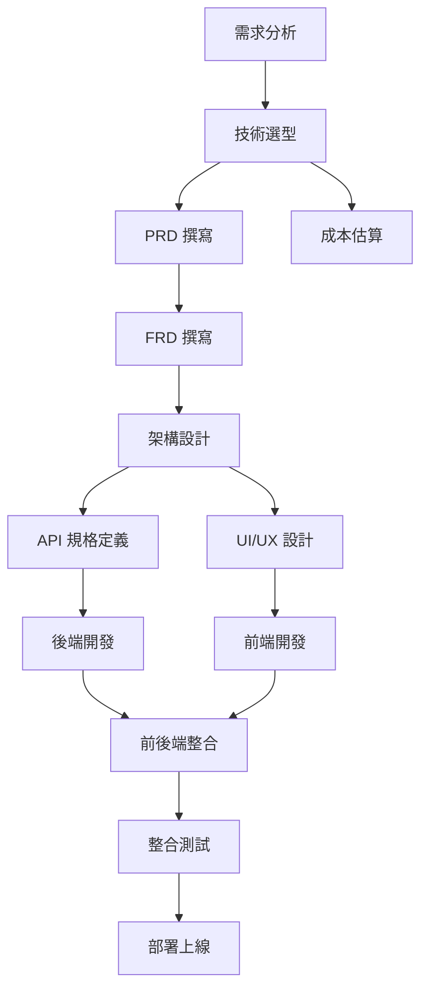

# Parallel Execution Guide
# 並行執行協調指南

> **文檔版本**: v1.0
> **適用框架**: AISDLC v0.09
> **適用場景**: Greenfield (新專案開發)
> **建立日期**: 2025-11-12
> **最後更新**: 2025-11-12
> **維護者**: PM/PO Agent (Victoria), SD Agent (Marcus)

---

## 📋 目的 (Purpose)

本文檔提供 **AISDLC 框架中的並行執行協調機制**，協助團隊：

1. **識別可並行任務**：區分哪些任務可同時執行，哪些必須依序進行
2. **最佳化時程**：透過並行執行縮短專案總時程
3. **協調多 Agent**：當多個 Agent 同時工作時，如何協調與同步
4. **避免阻塞與衝突**：預防並行任務產生的依賴阻塞或資源衝突
5. **提升效率**：充分利用團隊資源，避免等待時間

---

## 🎯 適用範圍 (Scope)

本指南適用於：

- ✅ **多人協作專案**：3+ 人團隊，需平行分工
- ✅ **跨職能團隊**：前端、後端、QA 同時開發
- ✅ **時程緊迫專案**：需加速專案進度
- ✅ **大型專案**：功能複雜、模組眾多

**不適用**：
- ❌ 單人專案（無並行需求）
- ❌ 簡單專案（總工作量 < 1 個月）

---

## 📊 第一部分：並行 vs 依序執行 (Parallel vs Sequential)

### 1.1 並行執行 (Parallel Execution)

**定義**：多個任務同時進行，彼此不依賴

**範例**：
```
前端開發者 A → 開發「快速記帳」頁面
前端開發者 B → 開發「支出總覽」頁面  ← 可並行
後端開發者 C → 開發「記帳 API」
```

**優點**：
- ✅ 縮短總時程（3 個任務同時進行，總時間 = max(任務 A, B, C)）
- ✅ 提升資源利用率（團隊成員不閒置）

**風險**：
- ⚠️ 整合衝突（如 API 介面不一致）
- ⚠️ 溝通成本增加
- ⚠️ 需要明確的介面定義（API Spec, Component Spec）

---

### 1.2 依序執行 (Sequential Execution)

**定義**：任務 B 必須等待任務 A 完成後才能開始

**範例**：
```
步驟 1: 設計資料庫 Schema
   ↓ (依賴)
步驟 2: 實作資料存取層 (Repository)
   ↓ (依賴)
步驟 3: 實作業務邏輯 (Service)
```

**優點**：
- ✅ 降低整合風險（每步驟都基於前一步驟的產出）
- ✅ 溝通簡單（單線程開發）

**缺點**：
- ❌ 總時程長（總時間 = 任務 A + 任務 B + 任務 C）
- ❌ 資源利用率低（其他成員需等待）

---

### 1.3 何時使用並行？何時依序？

| 情境 | 建議 | 原因 |
|-----|------|------|
| **功能之間無依賴** | 並行 | 例：「記帳功能」與「統計圖表功能」可同時開發 |
| **前後端分離開發** | 並行 | 前提：API Spec 已明確定義 |
| **UI 設計與後端開發** | 並行 | UI 與 API 可分開設計 |
| **資料庫設計 → API 開發** | 依序 | API 需依賴資料庫 Schema |
| **API 開發 → 前端串接** | 依序 | 前端需依賴 API 實作 |
| **功能開發 → 整合測試** | 依序 | 測試需所有功能完成 |

---

## 🗺️ 第二部分：AISDLC 各階段的並行策略

### 2.1 階段 1-2: 專案啟動與需求分析 (依序為主)

**特性**：需求分析需共識，不宜並行

| 任務 | 執行方式 | 理由 |
|-----|---------|-----|
| 1.1 專案啟動會議 | ✅ 依序 | 全員參與，建立共識 |
| 2.1 初步需求蒐集 | ✅ 依序 | SA 與 PM 合作 |
| 2.2 需求確認問答 | ✅ 依序 | 需與使用者互動 |
| 2.3 需求完整性檢查 | ✅ 依序 | SA 檢查，BA 驗證 |

**時程**：約 1-2 週

---

### 2.2 階段 3: 技術選型 (部分並行)

| 任務 | 執行方式 | 並行說明 |
|-----|---------|---------|
| 3.1 技術棧評估 | 🔀 部分並行 | 前端與後端技術選型可同時評估 |
| 3.2 成本估算 | ✅ 依序 | 需等技術選型確定 |
| 3.3 風險評估 | 🔀 部分並行 | 技術風險與業務風險可分開評估 |

**並行範例**：
```
SD (Marcus) → 評估後端框架 (Node.js vs Django)
     ∥ 同時
Mobile-Architect → 評估前端框架 (React Native vs Flutter)
     ∥ 同時
DevOps-Engineer → 評估雲端平台 (AWS vs GCP)
```

**時程**：約 1 週（並行後從 3 週縮短為 1 週）

---

### 2.3 階段 4: PRD/FRD 撰寫 (部分並行)

| 任務 | 執行方式 | 並行說明 |
|-----|---------|---------|
| 4.1 PRD 撰寫 | ✅ 依序 | PM 主筆，需先完成 |
| 4.2 FRD 撰寫 | 🔀 部分並行 | SA 依據 PRD 撰寫，可同時拆分功能模組分別撰寫 |
| 4.3 BA 驗證 | ✅ 依序 | 需等 FRD 完成 |

**並行範例 (FRD 模組化撰寫)**：
```
SA (Amanda) → 撰寫 FRD - 記帳模組
     ∥ 同時
Dev (David) → 撰寫 FRD - 統計模組
     ∥ 同時
QA (Quincy) → 準備測試計畫骨架
```

**時程**：約 1-2 週

---

### 2.4 階段 5: 架構設計與 API 規格 (高度並行)

**關鍵**：此階段最適合並行，可大幅縮短時程

| 任務 | 執行方式 | 並行說明 |
|-----|---------|---------|
| 5.1 系統架構設計 (SRD) | 🔀 部分並行 | SD 負責整體，前後端架構可分開設計 |
| 5.2 API 規格定義 | ⚡ 高度並行 | 每個 API 可獨立定義 |
| 5.3 資料庫設計 | ✅ 依序 | 需先確定資料結構 |
| 5.4 UI/UX 設計 | ⚡ 高度並行 | 與架構設計同時進行 |

**並行範例 (API 規格並行定義)**：
```
SD (Marcus) → 定義「記帳 API」規格
     ∥ 同時
Dev (David) → 定義「統計 API」規格
     ∥ 同時
Mobile-Architect → 定義「同步 API」規格
     ∥ 同時
Designer → 設計 UI Mockup
```

**時程**：約 1-2 週（並行後從 4 週縮短為 1-2 週）

---

### 2.5 階段 6: User Story 撰寫 (高度並行)

| 任務 | 執行方式 | 並行說明 |
|-----|---------|---------|
| 6.1 User Story 撰寫 | ⚡ 高度並行 | 每個 Epic 可分配給不同成員撰寫 |
| 6.2 Acceptance Criteria 定義 | ⚡ 高度並行 | 與 User Story 同時定義 |
| 6.3 估算 (Story Points) | 🔀 部分並行 | Planning Poker 需團隊討論 |

**並行範例 (User Story 拆分撰寫)**：
```
PM (Victoria) → 撰寫 EPIC-001 (記帳功能) 的 User Stories
     ∥ 同時
SA (Amanda) → 撰寫 EPIC-002 (統計功能) 的 User Stories
     ∥ 同時
QA (Quincy) → 撰寫每個 US 的 Acceptance Tests
```

**時程**：約 1 週

---

### 2.6 階段 7-8: 開發與測試 (高度並行)

**關鍵**：開發階段最能展現並行效益

| 任務 | 執行方式 | 並行說明 |
|-----|---------|---------|
| 7.1 前端開發 | ⚡ 高度並行 | 多個頁面/元件可同時開發 |
| 7.2 後端開發 | ⚡ 高度並行 | 多個 API 可同時開發 |
| 7.3 前後端整合 | ✅ 依序 | 需等各自開發完成 |
| 8.1 單元測試 | ⚡ 高度並行 | 與開發同時進行 (TDD) |
| 8.2 整合測試 | 🔀 部分並行 | 部分模組可獨立測試 |
| 8.3 E2E 測試 | ✅ 依序 | 需等所有功能完成 |

**並行範例 (前後端分離開發)**：
```
前端開發者 A → US-001 快速記帳頁面
     ∥ 同時
前端開發者 B → US-002 支出總覽頁面
     ∥ 同時
後端開發者 C → API-001 記帳 API
     ∥ 同時
後端開發者 D → API-002 統計 API
     ∥ 同時
QA (Quincy) → 撰寫自動化測試腳本
```

**時程**：約 4-8 週（並行後可大幅縮短）

---

### 2.7 階段 9: 部署上線 (依序為主)

| 任務 | 執行方式 | 理由 |
|-----|---------|-----|
| 9.1 預發布測試 | ✅ 依序 | 需完整系統測試 |
| 9.2 上架準備 | 🔀 部分並行 | iOS 與 Android 上架可同時準備 |
| 9.3 正式上線 | ✅ 依序 | 需逐步驗證 |

**時程**：約 1 週

---

## 📅 第三部分：Gantt Chart 範例 (MoneyTracker)

### 3.1 傳統依序執行時程 (Sequential)

```
階段                    Week 1  Week 2  Week 3  Week 4  Week 5  Week 6  Week 7  Week 8  Week 9  Week 10 Week 11 Week 12
1. 專案啟動             ████
2. 需求分析                     ████████
3. 技術選型                                 ████████████
4. PRD/FRD 撰寫                                         ████████████
5. 架構設計                                                         ████████████████████
6. User Story 撰寫                                                                      ████████
7. 開發                                                                                         ████████████████████████████
8. 測試                                                                                                                 ████████████
9. 部署                                                                                                                         ████
```

**總時程**：12 週

---

### 3.2 優化並行執行時程 (Parallel)

```
階段                    Week 1  Week 2  Week 3  Week 4  Week 5  Week 6  Week 7  Week 8
1. 專案啟動             ████
2. 需求分析                     ████████
3. 技術選型                             ████
   ├─ 後端選型                          ██      ← 並行
   ├─ 前端選型                          ██      ← 並行
   └─ 雲端選型                          ██      ← 並行
4. PRD 撰寫                                 ████
5. FRD 撰寫                                     ████
   ├─ 記帳模組                                  ██  ← 並行
   └─ 統計模組                                  ██  ← 並行
6. 架構設計                                         ████
   ├─ 後端架構                                      ██  ← 並行
   ├─ 前端架構                                      ██  ← 並行
   └─ UI 設計                                       ██  ← 並行
7. API 規格定義                                         ████
   ├─ API-001~003                                      ██  ← 並行
   └─ API-004~006                                      ██  ← 並行
8. User Story 撰寫                                          ████
9. 開發                                                         ████████████
   ├─ 前端開發者 A                                              ████████  ← 並行
   ├─ 前端開發者 B                                              ████████  ← 並行
   ├─ 後端開發者 C                                              ████████  ← 並行
   └─ 單元測試                                                  ████████  ← 並行
10. 整合測試                                                                    ████
11. 部署                                                                            ████
```

**總時程**：8 週（縮短 33%）

---

### 3.3 時程優化比較

| 階段 | 傳統依序 | 優化並行 | 節省時間 | 優化策略 |
|-----|---------|---------|---------|---------|
| 1-2. 啟動與需求 | 3 週 | 3 週 | 0 週 | 需共識，無法並行 |
| 3. 技術選型 | 3 週 | 1 週 | **-2 週** | 前後端與雲端同時評估 |
| 4-5. PRD/FRD | 3 週 | 2 週 | **-1 週** | FRD 模組化撰寫 |
| 6. 架構設計 | 5 週 | 1 週 | **-4 週** | 前後端架構、UI 設計同時進行 |
| 7. User Story | 2 週 | 1 週 | **-1 週** | Epic 拆分並行撰寫 |
| 8. 開發 | 7 週 | 3 週 | **-4 週** | 前後端並行開發、TDD 同步測試 |
| 9. 測試 | 3 週 | 1 週 | **-2 週** | 單元測試與開發同步 |
| 10. 部署 | 1 週 | 1 週 | 0 週 | 依序進行 |
| **總計** | **27 週** | **13 週** | **-14 週 (52%)** | |

---

## 🤝 第四部分：並行協調機制 (Coordination Mechanisms)

### 4.1 前置條件：明確的介面定義

**並行開發的關鍵**：介面 (Interface) 必須事先定義清楚

| 介面類型 | 定義文檔 | 範例 |
|---------|---------|-----|
| **API 介面** | API Specification | `API_Transaction_Create.md` |
| **資料庫介面** | Database Schema | `Schema_transactions_table.sql` |
| **元件介面** | Component Spec | `Component_ExpenseCard.md` |
| **模組介面** | Module Interface (TypeScript) | `interface ITransactionService { ... }` |

**範例：API 規格必須包含**：
```markdown
## API-001: 建立記帳記錄

### Request
POST /api/transactions
Content-Type: application/json

{
  "amount": 250,
  "category": "食物",
  "note": "午餐"
}

### Response
200 OK
{
  "id": 123,
  "amount": 250,
  "category": "食物",
  "note": "午餐",
  "created_at": "2025-11-12T10:30:00Z"
}

### Error
400 Bad Request (amount 必須 > 0)
401 Unauthorized (未登入)
```

**前端與後端可基於此規格同時開發**：
- 前端：Mock API 資料進行開發
- 後端：實作真實 API
- 整合時：將 Mock 替換為真實 API

---

### 4.2 協調工具與方法

#### 方法 1: Daily Stand-up (每日站立會議)

**時間**：每天早上 10:00，15 分鐘

**格式**：每人回答 3 個問題
1. 昨天完成了什麼？
2. 今天計畫做什麼？
3. 遇到什麼阻礙？

**範例**：
```
前端開發者 A:
- 昨天：完成 US-001 快速記帳頁面 UI
- 今天：串接 API-001 記帳 API
- 阻礙：API-001 回傳格式與文件不符 (category_id 應為 string，實際為 number)

後端開發者 C:
- 昨天：完成 API-001 記帳 API
- 今天：修正 API-001 回傳格式，開始 API-002 統計 API
- 阻礙：無
```

**行動**：立即解決阻礙，避免前端等待

---

#### 方法 2: 共用工作看板 (Kanban Board)

**工具**：Jira, Trello, GitHub Projects

**看板欄位**：
```
┌─────────┬─────────┬─────────┬─────────┬─────────┐
│ Backlog │ To Do   │ In Prog │ Review  │ Done    │
├─────────┼─────────┼─────────┼─────────┼─────────┤
│ US-003  │ US-001  │ US-002  │ US-004  │ US-005  │
│ US-006  │         │ API-001 │ API-002 │ US-007  │
└─────────┴─────────┴─────────┴─────────┴─────────┘
```

**好處**：
- 一目了然誰在做什麼
- 避免重複工作
- 識別瓶頸 (如 Review 欄位卡太多 Story)

---

#### 方法 3: 版本控制最佳實踐

**Git 分支策略 (Git Flow)**：

```
main (生產環境)
  │
  ├─ develop (開發分支)
  │    │
  │    ├─ feature/US-001-quick-expense (前端開發者 A)
  │    ├─ feature/US-002-expense-overview (前端開發者 B)
  │    ├─ feature/API-001-transaction-api (後端開發者 C)
  │    └─ feature/API-002-stats-api (後端開發者 D)
  │
  └─ release/v1.0 (發布分支)
```

**並行開發流程**：
1. 每個開發者從 `develop` 分支建立 `feature/*` 分支
2. 在自己的分支上開發
3. 完成後發起 Pull Request (PR) → `develop`
4. Code Review 通過後合併
5. 定期將 `develop` 合併到 `release/*` 進行整合測試

---

#### 方法 4: API Mock Server

**問題**：前端需要等後端 API 開發完成才能串接

**解決方案**：使用 Mock Server 模擬 API

**工具**：
- **Postman Mock Server**: 基於 Postman Collection 自動生成
- **JSON Server**: 快速建立 REST API Mock
- **MSW (Mock Service Worker)**: 前端攔截 HTTP 請求

**範例 (JSON Server)**：

```json
// db.json
{
  "transactions": [
    { "id": 1, "amount": 250, "category": "食物", "note": "午餐" },
    { "id": 2, "amount": 80, "category": "交通", "note": "捷運" }
  ]
}
```

```bash
# 啟動 Mock Server
json-server --watch db.json --port 3001
```

**前端可立即串接**：
```javascript
// 開發階段：使用 Mock Server
const API_BASE_URL = "http://localhost:3001"

// 生產環境：使用真實 API
const API_BASE_URL = "https://api.moneytracker.com"
```

---

### 4.3 衝突解決機制

#### 衝突類型 1: API 介面不一致

**問題**：前端期待 `category_id: string`，後端回傳 `category_id: number`

**解決流程**：
1. **發現衝突**：前端開發者在整合時發現
2. **查詢文檔**：檢查 API Specification 定義為何
3. **協調決策**：
   - 若文檔定義為 `string` → 後端修正
   - 若文檔定義為 `number` → 前端修正
   - 若文檔未定義 → 團隊討論決定，並更新文檔
4. **更新文檔**：修正 API Specification
5. **通知團隊**：在 Slack/Teams 通知變更

---

#### 衝突類型 2: Git Merge Conflict

**問題**：兩位開發者修改了同一個檔案

**預防措施**：
- ✅ 模組化設計，減少檔案共用
- ✅ 定期從 `develop` 合併到 `feature/*` 分支（至少每天 1 次）
- ✅ 小步快跑，頻繁提交 (Commit) 與合併 (Merge)

**解決流程**：
1. Git 提示 Merge Conflict
2. 開發者手動解決衝突
3. 測試功能是否正常
4. 提交解決後的程式碼

---

#### 衝突類型 3: 依賴阻塞

**問題**：前端開發者等待後端 API，但後端 API 延遲

**解決方案**：
- **方案 1: 使用 Mock Server** (見 4.2 方法 4)
- **方案 2: 調整優先順序** - PM 調整 Sprint 計畫，前端先開發其他 User Story
- **方案 3: 增加資源** - 額外人力協助後端開發

---

## 📋 第五部分：並行執行檢查清單 (Parallel Execution Checklist)

### 5.1 規劃階段檢查清單

在開始並行執行前，確認以下項目：

- [ ] **介面已明確定義**: API Spec, Database Schema, Component Spec 已完成
- [ ] **任務依賴已識別**: 使用依賴圖標示哪些任務可並行、哪些需依序
- [ ] **責任已分配**: 每個任務都有明確負責人
- [ ] **溝通機制已建立**: Daily Stand-up, Kanban Board, Slack Channel
- [ ] **版本控制策略已確認**: Git Flow 分支策略、PR Review 流程
- [ ] **Mock Server 已準備**: 前端不需等待後端即可開發
- [ ] **測試策略已規劃**: 單元測試與開發同步 (TDD)

---

### 5.2 執行階段檢查清單

並行執行期間，每日檢查：

- [ ] **每日站立會議已舉行**: 識別阻礙並立即解決
- [ ] **看板已更新**: 所有任務狀態同步
- [ ] **無依賴阻塞**: 所有成員都有任務進行中
- [ ] **介面變更已同步**: API/Database 變更已通知相關人員
- [ ] **Git 分支已定期合併**: 避免大規模 Merge Conflict
- [ ] **Code Review 已及時處理**: PR 不超過 24 小時未 Review
- [ ] **測試覆蓋率達標**: 單元測試覆蓋率 ≥ 80%

---

### 5.3 整合階段檢查清單

並行開發完成後，整合前檢查：

- [ ] **所有 Feature Branch 已合併到 Develop**: 無遺漏分支
- [ ] **整合測試已通過**: E2E 測試無錯誤
- [ ] **API 介面一致性已驗證**: 前後端串接無問題
- [ ] **效能測試已通過**: 無明顯效能瓶頸
- [ ] **文檔已更新**: API Spec, SRD 與實作一致
- [ ] **部署腳本已測試**: CI/CD Pipeline 正常運作

---

## 📚 第六部分：工具與模板 (Tools & Templates)

### 6.1 依賴圖模板 (Dependency Graph)

**使用 Mermaid 繪製任務依賴圖**：



**並行識別**：
- 橫向排列的節點可並行 (如 `I` 與 `J`)
- 縱向排列的節點需依序 (如 `A → B → C`)

---

### 6.2 RACI 矩陣模板 (Responsibility Assignment Matrix)

**定義角色職責**，避免並行時職責不清

| 任務 | SA | BA | PM | SD | Dev | QA | 說明 |
|-----|----|----|----|----|-----|----|----|
| **需求分析** | R | C | A | I | I | I | SA 負責執行，PM 批准 |
| **PRD 撰寫** | C | C | R/A | I | I | I | PM 負責與批准 |
| **FRD 撰寫** | R/A | C | I | C | C | I | SA 負責與批准 |
| **架構設計** | C | I | I | R/A | C | I | SD 負責與批准 |
| **API 規格** | C | I | I | R/A | C | I | SD 負責與批准 |
| **開發** | I | I | I | C | R/A | C | Dev 負責與批准 |
| **測試** | I | I | I | I | C | R/A | QA 負責與批准 |

**圖例**：
- **R (Responsible)**: 執行者（負責完成任務）
- **A (Accountable)**: 批准者（最終決策與批准）
- **C (Consulted)**: 諮詢者（需諮詢意見）
- **I (Informed)**: 知會者（需知悉進度）

---

### 6.3 並行執行計畫模板

**專案**: [專案名稱]
**Sprint**: Sprint X
**時程**: YYYY-MM-DD ~ YYYY-MM-DD

#### 並行任務組

| 任務組 | 任務 | 負責人 | 預估工時 | 依賴 | 狀態 |
|-------|-----|--------|---------|-----|------|
| **組 1 (並行)** | US-001 快速記帳頁面 | 前端 A | 2 天 | API-001 Mock | ⏳ 進行中 |
| **組 1 (並行)** | US-002 支出總覽頁面 | 前端 B | 1.5 天 | API-002 Mock | ⏳ 進行中 |
| **組 1 (並行)** | API-001 記帳 API | 後端 C | 1 天 | Database Schema | ✅ 完成 |
| **組 2 (依序)** | 前後端整合 | 前端 A, 後端 C | 0.5 天 | 組 1 完成 | ⏸ 等待 |
| **組 3 (並行)** | 單元測試 US-001 | QA | 0.5 天 | US-001 完成 | ⏸ 等待 |
| **組 3 (並行)** | 單元測試 API-001 | QA | 0.5 天 | API-001 完成 | ⏳ 進行中 |

---

## ✅ 並行執行效益評估 (Benefits Assessment)

### 典型專案時程縮短比例

| 專案規模 | 傳統依序 | 優化並行 | 縮短比例 | 條件 |
|---------|---------|---------|---------|-----|
| **小型** (1-3 人月) | 3 個月 | 2.5 個月 | **-17%** | 2-3 人團隊 |
| **中型** (3-6 人月) | 6 個月 | 4 個月 | **-33%** | 5-8 人團隊 |
| **大型** (6+ 人月) | 12 個月 | 7 個月 | **-42%** | 10+ 人團隊 |

**關鍵成功因素**：
- ✅ 明確的介面定義 (API Spec, Component Spec)
- ✅ 有效的溝通機制 (Daily Stand-up, Kanban)
- ✅ 充足的資源 (足夠人力)
- ✅ 團隊協作經驗 (曾經並行開發)

---

## 📚 第七部分：參考資料 (References)

### 相關 AISDLC 文檔

- **Greenfield SOP**: `scenarios/greenfield/SOP.md`
- **Estimation Standards**: `guides/system/planning/Estimation_Standards.md`
- **C4 Model Guidelines**: `guides/system/architecture/C4_Model_Guidelines.md`
- **Platform Agent Selection Guide**: `guides/system/agent/Platform_Agent_Selection_Guide.md`

---

## 📝 變更記錄 (Change Log)

| 版本 | 日期 | 修改人 | 修改內容 |
|-----|------|--------|---------|
| v1.0 | 2025-11-12 | Victoria (PM) | 初版建立，定義並行執行協調機制 |

---

**文檔結束 (End of Document)**
