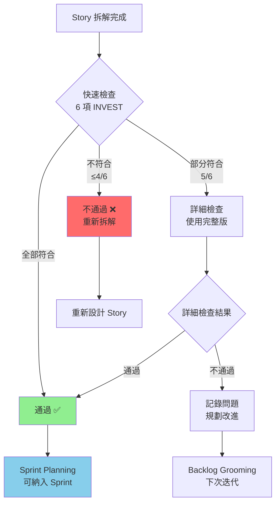

# INVEST 原則檢查清單
# INVEST Principle Checklist

> **🎯 文檔目的**
>
> 本檔案提供 **User Story 品質檢查的標準化清單**，協助團隊快速評估 Story 是否符合 INVEST 原則。
>
> - **適用階段**: Stage 6 - User Story & Story Point 估算
> - **檢查時機**: Story 拆解後、Sprint Planning 前、Backlog Grooming 時
> - **執行角色**: SA (Amanda) + PM/PO (Victoria) + Dev (David)
> - **目標**: 確保每個 User Story 品質達標，可獨立開發與測試

---

**版本**: v1.0
**最後更新**: 2025-11-21
**文檔類型**: 檢查清單 | Greenfield 開發流程
**相關文檔**:
- [SOP.md - Stage 6](../SOP.md) - Epic 拆解與 INVEST 原則
- [Estimation_Standards.md](../../../guides/system/planning/Estimation_Standards.md) - Story Point 估算標準

---

## 📋 目錄

1. [INVEST 原則總覽](#invest-原則總覽)
2. [快速檢查清單（簡版）](#快速檢查清單簡版)
3. [詳細檢查清單（完整版）](#詳細檢查清單完整版)
4. [常見問題與修正方法](#常見問題與修正方法)
5. [實際案例分析](#實際案例分析)
6. [檢查流程與工具](#檢查流程與工具)

---

## INVEST 原則總覽

**INVEST 是優秀 User Story 的黃金標準**，由 Bill Wake 於 2003 年提出。

| 字母 | 原則 | 核心問題 | 品質目標 |
|-----|------|---------|---------|
| **I** | **Independent**<br/>（獨立的） | 能否單獨開發、測試、部署？ | Story 之間盡量減少依賴，可任意排序 |
| **N** | **Negotiable**<br/>（可協商的） | 是否只描述「做什麼」而非「怎麼做」？ | 細節可在開發過程中與團隊協商調整 |
| **V** | **Valuable**<br/>（有價值的） | 使用者能從中獲得什麼？ | 對使用者或業務有明確、可感知的價值 |
| **E** | **Estimable**<br/>（可估算的） | 需求是否清晰到可以估算時間？ | 團隊能夠估算工作量（Story Points） |
| **S** | **Small**<br/>（小的） | 是否可在 1 Sprint 內完成？ | 適合在 1-3 天內完成（3-5 Story Points） |
| **T** | **Testable**<br/>（可測試的） | 能否寫出清晰的測試案例？ | 有明確的驗收標準（Acceptance Criteria） |

---

## 快速檢查清單（簡版）

> **使用時機**: Story 拆解後的初步檢查（5 分鐘/Story）

### 檢查表格

| # | 檢查項目 | ✅/❌ | 備註 |
|---|---------|-------|------|
| **I** | Story 可以獨立開發，不強制依賴其他 Story | [ ] | |
| **N** | Story 描述「做什麼」，而非「怎麼做」（無技術實作細節） | [ ] | |
| **V** | Story 對使用者或業務有明確價值（能回答「為什麼需要？」） | [ ] | |
| **E** | 團隊能估算工作量（需求足夠清晰） | [ ] | |
| **S** | Story 可在 1-3 天內完成（≤ 5 Story Points） | [ ] | |
| **T** | Story 有 1-3 個明確的 Acceptance Criteria | [ ] | |

**通過標準**: ✅ 6/6 項全部符合
**條件通過**: ✅ 5/6 項符合（需記錄未符合項目並規劃改進）
**不通過**: ❌ ≤ 4 項符合（需重新拆解或調整）

---

## 詳細檢查清單（完整版）

> **使用時機**: Sprint Planning 前的正式檢查（10-15 分鐘/Story）

---

### I - Independent（獨立的）

**核心問題**: Story 能否獨立開發、測試、部署？

#### 檢查項目

| # | 檢查點 | 符合標準 | ✅/❌ | 備註 |
|---|--------|---------|-------|------|
| I.1 | **開發獨立性** | 不需要等待其他 Story 完成才能開發 | [ ] | |
| I.2 | **測試獨立性** | 可以獨立撰寫與執行測試案例 | [ ] | |
| I.3 | **部署獨立性** | 可以單獨部署到測試/正式環境 | [ ] | |
| I.4 | **順序彈性** | Story 可以任意調整執行順序（無硬性依賴） | [ ] | |
| I.5 | **介面穩定性** | 若有依賴，依賴的 API/介面已定義清楚 | [ ] | |

#### 不符合範例與修正

| ❌ 不符合 | 問題 | ✅ 修正方法 |
|----------|------|-----------|
| Story A 必須等 Story B 的 API 完成才能開發 | 強依賴 | 方法 1: 先定義 API 規格，Story A 可用 Mock API 開發<br/>方法 2: 合併 Story A 和 B 成單一 Story |
| Story 需要資料庫 Schema 先建立 | 共用依賴 | 方法 1: 將 Schema 建立獨立為基礎設施 Story<br/>方法 2: 包含 Schema 建立在 Story 的 AC 中 |

---

### N - Negotiable（可協商的）

**核心問題**: Story 是否只描述「做什麼」而非「怎麼做」？

#### 檢查項目

| # | 檢查點 | 符合標準 | ✅/❌ | 備註 |
|---|--------|---------|-------|------|
| N.1 | **需求導向** | 描述使用者需求，不描述技術實作 | [ ] | |
| N.2 | **解決方案彈性** | 開發團隊可選擇最佳技術方案 | [ ] | |
| N.3 | **細節可調整** | UI/UX 細節可在開發過程中討論調整 | [ ] | |
| N.4 | **避免過度規範** | 不強制指定特定框架、函式庫、演算法 | [ ] | |
| N.5 | **保留協商空間** | Story 描述中包含「如...」的開放性表述 | [ ] | |

#### 不符合範例與修正

| ❌ 不符合 | 問題 | ✅ 修正方法 |
|----------|------|-----------|
| 使用者可以透過 React Hook Form 驗證表單欄位 | 指定技術實作 | 使用者可以即時驗證表單欄位（錯誤提示於欄位下方） |
| 使用 Redis 快取商品列表，TTL 設定為 300 秒 | 過度規範 | 商品列表載入時間 < 1 秒（開發團隊可選擇快取策略） |
| 用 JWT Token 實作登入功能 | 限制技術方案 | 使用者可以安全地登入系統並保持登入狀態 |

---

### V - Valuable（有價值的）

**核心問題**: 使用者能從中獲得什麼？

#### 檢查項目

| # | 檢查點 | 符合標準 | ✅/❌ | 備註 |
|---|--------|---------|-------|------|
| V.1 | **使用者價值明確** | 能回答「使用者為何需要這個功能？」 | [ ] | |
| V.2 | **業務價值明確** | 能回答「這個 Story 如何幫助達成業務目標？」 | [ ] | |
| V.3 | **價值可感知** | 使用者可以直接感受到改進（非純技術重構） | [ ] | |
| V.4 | **優先級可評估** | 可以用 RICE 評分或其他方法評估優先級 | [ ] | |
| V.5 | **避免技術債務** | 不是純粹的技術優化（如「重構 XX 模組」） | [ ] | |

#### 特殊情況：技術型 Story

某些 Story 本身是技術性的（如「建立 CI/CD Pipeline」），但仍需體現價值：

| Story 類型 | 價值體現方式 | 範例 |
|-----------|-------------|------|
| 基礎設施 | 支援業務功能開發 | 建立 API Gateway，以便整合第三方支付服務 |
| 效能優化 | 改善使用者體驗 | 優化商品搜尋速度至 < 500ms，提升使用者轉換率 |
| 技術債務 | 降低維護成本或風險 | 升級過期套件至最新版本，修復 3 個已知安全漏洞 |

#### 不符合範例與修正

| ❌ 不符合 | 問題 | ✅ 修正方法 |
|----------|------|-----------|
| 重構使用者模組程式碼 | 沒有明確價值 | 優化使用者模組回應時間至 < 200ms，提升註冊流程完成率 |
| 新增日誌記錄功能 | 價值不明確 | 新增錯誤日誌追蹤，縮短 Bug 修復時間 50% |
| 建立單元測試 | 技術導向 | 建立關鍵支付模組單元測試，確保 99.9% 交易成功率 |

---

### E - Estimable（可估算的）

**核心問題**: 需求是否清晰到可以估算時間？

#### 檢查項目

| # | 檢查點 | 符合標準 | ✅/❌ | 備註 |
|---|--------|---------|-------|------|
| E.1 | **需求清晰** | Story 描述與 AC 足夠清楚，團隊理解要做什麼 | [ ] | |
| E.2 | **範圍明確** | Story 的工作範圍界定清楚（前端/後端/測試） | [ ] | |
| E.3 | **技術可行性** | 團隊知道如何實作（或有時間研究） | [ ] | |
| E.4 | **依賴已知** | 外部依賴（API、第三方服務）已明確 | [ ] | |
| E.5 | **團隊共識** | Planning Poker 時估算差異 ≤ 3 個 Fibonacci 級距 | [ ] | |

#### 無法估算的常見原因

| 原因 | 範例 | 解決方法 |
|------|------|---------|
| **需求模糊** | 「優化系統效能」 | 明確目標：「將商品頁載入時間從 3 秒降至 1 秒」 |
| **技術未知** | 「整合 AI 語音辨識服務」 | 先執行 Spike Story（時間盒：1-2 天研究） |
| **範圍過大** | 「建立完整的使用者權限管理系統」 | 拆解為多個小 Story（角色建立、權限設定、權限檢查） |
| **依賴不明** | 「串接第三方物流 API」 | 先確認 API 文件、測試環境、金鑰取得流程 |

---

### S - Small（小的）

**核心問題**: Story 是否可在 1 Sprint 內完成？

#### 檢查項目

| # | 檢查點 | 符合標準 | ✅/❌ | 備註 |
|---|--------|---------|-------|------|
| S.1 | **時間限制** | Story 可在 1-3 天內完成 | [ ] | |
| S.2 | **Story Points 範圍** | Story Points ≤ 5（建議 1-3 Points） | [ ] | |
| S.3 | **單一職責** | Story 只完成一件事情（單一使用者目標） | [ ] | |
| S.4 | **AC 數量** | Acceptance Criteria 數量 1-5 個 | [ ] | |
| S.5 | **可分割性** | 若 Story 太大，可明確識別拆分點 | [ ] | |

#### Story 大小參考標準

| Story Points | 工期 | 適用情境 | 範例 |
|-------------|------|---------|------|
| **1 Point** | 0.5-1 天 | 簡單 CRUD、小型 UI 調整 | 新增「忘記密碼」連結到登入頁 |
| **2 Points** | 1-1.5 天 | 標準功能開發 | 實作使用者註冊表單與驗證 |
| **3 Points** | 1.5-2 天 | 中等複雜度功能 | 串接第三方登入（Google OAuth） |
| **5 Points** | 2-3 天 | 較複雜功能（上限） | 實作商品搜尋（含分類、價格區間、排序） |
| **8 Points** | 3-5 天 | ⚠️ 建議拆分 | Epic 或需拆解的大 Story |
| **13 Points** | > 5 天 | ❌ 必須拆分 | Epic，無法作為 Story |

#### 拆分方法

**方法 1: 按使用者旅程拆分（垂直切分）**

```markdown
❌ 原始 Story（13 Points）: 使用者可以完成購物車結帳流程

✅ 拆分後:
- US-020 (3 Points): 使用者可以查看購物車並修改數量
- US-021 (3 Points): 使用者可以填寫配送地址（含驗證）
- US-022 (2 Points): 使用者可以選擇配送方式（標準/快速）
- US-023 (3 Points): 使用者可以選擇付款方式並完成付款
- US-024 (2 Points): 使用者可以查看訂單確認頁面
```

**方法 2: 按 CRUD 操作拆分**

```markdown
❌ 原始 Story（8 Points）: 使用者可以管理收藏清單

✅ 拆分後:
- US-030 (2 Points): 使用者可以將商品加入收藏清單
- US-031 (2 Points): 使用者可以查看收藏清單
- US-032 (2 Points): 使用者可以從收藏清單移除商品
```

**方法 3: 按平台拆分（跨平台專案）**

```markdown
❌ 原始 Story（13 Points）: 使用者可以接收訂單狀態通知

✅ 拆分後:
- US-040 (3 Points): 使用者可以在 Web 版接收訂單狀態通知
- US-041 (3 Points): 使用者可以在 iOS App 接收推播通知
- US-042 (3 Points): 使用者可以在 Android App 接收推播通知
```

---

### T - Testable（可測試的）

**核心問題**: 能否寫出清晰的測試案例？

#### 檢查項目

| # | 檢查點 | 符合標準 | ✅/❌ | 備註 |
|---|--------|---------|-------|------|
| T.1 | **AC 明確性** | 每個 Acceptance Criteria 清楚定義通過條件 | [ ] | |
| T.2 | **AC 可驗證性** | AC 可以轉換為自動化或手動測試案例 | [ ] | |
| T.3 | **AC 數量合理** | Story 有 1-5 個 AC（不過多或過少） | [ ] | |
| T.4 | **正向與負向測試** | AC 涵蓋成功情境與錯誤處理 | [ ] | |
| T.5 | **測試資料可準備** | 測試所需的資料與環境可以準備 | [ ] | |

#### 良好的 AC 撰寫範例

**格式 1: Given-When-Then (BDD 風格)**

```markdown
User Story: 使用者可以使用 Email 與密碼登入系統

Acceptance Criteria:

AC-101-1: 成功登入
  Given: 使用者已註冊（Email: test@example.com, Password: Test@1234）
  When: 使用者輸入正確的 Email 與密碼，點擊「登入」
  Then: 系統顯示「登入成功」，導向使用者首頁，顯示使用者名稱

AC-101-2: Email 格式錯誤
  Given: 使用者在登入頁面
  When: 使用者輸入無效 Email（如 "notanemail"），點擊「登入」
  Then: 系統顯示錯誤訊息「請輸入有效的 Email 格式」，不發送登入請求

AC-101-3: 密碼錯誤
  Given: 使用者已註冊（Email: test@example.com）
  When: 使用者輸入正確 Email 但錯誤密碼，點擊「登入」
  Then: 系統顯示錯誤訊息「Email 或密碼錯誤」，密碼欄位清空

AC-101-4: 帳號鎖定機制
  Given: 使用者連續輸入錯誤密碼 5 次
  When: 使用者第 6 次輸入錯誤密碼
  Then: 系統顯示「帳號已鎖定 30 分鐘，請稍後再試」，禁止登入嘗試
```

**格式 2: 簡潔條列式**

```markdown
User Story: 使用者可以搜尋商品

Acceptance Criteria:

AC-102-1:
  - 輸入關鍵字「筆記型電腦」，點擊搜尋
  - 顯示所有名稱或描述包含「筆記型電腦」的商品
  - 搜尋結果按相關性排序，每頁顯示 20 筆

AC-102-2:
  - 輸入不存在的關鍵字「xyzabc」，點擊搜尋
  - 顯示「查無符合的商品」訊息
  - 顯示熱門關鍵字建議

AC-102-3:
  - 搜尋關鍵字為空，點擊搜尋
  - 顯示所有商品（分類瀏覽模式）
  - 顯示分類篩選器（價格、品牌、評價）
```

#### 不符合範例與修正

| ❌ 不符合 | 問題 | ✅ 修正方法 |
|----------|------|-----------|
| AC: 系統效能良好 | 標準模糊 | AC: 商品列表載入時間 < 1 秒（100 筆商品） |
| AC: UI 美觀易用 | 主觀判斷 | AC: 使用者可在 3 步驟內完成結帳（點擊次數 ≤ 3） |
| AC: 符合業界最佳實踐 | 無法驗證 | AC: API 回應時間 < 200ms（P95），錯誤率 < 0.1% |

---

## 常見問題與修正方法

### 問題 1: Story 依賴其他 Story（違反 Independent）

**情境**: US-201「使用者可以查看訂單詳情」依賴 US-200「使用者可以建立訂單」

**解決方案**:

| 方法 | 說明 | 適用情境 |
|------|------|---------|
| **方法 1: 調整順序** | US-200 先執行，US-201 後執行 | 依賴為單向且明確 |
| **方法 2: Mock 資料** | US-201 使用 Mock 訂單資料開發 | 兩個 Story 可並行開發 |
| **方法 3: 合併 Story** | 合併為「使用者可以建立訂單並查看詳情」 | 兩個功能強耦合 |
| **方法 4: 定義介面** | 先定義 Order API 規格，US-200 與 US-201 各自實作 | 前後端分離開發 |

---

### 問題 2: Story 描述技術實作（違反 Negotiable）

**情境**: 「使用 Redis 快取商品列表，TTL 設定為 300 秒」

**解決方案**:

```markdown
❌ 原始 Story:
使用 Redis 快取商品列表，TTL 設定為 300 秒

✅ 修正後 Story:
使用者可以快速瀏覽商品列表（載入時間 < 500ms）

📝 技術建議（放在 Story 備註或技術討論，非 Story 本身）:
- 建議使用快取機制（Redis/Memcached）
- 快取失效時間可設定為 5-10 分鐘
- 開發團隊可選擇最佳方案
```

---

### 問題 3: Story 沒有明確業務價值（違反 Valuable）

**情境**: 「重構使用者模組程式碼」

**解決方案**:

```markdown
❌ 原始 Story:
重構使用者模組程式碼

✅ 修正方法 1: 連結業務價值
優化使用者註冊流程效能，將註冊時間從 3 秒降至 1 秒
（價值: 提升註冊完成率 15%，預期增加 500 新用戶/月）

✅ 修正方法 2: 連結技術風險
修復使用者模組 3 個已知安全漏洞（OWASP Top 10: SQL Injection）
（價值: 降低資料外洩風險，符合 GDPR 合規要求）

✅ 修正方法 3: 連結維護成本
重構使用者模組，降低 Cyclomatic Complexity 從 25 至 10
（價值: 縮短新功能開發時間 30%，降低 Bug 修復時間 40%）
```

---

### 問題 4: Story 太大無法估算（違反 Estimable & Small）

**情境**: 「建立完整的使用者權限管理系統」

**解決方案**:

```markdown
❌ 原始 Story (Epic, 21+ Points):
建立完整的使用者權限管理系統

✅ 拆分為 Epic → User Stories:

Epic-005: 使用者權限管理系統

├── US-501 (3 Points): 管理員可以建立角色（Admin, Editor, Viewer）
│   AC-501-1: 輸入角色名稱與描述，點擊「建立」
│   AC-501-2: 角色名稱唯一性驗證
│   AC-501-3: 角色列表即時更新

├── US-502 (3 Points): 管理員可以編輯或刪除角色
│   AC-502-1: 編輯角色名稱與描述
│   AC-502-2: 刪除角色（需確認對話框）
│   AC-502-3: 無法刪除有使用者的角色（顯示警告）

├── US-503 (5 Points): 管理員可以設定角色權限（CRUD on Resources）
│   AC-503-1: 選擇角色，顯示權限設定頁面
│   AC-503-2: 勾選/取消勾選權限（Read, Write, Delete）
│   AC-503-3: 儲存權限設定，即時生效

├── US-504 (3 Points): 管理員可以將角色指派給使用者
│   AC-504-1: 搜尋使用者，顯示使用者列表
│   AC-504-2: 選擇使用者，指派一個或多個角色
│   AC-504-3: 使用者角色變更即時生效

└── US-505 (3 Points): 系統依據使用者角色控制頁面存取權限
    AC-505-1: Viewer 角色只能查看資料（無編輯按鈕）
    AC-505-2: Editor 角色可編輯但不可刪除
    AC-505-3: Admin 角色擁有完整權限
```

---

### 問題 5: Story 沒有明確 AC（違反 Testable）

**情境**: 「使用者可以使用搜尋功能」（沒有 AC）

**解決方案**:

```markdown
❌ 原始 Story:
使用者可以使用搜尋功能

✅ 補充明確 AC:

User Story: 使用者可以使用關鍵字搜尋商品

Acceptance Criteria:

AC-601-1: 成功搜尋（有結果）
  Given: 商品資料庫有 100 筆商品
  When: 使用者輸入關鍵字「筆記型電腦」，點擊「搜尋」
  Then:
    - 顯示所有名稱或描述包含「筆記型電腦」的商品
    - 搜尋結果按相關性排序
    - 每頁顯示 20 筆，支援分頁
    - 搜尋時間 < 1 秒

AC-601-2: 搜尋無結果
  Given: 使用者在搜尋頁面
  When: 使用者輸入不存在的關鍵字「xyzabc123」
  Then:
    - 顯示「查無符合的商品」訊息
    - 顯示熱門關鍵字建議（5 個）
    - 搜尋框保留輸入內容

AC-601-3: 空白搜尋
  Given: 使用者在搜尋頁面
  When: 使用者未輸入關鍵字，直接點擊「搜尋」
  Then:
    - 顯示所有商品（分類瀏覽模式）
    - 顯示分類篩選器（價格、品牌、評價、庫存）

AC-601-4: 搜尋歷史記錄
  Given: 使用者曾搜尋過「筆記型電腦」和「滑鼠」
  When: 使用者點擊搜尋框
  Then:
    - 顯示最近 5 筆搜尋歷史
    - 點擊歷史記錄，自動搜尋該關鍵字
```

---

## 實際案例分析

### 案例 1: 電商平台 - 商品評價功能

#### Story 原始版本（不符合 INVEST）

```markdown
User Story: 建立商品評價系統

Description:
  使用者可以對購買過的商品進行評價，包含星級評分、文字評論、上傳圖片，
  並且可以編輯或刪除自己的評價，系統會計算商品的平均評分並顯示在商品頁面。

Estimated Story Points: 13 Points

INVEST 檢查:
  ❌ I - Independent: 部分符合（依賴訂單系統）
  ⚠️ N - Negotiable: 過度規範（要求星級+文字+圖片）
  ✅ V - Valuable: 符合（提升購買決策品質）
  ❌ E - Estimable: 不符合（範圍過大，難以估算）
  ❌ S - Small: 不符合（13 Points 超過上限）
  ⚠️ T - Testable: 部分符合（缺少明確 AC）

結論: ❌ 需要拆分與調整
```

#### Story 拆分與修正（符合 INVEST）

```markdown
Epic-010: 商品評價系統

├── US-601 (3 Points): 使用者可以對已購買商品進行星級評分（1-5 星）
│   INVEST 檢查:
│     ✅ I - Independent: 可獨立開發與測試
│     ✅ N - Negotiable: 只描述需求，不限制實作方式
│     ✅ V - Valuable: 使用者可快速評價，商家獲得回饋
│     ✅ E - Estimable: 團隊估算為 3 Points
│     ✅ S - Small: 2-3 天可完成
│     ✅ T - Testable: 有明確 AC
│
│   Acceptance Criteria:
│   AC-601-1: 已購買商品顯示「評價」按鈕
│   AC-601-2: 點擊後顯示 1-5 星評分介面
│   AC-601-3: 選擇星級後送出，顯示「評價成功」
│   AC-601-4: 未購買商品不顯示「評價」按鈕
│
├── US-602 (3 Points): 使用者可以在星級評分外，加上文字評論（選填）
│   INVEST 檢查:
│     ✅ I - Independent: 可獨立開發（US-601 已定義評價 API）
│     ✅ N - Negotiable: 文字長度限制可協商（建議 10-500 字）
│     ✅ V - Valuable: 提供更詳細的購買心得
│     ✅ E - Estimable: 團隊估算為 3 Points
│     ✅ S - Small: 2-3 天可完成
│     ✅ T - Testable: 有明確 AC
│
│   Acceptance Criteria:
│   AC-602-1: 評價表單包含文字輸入框（選填）
│   AC-602-2: 文字長度限制 10-500 字（即時字數顯示）
│   AC-602-3: 可僅送出星級（無文字）或星級+文字
│   AC-602-4: 文字包含敏感詞彙顯示警告，無法送出
│
├── US-603 (5 Points): 使用者可以編輯或刪除自己的評價
│   INVEST 檢查:
│     ✅ I - Independent: 可獨立開發
│     ✅ N - Negotiable: 編輯時限可協商（如 7 天內可編輯）
│     ✅ V - Valuable: 使用者可修正錯誤或更新評價
│     ✅ E - Estimable: 團隊估算為 5 Points（需處理權限與歷史記錄）
│     ✅ S - Small: 3 天可完成
│     ✅ T - Testable: 有明確 AC
│
│   Acceptance Criteria:
│   AC-603-1: 使用者的評價顯示「編輯」與「刪除」按鈕
│   AC-603-2: 點擊「編輯」可修改星級與文字，儲存後更新
│   AC-603-3: 點擊「刪除」顯示確認對話框，確認後刪除評價
│   AC-603-4: 他人的評價不顯示「編輯」與「刪除」按鈕
│
└── US-604 (3 Points): 商品頁面顯示平均評分與評價數量
    INVEST 檢查:
      ✅ I - Independent: 可獨立開發（使用 US-601 API）
      ✅ N - Negotiable: 顯示方式可協商（星星圖示 vs 數字）
      ✅ V - Valuable: 使用者可快速了解商品評價
      ✅ E - Estimable: 團隊估算為 3 Points
      ✅ S - Small: 2 天可完成
      ✅ T - Testable: 有明確 AC

    Acceptance Criteria:
    AC-604-1: 商品卡片顯示平均星級（如 4.5★）與評價數（如 120 則）
    AC-604-2: 平均星級四捨五入至小數點後 1 位
    AC-604-3: 無評價時顯示「尚無評價」
    AC-604-4: 點擊評價數可展開評價列表
```

**拆分總結**:
- **原始 Story**: 13 Points（不符合 INVEST）
- **拆分後**: 4 個 Story，共 14 Points（每個 Story 都符合 INVEST）
- **好處**:
  - 可獨立開發與測試
  - 可彈性調整優先級（如 US-604 可提前至 Sprint 1，US-603 可延後至 Sprint 2）
  - 每個 Story 的範圍與 AC 清晰，易於估算與驗收

---

### 案例 2: SaaS 平台 - 帳單管理

#### Story 原始版本（不符合 INVEST）

```markdown
User Story: 實作帳單功能

Description:
  系統每月自動生成帳單，寄送 Email 通知，使用者可查看帳單明細，
  下載 PDF 格式帳單，使用信用卡或銀行轉帳付款。

Estimated Story Points: 21 Points

INVEST 檢查:
  ❌ I - Independent: 不符合（包含多個子功能，互相依賴）
  ❌ N - Negotiable: 不符合（指定技術細節：PDF、Email）
  ✅ V - Valuable: 符合（使用者可管理帳單）
  ❌ E - Estimable: 不符合（範圍過大）
  ❌ S - Small: 不符合（21 Points 遠超過上限）
  ❌ T - Testable: 不符合（沒有 AC）

結論: ❌ 必須拆分
```

#### Story 拆分與修正（符合 INVEST）

```markdown
Epic-020: 帳單管理系統

├── US-701 (5 Points): 系統每月自動生成帳單
│   Acceptance Criteria:
│   AC-701-1: 每月 1 日凌晨 00:00 自動生成上月帳單
│   AC-701-2: 帳單包含：帳單編號、期間、使用量、金額
│   AC-701-3: 生成失敗時記錄錯誤日誌，並重試 3 次
│   INVEST: ✅ 全部符合
│
├── US-702 (3 Points): 使用者可以查看帳單列表與明細
│   Acceptance Criteria:
│   AC-702-1: 帳單頁面顯示最近 12 個月帳單
│   AC-702-2: 顯示：帳單編號、期間、金額、狀態（未付/已付）
│   AC-702-3: 點擊帳單可查看明細（日期、項目、數量、金額）
│   INVEST: ✅ 全部符合
│
├── US-703 (3 Points): 使用者可以下載帳單（PDF 格式）
│   Acceptance Criteria:
│   AC-703-1: 帳單明細頁面顯示「下載 PDF」按鈕
│   AC-703-2: 點擊後生成並下載 PDF（檔名：Invoice_YYYYMM.pdf）
│   AC-703-3: PDF 包含公司 Logo、帳單明細、付款資訊
│   INVEST: ✅ 全部符合
│
├── US-704 (3 Points): 系統在帳單生成後自動寄送 Email 通知
│   Acceptance Criteria:
│   AC-704-1: 帳單生成後 1 小時內寄送 Email
│   AC-704-2: Email 包含：帳單連結、金額、到期日
│   AC-704-3: Email 寄送失敗時記錄日誌，並重試 3 次
│   INVEST: ✅ 全部符合
│
└── US-705 (5 Points): 使用者可以使用信用卡付款
    Acceptance Criteria:
    AC-705-1: 帳單頁面顯示「立即付款」按鈕（未付款帳單）
    AC-705-2: 點擊後導向信用卡付款頁面（整合第三方支付）
    AC-705-3: 付款成功後帳單狀態更新為「已付款」
    AC-705-4: 付款失敗顯示錯誤訊息，帳單狀態不變
    INVEST: ✅ 全部符合
```

---

## 檢查流程與工具

### 檢查流程



### 檢查時機

| 時機 | 檢查類型 | 執行者 | 時間分配 |
|------|---------|-------|---------|
| **Epic 拆解後** | 快速檢查（簡版） | SA + PM/PO | 5 分鐘/Story |
| **Sprint Planning 前** | 詳細檢查（完整版） | SA + Dev + QA | 10-15 分鐘/Story |
| **Backlog Grooming** | 快速檢查（簡版） | 全團隊 | 5 分鐘/Story |
| **Story 衝突時** | 詳細檢查（完整版） | SA + PM/PO + Dev | 按需求 |

### 工具推薦

| 工具 | 說明 | 適用情境 |
|------|------|---------|
| **本檢查清單** | Markdown 格式，可複製到 Story 備註 | 所有專案 |
| **Jira Plugin** | INVEST Checker Plugin（自動檢查 AC 數量、Story Points） | 使用 Jira 的團隊 |
| **Google Sheets** | INVEST 檢查清單範本（含評分公式） | 需要量化評估的專案 |
| **Miro/FigJam** | 視覺化 Story Mapping + INVEST 檢查 | Brainstorming 階段 |

---

## 附錄: INVEST 快速參考卡

```markdown
╔══════════════════════════════════════════════════════════════════╗
║                    INVEST 原則快速參考卡                          ║
╠══════════════════════════════════════════════════════════════════╣
║ I - Independent  (獨立的)                                         ║
║    ✅ 能否單獨開發、測試、部署？                                   ║
║    ✅ Story 可以任意排序？                                        ║
╠══════════════════════════════════════════════════════════════════╣
║ N - Negotiable   (可協商的)                                       ║
║    ✅ 是否只描述「做什麼」而非「怎麼做」？                         ║
║    ✅ 開發細節可在過程中調整？                                     ║
╠══════════════════════════════════════════════════════════════════╣
║ V - Valuable     (有價值的)                                       ║
║    ✅ 使用者能從中獲得什麼？                                       ║
║    ✅ 如何幫助達成業務目標？                                       ║
╠══════════════════════════════════════════════════════════════════╣
║ E - Estimable    (可估算的)                                       ║
║    ✅ 需求是否清晰到可以估算時間？                                 ║
║    ✅ Planning Poker 估算差異 ≤ 3 個級距？                        ║
╠══════════════════════════════════════════════════════════════════╣
║ S - Small        (小的)                                           ║
║    ✅ 是否可在 1-3 天內完成？                                     ║
║    ✅ Story Points ≤ 5？                                          ║
╠══════════════════════════════════════════════════════════════════╣
║ T - Testable     (可測試的)                                       ║
║    ✅ 能否寫出清晰的測試案例？                                     ║
║    ✅ 有 1-5 個明確的 Acceptance Criteria？                       ║
╚══════════════════════════════════════════════════════════════════╝

通過標準: ✅ 6/6 全部符合
條件通過: ⚠️ 5/6 符合（需記錄未符合項目）
不通過:   ❌ ≤4/6 符合（需重新拆解）
```

---

## 變更歷史

| 版本 | 日期 | 變更內容 | 作者 |
|------|------|---------|------|
| v1.0 | 2025-11-21 | 初版建立：完整 INVEST 檢查清單（簡版+完整版）、5 個常見問題修正方法、2 個實際案例分析 | AISDLC Team |

---

## 授權與使用

本文檔為 **AISDLC Framework v0.09** 的一部分，遵循專案整體授權條款。

**使用建議**:
- ✅ 可自由複製、修改此檢查清單，以符合團隊需求
- ✅ 可整合至團隊的 Jira/Azure DevOps/Trello 等專案管理工具
- ✅ 建議在 Sprint Planning Meeting 前，由 SA 先完成快速檢查
- ✅ 建議將此文檔連結加入團隊的 Story Template

---

**🔗 相關文檔**:
- [SOP.md - Stage 6](../SOP.md#stage-6---user-story--story-point-估算) - Epic 拆解與 User Story 生成
- [Estimation_Standards.md](../../../guides/system/planning/Estimation_Standards.md) - Story Point 估算標準
- [Document_Quality_Checklist.md](../../../guides/system/quality/Document_Quality_Checklist.md) - 文檔品質檢查清單
