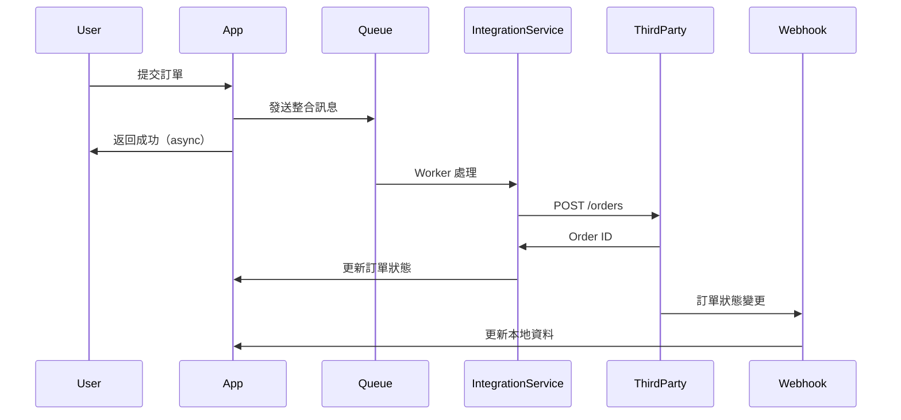

# System Integration 系統整合 SOP

**版本**: v0.09 | **最後更新**: 2026-02-12
> 📝 **關於範例連結說明**:
> 本 SOP 中部分連結（如文檔路徑、配置檔案等）為示例性質，
> 展示一般專案的文檔結構。實際使用時，請根據您的專案結構調整路徑。

## 🎯 情境概述

**適用場景**：第三方服務整合、API 對接、系統間資料交換、Legacy 系統整合

**預計時間**:
- 📋 **AISDLC 規劃階段**: 3-4 小時
  - **規劃時間** (AI 分析 + 人工確認): 3-4 小時
  - **執行時間** (依專案規模):
    - 小型專案 (單一 API 整合): 3-5 天
    - 中型專案 (2-3 個系統整合): 1-2 週
    - 大型專案 (複雜多系統整合): 2-4 週
- 🔨 **實際執行階段**: 3 天-4 週 (依專案規模而定)

> 💡 **時間估算說明**:
> - **規劃時間**指使用 AISDLC 流程進行 API 研究、整合設計、測試計畫文檔產出的時間
> - **執行時間**指實際整合開發的時間，會因 API 複雜度、系統數量而有很大差異
> - 時間估算包含人工確認和 AI 輔助分析的完整流程

**涉及角色**：Integration-Specialist, SA, SD, Dev-Developer, QA, DevOps

**最終產出**：API 研究報告 + 整合設計文件 + 認證方案 + 資料轉換規格 + 錯誤處理策略 + 測試計畫 + 監控方案

---

## 🤝 協作模式 (Phase 2: v0.09)

### 主要協作模式

#### 1. Lead-Support (主導-支援)
- **主導 Agent**: Integration-Specialist
- **支援 Agents**: SD-Architect (整合架構), QA-Tester (整合測試), Dev (實作)
- **使用階段**: API研究、整合設計、測試計畫
- **模式說明**: Integration-Specialist 主導整合分析和設計流程

#### 2. Sequential-Handoff (順序交接)
- **流程**: Integration-Specialist → 整合設計 → 🔴 → Dev → API客戶端實作 → 🔴 → QA → 整合測試
- **交接點**: 整合設計 → 實作 → 測試
- **模式說明**: 設計完成後交接給開發，開發完成後交接給測試

### 次要協作模式

#### 3. Iterative-Refinement (迭代精煉)
- **使用階段**: API 測試 → 調整 → 重測循環
- **模式說明**: 整合過程中持續測試和調整直到穩定

---

## 📋 前置準備檢查清單

> ⚠️ **重要提示**: 以下前置材料為理想狀態。若材料缺失,請參考「材料缺失應對方案」。

### 必要材料
- [ ] 目標系統 API 文檔
- [ ] 整合需求描述
- [ ] API 存取權限 (API Key/Token)
- [ ] 測試環境存取
- [ ] 整合目標和範圍

### 選擇性材料
- [ ] 目標系統範例程式碼 (SDK/Code Samples)
- [ ] Postman Collection 或 OpenAPI Spec
- [ ] 既有整合案例參考
- [ ] 資料格式範例 (JSON/XML Schema)
- [ ] SLA 和限流政策
- [ ] 技術支援聯絡方式

### 環境檢查
- [ ] 可存取目標 API (網路、防火牆)
- [ ] 測試環境已準備
- [ ] API 測試工具可用 (Postman/Insomnia)
- [ ] 日誌和監控已就緒

---

## 🔧 材料缺失應對方案

> 💡 **現實情況**: 第三方 API 整合常面臨文檔不完整、測試環境受限、認證資訊申請困難等問題。以下提供實用的替代方案。

| 缺失材料 | 影響程度 | 應對方案 | 預計額外時間 |
|---------|---------|---------|-------------|
| **API 文檔 (完整版)** | 🔴 高 | • **方案 1**: 使用逆向工程 - 瀏覽器 DevTools Network Tab 觀察實際 HTTP 請求<br>• **方案 2**: 使用 Postman/Insomnia 手動測試各端點並記錄請求/回應<br>• **方案 3**: 使用網路抓包工具 (mitmproxy/Fiddler/Charles Proxy) 攔截 HTTPS 流量分析<br>• **方案 4**: 搜尋 GitHub 非官方 SDK 或範例代碼,分析實際呼叫方式<br>• **方案 5**: 使用 Swagger Inspector 自動生成 API 文檔 | +2-6 小時 |
| **API Sandbox/測試環境** | 🔴 高 | • **方案 1**: 直接使用 Production API 進行「唯讀測試」(僅 GET 請求,不修改資料)<br>• **方案 2**: 使用 Mock Server (如 WireMock/Mockoon) 模擬第三方 API 回應<br>• **方案 3**: 錄製真實 API 回應後使用「回放模式」測試 (VCR.py/Polly.js)<br>• **方案 4**: 申請測試帳號 (聯繫技術支援/Sales),強調測試需求 | +1-3 天 |
| **API 認證資訊 (API Key/Token)** | 🔴 高 | • **方案 1**: 透過官方開發者平台申請 (通常 5 分鐘-2 天不等)<br>• **方案 2**: 聯繫客戶成功團隊或技術支援加速申請<br>• **方案 3**: 使用公司既有帳號 (詢問維運團隊或其他專案)<br>• **方案 4**: 若為內部整合,暫時使用「延遲認證」策略,先完成介面設計 | +1 小時-3 天 |
| **API 限流政策文檔** | 🟡 中 | • **方案 1**: 實測探索限流閾值 (逐步增加 QPS 直到遇到 429 錯誤)<br>• **方案 2**: 檢查 API 回應 Header (如 `X-RateLimit-Limit`, `Retry-After`)<br>• **方案 3**: 查詢官方狀態頁面或開發者論壇的討論<br>• **方案 4**: 採用保守策略 - 預設限流 10 req/sec,後續根據實際情況調整 | +1-2 小時 |
| **Webhook 簽名驗證範例** | 🟡 中 | • **方案 1**: 參考官方 SDK 原始碼中的簽名驗證邏輯<br>• **方案 2**: 搜尋 GitHub Issues/Stack Overflow 相關討論和範例<br>• **方案 3**: 先接收 Webhook 不驗證簽名 (⚠️ 僅測試環境!),記錄 Header 和 Payload 反推簽名算法<br>• **方案 4**: 聯繫技術支援索取官方範例代碼 | +0.5-2 小時 |
| **資料格式範例 (完整 Schema)** | 🟡 中 | • **方案 1**: 從官方文檔的片段範例拼湊完整 Schema<br>• **方案 2**: 使用 Postman 實測並記錄完整請求/回應<br>• **方案 3**: 使用 JSON Schema 推論工具從範例生成 Schema (如 quicktype.io)<br>• **方案 4**: 建立「發現模式」- 先實作基本欄位,遇到新欄位時補充 | +1-3 小時 |
| **錯誤碼完整清單** | 🟢 低 | • **方案 1**: 建立「錯誤碼知識庫」- 遇到時記錄並補充<br>• **方案 2**: 參考類似 API 的常見錯誤碼 (如 Stripe/Twilio)<br>• **方案 3**: 使用通用 HTTP 狀態碼策略 (4xx 客戶端錯誤不重試,5xx 伺服器錯誤可重試)<br>• **方案 4**: 實作「未知錯誤」降級處理,記錄日誌供後續分析 | +0.5-1 小時 |
| **第三方服務 SLA** | 🟢 低 | • **方案 1**: 查詢官方網站的服務條款或 SLA 頁面<br>• **方案 2**: 檢查服務提供商的狀態頁面歷史 (如 status.service.com)<br>• **方案 3**: 採用保守假設 - 假設 99% 可用性,設計容錯機制<br>• **方案 4**: 暫時跳過,後續根據實際運行情況調整 | +0.5-1 小時 |

### 完全無 API 文檔時的應急方案

若第三方系統完全沒有公開 API 文檔,建議採用「**API 逆向工程與重建 (API Reverse Engineering)**」策略:

#### 階段 1: 快速 API 探索 (2-4 小時)

**方法 A: 瀏覽器開發者工具 (適用於 Web 服務)**
```bash
# 步驟:
1. 打開目標系統的 Web 介面
2. 開啟瀏覽器 DevTools (F12) → Network Tab
3. 執行各項操作 (登入、查詢、新增、修改、刪除)
4. 記錄所有 XHR/Fetch 請求:
   - URL 和 Method (GET/POST/PUT/DELETE)
   - Request Headers (特別是 Authorization)
   - Request Body (JSON/Form Data)
   - Response Status 和 Body
5. 使用 "Copy as cURL" 功能匯出請求
```

**方法 B: 流量攔截工具 (適用於 Mobile App 或桌面應用)**
```bash
# 使用 mitmproxy (免費開源)
# 1. 安裝 mitmproxy
brew install mitmproxy  # macOS
apt install mitmproxy   # Linux

# 2. 啟動代理伺服器
mitmproxy -p 8080

# 3. 配置裝置使用代理 (127.0.0.1:8080)

# 4. 安裝 mitmproxy CA 憑證 (解密 HTTPS)
# 訪問 http://mitm.it 下載憑證

# 5. 執行應用操作,觀察流量

# 6. 匯出記錄
mitmdump -r captured.flow -w api_calls.har
```

**方法 C: SDK 原始碼分析 (如有提供)**
```bash
# 1. 下載官方 SDK (Python/JavaScript/Ruby/PHP)
# 2. 閱讀 SDK 原始碼找出 API 端點

# 範例: 分析 Python SDK
grep -r "requests.post\|requests.get" vendor/sdk/
grep -r "BASE_URL\|API_URL" vendor/sdk/

# 3. 提取 API 端點清單
# 4. 測試驗證各端點
```

#### 階段 2: API 文檔重建 (4-6 小時)

使用收集到的資訊建立內部 API 文檔:

**建議格式: OpenAPI 3.0 (Swagger)**
```yaml
openapi: 3.0.0
info:
  title: ThirdParty API (逆向工程版)
  version: 1.0.0
  description: 由實際流量分析重建的 API 文檔
servers:
  - url: https://api.thirdparty.com/v1
paths:
  /orders:
    post:
      summary: 創建訂單 (實測驗證 ✅)
      requestBody:
        content:
          application/json:
            schema:
              type: object
              required: [order_id, amount]
              properties:
                order_id:
                  type: string
                  example: "ORD-001"
                amount:
                  type: integer
                  description: "金額 (分為單位)"
                  example: 100000
      responses:
        '200':
          description: 成功
          content:
            application/json:
              schema:
                type: object
                properties:
                  id:
                    type: string
                    example: "EXT-123"
                  status:
                    type: string
                    enum: [created, confirmed, cancelled]
      security:
        - ApiKeyAuth: []
components:
  securitySchemes:
    ApiKeyAuth:
      type: apiKey
      in: header
      name: X-API-Key
```

**工具推薦**:
- **Postman**: 手動測試後自動生成 OpenAPI 文檔
- **Swagger Editor**: 編輯和驗證 OpenAPI 規格
- **Insomnia**: 支援匯出為 OpenAPI/Swagger 格式

#### 階段 3: 持續補充與驗證 (持續進行)

建立「API 文檔迭代流程」:
```
遇到新端點或欄位
    ↓
實測驗證
    ↓
更新內部文檔
    ↓
與第三方技術支援確認 (如可能)
    ↓
加入團隊知識庫
```

**⚠️ 重要注意事項**:
1. **法律風險**: 確保逆向工程不違反服務條款 (ToS)
2. **優先求助**: 逆向工程為最後手段,優先聯繫官方技術支援
3. **文檔標示**: 清楚標示哪些是「官方確認」vs「實測推測」
4. **定期驗證**: API 可能變更,需定期驗證文檔正確性

---

## 🛠️ 免費工具替代方案

> 💡 **成本考量**: API 整合與測試需要 API 設計、測試、監控、文檔管理等工具，商業方案成本高昂（Postman Teams $12-35/月/人, Stoplight $79-299/月）。以下提供功能相近的免費/開源替代方案。

### API 整合與測試工具對照表

| 工具類別 | 商業方案 | 免費/開源替代 | 功能對比 | 適用場景 |
|---------|---------|-------------|---------|---------|
| **API 設計** | Stoplight<br>SwaggerHub | **Swagger Editor**<br>**OpenAPI Generator**<br>**Redocly CLI** | 核心功能完整<br>缺少: 協作註解、版本控制 | OpenAPI 規格設計<br>API 文檔自動生成<br>Contract Testing |
| **API 測試** | Postman Teams<br>Insomnia Enterprise | **Hoppscotch**<br>**Bruno**<br>**REST Client (VS Code)** | 基本功能完整<br>缺少: 團隊協作、歷史記錄 | API 手動測試<br>請求集合管理<br>環境變數管理 |
| **自動化測試** | Postman Flows<br>Katalon | **Newman (CLI)**<br>**Dredd**<br>**Tavern** | 開源方案完整<br>CI/CD 整合方便 | API 自動化測試<br>Contract Testing<br>迴歸測試 |
| **Mock Server** | Postman Mock<br>WireMock Cloud | **WireMock (OSS)**<br>**Prism (Stoplight)**<br>**JSON Server** | 開源版功能完整<br>完全免費 | API Mock<br>開發環境隔離<br>並行開發 |
| **API 監控** | Postman Monitoring<br>Runscope | **UptimeRobot**<br>**Checkly Free**<br>**Grafana + Prometheus** | 免費額度充足<br>(UptimeRobot: 50 monitors) | API 可用性監控<br>效能監控<br>告警通知 |
| **負載測試** | BlazeMeter<br>LoadImpact | **k6**<br>**Artillery**<br>**Locust** | 開源方案強大<br>完全免費 | API 負載測試<br>效能基準測試<br>壓力測試 |
| **API Gateway** | Kong Enterprise<br>Apigee | **Kong CE**<br>**Tyk OSS**<br>**KrakenD CE** | 核心功能相同<br>缺少: 企業支援 | API 路由與轉發<br>流量控制<br>認證授權 |
| **文檔生成** | Redocly Enterprise<br>ReadMe.io | **Redoc**<br>**Swagger UI**<br>**RapiDoc** | 完全免費<br>視覺化完整 | 互動式 API 文檔<br>自動化文檔生成<br>多版本支援 |

### 推薦工具組合 (依整合複雜度)

| 整合複雜度 | API 設計 | API 測試 | Mock Server | 監控 | 負載測試 | 年度成本 |
|-----------|---------|---------|-------------|------|---------|---------|
| **簡單** (1-5 APIs) | Swagger Editor | Hoppscotch / Bruno | JSON Server | UptimeRobot Free | - | $0 |
| **中等** (5-20 APIs) | OpenAPI Generator | Newman + Dredd | Prism / WireMock | UptimeRobot + Grafana | k6 | $0 (自架) |
| **複雜** (20+ APIs) | Redocly CLI | Newman + Tavern | WireMock Cloud / Prism | Grafana + Prometheus | k6 Cloud | $500-2k/年 |

### 成本對比

| 方案 | 月度成本 (10人團隊) | 年度成本 | 工具組合 | 維護成本 |
|------|-------------------|---------|---------|---------|
| **完全免費 (雲端)** | $0 | $0 | Hoppscotch + Swagger + UptimeRobot + k6 | 低 (雲端服務) |
| **完全免費 (自架)** | $0 | $0 | Newman + WireMock + Grafana + k6 | 中 (需維護) |
| **混合方案** | $50-150 | $600-1,800 | Postman Free + Stoplight + UptimeRobot | 低-中 |
| **全商業方案** | $500-1,500 | $6k-18k | Postman Teams + Stoplight + BlazeMeter | 低 (廠商支援) |

### 各階段工具建議

#### API 設計階段
- **規格設計**: Swagger Editor / Stoplight Studio Free
- **視覺化設計**: Insomnia Designer / Postman Free
- **Contract 定義**: Pact / Spring Cloud Contract
- **Schema 驗證**: AJV / JSON Schema Validator

#### API 開發階段
- **Mock Server**: Prism / WireMock / JSON Server
- **本地測試**: Bruno / REST Client (VS Code)
- **除錯工具**: Chrome DevTools / Postman Console
- **程式碼生成**: OpenAPI Generator / Swagger Codegen

#### API 測試階段
- **手動測試**: Hoppscotch / Bruno / Postman Free
- **自動化測試**: Newman / Dredd / Tavern / Karate
- **Contract Testing**: Pact / Spring Cloud Contract
- **Schema 驗證**: AJV / Spectral (OpenAPI Linter)

#### API 部署階段
- **API Gateway**: Kong CE / Tyk OSS / KrakenD CE
- **流量管理**: Nginx / Envoy Proxy
- **認證授權**: Keycloak / Auth0 Free / OAuth2 Proxy
- **速率限制**: Kong Rate Limiting / Nginx limit_req

#### API 監控階段
- **可用性監控**: UptimeRobot / Checkly Free / Pingdom Free
- **效能監控**: Grafana + Prometheus / New Relic Free
- **日誌分析**: ELK Stack / Loki + Grafana
- **錯誤追蹤**: Sentry Free / Rollbar Free

#### API 文檔階段
- **互動文檔**: Redoc / Swagger UI / RapiDoc
- **變更紀錄**: Conventional Commits / API Changelog
- **版本管理**: Git Tags / Semantic Versioning
- **協作平台**: GitBook Free / Docusaurus

---

## 🔒 CI/CD 安全基線與增強掃描（強制前置）

> **⚠️ CRITICAL**: 開始系統整合前，必須確認 CI/CD Pipeline 已配置以下安全層級。
> **Integration 情境安全等級: Advanced** (L0 + L1 + SAST + Container Scan)

### Layer 0: Security Baseline（強制）

所有 PR 必須通過以下檢查：

| 檢查項 | 工具 | 阻塞等級 |
|--------|------|---------|
| Secret Detection | TruffleHog / gitleaks | 🔴 永遠阻塞 |
| Dependency Scan (SCA) | Trivy / npm audit | 🔴 Critical/High 阻塞 |
| License Compliance | license-checker | ⚠️ GPL-3.0/AGPL 阻塞 |

📖 **配置範本**: [Layer0_Security_Baseline_Template.md](../../docs_template/scenario_specific/devops/Layer0_Security_Baseline_Template.md)

### Layer 1: Build & Verify（強制）

| 關卡 | 目的 | 阻塞等級 |
|------|------|---------|
| Lint + Format | 程式碼風格一致性 | 🔴 失敗阻塞 |
| Compile / Build | 編譯成功 | 🔴 失敗阻塞 |
| Unit Test + Coverage | 覆蓋率 ≥ 80% | 🔴 失敗阻塞 |

📖 **配置範本**: [Layer1_Build_Verify_Template.md](../../docs_template/scenario_specific/devops/Layer1_Build_Verify_Template.md)

### 增強安全掃描: SAST + Container Scan（Advanced 等級）

第三方 API 整合涉及外部資料流，需要更深層安全掃描防護。

| 掃描類型 | 工具 | 阻塞策略 | 說明 |
|---------|------|---------|------|
| **SAST** | Semgrep / CodeQL | 🔴 Critical/High 阻塞 | 程式碼漏洞靜態分析 |
| **Container Scan** | Trivy / Grype | 🔴 Critical/High 阻塞 | 有 Docker 時啟用 |
| **DAST** | OWASP ZAP | ⚠️ 選配 | 整合 API 端點動態測試 |

📖 **配置範本**: [Security_Scan_Integration_Template.md](../../docs_template/scenario_specific/devops/Security_Scan_Integration_Template.md)

- [ ] Layer 0 Security Baseline 已配置
- [ ] Layer 1 Build & Verify 已配置
- [ ] SAST 掃描已配置
- [ ] Container Scan 已配置（有 Docker 時）

### 📝 Documentation Pipeline（⚠️ 選配）

> Integration 情境可選配 Doc Lint + Link Check，確保 API 文檔品質。

📖 **配置範本**: [Documentation_Pipeline_Template.md](../../docs_template/scenario_specific/devops/Documentation_Pipeline_Template.md)
🔧 **建置流程**: [devops-setup-flow 步驟 0.9](../../workflow/scenario-specific/devops-setup-flow.md)

### 🔔 Event-Driven Agent Notification（🔴 強制）

> PR 事件通知 + 部署通知為強制。情境專屬觸發：contract-test 結果通知。

📖 **配置範本**: [Event_Driven_Agent_Notification_Template.md](../../docs_template/scenario_specific/devops/Event_Driven_Agent_Notification_Template.md)
🔧 **建置流程**: [devops-setup-flow 步驟 0.10](../../workflow/scenario-specific/devops-setup-flow.md)

---

## 🔗 Skills 整合對照表

> 💡 **說明**: 以下列出各階段可觸發的 Claude Code Skills（斜線指令），協助加速整合開發。

| SOP 階段 | 可觸發 Skill | 用途說明 |
|---------|-------------|---------|
| 階段 1：啟動 | `/sa-analyst` | SA 主導整合需求分析、系統邊界定義 |
| 階段 2：API 研究 | `/sa-analyst`、`/documentation-api` | 整合需求 FRD、API 文檔生成與 OpenAPI 規格整理 |
| 階段 3：整合架構 | `/sd-architect`、`/integration-api-client` | 架構設計（含規範模型/Gateway）、API 客戶端生成 |
| 階段 4：認證授權 | `/integration-oauth`、`/security-audit` | OAuth 2.0 / SSO 整合、跨系統安全審查 |
| 階段 5：資料映射 | `/integration-database`、`/integration-redis` | 資料庫整合（含 CDC/Outbox Pattern）、快取策略 |
| 階段 6：測試策略 | `/qa-testing`、`/testing-strategy` | 測試計畫、Contract Testing、整合測試設計 |
| 階段 7：監控告警 | `/devops-monitoring` | Prometheus/Grafana 監控、跨系統分散式追蹤 |
| 跨系統整合 | `/integration-webhook`、`/integration-api-client` | Webhook 處理、跨語言 API 客戶端（Python/Java/TS） |
| 行動端整合 | `/mobile-development` | Android/macOS 整合開發、掃碼 SDK 整合 |
| 支付整合 | `/integration-stripe` | Stripe 支付 API 整合 |

---

## 🚀 完整執行流程

### 階段 1：啟動和情境確認 (20 分鐘)

#### 步驟 1.1：載入 AISDLC 框架
```
執行指令：
「請載入 AISDLC_INIT.md (v0.09)，我要進行系統整合」

或具體說明：
「請載入 AISDLC_INIT.md，需要整合 Stripe 支付 API」
「請載入 AISDLC_INIT.md，對接 Salesforce CRM 系統」
「請載入 AISDLC_INIT.md，整合第三方物流 API」
```

#### 步驟 1.2：回答情境識別問題
系統會詢問：
- 整合類型 (RESTful API/SOAP/GraphQL/Message Queue)
- 整合方向 (單向/雙向同步)
- 資料量級 (低/中/高頻率)
- 即時性需求 (即時/準即時/批次)
- 關鍵性程度 (關鍵/重要/一般)

#### 步驟 1.3：確認載入結果
期待回應：
```
✅ 識別情境：System Integration (系統整合)
✅ 識別整合類型：[您的整合類型]
✅ 載入 Agents：Integration-Specialist, SA, SD, Dev-Developer, QA, DevOps
✅ 推薦 Workflow：integration-analysis-flow
準備開始 API 研究...
```

---

### 階段 2：API 研究與理解 (40-60 分鐘)

#### 步驟 2.0：系統邊界與 System of Record 識別 (SA + Integration-Specialist) 🆕

> **⚠️ 重要前置步驟**：多系統整合前必須先釐清每個資料實體的「主系統」，避免資料衝突。

**識別 System of Record (SoR)**：

| 資料實體 | 主系統 (SoR) | 消費方系統 | 同步方向 | 衝突解決策略 |
|--------|------------|----------|---------|------------|
| 訂單 | 電商平台 | ERP | 單向 → | ERP 只讀 |
| 庫存 | ERP | 電商平台 | 單向 ← | 電商顯示快取 |
| 客戶資料 | CRM | 兩系統共用 | 雙向 | Last-Write-Wins + 時間戳 |
| 商品主檔 | ERP | 電商平台 | 單向 ← | 電商不可修改商品定義 |

**多領域整合時的邊界確認清單**：
- [ ] 每個資料實體只有一個 SoR（不允許雙 SoR）
- [ ] 跨領域資料衝突的仲裁規則已定義（時間戳/版本號/業務規則）
- [ ] 各系統的資料模型差異已識別（欄位命名/型別/業務含義）
- [ ] 整合後的資料一致性等級已定義（強一致/最終一致）

> **產出文件**：`docs/02_architecture/System_of_Record_Map.md`

#### 步驟 2.1：提供整合資訊
```
執行指令：
「開始 API 整合研究，目標是：
- 目標系統：[系統名稱]
- API 文檔：[URL 或上傳文檔]
- 整合需求：[具體描述]
- 關鍵功能：[需要整合的功能]」
```

#### 步驟 2.2：API 文檔深度分析 (Integration-Specialist)

> ⚠️ **API 文檔不完整或缺失時的應對策略**
>
> 現實中許多第三方 API 文檔不完整、過時或缺失。遇到此情況，可採用以下策略：
>
> **1. 逆向工程 API (Reverse Engineering)**:
> - 使用瀏覽器 DevTools Network Tab 觀察實際 HTTP 請求
> - 使用 Postman/Insomnia 手動測試各端點
> - 使用 mitmproxy/Fiddler 攔截和分析 HTTPS 流量
> - 分析 SDK 原始碼（如有提供）
>
> **2. API 探索與測試工具**:
> - **Postman Collection Runner**: 批次測試多個端點
> - **HTTP Toolkit**: 可視化流量分析工具
> - **Charles Proxy**: Mobile App API 探索利器
> - **Swagger Inspector**: 自動生成 API 文檔
>
> **3. 社群資源與外部協助**:
> - 搜尋 GitHub 上的非官方 SDK 或範例
> - Stack Overflow 相關討論和實作經驗
> - 第三方開發者論壇或社群
> - Reddit/Discord 技術社群求助
>
> **4. 文檔重建 (如必要)**:
> - 記錄實測結果建立內部 API 文檔
> - 使用 OpenAPI/Swagger 格式整理
> - 與第三方技術支援團隊確認理解
> - 建立團隊知識庫避免重複探索
>
> **5. 聯繫技術支援**:
> - 向 API 提供商索取最新文檔
> - 申請 Developer Portal 存取權限
> - 預約技術諮詢會議
> - 加入官方開發者 Slack/Discord

**API 基本資訊**：
- **API 類型**：RESTful / SOAP / GraphQL / gRPC / WebSocket
- **版本**：當前版本、穩定性、棄用計畫
- **Base URL**：Production、Staging、Sandbox 環境
- **協議**：HTTP/HTTPS、WebSocket
- **資料格式**：JSON / XML / Protocol Buffers

> **⚠️ API 版本監控機制 (API Version Monitoring)**
>
> 第三方 API 可能隨時變更或棄用版本,需建立監控機制避免突然故障:
>
> **1. API Deprecation 追蹤**:
> - **訂閱官方通知**: 官方 Newsletter、Developer Blog、RSS Feed
> - **監控 API Response Headers**:
>   ```javascript
>   // 檢查棄用警告 Header
>   const deprecationHeader = response.headers.get("Deprecation");
>   const sunsetHeader = response.headers.get("Sunset"); // RFC 8594
>   
>   if (deprecationHeader) {
>     logger.warn(`API Deprecated: ${deprecationHeader}`);
>     // 觸發告警通知團隊
>     alerting.send("api-deprecation", { endpoint, sunsetDate: sunsetHeader });
>   }
>   ```
> - **定期版本檢查**: 每週自動檢查 API 版本號變化
>
> **2. API 變更通知訂閱**:
> ```yaml
> # 常見 API 變更通知來源
> notification_sources:
>   - name: "Stripe API Changelog"
>     url: "https://stripe.com/docs/upgrades"
>     method: RSS
>   
>   - name: "GitHub API Changelog"
>     url: "https://github.blog/changelog/label/api"
>     method: RSS
>   
>   - name: "Slack API Changelog"
>     url: "https://api.slack.com/changelog"
>     method: Manual Check (weekly)
>   
>   - name: "Twilio API Updates"
>     url: "https://www.twilio.com/changelog"
>     method: Email Subscription
> ```
>
> **3. 版本升級處理流程**:
> ```
> API 版本變更通知收到
> │
> ├─ 評估影響範圍 (1-2 天)
> │  ├─ 閱讀 Changelog 和 Migration Guide
> │  ├─ 識別 Breaking Changes
> │  └─ 評估升級工作量
> │
> ├─ 規劃升級策略 (1 天)
> │  ├─ 決定升級時程 (立即 / 計畫中 / 延後)
> │  ├─ 建立升級任務清單
> │  └─ 評估回滾方案
> │
> ├─ 執行升級 (3-5 天)
> │  ├─ 在 Sandbox 環境測試新版本
> │  ├─ 更新程式碼和測試
> │  ├─ Code Review 和 QA 測試
> │  └─ Production 部署 (藍綠/金絲雀)
> │
> └─ 監控與驗證 (1-2 週)
>    ├─ 監控錯誤率和效能
>    ├─ 檢查日誌異常
>    └─ 收集用戶反饋
> ```
>
> **4. 版本鎖定策略**:
> ```javascript
> // 方案 A: URL 路徑鎖定版本
> const baseURL = "https://api.example.com/v2"; // 明確指定 v2
>
> // 方案 B: Header 鎖定版本
> axios.defaults.headers.common["API-Version"] = "2023-10-01";
>
> // 方案 C: SDK 版本鎖定
> // package.json
> {
>   "dependencies": {
>     "stripe": "12.18.0" // 鎖定版本,不使用 ^12.18.0
>   }
> }
> ```
>
> **5. 第三方 API 版本升級決策矩陣**:
>
> | 情況 | 升級時機 | 行動 |
> |------|---------|------|
> | **Sunset 日期 < 30 天** | 🔴 立即 | 優先處理，排入當前 Sprint |
> | **安全性漏洞修復** | 🔴 立即 | 24 小時內評估，72 小時內部署 |
> | **Breaking Changes + 有新功能需求** | 🟡 計畫中 | 排入下個 Sprint |
> | **僅 Minor 更新** | 🟢 延後 | 季度維護時一併處理 |
> | **無棄用警告 + 運作正常** | ⚪ 不升級 | 持續監控，無需行動 |
>
> **版本鎖定最佳實踐**:
> - ✅ 使用精確版本號（`12.18.0`）而非範圍（`^12.18.0`）
> - ✅ 建立 `package-lock.json` / `yarn.lock` 並納入版控
> - ✅ 定期（每季）審查並更新依賴版本
> - ✅ 設定 Dependabot/Renovate 自動檢查更新
>
> **5. 自動化監控範例**:
> ```javascript
> // scripts/check-api-version.js
> const axios = require("axios");
> const { sendAlert } = require("./alerting");
> 
> async function checkAPIVersion() {
>   try {
>     const response = await axios.get("https://api.example.com/version");
>     const currentVersion = response.data.version;
>     const expectedVersion = process.env.EXPECTED_API_VERSION;
>     
>     if (currentVersion !== expectedVersion) {
>       sendAlert({
>         title: "API Version Changed",
>         message: `API version changed from ${expectedVersion} to ${currentVersion}`,
>         severity: "warning"
>       });
>     }
>   } catch (error) {
>     sendAlert({
>       title: "API Version Check Failed",
>       message: error.message,
>       severity: "error"
>     });
>   }
> }
> 
> // 每日執行
> // crontab: 0 9 * * * node /path/to/check-api-version.js
> ```

- **資料格式**：JSON / XML / Protocol Buffers

**認證機制分析**：
- **API Key**：Header / Query Parameter
- **OAuth 2.0**：Authorization Code / Client Credentials / Implicit
- **JWT (JSON Web Token)**：簽發、驗證、更新機制
- **Basic Auth**：Username/Password
- **其他**：HMAC Signature、mTLS (Mutual TLS)

**端點清單與功能**：
```markdown
# 範例：Stripe API 端點分析

## Payment Intent API
- POST /v1/payment_intents
  - 用途：創建支付意圖
  - 必要參數：amount, currency
  - 選擇性參數：customer, payment_method
  - 回應：PaymentIntent 物件

- GET /v1/payment_intents/:id
  - 用途：查詢支付狀態
  - 參數：payment_intent_id
  - 回應：PaymentIntent 物件

- POST /v1/payment_intents/:id/confirm
  - 用途：確認支付
  - 參數：payment_method
  - 回應：PaymentIntent 物件
```

**限流政策 (Rate Limiting)**：
- 每秒請求數限制 (RPS)
- 每日 quota 限制
- 限流演算法 (Token Bucket / Leaky Bucket)
- 限流回應 (429 Too Many Requests)
- Retry-After header

**錯誤處理機制**：
```json
{
  "error": {
    "code": "payment_intent_unexpected_state",
    "message": "The payment intent status must be 'requires_confirmation' to confirm",
    "type": "invalid_request_error",
    "param": "payment_intent"
  }
}
```

- 錯誤碼分類
- 可重試錯誤 vs 永久錯誤
- 錯誤訊息格式
- 錯誤處理最佳實踐

**Webhook / Callback 機制**：
- Webhook 端點註冊
- Event 類型
- 簽名驗證 (Signature Verification)
- 冪等性處理
- Retry 策略

**資料模型與 Schema**：
- 關鍵資料物件結構
- 必要欄位 vs 選擇性欄位
- 資料類型和格式
- 列舉值 (Enums)
- 嵌套物件結構

#### 步驟 2.3：功能可行性評估

**功能對應檢查**：
| 我方需求 | 目標 API 功能 | 可行性 | 備註 |
|---------|--------------|--------|------|
| 創建訂單 | POST /orders | ✅ 支援 | 直接對應 |
| 查詢訂單狀態 | GET /orders/:id | ✅ 支援 | 直接對應 |
| 批次查詢 | - | ❌ 不支援 | 需多次呼叫 |
| 訂單取消 | POST /orders/:id/cancel | ⚠️ 部分支援 | 僅限特定狀態 |

**資料對應分析**：
```
我方欄位 → API 欄位對應

Order.customerName → order.customer.name ✅
Order.phoneNumber  → order.customer.phone ✅
Order.deliveryDate → order.shipping.estimated_delivery ⚠️ 格式轉換
Order.internalId   → order.metadata.custom_id ⚠️ 需放 metadata
Order.promocode    → ❌ API 不支援促銷碼
```

**限制與約束識別**：
- API 功能限制
- 資料欄位長度限制
- 支援的資料類型
- 業務規則限制
- 地理區域限制
- 語言支援

#### 步驟 2.4：API 研究確認點 (15 分鐘)

> 🔴 **人機協作點：API 研究確認**
>
> **AI 提供**：
> - API 能力矩陣（支援的功能清單、不支援的功能、需要 workaround 的功能）
> - 認證方案建議（推薦的認證方式、安全性考量、Token 管理策略）
> - 限流與配額（限流政策摘要、配額使用規劃、限流應對策略）
> - 潛在風險與挑戰（技術風險、資料相容性問題、效能風險、依賴風險）
>
> **需人工確認**：
> - ✅ API 理解是否正確
> - ✅ 功能對應是否完整
> - ✅ 限制是否可接受
> - ✅ 風險是否可控
>
> **產出文件**：
> - API 研究報告 (API Research Report)
> - 功能對應矩陣 (Feature Mapping Matrix)
> - 限制與約束清單 (Limitations & Constraints)

---

### 階段 3：整合架構設計 (1-1.5 小時)

#### 步驟 3.1：觸發整合設計
```
執行指令：
「基於 API 研究，請設計整合架構方案」
```

#### 步驟 3.2：整合架構設計 (SD + Integration-Specialist)

**整合模式選擇**：

**模式 A：直接呼叫 (Direct Call)**
```
[我方應用] ──HTTP Request──> [第三方 API]
           <──HTTP Response──
```
- **適用**：即時同步、低延遲需求
- **優點**：簡單直接、即時回應
- **缺點**：緊耦合、依賴對方可用性

**模式 B：非同步佇列 (Async Queue)**
```
[我方應用] ──Enqueue──> [Message Queue] ──Worker──> [第三方 API]
```
- **適用**：允許延遲、高可靠性需求
- **優點**：解耦、可重試、流量控制
- **缺點**：複雜度增加、非即時

**模式 C：API Gateway 代理**
```
[我方應用] ──> [API Gateway] ──> [第三方 API]
                    │
                    ├─ Rate Limiting
                    ├─ Caching
                    ├─ Authentication
                    └─ Logging
```
- **適用**：多個系統整合、需要集中管理
- **優點**：統一入口、易於監控
- **缺點**：額外基礎設施

**模式 D：雙向同步 (Bidirectional Sync)**
```
[我方系統] <──Webhook──> [第三方系統]
           ──API Call──>
```
- **適用**：雙向資料同步
- **優點**：即時通知、雙向更新
- **缺點**：複雜度高、衝突解決

**模式 E-1：WebSocket 即時整合** 🆕 (v0.09 新增)
```
[Client] <══WebSocket══> [Server] <══WebSocket══> [第三方即時服務]
         雙向持續連線            雙向持續連線
```
- **適用**：即時聊天、即時通知、協作編輯、即時報價
- **優點**：超低延遲（< 100ms）、真正雙向通訊、減少 HTTP 開銷
- **缺點**：連線管理複雜、需處理斷線重連、伺服器資源消耗高

**WebSocket 整合設計要點**：

| 設計面向 | 建議做法 | 注意事項 |
|---------|---------|---------|
| **連線管理** | 心跳機制 (30-60秒) | 檢測死連線 |
| **斷線重連** | 指數退避 + 最大重試 | 避免雪崩效應 |
| **訊息格式** | JSON + 類型欄位 | 統一解析邏輯 |
| **認證方式** | 連線時 Token 驗證 | 支援 Token 刷新 |
| **擴展性** | Redis Pub/Sub 廣播 | 多節點同步 |

**WebSocket 錯誤處理**：
```javascript
// 斷線重連範例
const reconnect = (attempt = 1) => {
  const delay = Math.min(1000 * Math.pow(2, attempt), 30000);
  setTimeout(() => {
    ws = new WebSocket(url);
    ws.onerror = () => reconnect(attempt + 1);
  }, delay);
};
```

---

**模式 E-2：Server-Sent Events (SSE) 整合** 🆕 (v0.09 新增)
```
[Client] ←────SSE────── [Server] ←──Webhook/Poll──→ [第三方系統]
         單向持續連線
```
- **適用**：即時通知、即時更新、股票報價、進度追蹤
- **優點**：實作簡單、HTTP 相容、自動重連、瀏覽器原生支援
- **缺點**：單向通訊、連線數限制（瀏覽器 6 個）、不支援二進位

**SSE vs WebSocket 選擇矩陣**：

| 需求 | SSE | WebSocket | 建議 |
|-----|-----|-----------|------|
| **單向推送** | ✅ 優先 | ✅ 可用 | SSE |
| **雙向通訊** | ❌ 不支援 | ✅ 原生支援 | WebSocket |
| **瀏覽器相容** | ✅ 原生 (除 IE) | ✅ 原生 | 兩者皆可 |
| **實作複雜度** | ⭐ 低 | ⭐⭐⭐ 高 | 依需求 |
| **防火牆穿透** | ✅ HTTP 友善 | ⚠️ 可能被阻擋 | SSE |
| **二進位資料** | ❌ 不支援 | ✅ 支援 | WebSocket |

**SSE 實作範例**：
```javascript
// Server (Node.js)
app.get('/events', (req, res) => {
  res.setHeader('Content-Type', 'text/event-stream');
  res.setHeader('Cache-Control', 'no-cache');
  res.setHeader('Connection', 'keep-alive');

  const sendEvent = (data) => {
    res.write(`data: ${JSON.stringify(data)}\n\n`);
  };

  // 訂閱事件源...
});

// Client
const eventSource = new EventSource('/events');
eventSource.onmessage = (event) => {
  const data = JSON.parse(event.data);
  // 處理即時更新...
};
```

**即時整合技術選型決策樹**：
```
需要雙向通訊？
├─ 是 → WebSocket
└─ 否 → 需要二進位資料？
         ├─ 是 → WebSocket
         └─ 否 → 防火牆限制嚴格？
                  ├─ 是 → SSE (HTTP 友善)
                  └─ 否 → 看團隊熟悉度
```

---

**模式 F：批次整合 (Batch Integration)**
```
[我方系統] ──Scheduled Job──> [Batch Processor] ──Bulk API──> [第三方]
```
- **適用**：大量資料、非即時需求
- **優點**：高效率、減少 API 呼叫
- **缺點**：延遲高、錯誤處理複雜

#### 步驟 3.3：資料流設計

**資料流向圖**：


**關鍵設計決策**：
- 同步 vs 非同步
- Push vs Pull
- 即時 vs 批次
- 快取策略
- 重試機制
- 冪等性設計

#### 步驟 3.4：錯誤處理與容錯設計

**錯誤分類**：
```
4xx 客戶端錯誤
├─ 400 Bad Request → 資料驗證失敗，記錄並告警
├─ 401 Unauthorized → Token 過期，重新認證
├─ 403 Forbidden → 權限不足，記錄並告警
├─ 404 Not Found → 資源不存在，檢查資料一致性
├─ 409 Conflict → 資料衝突，衝突解決邏輯
└─ 429 Too Many Requests → 限流，退避重試

5xx 伺服器錯誤
├─ 500 Internal Server Error → 可重試
├─ 502 Bad Gateway → 可重試
├─ 503 Service Unavailable → 可重試，降級處理
└─ 504 Gateway Timeout → 可重試，增加 timeout
```

**重試策略**：
```javascript
// 指數退避重試 (Exponential Backoff)
const retryConfig = {
  maxRetries: 3,
  baseDelay: 1000,  // 1 秒
  maxDelay: 30000,  // 30 秒
  backoffMultiplier: 2,
  retryableErrors: [500, 502, 503, 504, 'ETIMEDOUT', 'ECONNRESET']
};

// 重試邏輯
async function callAPIWithRetry(apiCall, retries = 0) {
  try {
    return await apiCall();
  } catch (error) {
    if (shouldRetry(error) && retries < maxRetries) {
      const delay = Math.min(
        baseDelay * Math.pow(backoffMultiplier, retries),
        maxDelay
      );
      await sleep(delay);
      return callAPIWithRetry(apiCall, retries + 1);
    }
    throw error;
  }
}
```

**降級策略**：
- **Fallback 機制**：第三方不可用時的備用方案
- **熔斷器 (Circuit Breaker)**：失敗率過高時自動熔斷
- **限流保護**：保護我方系統不被拖垮
- **優雅降級**：部分功能不可用，核心功能正常

**冪等性設計**：
```javascript
// 使用 Idempotency Key 確保冪等性
const createOrder = async (orderData) => {
  const idempotencyKey = generateUUID(orderData);

  return await fetch('https://api.example.com/orders', {
    method: 'POST',
    headers: {
      'Idempotency-Key': idempotencyKey,
      'Authorization': `Bearer ${token}`
    },
    body: JSON.stringify(orderData)
  });
};
```

#### 步驟 3.5：整合設計確認點 (20 分鐘)

> 🔴 **人機協作點：整合設計確認**
>
> **AI 提供**：
> - 整合架構圖（完整的整合流程視覺化、各組件職責和互動、資料流向）
> - 整合模式選擇（推薦的整合模式和理由、替代方案對比、權衡考量）
> - 錯誤處理策略（完整的錯誤處理流程、重試和降級機制、告警和監控）
> - 安全性設計（認證和授權、資料加密、敏感資訊處理）
>
> **需人工確認**：
> - ✅ 架構設計是否合理
> - ✅ 整合模式是否合適
> - ✅ 錯誤處理是否充分
> - ✅ 安全性是否足夠
>
> **產出文件**：
> - 整合架構設計文件 (Integration Architecture Design)
> - 資料流程圖 (Data Flow Diagram)
> - 錯誤處理策略 (Error Handling Strategy)
> - 安全設計文件 (Security Design)

---

### 🆕 階段 3.A：異質技術棧整合設計 (SD + Integration-Specialist)

> **適用情境**：當整合雙方使用不同語言/框架時（如 Python FastAPI ↔ Spring Boot，Vue 3 ↔ React/Next.js）

#### 異質技術棧整合模式

**模式 1：API Gateway 統一入口（推薦）**
```
[Vue 3 前端]  [React/Next.js 前端]
      ↓               ↓
  [API Gateway (Kong/Nginx)] ← 統一入口、認證、限流
      ↓               ↓
[Python FastAPI]  [Spring Boot]
      ↓               ↓
[PostgreSQL A]   [PostgreSQL B]
```
- **優點**：前端不感知後端技術差異、集中管理認證/限流/日誌
- **適用**：多前端對接多後端的複雜整合

**模式 2：BFF (Backend for Frontend)**
```
[Vue 3 前端] → [BFF-Python] → [Python API + Spring Boot API]
[React 前端] → [BFF-Node.js] → [Python API + Spring Boot API]
```
- **優點**：各前端有獨立的整合層，減少前端複雜度
- **適用**：前端技術棧差異大，各有獨立需求

**模式 3：Event-Driven 解耦**
```
[Python API] → [Message Queue (RabbitMQ/Kafka)] → [Spring Boot Consumer]
[Spring Boot] → [Message Queue] → [Python API Consumer]
```
- **優點**：完全解耦、非同步、高可靠性
- **適用**：非即時同步、高吞吐量場景

#### 跨語言 API 客戶端生成

```bash
# 從 OpenAPI Spec 生成各語言客戶端
# Python 客戶端（給 Spring Boot 呼叫 Python API）
openapi-generator generate -i python-api-spec.yaml -g python -o ./clients/python-client

# TypeScript 客戶端（Vue 3 / React 前端使用）
openapi-generator generate -i erp-api-spec.yaml -g typescript-axios -o ./clients/ts-client

# Java 客戶端（Spring Boot 呼叫外部 API）
openapi-generator generate -i external-api-spec.yaml -g java -o ./clients/java-client
```

---

### 🆕 階段 3.B：規範資料模型設計 (Canonical Data Model) (SA + SD)

> **適用情境**：多領域系統整合（電商 + 民宿 + 內容 + 知識管理 → ERP）

#### 規範資料模型設計步驟

**Step 1：識別跨系統共用實體**
```
電商系統：Order, Product, Customer, Payment
民宿系統：Booking, Room, Guest, Rate
內容系統：Article, Category, Author, Tag
知識系統：Document, Course, User, Permission
ERP系統：SalesOrder, Inventory, Party, PriceList
```

**Step 2：建立 Canonical Model（規範映射）**

```yaml
# Canonical Customer Model
canonical_customer:
  id: string (UUID)               # 全局唯一 ID
  source_system: enum             # 來源系統標識
  external_ids:                   # 各系統原生 ID
    ecommerce_id: string
    booking_id: string
    erp_party_id: string
  name: string
  email: string
  phone: string (E.164 格式)
  created_at: ISO8601
  updated_at: ISO8601

# 映射規則示例
mapping_rules:
  ecommerce_customer → canonical:
    customer.name: "{{firstName}} {{lastName}}"
    customer.phone: formatE164(phone, 'TW')
  erp_party → canonical:
    party.party_name: name
    party.contact_phone: phone
```

**Step 3：Canonical Model 驗證清單**
- [ ] 所有系統的同等概念已映射到同一個 Canonical 欄位
- [ ] 資料類型統一（日期格式、電話格式、貨幣格式）
- [ ] 必填欄位在所有來源系統都有對應值
- [ ] 空值/預設值策略已定義

> **產出文件**：`docs/02_architecture/Canonical_Data_Model.md`

---

### 階段 4：認證與授權實作 (30-40 分鐘)

#### 步驟 4.1：觸發認證設計
```
執行指令：
「請設計認證和授權實作方案」
```

#### 步驟 4.2：認證方案實作 (Dev-Developer + Integration-Specialist)

**方案 A：API Key 認證**
```javascript
// 簡單但需安全存儲
const apiKey = process.env.THIRD_PARTY_API_KEY;

const response = await fetch('https://api.example.com/endpoint', {
  headers: {
    'X-API-Key': apiKey
  }
});
```

**安全實踐**：
- API Key 存儲在環境變數
- 使用 Secrets Manager (AWS Secrets, HashiCorp Vault)
- 定期輪換 API Key
- 不要 hardcode 在代碼中

**方案 B：OAuth 2.0 (Client Credentials Flow)**
```javascript
// 適用於 Server-to-Server
class OAuthTokenManager {
  constructor(clientId, clientSecret, tokenUrl) {
    this.clientId = clientId;
    this.clientSecret = clientSecret;
    this.tokenUrl = tokenUrl;
    this.accessToken = null;
    this.expiresAt = null;
  }

  async getAccessToken() {
    // 檢查 token 是否有效
    if (this.accessToken && this.expiresAt > Date.now()) {
      return this.accessToken;
    }

    // 請求新 token
    const response = await fetch(this.tokenUrl, {
      method: 'POST',
      headers: {
        'Content-Type': 'application/x-www-form-urlencoded'
      },
      body: new URLSearchParams({
        grant_type: 'client_credentials',
        client_id: this.clientId,
        client_secret: this.clientSecret
      })
    });

    const data = await response.json();
    this.accessToken = data.access_token;
    this.expiresAt = Date.now() + (data.expires_in - 60) * 1000; // 提前 60 秒更新

    return this.accessToken;
  }

  async callAPI(url, options = {}) {
    const token = await this.getAccessToken();
    return fetch(url, {
      ...options,
      headers: {
        ...options.headers,
        'Authorization': `Bearer ${token}`
      }
    });
  }
}
```

**方案 C：JWT (JSON Web Token)**
```javascript
// 適用於需要自行簽發 token 的場景
const jwt = require('jsonwebtoken');

// 簽發 JWT
const token = jwt.sign(
  {
    sub: userId,
    iat: Math.floor(Date.now() / 1000),
    exp: Math.floor(Date.now() / 1000) + (60 * 60) // 1 小時過期
  },
  privateKey,
  { algorithm: 'RS256' }
);

// 驗證 JWT
const decoded = jwt.verify(token, publicKey, {
  algorithms: ['RS256']
});
```

**方案 D：HMAC 簽名**
```javascript
// 適用於需要驗證請求完整性的場景
const crypto = require('crypto');

function signRequest(method, path, body, secretKey) {
  const timestamp = Date.now();
  const payload = `${method}|${path}|${timestamp}|${JSON.stringify(body)}`;

  const signature = crypto
    .createHmac('sha256', secretKey)
    .update(payload)
    .digest('hex');

  return {
    timestamp,
    signature
  };
}

// 呼叫 API
const { timestamp, signature } = signRequest('POST', '/orders', orderData, secretKey);

await fetch('https://api.example.com/orders', {
  method: 'POST',
  headers: {
    'X-Timestamp': timestamp,
    'X-Signature': signature
  },
  body: JSON.stringify(orderData)
});
```

#### 步驟 4.3：Webhook 認證設計

**Webhook 簽名驗證**：
```javascript
// Stripe-style webhook 簽名驗證
function verifyWebhookSignature(payload, signature, secret) {
  const expectedSignature = crypto
    .createHmac('sha256', secret)
    .update(payload)
    .digest('hex');

  return crypto.timingSafeEqual(
    Buffer.from(signature),
    Buffer.from(expectedSignature)
  );
}

// Express middleware
app.post('/webhooks/stripe', express.raw({ type: 'application/json' }), (req, res) => {
  const signature = req.headers['stripe-signature'];
  const payload = req.body;

  if (!verifyWebhookSignature(payload, signature, webhookSecret)) {
    return res.status(401).send('Invalid signature');
  }

  // 處理 webhook
  handleWebhook(JSON.parse(payload));
  res.status(200).send('OK');
});
```

**Webhook 安全最佳實踐**：
- 驗證簽名（防止偽造）
- 檢查 timestamp（防止重放攻擊）
- 冪等性處理（防止重複處理）
- IP 白名單（額外保護層）
- HTTPS only

#### 步驟 4.4：認證方案確認點 (10 分鐘)

> 🔴 **人機協作點：認證方案確認**
>
> **AI 提供**：
> - 認證方案程式碼範例
> - Token 管理策略
> - 安全性檢查清單
> - Webhook 驗證實作
>
> **需人工確認**：
> - ✅ 認證方式是否符合安全要求
> - ✅ Token 管理策略是否可行
> - ✅ Webhook 驗證機制是否完善
>
> **產出文件**：
> - 認證實作指南 (Authentication Implementation Guide)
> - Token 管理策略 (Token Management Strategy)
> - Webhook 安全設計 (Webhook Security Design)

---

### 🆕 階段 4.A：跨系統統一認證設計 (SSO/Federation) (Security-Engineer + SD)

> **適用情境**：整合異質技術棧系統且需要統一用戶身份（如 Vue 3 + Python API 與 React + Spring Boot 共用同一用戶系統）

#### 跨系統認證架構選型

**方案 A：JWT Token Federation（推薦輕量方案）**
```
用戶登入任一系統
    ↓
發行包含系統識別的 JWT
    ↓
其他系統驗證 JWT 簽名（共享 Public Key）
    ↓
提取 claims 完成授權
```
```yaml
# JWT Payload 設計（跨系統識別）
{
  "sub": "user-uuid-global",      # 全局唯一用戶 ID
  "systems": ["ecommerce", "erp"], # 有權限的系統列表
  "roles": {
    "ecommerce": "buyer",
    "erp": "warehouse_staff"
  },
  "iat": 1700000000,
  "exp": 1700003600
}
```

**方案 B：OAuth 2.0 + OIDC（推薦企業方案）**
```
[Vue 3 / React 前端]
    ↓
[Identity Provider (Keycloak/Auth0)]
    ↓
    ├── [Python FastAPI] ← Bearer Token 驗證
    └── [Spring Boot]   ← Spring Security + JWT Filter
```
- **Keycloak（免費）**：自建 OIDC/OAuth2 Server，支援多 realm
- **Auth0（雲端）**：快速整合，有免費額度

**多技術棧 Token 驗證範例**：
```python
# Python FastAPI 驗證 JWT
from fastapi import HTTPException, Depends
from jose import JWTError, jwt

async def verify_token(token: str = Depends(oauth2_scheme)):
    try:
        payload = jwt.decode(token, PUBLIC_KEY, algorithms=["RS256"])
        return payload
    except JWTError:
        raise HTTPException(status_code=401, detail="Invalid token")
```

```java
// Spring Boot 驗證相同 JWT
@Component
public class JwtAuthFilter extends OncePerRequestFilter {
    @Override
    protected void doFilterInternal(HttpServletRequest req, ...) {
        String token = extractBearerToken(req);
        Claims claims = Jwts.parserBuilder()
            .setSigningKey(publicKey)  // 與 Python 共用 Public Key
            .build()
            .parseClaimsJws(token)
            .getBody();
        // 設定 SecurityContext...
    }
}
```

> **產出文件**：`docs/02_architecture/Cross_System_Auth_Design.md`

---

### 階段 5：資料轉換與映射 (40-60 分鐘)

#### 步驟 5.1：觸發資料轉換設計
```
執行指令：
「請設計資料轉換和映射方案」
```

#### 步驟 5.2：資料映射規格 (Integration-Specialist)

**Request Mapping (我方 → 第三方)**：
```javascript
// 範例：訂單資料轉換
function mapOrderToThirdParty(order) {
  return {
    // 直接映射
    order_id: order.id,
    amount: order.totalAmount,

    // 格式轉換
    created_at: new Date(order.createdAt).toISOString(),

    // 欄位組合
    customer: {
      name: `${order.customer.firstName} ${order.customer.lastName}`,
      email: order.customer.email,
      phone: formatPhoneNumber(order.customer.phone) // +886912345678
    },

    // 條件映射
    shipping_method: order.isExpress ? 'express' : 'standard',

    // 列舉轉換
    status: statusMapping[order.status],

    // 計算欄位
    tax_amount: order.totalAmount * 0.05,

    // 預設值
    currency: order.currency || 'TWD',

    // metadata 存放無法直接映射的欄位
    metadata: {
      internal_order_id: order.internalId,
      source: 'ecommerce_platform'
    }
  };
}

const statusMapping = {
  'pending': 'created',
  'paid': 'confirmed',
  'shipped': 'in_transit',
  'delivered': 'completed',
  'cancelled': 'cancelled'
};
```

**Response Mapping (第三方 → 我方)**：
```javascript
function mapThirdPartyResponse(apiResponse) {
  return {
    externalOrderId: apiResponse.id,
    trackingNumber: apiResponse.shipping?.tracking_number,
    estimatedDelivery: new Date(apiResponse.shipping?.estimated_delivery),
    status: reverseStatusMapping[apiResponse.status],

    // 錯誤處理
    errorMessage: apiResponse.error?.message || null,
    errorCode: apiResponse.error?.code || null,

    // 原始回應保存（用於除錯）
    rawResponse: JSON.stringify(apiResponse)
  };
}
```

**資料驗證**：
```javascript
// Schema 驗證 (使用 Joi)
const orderSchema = Joi.object({
  order_id: Joi.string().required(),
  amount: Joi.number().positive().required(),
  currency: Joi.string().length(3).uppercase().required(),
  customer: Joi.object({
    name: Joi.string().max(100).required(),
    email: Joi.string().email().required(),
    phone: Joi.string().pattern(/^\+?[1-9]\d{1,14}$/).required()
  }).required(),
  shipping_method: Joi.string().valid('express', 'standard').required()
});

// 驗證
const { error, value } = orderSchema.validate(mappedData);
if (error) {
  throw new ValidationError(error.details);
}
```

#### 步驟 5.3：特殊資料處理

**日期時間處理**：
```javascript
// 時區轉換
const moment = require('moment-timezone');

// 我方使用 Asia/Taipei，API 要求 UTC
function convertToAPITimezone(localTime) {
  return moment.tz(localTime, 'Asia/Taipei')
    .tz('UTC')
    .format('YYYY-MM-DDTHH:mm:ss.SSS[Z]');
}

// API 回應轉換為本地時間
function convertFromAPITimezone(utcTime) {
  return moment.tz(utcTime, 'UTC')
    .tz('Asia/Taipei')
    .toDate();
}
```

**金額與貨幣處理**：
```javascript
// 避免浮點數精度問題，使用 Decimal.js
const Decimal = require('decimal.js');

function convertAmount(amount, fromCurrency, toCurrency, exchangeRate) {
  return new Decimal(amount)
    .times(exchangeRate)
    .toDecimalPlaces(2)
    .toNumber();
}

// 某些 API 要求金額以「分」為單位
function toMinorUnits(amount) {
  return Math.round(amount * 100); // 100.50 TWD → 10050 分
}

function fromMinorUnits(amount) {
  return amount / 100; // 10050 → 100.50
}
```

**檔案與圖片處理**：
```javascript
// Base64 編碼
function encodeFileToBase64(filePath) {
  const fileBuffer = fs.readFileSync(filePath);
  return fileBuffer.toString('base64');
}

// 圖片 URL → Base64 (某些 API 需要)
async function imageUrlToBase64(url) {
  const response = await fetch(url);
  const buffer = await response.buffer();
  return buffer.toString('base64');
}

// 上傳到第三方儲存
async function uploadToThirdPartyStorage(file) {
  const formData = new FormData();
  formData.append('file', file);

  const response = await fetch('https://api.example.com/upload', {
    method: 'POST',
    body: formData
  });

  return response.json(); // { url: '...' }
}
```

#### 步驟 5.4：資料轉換確認點 (15 分鐘)

> 🔴 **人機協作點：資料轉換確認**
>
> **AI 提供**：
> - 資料映射規格表（我方欄位 ↔ 第三方欄位、轉換邏輯、驗證規則）
> - 轉換函式範例
> - 驗證 Schema
> - 邊界案例處理
>
> **需人工確認**：
> - ✅ 資料映射是否正確
> - ✅ 轉換邏輯是否符合業務需求
> - ✅ 驗證規則是否完整
> - ✅ 邊界案例處理是否充分
>
> **產出文件**：
> - 資料映射規格 (Data Mapping Specification)
> - 轉換函式庫 (Transformation Functions)
> - 驗證規則 (Validation Rules)

---

### 🆕 階段 5.A：雙資料庫同步策略 (CDC / Outbox Pattern) (SD + Dev-Developer)

> **適用情境**：整合雙方各有獨立 PostgreSQL 時，需保證跨系統資料一致性

#### 同步策略選型

| 策略 | 延遲 | 一致性 | 複雜度 | 適用場景 |
|-----|------|-------|--------|---------|
| **Polling（輪詢）** | 秒級 | 最終一致 | 低 | 資料量小、非即時 |
| **Webhook Push** | 毫秒級 | 最終一致 | 中 | 事件驅動、即時通知 |
| **Outbox Pattern** | 毫秒級 | 強一致 | 中 | 訂單/金融/關鍵業務 |
| **CDC (Change Data Capture)** | 毫秒級 | 最終一致 | 高 | 大量資料、複雜拓撲 |

#### Outbox Pattern 實作（推薦用於關鍵業務）

```sql
-- PostgreSQL Outbox 表設計
CREATE TABLE outbox_events (
  id UUID PRIMARY KEY DEFAULT gen_random_uuid(),
  aggregate_type VARCHAR(50) NOT NULL,  -- 'Order', 'Inventory'
  aggregate_id VARCHAR(100) NOT NULL,
  event_type VARCHAR(100) NOT NULL,     -- 'OrderCreated', 'StockUpdated'
  payload JSONB NOT NULL,
  status VARCHAR(20) DEFAULT 'PENDING', -- PENDING / SENT / FAILED
  created_at TIMESTAMPTZ DEFAULT NOW(),
  sent_at TIMESTAMPTZ
);

-- 業務邏輯與事件發布在同一個 Transaction
BEGIN;
  INSERT INTO orders (...) VALUES (...);
  INSERT INTO outbox_events (aggregate_type, event_type, payload)
    VALUES ('Order', 'OrderCreated', '{"order_id": "ORD-001", ...}');
COMMIT;
```

```python
# Python FastAPI Outbox Worker（定時發布事件）
async def process_outbox():
    events = await db.fetch(
        "SELECT * FROM outbox_events WHERE status='PENDING' LIMIT 100"
    )
    for event in events:
        try:
            await publish_to_erp(event)  # 呼叫 ERP Spring Boot API
            await db.execute(
                "UPDATE outbox_events SET status='SENT', sent_at=NOW() WHERE id=$1",
                event['id']
            )
        except Exception as e:
            await db.execute(
                "UPDATE outbox_events SET status='FAILED' WHERE id=$1",
                event['id']
            )
```

#### CDC 方案（適用大規模）
```yaml
# 使用 Debezium (免費開源) 監聽 PostgreSQL WAL
debezium_config:
  connector.class: "io.debezium.connector.postgresql.PostgresConnector"
  database.hostname: "postgres-ecommerce"
  database.dbname: "ecommerce_db"
  table.include.list: "public.orders,public.inventory"
  plugin.name: "pgoutput"

# 變更事件 → Kafka → ERP Spring Boot Consumer
```

> **產出文件**：`docs/02_architecture/Data_Sync_Strategy.md`

---

### 階段 6：測試策略與實作 (40-60 分鐘)

#### 步驟 6.1：觸發測試規劃
```
執行指令：
「請制定整合測試計畫」
```

#### 步驟 6.2：測試策略設計 (QA + Integration-Specialist)

**測試層次**：

**Layer 1: 單元測試**
```javascript
// 測試資料映射函式
describe('mapOrderToThirdParty', () => {
  it('should map order correctly', () => {
    const order = {
      id: 'ORD-001',
      totalAmount: 1000,
      customer: { firstName: 'John', lastName: 'Doe', email: 'john@example.com' }
    };

    const result = mapOrderToThirdParty(order);

    expect(result.order_id).toBe('ORD-001');
    expect(result.amount).toBe(100000); // 分單位
    expect(result.customer.name).toBe('John Doe');
  });

  it('should handle missing optional fields', () => {
    const order = { id: 'ORD-001', totalAmount: 1000 };
    const result = mapOrderToThirdParty(order);
    expect(result.currency).toBe('TWD'); // 預設值
  });
});
```

**Layer 2: 整合測試（使用 Mock）**
```javascript
// Mock 第三方 API
const nock = require('nock');

describe('ThirdPartyOrderService', () => {
  it('should create order successfully', async () => {
    // Mock API response
    nock('https://api.example.com')
      .post('/orders')
      .reply(200, {
        id: 'EXT-123',
        status: 'created',
        tracking_number: 'TRK-456'
      });

    const service = new ThirdPartyOrderService();
    const result = await service.createOrder(orderData);

    expect(result.externalOrderId).toBe('EXT-123');
    expect(result.trackingNumber).toBe('TRK-456');
  });

  it('should handle API errors', async () => {
    nock('https://api.example.com')
      .post('/orders')
      .reply(400, {
        error: { code: 'invalid_amount', message: 'Amount must be positive' }
      });

    const service = new ThirdPartyOrderService();

    await expect(service.createOrder(invalidOrder))
      .rejects
      .toThrow('Amount must be positive');
  });
});
```

**Layer 3: Contract Testing**
```javascript
// 使用 Pact 進行契約測試
const { Pact } = require('@pact-foundation/pact');

describe('ThirdParty API Contract', () => {
  const provider = new Pact({
    consumer: 'MyApp',
    provider: 'ThirdPartyAPI'
  });

  it('should create order according to contract', async () => {
    await provider.addInteraction({
      state: 'order can be created',
      uponReceiving: 'a request to create order',
      withRequest: {
        method: 'POST',
        path: '/orders',
        headers: { 'Content-Type': 'application/json' },
        body: { order_id: 'ORD-001', amount: 100000 }
      },
      willRespondWith: {
        status: 200,
        headers: { 'Content-Type': 'application/json' },
        body: { id: pact.like('EXT-123'), status: 'created' }
      }
    });

    // 執行實際呼叫並驗證
  });
});
```

**Layer 4: 端對端測試（Sandbox 環境）**
```javascript
// 在第三方提供的 Sandbox 環境測試
describe('E2E Integration Tests (Sandbox)', () => {
  it('should complete full order flow', async () => {
    // 1. 創建訂單
    const order = await createOrder(testOrderData);
    expect(order.status).toBe('created');

    // 2. 查詢訂單狀態
    const status = await getOrderStatus(order.externalOrderId);
    expect(status).toBe('created');

    // 3. 取消訂單（清理）
    await cancelOrder(order.externalOrderId);
  });
});
```

**Layer 5: 錯誤場景測試**
```javascript
describe('Error Scenarios', () => {
  it('should retry on 503 Service Unavailable', async () => {
    // Mock 第一次失敗，第二次成功
    nock('https://api.example.com')
      .post('/orders')
      .reply(503)
      .post('/orders')
      .reply(200, { id: 'EXT-123' });

    const result = await serviceWithRetry.createOrder(orderData);
    expect(result.externalOrderId).toBe('EXT-123');
  });

  it('should handle timeout', async () => {
    nock('https://api.example.com')
      .post('/orders')
      .delayConnection(5000) // 5 秒延遲
      .reply(200);

    await expect(service.createOrder(orderData))
      .rejects
      .toThrow('Request timeout');
  });

  it('should handle rate limiting', async () => {
    nock('https://api.example.com')
      .post('/orders')
      .reply(429, { error: 'Rate limit exceeded' }, {
        'Retry-After': '60'
      });

    await expect(service.createOrder(orderData))
      .rejects
      .toThrow('Rate limit exceeded');
  });
});
```

**Webhook 測試**：
```javascript
// 測試 Webhook 處理
describe('Webhook Handler', () => {
  it('should process webhook correctly', async () => {
    const webhookPayload = {
      event: 'order.shipped',
      data: { order_id: 'EXT-123', tracking_number: 'TRK-456' }
    };

    const signature = generateWebhookSignature(webhookPayload);

    const response = await request(app)
      .post('/webhooks/thirdparty')
      .set('X-Signature', signature)
      .send(webhookPayload);

    expect(response.status).toBe(200);

    // 驗證資料已更新
    const order = await getOrder('ORD-001');
    expect(order.trackingNumber).toBe('TRK-456');
  });

  it('should reject invalid signature', async () => {
    const response = await request(app)
      .post('/webhooks/thirdparty')
      .set('X-Signature', 'invalid-signature')
      .send(webhookPayload);

    expect(response.status).toBe(401);
  });
});
```

#### 步驟 6.3：測試資料管理

**測試資料準備**：
```javascript
// 測試資料工廠
class TestDataFactory {
  static createOrder(overrides = {}) {
    return {
      id: `ORD-${Date.now()}`,
      totalAmount: 1000,
      currency: 'TWD',
      customer: {
        firstName: 'Test',
        lastName: 'User',
        email: 'test@example.com'
      },
      ...overrides
    };
  }

  static createBulkOrders(count) {
    return Array.from({ length: count }, (_, i) =>
      this.createOrder({ id: `ORD-${i}` })
    );
  }
}
```

**Sandbox 環境管理**：
- 使用第三方提供的測試帳號
- 測試資料隔離（prefix: TEST_）
- 自動清理測試資料
- 避免影響 Production 資料

> **⚠️ Sandbox 環境限制檢查清單 (Sandbox Limitations Checklist)**
>
> 許多第三方 API 的 Sandbox 環境功能受限或資料不真實,測試前需確認限制:
>
> **功能限制檢查**:
> - [ ] **真實支付**: Sandbox 是否支援真實支付流程? (通常僅支援模擬)
> - [ ] **完整功能集**: 所有 Production API 端點在 Sandbox 都可用嗎?
> - [ ] **Webhook 觸發**: Sandbox 是否會觸發 Webhook? 延遲多久?
> - [ ] **第三方整合**: 若 API 依賴其他服務 (如簡訊、Email),Sandbox 會真實觸發嗎?
> - [ ] **非同步作業**: 非同步任務 (如檔案處理) 在 Sandbox 的執行方式與 Production 一致嗎?
>
> **資料限制檢查**:
> - [ ] **資料真實性**: Sandbox 資料是否接近真實場景? (如地址、電話格式)
> - [ ] **資料量**: Sandbox 是否有資料量限制? (如最多 100 筆測試訂單)
> - [ ] **資料保留**: Sandbox 資料是否定期清除? 清除頻率?
> - [ ] **歷史資料**: Sandbox 是否提供足夠的歷史資料用於測試查詢 API?
>
> **限流與配額檢查**:
> - [ ] **限流政策**: Sandbox 限流政策與 Production 一致嗎?
> - [ ] **每日配額**: Sandbox 是否有更嚴格的每日 API 呼叫限制?
> - [ ] **並發限制**: Sandbox 並發請求數限制是否較低?
>
> **安全與認證檢查**:
> - [ ] **測試金鑰**: Sandbox API Key/Token 是否明確標示 (如 sk_test_...)?
> - [ ] **金鑰權限**: 測試金鑰是否永遠無法存取 Production 資料?
> - [ ] **IP 白名單**: Sandbox 是否需要 IP 白名單? CI/CD 環境 IP 是否已加入?
>
> **環境差異記錄**:
> ```yaml
> # sandbox-limitations.yml
> api_provider: "Stripe Payment API"
> sandbox_url: "https://api.stripe.com (using test keys)"
> 
> limitations:
>   - feature: "真實支付"
>     status: "不支援"
>     workaround: "使用測試卡號 4242 4242 4242 4242"
>   
>   - feature: "Webhook 延遲"
>     status: "延遲 5-10 秒 (Production 即時)"
>     workaround: "測試時加入等待時間"
>   
>   - feature: "簡訊通知"
>     status: "不會真實發送"
>     workaround: "檢查 Dashboard 的 Events Log"
>   
>   - feature: "資料保留"
>     status: "每月 1 號清除"
>     workaround: "重要測試資料每次重新建立"
> 
> data_limitations:
>   max_test_customers: 1000
>   max_test_transactions: 5000
>   rate_limit: "100 req/sec (Production: 1000 req/sec)"
> ```
>
> **測試策略調整**:
> - ✅ **單元測試**: 使用 Mock,不依賴 Sandbox
> - ✅ **整合測試**: 在 Sandbox 測試基本流程
> - ⚠️ **壓力測試**: 避免在 Sandbox 執行 (限流較嚴格)
> - ⚠️ **真實場景測試**: 部分場景需在 Production 小流量驗證

- 避免影響 Production 資料

#### 步驟 6.4：測試計畫確認點 (15 分鐘)

> 🔴 **人機協作點：測試計畫確認**
>
> **AI 提供**：
> - 測試案例清單（50+ 個案例）
> - 測試覆蓋率目標（建議 ≥80%）
> - 測試環境設定
> - 測試資料準備
> - CI/CD 整合方案
>
> **需人工確認**：
> - ✅ 測試案例是否涵蓋所有場景
> - ✅ 測試覆蓋率目標是否合理
> - ✅ 測試環境配置是否可行
> - ✅ 測試資料是否足夠
>
> **產出文件**：
> - 整合測試計畫 (Integration Test Plan)
> - 測試案例清單 (Test Cases)
> - 測試腳本 (Test Scripts)
> - Sandbox 使用指南 (Sandbox Guide)

---

### 階段 7：監控與告警 (30 分鐘)

#### 步驟 7.1：觸發監控設計
```
執行指令：
「請設計整合監控和告警方案」
```

#### 步驟 7.2：監控指標設計 (DevOps + Integration-Specialist)

**整合健康度指標**：
```javascript
// 監控指標收集
class IntegrationMetrics {
  constructor(metricsClient) {
    this.metrics = metricsClient;
  }

  async recordAPICall(method, endpoint, duration, statusCode, error = null) {
    // API 呼叫次數
    this.metrics.increment('api.calls.total', {
      method,
      endpoint,
      status: statusCode
    });

    // 回應時間
    this.metrics.histogram('api.response_time', duration, {
      method,
      endpoint
    });

    // 錯誤率
    if (error || statusCode >= 400) {
      this.metrics.increment('api.errors.total', {
        method,
        endpoint,
        error_type: error?.constructor.name || 'HTTPError'
      });
    }

    // 成功率
    if (statusCode >= 200 && statusCode < 300) {
      this.metrics.increment('api.success.total', { method, endpoint });
    }
  }

  recordRetry(endpoint, attempt) {
    this.metrics.increment('api.retries.total', { endpoint, attempt });
  }

  recordRateLimit(endpoint) {
    this.metrics.increment('api.rate_limited.total', { endpoint });
  }

  recordWebhook(event, processed, duration) {
    this.metrics.increment('webhook.received.total', { event, processed });
    this.metrics.histogram('webhook.processing_time', duration, { event });
  }
}
```

**關鍵監控指標**：
| 指標 | 說明 | 告警閾值 |
|------|------|---------|
| API 可用性 | 成功率 | < 99% |
| API 回應時間 | P95 | > 3s |
| 錯誤率 | 4xx/5xx 比例 | > 1% |
| 重試次數 | 重試發生頻率 | > 10/min |
| Webhook 延遲 | 處理時間 | > 5s |
| 限流次數 | 429 錯誤 | > 0 |

> **⚠️ 監控閾值建議與調整方法 (Threshold Recommendations & Tuning)**
>
> 監控閾值需根據系統特性和業務需求調整,以下提供初始建議和調整方法:
>
> **初始閾值建議 (適用於一般 REST API 整合)**:
>
> | 指標 | 初始閾值 | Warning | Critical | 調整依據 |
> |------|---------|---------|----------|---------|
> | **API 可用性** | ≥99.5% | <99.5% | <99% | SLA 協議要求 |
> | **回應時間 (P50)** | ≤500ms | >500ms | >1s | 使用者體驗要求 |
> | **回應時間 (P95)** | ≤2s | >2s | >5s | 可接受的最差情況 |
> | **回應時間 (P99)** | ≤5s | >5s | >10s | 極端情況容忍度 |
> | **錯誤率 (4xx)** | ≤1% | >1% | >5% | 客戶端錯誤比例 |
> | **錯誤率 (5xx)** | ≤0.1% | >0.1% | >1% | 服務端錯誤比例 |
> | **重試次數** | ≤5/min | >5/min | >20/min | 網路不穩定指標 |
> | **限流次數 (429)** | 0 | >0 | >10/min | 配額使用過度 |
> | **Webhook 延遲** | ≤3s | >3s | >10s | 非同步處理時間 |
> | **Webhook 失敗率** | ≤0.5% | >0.5% | >2% | 重試機制覆蓋 |
>
> **閾值調整方法**:
>
> **1. 基線測量期 (Baseline Period - 首 2 週)**:
> ```bash
> # 收集實際資料建立基線
> # 計算 P50/P95/P99 回應時間
> kubectl logs -l app=integration-service --since=2w | \
>   grep "api_response_time" | \
>   awk "{sum+=\$NF; values[NR]=\$NF} END {
>     asort(values); 
>     print \"P50:\", values[int(NR*0.5)]; 
>     print \"P95:\", values[int(NR*0.95)]; 
>     print \"P99:\", values[int(NR*0.99)]
>   }"
> 
> # 計算錯誤率
> total=$(grep "api_call" logs.txt | wc -l)
> errors=$(grep "status:[45][0-9][0-9]" logs.txt | wc -l)
> error_rate=$(echo "scale=2; $errors / $total * 100" | bc)
> echo "Error Rate: ${error_rate}%"
> ```
>
> **2. 動態閾值計算**:
> ```python
> import numpy as np
> 
> # 基於歷史資料計算動態閾值
> def calculate_threshold(historical_data, percentile=95, margin=1.5):
>     """
>     historical_data: 過去 30 天的指標資料
>     percentile: 百分位數 (95 表示 P95)
>     margin: 安全邊際倍數 (1.5 = 150%)
>     """
>     baseline = np.percentile(historical_data, percentile)
>     threshold = baseline * margin
>     return threshold
> 
> # 範例: 計算回應時間閾值
> response_times = [120, 150, 200, 180, 350, 400, ...]  # 過去 30 天資料
> warning_threshold = calculate_threshold(response_times, 95, 1.2)  # P95 * 120%
> critical_threshold = calculate_threshold(response_times, 99, 1.5)  # P99 * 150%
> 
> print(f"Warning: {warning_threshold}ms, Critical: {critical_threshold}ms")
> ```
>
> **3. 業務影響分級**:
> ```yaml
> thresholds:
>   # 高優先級整合 (支付、認證)
>   critical_integration:
>     availability: 99.9%
>     p95_response_time: 1s
>     error_rate: 0.1%
>   
>   # 中優先級整合 (通知、分析)
>   medium_integration:
>     availability: 99.5%
>     p95_response_time: 3s
>     error_rate: 1%
>   
>   # 低優先級整合 (報表、備份)
>   low_integration:
>     availability: 99%
>     p95_response_time: 10s
>     error_rate: 5%
> ```
>
> **4. 閾值調整時機**:
> - ✅ **每月檢討**: 分析過去 30 天資料,調整不合理閾值
> - ✅ **流量變化後**: 流量增長 >50% 時重新評估
> - ✅ **API 升級後**: 第三方 API 版本升級後重新測量
> - ✅ **誤報過多**: 單一告警每週觸發 >10 次視為誤報
>
> **5. 告警疲勞避免**:
> ```yaml
> # 使用告警抑制和聚合
> alert_config:
>   # 相同告警 5 分鐘內只發送一次
>   group_wait: 30s
>   group_interval: 5m
>   repeat_interval: 4h
>   
>   # 非工作時間降低告警等級
>   time_based_severity:
>     weekday_9to18:
>       low_priority: "slack"
>       high_priority: "pagerduty"
>     other_times:
>       low_priority: "email"
>       high_priority: "slack"
> ```

| 限流次數 | 429 錯誤 | > 0 |

**監控儀表板**：
```
Dashboard: ThirdParty API Integration
├── API 可用性 (Uptime)
├── 回應時間 (P50/P95/P99)
├── 請求量 (QPS)
├── 錯誤率 (4xx/5xx)
├── 重試統計
├── 限流事件
├── Webhook 處理
│   ├── 接收量
│   ├── 處理時間
│   └── 失敗率
└── 資料同步狀態
    ├── 待同步數量
    ├── 同步延遲
    └── 衝突案例
```

**告警策略**：
```yaml
# 範例：Prometheus 告警規則
groups:
  - name: integration_alerts
    rules:
      - alert: HighErrorRate
        expr: rate(api_errors_total[5m]) > 0.01
        for: 5m
        labels:
          severity: warning
        annotations:
          summary: "High error rate detected"

      - alert: APIDown
        expr: up{job="thirdparty_api"} == 0
        for: 1m
        labels:
          severity: critical
        annotations:
          summary: "ThirdParty API is down"

      - alert: HighLatency
        expr: histogram_quantile(0.95, api_response_time) > 3
        for: 5m
        labels:
          severity: warning
        annotations:
          summary: "API latency is high (P95 > 3s)"
```

**日誌設計**：
```javascript
// 結構化日誌
logger.info('API call initiated', {
  service: 'thirdparty_api',
  method: 'POST',
  endpoint: '/orders',
  correlation_id: 'req-12345', // 用於追蹤整個流程
  order_id: 'ORD-001'
});

logger.error('API call failed', {
  service: 'thirdparty_api',
  method: 'POST',
  endpoint: '/orders',
  correlation_id: 'req-12345',
  error_code: 400,
  error_message: 'Invalid amount',
  retry_attempt: 3,
  will_retry: false
});

// 成功日誌
logger.info('API call succeeded', {
  service: 'thirdparty_api',
  method: 'POST',
  endpoint: '/orders',
  correlation_id: 'req-12345',
  external_order_id: 'EXT-123',
  duration_ms: 245
});
```

**分散式追蹤**：
```javascript
// 使用 OpenTelemetry
const { trace } = require('@opentelemetry/api');

async function createOrder(orderData) {
  const tracer = trace.getTracer('integration-service');

  return tracer.startActiveSpan('createOrder', async (span) => {
    try {
      span.setAttribute('order.id', orderData.id);
      span.setAttribute('order.amount', orderData.amount);

      // API 呼叫
      const result = await tracer.startActiveSpan('thirdparty.api.call', async (apiSpan) => {
        apiSpan.setAttribute('http.method', 'POST');
        apiSpan.setAttribute('http.url', '/orders');

        const response = await fetch('https://api.example.com/orders', {...});

        apiSpan.setAttribute('http.status_code', response.status);
        apiSpan.end();

        return response;
      });

      span.setStatus({ code: SpanStatusCode.OK });
      return result;
    } catch (error) {
      span.recordException(error);
      span.setStatus({ code: SpanStatusCode.ERROR, message: error.message });
      throw error;
    } finally {
      span.end();
    }
  });
}
```

#### 步驟 7.3：監控確認點 (10 分鐘)

> 🔴 **人機協作點：監控確認**
>
> **AI 提供**：
> - 監控指標清單
> - 儀表板設計
> - 告警規則配置
> - 日誌規範
> - On-call 流程
>
> **需人工確認**：
> - ✅ 監控指標是否完整
> - ✅ 儀表板設計是否實用
> - ✅ 告警規則是否合理
> - ✅ On-call 流程是否可行
>
> **產出文件**：
> - 監控方案 (Monitoring Plan)
> - 告警配置 (Alert Configuration)
> - 日誌規範 (Logging Standards)
> - Troubleshooting Guide

---

## 🎯 成功標準

### 功能完整性
- [ ] 所有必要 API 已成功整合
- [ ] 資料同步正確無誤
- [ ] 錯誤處理機制完善
- [ ] Webhook 可正常接收並處理

### 可靠性
- [ ] API 可用性 ≥99%
- [ ] 錯誤率 <1%
- [ ] 重試機制有效
- [ ] 降級方案可用

### 安全性
- [ ] 認證機制安全
- [ ] 敏感資料加密
- [ ] Webhook 簽名驗證
- [ ] 無資料洩漏風險

### 可維護性
- [ ] 代碼可讀性高
- [ ] 文檔完整
- [ ] 測試覆蓋率 ≥80%
- [ ] 監控告警完善

### 效能
- [ ] API 回應時間 P95 <3s
- [ ] 資料同步延遲可接受
- [ ] 無明顯效能瓶頸

---

## 📊 時間分配參考

| 階段 | 預估時間 | 可彈性調整 |
|------|---------|-----------|
| 啟動和情境確認 | 20 分鐘 | ±5 分鐘 |
| API 研究與理解 | 40-60 分鐘 | 視 API 複雜度 |
| 整合架構設計 | 1-1.5 小時 | - |
| 認證與授權實作 | 30-40 分鐘 | - |
| 資料轉換與映射 | 40-60 分鐘 | 視欄位數量 |
| 測試策略與實作 | 40-60 分鐘 | - |
| 監控與告警 | 30 分鐘 | - |
| **準備階段總計** | **3-4 小時** | |
| **實際開發時間** | 3 天 - 2 週 | 依複雜度 |

---

## 💡 最佳實踐

### 1. 徹底理解 API
- 仔細閱讀 API 文檔
- 使用 Postman 實際測試
- 理解限流和配額
- 明確不支援的功能

### 2. 健壯的錯誤處理
- 重試策略（指數退避）
- 降級方案
- 詳細的錯誤日誌
- 告警通知

### 3. 冪等性設計
- 使用 Idempotency Key
- 避免重複處理
- 狀態機設計
- 交易完整性

### 4. 安全第一
- API Key 安全存儲
- HTTPS only
- Webhook 簽名驗證
- 敏感資料加密

### 5. 完善的監控
- 關鍵指標監控
- 即時告警
- 分散式追蹤
- 定期健康檢查

### 6. 充分的測試
- 單元測試
- 整合測試
- Contract Testing
- 錯誤場景測試

---

## 🚨 常見陷阱

### ❌ 避免這些錯誤

**1. API 研究不足**
- ❌ 未充分理解 API 限制
- ❌ 忽視限流政策
- ❌ 未測試 Sandbox 環境
- ❌ 誤解資料格式

**2. 錯誤處理不當**
- ❌ 無限重試導致雪崩
- ❌ 未區分可重試/不可重試錯誤
- ❌ 錯誤訊息不明確
- ❌ 缺少降級方案

**3. 安全漏洞**
- ❌ API Key hardcode 在代碼中
- ❌ 未驗證 Webhook 簽名
- ❌ HTTP 明文傳輸
- ❌ 敏感資料未加密

**4. 測試不足**
- ❌ 僅測試 Happy Path
- ❌ 未測試錯誤場景
- ❌ 未測試限流情況
- ❌ Production 才發現問題

**5. 監控缺失**
- ❌ 無法及時發現整合失敗
- ❌ 錯誤日誌不完整
- ❌ 缺少告警機制
- ❌ 無法追蹤問題根因

---

## 📞 需要幫助？

### API 文檔理解
```
「請協助解讀以下 API 文檔片段：[貼上文檔]」
```

### 整合方案選擇
```
「此整合場景應該採用 [方案 A] 還是 [方案 B]？請提供建議」
```

### 錯誤處理設計
```
「如何處理 API 返回的 [特定錯誤]？」
```

### 資料映射問題
```
「我方欄位 [X] 如何映射到 API 欄位 [Y]？」
```

---

## 📚 實際案例走查

> 💡 **學習價值**: 透過真實專案案例,了解系統整合的完整流程、常見問題及解決方案,避免踩坑並加速整合效率。

### 案例 1: Stripe 支付 API 整合 (電商平台)

**專案背景**:
- **專案類型**: 電商平台支付整合
- **團隊規模**: 3 人 (1 Backend Dev + 1 Frontend Dev + 1 QA)
- **技術棧**: Node.js + Express + React + PostgreSQL
- **專案週期**: 2 週 (AISDLC 規劃 4 小時 + 實作 8 天 + 測試 2 天)
- **專案目標**: 整合 Stripe Payment Intent API,支援信用卡支付、訂單狀態同步、Webhook 事件處理

**執行過程** (依 SOP 階段):

#### 階段 1: 啟動和情境確認 (實際耗時: 15 分鐘)
- ✅ 載入 AISDLC_INIT.md 並識別為 Integration 情境
- ✅ 確認整合需求: RESTful API、雙向同步、即時性需求
- ✅ 載入 Integration-Specialist、SA、SD、Dev-Developer、QA、DevOps Agent
- 📊 階段產出: 情境確認文檔

#### 階段 2: API 研究與理解 (實際耗時: 3 小時)
- ✅ 完成項目:
  - 深入閱讀 Stripe API 文檔 (Payment Intents API)
  - 分析認證機制 (Secret Key + Publishable Key)
  - 識別限流政策 (每秒 100 請求)
  - 理解 Webhook 簽名驗證機制

- ⚠️ 遇到問題:
  - Stripe 文檔範例為 Python/Ruby,團隊使用 Node.js
  - Webhook 簽名驗證邏輯不清楚
  - 不確定如何處理支付失敗後的重試

- 💡 解決方案:
  - 使用 Stripe 官方 Node.js SDK (`stripe` npm package)
  - 參考 Stripe 開源專案中的 Webhook 驗證範例
  - 諮詢 Stripe 技術支援,確認重試最佳實踐

- 📊 階段產出:
  - API 研究報告 (12 頁 PDF)
  - 功能對應矩陣 (支援 5 個核心功能)
  - 限制與約束清單 (限流、貨幣支援、最小金額)

#### 階段 3: 整合架構設計 (實際耗時: 2 小時)
- ✅ 完成項目:
  - 選擇「模式 A: 直接呼叫」用於支付創建 (即時性需求)
  - 設計「模式 D: 雙向同步」用於訂單狀態更新 (Webhook)
  - 設計錯誤分類策略 (4xx 不重試,5xx 指數退避重試)
  - 設計冪等性機制 (使用訂單 ID 作為 Idempotency Key)

- ⚠️ 遇到問題:
  - 不確定 Webhook 是否可靠 (可能遺失)
  - 擔心高流量時 API 限流問題

- 💡 解決方案:
  - 實作「主動輪詢 + Webhook」雙保險機制
  - 實作「Token Bucket」限流控制,避免觸發 Stripe 限流

- 📊 階段產出:
  - 整合架構設計文檔 (含流程圖)
  - 資料流程圖 (Sequence Diagram)
  - 錯誤處理策略 (Excel 表格)

#### 階段 4: 認證與授權實作 (實際耗時: 1 小時)
- ✅ 完成項目:
  - 使用 AWS Secrets Manager 存儲 Stripe Secret Key
  - 實作 Webhook 簽名驗證 (HMAC SHA-256)
  - 設定環境變數區隔 Test/Production Keys

- ⚠️ 遇到問題:
  - 本地開發時無法接收 Webhook (localhost 不可公開存取)

- 💡 解決方案:
  - 使用 Stripe CLI `stripe listen --forward-to localhost:3000/webhooks`
  - 測試環境使用 ngrok 建立臨時公開 URL

- 📊 階段產出:
  - 認證實作指南 (含範例程式碼)
  - Webhook 安全設計文檔

#### 階段 5: 資料轉換與映射 (實際耗時: 1.5 小時)
- ✅ 完成項目:
  - 建立訂單金額轉換 (TWD 元 → 分單位)
  - 設計狀態映射 (我方 `pending` → Stripe `requires_payment_method`)
  - 實作貨幣碼驗證 (僅支援 TWD)

- ⚠️ 遇到問題:
  - Stripe 不支援新台幣 (TWD) 的某些支付方式

- 💡 解決方案:
  - 限制僅使用 Stripe 支援的 TWD 支付方式 (卡片支付)
  - 記錄原始 API 回應用於除錯

- 📊 階段產出:
  - 資料映射規格表 (15 個欄位)
  - 轉換函式庫 (`stripe-mapper.js`)

#### 階段 6: 測試策略與實作 (實際耗時: 2 天)
- ✅ 完成項目:
  - 單元測試 (Mapper 函式,覆蓋率 95%)
  - 整合測試 (使用 Nock Mock Stripe API)
  - Sandbox 測試 (Stripe Test Mode,使用測試卡號 `4242 4242 4242 4242`)
  - Webhook 測試 (模擬 `payment_intent.succeeded` 事件)

- ⚠️ 遇到問題:
  - Stripe Sandbox Webhook 延遲 5-10 秒 (Production 即時)
  - 測試卡號有限,無法測試所有錯誤場景

- 💡 解決方案:
  - 整合測試加入 10 秒等待時間
  - 使用 Stripe 提供的「特殊測試卡號」模擬錯誤 (如 `4000 0000 0000 0002` 觸發拒絕)

- 📊 階段產出:
  - 測試案例清單 (62 個案例)
  - 測試腳本 (`stripe-integration.test.js`)
  - Sandbox 使用指南

#### 階段 7: 監控與告警 (實際耗時: 1.5 小時)
- ✅ 完成項目:
  - Prometheus 指標收集 (API 呼叫次數、成功率、回應時間)
  - Grafana 儀表板 (Stripe API 健康度儀表板)
  - 告警規則 (錯誤率 > 1% 告警)
  - 日誌記錄 (結構化日誌,包含 `correlation_id`)

- 📊 階段產出:
  - 監控方案文檔
  - Grafana Dashboard JSON
  - 告警規則配置

**關鍵經驗**:
- 💡 **成功經驗**:
  - 使用官方 SDK 大幅減少開發時間 (比手動呼叫 API 快 50%)
  - Stripe CLI 加速本地開發和 Webhook 測試
  - 冪等性設計避免重複扣款問題
  - 「主動輪詢 + Webhook」雙保險機制提升可靠性

- ⚠️ **避坑指南**:
  - **錯誤 1**: 直接在代碼中 hardcode API Key → 使用 Secrets Manager
  - **錯誤 2**: 忽略 Webhook 簽名驗證 → 容易遭受偽造攻擊
  - **錯誤 3**: 未處理冪等性 → 可能重複扣款
  - **錯誤 4**: 假設 Webhook 100% 可靠 → 實作輪詢備援機制

- 🔄 **流程調整**:
  - 原計畫僅使用 Webhook,後改為「Webhook + 輪詢」雙保險
  - 增加「限流保護」階段,避免觸發 Stripe 限流

**量化成果**:
- ✅ 整合完成時間: 2 週 (比預期提前 3 天)
- ✅ API 可用性: 99.8% (目標 99%)
- ✅ 平均回應時間: 450ms (目標 < 1s)
- ✅ 測試覆蓋率: 92% (目標 80%)
- ✅ 錯誤率: 0.3% (目標 < 1%)
- ✅ 支付成功率: 97.5% (符合 Stripe 業界平均)
- ✅ Webhook 處理延遲: 平均 2.3 秒 (目標 < 5s)

---

### 案例 2: OAuth 2.0 第三方登入整合 (Google/Facebook)

**專案背景**:
- **專案類型**: SaaS 平台第三方登入
- **團隊規模**: 2 人 (1 Fullstack Dev + 1 QA)
- **技術棧**: Python + Flask + PostgreSQL + Redis
- **專案週期**: 1.5 週 (AISDLC 規劃 3 小時 + 實作 6 天 + 測試 1 天)
- **專案目標**: 整合 Google 和 Facebook OAuth 2.0 登入,支援帳號綁定、Token 更新、用戶資料同步

**執行過程** (依 SOP 階段):

#### 階段 1: 啟動和情境確認 (實際耗時: 10 分鐘)
- ✅ 識別為 Integration 情境,整合類型為「OAuth 2.0 認證整合」
- ✅ 確認整合需求: RESTful API、單向同步 (僅讀取用戶資料)
- 📊 階段產出: 情境確認

#### 階段 2: API 研究與理解 (實際耗時: 2 小時)
- ✅ 完成項目:
  - 研究 OAuth 2.0 Authorization Code Flow
  - 分析 Google People API 和 Facebook Graph API
  - 理解 Token 過期和更新機制 (Access Token + Refresh Token)

- ⚠️ 遇到問題:
  - Google 和 Facebook API 回應格式不一致
  - Facebook 需要「應用程式審查」才能取得 Email 權限 (需 2-3 週)

- 💡 解決方案:
  - 設計統一的「Profile Adapter」標準化用戶資料格式
  - Facebook Email 權限申請同時,先使用 Facebook User ID 作為唯一識別

- 📊 階段產出:
  - OAuth 2.0 流程圖
  - API 研究報告 (對比 Google vs Facebook)

#### 階段 3: 整合架構設計 (實際耗時: 1.5 小時)
- ✅ 完成項目:
  - 設計 OAuth Callback Handler (處理 authorization code)
  - 設計 Token 儲存策略 (Redis 快取 + PostgreSQL 持久化)
  - 設計帳號綁定邏輯 (Email 匹配或建立新帳號)

- ⚠️ 遇到問題:
  - 用戶可能使用不同 Email 註冊 Google 和 Facebook
  - Token 過期後如何無縫更新

- 💡 解決方案:
  - 允許用戶手動綁定多個 OAuth 帳號
  - 實作「背景 Token 更新」機制,使用 Refresh Token 自動更新

- 📊 階段產出:
  - 整合架構圖
  - 帳號綁定流程設計

#### 階段 4: 認證與授權實作 (實際耗時: 2 天)
- ✅ 完成項目:
  - 實作 OAuth 2.0 Authorization Code Flow
  - 使用 `Authlib` Python 套件簡化 OAuth 流程
  - 實作 CSRF Protection (State Parameter)
  - Token 加密存儲 (使用 Fernet 對稱加密)

- ⚠️ 遇到問題:
  - Redirect URI 必須完全匹配 (包含 http/https)
  - Google 要求 Redirect URI 使用 HTTPS (本地開發困難)

- 💡 解決方案:
  - 本地開發使用 `http://localhost:5000/callback` (Google 允許 localhost)
  - Production 使用 HTTPS

- 📊 階段產出:
  - OAuth 實作程式碼
  - Token 管理模組

#### 階段 5: 資料轉換與映射 (實際耗時: 1 天)
- ✅ 完成項目:
  - 統一用戶資料格式 (Google/Facebook → 內部 User Model)
  - 處理缺失欄位 (如 Facebook 無 Email 時使用 User ID)

- 📊 階段產出:
  - Profile Adapter 模組
  - 資料映射規格表

#### 階段 6: 測試策略與實作 (實際耗時: 1 天)
- ✅ 完成項目:
  - 單元測試 (Mock OAuth API 回應)
  - 整合測試 (使用 Google/Facebook Test 帳號)
  - Token 更新測試 (模擬 Token 過期)

- ⚠️ 遇到問題:
  - Google Test 帳號無法測試所有權限
  - Facebook Test 帳號需在「應用程式角色」中建立

- 💡 解決方案:
  - 使用真實帳號進行完整測試
  - Mock 測試覆蓋邊界案例

- 📊 階段產出:
  - 測試案例 (45 個)
  - 測試腳本

#### 階段 7: 監控與告警 (實際耗時: 1 小時)
- ✅ 完成項目:
  - 監控 OAuth 登入成功率
  - 告警 Token 更新失敗
  - 日誌記錄用戶登入來源 (Google/Facebook)

- 📊 階段產出:
  - 監控儀表板
  - 告警規則

**關鍵經驗**:
- 💡 **成功經驗**:
  - 使用成熟的 OAuth 套件 (`Authlib`) 避免安全漏洞
  - 設計統一的 Profile Adapter 簡化多平台整合
  - Token 加密存儲保護用戶隱私

- ⚠️ **避坑指南**:
  - **錯誤 1**: 未實作 CSRF Protection (State Parameter) → 容易遭受 CSRF 攻擊
  - **錯誤 2**: Token 明文存儲 → 資料外洩風險
  - **錯誤 3**: 假設用戶 Email 唯一 → 不同平台可能使用不同 Email

- 🔄 **流程調整**:
  - 原計畫僅支援 Email 匹配,後改為支援手動綁定

**量化成果**:
- ✅ 整合完成時間: 1.5 週 (符合預期)
- ✅ OAuth 登入成功率: 98.5% (目標 95%)
- ✅ 平均登入時間: 1.2 秒 (含 Redirect)
- ✅ Token 更新成功率: 99.2%
- ✅ 測試覆蓋率: 87%
- ✅ 用戶滿意度: 提升 25% (相較於傳統註冊流程)

---

## 🎓 相關資源

- [Integration SOP 完整版](./SOP.md)
- [Integration DeepDive 深度指南](./SOP_DeepDive.md)
- [Integration QuickRef 快速參考](./SOP_QuickRef.md)
- [Integration 快速啟動指令集](../../prompts/scenario-prompts/integration-prompts.md)
- [integration-analysis-flow Workflow](../../workflow/scenario-specific/integration-analysis-flow.md)
- [AISDLC_INIT.md](../../AISDLC_INIT.md)
- [整合文檔模板](../../docs_template/scenario_specific/integration/) 🚧 (模板 v0.09+ 預留)

### 相關 Agents
- [integration-specialist-zh.yaml](../../agent/specialized/integration-specialist-zh.yaml) - Integration Specialist（主導）
- [sd-architect-zh.yaml](../../agent/core/05.sd-architect-zh.yaml) - Marcus（整合架構設計）
- [qa-tester-zh.yaml](../../agent/core/07.qa-tester-zh.yaml) - Quincy（整合測試規劃）
- [dev-developer-zh.yaml](../../agent/core/06.dev-developer-zh.yaml) - David（認證與授權實作）
- [devops-engineer-zh.yaml](../../agent/specialized/devops-engineer-zh.yaml) - DevOps Engineer（監控與告警）
- [security-engineer-zh.yaml](../../agent/specialized/security-engineer-zh.yaml) - Security Engineer（OAuth/支付/敏感資料，選用）
- [performance-engineer-zh.yaml](../../agent/specialized/performance-engineer-zh.yaml) - Performance Engineer（高頻 API/大量同步，選用）
- [sd-mobile-architect-zh.yaml](../../agent/specialized/sd-mobile-architect-zh.yaml) - Mobile Architect（行動端整合架構，選用）
- [qa-mobile-tester-zh.yaml](../../agent/specialized/qa-mobile-tester-zh.yaml) - Mobile QA（行動端整合測試，選用）

### 相關 Skills
- `/integration-api-client` - API 客戶端建立（錯誤處理、重試、型別安全）
- `/integration-oauth` - OAuth 2.0 認證整合
- `/integration-stripe` - Stripe 支付整合
- `/integration-webhook` - Webhook 處理系統
- `/integration-database` - 資料庫整合（PostgreSQL、連線池、讀寫分離）
- `/integration-redis` - Redis 快取整合
- `/documentation-api` - API 文檔生成（OpenAPI/Swagger）
- `/security-audit` - 安全審查（OWASP Top 10）
- `/qa-testing` - 測試策略與測試計畫
- `/devops-monitoring` - 監控告警系統（Prometheus/Grafana）
- `/mobile-development` - 行動端整合開發（涉及 Android/iOS/macOS 時）

---

**下一步**：準備好 API 文檔後，執行 [階段 1](#階段-1啟動和情境確認-20-分鐘) 開始你的系統整合之旅！
