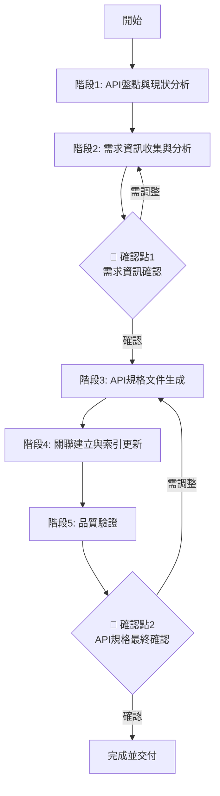

# API 規格生成與維護工作流程 (API Specification Generation and Maintenance Workflow)

## 🔒 強制執行配置
```yaml
# AISDLC v0.09 執行配置 - 請 LLM 嚴格遵循
workflow_metadata:
  id: "api-specification"
  version: "v0.09"
  priority: "CRITICAL"
  scenario_applicable: ["greenfield", "brownfield", "refactoring", "integration"]

agent_binding:
  primary:
    - agent/core/05.sd-architect-zh.yaml
  supporting:
    - agent/core/04.sa-analyst-zh.yaml
    - agent/core/07.qa-tester-zh.yaml
    - agent/core/06.dev-developer-zh.yaml
  rules_enforcement: MANDATORY
  auto_load: true

execution_control:
  skip_confirmation: false
  require_human_interaction: true
  validation_checkpoints: enabled
  zero_speculation: true
  api_spec_mandatory: true

workflow_priority: AGENT_RULES_FIRST
```

> ⚠️ **LLM 注意**：執行此 workflow 時必須載入 sd-architect.yaml (主要) + 相關協作 agents 配置並強制執行所有規則。**系統包含 API 時，API 規格文檔為強制性要求**。遵循零臆測原則。

---

# 📋 Workflow 基本資訊

## Workflow 識別

| 屬性 | 值 |
|-----|---|
| **Workflow ID** | `api-specification` |
| **版本** | v0.09 |
| **狀態** | Active |
| **優先級** | Core - Critical |

## 描述

此工作流程用於系統性地檢查、生成和維護 API 規格文檔。它掃描現有的 SRD 文檔以識別 API 定義，從相關的 User Story、Acceptance Criteria 和 Acceptance Test 中提取需求資訊，為每個 API 生成獨立且詳細的規格文件，並建立與源文檔的完整追蹤鏈。

## 適用場景

| 情境類型 | 適用性 | 說明 |
|---------|-------|------|
| **Greenfield** | ✅ 完全適用 | 新系統的 API 設計和規格編寫 |
| **Brownfield** | ✅ 完全適用 | 現有系統補充 API 文檔或新增 API |
| **Refactoring** | ⚠️ 部分適用 | API 重構後的規格更新 |
| **Integration** | ✅ 完全適用 | 整合第三方 API 或設計整合接口 |
| **Performance** | ⚠️ 部分適用 | 效能優化相關的 API 調整 |

## 觸發條件

- SRD 文檔中包含 API 設計但缺少詳細規格
- User Story 涉及 API 功能但無對應規格文檔
- 需求變更導致 API 介面修改需要更新規格
- 定期維護確保 API 文檔與實現保持同步
- 新增 API 端點或模組
- Code review 發現 API 文檔缺失或不完整

# 🎯 Workflow 目標

1. **確保每個 API 都有完整詳細的規格文檔**
   - 遵循 OpenAPI/Swagger 規範標準
   - 包含所有必要的技術細節
   - 提供清晰的使用範例

2. **建立完整的需求追蹤鏈**
   - API 規格 ← SRD ← FRD ← User Story
   - 每個 API 都能追溯到業務需求
   - 維持文檔間的雙向連結

3. **標準化 API 文檔格式**
   - 統一使用 API_Specification_Template
   - 確保文檔結構一致性
   - 便於開發和測試團隊使用

4. **支援開發和測試**
   - 提供充分的技術實現依據
   - 包含足夠的測試場景和範例
   - 明確錯誤處理和邊界條件

5. **維持文檔的時效性和準確性**
   - 定期檢查文檔與實現的一致性
   - 及時更新變更
   - 維護 API 版本歷史

---

# 👥 角色與責任

## 主要負責人 (Primary Owner)

### SD Agent (Marcus - System Designer)
- **主要責任**：
  - 領導 API 規格的技術設計
  - 確保文檔格式標準化
  - 維護 API 規格與 SRD 的一致性
  - 審查技術規格的合理性

## 參與者 (Participants)

| Agent | 角色 | 主要貢獻 |
|-------|-----|---------|
| **SA Agent (Amanda)** | 系統分析師 | 提供業務需求解讀、協助 User Story 到 API 的映射 |
| **QA Agent (Quincy)** | 測試工程師 | 提供測試案例、驗證 API 規格的可測試性 |
| **Dev Agent** | 開發者 | 提供 API 技術實現細節、參數驗證規則 |
| **人類用戶** | 決策者 | 在關鍵決策點確認 API 規格與業務需求的一致性 |

## 審查者 (Reviewers)

- **SA Agent**：審查 API 規格與 User Story 的一致性
- **Dev Agent**：審查 API 技術規格的合理性和可實現性
- **QA Agent**：審查 API 規格的可測試性
- **人類用戶**：最終審查 API 規格的業務邏輯正確性

---

# 📥 輸入與前置條件

## 必要輸入內容

| 輸入項目 | 來源 Workflow | 必要性 | 說明 |
|---------|-------------|-------|------|
| **SRD 文檔** | user-story-design | ✅ 必要 | 包含 API 設計章節的系統需求文檔 |
| **FRD 文檔** | validation-documentation | ✅ 必要 | 包含相關 User Story 和 Acceptance Criteria |
| **User Stories** | user-story-design | ✅ 必要 | API 相關的使用者故事 |
| **AT 文檔** | user-story-design | ⚠️ 建議 | 包含 API 相關的驗收測試案例 |
| **現有 API 規格** | Previous Execution | ⚠️ 如適用 | 需要更新的現有 API 文檔 |

## 前置條件

### 文檔就緒條件
- [ ] SRD 文檔已完成並包含 API 設計章節
- [ ] 相關的 FRD 和 User Stories 已完成並可供參考
- [ ] 系統架構設計已確定

### 模板和工具就緒
- [ ] API_Specification_Template.md 模板可用
- [ ] API_Index_Template.md 模板可用
- [ ] 項目文檔目錄結構已建立
- [ ] srd/api/ 目錄已創建

### 技術準備
- [ ] API 設計符合 RESTful/GraphQL/gRPC 規範
- [ ] 認證和授權機制已確定
- [ ] 資料模型設計已完成

## 所需資源

### 模板資源
- [API Specification Template](../../docs_template/srd/API_Specification_Template.md)
- [API Index Template](../../docs_template/srd/API_Index_Template.md)

### 分析工具
- 文檔掃描和內容提取能力
- Markdown 格式驗證工具
- 連結驗證工具

### 時間資源
- 每個 API 端點：30-60 分鐘
- API 索引創建：30-45 分鐘
- 品質驗證：1-2 小時

### 參考資料
- OpenAPI Specification 3.0+
- RESTful API Design Best Practices
- 專案 API 設計指南

---

# 🔄 執行流程

## 流程總覽



---

## 階段 1：API 盤點與現狀分析

### 基本資訊
| 屬性 | 值 |
|-----|---|
| **負責 Agent** | SD Agent (Marcus) |
| **協作 Agent** | SA Agent (Amanda) |
| **預估時間** | 1-2小時 |
| **複雜度** | Medium |

### 目標
掃描現有文檔，全面識別所有 API 定義，評估現有規格文件的完備性，建立清晰的 API 狀態報告。

### 執行步驟

#### 步驟 1.1：掃描 SRD 文檔識別 API（30-45分鐘）

**執行內容**：
1. **自動化掃描** 🔴 **v0.09 更新**
   - 解析所有 SRD 文檔中的「API 設計」、「系統介面」、「即時通訊」等章節
   - 識別所有 API 類型：
     - **REST API**：HTTP 端點（GET, POST, PUT, DELETE, PATCH, etc.）
     - **GraphQL**：Query, Mutation, Subscription schema
     - **gRPC**：gRPC 服務定義
     - **WebSocket**：WebSocket 端點和事件 🆕
     - **SSE (Server-Sent Events)**：SSE 端點 🆕
   - 提取 API 端點、方法/事件類型、基本描述

2. **API 清單建立** 🔴 **v0.09 更新**
   ```markdown
   ## API Inventory

   | API ID | Type | Module | Endpoint | Method/Event | Description | Source Doc |
   |--------|------|--------|----------|--------------|-------------|------------|
   | API-USER-001 | REST | User | /api/v1/users | POST | 創建使用者 | SRD§3.2.1 |
   | API-USER-002 | REST | User | /api/v1/users/{id} | GET | 獲取使用者資訊 | SRD§3.2.2 |
   | API-AUTH-001 | REST | Auth | /api/v1/auth/login | POST | 使用者登入 | SRD§3.1.1 |
   | API-CHAT-001 | WebSocket | Chat | /ws/chat | connect/message/disconnect | 即時聊天 | SRD§4.1.1 |
   | API-NOTIF-001 | WebSocket | Notification | /ws/notifications | subscribe/unsubscribe | 即時通知 | SRD§4.2.1 |
   | API-LIVE-001 | SSE | LiveData | /api/v1/live/data | stream | 即時數據流 | SRD§4.3.1 |
   ```

   **🆕 WebSocket API 識別關鍵字**：
   - 端點路徑：`/ws/*`, `/websocket/*`, `wss://...`
   - 功能描述：「即時」、「雙向通訊」、「推送」、「訂閱」、「長連接」
   - 事件類型：`connect`, `disconnect`, `message`, `error`, `subscribe`, `unsubscribe`

   **🆕 SSE API 識別關鍵字**：
   - 端點路徑：`/events/*`, `/stream/*`, `/sse/*`
   - 功能描述：「事件流」、「伺服器推送」、「單向數據流」
   - Content-Type: `text/event-stream`

3. **API 分類** 🔴 **v0.09 更新**
   - 按模組分類（User, Auth, Product, Order, Chat, Notification, etc.）
   - 按類型分類：
     - **REST API**：CRUD, Business Logic, Integration
     - **WebSocket API**：Real-time Communication, Push Notification, Live Updates
     - **GraphQL API**：Query, Mutation, Subscription
     - **gRPC API**：Unary, Server Streaming, Client Streaming, Bidirectional Streaming
     - **SSE API**：Server-to-Client Streaming
   - 按版本分類（v1, v2, etc.）

**零臆測檢查點**：
- ❓ 如果 SRD 中 API 描述不清楚 → **暫停並向 SA 或人類確認**
- ❓ 如果無法確定 API 屬於哪個模組 → **暫停並詢問人類**
- ❓ 如果 API 設計不符合既定規範 → **暫停並向人類確認**

#### 步驟 1.2：檢查現有 API 規格文件（30-45分鐘）

**執行內容**：
1. **掃描現有文檔**
   - 掃描 `srd/api/` 目錄下的現有 API 文檔
   - 列出所有已存在的 API 規格文件
   - 識別文件命名是否符合規範

2. **完整性評估**（基於模板檢查清單）
   ```markdown
   ## Completeness Assessment

   | API ID | Spec File | Status | Missing Sections |
   |--------|-----------|--------|------------------|
   | API-USER-001 | API_User_Create.md | ✅ Complete | - |
   | API-USER-002 | API_User_Get.md | ⚠️ Incomplete | Error Responses, Examples |
   | API-AUTH-001 | - | ❌ Missing | All |
   ```

3. **品質評分**
   - 完整性評分（0-100%）
   - 符合模板程度（0-100%）
   - 技術準確性（High/Medium/Low）

#### 步驟 1.3：建立 API 狀態報告（15-30分鐘）

**執行內容**：
1. **狀態分類**
   - ✅ **完整**：文檔存在且內容完整
   - ⚠️ **不完整**：文檔存在但有缺失
   - ❌ **缺失**：無對應規格文件

2. **優先級排序**
   ```markdown
   ## Priority Ranking

   ### P0 - Critical (Must Have Before Development)
   - API-AUTH-001: User Login (缺失，核心功能)
   - API-USER-001: User Registration (不完整，缺少錯誤處理)

   ### P1 - High (Needed for MVP)
   - API-PRODUCT-001: Product List (缺失)
   - API-ORDER-001: Create Order (不完整)

   ### P2 - Medium (Post-MVP)
   - API-USER-003: Update Profile (缺失)
   ```

3. **工作量估算**
   - 需要生成的 API 數量 × 平均時間
   - 需要更新的 API 數量 × 平均時間
   - 總計工作時數

**產出文件**：
- `API_Inventory_[ProjectName].md` - API 清單
- `API_Status_Report_[ProjectName].md` - API 狀態報告

---

### 檢查點

- [ ] 所有 SRD 文檔已掃描並提取 API 清單
- [ ] 現有 API 規格文件完整性已評估
- [ ] API 狀態報告已生成並包含優先級排序
- [ ] 工作量估算合理

### 品質標準

- ✅ API 清單涵蓋所有 SRD 中定義的端點
- ✅ 完整性評估基於標準模板的所有必填項目
- ✅ 優先級排序考慮業務價值和技術依賴
- ✅ 狀態報告清晰且可執行

---

## 階段 2：需求資訊收集與分析

### 基本資訊
| 屬性 | 值 |
|-----|---|
| **負責 Agent** | SA Agent (Amanda) |
| **協作 Agent** | SD Agent (Marcus), QA Agent (Quincy) |
| **預估時間** | 2-3小時 |
| **複雜度** | Medium-High |

### 目標
從相關的 User Story、Acceptance Criteria 和 Acceptance Test 中收集 API 需求資訊，確保 API 規格有堅實的業務需求基礎。

### 執行步驟

#### 步驟 2.1：User Story 分析（45-60分鐘）

**執行內容**：
1. **識別相關 User Story**
   ```markdown
   ## API-User Story Mapping

   ### API-AUTH-001: POST /api/v1/auth/login

   **Related User Stories**:
   - US-001: 使用者登入系統
     - As a 註冊使用者
     - I want to 使用 email 和密碼登入
     - So that 我可以訪問我的帳戶

   **Business Context**:
   - 身份驗證是系統的核心功能
   - 需要支援記住我功能
   - 失敗 5 次後需要鎖定帳戶

   **User Roles**: 所有註冊使用者
   ```

2. **提取業務場景**
   - 標準使用場景
   - 特殊業務規則
   - 用戶角色和權限要求

3. **確定 API 的業務價值**
   - 為什麼需要這個 API
   - 解決什麼業務問題
   - 預期的使用頻率

**零臆測檢查點**：
- ❓ 如果無法確定 API 對應哪個 User Story → **暫停並向人類確認**
- ❓ 如果業務邏輯不清楚 → **暫停並向 BA/PM 確認**
- ❓ 如果用戶角色權限不明確 → **暫停並詢問人類**

#### 步驟 2.2：Acceptance Criteria 解析（45-60分鐘）

**執行內容**：
1. **提取 API 相關的驗收標準**
   ```markdown
   ## AC to API Parameters Mapping

   ### US-001 Acceptance Criteria

   **AC-001-1: 成功登入**
   Given 使用者輸入有效的 email 和密碼
   When 使用者點擊登入按鈕
   Then 系統應返回 JWT token
   And 記錄登入時間

   → **API Requirements**:
   - Request: email (string, required), password (string, required)
   - Response 200: token (string), userId (uuid), loginTime (timestamp)

   **AC-001-2: 密碼錯誤**
   Given 使用者輸入錯誤的密碼
   When 使用者點擊登入按鈕
   Then 系統應返回 401 錯誤
   And 錯誤訊息為「Email 或密碼錯誤」

   → **API Requirements**:
   - Response 401: { "error": "INVALID_CREDENTIALS", "message": "..." }
   ```

2. **識別請求參數和驗證規則**
   - 必填參數和選填參數
   - 參數類型和格式
   - 驗證規則和約束

3. **確定成功和失敗的回應條件**
   - 成功回應格式和狀態碼
   - 各種錯誤情況的處理
   - 邊界條件處理

#### 步驟 2.3：Acceptance Test 分析（30-45分鐘）

**執行內容**：
1. **收集 API 相關的測試案例**
   - 正常流程測試案例
   - 異常流程測試案例
   - 邊界值測試案例

2. **提取請求範例和預期回應**
   ```markdown
   ## Test Cases to API Examples

   ### AT-001-1: 成功登入測試
   **Request Example**:
   POST /api/v1/auth/login
   {
     "email": "user@example.com",
     "password": "SecureP@ss123"
   }

   **Expected Response (200)**:
   {
     "token": "eyJhbGc...",
     "userId": "uuid-string",
     "loginTime": "2025-10-21T10:30:00Z"
   }
   ```

3. **識別邊界條件和錯誤處理場景**
   - 空值輸入
   - 超長字串
   - 特殊字符處理
   - 並發訪問
   - 錯誤重試邏輯

#### 步驟 2.4：需求資訊結構化（15-30分鐘）

**執行內容**：
1. **按 API 分組整理資訊**
   - 為每個 API 建立需求資訊包
   - 組織業務邏輯、參數需求、測試場景

2. **建立需求到 API 參數的映射關係**
   - 追蹤每個參數的來源需求
   - 記錄參數驗證規則的依據
   - **🔴 標記推測性參數（Critical）**
     ```markdown
     ### API-AUTH-001 參數來源追蹤

     **明確參數** (來自 US/AC):
     - email (來源: US-001 AC-001-1)
     - password (來源: US-001 AC-001-1)

     **推測性參數** 🔸 INFERRED (需確認):
     - rememberMe (推斷: 常見登入功能，但未在 US 中提及)
       → 確認問題: 是否需要「記住我」功能？

     **假設性參數** 🔶 ASSUMED (需補充需求):
     - deviceId (假設: 用於追蹤登入裝置，但需求未提及)
       → 確認問題: 是否需要裝置追蹤？如需要，請補充需求。
     ```

3. **識別資訊缺口** 🔴 **v0.09 更新**
   ```markdown
   ## Information Gaps

   ### API-AUTH-001
   - ❓ Token 有效期多長？ (需確認)
   - ❓ Refresh token 機制？ (需確認)
   - ❓ 支援 OAuth 第三方登入嗎？ (需確認)
   - 🔸 rememberMe 參數是否確實需要？ (推測性參數)
   - 🔶 deviceId 參數是否需要？ (假設性參數，需補充需求)
   ```

   **🆕 資訊缺口分類標準**：

   | 類型 | 符號 | 說明 | 優先級 | 處理方式 |
   |------|------|------|--------|---------|
   | **功能缺口** | ❓ | 需求中未明確定義的功能或行為 | P0-P1 | 必須向 SA/BA 確認 |
   | **參數缺口** | 🔸 | 推測性參數，邏輯合理但需確認 | P1 | 確認後更新來源 |
   | **規格缺口** | 🔶 | 假設性內容，需補充需求 | P0 | 必須補充需求文檔 |
   | **實作細節缺口** | 🔹 | 技術實作細節未定義 | P2 | 可由 SD 決定 |
   | **錯誤處理缺口** | ⚠️ | 錯誤情況未涵蓋 | P1 | 需確認錯誤處理策略 |

   **🆕 資訊缺口確認流程**：

   1. **缺口識別與記錄**
      - 在步驟 2.1-2.3 過程中持續記錄發現的資訊缺口
      - 每個缺口必須標記類型、優先級、影響範圍

   2. **優先級評估**
      ```markdown
      **資訊缺口優先級評估表**

      | 缺口 ID | API ID | 缺口描述 | 類型 | 優先級 | 影響範圍 | 阻塞開發？ |
      |---------|--------|---------|------|--------|---------|-----------|
      | GAP-001 | API-AUTH-001 | Token 有效期未定義 | ❓ 功能缺口 | P0 | Core Auth | ✅ Yes |
      | GAP-002 | API-AUTH-001 | rememberMe 參數需確認 | 🔸 參數缺口 | P1 | Optional Feature | ❌ No |
      | GAP-003 | API-AUTH-001 | deviceId 需補充需求 | 🔶 規格缺口 | P0 | Security Feature | ✅ Yes |
      ```

   3. **確認問題準備**
      - 為每個缺口準備清晰的確認問題
      - 提供 2-3 個可能的選項供決策者參考
      - 說明每個選項的技術影響和成本

   4. **阻塞性缺口追蹤**
      - P0 缺口且「阻塞開發」必須在進入階段 3 前解決
      - 建立缺口解決追蹤表，記錄確認狀態和決策結果

   5. **缺口解決後更新**
      - 所有已確認的缺口必須更新回原始需求文檔（PRD/FRD/SRD）
      - 在 API 規格中標記缺口解決日期和決策人

**產出文件**：
- `API_Requirements_Mapping_[ProjectName].md` - API 需求映射
- `API_Parameters_Extraction_[ProjectName].md` - 參數需求提取
- `Information_Gaps_Report.md` - 資訊缺口報告 🔴 **v0.09 增強**

---

### 🔴 人機協作確認點 1：需求資訊確認

#### ⏸️ 暫停流程

**此時必須暫停 workflow 執行，等待人類確認後才能繼續**

#### 呈現內容

```markdown
## 📊 API 需求資訊收集報告

### 1️⃣ API-User Story 映射表
[展示每個 API 對應的 User Story]

| API ID | API Endpoint | Related User Stories | Business Value |
|--------|-------------|---------------------|----------------|
| API-AUTH-001 | POST /api/v1/auth/login | US-001, US-002 | 核心認證功能 |
| ... | ... | ... | ... |

### 2️⃣ 業務場景分析
[展示 API 的使用場景和業務邏輯]

**API-AUTH-001: User Login**
- **Standard Flow**: 使用者輸入 email/password → 驗證 → 返回 token
- **Business Rules**:
  - 密碼錯誤 5 次鎖定帳戶 30 分鐘
  - Token 有效期 24 小時
  - 支援「記住我」功能（30 天）

### 3️⃣ 參數需求清單
[展示從需求中提取的 API 參數要求]

**Request Parameters**:
- email (string, required, format: email, max: 255)
- password (string, required, min: 8, max: 128)
- rememberMe (boolean, optional, default: false)

**Response Fields**:
- token (string, JWT format)
- userId (uuid)
- loginTime (timestamp, ISO 8601)

### 4️⃣ 資訊缺口報告
[列出需要進一步澄清的部分]

**需要確認的問題**:
1. Token 使用 JWT 還是其他格式？
2. Refresh token 機制如何？
3. 是否需要支援 MFA（多因素認證）？
4. 密碼強度要求是什麼？
```

#### 人類需要確認的問題

1. **映射關係準確性**
   - ❓ API 與 User Story 的映射關係是否正確？
   - ❓ 是否有遺漏的 User Story？
   - ❓ 是否有不相關的 User Story 被誤關聯？

2. **業務場景理解**
   - ❓ 業務場景描述是否準確？
   - ❓ 業務規則是否完整？
   - ❓ 是否有特殊的業務邏輯未被識別？

3. **參數需求完整性**
   - ❓ API 參數需求是否完整？
   - ❓ 參數驗證規則是否正確？
   - ❓ 回應格式是否符合預期？
   - 🔴 **推測性參數確認** (Critical):
     - ❓ 標記為 🔸 INFERRED 的參數是否確實需要？
     - ❓ 標記為 🔶 ASSUMED 的參數是否應納入需求？
     - ❓ 所有推測性參數都有明確的確認問題嗎？

4. **資訊缺口**
   - ❓ 列出的資訊缺口是否需要立即澄清？
   - ❓ 是否有其他未被發現的資訊缺口？
   - ❓ 推測性和假設性參數的確認問題是否已列入缺口清單？

#### 確認選項

```
選項 1: ✅ 確認需求資訊收集完整準確，可繼續
選項 2: 🔄 需要補充特定 API 的業務邏輯說明 [請指明哪些 API]
選項 3: ⚠️ 需要澄清某些 User Story 與 API 的關聯 [請說明]
選項 4: 📝 發現重要需求遺漏，需要重新分析 [請列出遺漏內容]
選項 5: ❓ 我需要回答資訊缺口中的問題 [請提供答案]
```

#### 30 分鐘超時機制

（同其他 workflow 的超時處理機制）

---

### 檢查點

- [ ] 所有 API 相關的 User Story 已識別
- [ ] **🔴 人類用戶已確認需求資訊收集準確性**
- [ ] Acceptance Criteria 中的 API 要求已提取
- [ ] Acceptance Test 案例已收集並分析
- [ ] 資訊缺口已識別並澄清（或記錄為待確認）
- [ ] **🔴 所有推測性參數已標記（🔸 INFERRED / 🔶 ASSUMED）**
- [ ] **🔴 推測性參數的確認問題已列入資訊缺口清單**

### 品質標準

- ✅ 每個 API 都有對應的業務需求依據
- ✅ **需求資訊經人類確認與實際期望一致**
- ✅ 參數需求具有明確的業務邏輯支持
- ✅ 所有必要資訊已收集完整
- ✅ **所有參數都有明確的來源標記（US-XXX / 🔸 INFERRED / 🔶 ASSUMED）**
- ✅ **推測性參數不超過總參數的 30%**（如超過，需重新檢視需求完整性）

---

## 階段 3：API 規格文件生成

### 基本資訊
| 屬性 | 值 |
|-----|---|
| **負責 Agent** | SD Agent (Marcus) |
| **協作 Agent** | SA Agent, Dev Agent |
| **預估時間** | 根據 API 數量（每個 30-60分鐘） |
| **複雜度** | Medium-High |

### 目標
基於 API_Specification_Template.md 為每個 API 生成獨立、完整、標準化的規格文件。

### 執行步驟

#### 步驟 3.1：文件結構準備（每個 API 5-10分鐘）

**執行內容**：
1. **創建文件目錄結構**
   ```
   docs_template/srd/api/
   ├── user/
   │   ├── API_User_Create.md
   │   ├── API_User_Get.md
   │   └── API_User_Update.md
   ├── auth/
   │   ├── API_Auth_Login.md
   │   └── API_Auth_Logout.md
   └── API_Index.md
   ```

2. **文件命名規範**
   - 格式：`API_[Module]_[Function].md`
   - 範例：`API_User_Create.md`, `API_Auth_Login.md`
   - 確保命名清晰且一致

3. **載入模板**
   - 使用 API_Specification_Template.md
   - 保留所有必填章節
   - 準備填寫內容

#### 步驟 3.2：基本資訊填寫（每個 API 5-10分鐘）

**執行內容**：
1. **文件資訊**
   ```markdown
   # API Specification: User Login

   ## Document Information
   - **Document ID**: API-AUTH-001
   - **Version**: 1.0
   - **Last Updated**: 2025-10-21
   - **Author**: SD Agent (Marcus)
   - **Status**: Draft

   ## Revision History
   | Version | Date | Author | Description |
   |---------|------|--------|-------------|
   | 1.0 | 2025-10-21 | SD Agent | Initial creation |
   ```

2. **API 摘要**
   - API 名稱和描述
   - 業務用途
   - 主要功能

3. **環境資訊**
   - Base URL
   - API 版本
   - 支援的環境（Dev, Staging, Production）

#### 步驟 3.3：API 詳細規格撰寫（每個 API 15-30分鐘）

**執行內容**：
1. **端點資訊**
   ```markdown
   ## Endpoint Information

   - **Method**: POST
   - **Path**: /api/v1/auth/login
   - **Full URL**: `{base_url}/api/v1/auth/login`
   - **Description**: 使用者透過 email 和密碼進行身份驗證並獲取訪問令牌

   ## Business Logic
   1. 驗證 email 格式
   2. 檢查帳戶是否存在
   3. 驗證密碼正確性
   4. 檢查帳戶狀態（是否鎖定）
   5. 生成 JWT token
   6. 記錄登入時間和 IP
   7. 返回 token 和用戶資訊
   ```

2. **請求規格**
   ```markdown
   ## Request Specification

   ### Headers
   | Header | Type | Required | Description |
   |--------|------|----------|-------------|
   | Content-Type | string | Yes | application/json |

   ### Body Parameters
   | Parameter | Type | Required | Validation | Description | Source |
   |-----------|------|----------|------------|-------------|--------|
   | email | string | Yes | Email format, max 255 chars | 使用者 email | US-001 |
   | password | string | Yes | Min 8 chars, max 128 chars | 使用者密碼 | US-001 |
   | rememberMe | boolean | No | Default: false | 是否記住登入狀態 | 🔸 INFERRED |

   **參數來源標記說明** 🔴 **v0.09 更新**:
   - **US-XXX / AC-XXX**: 來自明確的 User Story 或 Acceptance Criteria
   - **🔸 INFERRED**: 推測性參數（根據業務邏輯推斷，需確認）
   - **🔶 ASSUMED**: 假設性參數（未在需求中提及，需補充需求）
   - **🔷 LEGACY**: 繼承自現有系統（Brownfield 專案）

   **🆕 推測參數強制確認機制**：

   當參數標記為 🔸 INFERRED 或 🔶 ASSUMED 時，必須執行以下確認流程：

   1. **記錄推測依據**
      ```markdown
      **推測參數追蹤表**

      | 參數名稱 | 標記類型 | 推測依據 | 確認狀態 | 確認人 | 確認日期 |
      |---------|---------|---------|---------|--------|---------|
      | rememberMe | 🔸 INFERRED | 一般登入系統常見功能，AC-001-3 提到「記住登入狀態」但未明確參數名稱 | ⏳ Pending | - | - |
      | deviceId | 🔶 ASSUMED | 用於追蹤裝置，需求未提及但對安全有益 | ⏳ Pending | - | - |
      ```

   2. **確認狀態標記**
      - ⏳ **Pending**: 待確認
      - ✅ **Confirmed**: 已確認（SA/BA/PM 批准）
      - ❌ **Rejected**: 已拒絕（需移除或修改）
      - 🔄 **Modified**: 已修改（參數名稱或規格調整）

   3. **強制暫停點** 🔴
      - **當推測參數超過 3 個或影響核心業務邏輯時，必須暫停並尋求 SA/BA 確認**
      - **所有 🔶 ASSUMED 參數都必須經過 PM/PO 批准才能進入實作階段**

   4. **確認後更新**
      - 確認後移除推測標記，更新為明確來源（US-XXX / AC-XXX）
      - 拒絕的參數從規格中移除並記錄於 Decision Log

   ### Request Example
   ```json
   {
     "email": "user@example.com",
     "password": "SecureP@ss123",
     "rememberMe": true
   }
   ```
   ```

3. **回應規格**
   ```markdown
   ## Response Specification

   ### Success Response (200 OK)
   ```json
   {
     "status": "success",
     "data": {
       "token": "eyJhbGciOiJIUzI1NiIsInR5cCI6IkpXVCJ9...",
       "userId": "550e8400-e29b-41d4-a716-446655440000",
       "email": "user@example.com",
       "loginTime": "2025-10-21T10:30:00Z",
       "expiresAt": "2025-10-22T10:30:00Z"
     }
   }
   ```

   ### Error Responses

   #### 400 Bad Request - Invalid Input
   ```json
   {
     "status": "error",
     "errorCode": "INVALID_INPUT",
     "message": "Invalid email format",
     "field": "email"
   }
   ```

   #### 401 Unauthorized - Invalid Credentials
   ```json
   {
     "status": "error",
     "errorCode": "INVALID_CREDENTIALS",
     "message": "Email or password is incorrect"
   }
   ```

   #### 423 Locked - Account Locked
   ```json
   {
     "status": "error",
     "errorCode": "ACCOUNT_LOCKED",
     "message": "Account locked due to multiple failed login attempts. Try again in 30 minutes.",
     "lockedUntil": "2025-10-21T11:00:00Z"
   }
   ```
   ```

4. **安全性考慮**
   ```markdown
   ## Security

   ### Authentication
   - No authentication required for this endpoint

   ### Rate Limiting
   - 5 requests per minute per IP
   - 20 requests per hour per IP

   ### Security Considerations
   - Password is transmitted over HTTPS only
   - Password is hashed using bcrypt (cost factor: 12)
   - Failed login attempts are logged
   - Account locked after 5 failed attempts
   - Implement CAPTCHA after 3 failed attempts
   ```

5. **WebSocket API 特殊規格** 🆕 **v0.09 新增**

   對於 WebSocket 類型的 API，需要額外定義以下規格：

   ```markdown
   ## WebSocket Specification (範例：API-CHAT-001)

   ### Connection Information
   - **Endpoint**: `/ws/chat`
   - **Protocol**: WebSocket (wss://)
   - **Full URL**: `wss://{base_url}/ws/chat`
   - **Description**: 即時聊天 WebSocket 連接

   ### Connection Lifecycle

   #### 1. Connection Handshake
   **Client → Server (HTTP Upgrade)**
   ```
   GET /ws/chat HTTP/1.1
   Host: api.example.com
   Upgrade: websocket
   Connection: Upgrade
   Sec-WebSocket-Key: x3JJHMbDL1EzLkh9GBhXDw==
   Sec-WebSocket-Version: 13
   Authorization: Bearer {token}
   ```

   **Server → Client (Upgrade Response)**
   ```
   HTTP/1.1 101 Switching Protocols
   Upgrade: websocket
   Connection: Upgrade
   Sec-WebSocket-Accept: HSmrc0sMlYUkAGmm5OPpG2HaGWk=
   ```

   #### 2. Connection Established
   **Server → Client (Welcome Message)**
   ```json
   {
     "type": "connection_ack",
     "data": {
       "connectionId": "conn_550e8400-e29b-41d4-a716-446655440000",
       "userId": "user_123",
       "timestamp": "2025-11-26T10:30:00Z"
     }
   }
   ```

   ### Message Types

   #### Client → Server Messages

   | Message Type | Event Name | Payload | Description |
   |-------------|-----------|---------|-------------|
   | Send Message | `chat.message.send` | { roomId, content, mentions } | 發送聊天訊息 |
   | Join Room | `chat.room.join` | { roomId } | 加入聊天室 |
   | Leave Room | `chat.room.leave` | { roomId } | 離開聊天室 |
   | Typing Indicator | `chat.typing.start` | { roomId } | 開始輸入指示 |
   | Stop Typing | `chat.typing.stop` | { roomId } | 停止輸入指示 |

   **範例：Send Message**
   ```json
   {
     "type": "chat.message.send",
     "data": {
       "roomId": "room_789",
       "content": "Hello, World!",
       "mentions": ["user_456"],
       "metadata": {
         "clientMessageId": "msg_client_123"
       }
     }
   }
   ```

   #### Server → Client Messages

   | Message Type | Event Name | Payload | Description |
   |-------------|-----------|---------|-------------|
   | New Message | `chat.message.new` | { messageId, roomId, sender, content, timestamp } | 新訊息通知 |
   | Message Delivered | `chat.message.delivered` | { messageId, clientMessageId } | 訊息送達確認 |
   | User Joined | `chat.room.user_joined` | { roomId, userId, username } | 使用者加入房間 |
   | User Left | `chat.room.user_left` | { roomId, userId } | 使用者離開房間 |
   | Typing | `chat.typing.active` | { roomId, userId, username } | 其他使用者正在輸入 |
   | Error | `error` | { code, message, details } | 錯誤通知 |

   **範例：New Message**
   ```json
   {
     "type": "chat.message.new",
     "data": {
       "messageId": "msg_550e8400",
       "roomId": "room_789",
       "sender": {
         "userId": "user_123",
         "username": "Alice"
       },
       "content": "Hello, World!",
       "mentions": ["user_456"],
       "timestamp": "2025-11-26T10:30:15Z"
     }
   }
   ```

   ### Error Handling

   #### WebSocket Close Codes
   | Code | Name | Description | Client Action |
   |------|------|-------------|---------------|
   | 1000 | Normal Closure | 正常關閉連接 | No action needed |
   | 1001 | Going Away | 伺服器關閉或客戶端離開 | Reconnect after delay |
   | 1002 | Protocol Error | 協議錯誤 | Check message format |
   | 1003 | Unsupported Data | 不支援的數據類型 | Check data encoding |
   | 1008 | Policy Violation | 違反政策（如未授權） | Re-authenticate |
   | 1011 | Internal Error | 伺服器內部錯誤 | Retry with backoff |
   | 4000 | Invalid Token | Token 無效或過期 | Re-authenticate |
   | 4001 | Rate Limit | 訊息頻率超過限制 | Slow down requests |

   **Error Message Format**
   ```json
   {
     "type": "error",
     "data": {
       "code": "RATE_LIMIT_EXCEEDED",
       "message": "You are sending messages too quickly. Please wait 5 seconds.",
       "retryAfter": 5000,
       "timestamp": "2025-11-26T10:30:20Z"
     }
   }
   ```

   ### Connection Lifecycle Events

   ```markdown
   ## Connection States

   1. **CONNECTING**: 正在建立 WebSocket 連接
   2. **CONNECTED**: WebSocket 已連接，等待 connection_ack
   3. **AUTHENTICATED**: 已認證，可以發送/接收訊息
   4. **DISCONNECTING**: 正在斷開連接
   5. **DISCONNECTED**: 已斷開連接
   6. **RECONNECTING**: 正在嘗試重新連接
   ```

   ### Heartbeat / Keep-Alive

   ```markdown
   ## Heartbeat Mechanism

   - **Client → Server Ping**: 每 30 秒發送一次
     ```json
     { "type": "ping", "timestamp": "2025-11-26T10:30:00Z" }
     ```

   - **Server → Client Pong**: 必須在 5 秒內回應
     ```json
     { "type": "pong", "timestamp": "2025-11-26T10:30:00Z" }
     ```

   - **Timeout**: 若 60 秒內未收到 Pong，客戶端應該關閉連接並重連
   ```

   ### Security Considerations (WebSocket Specific)

   ```markdown
   ## WebSocket Security

   ### Authentication
   - JWT Token 必須在 WebSocket 握手時提供（通過 Authorization header 或 query parameter）
   - Token 驗證失敗會拒絕 WebSocket 升級（返回 401）

   ### Rate Limiting
   - 每個連接每秒最多 10 個訊息
   - 超過限制會收到 `error` 訊息且可能被強制斷開（Code 4001）

   ### Message Size Limits
   - 單個訊息最大 64 KB
   - 超過限制會收到 Protocol Error（Code 1002）

   ### Connection Limits
   - 每個使用者最多 5 個並發 WebSocket 連接
   - 超過限制的新連接會被拒絕

   ### CORS
   - 僅允許來自白名單域名的 WebSocket 連接
   - Origin header 驗證
   ```

   **參數來源標記（WebSocket Events）**：
   - 所有 WebSocket 事件的參數也必須標記來源（US-XXX / 🔸 INFERRED / 🔶 ASSUMED）
   - 例如：`mentions` 參數如果需求未明確提及，應標記為 🔸 INFERRED 並執行確認流程
   ```

#### 步驟 3.4：測試和範例（每個 API 10-15分鐘）

**執行內容**：
1. **測試場景**
   ```markdown
   ## Test Scenarios

   ### Scenario 1: Successful Login
   - **Given**: Valid credentials
   - **When**: User submits login request
   - **Then**: Receive 200 with token

   ### Scenario 2: Invalid Email Format
   - **Given**: Invalid email format
   - **When**: User submits login request
   - **Then**: Receive 400 with INVALID_INPUT error

   ### Scenario 3: Wrong Password
   - **Given**: Correct email but wrong password
   - **When**: User submits login request
   - **Then**: Receive 401 with INVALID_CREDENTIALS error

   ### Scenario 4: Account Locked
   - **Given**: Account locked due to failed attempts
   - **When**: User submits login request
   - **Then**: Receive 423 with ACCOUNT_LOCKED error
   ```

2. **cURL 範例**
   ```markdown
   ## Example Usage

   ### cURL
   ```bash
   curl -X POST \
     https://api.example.com/api/v1/auth/login \
     -H 'Content-Type: application/json' \
     -d '{
       "email": "user@example.com",
       "password": "SecureP@ss123",
       "rememberMe": true
     }'
   ```
   ```

3. **SDK 範例**（如適用）
   ```markdown
   ### JavaScript
   ```javascript
   const response = await fetch('https://api.example.com/api/v1/auth/login', {
     method: 'POST',
     headers: { 'Content-Type': 'application/json' },
     body: JSON.stringify({
       email: 'user@example.com',
       password: 'SecureP@ss123',
       rememberMe: true
     })
   });
   const data = await response.json();
   ```
   ```

#### 步驟 3.5：關聯文檔連結（每個 API 5分鐘）

**執行內容**：
1. **添加關聯文檔章節**
   ```markdown
   ## Related Documents

   ### Requirements
   - [SRD - Authentication Module](../SRD_Module_Auth.md#login-api)
   - [FRD - User Authentication](../../frd/FRD_Module_Auth.md)
   - [User Story US-001](../../prd/User_Stories.md#us-001)

   ### Design
   - [System Architecture](../System_Architecture.md#authentication-service)
   - [Data Model - User](../Data_Model_Design.md#user-entity)

   ### Testing
   - [Acceptance Test AT-001](../../tests/AT_Module_Auth.md#at-001)
   - [Test Cases TC-AUTH-001](../../tests/Test_Cases_Auth.md)

   ### Related APIs
   - [User Registration](./API_Auth_Register.md)
   - [Logout](./API_Auth_Logout.md)
   - [Refresh Token](./API_Auth_Refresh.md)
   ```

2. **建立需求追蹤鏈**
   - User Story → Acceptance Criteria → API Spec
   - API Spec → Test Cases
   - API Spec → Implementation

**產出文件**：
- `API_[Module]_[Function].md` - 各個 API 的詳細規格文件

---

### 檢查點

- [ ] 所有 API 文件已按命名規範創建
- [ ] API 規格內容完整且符合模板格式
- [ ] 請求參數和回應格式基於需求分析定義
- [ ] 安全性和錯誤處理完整
- [ ] 測試場景和範例充分
- [ ] 關聯文檔連結已建立

### 品質標準

- ✅ API 文件嚴格遵循 API_Specification_Template.md 格式
- ✅ 所有必填欄位已完整填寫
- ✅ 參數定義具有明確的業務邏輯依據
- ✅ 錯誤處理涵蓋所有可能情況
- ✅ 範例清晰且可直接使用

---

## 階段 4：關聯建立與索引更新

### 基本資訊
| 屬性 | 值 |
|-----|---|
| **負責 Agent** | SD Agent (Marcus) |
| **協作 Agent** | SA Agent |
| **預估時間** | 1-1.5小時 |
| **複雜度** | Medium |

### 目標
建立 API 文件與 SRD 的雙向關聯，創建 API 索引，確保文檔的可導航性和追蹤性。

### 執行步驟

#### 步驟 4.1：更新 SRD 文檔（30-45分鐘）

**執行內容**：
1. **在 SRD 的「API 設計」章節中添加詳細規格連結**
   ```markdown
   ## 3.2 API 設計

   ### 3.2.1 Authentication APIs

   #### User Login
   - **Endpoint**: POST /api/v1/auth/login
   - **Purpose**: 使用者身份驗證
   - **詳細規格**: 📄 [API_Auth_Login.md](./api/auth/API_Auth_Login.md)

   #### User Registration
   - **Endpoint**: POST /api/v1/auth/register
   - **Purpose**: 新使用者註冊
   - **詳細規格**: 📄 [API_Auth_Register.md](./api/auth/API_Auth_Register.md)
   ```

2. **確保 SRD 與 API 規格文件的一致性**
   - SRD 中的 API 描述應與規格文件一致
   - 參數定義應相同
   - 業務邏輯應對齊

#### 步驟 4.2：創建 API 索引文件（30-45分鐘）

**執行內容**：
1. **創建 API_Index.md**
   ```markdown
   # API Index

   ## Overview
   本文檔提供系統所有 API 的索引和導航。

   ## API 統計
   - **總 API 數量**: 24
   - **認證 APIs**: 4
   - **使用者 APIs**: 6
   - **產品 APIs**: 8
   - **訂單 APIs**: 6

   ## APIs by Module

   ### Authentication (認證模組)
   | API ID | Method | Endpoint | Description | Spec |
   |--------|--------|----------|-------------|------|
   | API-AUTH-001 | POST | /api/v1/auth/login | 使用者登入 | [📄](./auth/API_Auth_Login.md) |
   | API-AUTH-002 | POST | /api/v1/auth/register | 使用者註冊 | [📄](./auth/API_Auth_Register.md) |
   | API-AUTH-003 | POST | /api/v1/auth/logout | 使用者登出 | [📄](./auth/API_Auth_Logout.md) |
   | API-AUTH-004 | POST | /api/v1/auth/refresh | 刷新 Token | [📄](./auth/API_Auth_Refresh.md) |

   ### User Management (使用者管理模組)
   | API ID | Method | Endpoint | Description | Spec |
   |--------|--------|----------|-------------|------|
   | API-USER-001 | GET | /api/v1/users/{id} | 獲取使用者資訊 | [📄](./user/API_User_Get.md) |
   | API-USER-002 | PUT | /api/v1/users/{id} | 更新使用者資訊 | [📄](./user/API_User_Update.md) |
   | API-USER-003 | DELETE | /api/v1/users/{id} | 刪除使用者 | [📄](./user/API_User_Delete.md) |
   | ... | ... | ... | ... | ... |

   ## APIs by Type

   ### CRUD Operations
   - User CRUD: [API-USER-001](./user/API_User_Get.md), [API-USER-002](./user/API_User_Update.md), ...
   - Product CRUD: [API-PRODUCT-001](./product/API_Product_Get.md), ...

   ### Business Logic
   - Order Processing: [API-ORDER-001](./order/API_Order_Create.md), ...
   - Payment: [API-PAYMENT-001](./payment/API_Payment_Process.md), ...

   ### Integration
   - Third-party Auth: [API-AUTH-005](./auth/API_Auth_Google.md), ...
   - Email Service: [API-EMAIL-001](./email/API_Email_Send.md), ...

   ## API Version History
   | Version | Release Date | Changes |
   |---------|-------------|---------|
   | v1.1 | 2025-11-01 | Added OAuth support |
   | v1.0 | 2025-10-21 | Initial release |

   ## Quick Links
   - [API Design Guidelines](../API_Design_Guidelines.md)
   - [Error Code Reference](../Error_Codes.md)
   - [Authentication Guide](../Authentication_Guide.md)
   - [Rate Limiting Policy](../Rate_Limiting.md)
   ```

2. **按模組和功能分類提供導航**

#### 步驟 4.3：建立交叉引用（15-30分鐘）

**執行內容**：
1. **在每個 API 文件中添加相關 API 的交叉引用**
   - 依賴的 API
   - 相關的 API
   - 組合使用的 API

2. **識別 API 間的依賴關係**
   ```markdown
   ## API Dependencies

   ### Depends On
   - [User Login](./API_Auth_Login.md) - Must be authenticated

   ### Used By
   - [Update Profile](../user/API_User_Update.md) - Uses user context from this API

   ### Related APIs
   - [User Logout](./API_Auth_Logout.md)
   - [Refresh Token](./API_Auth_Refresh.md)
   ```

#### 步驟 4.4：驗證連結完整性（15-30分鐘）

**執行內容**：
1. **檢查所有內部連結的有效性**
   - 自動化工具掃描所有 markdown 連結
   - 識別斷開的連結
   - 修正錯誤的路徑

2. **確認文檔間的引用關係正確**
   - SRD → API Spec
   - API Spec → SRD
   - API Spec → Related APIs

3. **驗證追蹤鏈的完整性**
   - User Story → API Spec
   - API Spec → Test Cases

**產出文件**：
- `API_Index.md` - API 索引文件
- `Updated_SRD_[Module].md` - 更新後的 SRD 文檔
- `Link_Validation_Report.md` - 連結驗證報告

---

### 檢查點

- [ ] SRD 文檔已更新並包含 API 規格連結
- [ ] API_Index.md 已創建並包含所有 API 概覽
- [ ] 文檔間的交叉引用已建立
- [ ] 所有連結已驗證有效
- [ ] 追蹤鏈完整

### 品質標準

- ✅ SRD 與 API 規格文件內容保持一致
- ✅ API 索引提供清晰的導航結構
- ✅ 追蹤鏈完整且可驗證
- ✅ 所有連結正確無誤

---

## 階段 5：品質驗證與最終確認

### 基本資訊
| 屬性 | 值 |
|-----|---|
| **負責 Agent** | SD Agent (Marcus) |
| **協作 Agent** | QA Agent (Quincy), SA Agent |
| **預估時間** | 1-2小時 |
| **複雜度** | Medium |

### 目標
對生成的 API 規格進行全面品質檢查，確保文檔的完整性、一致性和可用性。

### 🛠️ 推薦的自動化驗證工具

> **💡 重要**: 為提升品質驗證效率和可靠性，強烈建議使用以下自動化工具輔助品質檢查。

| 工具名稱 | 用途 | 安裝方式 | 使用場景 |
|---------|------|---------|---------|
| **markdownlint** | Markdown 語法檢查 | `npm install -g markdownlint-cli` | 檢查文檔格式、標題層級、表格語法 |
| **markdown-link-check** | 連結有效性檢查 | `npm install -g markdown-link-check` | 驗證所有內部連結和外部連結有效性 |
| **spectral** | OpenAPI 規範驗證 | `npm install -g @stoplight/spectral-cli` | 驗證 API 規格符合 OpenAPI 標準 |
| **vale** | 術語一致性檢查 | 參考 [Vale 官網](https://vale.sh) | 檢查術語使用一致性、文案風格 |

**快速開始範例**:

```bash
# 1. Markdown 語法檢查
markdownlint docs_template/core/api/*.md

# 2. 連結有效性檢查
markdown-link-check docs_template/core/api/API_*.md

# 3. OpenAPI 規範驗證（如有 OpenAPI YAML/JSON）
spectral lint openapi.yaml

# 4. 術語一致性檢查（需先設定 .vale.ini）
vale docs_template/core/api/*.md
```

**CI/CD 整合範例** (.github/workflows/api-validation.yml):

```yaml
name: API Documentation Validation

on: [push, pull_request]

jobs:
  validate:
    runs-on: ubuntu-latest
    steps:
      - uses: actions/checkout@v3

      - name: Markdown Lint
        run: |
          npm install -g markdownlint-cli
          markdownlint 'docs_template/core/api/**/*.md'

      - name: Link Check
        run: |
          npm install -g markdown-link-check
          find docs_template/core/api -name '*.md' -exec markdown-link-check {} \;

      - name: OpenAPI Validation
        run: |
          npm install -g @stoplight/spectral-cli
          spectral lint openapi/*.yaml
```

### 執行步驟

#### 步驟 5.1：格式標準驗證（30-45分鐘）

> **🚀 自動化建議**: 使用 `markdownlint` 自動檢查 Markdown 格式

**執行內容**：
1. **檢查模板符合度**
   ```markdown
   ## Template Compliance Check

   | API ID | File | Template Sections | Missing | Compliance % |
   |--------|------|------------------|---------|-------------|
   | API-AUTH-001 | API_Auth_Login.md | 12/12 | - | 100% |
   | API-USER-001 | API_User_Get.md | 11/12 | Security | 92% |
   ```

2. **驗證必填欄位的完整性**
   - Document Information ✓
   - API Summary ✓
   - Request Specification ✓
   - Response Specification ✓
   - Error Responses ✓
   - Security ✓
   - Examples ✓
   - Related Documents ✓

3. **確認 Markdown 語法和結構正確性**
   - 標題層級正確
   - 表格格式正確
   - 代碼塊正確
   - 連結格式正確

   > **🚀 自動化建議**: 使用 `markdown-link-check` 驗證所有文檔內連結有效性

#### 步驟 5.2：內容一致性檢查（30-45分鐘）

> **🚀 自動化建議**: 使用 `vale` 檢查術語一致性

**執行內容**：
1. **驗證 API 規格與 SRD 的一致性**
   - API 端點一致
   - 參數定義一致
   - 業務邏輯一致

2. **檢查參數定義與 User Story 需求的對應**
   - 每個參數都能追溯到需求
   - 參數驗證規則符合 AC
   - 回應欄位符合預期

3. **確認測試案例與 AT 文檔的一致性**
   - 測試場景涵蓋所有 AC
   - 範例與測試案例一致

#### 步驟 5.3：技術可行性驗證（15-30分鐘）

> **🚀 自動化建議**: 使用 `spectral` 驗證 OpenAPI 規範（如有轉換為 OpenAPI 格式）

**執行內容**：
1. **評估 API 設計的技術合理性**（由 Dev Agent 協助）
   - RESTful 原則符合性
   - HTTP 方法使用正確
   - 狀態碼使用恰當
   - 資料結構合理

2. **檢查參數類型和約束的正確性**
   - 類型定義明確
   - 驗證規則可實現
   - 約束條件合理

3. **驗證錯誤處理機制的完整性**
   - 涵蓋所有可能的錯誤情況
   - 錯誤訊息清晰
   - 錯誤碼標準化

#### 步驟 5.4：可測試性評估（15-30分鐘）

**執行內容**：
1. **與 QA Agent 協作評估可測試性**
   - 測試場景是否充分
   - 範例是否可直接用於測試
   - 邊界條件是否清楚

2. **確認測試案例涵蓋所有場景**
   - 正常流程
   - 異常流程
   - 邊界值
   - 安全測試

3. **驗證 API 規格提供足夠的測試依據**

**產出文件**：
- `API_Quality_Report_[ProjectName].md` - 品質檢查報告
- `API_Coverage_Analysis.md` - 覆蓋率分析
- `Technical_Review_Checklist.md` - 技術審查檢查清單

---

### 🔴 人機協作確認點 2：API 規格最終確認

#### ⏸️ 暫停流程

**此時必須暫停 workflow 執行，等待人類確認後才能繼續**

#### 呈現內容

```markdown
## 📋 API 規格最終確認報告

### 1️⃣ API 規格文件清單
[展示所有生成的 API 文檔]

| API ID | Module | Endpoint | Spec File | Status |
|--------|--------|----------|-----------|--------|
| API-AUTH-001 | Auth | POST /api/v1/auth/login | API_Auth_Login.md | ✅ Complete |
| API-AUTH-002 | Auth | POST /api/v1/auth/register | API_Auth_Register.md | ✅ Complete |
| ... | ... | ... | ... | ... |

**統計**:
- 總 API 數: 24
- 已生成規格: 24 (100%)
- 完整度 100%: 22 (92%)
- 完整度 90-99%: 2 (8%)

### 2️⃣ 品質檢查報告

#### 格式符合度
- ✅ 模板符合率: 96%
- ✅ 必填欄位完整率: 100%
- ✅ Markdown 語法正確率: 100%

#### 內容一致性
- ✅ 與 SRD 一致性: 98%
- ✅ 與 User Story 對應: 100%
- ✅ 與測試案例一致: 95%

#### 技術驗證
- ✅ RESTful 符合性: 100%
- ✅ 參數定義合理性: 100%
- ✅ 錯誤處理完整性: 98%

#### 可測試性
- ✅ 測試場景充分性: 95%
- ✅ 範例可用性: 100%
- ✅ 測試依據充分性: 98%

### 3️⃣ 關聯關係圖
[展示 API 文檔與需求文檔的連結關係]

**追蹤鏈完整性**:
- User Story → API Spec: 100%
- API Spec → SRD: 100%
- API Spec → Test Cases: 95%

### 4️⃣ 覆蓋率分析

**需求覆蓋**:
- 所有 User Story 都有對應的 API 規格: ✅
- 所有 AC 都反映在 API 規格中: ✅
- 所有 AT 都有對應的測試場景: ✅

**文檔覆蓋**:
- SRD 中的所有 API 都有詳細規格: ✅
- API 索引包含所有 API: ✅

### 5️⃣ 識別的問題

#### Minor Issues (已修正)
- API-USER-002: 缺少 Security 章節 → 已補充
- API-PRODUCT-001: 範例格式不一致 → 已修正

#### Pending Items
- API-PAYMENT-001: 等待第三方 API 文檔確認參數

### 6️⃣ API 變更影響分析 🆕 **v0.09 新增**

> **🔴 重要**：此章節用於評估 API 變更對現有消費者（Consumer）的影響，確保向後相容性並制定適當的遷移策略。

#### Breaking Change 評估

**定義 Breaking Change**：

| 變更類型 | 範例 | 是否 Breaking | 影響程度 |
|---------|------|--------------|---------|
| **移除端點** | DELETE `/api/v1/users` | ✅ Yes | 🔴 Critical |
| **移除必填欄位** | 移除 response 中的 `userId` | ✅ Yes | 🔴 Critical |
| **修改欄位型別** | `age: string` → `age: number` | ✅ Yes | 🔴 Critical |
| **新增必填參數** | 新增 required `deviceId` | ✅ Yes | 🟠 High |
| **修改端點路徑** | `/users` → `/v2/users` | ✅ Yes | 🟠 High |
| **修改錯誤碼** | 401 → 403 | ✅ Yes | 🟡 Medium |
| **新增選填參數** | 新增 optional `filter` | ❌ No | 🟢 Low |
| **新增 response 欄位** | 新增 `createdAt` 欄位 | ❌ No | 🟢 Low |
| **改善錯誤訊息** | 更詳細的 error message | ❌ No | 🟢 Low |

**🔍 Breaking Change 檢查清單**：

```markdown
## Breaking Change Analysis

| API ID | 變更描述 | 變更類型 | Breaking? | 影響程度 | 受影響 Consumer |
|--------|---------|---------|-----------|---------|----------------|
| API-AUTH-001 | 新增必填參數 `deviceId` | 新增必填參數 | ✅ Yes | 🟠 High | Mobile App, Web App |
| API-USER-002 | 移除 `nickname` 欄位 | 移除欄位 | ✅ Yes | 🔴 Critical | Mobile App |
| API-PRODUCT-003 | 新增 optional `tags` | 新增選填參數 | ❌ No | 🟢 Low | - |
```

**🔴 Breaking Change 總計**：
- Critical: 1
- High: 1
- Total Breaking Changes: 2

#### Consumer 影響列表

**識別所有 API Consumer**：

| Consumer | 類型 | 平台 | 版本 | 負責團隊 | 聯絡人 |
|---------|------|------|------|---------|--------|
| Mobile App (iOS) | 原生應用 | iOS | v2.3.1 | Mobile Team | @john |
| Mobile App (Android) | 原生應用 | Android | v2.3.0 | Mobile Team | @jane |
| Web Application | SPA | Web | v1.5.2 | Frontend Team | @alice |
| Admin Dashboard | Web | Web | v1.2.0 | Backend Team | @bob |
| Third-party Integration | External | API | v1.0.0 | External | partner@example.com |

**🔍 受影響 Consumer 分析**：

```markdown
## Impact Analysis by Consumer

### 1. Mobile App (iOS) - v2.3.1
**受影響 API**：
- ❌ **API-AUTH-001** (Breaking): 新增必填參數 `deviceId`
- ❌ **API-USER-002** (Breaking): 移除 `nickname` 欄位
- ✅ **API-PRODUCT-003** (Non-Breaking): 新增選填參數 `tags`

**影響評估**：
- 🔴 **Critical Impact**: 登入流程和使用者資料顯示將失效
- 📱 **需要更新**: 必須發布新版本 (v2.4.0)
- ⏱️ **預估工時**: 16-20 小時
- 📅 **建議發布日期**: 2025-12-15

**遷移步驟**：
1. 更新 API Client SDK (1-2 hr)
2. 修改登入邏輯加入 `deviceId` (4-6 hr)
3. 移除 `nickname` 相關 UI 顯示 (2-3 hr)
4. 測試和修復 (8-10 hr)

---

### 2. Web Application - v1.5.2
**受影響 API**：
- ❌ **API-AUTH-001** (Breaking): 新增必填參數 `deviceId`
- ✅ **API-PRODUCT-003** (Non-Breaking): 新增選填參數 `tags`

**影響評估**：
- 🟠 **High Impact**: 登入流程需調整
- 💻 **需要更新**: 可透過 hotfix 修復 (v1.5.3)
- ⏱️ **預估工時**: 6-8 小時
- 📅 **建議發布日期**: 2025-12-10

**遷移步驟**：
1. 獲取瀏覽器 fingerprint 作為 deviceId (2-3 hr)
2. 更新登入 API 呼叫 (1-2 hr)
3. 測試 (3 hr)

---

### 3. Third-party Integration - v1.0.0
**受影響 API**：
- ❌ **API-AUTH-001** (Breaking): 新增必填參數 `deviceId`

**影響評估**：
- 🔴 **Critical Impact**: 整合將立即失效
- 📧 **需要通知**: 至少提前 30 天通知 (partner@example.com)
- 📖 **需要文檔**: 提供遷移指南和範例程式碼
- ⏱️ **預估工時** (Partner 方): 未知（需與 partner 確認）

**通知計畫**：
1. Email 通知 (API 變更前 30 天)
2. 提供遷移文檔和範例程式碼
3. 設置緩衝期（同時支援舊版 30 天）
4. 技術支援窗口
```

#### 相容性策略與遷移計畫

**🔹 策略 1: API 版本控制（推薦）**

```markdown
## API Versioning Strategy

### v1 API (舊版 - 維護模式)
- **路徑**: `/api/v1/*`
- **狀態**: ⚠️ Deprecated (保留 6 個月)
- **終止日期**: 2026-06-30
- **說明**: 繼續支援舊版但不再新增功能

### v2 API (新版 - 主要版本)
- **路徑**: `/api/v2/*`
- **狀態**: ✅ Active
- **上線日期**: 2025-12-01
- **說明**: 包含所有 Breaking Changes

### 遷移時間線
- **2025-12-01**: v2 API 上線，v1 標記為 Deprecated
- **2026-01-01**: v1 進入 End-of-Life 警告期
- **2026-06-30**: v1 API 完全終止

### 並行支援期間維護成本
- 額外維護工時: 每月 8-10 小時
- 測試成本: 兩個版本都需測試
- 文檔維護: 兩份文檔
```

**🔹 策略 2: Feature Flags（漸進式遷移）**

```markdown
## Feature Flag Strategy

### 實作方式
- 使用 Feature Flag 控制新舊行為
- Consumer 可以選擇性啟用新功能
- 透過 HTTP Header 或 Query Parameter 控制

### 範例
```http
# 使用新行為
GET /api/v1/auth/login
X-API-Version: 2.0

# 使用舊行為（預設）
GET /api/v1/auth/login
```

### 優點
- 平滑過渡，無需立即遷移
- 可以 A/B Testing
- 降低風險

### 缺點
- 程式碼複雜度增加
- 需要維護兩套邏輯
- 最終仍需清理舊邏輯
```

**🔹 策略 3: 適配器模式（最小化改動）**

```markdown
## Adapter Pattern Strategy

### 實作方式
- 在 API Gateway 層加入適配器
- 自動將舊格式轉換為新格式
- Consumer 端無需修改

### 適用場景
- 參數格式變更
- 欄位重命名
- 簡單型別轉換

### 限制
- 無法處理移除欄位的情況
- 性能開銷
- 增加系統複雜度
```

#### 通知與溝通計畫

**🔹 通知對象與時程**

| 對象 | 通知方式 | 提前時間 | 負責人 | 狀態 |
|------|---------|---------|--------|------|
| Mobile Team | Email + Slack | 30 天 | @tech-lead | ⏳ Pending |
| Frontend Team | Email + Slack | 30 天 | @tech-lead | ⏳ Pending |
| Third-party Partners | Email (正式) | 60 天 | @partner-manager | ⏳ Pending |
| PM/PO | Meeting | 即時 | @sa-lead | ⏳ Pending |

**🔹 通知內容範本**

```markdown
## API Breaking Change Notification

**Subject**: [重要] API 變更通知 - v2.0 即將上線

**Dear Team,**

我們計畫於 **2025-12-01** 發布 API v2.0 版本，包含以下 **Breaking Changes**：

### 影響你們的變更
1. **API-AUTH-001** - 登入 API
   - 變更內容: 新增必填參數 `deviceId`
   - 影響: 現有登入流程將失效
   - 遷移指南: [連結]

2. **API-USER-002** - 使用者資料 API
   - 變更內容: 移除 `nickname` 欄位
   - 影響: 無法再取得 nickname 資料
   - 替代方案: 使用 `displayName` 欄位

### 時間線
- **2025-11-15**: v2 API Beta 環境開放測試
- **2025-12-01**: v2 API 正式上線，v1 進入 Deprecated
- **2026-06-30**: v1 API 終止服務

### 你們需要做的事
1. 閱讀遷移指南: [連結]
2. 在測試環境驗證變更
3. 更新你們的應用程式
4. 在 2025-11-30 前完成遷移

### 支援資源
- 遷移指南: [連結]
- 範例程式碼: [連結]
- Slack Channel: #api-v2-migration
- 聯絡人: @tech-lead

如有任何問題，請隨時聯絡我們。

Best Regards,
API Team
```

**🔹 遷移指南文檔要求**

```markdown
## Migration Guide 必須包含

1. **變更摘要**
   - 所有 Breaking Changes 清單
   - 影響範圍說明
   - 時間線

2. **逐項遷移步驟**
   - Before/After 程式碼比較
   - 每個變更的詳細說明
   - 測試建議

3. **常見問題 FAQ**
   - 預期的問題和解答
   - 疑難排解

4. **範例程式碼**
   - 各平台（iOS, Android, Web）的範例
   - 完整的 Request/Response 範例

5. **測試環境**
   - 測試環境 URL
   - 測試帳號
   - Postman Collection
```

#### 風險評估與緩解措施

**🔹 風險矩陣**

| 風險 | 機率 | 影響 | 風險等級 | 緩解措施 |
|------|------|------|---------|---------|
| Consumer 未及時遷移導致服務中斷 | 高 | Critical | 🔴 High | 延長 v1 支援期至 6 個月 |
| Third-party 無法聯繫到 | 中 | High | 🟠 Medium | 多管道通知（Email, 電話, 官網公告） |
| 遷移過程中出現相容性問題 | 中 | Medium | 🟡 Medium | 提供詳細測試環境和技術支援 |
| 文檔不清楚導致遷移錯誤 | 低 | Medium | 🟢 Low | Code Review 遷移指南，提供範例程式碼 |

**🔹 緩解措施詳細計畫**

1. **延長支援期**
   - v1 API 維護 6 個月（原計畫 3 個月）
   - 提供充足時間給 Consumer 遷移

2. **技術支援**
   - 設立專屬 Slack Channel (#api-v2-migration)
   - 指定專人回答問題（@tech-lead）
   - 每週辦公時間（Office Hours）提供即時支援

3. **測試環境**
   - 提前 2 週開放 v2 Beta 環境
   - 提供完整測試資料和 Postman Collection
   - 提供自動化測試工具

4. **回滾計畫**
   - 如發現嚴重問題，可暫停 v2 上線
   - 準備快速回滾腳本
   - 監控 v2 上線後 24 小時的錯誤率

**🔹 成功指標（Success Metrics）**

```markdown
## Migration Success Criteria

### 遷移完成指標
- [ ] 90% 以上的 Consumer 在 v1 終止前完成遷移
- [ ] v2 API 錯誤率 < 0.1%
- [ ] v2 API P95 響應時間 < 200ms
- [ ] 零客戶投訴關於 API 變更

### 監控指標
- **v1 API 使用率**: 每週監控，預期遞減
- **v2 API 採用率**: 每週監控，預期遞增
- **錯誤率**: 實時監控，超過閾值立即告警
- **Consumer 回饋**: 收集並快速回應

### 里程碑
- 2025-11-15: 50% Consumer 開始測試 v2
- 2025-12-01: 80% Consumer 已遷移到 v2
- 2026-03-01: 100% Consumer 已遷移到 v2
- 2026-06-30: v1 API 安全下線
```

#### 決策建議

**🎯 基於以上分析，建議採取以下策略**：

| 決策項目 | 建議方案 | 理由 |
|---------|---------|------|
| **版本策略** | API 版本控制（v1 → v2） | Breaking Changes 較多，版本控制最清晰 |
| **並行期間** | 6 個月 | 給予 Third-party 充足時間遷移 |
| **通知時間** | API 上線前 60 天 | 符合業界最佳實踐 |
| **測試環境** | 提前 2 週開放 | 讓團隊有充足時間測試 |
| **技術支援** | 設立專屬 Channel + Office Hours | 降低遷移障礙 |
| **回滾計畫** | 準備，但不輕易使用 | 降低風險，保持信心 |

**🔴 需要人類決策的項目**：

1. ❓ **是否接受 6 個月的 v1/v2 並行維護成本**？
   - 成本: 每月 8-10 小時額外工時
   - 替代方案: 縮短為 3 個月，但風險較高

2. ❓ **v1 終止日期是否設為 2026-06-30**？
   - 是否給予 Third-party 更多時間（延長至 12 個月）？

3. ❓ **是否需要為 Third-party 提供額外技術支援**？
   - 例如: 安排 1-on-1 技術會議

4. ❓ **Breaking Change 是否必要，還是可以找到替代方案**？
   - 例如: `deviceId` 是否可以改為 optional？

```

#### 人類需要確認的問題

1. **內容準確性**
   - ❓ API 規格內容是否準確反映業務需求？
   - ❓ 參數定義是否符合預期？
   - ❓ 錯誤處理是否充分？

2. **技術規格**
   - ❓ 技術規格是否合理且可實現？
   - ❓ 認證和授權機制是否適當？
   - ❓ 安全性考慮是否充分？

3. **文檔品質**
   - ❓ 文檔品質是否達到標準？
   - ❓ 範例是否清晰易懂？
   - ❓ 是否易於開發和測試人員使用？

4. **完整性**
   - ❓ 是否需要調整或補充任何內容？
   - ❓ 是否有遺漏的 API 或細節？

#### 確認選項

```
選項 1: ✅ 確認所有 API 規格完整正確，可以交付
選項 2: 🔄 需要調整特定 API 的技術細節 [請指明哪些 API 和調整內容]
選項 3: ⚠️ 需要補充某些 API 的業務邏輯說明 [請指明]
選項 4: 📝 發現重大問題，需要重新生成部分規格 [請說明問題]
選項 5: ❓ 我有其他問題需要釐清 [請說明]
```

---

### 檢查點

- [ ] 所有 API 文件格式符合標準模板
- [ ] **🔴 人類用戶已確認 API 規格準確性**
- [ ] 內容一致性檢查通過
- [ ] 技術可行性和可測試性已驗證
- [ ] 所有品質問題已修正或記錄

### 品質標準

- ✅ 所有 API 規格文檔格式標準且內容完整
- ✅ **API 規格經人類確認符合業務需求**
- ✅ 技術規格合理且具有可實現性
- ✅ 文檔可直接用於開發和測試

---

# 📤 輸出與交付

## 主要交付物清單

| 交付物類別 | 文件名稱 | 說明 | 交付對象 |
|-----------|---------|------|---------|
| **API 規格文件** | api/[module]/API_[Module]_[Function].md | 每個 API 的詳細規格文檔 | 開發、測試團隊 |
| **API 索引** | api/API_Index.md | API 索引和導航文件 | 所有團隊 |
| **更新的 SRD** | SRD_[Module].md | 包含 API 規格連結的 SRD | 所有團隊 |
| **狀態報告** | API_Status_Report.md | API 文檔的完整性和品質報告 | PM、Tech Lead |
| **品質報告** | API_Quality_Report.md | 品質檢查結果 | QA、Tech Lead |
| **覆蓋率分析** | API_Coverage_Analysis.md | 需求覆蓋分析 | SA、PM |
| **關聯關係圖** | API_Traceability_Matrix.md | API 與需求文檔的追蹤關係 | SA、PM |

## 交付標準

### 完整性標準
- ✅ 每個 API 都有對應的詳細規格文檔
- ✅ 所有必填章節都已完整填寫
- ✅ API 索引包含所有 API

### 標準化標準
- ✅ 所有文檔嚴格遵循 API_Specification_Template.md 格式
- ✅ 命名規範統一
- ✅ 結構一致

### 可追蹤性標準
- ✅ API 規格與 User Story、AC、AT 建立完整追蹤鏈
- ✅ SRD 與 API 規格雙向連結
- ✅ 相關 API 之間有交叉引用

### 可實現性標準
- ✅ API 規格技術上合理且可實現
- ✅ 參數定義明確且可驗證
- ✅ 錯誤處理完整

### 可測試性標準
- ✅ 提供充分的資訊支援 API 測試
- ✅ 測試場景涵蓋所有關鍵路徑
- ✅ 範例可直接用於測試

## 驗收條件

### 人機協作驗收
- [ ] **所有 2 個人機協作確認點都已完成並獲得人類批准**
- [ ] 需求資訊收集經人類確認準確
- [ ] API 規格最終版經人類確認可交付

### 文檔驗收
- [ ] 每個在 SRD 中定義的 API 都有對應的規格文件
- [ ] 所有 API 文件格式符合標準模板
- [ ] API 規格內容與 User Story 需求一致
- [ ] SRD 文檔已更新包含 API 規格連結
- [ ] API_Index.md 提供完整的 API 導航
- [ ] 關聯文檔連結完整且有效

### Agent 交叉驗收
- [ ] SA Agent 確認 API 規格與需求一致
- [ ] QA Agent 確認 API 規格可測試性
- [ ] Dev Agent 確認技術可行性

### 品質驗收
- [ ] 格式符合度 ≥ 95%
- [ ] 內容一致性 ≥ 95%
- [ ] 技術合理性 100%
- [ ] 可測試性 ≥ 90%

## 後續流程交接

### 交接對象
- **開發團隊**：根據 API 規格進行後端開發
- **測試團隊**：根據 API 規格進行測試設計和執行
- **前端團隊**：根據 API 規格進行前端整合
- **文檔團隊**：根據 API 規格編寫使用者文檔

### 交接內容
- API 規格文檔
- API 索引和導航
- 技術實現指南
- 測試參考資料
- 使用範例

### 交接標準
- [ ] 開發團隊確認理解所有 API 規格要求
- [ ] 測試團隊確認可以根據規格編寫測試案例
- [ ] 前端團隊確認可以根據規格進行整合
- [ ] 所有問題已澄清

---

# 🔗 協作與整合

## 前置 Workflows

| Workflow ID | Workflow 名稱 | 提供內容 | 依賴程度 |
|------------|-------------|---------|---------|
| `user-story-design` | 使用者故事與設計 | SRD 包含 API 設計 | ✅ 必須完成 |
| `validation-documentation` | 需求驗證與文檔化 | FRD 和 User Stories | ✅ 必須完成 |

## 後續 Workflows

| Workflow ID | Workflow 名稱 | 接收內容 | 說明 |
|------------|-------------|---------|------|
| `development-implementation` | 開發實現 | API 規格文檔 | 基於規格進行後端開發 |
| `api-testing` | API 測試 | API 規格、測試場景 | 基於規格進行介面測試 |
| `consistency-check` | 文檔一致性檢查 | 更新的文檔 | 驗證文檔一致性 |
| `change-management` | 需求變更管理 | API 規格 | API 變更時更新規格 |

## 並行 Workflows

- 可以與其他技術設計 workflow 並行執行
- 但建議在資料模型設計完成後執行，確保 API 與資料結構一致

## Agent 協作規則

### 協作模式
- **主導模式**：SD Agent 主導技術規格撰寫
- **需求協作**：SA Agent 協助需求理解和映射
- **品質協作**：QA Agent 負責可測試性驗證
- **技術協作**：Dev Agent 負責技術驗證

### 協作職責分工

```markdown
## 協作矩陣

| 階段 | 主導 Agent | 協作 Agent | 確認 Agent |
|-----|----------|-----------|-----------|
| API 盤點 | SD | SA | SD |
| 需求收集 | SA | SD, QA | 人類 |
| 規格生成 | SD | SA, Dev | SD |
| 關聯建立 | SD | SA | SD |
| 品質驗證 | SD | QA, Dev | 人類 |
```

---

# ⚡ 品質控制與監控

## 品質檢查點

### 階段性品質檢查

#### 階段 1 檢查
- [ ] API 清單完整無遺漏
- [ ] 現有文檔評估準確
- [ ] 優先級排序合理

#### 階段 2 檢查
- [ ] 需求映射正確
- [ ] 業務邏輯理解準確
- [ ] 參數需求完整
- [ ] 人類確認通過

#### 階段 3 檢查
- [ ] 文件命名規範
- [ ] 模板使用正確
- [ ] 內容完整詳細
- [ ] 範例清晰可用

#### 階段 4 檢查
- [ ] SRD 已正確更新
- [ ] API 索引完整
- [ ] 連結全部有效
- [ ] 追蹤鏈完整

#### 階段 5 檢查
- [ ] 格式符合標準
- [ ] 內容一致無矛盾
- [ ] 技術合理可行
- [ ] 可測試性充分
- [ ] 人類確認通過

## 風險控制

### 常見風險與應對措施

#### 風險 1：需求理解偏差
**應對措施**：
- 通過人機協作確認點確保準確性
- SA Agent 參與需求解讀
- 必要時回溯 User Story 和 AC

#### 風險 2：技術規格不合理
**應對措施**：
- Dev Agent 參與技術驗證
- 遵循 RESTful 最佳實踐
- 參考業界標準

#### 風險 3：文檔格式不統一
**應對措施**：
- 使用標準模板
- 自動化格式檢查
- 定期 Review

#### 風險 4：追蹤鏈斷裂
**應對措施**：
- 建立完整的交叉引用
- 連結驗證自動化
- 定期檢查一致性

## 成功指標

### 量化指標

| 指標類別 | 指標名稱 | 目標值 |
|---------|---------|-------|
| **覆蓋率** | API 規格覆蓋率 | 100% |
| | 需求追蹤覆蓋率 | 100% |
| **品質** | 格式合規率 | ≥ 95% |
| | 內容一致性 | ≥ 95% |
| | 技術合理性 | 100% |
| **可用性** | 開發團隊滿意度 | ≥ 4.5/5.0 |
| | 測試覆蓋率支持 | ≥ 90% |

---

# 📚 相關資源

## AISDLC 框架文檔
- [AISDLC_INIT.md](../../AISDLC_INIT.md)
- [README.md](../../README.md)

## Agent 配置
- [SD Agent](agent/core/05.sd-architect-zh.yaml)
- [SA Agent](agent/core/04.sa-analyst-zh.yaml)
- [QA Agent](agent/core/07.qa-tester-zh.yaml)
- [Dev Agent](agent/core/06.dev-developer-zh.yaml)

## 相關 Workflows
- [user-story-design.md](./user-story-design.md)
- [validation-documentation.md](./validation-documentation.md)
- [consistency-check.md](./consistency-check.md)
- [change-management.md](./change-management.md)

## 文檔模板
- [API Specification Template](../../docs_template/srd/API_Specification_Template.md)
- [API Index Template](../../docs_template/srd/API_Index_Template.md)

## 外部參考資源
- [OpenAPI Specification](https://swagger.io/specification/)
- [RESTful API Design](https://restfulapi.net/)
- [HTTP Status Codes](https://httpstatuses.com/)
- [API Design Best Practices](https://docs.microsoft.com/en-us/azure/architecture/best-practices/api-design)

---

**文檔版本**: v0.09
**最後更新**: 2025-10-21
**維護者**: AISDLC Framework Team
**狀態**: ✅ Active

---

此 workflow 確保 AISDLC 框架中每個 API 都有完整、標準化、詳細的規格文檔，並與需求文檔建立完整的追蹤鏈，為後續的開發和測試提供可靠的技術依據。系統包含 API 時，API 規格文檔為強制性要求。
