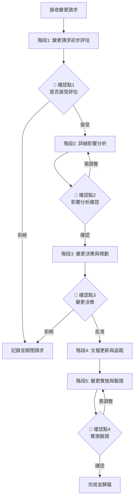

# 需求變更管理工作流程 (Requirements Change Management Workflow)

## 🔒 強制執行配置
```yaml
# AISDLC v0.09 執行配置 - 請 LLM 嚴格遵循
workflow_metadata:
  id: "change-management"
  version: "v0.09"
  priority: "HIGH"
  scenario_applicable: ["greenfield", "brownfield", "refactoring", "performance", "integration", "all_scenarios"]

agent_binding:
  primary:
    - agent/core/04.sa-analyst-zh.yaml
  supporting:
    - agent/core/03.pm-po-agent-zh.yaml
    - agent/core/05.sd-architect-zh.yaml
    - agent/core/02.ba-business-analyst-zh.yaml
    - agent/core/07.qa-tester-zh.yaml
  rules_enforcement: MANDATORY
  auto_load: true

execution_control:
  skip_confirmation: false
  require_human_interaction: true
  validation_checkpoints: enabled
  zero_speculation: true
  impact_analysis_required: true

workflow_priority: AGENT_RULES_FIRST
scenario_applicability:
  - greenfield
  - brownfield
  - refactoring
  - performance
  - integration
  - all_scenarios
```

> ⚠️ **LLM 注意**：執行此 workflow 時必須載入 sa-analyst.yaml (主要) + 相關協作 agents 配置並強制執行所有規則。需求變更必須經過嚴格的影響分析和人類確認，遵循零臆測原則。

---

# 📋 Workflow 基本資訊

## Workflow 識別

| 屬性 | 值 |
|-----|---|
| **Workflow ID** | `change-management` |
| **版本** | v0.09 |
| **狀態** | Active |
| **優先級** | Core - Critical |

## 描述

此工作流程處理專案開發過程中的需求變更，確保所有變更都經過適當的影響分析、風險評估和人類確認。維持從需求變更到實現的完整追蹤鏈，確保系統文檔的一致性和最新性。

## 適用場景

| 情境類型 | 適用性 | 說明 |
|---------|-------|------|
| **All Scenarios** | ✅ 完全適用 | 所有情境都可能遇到需求變更 |
| **Greenfield** | ✅ 完全適用 | 開發過程中的需求調整 |
| **Brownfield** | ✅ 完全適用 | 現有系統的功能變更 |
| **Refactoring** | ✅ 完全適用 | 重構過程中的範圍調整 |
| **Performance** | ✅ 完全適用 | 效能優化的需求變化 |
| **Integration** | ✅ 完全適用 | 整合需求的更新 |

## 觸發條件

- Stakeholder 提出新的需求或變更現有需求
- 開發過程中發現原需求不可行或不合理
- 技術限制導致需調整需求
- 商業優先級調整需要變更範圍
- 發現需求之間的衝突或矛盾
- 外部依賴（如第三方 API）變更導致的調整

# 🎯 Workflow 目標

1. **系統化處理需求變更**
   - 建立標準化的變更請求流程
   - 確保所有變更都有記錄和追蹤
   - 防止非正式的需求變更導致專案失控

2. **全面的影響分析**
   - 評估變更對現有功能的影響
   - 分析變更對時程和資源的影響
   - 識別變更帶來的技術風險

3. **確保人機協作決策**
   - 關鍵變更必須獲得人類批准
   - 透明化變更的利弊分析
   - 遵循零臆測原則，不擅自決定變更範圍

4. **維持文檔一致性**
   - 更新所有受影響的文檔
   - 維護完整的變更歷史記錄
   - 確保追蹤矩陣的準確性

5. **控制變更風險**
   - 評估變更的緊急性和優先級
   - 規劃變更的實施策略
   - 建立變更的回滾計劃

---

# 👥 角色與責任

## 主要負責人 (Primary Owner)

### SA Agent (Amanda - System Analyst)
- **主要責任**：
  - 領導變更影響分析
  - 協調各方意見和評估
  - 更新需求文檔
  - 維護變更追蹤記錄
  - 確保文檔一致性

## 參與者 (Participants)

| Agent | 角色 | 主要貢獻 |
|-------|-----|---------|
| **PM/PO Agent (Victoria)** | 產品經理 | 評估業務影響、確認優先級、批准變更決策 |
| **SD Agent (Marcus)** | 系統設計師 | 評估技術影響、提供技術可行性分析 |
| **BA Agent (Beatrice)** | 業務分析師 | 驗證業務邏輯、評估業務流程影響 |
| **QA Agent (Quincy)** | 測試工程師 | 評估測試影響、更新測試場景 |
| **Dev Agent** | 開發者 | 評估實現複雜度、估算開發工作量 |
| **人類 Stakeholders** | 決策者 | 最終批准或拒絕變更請求 |

## 審查者 (Reviewers)

- **人類 Stakeholders**：審查變更的必要性和合理性
- **PM/PO Agent**：確認變更符合業務目標
- **SD Agent**：確認技術方案可行
- **QA Agent**：確認測試策略適當

---

# 📥 輸入與前置條件

## 必要輸入內容

| 輸入項目 | 來源 | 必要性 | 說明 |
|---------|-----|-------|------|
| **變更請求** | Stakeholder / Team | ✅ 必要 | 描述需要變更的內容和原因 |
| **現有需求文檔** | Previous Workflows | ✅ 必要 | PRD/FRD/SRD 等相關文檔 |
| **追蹤矩陣** | Previous Workflows | ✅ 必要 | 需求與實現的追蹤關係 |
| **專案計劃** | user-story-design | ⚠️ 建議 | 當前的開發計劃和時程 |
| **實現狀態** | Development Team | ⚠️ 建議 | 已實現功能的狀態 |

## 前置條件

### 文檔就緒條件
- [ ] 現有需求文檔存在且是最新版本
- [ ] 追蹤矩陣完整且準確
- [ ] 變更請求已正式提出並記錄

### 專案狀態條件
- [ ] 了解當前開發進度和狀態
- [ ] 清楚已承諾的交付時程
- [ ] 了解團隊當前資源狀況

### 變更管理條件
- [ ] 變更管理流程已建立
- [ ] 變更決策機制已明確
- [ ] 相關 Stakeholders 可參與討論

## 所需資源

### 模板資源
- [Change Request Template](../../docs_template/Change_Request_Template.md)
- [Impact Analysis Template](../../docs_template/Impact_Analysis_Template.md)
- [Change Log Template](../../docs_template/Change_Log_Template.md)

### 分析工具
- 追蹤矩陣工具
- 版本比對工具
- 影響範圍分析工具

### 參考資料
- 變更管理最佳實踐
- 專案變更控制標準
- 影響分析檢查清單

---

# 🔄 執行流程

## 流程總覽



---

## 階段 1：變更請求初步評估

### 基本資訊
| 屬性 | 值 |
|-----|---|
| **負責 Agent** | SA Agent (Amanda) |
| **協作 Agent** | PM/PO Agent (Victoria) |
| **預估時間** | 30分鐘 - 1小時 |
| **複雜度** | Low-Medium |

### 目標
對變更請求進行初步評估，確定是否值得進行詳細分析，過濾明顯不合理或超出範圍的變更請求。

### 執行步驟

#### 步驟 1.1：變更請求記錄（15分鐘）

**執行內容**：
1. **建立變更請求記錄**
   ```markdown
   ## Change Request

   **CR ID**: CR-YYYY-MM-DD-XXX
   **Status**: Under Review
   **Submitted By**: [Name/Role]
   **Submitted Date**: [Date]
   **Priority**: [High/Medium/Low - 由提交者初步評估]

   ### Change Description
   [詳細描述需要變更什麼]

   ### Change Reason
   [為什麼需要這個變更]

   ### Expected Benefit
   [變更預期帶來的好處]

   ### Proposed Solution (Optional)
   [如果有，提交者建議的解決方案]
   ```

2. **變更分類**
   - 新增功能（New Feature）
   - 修改現有功能（Modification）
   - 刪除功能（Removal）
   - 需求澄清（Clarification）
   - 技術調整（Technical Change）

3. **緊急程度評估**
   - 🔴 Critical：阻礙專案進行，必須立即處理
   - 🟡 High：重要但不緊急
   - 🟢 Medium：可以納入正常規劃
   - ⚪ Low：Nice-to-have

#### 步驟 1.2：初步可行性檢查（15-30分鐘）

**執行內容**：
1. **明顯衝突檢查**
   - 是否與現有需求直接衝突
   - 是否與專案目標不符
   - 是否超出專案範圍

2. **資源可行性初判**
   - 團隊是否有能力實現
   - 時程是否允許
   - 預算是否充足

3. **風險初步識別**
   - 技術風險
   - 時程風險
   - 資源風險

**零臆測檢查點**：
- ❓ 如果變更描述不清楚 → **暫停並向提交者澄清**
- ❓ 如果變更原因不明確 → **暫停並向提交者詢問**
- ❓ 如果無法判斷是否在範圍內 → **暫停並向人類確認**

#### 步驟 1.3：初步評估報告（15分鐘）

**執行內容**：
1. **評估摘要**
   ```markdown
   ## Initial Assessment

   ### Classification
   - Type: [變更類型]
   - Urgency: [緊急程度]
   - Scope: [In/Out of Scope]

   ### Feasibility
   - Technical: [Feasible/Challenging/Not Feasible]
   - Resource: [Adequate/Tight/Insufficient]
   - Timeline: [Acceptable/Risky/Not Acceptable]

   ### Recommendation
   - [ ] Proceed to detailed impact analysis
   - [ ] Request more information
   - [ ] Reject (with reason)
   - [ ] Defer to later phase
   ```

**產出文件**：
- `CR-XXX_Initial_Assessment.md` - 初步評估報告

---

### 🔴 人機協作確認點 1：是否接受變更請求進行評估

#### ⏸️ 暫停流程

**此時必須暫停 workflow 執行，等待人類確認後才能繼續**

#### 呈現內容

```markdown
## 📋 變更請求初步評估報告

### 1️⃣ 變更請求資訊
- **CR ID**: CR-XXX
- **提交者**: [Name]
- **提交日期**: [Date]
- **變更類型**: [Type]
- **緊急程度**: [Urgency Level]

### 2️⃣ 變更描述
[完整描述變更內容]

### 3️⃣ 變更原因
[為什麼需要這個變更]

### 4️⃣ 初步評估結果
- **範圍評估**: [In/Out of Scope]
- **技術可行性**: [Feasible/Challenging/Not Feasible]
- **資源評估**: [Adequate/Tight/Insufficient]
- **時程影響**: [Acceptable/Risky/Not Acceptable]

### 5️⃣ 識別的風險
- [列出初步識別的風險]

### 6️⃣ Agent 建議
[Proceed/Request More Info/Reject/Defer]

**建議理由**：[詳細說明]
```

#### 人類需要確認的問題

1. **變更必要性**
   - ❓ 這個變更是否真的必要？
   - ❓ 變更的理由是否充分？
   - ❓ 是否有替代方案可以不變更？

2. **範圍和優先級**
   - ❓ 變更是否在專案範圍內？
   - ❓ 變更的優先級如何？
   - ❓ 是否應該推遲到下一版本？

3. **可行性**
   - ❓ 初步評估的可行性判斷是否合理？
   - ❓ 是否需要更詳細的影響分析？
   - ❓ 是否有其他考慮因素？

4. **下一步行動**
   - ❓ 是否繼續進行詳細的影響分析？
   - ❓ 還需要補充什麼資訊？
   - ❓ 決策是接受、拒絕還是推遲？

#### 確認選項

```
選項 1: ✅ 接受變更請求，繼續詳細影響分析
選項 2: 📝 接受但需補充資訊 [請說明需要什麼資訊]
選項 3: ⏸️ 推遲到 [未來時間點/版本]，現在不處理
選項 4: ❌ 拒絕變更請求 [請說明拒絕理由]
選項 5: ❓ 我需要更多資訊才能決定 [請說明]
```

#### 30 分鐘超時機制

**如果 30 分鐘內未收到人類回應**：
1. 🔴 自動暫停 workflow 執行
2. 📝 記錄當前狀態到 checkpoint
3. 💾 保存變更請求記錄
4. 📧 通知相關人員需要決策
5. ⏳ 進入等待模式

---

### 檢查點

- [ ] 變更請求已完整記錄
- [ ] **🔴 人類已確認是否接受評估**
- [ ] 初步評估報告已完成
- [ ] 決策理由已記錄
- [ ] 如拒絕，已向提交者說明原因

### 品質標準

- ✅ 變更請求資訊完整且清晰
- ✅ 初步評估客觀且有依據
- ✅ **決策經人類確認**
- ✅ 所有溝通都有記錄

---

## 階段 2：詳細影響分析

### 基本資訊
| 屬性 | 值 |
|-----|---|
| **負責 Agent** | SA Agent (Amanda) |
| **協作 Agent** | SD Agent, QA Agent, Dev Agent, PM/PO Agent |
| **預估時間** | 2-4小時 |
| **複雜度** | High |

### 目標
對變更進行全面深入的影響分析，評估變更對需求、設計、實現、測試、時程、資源等各方面的影響。

### 執行步驟

#### 步驟 2.1：需求影響分析（30-45分鐘）

**執行內容**：
1. **受影響需求識別**
   ```markdown
   ## Requirements Impact Analysis

   ### Directly Affected Requirements
   | Req ID | Requirement | Impact Type | Severity |
   |--------|------------|-------------|----------|
   | FR-001 | [Description] | Modify | High |
   | FR-005 | [Description] | Conflict | Critical |

   ### Indirectly Affected Requirements
   | Req ID | Requirement | Impact Reason | Severity |
   |--------|------------|---------------|----------|
   | FR-010 | [Description] | Dependency | Medium |
   ```

2. **需求文檔影響**
   - PRD 需要更新的章節
   - FRD 需要修改的功能描述
   - 使用者故事需要調整或新增
   - 驗收標準需要更新

3. **業務流程影響**
   - 業務流程是否改變
   - 使用者體驗是否受影響
   - 業務規則是否需要調整

**零臆測檢查點**：
- ❓ 如果無法確定某個需求是否受影響 → **暫停並向 BA/PM 確認**
- ❓ 如果不清楚業務邏輯變化 → **暫停並向業務專家詢問**

#### 步驟 2.2：技術影響分析（45-60分鐘）

**執行內容**：
1. **架構影響**（由 SD Agent 主導）
   ```markdown
   ## Technical Impact Analysis

   ### Architecture Impact
   - Component Changes: [列出需修改的組件]
   - Interface Changes: [API 或接口變更]
   - Data Model Changes: [資料模型調整]
   - Integration Impact: [對整合的影響]

   ### Implementation Complexity
   - Estimated Effort: [X person-days]
   - Risk Level: [Low/Medium/High]
   - Dependencies: [技術依賴]
   ```

2. **代碼影響範圍**（由 Dev Agent 協助）
   - 需要修改的模組/文件
   - 代碼變更複雜度估算
   - 潛在的技術債務
   - Refactoring 需求

3. **測試影響**（由 QA Agent 主導）
   - 需要新增的測試案例
   - 需要更新的現有測試
   - 回歸測試範圍
   - 測試環境影響

4. **資料影響**
   - 資料庫結構變更
   - 資料遷移需求
   - 資料一致性考慮

5. **🆕 刪除功能（Removal）特殊檢查**（當變更分類為「刪除功能」時必做）

   > 📋 刪除功能比新增/修改更容易遺漏影響範圍，以下為刪除場景專用檢查清單。

   **API 向後相容性**：
   - [ ] 是否有外部系統/第三方正在使用該 API？→ 需加 `Deprecation` Header（建議保留 2 個版本週期）
   - [ ] API 回應是否需要保留空值佔位（避免客戶端 Parse 錯誤）？
   - [ ] Mobile App 已發布版本是否依賴該 API？→ 需強制升級策略或向後相容

   **資料保留與法規**：
   - [ ] 被刪除功能的歷史資料是否受法規保護（GDPR/個資法/稅法保留期限）？→ 不可直接 DROP TABLE
   - [ ] 是否需要資料匯出/歸檔後才能刪除？
   - [ ] 關聯資料的外鍵約束處理（CASCADE vs SET NULL vs 保留）

   **程式碼與環境清理**：
   - [ ] 相關環境變數、Feature Flag 是否一併清除？
   - [ ] 相關 CI/CD Pipeline Stage 是否需移除？
   - [ ] 相關定時任務（Cron Job）、訊息佇列 Consumer 是否需停用？
   - [ ] 相關監控告警規則是否需更新（避免誤報）？

   **文檔追蹤鏈更新**：
   - [ ] 被刪除功能的 User Story 標記為 `Deprecated`（非直接刪除，保留歷史）
   - [ ] PRD/FRD/SRD 中對應章節標記為已移除，註明移除版本與原因
   - [ ] API Index 更新（標記 Deprecated 或移除）

#### 步驟 2.3：時程和資源影響分析（30-45分鐘）

**執行內容**：
1. **工作量估算**
   ```markdown
   ## Effort Estimation

   ### Development
   - Design Update: [X hours]
   - Implementation: [Y hours]
   - Code Review: [Z hours]
   - **Total Dev Effort**: [Total hours]

   ### Testing
   - Test Case Update: [X hours]
   - Test Execution: [Y hours]
   - **Total QA Effort**: [Total hours]

   ### Documentation
   - Document Update: [X hours]

   ### **Grand Total**: [Total hours]
   ```

2. **時程影響評估**
   - 如果現在實施，對當前 Sprint 的影響
   - 對後續 Sprint 的影響
   - 對里程碑的影響
   - 對發布日期的影響

3. **資源需求**
   - 需要的人力資源
   - 是否需要額外技能
   - 是否需要外部資源
   - 預算影響

#### 步驟 2.4：風險評估（30-45分鐘）

**執行內容**：
1. **技術風險**
   - 實現的技術難度
   - 對系統穩定性的影響
   - 對效能的影響
   - 對安全性的影響

2. **專案風險**
   - 時程延遲風險
   - 資源不足風險
   - 範圍蔓延風險

3. **業務風險**
   - 對現有使用者的影響
   - 業務連續性風險
   - 合規性風險

4. **風險應對措施**
   ```markdown
   ## Risk Mitigation

   | Risk | Probability | Impact | Mitigation Strategy |
   |------|------------|--------|-------------------|
   | [Risk description] | High | High | [Strategy] |
   ```

**產出文件**：
- `CR-XXX_Impact_Analysis.md` - 詳細影響分析報告
- `CR-XXX_Effort_Estimation.md` - 工作量估算
- `CR-XXX_Risk_Assessment.md` - 風險評估報告

---

### 🔴 人機協作確認點 2：影響分析確認

#### ⏸️ 暫停流程

**此時必須暫停 workflow 執行，等待人類確認後才能繼續**

#### 呈現內容

```markdown
## 📊 詳細影響分析報告

### 1️⃣ 需求影響摘要
- **直接影響需求數**: X 個
- **間接影響需求數**: Y 個
- **需更新文檔**: PRD, FRD, SRD, [其他]

### 2️⃣ 技術影響摘要
- **架構變更**: [有/無] - [描述]
- **API 變更**: [有/無] - [描述]
- **資料模型變更**: [有/無] - [描述]
- **實現複雜度**: [Low/Medium/High]

### 3️⃣ 工作量估算
| 類別 | 工時 | 人力 |
|-----|-----|------|
| 需求更新 | X hrs | SA |
| 設計更新 | Y hrs | SD |
| 開發實現 | Z hrs | Dev |
| 測試更新 | W hrs | QA |
| **總計** | **Total hrs** | |

**換算**: 約 [X] 個工作天

### 4️⃣ 時程影響
- **當前 Sprint**: [無影響 / 延遲 X 天]
- **後續 Sprint**: [影響描述]
- **發布日期**: [無影響 / 延遲 X 天]

### 5️⃣ 資源影響
- **人力需求**: [現有團隊可應對 / 需額外資源]
- **技能需求**: [現有技能足夠 / 需要培訓或外援]
- **預算影響**: [$X,XXX]

### 6️⃣ 風險評估
| 風險 | 機率 | 影響 | 應對措施 |
|-----|-----|------|---------|
| [風險1] | High | High | [措施] |
| [風險2] | Med | Med | [措施] |

### 7️⃣ 建議
**Agent 建議**: [Approve/Reject/Defer/Conditional Approval]
**建議理由**: [詳細說明]
```

#### 人類需要確認的問題

1. **影響分析準確性**
   - ❓ 影響分析是否全面且準確？
   - ❓ 是否有遺漏的影響範圍？
   - ❓ 工作量估算是否合理？

2. **風險可接受性**
   - ❓ 識別的風險是否可接受？
   - ❓ 風險應對措施是否充分？
   - ❓ 是否有其他需要考慮的風險？

3. **時程和資源**
   - ❓ 時程影響是否可接受？
   - ❓ 資源需求能否滿足？
   - ❓ 是否需要調整其他計劃？

4. **商業價值 vs 成本**
   - ❓ 變更帶來的價值是否值得付出的成本？
   - ❓ 是否有性價比更高的替代方案？
   - ❓ 現在實施還是推遲？

#### 確認選項

```
選項 1: ✅ 確認影響分析準確，繼續變更決策
選項 2: 🔄 影響分析基本合理，但需補充 [請說明]
選項 3: ⚠️ 影響分析有誤，需重新評估 [請指出問題]
選項 4: 💡 我有替代方案 [請描述]
選項 5: ❓ 我需要更多資訊 [請說明]
```

---

### 檢查點

- [ ] 需求影響分析完整
- [ ] 技術影響分析詳細
- [ ] 工作量估算合理
- [ ] 時程影響明確
- [ ] 風險識別全面
- [ ] **🔴 人類已確認影響分析準確**

### 品質標準

- ✅ 影響分析涵蓋所有受影響領域
- ✅ 估算有依據且合理
- ✅ 風險評估全面且客觀
- ✅ **分析結果經人類確認**

---

## 階段 3：變更決策與規劃

### 基本資訊
| 屬性 | 值 |
|-----|---|
| **負責 Agent** | PM/PO Agent (Victoria) |
| **協作 Agent** | SA Agent, SD Agent, 人類 Stakeholders |
| **預估時間** | 1-2小時 |
| **複雜度** | Medium |

### 目標
基於影響分析結果，做出變更決策並規劃實施策略。

### 執行步驟

#### 步驟 3.1：變更決策（30-45分鐘）

**執行內容**：
1. **決策選項評估**
   ```markdown
   ## Decision Options

   ### Option 1: Approve and Implement Now
   - **Pros**: [列出優點]
   - **Cons**: [列出缺點]
   - **Impact**: [影響摘要]

   ### Option 2: Approve but Defer to [Time/Version]
   - **Pros**: [列出優點]
   - **Cons**: [列出缺點]
   - **Impact**: [影響摘要]

   ### Option 3: Approve with Modifications
   - **Proposed Modification**: [描述調整方案]
   - **Pros**: [列出優點]
   - **Cons**: [列出缺點]

   ### Option 4: Reject
   - **Reason**: [拒絕理由]
   - **Alternative**: [如果有替代方案]
   ```

2. **決策標準應用**
   - 與專案目標的一致性
   - ROI（投資回報率）
   - 風險可接受性
   - 資源可行性
   - 時程合理性

**零臆測檢查點**：
- ❓ 如果決策標準不明確 → **暫停並向人類確認標準**
- ❓ 如果各選項利弊難以權衡 → **暫停並向人類尋求指導**

#### 步驟 3.2：實施策略規劃（30-45分鐘）

**執行內容**（如果決定批准變更）：
1. **實施時機**
   - 立即實施 vs 推遲實施
   - 納入哪個 Sprint
   - 是否需要調整現有計劃

2. **實施策略**
   ```markdown
   ## Implementation Strategy

   ### Phased Approach (如適用)
   - Phase 1: [描述]
   - Phase 2: [描述]

   ### Dependencies
   - Must Complete Before: [列出前置依賴]
   - Blocks: [列出會阻塞的工作]

   ### Resource Allocation
   - Assigned To: [團隊成員]
   - Estimated Duration: [時間]
   - Start Date: [日期]
   - Target Completion: [日期]
   ```

3. **溝通計劃**
   - 誰需要被通知
   - 何時通知
   - 通知內容
   - 溝通管道

4. **回滾計劃**（如適用）
   - 回滾觸發條件
   - 回滾步驟
   - 資料恢復策略

**產出文件**：
- `CR-XXX_Decision.md` - 變更決策記錄
- `CR-XXX_Implementation_Plan.md` - 實施計劃（如批准）

---

### 🔴 人機協作確認點 3：變更決策

#### ⏸️ 暫停流程

**此時必須暫停 workflow 執行，等待人類做出最終決策**

#### 呈現內容

```markdown
## 🎯 變更決策建議

### 變更請求資訊
- **CR ID**: CR-XXX
- **變更類型**: [Type]
- **影響範圍**: [Summary]

### 決策選項對比

| 標準 | Option 1: 立即實施 | Option 2: 推遲實施 | Option 3: 調整後實施 | Option 4: 拒絕 |
|-----|-----------------|-----------------|------------------|-------------|
| **業務價值** | [評分/描述] | [評分/描述] | [評分/描述] | N/A |
| **成本** | $X,XXX / Y hrs | $X,XXX / Y hrs | $X,XXX / Y hrs | $0 |
| **時程影響** | +X days | 無 | +Y days | 無 |
| **風險** | [High/Med/Low] | [High/Med/Low] | [High/Med/Low] | [High/Med/Low] |
| **ROI** | [評估] | [評估] | [評估] | N/A |

### Agent 建議
**建議選項**: [Option X]

**建議理由**:
1. [理由1]
2. [理由2]
3. [理由3]

### 如果批准，建議的實施策略
- **實施時機**: [Sprint X / 立即 / 推遲到...]
- **實施方式**: [一次性 / 分階段]
- **資源分配**: [描述]
- **預計完成**: [日期]
```

#### 人類需要做出的決策

1. **最終決策**
   - ❓ 是否批准這個變更？
   - ❓ 如果批准，何時實施？
   - ❓ 需要調整實施方案嗎？

2. **優先級確認**
   - ❓ 這個變更的優先級如何？
   - ❓ 是否需要調整其他工作的優先級？

3. **資源授權**
   - ❓ 是否授權使用建議的資源？
   - ❓ 預算是否批准？

4. **溝通授權**
   - ❓ 溝通計劃是否適當？
   - ❓ 還有誰需要被通知？

#### 確認選項

```
選項 1: ✅ 批准變更，按建議的策略立即實施
選項 2: ✅ 批准變更，但推遲到 [時間/版本]
選項 3: ✅ 批准變更，但需調整實施策略 [請說明調整]
選項 4: ⚠️ 有條件批准 [請說明條件]
選項 5: ❌ 拒絕變更 [請說明理由]
選項 6: ❓ 需要更多資訊才能決定 [請說明]
```

---

### 檢查點

- [ ] 決策選項已全面評估
- [ ] 實施策略已規劃（如批准）
- [ ] **🔴 人類已做出最終變更決策**
- [ ] 決策理由已記錄
- [ ] 溝通計劃已確認

### 品質標準

- ✅ 決策選項評估客觀且全面
- ✅ 實施策略具體可行
- ✅ **決策經正式授權人批准**
- ✅ 所有決策都有記錄和理由

---

## 階段 4：文檔更新與追蹤

### 基本資訊
| 屬性 | 值 |
|-----|---|
| **負責 Agent** | SA Agent (Amanda) |
| **協作 Agent** | SD Agent, QA Agent, BA Agent |
| **預估時間** | 2-4小時（取決於變更範圍） |
| **複雜度** | Medium-High |

### 目標
更新所有受影響的文檔，確保文檔一致性，建立完整的變更追蹤記錄。

### 執行步驟

#### 步驟 4.1：需求文檔更新（1-2小時）

**執行內容**：
1. **PRD 更新**
   - 更新受影響的章節
   - 標註變更版本和日期
   - 添加變更歷史記錄

2. **FRD 更新**
   - 更新功能描述
   - 調整功能需求編號（如需要）
   - 更新業務流程圖

3. **使用者故事更新**
   - 修改現有故事
   - 新增新故事（如需要）
   - 更新驗收標準

4. **文檔版本控制**
   ```markdown
   ## Document Change History

   ### Version X.Y
   **Date**: [YYYY-MM-DD]
   **Changed By**: [Agent/Person]
   **Change Request**: CR-XXX

   **Changes**:
   - Modified Section 3.2: [描述]
   - Added Section 5.4: [描述]
   - Removed Section 2.3: [描述]

   **Impact**:
   - [影響說明]
   ```

#### 步驟 4.2：技術文檔更新（1-2小時）

**執行內容**：
1. **SRD 更新**（由 SD Agent 主導）
   - 更新系統架構設計
   - 更新資料模型
   - 更新 API 規格

2. **API 規格更新**（如適用）
   - 修改現有 API 規格
   - 新增新 API 規格
   - 標註 breaking changes
   - 更新 API 版本

3. **測試文檔更新**（由 QA Agent 主導）
   - 更新測試計劃
   - 修改測試案例
   - 更新驗收測試規格

#### 步驟 4.3：追蹤矩陣更新（30分鐘）

**執行內容**：
1. **更新需求追蹤矩陣**
   ```markdown
   ## Updated Traceability Matrix

   | Req ID | User Story | AC | Design | API | Test Case | Status |
   |--------|-----------|----|----|-----|-----------|--------|
   | FR-XXX (Modified) | US-YYY | AC-YYY-1 | SRD§3.2 | API-ZZZ v2.0 | TC-AAA | Updated |
   | FR-NEW (Added) | US-NEW | AC-NEW-1 | SRD§5.4 | API-NEW | TC-NEW | New |
   ```

2. **記錄追蹤鏈變更**
   - 新增的追蹤關係
   - 修改的追蹤關係
   - 刪除的追蹤關係

3. **驗證追蹤完整性**
   - 確保所有需求都有追蹤
   - 確保沒有孤立的文檔項目

#### 步驟 4.4：變更日誌記錄（30分鐘）

**執行內容**：
1. **建立變更記錄**
   ```markdown
   ## Change Log Entry

   ### CR-XXX: [Change Title]
   **Date**: [YYYY-MM-DD]
   **Status**: Approved and Implemented
   **Requested By**: [Name]
   **Approved By**: [Name]
   **Implemented By**: [Team/Agent]

   ### Summary
   [簡短描述變更內容]

   ### Affected Documents
   - PRD v1.1 → v1.2: [Section X modified]
   - FRD v1.0 → v1.1: [Function Y updated]
   - SRD v1.0 → v1.1: [Architecture diagram updated]
   - API Spec: API-XXX v1.0 → v2.0

   ### Implementation Details
   - Sprint: [Sprint Number]
   - Effort: [X hours]
   - Team Members: [Names]

   ### Lessons Learned
   - [記錄經驗教訓]
   ```

2. **更新專案變更歷史**
   - 添加到專案變更日誌
   - 分類歸檔

**產出文件**：
- `Updated_PRD_vX.Y.md` - 更新後的 PRD
- `Updated_FRD_vX.Y.md` - 更新後的 FRD
- `Updated_SRD_vX.Y.md` - 更新後的 SRD
- `Updated_Traceability_Matrix.md` - 更新後的追蹤矩陣
- `Change_Log.md` - 變更日誌
- `CR-XXX_Closure_Report.md` - 變更請求關閉報告

---

### 檢查點

- [ ] 所有受影響的文檔已更新
- [ ] 文檔版本號正確遞增
- [ ] 追蹤矩陣已更新且完整
- [ ] 變更歷史已記錄
- [ ] 變更日誌已更新
- [ ] 文檔一致性已驗證

### 品質標準

- ✅ 文檔更新完整且準確
- ✅ 版本控制規範執行
- ✅ 追蹤關係完整無遺漏
- ✅ 變更歷史詳細記錄
- ✅ 所有文檔互相一致

---

## 階段 5：變更實施與驗證

### 基本資訊
| 屬性 | 值 |
|-----|---|
| **負責 Agent** | Dev Agent, QA Agent |
| **協作 Agent** | SA Agent, SD Agent |
| **預估時間** | 取決於變更範圍（數小時到數天） |
| **複雜度** | Variable |

### 目標
根據更新後的需求和設計文檔實施變更，並驗證變更的正確性和完整性。

### 執行步驟

#### 步驟 5.1：變更實施（時間變動）

**執行內容**：
1. **開發實施**
   - 根據更新的 SRD 進行開發
   - 遵循編碼標準
   - 實施變更內容

2. **代碼審查**
   - Peer review
   - 確保符合設計規格
   - 檢查代碼品質

3. **單元測試**
   - 編寫/更新單元測試
   - 確保測試覆蓋率
   - 通過所有測試

#### 步驟 5.2：變更驗證（1-2小時）

**執行內容**：
1. **功能驗證**（由 QA Agent 主導）
   - 執行更新的測試案例
   - 驗證新功能正常運作
   - 確認修改符合需求

2. **回歸測試**
   - 執行受影響功能的回歸測試
   - 確保現有功能未被破壞
   - 驗證整合測試通過

3. **驗收測試**
   - 根據更新的驗收標準測試
   - 邀請 Stakeholder 參與 UAT
   - 記錄測試結果

#### 步驟 5.3：實施報告（30分鐘）

**執行內容**：
1. **實施總結**
   ```markdown
   ## Implementation Report: CR-XXX

   ### Implementation Summary
   - **Actual Effort**: [X hours] (Estimated: Y hours)
   - **Duration**: [Start] to [End]
   - **Team Members**: [Names]

   ### Changes Made
   - Code Changes: [Files modified]
   - Database Changes: [Schema updates]
   - Configuration Changes: [Config updates]

   ### Testing Results
   - Unit Tests: [X/Y passed]
   - Integration Tests: [X/Y passed]
   - Regression Tests: [X/Y passed]
   - UAT: [Pass/Fail]

   ### Issues Encountered
   - [列出遇到的問題和解決方案]

   ### Deployment
   - Deployed To: [Environment]
   - Deployment Date: [Date]
   - Deployment Method: [Manual/Automated]
   ```

**產出文件**：
- `CR-XXX_Implementation_Report.md` - 實施報告
- `CR-XXX_Test_Results.md` - 測試結果報告

---

### 🔴 人機協作確認點 4：實施驗證

#### ⏸️ 暫停流程

**此時必須暫停 workflow 執行，等待人類確認變更實施的完整性**

#### 呈現內容

```markdown
## ✅ 變更實施驗證報告

### 變更資訊
- **CR ID**: CR-XXX
- **實施時間**: [Start] to [End]
- **實際工時**: [X hours] (估算: Y hours, 差異: ±Z%)

### 實施內容
- [列出實施的變更]

### 測試結果摘要
| 測試類型 | 通過數 | 失敗數 | 狀態 |
|---------|-------|-------|------|
| 單元測試 | X | 0 | ✅ Pass |
| 整合測試 | Y | 0 | ✅ Pass |
| 回歸測試 | Z | 0 | ✅ Pass |
| UAT | W | 0 | ✅ Pass |

### 問題與解決
- [列出遇到的問題和如何解決]

### 文檔一致性檢查
- [ ] PRD 與實施一致
- [ ] FRD 與實施一致
- [ ] SRD 與實施一致
- [ ] API 規格與實施一致
- [ ] 測試案例與實施一致

### 變更範圍檢查
- [ ] 所有計劃的變更都已實施
- [ ] 沒有超出範圍的變更
- [ ] 沒有破壞現有功能

### 準備就緒檢查
- [ ] 代碼已合併到主分支
- [ ] 文檔已更新
- [ ] 測試全部通過
- [ ] 部署已完成（或準備就緒）
- [ ] Stakeholders 已通知
```

#### 人類需要確認的問題

1. **實施完整性**
   - ❓ 變更是否完全按照批准的範圍實施？
   - ❓ 是否有任何超出範圍的變更？
   - ❓ 實施品質是否符合標準？

2. **測試充分性**
   - ❓ 測試結果是否可接受？
   - ❓ 是否需要額外的測試？
   - ❓ UAT 結果是否滿意？

3. **文檔一致性**
   - ❓ 實施是否與文檔一致？
   - ❓ 文檔是否已完整更新？
   - ❓ 追蹤矩陣是否準確？

4. **部署準備**
   - ❓ 是否準備好部署到生產環境？
   - ❓ 是否需要任何特殊的部署注意事項？
   - ❓ 回滾計劃是否就緒？

#### 確認選項

```
選項 1: ✅ 確認變更實施完整且正確，批准關閉 CR
選項 2: ✅ 實施正確，但需補充 [請說明需補充內容]
選項 3: ⚠️ 發現問題，需要修正 [請說明問題]
選項 4: 🔄 需要進行額外測試 [請說明測試需求]
選項 5: ❓ 我需要更多資訊 [請說明]
```

---

### 檢查點

- [ ] 變更已完全實施
- [ ] 所有測試通過
- [ ] 文檔與實施一致
- [ ] **🔴 人類已確認實施完整且正確**
- [ ] 實施報告已完成
- [ ] 準備關閉變更請求

### 品質標準

- ✅ 實施完整符合需求
- ✅ 測試充分且通過
- ✅ 文檔準確更新
- ✅ **實施經人類驗收**
- ✅ 所有交付物符合品質標準

---

# 📤 輸出與交付

## 主要交付物清單

| 交付物類別 | 文件名稱 | 說明 | 交付對象 |
|-----------|---------|------|---------|
| **變更請求記錄** | CR-XXX_Request.md | 完整的變更請求記錄 | 所有相關人員 |
| **評估報告** | CR-XXX_Initial_Assessment.md | 初步評估報告 | 決策者 |
| **影響分析** | CR-XXX_Impact_Analysis.md | 詳細影響分析報告 | PM、技術團隊 |
| | CR-XXX_Effort_Estimation.md | 工作量估算 | PM、資源經理 |
| | CR-XXX_Risk_Assessment.md | 風險評估報告 | PM、決策者 |
| **決策記錄** | CR-XXX_Decision.md | 變更決策記錄和理由 | 所有相關人員 |
| **實施計劃** | CR-XXX_Implementation_Plan.md | 實施策略和計劃 | 實施團隊 |
| **更新文檔** | Updated_PRD_vX.Y.md | 更新後的 PRD | 所有團隊 |
| | Updated_FRD_vX.Y.md | 更新後的 FRD | 開發、QA 團隊 |
| | Updated_SRD_vX.Y.md | 更新後的 SRD | 開發團隊 |
| | Updated_API_Specs/ | 更新後的 API 規格 | 開發團隊 |
| | Updated_Test_Cases.md | 更新後的測試案例 | QA 團隊 |
| **追蹤文件** | Updated_Traceability_Matrix.md | 更新後的追蹤矩陣 | SA、PM |
| | Change_Log.md | 變更日誌 | 所有人員 |
| **實施報告** | CR-XXX_Implementation_Report.md | 實施總結報告 | PM、決策者 |
| | CR-XXX_Test_Results.md | 測試結果報告 | QA、決策者 |
| **關閉報告** | CR-XXX_Closure_Report.md | 變更請求關閉報告 | 所有相關人員 |

## 交付標準

### 完整性標準
- ✅ 所有階段都已完成
- ✅ 所有確認點都已通過
- ✅ 所有交付物都已產出

### 追蹤性標準
- ✅ 變更的完整追蹤鏈已建立
- ✅ 所有文檔版本正確更新
- ✅ 追蹤矩陣準確無誤

### 一致性標準
- ✅ 所有文檔互相一致
- ✅ 文檔與實施一致
- ✅ 測試與需求一致

### 品質標準
- ✅ 所有文檔符合 AISDLC v0.02 標準
- ✅ 變更管理流程完整執行
- ✅ 品質檢查全部通過

## 驗收條件

### 流程驗收
- [ ] **所有 4 個人機協作確認點都已完成並獲得人類批准**
- [ ] 變更請求正式記錄且評估完整
- [ ] 影響分析全面且經人類確認
- [ ] 變更決策經正式授權人批准
- [ ] 實施完整且經人類驗收

### 文檔驗收
- [ ] 所有受影響的文檔已更新
- [ ] 文檔版本控制規範執行
- [ ] 追蹤矩陣完整且準確
- [ ] 變更歷史詳細記錄

### 實施驗收
- [ ] 變更已完全實施（如批准）
- [ ] 所有測試通過
- [ ] 無回歸問題
- [ ] 部署成功（如適用）

### 零臆測驗收
- [ ] 所有不確定的地方都已向人類詢問並獲得解答
- [ ] 沒有基於假設的決策
- [ ] 所有變更都有明確依據和記錄

## 後續流程

### 如果變更被批准並實施
- 繼續正常的開發流程
- 根據更新的文檔進行後續工作
- 持續監控變更的影響

### 如果變更被推遲
- 記錄推遲原因和時間
- 添加到未來版本的 backlog
- 定期 Review 推遲的變更

### 如果變更被拒絕
- 記錄拒絕理由
- 向提交者說明
- 歸檔變更請求
- 如果有替代方案，記錄並考慮

---

# 🔗 協作與整合

## 前置 Workflows

| Workflow ID | Workflow 名稱 | 提供內容 | 依賴程度 |
|------------|-------------|---------|---------|
| `validation-documentation` | 需求驗證與文檔化 | 現有 PRD/FRD | ✅ 必須存在 |
| `user-story-design` | 使用者故事與設計 | 現有 SRD、開發計劃 | ✅ 必須存在 |
| `api-specification` | API 規格 | 現有 API 規格 | ⚠️ 如適用 |

## 後續 Workflows

| Workflow ID | Workflow 名稱 | 接收內容 | 說明 |
|------------|-------------|---------|------|
| `consistency-check` | 文檔一致性檢查 | 更新後的所有文檔 | 驗證變更後的文檔一致性 |
| `user-story-design` | 使用者故事與設計 | 更新的需求 | 如需要重新規劃 |
| `development-implementation` | 開發實施 | 更新的需求和設計 | 實施變更 |

## 可能觸發此 Workflow 的情況

- 任何時候收到需求變更請求
- 開發過程中發現需求問題
- Stakeholder Review 時提出調整
- 技術限制導致需求調整
- 市場或業務環境變化

## Agent 協作規則

### 協作模式
- **SA Agent 主導**：整體變更管理流程
- **專業評估**：各領域 Agent 提供專業意見
- **人類決策**：關鍵決策由人類確認

### 協作職責分工

```markdown
## 協作矩陣

| 階段 | 主導 Agent | 協作 Agent | 確認 Agent |
|-----|----------|-----------|-----------|
| 初步評估 | SA | PM/PO | 人類 |
| 影響分析 - 需求 | SA | BA, PM/PO | SA |
| 影響分析 - 技術 | SD | Dev, SA | SD |
| 影響分析 - 測試 | QA | SA | QA |
| 變更決策 | PM/PO | SA, SD | 人類 |
| 文檔更新 | SA | SD, QA, BA | SA |
| 實施驗證 | QA | Dev, SA | 人類 |
```

### 零臆測原則執行

```markdown
## 零臆測檢查流程（變更管理特定）

IF 遇到以下情況：
  - 變更範圍不明確
  - 變更優先級有爭議
  - 影響評估不確定
  - 決策標準不清楚
  - 實施策略有多種選擇
  - 任何涉及變更範圍或時程的決定

THEN 執行：
  1. 🔴 暫停當前工作
  2. 📝 記錄不確定點和可能選項
  3. 💬 向人類提問，提供分析和建議
  4. ⏳ 等待人類明確指示
  5. ✅ 根據人類決策執行

NOT ALLOWED：
  ❌ 擅自批准或拒絕變更
  ❌ 自行決定變更範圍
  ❌ 猜測 Stakeholder 意圖
  ❌ 未經確認就更新文檔
  ❌ 基於假設進行影響分析
```

---

# ⚡ 品質控制與監控

## 品質檢查點

### 每階段完成後檢查

#### 階段 1 檢查清單
```markdown
### 初步評估品質檢查

- [ ] 變更請求資訊完整且清晰
- [ ] 變更分類正確
- [ ] 緊急程度評估合理
- [ ] 初步可行性判斷有依據
- [ ] 人類決策已記錄
```

#### 階段 2 檢查清單
```markdown
### 影響分析品質檢查

#### 需求影響
- [ ] 所有受影響需求都已識別
- [ ] 直接和間接影響都已分析
- [ ] 需求文檔影響範圍清晰

#### 技術影響
- [ ] 架構影響已評估
- [ ] 代碼影響範圍已識別
- [ ] 資料影響已分析
- [ ] 測試影響已評估

#### 時程和資源
- [ ] 工作量估算合理有依據
- [ ] 時程影響明確
- [ ] 資源需求清楚

#### 風險評估
- [ ] 風險識別全面
- [ ] 風險應對措施具體
- [ ] 風險等級評估合理

#### 人類確認
- [ ] 影響分析經人類審核
- [ ] 估算經人類認可
```

#### 階段 3 檢查清單
```markdown
### 決策品質檢查

- [ ] 決策選項評估全面
- [ ] 利弊分析客觀
- [ ] 實施策略具體可行
- [ ] 溝通計劃適當
- [ ] 人類決策已正式記錄
- [ ] 決策理由清晰
```

#### 階段 4 檢查清單
```markdown
### 文檔更新品質檢查

#### 文檔完整性
- [ ] 所有受影響文檔都已更新
- [ ] 版本號正確遞增
- [ ] 變更歷史記錄完整

#### 文檔一致性
- [ ] PRD/FRD/SRD 互相一致
- [ ] 追蹤矩陣準確
- [ ] API 規格（如有）已更新

#### 追蹤性
- [ ] 變更的追蹤鏈完整
- [ ] 所有需求都有追蹤
- [ ] 沒有孤立的文檔項目

#### 變更記錄
- [ ] 變更日誌已更新
- [ ] 變更原因和影響已記錄
```

#### 階段 5 檢查清單
```markdown
### 實施品質檢查

#### 實施完整性
- [ ] 所有計劃的變更都已實施
- [ ] 沒有超出範圍的變更
- [ ] 實施符合設計規格

#### 測試充分性
- [ ] 單元測試通過
- [ ] 整合測試通過
- [ ] 回歸測試通過
- [ ] UAT 完成並通過

#### 文檔一致性
- [ ] 實施與文檔一致
- [ ] 代碼註解正確
- [ ] API 文檔（如有）準確

#### 部署準備
- [ ] 部署計劃就緒
- [ ] 回滾計劃就緒
- [ ] 相關人員已通知
```

## 風險控制

### 常見風險與應對措施

#### 風險 1：範圍蔓延 (Scope Creep)
**風險描述**：變更請求在評估和實施過程中不斷擴大範圍

**識別方法**：
- 實際工作量遠超估算
- 不斷發現「相關」的需求
- 實施過程中頻繁追加功能

**應對措施**：
- 嚴格定義變更範圍
- 任何範圍調整都需重新評估
- 新的需求必須提交新的 CR
- 定期 Review 實施範圍

**預防措施**：
- 明確的變更範圍定義
- 嚴格的變更控制流程
- 頻繁的人類確認點

#### 風險 2：影響評估不足
**風險描述**：遺漏重要的影響範圍，導致意外問題

**識別方法**：
- 實施後發現未預期的破壞
- 相關功能出現問題
- 文檔不一致

**應對措施**：
- 加強多 Agent 交叉驗證
- 使用影響分析檢查清單
- 進行全面的回歸測試
- 必要時回滾變更

**預防措施**：
- 詳細的影響分析流程
- 多領域專家參與評估
- 完整的追蹤矩陣支持
- 充分的測試覆蓋

#### 風險 3：溝通不足
**風險描述**：相關人員未被及時通知，導致誤解或衝突

**識別方法**：
- Stakeholders 對變更不知情
- 團隊成員基於舊需求工作
- 測試基於舊規格

**應對措施**：
- 建立溝通檢查清單
- 使用多種溝通管道
- 確認所有人都收到通知
- 舉行變更說明會議

**預防措施**：
- 明確的溝通計劃
- 標準化的通知流程
- 文檔變更自動通知
- 定期的同步會議

#### 風險 4：變更衝突
**風險描述**：多個變更請求互相衝突或影響

**識別方法**：
- 變更 A 和變更 B 修改同一需求
- 技術方案互相矛盾
- 資源衝突

**應對措施**：
- 集中管理所有 CR
- 分析 CR 之間的關係
- 必要時合併或排序 CR
- 協調實施時機

**預防措施**：
- 維護 CR 登記簿
- 定期 Review 所有 open CR
- 分析 CR 之間的依賴
- 優先級管理機制

## 成功指標

### 量化指標

| 指標類別 | 指標名稱 | 目標值 | 測量方法 |
|---------|---------|-------|---------|
| **效率** | CR 處理時間 | < 5 個工作天 | 從提交到關閉的時間 |
| | 評估準確度 | ≥ 90% | 實際工時 vs 估算工時 |
| **品質** | 影響分析完整率 | 100% | 無遺漏的影響範圍 |
| | 文檔一致性 | 100% | 變更後文檔互相一致 |
| | 實施成功率 | ≥ 95% | 一次實施成功的比例 |
| **風險** | 範圍蔓延率 | < 10% | 實際範圍 vs 批准範圍 |
| | 回滾率 | < 5% | 需要回滾的變更比例 |
| **協作** | 確認點響應時間 | < 4 小時 | 人類確認的平均等待時間 |
| | Stakeholder 滿意度 | ≥ 4.0/5.0 | 變更管理流程滿意度調查 |

### 質性指標

#### 流程成熟度
- 📊 **標準化程度**：變更管理流程的一致性
- 🔄 **持續改進**：基於經驗教訓的流程優化
- 📈 **可預測性**：變更影響和工作量的預測準確性

#### 溝通效果
- 💬 **透明度**：變更資訊的公開和共享程度
- ⏱️ **及時性**：相關人員得知變更的及時性
- 🎯 **準確性**：溝通內容的準確和完整性

## 持續改進機制

### 變更管理回顧
每個變更請求關閉後進行回顧：

```markdown
## Change Request Retrospective: CR-XXX

### What Went Well
- [列出做得好的地方]

### What Could Be Improved
- [列出改進機會]

### Lessons Learned
- [記錄經驗教訓]

### Metrics
- Estimated Effort: [X hours]
- Actual Effort: [Y hours]
- Variance: [±Z%]
- Time to Complete: [N days]

### Action Items for Process Improvement
- [ ] 改進項 1: [具體行動]
- [ ] 改進項 2: [具體行動]
```

### 定期 Review 機制
- **月度 Review**：分析當月所有 CR 的統計數據
- **季度 Review**：評估變更管理流程的整體效果
- **年度 Review**：總結全年變更趨勢和流程改進

### 知識庫建設
- 記錄常見變更類型和處理方法
- 建立影響分析模板和檢查清單
- 分享成功案例和最佳實踐
- 累積風險應對策略

---

# 📚 相關資源

## AISDLC 框架文檔

### 核心文檔
- [AISDLC_INIT.md](../../AISDLC_INIT.md) - 框架初始化
- [README.md](../../README.md) - AISDLC v0.02 完整說明
- [QUICK_START_GUIDE.md](../../QUICK_START_GUIDE.md) - 快速啟動指南

### Agent 配置
- [SA Agent](agent/core/04.sa-analyst-zh.yaml) - 系統分析師（主導）
- [PM/PO Agent](agent/core/03.pm-po-agent-zh.yaml) - 產品經理
- [SD Agent](agent/core/05.sd-architect-zh.yaml) - 系統設計師
- [BA Agent](agent/core/02.ba-business-analyst-zh.yaml) - 業務分析師
- [QA Agent](agent/core/07.qa-tester-zh.yaml) - 測試工程師
- [Dev Agent](agent/core/06.dev-developer-zh.yaml) - 開發者

### 相關 Workflows
- [requirements-extraction.md](./requirements-extraction.md) - 需求提取
- [validation-documentation.md](./validation-documentation.md) - 需求驗證與文檔化
- [user-story-design.md](./user-story-design.md) - 使用者故事與設計
- [consistency-check.md](./consistency-check.md) - 文檔一致性檢查

### 文檔模板
- [Change Request Template](../../docs_template/Change_Request_Template.md)
- [Impact Analysis Template](../../docs_template/Impact_Analysis_Template.md)
- [Change Log Template](../../docs_template/Change_Log_Template.md)

## 外部參考資源

### 變更管理最佳實踐
- [ITIL Change Management](https://www.axelos.com/best-practice-solutions/itil) - IT 服務管理變更流程
- [PMI Change Management Guide](https://www.pmi.org/learning/library/practical-change-management-6318) - 專案變更管理指南
- [Agile Change Management](https://www.agilealliance.org/glossary/change-management/) - 敏捷變更管理

### 影響分析方法
- [Impact Analysis Techniques](https://www.modernanalyst.com/Resources/Articles/tabid/115/ID/1566/Impact-Analysis.aspx) - 影響分析技術
- [Traceability Matrix Best Practices](https://www.guru99.com/traceability-matrix.html) - 追蹤矩陣最佳實踐

### 版本控制和文檔管理
- [Semantic Versioning](https://semver.org/) - 語意化版本控制
- [Documentation Version Control](https://documentation.divio.com/) - 文檔版本控制

---

# 📝 附錄

## 附錄 A：變更請求範例

```markdown
# Change Request: CR-2025-10-21-001

## Request Information
**CR ID**: CR-2025-10-21-001
**Status**: Approved
**Submitted By**: John Doe (Product Manager)
**Submitted Date**: 2025-10-21
**Priority**: High

## Change Description
### Current Situation
目前使用者註冊系統僅支援 Email/Password 認證方式。

### Requested Change
增加社交媒體登入功能，支援 Google 和 Facebook OAuth 認證。

### Expected Benefit
- 降低註冊門檻，提升使用者轉換率
- 減少忘記密碼的支援請求
- 與競爭對手功能對齊

## Change Reason
1. **業務需求**：市場調查顯示 60% 使用者偏好社交登入
2. **競爭壓力**：主要競爭對手都已支援此功能
3. **數據支持**：目前註冊放棄率達 35%，社交登入可能降低至 15%

## Proposed Solution
1. 整合 Google OAuth 2.0
2. 整合 Facebook Login
3. 建立帳號連結機制（已有 Email 帳號可連結社交帳號）
4. 更新註冊/登入 UI

## Initial Assessment
### Classification
- Type: New Feature
- Urgency: High
- Scope: In Scope (符合產品規劃）

### Feasibility
- Technical: Feasible（團隊有 OAuth 整合經驗）
- Resource: Adequate（可調配 2 位開發者）
- Timeline: Risky（可能影響 Sprint 3 交付）

### Agent Recommendation
✅ Proceed to detailed impact analysis
**Reason**: 功能價值高，技術可行，建議詳細評估對時程的影響。
```

## 附錄 B：影響分析範例

```markdown
# Impact Analysis: CR-2025-10-21-001

## Requirements Impact

### Directly Affected Requirements
| Req ID | Requirement | Impact Type | Severity |
|--------|------------|-------------|----------|
| FR-001 | 使用者註冊 | Modify | High |
| FR-002 | 使用者登入 | Modify | High |
| FR-003 | 密碼重設 | Modify | Medium |

### Indirectly Affected Requirements
| Req ID | Requirement | Impact Reason | Severity |
|--------|------------|---------------|----------|
| FR-015 | 使用者 Profile | 需要處理社交帳號資訊 | Medium |
| FR-020 | Session 管理 | OAuth token 管理 | Medium |

### Document Updates Required
- PRD: 新增「社交登入」功能章節
- FRD: 更新 FR-001, FR-002，新增 FR-001-A（Google OAuth）、FR-001-B（Facebook Login）
- User Stories: 新增 US-050 ~ US-053

## Technical Impact

### Architecture Impact
- **新增組件**:
  - OAuth Integration Service
  - Social Account Linking Service
- **修改組件**:
  - Authentication Service（整合新的認證方式）
  - User Service（處理社交帳號資訊）
- **Interface Changes**:
  - 新增 API: POST /api/v1/auth/google
  - 新增 API: POST /api/v1/auth/facebook
  - 修改 API: GET /api/v1/users/me（回傳社交帳號資訊）

### Data Model Changes
```sql
-- New table
CREATE TABLE social_accounts (
  id UUID PRIMARY KEY,
  user_id UUID REFERENCES users(id),
  provider VARCHAR(20) NOT NULL, -- 'google' or 'facebook'
  provider_user_id VARCHAR(255) NOT NULL,
  provider_email VARCHAR(255),
  access_token TEXT,
  refresh_token TEXT,
  created_at TIMESTAMP,
  updated_at TIMESTAMP,
  UNIQUE(provider, provider_user_id)
);

-- Modify users table
ALTER TABLE users
  ADD COLUMN has_social_account BOOLEAN DEFAULT FALSE;
```

### Implementation Complexity
- **Estimated Effort**: 32 developer-hours
  - OAuth Integration: 12 hours
  - Account Linking Logic: 8 hours
  - UI Updates: 6 hours
  - Testing: 6 hours
- **Risk Level**: Medium
  - OAuth 流程複雜，需要仔細處理安全性
  - 帳號連結邏輯需要考慮多種場景
- **Dependencies**:
  - Google Cloud Console 設定
  - Facebook Developers 設定
  - Frontend OAuth library

### Testing Impact
- **New Test Cases**: 18 個
- **Updated Test Cases**: 5 個
- **Regression Test Scope**: Authentication 模組全部測試
- **Security Testing**: OAuth flow 安全測試必須

## Schedule and Resource Impact

### Effort Estimation
| Category | Hours | Personnel |
|----------|-------|-----------|
| Requirements Update | 4 | SA |
| Design Update | 6 | SD |
| Backend Development | 20 | Backend Dev |
| Frontend Development | 8 | Frontend Dev |
| OAuth Setup | 4 | DevOps |
| Test Case Update | 4 | QA |
| Test Execution | 8 | QA |
| Documentation | 6 | SA + SD |
| **Total** | **60 hours** | |

**Equivalent**: 約 7.5 個工作天（假設 1 天 = 8 小時）

### Schedule Impact
- **Current Sprint (Sprint 2)**: 無法納入（已接近結束）
- **Next Sprint (Sprint 3)**:
  - 原計劃: 23 story points
  - 此變更: 約 8 story points
  - **影響**: 如納入，需要移除 8 points 的其他功能
  - **發布日期**: 如維持 Sprint 3 範圍不變，延遲 3-4 天
- **Alternative**: 納入 Sprint 4（無延遲）

### Resource Requirements
- **Developer**: 2 位（1 Backend + 1 Frontend）
- **Skills**: OAuth 2.0, Google APIs, Facebook SDK
- **Current Skill Level**: 團隊有基礎知識，但需 1 天學習時間
- **Budget Impact**: $1,500（主要是開發人力）

## Risk Assessment

| Risk | Probability | Impact | Mitigation Strategy |
|------|------------|--------|-------------------|
| OAuth 整合問題 | Medium | High | 提前建立測試帳號，進行 POC |
| 資料安全風險 | Low | Critical | 嚴格遵循 OAuth best practices，不儲存 access token |
| 使用者體驗問題 | Medium | Medium | 進行 UX 測試，確保流程順暢 |
| 第三方服務中斷 | Low | Medium | 確保 Email 登入仍可用作備用 |
| 帳號連結衝突 | Medium | Medium | 詳細設計連結邏輯，處理所有邊界情況 |

## Recommendation
**Agent Recommendation**: ✅ Conditional Approval

**建議實施策略**:
1. **時機**: 納入 Sprint 4（而非 Sprint 3）
   - 避免影響 Sprint 3 的既定目標
   - 有充足時間進行 OAuth POC 和安全測試
2. **範圍**: 分階段實施
   - Phase 1: Google OAuth（Sprint 4）
   - Phase 2: Facebook Login（Sprint 5）
3. **前置作業**:
   - Sprint 3: 進行 OAuth POC，確認技術可行性
   - Sprint 3: 完成 Google/Facebook 開發者帳號設定
4. **風險控制**:
   - 預留 20% 緩衝時間
   - 進行全面的安全測試
   - 準備快速回滾方案

**理由**:
- 功能價值高，ROI 明確
- 技術可行，風險可控
- 分階段實施降低風險
- 推遲到 Sprint 4 避免時程壓力
```

## 附錄 C：常見問題 (FAQ)

### Q1: 何時應該提交變更請求？
**A**: 以下情況應該提交 CR：
- 需要新增功能
- 需要修改現有需求
- 需要刪除已規劃的功能
- 發現需求不清楚或有歧義需要澄清
- 技術限制導致需要調整需求

簡單的 bug 修復通常不需要 CR，除非修復方案涉及需求變更。

### Q2: 變更請求一定會被批准嗎？
**A**: 不一定。變更請求可能的結果包括：
- ✅ 批准並立即實施
- ⏸️ 批准但推遲到未來
- 🔄 批准但需要調整範圍或方案
- ❌ 拒絕

決策基於：業務價值、成本效益、時程影響、技術可行性、風險水平等因素。

### Q3: 影響分析通常需要多長時間？
**A**: 取決於變更的複雜度：
- **簡單變更**（如文案調整、小幅UI調整）：30分鐘 - 1小時
- **中等變更**（如新增API端點、修改業務邏輯）：2-4小時
- **複雜變更**（如新增重要功能、架構調整）：1-2天

包括各領域 Agent 的評估和協作時間。

### Q4: 如果緊急變更，可以簡化流程嗎？
**A**: 即使是緊急變更，也**不應跳過**關鍵步驟：
- 🔴 必須記錄變更請求
- 🔴 必須進行影響分析（可以簡化，但不能省略）
- 🔴 必須獲得人類批准
- 🔴 必須更新文檔

但可以：
- 加快確認點的響應
- 並行進行某些步驟
- 簡化文檔格式（事後補充完整）
- 優先分配資源

### Q5: 多個變更請求之間有衝突怎麼辦？
**A**: 處理步驟：
1. 識別衝突類型（需求衝突、技術衝突、資源衝突）
2. 分析各 CR 的優先級和緊急性
3. 評估可能的解決方案：
   - 合併 CR
   - 排序實施
   - 調整範圍
   - 重新設計以消除衝突
4. 向人類呈現選項和建議
5. 根據人類決策執行

### Q6: 變更實施後發現問題怎麼辦？
**A**: 處理流程：
1. 立即評估問題嚴重性
2. 如果是 Critical 問題，考慮立即回滾
3. 記錄問題到 CR 實施報告
4. 分析問題原因（需求理解錯誤、技術問題、測試遺漏）
5. 提交修正方案（可能需要新的 CR）
6. 更新經驗教訓
7. 改進流程以避免類似問題

### Q7: 變更管理會不會讓開發變慢？
**A**: 適當的變更管理實際上會**提升**整體效率：
- ✅ 避免無計劃的變更導致的返工
- ✅ 減少需求不清楚導致的反覆修改
- ✅ 降低意外破壞現有功能的風險
- ✅ 保持文檔和實現的一致性
- ✅ 提供清晰的變更歷史和追蹤

對於合理的變更，流程是高效的（幾小時到1-2天）。
對於不合理的變更，及早拒絕比實施後再修正要快得多。

### Q8: 誰有權批准變更請求？
**A**: 取決於變更的類型和影響：
- **小型變更**（範圍小、影響低）：PM/PO 可決定
- **中型變更**（影響時程或資源）：需要 PM + Tech Lead 共同決定
- **大型變更**（重大範圍調整、架構改變）：需要 Stakeholders/Sponsors 決定
- **緊急變更**：需要明確的應急決策機制

在 AISDLC 框架中，所有關鍵決策都需要**人類確認**。

---

# 🏁 Workflow 執行檢查清單

## 啟動前檢查

### 輸入準備
- [ ] 變更請求已正式提出
- [ ] 現有需求文檔存在（PRD/FRD/SRD）
- [ ] 追蹤矩陣可用
- [ ] 當前專案狀態清楚

### Agent 準備
- [ ] SA Agent (sa-analyst-zh.yaml) 已載入
- [ ] PM/PO Agent (pm-po-agent-zh.yaml) 已載入
- [ ] SD Agent (sd-architect-zh.yaml) 已載入
- [ ] QA Agent (qa-tester-zh.yaml) 已載入
- [ ] BA Agent (ba-business-analyst-zh.yaml) 已載入

### 流程準備
- [ ] 變更管理流程已建立
- [ ] 決策機制已明確
- [ ] 人類 Stakeholders 可參與

## 執行中檢查

### 階段完成確認
- [ ] 階段 1: 變更請求初步評估 ✅
  - [ ] 🔴 確認點 1 已完成（接受/拒絕評估）
- [ ] 階段 2: 詳細影響分析 ✅
  - [ ] 🔴 確認點 2 已完成（影響分析確認）
- [ ] 階段 3: 變更決策與規劃 ✅
  - [ ] 🔴 確認點 3 已完成（變更決策）
- [ ] 階段 4: 文檔更新與追蹤 ✅
- [ ] 階段 5: 變更實施與驗證 ✅（如批准實施）
  - [ ] 🔴 確認點 4 已完成（實施驗證）

### 零臆測檢查
- [ ] 所有不確定的地方都已詢問人類
- [ ] 沒有擅自批准或拒絕變更
- [ ] 所有決策都有明確依據
- [ ] 影響分析無基於假設的部分

## 交付前檢查

### 文檔完整性
- [ ] 變更請求記錄完整
- [ ] 影響分析報告詳細
- [ ] 決策記錄清楚
- [ ] 所有受影響文檔已更新（如批准）
- [ ] 追蹤矩陣已更新
- [ ] 變更日誌已更新

### 品質檢查
- [ ] 影響分析涵蓋所有領域
- [ ] 估算合理有依據
- [ ] 風險識別全面
- [ ] 文檔版本控制規範
- [ ] 實施與文檔一致（如已實施）

### 關閉準備
- [ ] 所有交付物已產出
- [ ] 人類 Stakeholders 已通知結果
- [ ] 變更請求狀態已更新
- [ ] 經驗教訓已記錄

---

**文檔版本**: v0.09
**最後更新**: 2025-10-21
**維護者**: AISDLC Framework Team
**狀態**: ✅ Active

---

此 workflow 確保 AISDLC 框架中的需求變更得到系統化、規範化的管理，透過強制的人機協作確認點和零臆測原則，確保變更的合理性和專案的可控性，維持文檔和實現的一致性。
