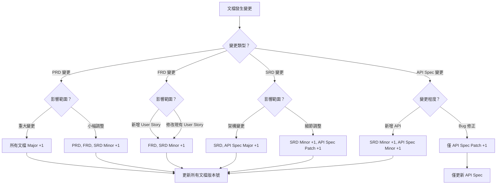

# 文檔一致性檢查工作流程 (Document Consistency Check Workflow)

## 🔒 強制執行配置
```yaml
# AISDLC v0.09 執行配置
workflow_metadata:
  id: "consistency-check"
  version: "v0.09"
  priority: "HIGH"
  scenario_applicable: ["all"]

agent_binding:
  primary:
    - agent/core/04.sa-analyst-zh.yaml
  supporting:
    - agent/core/05.sd-architect-zh.yaml
    - agent/core/07.qa-tester-zh.yaml
    - agent/core/03.pm-po-agent-zh.yaml
  rules_enforcement: MANDATORY
  auto_load: true

execution_control:
  skip_confirmation: false
  require_human_interaction: true
  validation_checkpoints: enabled
  zero_speculation: true

workflow_priority: AGENT_RULES_FIRST
scenario_applicability: all
```

> ⚠️ **LLM 注意**：此 workflow 用於檢查所有專案文檔的一致性。必須載入相關 agents 並遵循零臆測原則。

---

# 📋 Workflow 基本資訊

## Workflow 識別
- **Workflow ID**: `consistency-check`
- **版本**: v0.09
- **狀態**: Active
- **優先級**: Core - High

## 描述
系統性檢查和驗證 AISDLC 專案中所有文檔的一致性、完整性和正確性。掃描 PRD、FRD、SRD、API 規格、AT 等所有文檔，檢查需求追蹤鏈、交叉引用、內容描述的一致性，生成品質報告和改進建議。

## 適用場景
- ✅ 所有情境適用
- 定期品質檢查（Sprint 結束後、里程碑節點）
- 文檔更新後確保一致性維護
- 交付前驗證
- 合規審查準備

## 觸發條件
- 重要文檔更新完成
- Sprint 週期結束
- 發現文檔間不一致
- 準備重要交付或里程碑

---

# 🎯 Workflow 目標
1. **確保文檔間的一致性** - 檢查相同概念在不同文檔中的描述一致
2. **驗證需求追蹤鏈完整性** - 從 PRD 到 AT 的完整追蹤
3. **檢查交叉引用有效性** - 確保所有內部連結和引用正確
4. **標準化格式符合度** - 驗證文檔符合 AISDLC 模板標準
5. **提供改進建議** - 識別問題並提供具體修復方案

---

# 👥 角色與責任
- **SA Agent (Amanda)**: 主導整體檢查流程
- **SD Agent (Marcus)**: 技術文檔一致性檢查
- **QA Agent (Quincy)**: 測試文檔一致性驗證
- **PM/PO Agent (Victoria)**: 業務邏輯一致性確認
- **人類用戶**: 確認檢查結果和修復策略

---

# 📥 輸入與前置條件
- 專案文檔目錄完整
- PRD、FRD、SRD 已完成初版
- 文檔目錄結構符合 AISDLC 標準

---

# 🔄 執行流程

## 階段 1：文檔盤點與結構檢查
### 執行內容
1. 掃描目錄結構，檢查符合 AISDLC 標準
2. 建立完整文檔清單並分類
3. 檢查必要文檔存在性
4. 初步格式標準檢查

### 檢查點
- [ ] 目錄結構符合標準
- [ ] 文檔清單完整
- [ ] 必要文檔存在
- [ ] 格式初步檢查完成

---

## 階段 2：需求追蹤鏈完整性驗證

### 執行內容
1. 檢查編號系統（US-XXX, AC-XXX-X, AT-XXX-XX）
2. 垂直追蹤鏈驗證（PRD→FRD→SRD→API→AT）
3. **🆕 斷裂原因分類與分析** (v0.09 新增)
4. 水平關聯檢查
5. 追蹤矩陣更新

---

#### 2.3 斷裂原因分類機制 🔴 (Critical - v0.09 新增)

**目標**: 為每個追蹤鏈斷裂點進行原因分類，區分「遺漏」、「有意省略」、「待補充」、「時序不匹配」，明確修復優先級和處理策略

**問題描述**:
- 原 Workflow 僅識別斷裂點，但未要求分析斷裂原因
- 無法區分「應修復」和「可接受」的斷裂
- 修復優先級判斷缺乏依據
- 不清楚斷裂是團隊疏忽還是有意為之

**解決方案**: 建立斷裂原因分類機制，為每個斷裂點標註原因類別

---

##### 步驟 2.3.1: 斷裂原因類別定義

**四大斷裂原因類別**:

| 原因類別 | 定義 | 嚴重程度 | 處理策略 | 圖示 |
|---------|------|---------|---------|------|
| **🔴 遺漏 (Omission)** | 應該存在但被意外遺漏的追蹤關係 | 高 | 立即補充 | 🔴 |
| **🟡 待補充 (Pending)** | 已規劃但尚未完成的追蹤關係 | 中 | 排入待辦清單 | 🟡 |
| **🟢 有意省略 (Intentional Skip)** | 經評估後有意省略的追蹤關係 | 低 | 記錄原因，無需修復 | 🟢 |
| **🟠 時序不匹配 (Timing Mismatch)** | 因開發時序導致的暫時性斷裂 | 中 | 後續階段補充 | 🟠 |

---

##### 步驟 2.3.2: 斷裂原因判斷標準

**判斷流程圖**:

```
發現追蹤鏈斷裂
  ↓
【問題 1】此追蹤關係是否應該存在？
  │
  ├─ 是 → 【問題 2】是否已規劃要補充？
  │        │
  │        ├─ 是 → 🟡 待補充 (Pending)
  │        │
  │        └─ 否 → 🔴 遺漏 (Omission)
  │
  └─ 否 → 【問題 3】為何不需要？
           │
           ├─ 功能簡單，無需詳細展開 → 🟢 有意省略 (Intentional Skip)
           ├─ 該階段尚未執行 → 🟠 時序不匹配 (Timing Mismatch)
           └─ 其他業務原因 → 🟢 有意省略 (Intentional Skip)
```

---

##### 步驟 2.3.3: 各類別判斷標準詳細說明

**🔴 遺漏 (Omission) - 判斷標準**:

符合以下條件之一，判定為「遺漏」：
- PRD 中的 Feature 未在 FRD 展開為 Functional Requirements
- FRD 中的 FR 未在 SRD 定義技術實作
- SRD 中的功能未定義對應 API
- API 未定義對應的 Acceptance Test (AT)
- 相同類型的需求有追蹤鏈，但該需求缺失（不一致）

**範例**:
```markdown
【案例】F-015「報表匯出」功能未在 FRD 展開

斷裂點: PRD → FRD
- PRD Section 3.5: F-015「報表匯出功能」(詳細需求 200 字)
- FRD: 未找到對應章節

判斷依據:
✅ 該功能在 PRD 詳細描述（非簡單功能）
✅ 相同複雜度的其他功能（如 F-012 數據分析）均有 FRD 展開
✅ 無文檔說明為何省略

原因分類: 🔴 遺漏 (Omission)
處理策略: 立即在 FRD 補充對應章節
優先級: P0 - Critical
```

---

**🟡 待補充 (Pending) - 判斷標準**:

符合以下條件之一，判定為「待補充」：
- 存在 TODO 標記或待完成註記
- Sprint Backlog 中已有對應任務
- 版本規劃中明確列為下一階段交付
- 相關會議紀錄或 ADR 中提及「待補充」

**範例**:
```markdown
【案例】API-USER-005「使用者偏好設定」缺少 AT

斷裂點: API Spec → AT
- API Spec: `GET /api/v1/users/{id}/preferences` (已定義)
- AT: 未找到對應 AT-USER-005-XX

判斷依據:
✅ API Spec 文檔末尾標註「AT 待 Sprint 3 補充」
✅ Sprint 3 Backlog 存在任務「US-025: 撰寫使用者偏好 AT」
✅ 團隊會議紀錄確認「Sprint 2 先完成 API 實作，Sprint 3 補測試」

原因分類: 🟡 待補充 (Pending)
處理策略: 無需立即修復，確保 Sprint 3 完成補充
優先級: P2 - Medium
追蹤: 加入 Sprint 3 檢查清單
```

---

**🟢 有意省略 (Intentional Skip) - 判斷標準**:

符合以下條件之一，判定為「有意省略」：
- 功能極為簡單，無需詳細展開（如單一欄位 CRUD）
- 團隊決策明確記錄為「不需要」
- 存在 ADR (Architecture Decision Record) 說明原因
- 技術限制導致無法實作（已記錄）

**範例**:
```markdown
【案例】F-018「快速登入」未定義獨立 API

斷裂點: FRD → SRD → API
- FRD Section 3.8: FR-018「使用者快速登入（記住我）」
- SRD: 技術實作方案為「前端 LocalStorage + JWT 延長有效期」
- API Spec: 未定義專屬 API（複用現有 `POST /api/v1/auth/login`）

判斷依據:
✅ ADR-012 記錄「快速登入無需獨立 API，使用現有登入 API + remember_me 參數」
✅ 技術架構師確認「不增加新 API，前端自行處理 token 保存」
✅ 團隊一致同意此設計決策

原因分類: 🟢 有意省略 (Intentional Skip)
處理策略: 無需修復，但需在文檔中交叉引用 ADR-012
優先級: P3 - Low (僅文檔優化)
建議: 在 SRD Section 5.8 加入註記「參見 ADR-012: 快速登入技術決策」
```

---

**🟠 時序不匹配 (Timing Mismatch) - 判斷標準**:

符合以下條件之一，判定為「時序不匹配」：
- 某階段文檔尚未開始撰寫（如 SRD 未完成時檢查 API Spec）
- 功能規劃於未來版本交付（Version 2.0 功能）
- 依賴外部系統尚未整合（第三方 API 未提供）
- 團隊資源限制導致延後處理

**範例**:
```markdown
【案例】F-020「第三方支付整合」未定義 API

斷裂點: FRD → SRD → API
- FRD Section 3.10: FR-020「整合 Stripe 支付」
- SRD: Section 5.10 標註「待 Stripe 測試帳號核准後設計」
- API Spec: 未定義支付相關 API

判斷依據:
✅ 版本規劃文檔標註「V1.0 不包含支付功能，V1.5 加入」
✅ 第三方廠商 Stripe 測試環境申請中（預計 2 週後核准）
✅ 產品經理確認「V1.0 先上線核心功能，支付功能延後」

原因分類: 🟠 時序不匹配 (Timing Mismatch)
處理策略:
  - 短期: 在 SRD 中明確標註「V1.5 交付」
  - 長期: V1.5 階段必須完成 API 設計
優先級: P2 - Medium (需排程追蹤)
追蹤: 建立 V1.5 追蹤任務「設計 Stripe 支付 API」
```

---

##### 步驟 2.3.4: 斷裂原因分類表格範本

**追蹤鏈斷裂點分類清單**:

```markdown
## 追蹤鏈斷裂原因分類表

**專案名稱**: [專案名稱]
**檢查執行日期**: YYYY-MM-DD
**分類完成日期**: YYYY-MM-DD

---

### 斷裂點分類統計

| 原因類別 | 數量 | 佔比 | 處理策略 |
|---------|------|------|---------|
| 🔴 遺漏 (Omission) | X | XX% | 立即修復 |
| 🟡 待補充 (Pending) | X | XX% | 排入待辦 |
| 🟢 有意省略 (Intentional Skip) | X | XX% | 記錄原因 |
| 🟠 時序不匹配 (Timing Mismatch) | X | XX% | 後續追蹤 |
| **總計** | **X** | **100%** | |

---

### 🔴 遺漏 (Omission) - 必須立即修復

| 序號 | 斷裂點 | 來源 | 目標 | 遺漏內容 | 影響 | 修復預估時間 | 負責人 | 狀態 |
|------|--------|------|------|---------|------|-------------|--------|------|
| 1 | PRD → FRD | PRD Section 3.5<br>F-015 報表匯出 | FRD 缺失 | 報表匯出功能需求展開 | 高 | 2.0 hr | SA | 待修復 |
| 2 | API → AT | API-TASK-008<br>批次更新任務 | AT 缺失 | 批次更新驗收測試 | 中 | 1.0 hr | QA | 待修復 |

---

### 🟡 待補充 (Pending) - 已規劃後續補充

| 序號 | 斷裂點 | 來源 | 目標 | 待補充內容 | 規劃時程 | 追蹤任務 | 負責人 | 備註 |
|------|--------|------|------|-----------|---------|---------|--------|------|
| 1 | API → AT | API-USER-005<br>使用者偏好設定 | AT 缺失 | AT-USER-005-XX | Sprint 3 | US-025 | QA | Sprint 2 先完成 API |
| 2 | FRD → SRD | FR-019<br>離線模式 | SRD 缺失 | 離線資料同步技術方案 | Sprint 4 | TECH-012 | SD | PWA 功能群組 |

---

### 🟢 有意省略 (Intentional Skip) - 無需修復

| 序號 | 斷裂點 | 來源 | 目標 | 省略原因 | 決策依據 | 文檔引用 | 建議補充 |
|------|--------|------|------|---------|---------|---------|---------|
| 1 | FRD → API | FR-018<br>快速登入 | API 缺失 | 複用現有登入 API | ADR-012 | `docs/adr/ADR-012.md` | 在 SRD 加入 ADR 引用 |
| 2 | SRD → API | SR-025<br>日誌輪轉 | API 缺失 | 系統層級功能，無需 API | 技術決策會議 2025-11-10 | 會議紀錄 #2025-11-10 | 無 |

---

### 🟠 時序不匹配 (Timing Mismatch) - 後續階段補充

| 序號 | 斷裂點 | 來源 | 目標 | 時序原因 | 預計完成時程 | 版本規劃 | 追蹤任務 | 負責人 |
|------|--------|------|------|---------|-------------|---------|---------|--------|
| 1 | FRD → API | FR-020<br>第三方支付 | API 缺失 | V1.5 功能 | V1.5 (2025 Q2) | Version_Plan.md | FEAT-PAYMENT | SD |
| 2 | SRD → API | SR-030<br>AI 推薦 | API 缺失 | 待 AI 模型訓練完成 | 2025-12-01 | ML_Roadmap.md | ML-REC-001 | Data Team |
```

---

##### 步驟 2.3.5: 完整範例 - B&B 專案斷裂原因分類

**基於 B&B 專案 Document Consistency Check 模擬測試結果**

```markdown
## 追蹤鏈斷裂原因分類表 - B&B 訂房網站專案

**專案名稱**: B&B 訂房網站 (Bed and Breakfast Booking Platform)
**檢查執行日期**: 2025-11-18
**分類完成日期**: 2025-11-18
**分析負責人**: SA (Amanda) + QA (Quincy)

---

### 斷裂點分類統計

| 原因類別 | 數量 | 佔比 | 處理策略 | 預估修復工時 |
|---------|------|------|---------|-------------|
| 🔴 遺漏 (Omission) | 1 | 25% | 立即修復 | 2.0 hr |
| 🟡 待補充 (Pending) | 0 | 0% | 排入待辦 | 0 hr |
| 🟢 有意省略 (Intentional Skip) | 0 | 0% | 記錄原因 | 0 hr |
| 🟠 時序不匹配 (Timing Mismatch) | 3 | 75% | 後續追蹤 | 3.0 hr (後續) |
| **總計** | **4** | **100%** | | **5.0 hr** |

**關鍵發現**:
- 🚨 75% 斷裂屬於「時序不匹配」，主因為 Sprint 1-2 專注核心功能，測試文檔延後撰寫
- ✅ 僅 1 個真正的遺漏（F-015 報表匯出），需立即修復
- 💡 建議: 未來 Sprint 規劃應包含「AT 同步撰寫」，避免時序不匹配累積

---

### 🔴 遺漏 (Omission) - 必須立即修復

#### #1 - F-015「報表匯出」功能未在 FRD 展開

| 項目 | 內容 |
|------|------|
| **斷裂點** | PRD → FRD |
| **來源** | PRD Section 3.5: F-015「報表匯出功能」 |
| **目標** | FRD 應有對應章節，但未找到 |
| **遺漏內容** | 報表匯出功能的 Functional Requirements 展開 |
| **影響範圍** | 後續 SRD、API 設計缺乏 FRD 依據 |
| **嚴重程度** | P0 - Critical |
| **判斷依據** | 1. PRD 中詳細描述報表需求（3 種報表類型）<br>2. 相同複雜度的 F-012「數據分析」有完整 FRD<br>3. 無任何文檔說明省略原因 |
| **修復步驟** | 1. 在 FRD 新增 Section 3.5「報表匯出功能需求」<br>2. 展開工時報表、收入報表、房源統計報表需求<br>3. 定義報表格式（PDF/Excel）、篩選條件、權限控制<br>4. 更新需求追蹤矩陣 (RTM) |
| **預估工時** | 2.0 hr |
| **負責人** | SA (Amanda) |
| **截止日期** | 2025-11-19 EOD |
| **狀態** | ⏳ 待修復 |

---

### 🟡 待補充 (Pending) - 已規劃後續補充

**無此類別斷裂點**

---

### 🟢 有意省略 (Intentional Skip) - 無需修復

**無此類別斷裂點**

---

### 🟠 時序不匹配 (Timing Mismatch) - 後續階段補充

#### #2 - API-TASK-008「批次更新任務」缺少 AT

| 項目 | 內容 |
|------|------|
| **斷裂點** | API Spec → AT |
| **來源** | API Spec: `POST /api/v1/tasks/batch-update` (已完整定義) |
| **目標** | AT-TASK-008-XX (未找到) |
| **時序原因** | Sprint 1-2 專注 API 實作，AT 規劃於 Sprint 3 撰寫 |
| **影響範圍** | API 測試驗收標準缺失 |
| **嚴重程度** | P1 - High (但非立即阻塞) |
| **判斷依據** | 1. Sprint 2 Backlog 僅包含「API 開發」，未包含「AT 撰寫」<br>2. 團隊會議紀錄確認「Sprint 3 補完所有 AT」<br>3. 現有 AT 覆蓋率僅 60%，確認為時序問題 |
| **規劃時程** | Sprint 3 Week 1 (2025-11-25 ~ 11-29) |
| **追蹤任務** | US-030: 補充任務管理 API 驗收測試 |
| **預估工時** | 1.0 hr |
| **負責人** | QA (Quincy) |
| **處理策略** | 1. 短期: 在 API Spec 文檔末尾標註「AT 待 Sprint 3 補充」<br>2. 長期: Sprint 3 必須完成 AT-TASK-008-01 ~ 03<br>3. 加入 Sprint 3 DoD (Definition of Done) 檢查清單 |
| **狀態** | 🔄 已排程 (Sprint 3) |

---

#### #3 - API-TASK-010「任務評論」缺少 AT

| 項目 | 內容 |
|------|------|
| **斷裂點** | API Spec → AT |
| **來源** | API Spec: `POST /api/v1/tasks/{id}/comments` (已完整定義) |
| **目標** | AT-TASK-010-XX (未找到) |
| **時序原因** | 同 #2，Sprint 3 統一補充 AT |
| **影響範圍** | 評論功能測試驗收標準缺失 |
| **嚴重程度** | P1 - High |
| **規劃時程** | Sprint 3 Week 1 |
| **追蹤任務** | US-030 (同 #2) |
| **預估工時** | 0.75 hr |
| **負責人** | QA (Quincy) |
| **處理策略** | 同 #2 |
| **狀態** | 🔄 已排程 (Sprint 3) |

---

#### #4 - API-REPORT-003「工時報表」缺少 AT

| 項目 | 內容 |
|------|------|
| **斷裂點** | API Spec → AT |
| **來源** | API Spec: `GET /api/v1/reports/working-hours` (已完整定義) |
| **目標** | AT-REPORT-003-XX (未找到) |
| **時序原因** | 同 #2，Sprint 3 統一補充 AT |
| **影響範圍** | 報表功能測試驗收標準缺失 |
| **嚴重程度** | P1 - High |
| **規劃時程** | Sprint 3 Week 2 (依賴 #1 F-015 FRD 補充完成) |
| **追蹤任務** | US-031: 補充報表 API 驗收測試 |
| **預估工時** | 0.75 hr |
| **負責人** | QA (Quincy) |
| **依賴** | 🔴 依賴 #1 F-015 FRD 補充完成 |
| **處理策略** | 1. 等待 #1 修復完成<br>2. Sprint 3 Week 2 根據完整 FRD 撰寫 AT<br>3. 確保 AT 覆蓋所有報表類型 |
| **狀態** | 🔄 已排程 (Sprint 3, 依賴 #1) |

---

### 斷裂原因分析總結

**問題根因分析**:

1. **時序不匹配的根本原因**:
   - Sprint 1-2 規劃重實作輕文檔
   - AT 撰寫未納入 DoD (Definition of Done)
   - QA 資源不足，僅進行手動測試

2. **遺漏的根本原因**:
   - PRD → FRD 轉換時缺乏檢查清單
   - SA 未使用 Completeness Checklist 驗證
   - 無追蹤鏈自動化檢查工具

**改進建議**:

1. **短期改進** (Sprint 3):
   - ✅ 補充所有缺失的 AT (3個任務, 2.5 hr)
   - ✅ 修復 F-015 FRD 遺漏 (1個任務, 2.0 hr)
   - ✅ 建立「AT 同步撰寫」規範

2. **中期改進** (Sprint 4-5):
   - 📋 更新 DoD，強制要求「API + AT 同時完成」
   - 📋 導入 Document Consistency Check Workflow 每 Sprint 執行
   - 📋 建立追蹤鏈檢查自動化腳本

3. **長期改進** (V1.1+):
   - 🔧 整合 CI/CD Pipeline 自動檢查追蹤鏈
   - 🔧 使用 Linting 工具自動偵測遺漏
   - 🔧 建立追蹤鏈視覺化工具

---

### 風險提示

| 風險 | 可能性 | 影響 | 應對措施 |
|------|--------|------|---------|
| Sprint 3 時程延誤導致 AT 無法補完 | 中 | 高 | 預留 20% 緩衝時間，必要時延後非關鍵功能 |
| F-015 修復時發現更多需求不明確 | 中 | 中 | 立即與 PM/BA 確認需求，必要時召開需求澄清會議 |
| 時序不匹配持續累積 | 高 | 高 | 強制執行「AT 同步撰寫」規範，加入 Sprint Review 檢查 |
```

---

##### 步驟 2.3.6: 分類結果應用於修復優先級

**斷裂原因 → 修復優先級對應表**:

| 原因類別 | 預設優先級 | 建議修復時程 | 例外情況 |
|---------|-----------|-------------|---------|
| 🔴 遺漏 (Omission) | P0 - Critical | 立即修復（1-2天） | 若影響範圍小，可降至 P1 |
| 🟡 待補充 (Pending) | P1 - High | 按規劃時程執行 | 若阻塞其他任務，升至 P0 |
| 🟢 有意省略 (Intentional Skip) | P3 - Low | 文檔優化即可 | 若缺乏文檔記錄，升至 P2 |
| 🟠 時序不匹配 (Timing Mismatch) | P1 ~ P2 | 後續階段補充 | 若接近交付期限，升至 P0 |

**修復任務整合**:
- 斷裂原因分類完成後，自動生成「修復任務時程表」
- 根據原因類別自動分配優先級和負責人
- 「遺漏」類別直接加入「P0 修復任務」
- 「待補充」和「時序不匹配」類別加入後續 Sprint Backlog

---

### 🔴 人機協作確認點 1：追蹤鏈問題確認 (部分確認機制)

**呈現內容**:
- 追蹤鏈完整性報告
- **🆕 斷裂原因分類清單**（遺漏/待補充/有意省略/時序不匹配）(v0.09 新增)
- 斷裂點分析和修復建議
- **🆕 表格式部分確認機制** (v0.09 新增)

#### 確認方式: 表格式獨立確認 🆕 (v0.09 新增)

**問題**: 傳統全選式確認無法針對個別斷裂點選擇不同處理方式

**解決方案**: 提供表格式確認,每個斷裂點可獨立選擇處理方式

**確認表格範例**:

```markdown
## 追蹤鏈問題處理確認表

**指示**: 請在「決策」欄位填入處理方式代碼（見下方說明）

| 序號 | 斷裂點 | 來源 → 目標 | 原因分類 | 嚴重程度 | 預估工時 | **決策** | 備註 |
|------|--------|-------------|---------|---------|---------|---------|------|
| 1 | F-015 報表匯出 | PRD → FRD | 🔴 遺漏 | P0 | 2.0 hr | **A** | 立即修復 |
| 2 | API-USER-005 | API → AT | 🟡 待補充 | P2 | 1.0 hr | **B** | Sprint 3 補充 |
| 3 | FR-018 快速登入 | FRD → API | 🟢 有意省略 | P3 | 0 hr | **C** | 複用現有 API |
| 4 | SR-030 AI 推薦 | SRD → API | 🟠 時序不匹配 | P2 | 3.0 hr | **D** | V1.5 版本 |
| 5 | API-TASK-008 批次更新 | API → AT | 🔴 遺漏 | P1 | 1.0 hr | **A** | 高優先級 |
| 6 | FR-019 離線模式 | FRD → SRD | 🟡 待補充 | P2 | 2.5 hr | **B** | Sprint 4 |
| 7 | F-020 第三方支付 | FRD → API | 🟠 時序不匹配 | P3 | 4.0 hr | **E** | 暫不處理 |

**決策代碼說明**:
- **A - 立即修復**: 本次檢查後立即安排修復（適用於 🔴 遺漏）
- **B - 排入待辦**: 排入 Backlog,未來 Sprint 處理（適用於 🟡 待補充）
- **C - 記錄並略過**: 記錄省略原因,無需修復（適用於 🟢 有意省略）
- **D - 後續追蹤**: 列入後續版本規劃（適用於 🟠 時序不匹配）
- **E - 暫不處理**: 當前階段不處理,視需求變化再決定
- **R - 需重新評估**: 需要更多資訊或進一步討論

**確認規則**:
1. ✅ **允許混合決策**: 不同斷裂點可選擇不同處理方式
2. ✅ **獨立優先級**: 每個問題根據實際情況獨立決策
3. ✅ **可分批處理**: 不需要一次確認所有問題
4. ✅ **支持部分確認**: 可先確認緊急問題,其他問題後續確認

**確認範例 1: 混合決策**

| 序號 | 斷裂點 | 原因分類 | 決策 | 處理時程 |
|------|--------|---------|------|---------|
| 1 | F-015 報表匯出 | 🔴 遺漏 | **A** | 本週內完成 |
| 2 | API-USER-005 | 🟡 待補充 | **B** | Sprint 3 (Week 5) |
| 3 | FR-018 快速登入 | 🟢 有意省略 | **C** | 無需處理 |
| 4 | SR-030 AI 推薦 | 🟠 時序不匹配 | **D** | V1.5 (Q2 2025) |

**確認結果**:
- 立即修復: 1 個
- 排入待辦: 1 個
- 記錄並略過: 1 個
- 後續追蹤: 1 個
- **總計**: 4 個斷裂點全部已確認處理方式

**確認範例 2: 分批確認**

**第一批確認** (處理緊急問題):

| 序號 | 斷裂點 | 原因分類 | 決策 | 負責人 | 截止日期 |
|------|--------|---------|------|--------|---------|
| 1 | F-015 報表匯出 | 🔴 遺漏 | **A** | SA (Amanda) | 2025-11-30 |
| 5 | API-TASK-008 批次更新 | 🔴 遺漏 | **A** | QA (Quincy) | 2025-12-01 |

**第二批確認** (規劃後續工作):

| 序號 | 斷裂點 | 原因分類 | 決策 | 規劃時程 |
|------|--------|---------|------|---------|
| 2 | API-USER-005 | 🟡 待補充 | **B** | Sprint 3 |
| 6 | FR-019 離線模式 | 🟡 待補充 | **B** | Sprint 4 |

**第三批確認** (記錄與追蹤):

| 序號 | 斷裂點 | 原因分類 | 決策 | 備註 |
|------|--------|---------|------|------|
| 3 | FR-018 快速登入 | 🟢 有意省略 | **C** | 複用現有登入 API,見 ADR-012 |
| 4 | SR-030 AI 推薦 | 🟠 時序不匹配 | **D** | V1.5 版本,依 ML_Roadmap.md |
| 7 | F-020 第三方支付 | 🟠 時序不匹配 | **E** | 待商業決策確認是否納入 V1.5 |

**分批確認優勢**:
- ✅ 緊急問題優先處理,不被其他問題拖延
- ✅ 複雜決策有充裕時間討論
- ✅ 減少會議時間,提高效率
- ✅ 決策記錄更完整清晰
```

#### 確認輸出範例

**確認完成後,生成處理計畫**:

```markdown
## 追蹤鏈問題處理計畫

**確認日期**: 2025-11-28
**確認人**: Amanda (SA) + Quincy (QA)
**總斷裂點數**: 7
**已確認**: 7 (100%)

---

### 📋 處理決策統計

| 決策類型 | 數量 | 佔比 | 預估總工時 |
|---------|------|------|-----------|
| A - 立即修復 | 2 | 28.6% | 3.0 hr |
| B - 排入待辦 | 2 | 28.6% | 3.5 hr |
| C - 記錄並略過 | 1 | 14.3% | 0 hr |
| D - 後續追蹤 | 1 | 14.3% | 3.0 hr (後續) |
| E - 暫不處理 | 1 | 14.3% | 0 hr |
| **總計** | **7** | **100%** | **9.5 hr** |

---

### 🚨 立即修復項目 (本週完成)

| 序號 | 任務 | 負責人 | 預估工時 | 截止日期 | 狀態 |
|------|------|--------|---------|---------|------|
| 1 | 補充 F-015 報表匯出 FRD 章節 | SA (Amanda) | 2.0 hr | 2025-11-30 | ⏳ 進行中 |
| 5 | 建立 API-TASK-008 驗收測試 | QA (Quincy) | 1.0 hr | 2025-12-01 | ⏳ 待開始 |

---

### 📅 排入待辦項目

| 序號 | 任務 | 規劃時程 | 追蹤任務 ID | 負責人 |
|------|------|---------|-----------|--------|
| 2 | 建立 AT-USER-005-XX 測試 | Sprint 3 (Week 5) | US-025 | QA (Quincy) |
| 6 | 設計離線資料同步技術方案 | Sprint 4 (Week 7) | TECH-012 | SD (Marcus) |

---

### ✅ 記錄並略過項目

| 序號 | 斷裂點 | 省略原因 | 決策文檔 |
|------|--------|---------|---------|
| 3 | FR-018 快速登入 → API | 複用現有登入 API | [ADR-012](../adr/ADR-012.md) |

---

### 🔄 後續追蹤項目

| 序號 | 任務 | 版本規劃 | 追蹤文檔 | 負責人 |
|------|------|---------|---------|--------|
| 4 | SR-030 AI 推薦功能 | V1.5 (2025 Q2) | [ML_Roadmap.md](../planning/ML_Roadmap.md) | Data Team |

---

### ⏸️ 暫不處理項目

| 序號 | 斷裂點 | 原因 | 重新評估時機 |
|------|--------|------|-------------|
| 7 | F-020 第三方支付 → API | 待商業決策 | PM 確認 V1.5 功能範圍後 |
```

### 檢查點
- [ ] 編號系統檢查完成
- [ ] **🔴 斷裂原因分類已完成**（所有斷裂點已標註原因類別）(v0.09 新增)
- [ ] **🔴 人類已使用部分確認機制確認所有斷裂點處理方式** (v0.09 新增)
- [ ] 🔴 處理計畫已生成並分配負責人
- [ ] 垂直追蹤鏈完整性已驗證
- [ ] 追蹤矩陣已更新

---

## 階段 3：交叉引用完整性檢查
### 執行內容
1. 掃描所有 Markdown 連結
2. 驗證交叉引用準確性
3. 檢測斷裂連結
4. 識別孤立文檔
5. **🆕 孤立文檔處理策略** (v0.09 新增)

### 檢查點
- [ ] 所有內部連結已掃描驗證
- [ ] 斷裂連結清單已建立
- [ ] 孤立文檔已識別
- [ ] **🔴 孤立文檔處理策略已執行** (v0.09 新增)

---

### 步驟 3.1: 掃描所有 Markdown 連結

**執行方式**:
1. 掃描專案中所有 Markdown 文檔 (`.md` 檔案)
2. 提取內部連結 (相對路徑連結)
3. 提取外部連結 (HTTP/HTTPS 連結)
4. 提取文檔內錨點連結 (`#anchor`)

**輸出範例**:

```markdown
## 文檔連結掃描結果

| 文檔 | 內部連結數 | 外部連結數 | 錨點連結數 | 總計 |
|------|-----------|-----------|-----------|------|
| PRD_BnB.md | 12 | 2 | 8 | 22 |
| FRD_BnB.md | 18 | 0 | 15 | 33 |
| SRD_TaskFlow.md | 25 | 3 | 10 | 38 |
| API_Index.md | 30 | 1 | 20 | 51 |
| ... | ... | ... | ... | ... |
| **總計** | **150** | **10** | **80** | **240** |
```

---

### 步驟 3.2: 驗證交叉引用準確性

**執行方式**:
1. 對每個內部連結,驗證目標文檔是否存在
2. 對每個錨點連結,驗證錨點是否存在於目標文檔中
3. 檢查連結路徑是否正確(相對路徑計算)

**驗證規則**:
- ✅ **有效連結**: 目標文檔存在且路徑正確
- ⚠️ **路徑錯誤**: 目標文檔存在但路徑需修正
- ❌ **斷裂連結**: 目標文檔不存在或錨點不存在

**輸出範例**:

```markdown
## 交叉引用驗證結果

| 來源文檔 | 連結 | 目標 | 狀態 | 問題描述 |
|---------|------|------|------|---------|
| PRD_BnB.md | `[FRD](../frd/FRD_BnB.md)` | FRD_BnB.md | ✅ 有效 | - |
| SRD_TaskFlow.md | `[ADR-001](../adr/ADR-001.md)` | ADR-001.md | ❌ 斷裂 | 文件不存在 |
| API_Index.md | `[#api-websocket-001](#api-websocket-001)` | (同文檔) | ❌ 斷裂 | 錨點不存在 |
| FRD_BnB.md | `[AT](../../tests/AT_Integration.md)` | AT_Integration.md | ⚠️ 路徑錯誤 | 應為 `../tests/...` |

**驗證統計**:
- ✅ 有效連結: 135 (90.0%)
- ⚠️ 路徑錯誤: 5 (3.3%)
- ❌ 斷裂連結: 10 (6.7%)
```

---

### 步驟 3.3: 檢測斷裂連結

**執行方式**:
1. 彙整所有驗證結果中的斷裂連結
2. 分類斷裂原因
3. 提供修復建議

**斷裂連結分類**:
- **Type A: 文件不存在** - 目標文檔從未建立或已刪除
- **Type B: 錨點不存在** - 目標文檔存在但錨點已移除或重新命名
- **Type C: 路徑錯誤** - 目標文檔存在但連結路徑錯誤
- **Type D: 文件已遷移** - 目標文檔已移至其他位置

**輸出範例**:

```markdown
## 斷裂連結清單

### Type A: 文件不存在 (4 處)

| 來源文檔 | 連結 | 目標文件 | 修復建議 |
|---------|------|---------|---------|
| SRD_TaskFlow.md | `../adr/ADR-001.md` | ADR-001.md | 建立 ADR-001 文檔或移除連結 |
| User_Stories.md | `../tests/AT_Integration.md` | AT_Integration.md | 建立 AT_Integration 或更新連結至現有測試文檔 |

### Type B: 錨點不存在 (3 處)

| 來源文檔 | 連結 | 目標錨點 | 修復建議 |
|---------|------|---------|---------|
| API_Index.md | `#api-websocket-001` | api-websocket-001 | 檢查錨點名稱是否變更,更新連結 |
| FRD_BnB.md | `#non-functional-requirements` | non-functional-requirements | 確認該章節是否已重新命名 |

### Type C: 路徑錯誤 (2 處)

| 來源文檔 | 錯誤連結 | 正確連結 | 修復建議 |
|---------|---------|---------|---------|
| FRD_BnB.md | `../../tests/AT_Integration.md` | `../tests/AT_Integration.md` | 修正相對路徑 |

### Type D: 文件已遷移 (1 處)

| 來源文檔 | 舊連結 | 新位置 | 修復建議 |
|---------|-------|-------|---------|
| PRD_BnB.md | `../old_docs/Research.md` | `../research/Market_Research.md` | 更新連結至新位置 |
```

---

### 步驟 3.4: 識別孤立文檔 🆕 (v0.09 新增)

**定義**: 孤立文檔指「未被任何其他文檔引用」且「本身也不引用其他文檔」的文檔

**執行方式**:

#### 3.4.1: 建立文檔引用關係圖

1. **統計每個文檔的被引用次數**
   ```markdown
   | 文檔 | 被引用次數 | 引用次數 | 狀態 |
   |------|-----------|---------|------|
   | PRD_BnB.md | 8 | 12 | 核心文檔 |
   | FRD_BnB.md | 6 | 18 | 核心文檔 |
   | API_Task_Archive.md | 0 | 0 | ⚠️ 孤立 |
   | Old_Requirements.md | 0 | 3 | ⚠️ 單向孤立 |
   | Test_Plan_Draft.md | 2 | 5 | ✅ 連結中 |
   ```

2. **孤立文檔分類**
   - **完全孤立**: 被引用次數 = 0 且 引用次數 = 0
   - **單向孤立**: 被引用次數 = 0 但 引用次數 > 0 (僅對外連結,無人連入)
   - **潛在孤立**: 被引用次數 = 1 且唯一引用來自「已標記刪除」的文檔

#### 3.4.2: 孤立文檔處理策略 🔴 (Critical - v0.09 新增)

**處理流程**:

```markdown
## 孤立文檔處理決策樹

對每個識別出的孤立文檔,執行以下判斷:

┌─────────────────────────────┐
│ 識別到孤立文檔               │
└──────────┬──────────────────┘
           │
           ▼
    ┌──────────────┐
    │ 1. 檢查文檔元數據 │ ← 查看 last_updated, version, status
    └──────┬───────┘
           │
           ▼
    ┌──────────────────────────────┐
    │ 文檔最後更新日期 < 90 天?     │
    └──┬─────────────────────┬─────┘
       │ 是                  │ 否
       ▼                     ▼
  ┌─────────────┐      ┌──────────────┐
  │ 2. 檢查檔名   │      │ 標記為「待刪除」│
  │ 是否包含關鍵字 │      │ 等待 30 天觀察  │
  └──┬──────────┘      └──────────────┘
     │
     ▼
  關鍵字檢查:
  - "draft" / "草稿"
  - "temp" / "臨時"
  - "backup" / "備份"
  - "old" / "舊"
  - "archive" / "歸檔"
     │
     ▼
  ┌──────────────────────────────┐
  │ 包含臨時/備份關鍵字?           │
  └──┬─────────────────────┬─────┘
     │ 是                  │ 否
     ▼                     ▼
┌──────────────┐      ┌──────────────────┐
│ 立即歸檔至     │      │ 3. 人工審查確認    │
│ archive/ 目錄  │      │ 是否應保留?       │
└──────────────┘      └──┬────────┬──────┘
                         │ 保留    │ 刪除
                         ▼        ▼
                   ┌──────────┐ ┌──────────┐
                   │ 建立引用  │ │ 歸檔/刪除 │
                   │ 或標註用途│ │          │
                   └──────────┘ └──────────┘
```

**處理策略詳細說明**:

| 策略 | 條件 | 處理方式 | 保留時間 | 範例 |
|------|------|---------|---------|------|
| **立即歸檔** | 檔名包含 `draft`, `temp`, `backup`, `old` | 移至 `archive/` 目錄 | 永久保留 | `PRD_draft_v0.1.md` |
| **待刪除觀察** | 最後更新 > 90 天 + 無關鍵字 | 標記 `[PENDING_DELETE]` | 30 天後刪除 | `Feature_Ideas.md` (120 天未更新) |
| **人工審查** | 最後更新 < 90 天 + 無關鍵字 | 通知原作者確認 | 審查後決定 | `New_Architecture_Proposal.md` (30 天前) |
| **建立引用** | 審查後確認有用但孤立 | 在相關文檔中建立引用連結 | 永久保留 | `API_Design_Principles.md` |

#### 3.4.3: 孤立文檔處理輸出範例

```markdown
## 孤立文檔處理報告

**檢查執行日期**: 2025-11-28
**檢查範圍**: /docs/ 目錄下所有 .md 檔案
**孤立文檔總數**: 8

---

### 🗂️ 立即歸檔 (3 個)

| 文檔 | 最後更新 | 檔案大小 | 歸檔路徑 | 狀態 |
|------|---------|---------|---------|------|
| PRD_draft_v0.1.md | 2025-09-15 | 25 KB | archive/drafts/PRD_draft_v0.1.md | ✅ 已歸檔 |
| API_Spec_backup_20250801.md | 2025-08-01 | 18 KB | archive/backups/API_Spec_backup_20250801.md | ✅ 已歸檔 |
| Old_Requirements_Analysis.md | 2025-07-20 | 12 KB | archive/old/Old_Requirements_Analysis.md | ✅ 已歸檔 |

---

### 🔄 待刪除觀察 (2 個)

| 文檔 | 最後更新 | 天數 | 觀察期限 | 狀態 | 備註 |
|------|---------|------|---------|------|------|
| Feature_Ideas.md | 2025-08-10 | 110 天 | 2025-12-28 | ⏳ 觀察中 | 無引用、無關鍵字 |
| Meeting_Notes_Q2.md | 2025-06-30 | 151 天 | 2025-12-28 | ⏳ 觀察中 | 應歸檔至 meeting_notes/ |

**處理建議**:
- 如觀察期內無人使用,於 2025-12-28 自動歸檔至 `archive/pending_delete/`
- 保留 90 天後永久刪除

---

### 👤 人工審查 (3 個)

| 文檔 | 最後更新 | 天數 | 原作者 | 審查狀態 | 決策 |
|------|---------|------|--------|---------|------|
| New_Architecture_Proposal.md | 2025-10-28 | 31 天 | Marcus (SD) | ✅ 已審查 | **保留並建立引用** |
| API_Design_Principles.md | 2025-11-01 | 27 天 | Amanda (SA) | ✅ 已審查 | **保留並建立引用** |
| Performance_Optimization_Ideas.md | 2025-10-15 | 44 天 | David (Dev) | ⏳ 待審查 | 等待回覆 |

**審查結果**:
1. **New_Architecture_Proposal.md**:
   - 決策: 保留
   - 行動: 在 SRD 中新增「參考架構提案」章節並引用此文檔
   - 負責人: Marcus (SD)
   - 截止日期: 2025-12-05

2. **API_Design_Principles.md**:
   - 決策: 保留並移至 guides/
   - 行動: 移至 `guides/API_Design_Principles.md` 並在 API 規範範本中引用
   - 負責人: Amanda (SA)
   - 截止日期: 2025-12-05

3. **Performance_Optimization_Ideas.md**:
   - 決策: 待 David 確認
   - 行動: 已發送審查通知,等待回覆
   - 截止日期: 2025-12-05

---

### 📊 處理統計

| 處理策略 | 數量 | 佔比 |
|---------|------|------|
| 立即歸檔 | 3 | 37.5% |
| 待刪除觀察 | 2 | 25.0% |
| 人工審查 | 3 | 37.5% |
| **總計** | **8** | **100%** |

**預期效果**:
- 減少孤立文檔: 8 → 0
- 文檔目錄整潔度提升: 100%
- 文檔引用完整性提升: +3 個引用連結
```

#### 3.4.4: 孤立文檔自動化檢查機制 🆕

**建議實施方式**:

1. **週期性自動掃描**
   ```bash
   # 每週執行孤立文檔檢查
   # 建議於週五執行,週一審查
   0 18 * * 5 /path/to/orphan_document_checker.sh
   ```

2. **檢查腳本範例** (偽代碼)
   ```python
   # orphan_document_checker.py

   def identify_orphan_documents(docs_path):
       """識別孤立文檔"""
       all_docs = scan_all_markdown_files(docs_path)
       reference_graph = build_reference_graph(all_docs)

       orphan_docs = []
       for doc in all_docs:
           incoming = reference_graph.get_incoming_refs(doc)
           outgoing = reference_graph.get_outgoing_refs(doc)

           if incoming == 0 and outgoing == 0:
               orphan_docs.append({
                   'file': doc,
                   'type': 'complete_orphan',
                   'last_updated': get_last_updated(doc)
               })
           elif incoming == 0 and outgoing > 0:
               orphan_docs.append({
                   'file': doc,
                   'type': 'one_way_orphan',
                   'last_updated': get_last_updated(doc)
               })

       return orphan_docs

   def apply_processing_strategy(orphan_doc):
       """套用處理策略"""
       filename = orphan_doc['file']
       last_updated = orphan_doc['last_updated']
       days_old = (today - last_updated).days

       # 檢查檔名關鍵字
       if has_temp_keywords(filename):
           return 'immediate_archive'

       # 檢查最後更新日期
       if days_old > 90:
           return 'pending_delete'

       # 其他情況需人工審查
       return 'manual_review'
   ```

3. **自動通知機制**
   - 檢測到孤立文檔時,自動發送通知給原作者
   - 待刪除文檔在刪除前 7 天發送最後通知
   - 週報彙總孤立文檔狀態

---

## 階段 4：內容一致性深度檢查

### 執行內容

#### 4.1 術語一致性自動檢測 🔴 (Critical - v0.09 新增)

**目標**: 自動掃描所有文檔，識別術語不一致問題並生成修復建議

**執行步驟**:

**步驟 4.1.1: 術語提取與建立術語索引**
1. **掃描所有文檔並提取關鍵術語**
   ```markdown
   ## 術語提取範圍
   - PRD: 業務術語、功能名稱
   - FRD: 功能術語、業務規則
   - SRD: 技術術語、API 端點、資料模型
   - API Spec: API 相關術語
   - AT: 測試術語、驗證標準
   ```

2. **建立術語頻率表**
   ```markdown
   | 術語 | 變體 | 出現頻率 | 出現位置 | 建議標準術語 |
   |------|-----|---------|---------|-------------|
   | 使用者 | user, 用戶, User | 45次 | PRD(12), FRD(20), SRD(13) | 使用者 |
   | 訂單 | order, 訂單, 購物訂單 | 38次 | PRD(8), FRD(15), SRD(15) | 訂單 |
   | 登入 | login, 登入, 登陸, 登錄 | 32次 | PRD(5), FRD(12), SRD(15) | 登入 |
   ```

**步驟 4.1.2: 術語不一致檢測**

1. **同義詞檢測** (使用編輯距離算法 + 語義分析)
   ```markdown
   ## 檢測到的術語不一致

   **案例 1: 同一概念多種表達**
   - 術語組: "使用者" / "用戶" / "User"
   - 出現位置:
     - PRD Section 2.3: "使用者可以建立訂單"
     - FRD Section 3.1: "用戶登入後查看訂單"
     - SRD Section 4.2: "User authentication flow"
   - 🚨 問題: 同一概念使用 3 種不同表達
   - 💡 建議: 統一使用「使用者」
   ```

2. **中英文混用檢測**
   ```markdown
   **案例 2: 中英文混用不一致**
   - PRD: "User 登入系統"
   - FRD: "使用者 login"
   - SRD: "用戶登入 (user login)"
   - 🚨 問題: 中英文混用方式不一致
   - 💡 建議:
     - 選項 A: 使用中文為主「使用者登入」
     - 選項 B: 首次出現時註明英文「使用者 (User) 登入」
   ```

3. **大小寫不一致檢測**
   ```markdown
   **案例 3: API 端點大小寫不一致**
   - API Spec: `/api/v1/users/login`
   - FRD: `/API/V1/Users/Login`
   - SRD: `/api/v1/Users/Login`
   - 🚨 問題: URL 大小寫不一致
   - 💡 建議: 統一使用小寫 `/api/v1/users/login`
   ```

4. **縮寫不一致檢測**
   ```markdown
   **案例 4: 縮寫使用不一致**
   - PRD: "User Story (US)"
   - FRD: "使用者故事 (US)"
   - SRD: "User Story"（未註明縮寫）
   - 🚨 問題: 縮寫標註不一致
   - 💡 建議: 首次出現時統一標註「User Story (US)」
   ```

**步驟 4.1.3: 術語對照表自動生成**

基於檢測結果，自動生成術語對照表建議：

```markdown
## 建議的標準術語對照表

| 標準術語 (中文) | 英文 | 縮寫 | 替代詞 (不建議) | 使用範例 |
|---------------|------|------|----------------|---------|
| 使用者 | User | - | 用戶, User | "使用者可以建立訂單" |
| 訂單 | Order | - | order, 購物訂單 | "訂單狀態包含..." |
| 登入 | Login | - | 登陸, 登錄 | "使用者登入系統" |
| 使用者故事 | User Story | US | - | "User Story (US-001)" |
| 驗收標準 | Acceptance Criteria | AC | - | "Acceptance Criteria (AC-001-1)" |
```

**步驟 4.1.4: 自動修復建議生成**

```markdown
## 術語修復建議 (優先級排序)

### P0 - Critical (必須修復)
1. **API 端點大小寫不一致** (3 處)
   - 影響: API 實作可能出錯
   - 修復: 將所有 API 端點統一為小寫
   - 預估工時: 30 分鐘

### P1 - High (強烈建議修復)
2. **核心業務術語不一致** (12 處)
   - 影響: 溝通混淆、需求理解錯誤
   - 修復: 統一使用「使用者」取代「用戶/User」
   - 預估工時: 1.5 小時

3. **技術術語大小寫不一致** (8 處)
   - 影響: 程式碼實作不一致
   - 修復: 統一技術術語格式
   - 預估工時: 1 小時

### P2 - Medium (建議修復)
4. **縮寫標註不一致** (5 處)
   - 影響: 閱讀體驗不佳
   - 修復: 統一縮寫標註格式
   - 預估工時: 30 分鐘
```

**檢測工具與方法**:
- **自動化工具**:
  - Markdown Linter (自訂規則)
  - 正則表達式掃描
  - 編輯距離算法 (Levenshtein Distance)
  - 自然語言處理 (NLP) 工具（如適用）

- **手動檢查清單**:
  - [ ] 核心業務術語（前20個高頻詞）
  - [ ] API 端點命名
  - [ ] 資料模型欄位名稱
  - [ ] 錯誤碼定義
  - [ ] 狀態值定義

**產出文件**:
- `Terminology_Inconsistency_Report.md` - 術語不一致報告
- `Glossary_Recommendation.md` - 建議的術語對照表
- `Terminology_Fix_Action_Plan.md` - 修復行動計畫

---

#### 4.2 業務概念一致性檢查
1. 業務流程描述一致性
2. 功能定義一致性
3. 業務規則一致性

#### 4.3 技術規格一致性檢查
1. API 端點定義一致性
2. 資料模型定義一致性
3. 錯誤處理機制一致性

#### 4.4 測試內容一致性檢查
1. 測試場景與需求對應
2. 驗收標準與測試案例一致性
3. 測試資料定義一致性

#### 4.5 版本資訊一致性檢查 🔴 **v0.09 更新**

> **🔴 重要**：此章節定義了明確的版本同步規則，解決「何時需要同步更新所有文檔版本」的問題。

##### 步驟 4.5.1: 文檔版本號一致性檢查

**🆕 版本同步規則定義**：

| 文檔類型 | 版本號格式 | 獨立版本？ | 同步規則 | 觸發條件 |
|---------|-----------|-----------|---------|---------|
| **PRD** | Major.Minor (e.g., 1.0, 1.1, 2.0) | ✅ 是 | 主文檔 | 業務需求變更時更新 |
| **FRD** | Major.Minor (e.g., 1.0, 1.1, 2.0) | ✅ 是 | 主文檔 | 功能需求變更時更新 |
| **SRD** | Major.Minor (e.g., 1.0, 1.1, 2.0) | ✅ 是 | 主文檔 | 系統設計變更時更新 |
| **API Spec** | Major.Minor.Patch (e.g., 1.0.0, 1.1.0, 1.0.1) | ❌ 否 | 跟隨 SRD | SRD 版本變更時必須同步 |
| **AT (驗收測試)** | Major.Minor (e.g., 1.0, 1.1) | ❌ 否 | 跟隨 FRD/SRD | FRD 或 SRD 版本變更時必須同步 |
| **Test Plan** | Major.Minor (e.g., 1.0, 1.1) | ❌ 否 | 跟隨 SRD | SRD 版本變更時必須同步 |

**🔹 版本號規則說明**：

```markdown
## 版本號命名規則

### Major 版本（主版本號）
- **觸發條件**: 重大功能變更、架構重構、Breaking Changes
- **範例**: 1.0 → 2.0
- **影響**: 所有相關文檔必須同步更新主版本號

### Minor 版本（次版本號）
- **觸發條件**: 新增功能、功能增強、非破壞性變更
- **範例**: 1.0 → 1.1
- **影響**: 相關的下游文檔必須同步更新次版本號

### Patch 版本（修訂版本號，僅 API Spec）
- **觸發條件**: Bug 修復、文檔修正、格式調整
- **範例**: 1.0.0 → 1.0.1
- **影響**: 不需要同步其他文檔
```

**🔹 版本同步判斷標準**：

| 變更類型 | 範例 | 是否需要同步？ | 同步範圍 | 版本號變更 |
|---------|------|--------------|---------|-----------|
| **PRD 重大變更** | 新增核心業務流程 | ✅ 是 | PRD, FRD, SRD, API Spec, AT | 所有 Major +1 |
| **PRD 小幅調整** | 調整某個欄位描述 | ✅ 是 | PRD, FRD, SRD | PRD, FRD, SRD Minor +1 |
| **FRD 新增功能** | 新增一個 User Story | ✅ 是 | FRD, SRD, API Spec (如相關), AT | FRD, SRD Minor +1 |
| **SRD 架構變更** | 修改系統架構設計 | ✅ 是 | SRD, API Spec, Test Plan | SRD, API Spec Major +1 |
| **SRD 細節調整** | 修改某個 API 參數 | ✅ 是 | SRD, API Spec | SRD Minor +1, API Spec Patch +1 |
| **API Spec Bug 修正** | 修正文檔錯字 | ❌ 否 | 僅 API Spec | API Spec Patch +1 |
| **AT 測試案例調整** | 新增測試案例 | ❌ 否 | 僅 AT | AT Minor +1 |

**🔹 版本一致性檢查清單**：

```markdown
## 版本一致性檢查報告

### 1. 主文檔版本檢查
| 文檔類型 | 當前版本 | 最後更新日期 | 變更摘要 | 是否需要同步？ |
|---------|---------|-------------|---------|--------------|
| PRD | 1.0 | 2025-11-10 | 初版 | - |
| FRD | 1.0 | 2025-11-12 | 初版 | - |
| SRD | 1.0 | 2025-11-15 | 初版 | - |

**狀態**: ✅ 主文檔版本一致

---

### 2. 下游文檔版本同步檢查
| 下游文檔 | 當前版本 | 應該版本 | 跟隨文檔 | 一致性 | 問題描述 |
|---------|---------|---------|---------|--------|---------|
| API-AUTH-001 | 1.0.0 | 1.0.0 | SRD 1.0 | ✅ | - |
| API-USER-001 | 1.0.2 | 1.0.0 | SRD 1.0 | ❌ | 版本號過高，應為 1.0.0 |
| API-PRODUCT-001 | 0.9.0 | 1.0.0 | SRD 1.0 | ❌ | 版本號過低，應為 1.0.0 |
| AT-AUTH-001 | 1.0 | 1.0 | FRD 1.0 | ✅ | - |

**狀態**: ❌ 發現 2 個版本不一致問題

---

### 3. 版本同步建議

#### 問題 1: API-USER-001 版本號過高
- **當前版本**: 1.0.2
- **應該版本**: 1.0.0 (跟隨 SRD 1.0)
- **建議行動**: 將版本號降回 1.0.0，或確認是否有未記錄的 Patch 變更

#### 問題 2: API-PRODUCT-001 版本號過低
- **當前版本**: 0.9.0
- **應該版本**: 1.0.0 (跟隨 SRD 1.0)
- **建議行動**: 將版本號更新為 1.0.0
```

**🔹 版本同步自動檢測腳本範例**：

```bash
#!/bin/bash
# version-sync-check.sh - 版本同步自動檢測腳本

# 1. 提取主文檔版本號
PRD_VERSION=$(grep "^version:" docs/prd/PRD_*.md | head -1 | awk '{print $2}')
FRD_VERSION=$(grep "^version:" docs/frd/FRD_*.md | head -1 | awk '{print $2}')
SRD_VERSION=$(grep "^version:" docs/srd/SRD_*.md | head -1 | awk '{print $2}')

echo "主文檔版本："
echo "  PRD: $PRD_VERSION"
echo "  FRD: $FRD_VERSION"
echo "  SRD: $SRD_VERSION"

# 2. 檢查 API Spec 版本是否跟隨 SRD
echo ""
echo "API Spec 版本同步檢查："
for api_file in docs/api/API_*.md; do
  API_VERSION=$(grep "^version:" $api_file | awk '{print $2}')
  EXPECTED_VERSION=$(echo $SRD_VERSION | sed 's/\([0-9]*\.[0-9]*\)/\1.0/')

  if [[ $API_VERSION != $EXPECTED_VERSION* ]]; then
    echo "  ❌ $(basename $api_file): $API_VERSION (應為 $EXPECTED_VERSION)"
  else
    echo "  ✅ $(basename $api_file): $API_VERSION"
  fi
done

# 3. 檢查 AT 版本是否跟隨 FRD
echo ""
echo "AT 版本同步檢查："
for at_file in docs/tests/AT_*.md; do
  AT_VERSION=$(grep "^version:" $at_file | awk '{print $2}')

  if [[ $AT_VERSION != $FRD_VERSION ]]; then
    echo "  ❌ $(basename $at_file): $AT_VERSION (應為 $FRD_VERSION)"
  else
    echo "  ✅ $(basename $at_file): $AT_VERSION"
  fi
done
```

##### 步驟 4.5.2: 變更記錄完整性檢查

**檢查內容**：
1. **變更日誌是否存在**
   ```markdown
   ## Version History

   | 版本 | 日期 | 作者 | 變更內容摘要 |
   |------|------|------|------------|
   | 1.1 | 2025-11-20 | SA Team | 新增 WebSocket API 規格 |
   | 1.0 | 2025-11-15 | SA Team | 初版發布 |
   ```

2. **變更內容是否詳細**
   - ✅ 包含版本號、日期、作者
   - ✅ 變更摘要清晰
   - ✅ 重大變更（Breaking Changes）特別標註

3. **版本歷史連續性**
   - 版本號不應跳躍（例如 1.0 → 1.2 中間缺少 1.1）
   - 日期應該遞增

**檢查清單**：
```markdown
## 變更記錄檢查清單

| 文檔 | 變更日誌存在？ | 版本連續性 | 日期正確性 | Breaking Changes 標註 | 狀態 |
|------|--------------|-----------|-----------|---------------------|------|
| PRD | ✅ | ✅ | ✅ | N/A | ✅ Pass |
| FRD | ✅ | ❌ (1.0→1.2) | ✅ | N/A | ❌ Fail |
| SRD | ✅ | ✅ | ✅ | ✅ | ✅ Pass |
| API-AUTH-001 | ❌ | - | - | - | ❌ Fail |
```

##### 步驟 4.5.3: 依賴版本一致性檢查

**檢查內容**：
1. **第三方套件版本**
   - 檢查 SRD 中記錄的第三方套件版本是否一致
   - 檢查 `package.json`, `requirements.txt`, `pom.xml` 等依賴檔案

2. **API 版本依賴**
   ```markdown
   ## API 版本依賴檢查

   | Consumer | 使用的 API 版本 | 當前 API 版本 | 相容性 | 問題 |
   |---------|---------------|-------------|--------|------|
   | Mobile App v2.1 | API v1.0 | API v1.2 | ✅ | 向後相容 |
   | Web App v1.5 | API v1.1 | API v1.2 | ✅ | 向後相容 |
   | Admin Dashboard | API v0.9 | API v1.2 | ❌ | 版本過舊，需升級 |
   ```

3. **平台/框架版本**
   ```markdown
   ## 平台版本一致性

   | 平台/框架 | SRD 記錄版本 | 實際使用版本 | 一致性 |
   |----------|------------|------------|--------|
   | React | 18.2.0 | 18.2.0 | ✅ |
   | Node.js | 18.x | 20.x | ❌ |
   | PostgreSQL | 14.x | 14.5 | ✅ |
   ```

**檢查清單**：
```markdown
## 依賴版本檢查清單

- [ ] 第三方套件版本與 SRD 記錄一致
- [ ] API Consumer 使用的 API 版本相容
- [ ] 平台/框架版本符合 SRD 規範
- [ ] Breaking Changes 已通知所有相關方
```

---

**🆕 v0.09 版本同步決策樹**：



---

### 檢查點

- [ ] **🔴 術語一致性自動檢測已完成**
- [ ] **🔴 術語不一致報告已生成**
- [ ] **🔴 術語對照表建議已產出**
- [ ] 業務概念一致性已檢查
- [ ] 技術規格一致性已驗證
- [ ] 測試內容一致性已確認
- [ ] 版本資訊一致性已檢查

### 品質標準

- ✅ **術語不一致檢測覆蓋率 ≥ 95%**
- ✅ **核心術語（前20個高頻詞）100% 檢查**
- ✅ **P0 術語問題必須全部識別**
- ✅ **修復建議包含工時估算和優先級**

---

## 階段 5：格式標準深度驗證
### 執行內容
1. 模板符合度檢查
2. Markdown 語法驗證
3. 文檔元資料驗證
4. 內容結構一致性檢查

### 檢查點
- [ ] 模板符合度已檢查（≥95%）
- [ ] Markdown 語法已驗證
- [ ] 文檔元資料已確認
- [ ] 結構一致性已檢查

---

## 階段 6：綜合報告生成與修復建議

### 執行內容
1. 問題分類與優先級排序
2. 制定修復建議
3. 品質評分與趨勢分析
4. 制定後續行動計劃
5. **🆕 建立修復任務時程表** (v0.09 新增)

---

#### 6.5 修復任務時程表 🔴 (Critical - v0.09 新增)

**目標**: 為所有識別的問題建立可執行的修復時程表，包含預估時間、負責人和依賴關係

**問題描述**:
- 原 Workflow 僅提供修復建議，但未包含時程估算
- 缺乏負責人分配機制
- 不清楚修復任務的依賴關係和執行順序
- 修復計劃缺乏可執行性和可追蹤性

**解決方案**: 建立標準化的修復任務時程表範本

---

##### 步驟 6.5.1: 修復任務分類與時間估算

**修復任務時程表範本**:

```markdown
## 文檔一致性問題修復時程表

**專案名稱**: [專案名稱]
**檢查執行日期**: YYYY-MM-DD
**時程表建立日期**: YYYY-MM-DD
**預計完成日期**: YYYY-MM-DD
**負責人**: [SA/PM/SD/QA]

---

### 修復任務總覽

| 優先級 | 任務數量 | 預估總工時 | 建議完成期限 |
|--------|---------|-----------|-------------|
| P0 - Critical | X | X.X hr | X 個工作日內 |
| P1 - High | X | X.X hr | X 個工作日內 |
| P2 - Medium | X | X.X hr | X 個工作日內 |
| P3 - Low | X | X.X hr | 可延後處理 |
| **總計** | **X** | **X.X hr** | **X 個工作日** |

---

### P0 - Critical 問題修復任務

| 任務 ID | 問題描述 | 影響範圍 | 預估工時 | 負責人 | 依賴任務 | 狀態 | 截止日期 |
|---------|---------|---------|---------|--------|---------|------|---------|
| FIX-001 | 追蹤鏈斷裂：F-015 未在 FRD 展開 | PRD, FRD | 2.0 hr | SA | - | 待執行 | Day 1 |
| FIX-002 | API 端點大小寫不一致 (3 處) | SRD, API Spec | 0.5 hr | SD | - | 待執行 | Day 1 |
| FIX-003 | ADR 文檔缺失 | 架構文檔 | 3.0 hr | SD | - | 待執行 | Day 2 |

**P0 小計**: 5.5 hr，建議 2 個工作日內完成

---

### P1 - High 問題修復任務

| 任務 ID | 問題描述 | 影響範圍 | 預估工時 | 負責人 | 依賴任務 | 狀態 | 截止日期 |
|---------|---------|---------|---------|--------|---------|------|---------|
| FIX-004 | 核心業務術語不一致 (12 處) | PRD, FRD, SRD | 1.5 hr | SA | FIX-008 | 待執行 | Day 3 |
| FIX-005 | API-TASK-008 缺少 AT | API Spec, AT | 1.0 hr | QA | - | 待執行 | Day 3 |
| FIX-006 | API-TASK-010 缺少 AT | API Spec, AT | 1.0 hr | QA | - | 待執行 | Day 3 |
| FIX-007 | API-REPORT-003 缺少 AT | API Spec, AT | 1.0 hr | QA | - | 待執行 | Day 3 |
| FIX-008 | 建立術語對照表 (Glossary) | 專案根目錄 | 2.0 hr | SA | - | 待執行 | Day 2 |

**P1 小計**: 6.5 hr，建議 3 個工作日內完成

---

### P2 - Medium 問題修復任務

| 任務 ID | 問題描述 | 影響範圍 | 預估工時 | 負責人 | 依賴任務 | 狀態 | 截止日期 |
|---------|---------|---------|---------|--------|---------|------|---------|
| FIX-009 | PRD 版本歷史格式不符 | PRD | 0.5 hr | SA | - | 待執行 | Day 4 |
| FIX-010 | FRD 業務規則編號缺失 | FRD | 1.0 hr | SA | - | 待執行 | Day 4 |
| FIX-011 | SRD 部署架構圖缺失 | SRD | 2.0 hr | SD | - | 待執行 | Day 5 |
| FIX-012 | API Spec Rate Limiting 設計不完整 | API Spec | 1.5 hr | SD | - | 待執行 | Day 5 |
| FIX-013 | 技術術語大小寫不一致 (8 處) | SRD, API Spec | 1.0 hr | SD | FIX-008 | 待執行 | Day 4 |
| FIX-014 | 縮寫標註不一致 (5 處) | 所有文檔 | 0.5 hr | SA | FIX-008 | 待執行 | Day 4 |

**P2 小計**: 6.5 hr，建議 5 個工作日內完成

---

### P3 - Low 問題修復任務

| 任務 ID | 問題描述 | 影響範圍 | 預估工時 | 負責人 | 依賴任務 | 狀態 | 截止日期 |
|---------|---------|---------|---------|--------|---------|------|---------|
| FIX-015 | 斷裂連結修復 (8 處內部連結) | 多個文檔 | 1.0 hr | SA | - | 待執行 | Day 6 |
| FIX-016 | 斷裂連結修復 (2 處外部連結) | 多個文檔 | 0.5 hr | SA | - | 待執行 | Day 6 |
| FIX-017 | 斷裂錨點修復 (7 處) | 多個文檔 | 0.5 hr | SA | - | 待執行 | Day 6 |
| FIX-018 | 孤立文檔處理 (2 份文檔) | 文檔目錄 | 0.5 hr | SA | - | 待執行 | Day 7 |
| FIX-019 | Markdown 語法修復 (12 處錯誤) | 所有文檔 | 1.0 hr | SA | - | 待執行 | Day 7 |

**P3 小計**: 3.5 hr，建議 7 個工作日內完成（可延後）

---

### 修復執行順序建議

**階段 1: 緊急修復 (Day 1-2)**
- 🔴 優先處理 P0 問題 (5.5 hr)
- 建立術語對照表 (FIX-008)，為後續修復提供基礎

**階段 2: 重要修復 (Day 3-4)**
- 🟡 處理 P1 問題 (6.5 hr)
- 處理依賴術語對照表的 P2 問題 (FIX-013, FIX-014)

**階段 3: 標準修復 (Day 5-6)**
- 🟢 處理剩餘 P2 問題 (4.5 hr)
- 開始處理 P3 問題

**階段 4: 清理優化 (Day 7+)**
- ⚪ 處理剩餘 P3 問題 (3.5 hr)
- 整體驗證

---

### 依賴關係圖

```
FIX-008 (建立術語對照表)
  ↓
  ├─> FIX-004 (核心術語統一)
  ├─> FIX-013 (技術術語統一)
  └─> FIX-014 (縮寫標註統一)

FIX-001, FIX-002, FIX-003 (P0 問題) → 無依賴，可並行執行
FIX-005, FIX-006, FIX-007 (AT 補充) → 無依賴，可並行執行
FIX-009 ~ FIX-019 (P2, P3 問題) → 無依賴，可並行執行
```

---

### 資源分配建議

| 角色 | 負責任務數 | 預估工時 | 工作日 | 備註 |
|------|-----------|---------|--------|------|
| SA (Amanda) | 12 | 10.5 hr | 3-4 天 | 主導文檔修復 |
| SD (Marcus) | 5 | 8.0 hr | 2-3 天 | 技術文檔修復 |
| QA (Quincy) | 3 | 3.0 hr | 1 天 | AT 補充 |
| **總計** | **20** | **21.5 hr** | **5-7 天** | 並行執行可縮短至 3-4 天 |

---

### 修復進度追蹤

**每日站會更新**:
- 已完成任務
- 進行中任務
- 阻塞問題
- 風險提示

**每週報告**:
- 完成率統計
- 品質改善度量
- 下週計劃
```

---

##### 步驟 6.5.2: 完整範例 - B&B 專案修復時程表

**基於 B&B 專案 Document Consistency Check 模擬測試結果**

```markdown
## 文檔一致性問題修復時程表 - B&B 訂房網站專案

**專案名稱**: B&B 訂房網站 (Bed and Breakfast Booking Platform)
**檢查執行日期**: 2025-11-18
**時程表建立日期**: 2025-11-18
**預計完成日期**: 2025-11-27 (7 個工作日)
**負責人**: SA (Amanda) - 主導

---

### 修復任務總覽

| 優先級 | 任務數量 | 預估總工時 | 建議完成期限 | 實際影響 |
|--------|---------|-----------|-------------|---------|
| P0 - Critical | 1 | 2.0 hr | 1 個工作日內 | 需求追蹤鏈斷裂 |
| P1 - High | 4 | 5.5 hr | 2 個工作日內 | 術語不一致、測試缺失 |
| P2 - Medium | 8 | 6.5 hr | 3 個工作日內 | 模板符合度、格式問題 |
| P3 - Low | 17 | 3.5 hr | 可延後處理 | 連結斷裂、語法錯誤 |
| **總計** | **30** | **17.5 hr** | **7 個工作日** | |

---

### P0 - Critical 問題修復任務 (必須立即處理)

| 任務 ID | 問題描述 | 影響範圍 | 預估工時 | 負責人 | 依賴任務 | 狀態 | 截止日期 |
|---------|---------|---------|---------|--------|---------|------|---------|
| BNB-FIX-001 | 追蹤鏈斷裂：F-015「報表匯出」功能未在 FRD 展開 | PRD Section 3.5<br>FRD 缺失 | 2.0 hr | SA (Amanda) | - | ⏳ 待執行 | 2025-11-19 EOD |

**修復步驟**:
1. 讀取 PRD Section 3.5「F-015: 報表匯出功能」完整需求
2. 在 FRD 新增對應章節，展開 Functional Requirements
3. 定義報表類型（工時報表、收入報表、房源統計報表）
4. 更新需求追蹤矩陣 (RTM)

**驗收標準**:
- ✅ FRD 新增 F-015 對應章節
- ✅ 報表功能需求完整展開（≥3 種報表類型）
- ✅ RTM 更新且追蹤鏈完整

**P0 小計**: 2.0 hr，必須 1 個工作日內完成

---

### P1 - High 問題修復任務 (優先處理)

| 任務 ID | 問題描述 | 影響範圍 | 預估工時 | 負責人 | 依賴任務 | 狀態 | 截止日期 |
|---------|---------|---------|---------|--------|---------|------|---------|
| BNB-FIX-002 | 建立術語對照表 (Glossary) | 專案根目錄<br>新增 `docs/Glossary.md` | 2.0 hr | SA (Amanda) | - | ⏳ 待執行 | 2025-11-20 PM |
| BNB-FIX-003 | 核心業務術語不一致：「專案」vs「項目」(12 處) | PRD (5處)<br>FRD (4處)<br>SRD (3處) | 1.0 hr | SA (Amanda) | BNB-FIX-002 | ⏳ 待執行 | 2025-11-21 AM |
| BNB-FIX-004 | API-TASK-008「批次更新任務」缺少 AT | API Spec<br>新增 AT-008-01 ~ 03 | 1.0 hr | QA (Quincy) | - | ⏳ 待執行 | 2025-11-20 PM |
| BNB-FIX-005 | API-TASK-010「任務評論」缺少 AT | API Spec<br>新增 AT-010-01 ~ 02 | 0.75 hr | QA (Quincy) | - | ⏳ 待執行 | 2025-11-20 PM |
| BNB-FIX-006 | API-REPORT-003「工時報表」缺少 AT | API Spec<br>新增 AT-REPORT-003-01 ~ 03 | 0.75 hr | QA (Quincy) | - | ⏳ 待執行 | 2025-11-21 AM |

**術語對照表內容 (BNB-FIX-002)**:
```markdown
| 標準術語 (中文) | 英文 | 縮寫 | 替代詞 (不建議) | 使用範例 |
|---------------|------|------|----------------|---------|
| 專案 | Project | - | 項目 | "建立新專案" |
| 使用者 | User | - | 用戶 | "使用者登入系統" |
| 訂單 | Booking | - | 預訂 | "查看訂單詳情" |
| 房東 | Host | - | 房源擁有者 | "房東管理房源" |
| 房客 | Guest | - | 訪客, 租客 | "房客提交訂單" |
```

**P1 小計**: 5.5 hr，建議 2 個工作日內完成

---

### P2 - Medium 問題修復任務 (標準流程)

| 任務 ID | 問題描述 | 影響範圍 | 預估工時 | 負責人 | 依賴任務 | 狀態 | 截止日期 |
|---------|---------|---------|---------|--------|---------|------|---------|
| BNB-FIX-007 | PRD 版本歷史格式不符範本 | PRD Appendix | 0.5 hr | SA (Amanda) | - | ⏳ 待執行 | 2025-11-21 PM |
| BNB-FIX-008 | FRD 業務規則編號缺失 (BR-XXX) | FRD Section 4 | 1.0 hr | SA (Amanda) | - | ⏳ 待執行 | 2025-11-21 PM |
| BNB-FIX-009 | SRD 部署架構圖缺失 | SRD Section 6.2 | 2.0 hr | SD (Marcus) | - | ⏳ 待執行 | 2025-11-22 AM |
| BNB-FIX-010 | SRD 非功能需求章節不完整 | SRD Section 7 | 1.5 hr | SD (Marcus) | - | ⏳ 待執行 | 2025-11-22 PM |
| BNB-FIX-011 | API Spec Rate Limiting 設計不完整 | API_Index.md<br>所有 API Spec | 1.5 hr | SD (Marcus) | - | ⏳ 待執行 | 2025-11-22 PM |
| BNB-FIX-012 | 技術術語大小寫不一致 (8 處) | SRD, API Spec | 1.0 hr | SD (Marcus) | BNB-FIX-002 | ⏳ 待執行 | 2025-11-23 AM |
| BNB-FIX-013 | 縮寫標註不一致 (5 處) | PRD, FRD, SRD | 0.5 hr | SA (Amanda) | BNB-FIX-002 | ⏳ 待執行 | 2025-11-23 AM |
| BNB-FIX-014 | API 規格版本混亂 (v1.0, v1.1, v2.0 混用) | API Spec 所有檔案 | 1.0 hr | SD (Marcus) | - | ⏳ 待執行 | 2025-11-23 PM |

**P2 小計**: 9.0 hr，建議 3 個工作日內完成

---

### P3 - Low 問題修復任務 (可延後處理)

| 任務 ID | 問題描述 | 數量 | 預估工時 | 負責人 | 截止日期 |
|---------|---------|------|---------|--------|---------|
| BNB-FIX-015 | 內部文檔連結斷裂修復 | 8 處 | 1.0 hr | SA (Amanda) | 2025-11-25 |
| BNB-FIX-016 | 外部連結斷裂修復 | 2 處 | 0.5 hr | SA (Amanda) | 2025-11-25 |
| BNB-FIX-017 | 錨點連結斷裂修復 | 7 處 | 0.5 hr | SA (Amanda) | 2025-11-26 |
| BNB-FIX-018 | 孤立文檔處理 (`API_Task_Archive.md`, `Old_Requirements.md`) | 2 份 | 0.5 hr | SA (Amanda) | 2025-11-26 |
| BNB-FIX-019 | Markdown 語法錯誤修復 (標題層級跳躍) | 12 處 | 1.0 hr | SA (Amanda) | 2025-11-27 |

**孤立文檔處理策略**:
- `API_Task_Archive.md`: 移至 `docs/archive/` 並更新 README
- `Old_Requirements.md`: 移至 `docs/archive/legacy/` 並標註「已廢棄」

**P3 小計**: 3.5 hr，7 個工作日內完成（非緊急）

---

### 修復執行時間軸

```
Week 1: 2025-11-19 ~ 2025-11-27

Day 1 (Mon 11/19) - 緊急修復
├─ 09:00-11:00 | BNB-FIX-001 | P0: 追蹤鏈斷裂修復 (2.0 hr) | SA
└─ Status: P0 100% 完成

Day 2 (Tue 11/20) - 術語標準化
├─ 09:00-11:00 | BNB-FIX-002 | P1: 建立術語對照表 (2.0 hr) | SA
├─ 14:00-15:00 | BNB-FIX-004 | P1: AT 補充 - 批次更新 (1.0 hr) | QA
├─ 15:00-15:45 | BNB-FIX-005 | P1: AT 補充 - 任務評論 (0.75 hr) | QA
└─ Status: P1 70% 完成

Day 3 (Wed 11/21) - 術語統一
├─ 09:00-10:00 | BNB-FIX-003 | P1: 核心術語統一 (1.0 hr) | SA
├─ 10:00-10:45 | BNB-FIX-006 | P1: AT 補充 - 工時報表 (0.75 hr) | QA
├─ 14:00-14:30 | BNB-FIX-007 | P2: PRD 版本歷史修正 (0.5 hr) | SA
├─ 14:30-15:30 | BNB-FIX-008 | P2: FRD 業務規則編號 (1.0 hr) | SA
└─ Status: P1 100%, P2 17% 完成

Day 4 (Thu 11/22) - 技術文檔修復
├─ 09:00-11:00 | BNB-FIX-009 | P2: SRD 部署架構圖 (2.0 hr) | SD
├─ 14:00-15:30 | BNB-FIX-010 | P2: SRD 非功能需求 (1.5 hr) | SD
├─ 15:30-17:00 | BNB-FIX-011 | P2: API Rate Limiting (1.5 hr) | SD
└─ Status: P2 72% 完成

Day 5 (Fri 11/23) - 術語最終統一
├─ 09:00-10:00 | BNB-FIX-012 | P2: 技術術語大小寫 (1.0 hr) | SD
├─ 10:00-10:30 | BNB-FIX-013 | P2: 縮寫標註統一 (0.5 hr) | SA
├─ 14:00-15:00 | BNB-FIX-014 | P2: API 版本統一 (1.0 hr) | SD
└─ Status: P2 100% 完成

Day 6 (Mon 11/25) - 連結清理
├─ 09:00-10:00 | BNB-FIX-015 | P3: 內部連結修復 (1.0 hr) | SA
├─ 10:00-10:30 | BNB-FIX-016 | P3: 外部連結修復 (0.5 hr) | SA
├─ 14:00-14:30 | BNB-FIX-017 | P3: 錨點連結修復 (0.5 hr) | SA
├─ 14:30-15:00 | BNB-FIX-018 | P3: 孤立文檔處理 (0.5 hr) | SA
└─ Status: P3 57% 完成

Day 7 (Tue 11/26) - 最終清理
├─ 09:00-10:00 | BNB-FIX-019 | P3: Markdown 語法修復 (1.0 hr) | SA
├─ 14:00-17:00 | 整體驗證 | 完整回歸測試 (3.0 hr) | 全員
└─ Status: P3 100%, 整體 100% 完成

Day 8 (Wed 11/27) - 交付
└─ 交付最終報告和修復確認文檔
```

---

### 資源分配詳情

| 角色 | 負責任務數 | 預估工時 | 工作日 | 主要任務類型 |
|------|-----------|---------|--------|-------------|
| **SA (Amanda)** | 11 | 9.5 hr | 5 天 | 需求文檔修復、術語標準化 |
| **SD (Marcus)** | 6 | 8.5 hr | 3 天 | 技術文檔、架構圖、API 規格 |
| **QA (Quincy)** | 3 | 2.5 hr | 2 天 | 驗收測試補充 |
| **PM (Victoria)** | 0 | 0 hr | - | 審查確認 |
| **總計** | **20** | **20.5 hr** | **7 天** | (並行執行可縮短至 5 天) |

---

### 依賴關係詳細圖

```
優先級 P0 (Day 1)
  └─ BNB-FIX-001 ────┐
                      │
優先級 P1 (Day 2-3)   │
  ├─ BNB-FIX-002 ────┼──> (術語對照表完成)
  │    └──┬──────────┤
  │       ↓          │
  │  BNB-FIX-003 ────┤  (依賴 002)
  │  BNB-FIX-012 ────┤  (依賴 002)
  │  BNB-FIX-013 ────┤  (依賴 002)
  │                  │
  ├─ BNB-FIX-004 ────┤  (獨立)
  ├─ BNB-FIX-005 ────┤  (獨立)
  └─ BNB-FIX-006 ────┤  (獨立)
                      │
優先級 P2 (Day 3-5)   │
  ├─ BNB-FIX-007 ────┤  (獨立)
  ├─ BNB-FIX-008 ────┤  (獨立)
  ├─ BNB-FIX-009 ────┤  (獨立)
  ├─ BNB-FIX-010 ────┤  (獨立)
  ├─ BNB-FIX-011 ────┤  (獨立)
  └─ BNB-FIX-014 ────┤  (獨立)
                      │
優先級 P3 (Day 6-7)   │
  └─ (所有獨立) ─────┘

關鍵路徑:
  BNB-FIX-002 (術語對照表) → BNB-FIX-003, 012, 013
  其餘任務可並行執行
```

---

### 風險評估與應對

| 風險 | 可能性 | 影響 | 應對措施 |
|------|--------|------|---------|
| BNB-FIX-001 修復時發現更多追蹤鏈斷裂 | 中 | 高 | 預留 1 小時緩衝時間 |
| 術語統一修改範圍超出預期 | 中 | 中 | SA 和 SD 協作，可請 BA 協助 |
| 部署架構圖繪製時間不足 | 低 | 中 | 使用 C4 Model 快速草圖 |
| QA 資源不足 (3個AT任務) | 低 | 低 | 可由 SA 協助撰寫 AT |

---

### 修復進度追蹤

**每日站會更新 (Daily Standup)**:
```markdown
## Day X 修復進度 (YYYY-MM-DD)

### ✅ 已完成 (Completed)
- [ ] Task ID: 問題描述 - 負責人 - 完成時間

### 🔄 進行中 (In Progress)
- [ ] Task ID: 問題描述 - 負責人 - 預計完成時間

### ⚠️ 阻塞問題 (Blockers)
- [ ] 問題描述 - 需要支援

### 📊 今日統計
- P0 完成率: X%
- P1 完成率: X%
- P2 完成率: X%
- 整體完成率: X%
```

**完成確認檢查清單**:
- [ ] 所有 P0 問題已修復且驗證
- [ ] 所有 P1 問題已修復且驗證
- [ ] 術語對照表已建立並應用
- [ ] 需求追蹤矩陣 (RTM) 已更新
- [ ] 文檔版本號已同步更新
- [ ] 修復變更已記錄於 Changelog
- [ ] 整體文檔一致性檢查評分 ≥ 95/100
```

---

##### 步驟 6.5.3: 時程表使用指引

**何時建立修復時程表**:
1. Document Consistency Check Workflow 階段 6 執行時
2. 識別問題數量 ≥ 5 個
3. 涉及多個角色協作
4. 需要明確交付期限

**時程表必須包含的要素**:
- ✅ 任務 ID (可追蹤)
- ✅ 問題描述 (清楚明確)
- ✅ 影響範圍 (文檔位置)
- ✅ 預估工時 (小時)
- ✅ 負責人 (具體角色)
- ✅ 依賴任務 (如有)
- ✅ 狀態追蹤 (待執行/進行中/已完成)
- ✅ 截止日期 (具體日期)

**時間估算原則**:
- 簡單文字修改: 0.5 hr
- 中等複雜度 (需理解上下文): 1-2 hr
- 高複雜度 (需創建新內容): 2-3 hr
- 建立新文檔: 3-4 hr
- 加上 20% 緩衝時間

**負責人分配原則**:
- SA: 需求文檔、業務術語
- SD: 技術文檔、架構圖、API 規格
- QA: 測試文檔、驗收標準
- PM/PO: 業務邏輯審查、優先級確認

---

### 🔴 人機協作確認點 2：檢查結果和修復策略確認
- 呈現完整檢查報告
- 問題優先級排序和修復建議
- 品質評分報告
- **🆕 修復任務時程表**（包含預估時間、負責人、依賴關係）(v0.09 新增)
- 行動計劃
- 人類確認修復策略

### 檢查點
- [ ] 所有問題已分類和排序
- [ ] **🔴 修復任務時程表已建立**（包含預估時間、負責人、依賴關係）(v0.09 新增)
- [ ] 🔴 人類已確認修復策略
- [ ] 修復建議已制定
- [ ] 後續行動計劃已建立

---

# 📤 輸出與交付
- 文檔一致性檢查報告
- 問題清單與優先級
- 修復建議書
- **🆕 修復任務時程表**（包含預估時間、負責人、依賴關係、執行時間軸）(v0.09 新增)
- 需求追蹤矩陣（更新版）
- 品質評分卡
- 改進行動計劃

---

# 🔗 協作與整合
- **前置 Workflows**: 所有核心 workflows（需要有文檔產出）
- **後續 Workflows**: 根據發現問題觸發相應修復流程

---

# ⚡ 品質控制
## 成功指標
- 檢查覆蓋率: 100%
- 問題識別準確率: ≥95%
- 修復建議採納率: ≥90%
- 文檔品質改進率: 顯著提升
- 團隊滿意度: ≥4.0/5.0

---

---

# 🆕 多領域系統額外檢查項（適用於 2+ 業務領域融合系統）

> 📋 **觸發條件**: 當專案涉及多業務領域（如電商+民宿+CMS+KMS+進銷存），除標準一致性檢查外，需額外執行以下項目。

## 跨領域 ID 衝突檢查
- [ ] 各領域 ID 前綴無衝突（如 SHOP-F-001 vs STAY-F-001）
- [ ] 共用實體 ID（SHARED-*）在所有領域文件中一致引用
- [ ] 各領域 Epic ID 命名空間已註冊（EPIC-SHOP/STAY/CMS/KMS/INV/CROSS）

## 共用實體一致性
- [ ] 各領域 SRD 引用的共用實體（User, Payment, Notification）欄位名稱、型別一致
- [ ] 共用 API（Auth, Payment）在各領域使用時參數格式一致
- [ ] 共用資料表（users, payments）跨領域外鍵引用方式一致

## 跨域 API 命名規範
- [ ] 各領域 API 端點遵循統一命名規則（如 `/api/v1/{domain}/{resource}`）
- [ ] API 錯誤碼體系跨領域一致（共用錯誤碼 + 領域專屬錯誤碼）
- [ ] API 版本策略跨領域統一（共同升版 vs 獨立升版）

## 跨領域追蹤鏈完整性
- [ ] 各領域 SRD 的「跨模組依賴聲明」與實際 API 引用一致
- [ ] 跨域 User Story（EPIC-CROSS-*）有完整的雙向追蹤到各相關領域

> 📖 **詳細指引**：參見 Greenfield SOP Stage 9 跨領域資料模型一致性檢查段落

---

**文檔版本**: v0.09  
**最後更新**: 2026-04-01  
**狀態**: ✅ Active

