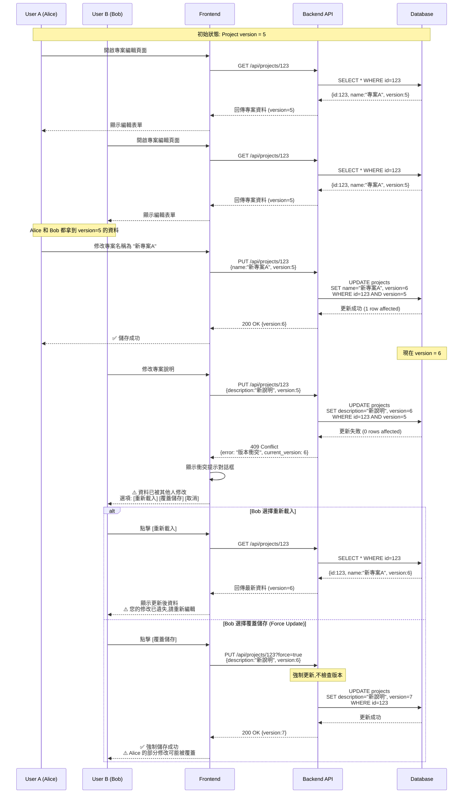
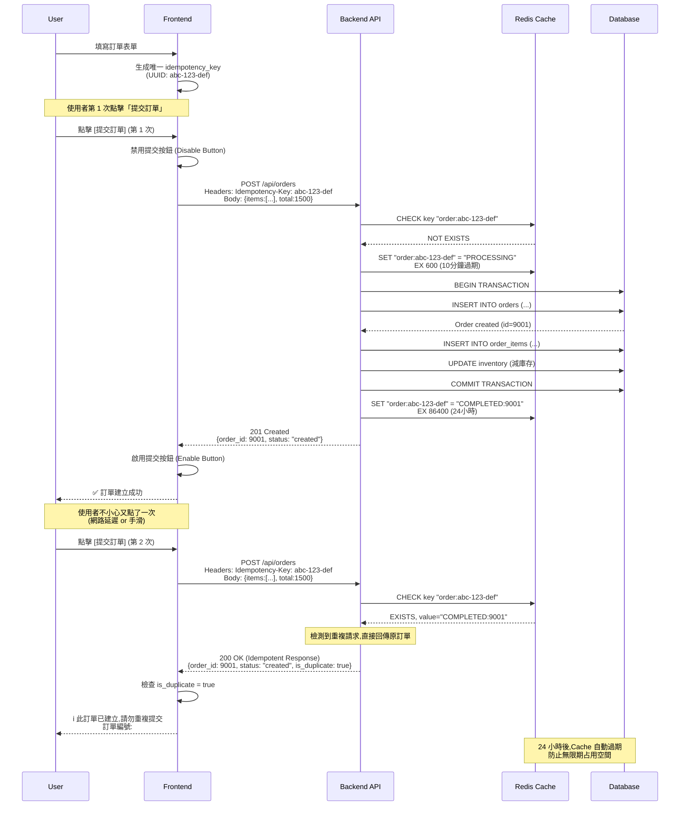
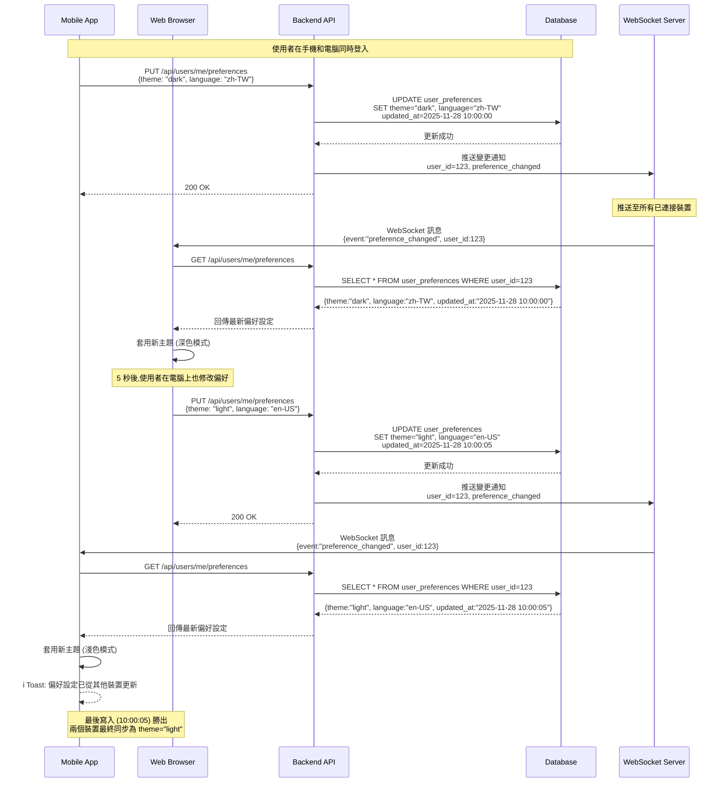

# 前後端交互分析工作流程 (Frontend-Backend Interaction Analysis Workflow)

## 🔒 強制執行配置
```yaml
# AISDLC v0.09 執行配置
workflow_metadata:
  id: "interaction-analysis"
  version: "v0.09"
  priority: "HIGH"
  scenario_applicable: ["greenfield", "brownfield", "refactoring", "devops", "migration", "integration", "performance", "security"]

agent_binding:
  primary:
    - agent/core/05.sd-architect-zh.yaml
  supporting:
    - agent/core/04.sa-analyst-zh.yaml
    - agent/core/06.dev-developer-zh.yaml
    - agent/core/07.qa-tester-zh.yaml
  rules_enforcement: MANDATORY
  auto_load: true

execution_control:
  skip_confirmation: false
  require_human_interaction: true
  validation_checkpoints: enabled
  zero_speculation: true

workflow_priority: AGENT_RULES_FIRST
scenario_applicability:
  - greenfield
  - brownfield
  - refactoring
```

> ⚠️ **LLM 注意**：此 workflow 用於設計和文檔化前後端交互流程。必須載入相關 agents 並遵循零臆測原則。

---

# 📋 Workflow 基本資訊

## Workflow 識別
- **Workflow ID**: `interaction-analysis`
- **版本**: v0.09
- **狀態**: Active
- **優先級**: Core - High

## 描述
分析和設計前後端系統間的交互流程，定義清晰的資料流、狀態管理、錯誤處理機制，並文檔化完整的交互序列圖和設計決策。

## 適用場景
- ✅ Greenfield: 新系統的前後端交互設計
- ✅ Brownfield: 新功能的交互設計
- ✅ Refactoring: 交互流程優化

## 觸發條件
- SRD 包含前後端分離架構
- User Story 涉及複雜的前後端交互
- API 規格已定義，需要設計調用流程
- 需要優化現有交互流程

---

# 🎯 Workflow 目標
1. **設計清晰的交互流程** - 定義前後端間的資料流和狀態轉換
2. **文檔化交互序列** - 使用序列圖等工具清晰展示交互過程
3. **定義錯誤處理機制** - 設計完善的錯誤處理和重試策略
4. **優化使用者體驗** - 確保交互流程支援良好的 UX
5. **建立設計追蹤** - 與需求和 API 規格建立追蹤關係

---

# 👥 角色與責任
- **SD Agent (Marcus)**: 主導交互設計和架構決策
- **SA Agent (Amanda)**: 提供業務需求解讀和使用者體驗考量
- **Dev Agent**: 提供技術實現可行性評估
- **QA Agent (Quincy)**: 提供測試場景和邊界條件考慮
- **人類用戶**: 確認交互設計符合業務需求

---

# 📥 輸入與前置條件
- SRD 包含系統架構設計
- API 規格已定義
- User Stories 和 Acceptance Criteria 已明確
- 前後端技術棧已確定

---

# 🔄 執行流程

## 階段 1：交互場景識別與分析

### 執行內容

1. 識別需要前後端交互的 User Stories
2. 分析業務流程中的交互點
3. 分類交互類型（CRUD、複雜業務邏輯、即時通訊等）
4. 評估交互複雜度（使用量化評估系統）

---

#### 1.4 交互複雜度量化評估 🔴 (Critical - v0.09 新增)

**目標**: 使用標準化的量化指標評估前後端交互的複雜程度，指導設計和實作策略

---

**步驟 1.4.1: 交互複雜度評分系統**

使用多維度評分系統量化交互複雜度：

**評分維度與權重**

| 維度 | 權重 | 評分範圍 | 說明 |
|------|------|---------|------|
| **API 調用數量** (API Calls) | 20% | 0-10 | 單一業務流程涉及的 API 調用次數 |
| **資料依賴關係** (Data Dependencies) | 25% | 0-10 | 資料間的依賴複雜度（串聯/並行/條件） |
| **狀態管理複雜度** (State Management) | 20% | 0-10 | 前端狀態管理的複雜程度 |
| **錯誤處理場景** (Error Scenarios) | 15% | 0-10 | 需處理的錯誤場景數量和複雜度 |
| **使用者互動步驟** (User Interactions) | 10% | 0-10 | 使用者需執行的互動步驟數 |
| **即時性需求** (Real-time Requirements) | 10% | 0-10 | 即時同步和更新需求程度 |

**計算公式**

```
交互複雜度分數 (Interaction Complexity Score, ICS) =
  (API調用數量 × 0.20) +
  (資料依賴關係 × 0.25) +
  (狀態管理複雜度 × 0.20) +
  (錯誤處理場景 × 0.15) +
  (使用者互動步驟 × 0.10) +
  (即時性需求 × 0.10)

總分範圍: 0-10
```

---

**步驟 1.4.2: 複雜度分級標準**

根據計算出的 ICS 分數，將交互複雜度分為四個級別：

| 級別 | 分數範圍 | 標籤 | 說明 | 建議處理方式 |
|------|---------|------|------|-------------|
| **Level 1** | 0-2.5 | 簡單 (Simple) | 單一 API 調用、線性資料流、基本錯誤處理 | 標準 CRUD 流程，直接實作 |
| **Level 2** | 2.6-5.0 | 中等 (Medium) | 2-4 個 API 調用、部分資料依賴、多種錯誤場景 | 需詳細設計資料流和錯誤處理 |
| **Level 3** | 5.1-7.5 | 複雜 (Complex) | 5+ 個 API 調用、複雜依賴關係、狀態同步需求 | 需繪製序列圖、多輪審查 |
| **Level 4** | 7.6-10.0 | 極複雜 (Very Complex) | 大量 API、即時同步、複雜狀態管理、高併發 | 需原型驗證、分階段實作 |

---

**步驟 1.4.3: 各維度詳細評分標準**

**維度 1: API 調用數量 (20% 權重)**

| 分數 | API 調用次數 | 說明 | 範例 |
|------|-------------|------|------|
| 0-2 | 1 個 | 單一 API 調用 | 取得商品詳情 |
| 3-4 | 2-3 個 | 少量串聯或並行調用 | 取得商品 + 取得評論 |
| 5-6 | 4-5 個 | 中等數量調用，部分依賴 | 訂單流程（驗證庫存 + 計算運費 + 建立訂單 + 更新庫存） |
| 7-8 | 6-8 個 | 大量調用，複雜依賴鏈 | 多步驟結帳流程 |
| 9-10 | 9+ 個 | 極多調用或高度並行 | 複雜儀表板（多個資料源聚合） |

**維度 2: 資料依賴關係 (25% 權重)**

| 分數 | 依賴類型 | 說明 | 範例 |
|------|---------|------|------|
| 0-2 | 無依賴 | API 調用完全獨立 | 並行取得多個獨立資料源 |
| 3-4 | 簡單串聯 | 線性依賴（A → B） | 取得使用者 ID → 取得使用者詳情 |
| 5-6 | 多層串聯 | 多層依賴（A → B → C） | 取得訂單 → 取得商品 → 取得商品圖片 |
| 7-8 | 條件依賴 | 根據回應決定後續調用 | 根據使用者類型調用不同 API |
| 9-10 | 複雜依賴網 | 多重條件 + 並行 + 串聯混合 | 動態工作流，根據多個條件決定調用路徑 |

**維度 3: 狀態管理複雜度 (20% 權重)**

| 分數 | 狀態複雜度 | 說明 | 範例 |
|------|-----------|------|------|
| 0-2 | Local State | 元件內部狀態，無需共享 | 表單輸入 useState |
| 3-4 | Shared State | 跨元件共享，單一數據源 | Context API、簡單 Redux |
| 5-6 | 多層狀態 | 嵌套狀態結構、需正規化 | 複雜表單、多層選單 |
| 7-8 | 動態狀態 | 動態結構、需樂觀更新 | 即時編輯、拖拉排序 |
| 9-10 | 即時同步 | 多用戶協作、衝突解決 | Google Docs 式協作編輯 |

**維度 4: 錯誤處理場景 (15% 權重)**

| 分數 | 錯誤場景數 | 說明 | 範例 |
|------|-----------|------|------|
| 0-2 | 1-2 種 | 基本網路錯誤 | 網路中斷、逾時 |
| 3-4 | 3-4 種 | 業務邏輯錯誤 | + 驗證失敗、權限不足 |
| 5-6 | 5-6 種 | 部分失敗處理 | + 批次操作部分成功、樂觀更新回滾 |
| 7-8 | 7-8 種 | 複雜錯誤恢復 | + 版本衝突、資料過期、並發衝突 |
| 9-10 | 9+ 種 | 極複雜錯誤策略 | + 離線佇列、自動重試、降級策略 |

**維度 5: 使用者互動步驟 (10% 權重)**

| 分數 | 互動步驟數 | 說明 | 範例 |
|------|-----------|------|------|
| 0-2 | 1-2 步 | 單一操作 | 點擊按鈕、輸入搜尋 |
| 3-4 | 3-4 步 | 簡單流程 | 表單填寫（2-3 個欄位） + 提交 |
| 5-6 | 5-7 步 | 多步驟流程 | 註冊流程（多頁表單） |
| 7-8 | 8-10 步 | 複雜嚮導 | 多步驟結帳（地址 → 運送 → 付款 → 確認） |
| 9-10 | 10+ 步 | 極複雜流程 | 多階段設定精靈、複雜配置流程 |

**維度 6: 即時性需求 (10% 權重)**

| 分數 | 即時性級別 | 延遲容忍度 | 範例 |
|------|-----------|-----------|------|
| 0-2 | 非即時 | > 5 秒 | 批次報表生成、郵件發送 |
| 3-4 | 低即時性 | 2-5 秒 | 一般資料查詢、頁面載入 |
| 5-6 | 中即時性 | 500ms-2s | 搜尋建議、自動完成 |
| 7-8 | 高即時性 | 100-500ms | 即時通知、按讚回饋 |
| 9-10 | 極高即時性 | < 100ms | 協作編輯游標、即時聊天輸入狀態 |

---

**步驟 1.4.4: 交互複雜度評估檢查清單**

使用此檢查清單系統性評估每個交互場景：

```markdown
## 交互複雜度評估檢查清單

### 場景資訊
- **場景名稱**: ________________
- **User Story ID**: ________________
- **評估日期**: ________________
- **評估人員**: ________________

### 1. API 調用數量評估 (0-10 分，權重 20%)
- [ ] 統計完整業務流程的 API 調用總數
- [ ] 識別串聯調用 vs 並行調用
- [ ] 考慮條件分支導致的額外調用
- **評分**: ___ / 10
- **說明**: ___________________________

### 2. 資料依賴關係評估 (0-10 分，權重 25%)
- [ ] 繪製資料依賴圖（A → B → C）
- [ ] 識別條件依賴（if-then 分支）
- [ ] 評估並行依賴的同步複雜度
- **評分**: ___ / 10
- **說明**: ___________________________

### 3. 狀態管理複雜度評估 (0-10 分，權重 20%)
- [ ] 確定狀態範圍（local/shared/global）
- [ ] 評估狀態結構複雜度（巢狀層級）
- [ ] 確認是否需要樂觀更新
- [ ] 確認是否需要即時同步
- **評分**: ___ / 10
- **說明**: ___________________________

### 4. 錯誤處理場景評估 (0-10 分，權重 15%)
- [ ] 列出所有可能的錯誤類型
- [ ] 確定每種錯誤的處理策略
- [ ] 評估錯誤恢復的複雜度
- **評分**: ___ / 10
- **說明**: ___________________________

### 5. 使用者互動步驟評估 (0-10 分，權重 10%)
- [ ] 繪製完整的使用者操作流程
- [ ] 計算必要的互動步驟數
- [ ] 評估流程的線性度 vs 複雜度
- **評分**: ___ / 10
- **說明**: ___________________________

### 6. 即時性需求評估 (0-10 分，權重 10%)
- [ ] 確定使用者期望的回應時間
- [ ] 評估資料新鮮度要求
- [ ] 確認是否需要 WebSocket/SSE
- **評分**: ___ / 10
- **說明**: ___________________________

### 最終計算
```
ICS = (API × 0.20) + (依賴 × 0.25) + (狀態 × 0.20) +
      (錯誤 × 0.15) + (互動 × 0.10) + (即時 × 0.10)

ICS = (___×0.20) + (___×0.25) + (___×0.20) +
      (___×0.15) + (___×0.10) + (___×0.10) = ______
```

**複雜度級別**: [ ] Level 1 (簡單)  [ ] Level 2 (中等)  [ ] Level 3 (複雜)  [ ] Level 4 (極複雜)

### 建議處理方式
- [ ] Level 1: 標準 CRUD 流程，直接實作
- [ ] Level 2: 需詳細設計資料流和錯誤處理
- [ ] Level 3: 需繪製序列圖、多輪審查
- [ ] Level 4: 需原型驗證、分階段實作

### 備註
_______________________________________________
```

---

**步驟 1.4.5: 交互複雜度評估範例**

**範例 1: 簡單場景 - 取得商品列表 (Level 1: Simple)**

```markdown
### 場景資訊
- **場景名稱**: 取得商品列表
- **User Story ID**: US-001
- **評估日期**: 2025-11-27
- **評估人員**: SD Agent (Marcus)

### 評分詳情
1. **API 調用數量**: 2 分 (1 個 GET /api/products)
2. **資料依賴關係**: 2 分 (無依賴，單一調用)
3. **狀態管理複雜度**: 3 分 (useState 儲存商品列表)
4. **錯誤處理場景**: 3 分 (網路錯誤、逾時)
5. **使用者互動步驟**: 2 分 (載入頁面即自動取得)
6. **即時性需求**: 4 分 (2-5 秒可接受)

### 最終計算
```
ICS = (2×0.20) + (2×0.25) + (3×0.20) + (3×0.15) + (2×0.10) + (4×0.10)
    = 0.4 + 0.5 + 0.6 + 0.45 + 0.2 + 0.4
    = 2.55
```

**複雜度級別**: Level 2 (中等)
**建議**: 需基本錯誤處理和 loading 狀態，可直接實作
```

---

**範例 2: 中等場景 - 使用者註冊 (Level 2: Medium)**

```markdown
### 場景資訊
- **場景名稱**: 使用者註冊流程
- **User Story ID**: US-012
- **評估日期**: 2025-11-27
- **評估人員**: SD Agent (Marcus)

### 評分詳情
1. **API 調用數量**: 4 分 (檢查 Email 可用 + 檢查手機 + 註冊 + 發送驗證信)
2. **資料依賴關係**: 5 分 (串聯：檢查 → 註冊 → 發送)
3. **狀態管理複雜度**: 4 分 (表單狀態 + 驗證錯誤狀態)
4. **錯誤處理場景**: 5 分 (網路錯誤、Email 已存在、驗證失敗、發信失敗)
5. **使用者互動步驟**: 5 分 (填寫 5 個欄位 + 提交)
6. **即時性需求**: 5 分 (即時驗證回饋，500ms-2s)

### 最終計算
```
ICS = (4×0.20) + (5×0.25) + (4×0.20) + (5×0.15) + (5×0.10) + (5×0.10)
    = 0.8 + 1.25 + 0.8 + 0.75 + 0.5 + 0.5
    = 4.6
```

**複雜度級別**: Level 2 (中等)
**建議**: 需詳細設計資料流和錯誤處理、表單驗證邏輯、使用者回饋機制
```

---

**範例 3: 複雜場景 - 電商結帳流程 (Level 3: Complex)**

```markdown
### 場景資訊
- **場景名稱**: 電商結帳流程
- **User Story ID**: US-045
- **評估日期**: 2025-11-27
- **評估人員**: SD Agent (Marcus)

### 評分詳情
1. **API 調用數量**: 7 分 (購物車 + 驗證庫存 + 優惠券 + 運費計算 + 地址驗證 + 付款 + 訂單建立)
2. **資料依賴關係**: 8 分 (複雜串聯 + 條件分支：需庫存 OK 才能計算運費)
3. **狀態管理複雜度**: 7 分 (多步驟狀態 + 樂觀更新 + 部分資料快取)
4. **錯誤處理場景**: 7 分 (庫存不足、優惠券失效、付款失敗、網路中斷等)
5. **使用者互動步驟**: 8 分 (選擇地址 → 選運送方式 → 輸入優惠券 → 選付款 → 確認)
6. **即時性需求**: 6 分 (運費計算需即時顯示，1-2 秒)

### 最終計算
```
ICS = (7×0.20) + (8×0.25) + (7×0.20) + (7×0.15) + (8×0.10) + (6×0.10)
    = 1.4 + 2.0 + 1.4 + 1.05 + 0.8 + 0.6
    = 7.25
```

**複雜度級別**: Level 3 (複雜)
**建議**:
- 需繪製完整序列圖
- 多輪設計審查
- 分階段實作（地址 → 運送 → 付款）
- 錯誤處理策略文檔
- 回滾機制設計
```

---

**範例 4: 極複雜場景 - 即時協作文件編輯 (Level 4: Very Complex)**

```markdown
### 場景資訊
- **場景名稱**: 即時協作文件編輯（Google Docs 式）
- **User Story ID**: US-089
- **評估日期**: 2025-11-27
- **評估人員**: SD Agent (Marcus)

### 評分詳情
1. **API 調用數量**: 9 分 (取得文件 + WebSocket 連線 + 推送變更 + 拉取變更 + 游標同步 + 評論 + 歷史版本等)
2. **資料依賴關係**: 9 分 (複雜即時同步、多用戶操作序列化)
3. **狀態管理複雜度**: 10 分 (CRDT 演算法、操作轉換、衝突解決)
4. **錯誤處理場景**: 9 分 (網路中斷、並發衝突、版本衝突、操作失序、重連邏輯)
5. **使用者互動步驟**: 7 分 (打開文件 → 編輯 → 看到他人游標 → 評論 → 歷史版本)
6. **即時性需求**: 10 分 (< 100ms 延遲，毫秒級游標同步)

### 最終計算
```
ICS = (9×0.20) + (9×0.25) + (10×0.20) + (9×0.15) + (7×0.10) + (10×0.10)
    = 1.8 + 2.25 + 2.0 + 1.35 + 0.7 + 1.0
    = 9.1
```

**複雜度級別**: Level 4 (極複雜)
**建議**:
- **必須**先建立技術原型驗證 CRDT/OT 演算法
- 分階段實作（階段 1: 基本編輯 → 階段 2: 即時同步 → 階段 3: 衝突解決）
- 獨立模組化衝突解決邏輯
- 完整的序列圖和狀態機圖
- 效能測試計畫（壓力測試、並發測試）
- 降級策略（WebSocket 失敗降級為輪詢）
```

---

### 檢查點
- [ ] 所有交互場景已識別
- [ ] 交互類型已分類
- [ ] **🔴 複雜度已量化評估（ICS 分數已計算）**
- [ ] **🔴 複雜度級別已確定（Level 1-4）**
- [ ] **🔴 處理方式建議已明確**

---

## 階段 2：資料流設計
### 執行內容
1. 設計請求資料結構
2. 設計回應資料結構
3. 定義資料轉換和驗證規則
4. 設計資料快取策略

### 🔴 人機協作確認點 1：資料流設計確認
- 呈現資料流設計方案
- 展示請求/回應格式
- 人類確認設計合理性

### 檢查點
- [ ] 資料流設計完整
- [ ] 🔴 人類已確認資料流設計
- [ ] 資料結構清晰

---

## 階段 3：狀態管理設計

### 執行內容

#### 3.1 定義前端狀態管理策略
- 選擇狀態管理方案 (Redux/Zustand/Context API/MobX)
- 定義 State 結構
- 規劃 Action/Mutation 設計

#### 3.2 設計狀態同步機制
- WebSocket/Polling/SSE 選擇
- 同步頻率設計
- 資料版本控制

#### 3.3 規劃樂觀更新和衝突解決策略 🔴 (Critical - v0.09 新增)

**目標**: 定義樂觀更新（Optimistic Update）的實作策略和衝突解決機制

**步驟 3.3.1: 樂觀更新場景識別**

識別適合使用樂觀更新的操作：

```markdown
## 適合樂觀更新的場景

### ✅ 高適用性場景
1. **按讚/收藏** (Like/Favorite)
   - 成功率: >99%
   - 用戶期望: 立即回饋
   - 失敗影響: 低（僅影響視覺）

2. **文字編輯** (Text Editing)
   - 成功率: >95%
   - 用戶期望: 即時顯示
   - 失敗影響: 中（需通知用戶重試）

3. **清單排序** (List Reordering)
   - 成功率: >95%
   - 用戶期望: 拖拉即時反應
   - 失敗影響: 中

### ⚠️ 需謹慎使用場景
4. **數量增減** (Quantity Adjustment)
   - 成功率: 80-90%（可能庫存不足）
   - 失敗影響: 中（需明確錯誤訊息）

5. **狀態變更** (Status Change)
   - 成功率: 70-90%（可能權限不足、業務規則阻擋）
   - 失敗影響: 高（需回滾 + 說明）

### ❌ 不適用場景
6. **支付操作** (Payment)
   - 成功率: <80%
   - 失敗影響: 極高（金錢相關）
   - 建議: 使用 Loading 狀態，等待伺服器確認

7. **刪除操作** (Delete)
   - 失敗影響: 高（誤導用戶資料已刪除）
   - 建議: 等待伺服器確認後再更新 UI
```

---

**步驟 3.3.2: 樂觀更新實作模式**

**模式 A: 立即更新 + 失敗回滾** (推薦用於高成功率場景)

```javascript
// 範例：按讚功能
async function handleLike(postId) {
  // 1. 立即更新 UI（樂觀更新）
  updateUI({ postId, liked: true, likeCount: currentCount + 1 });

  try {
    // 2. 發送 API 請求
    const response = await api.likePost(postId);

    // 3. 伺服器確認成功，使用伺服器返回的真實資料更新
    updateUI({ postId, likeCount: response.likeCount });

  } catch (error) {
    // 4. 失敗時回滾（Rollback）
    updateUI({ postId, liked: false, likeCount: currentCount });

    // 5. 顯示錯誤訊息
    showToast('按讚失敗，請重試', 'error');
  }
}
```

**模式 B: 雙狀態標記** (推薦用於中成功率場景)

```javascript
// 範例：訂單狀態變更
async function handleStatusChange(orderId, newStatus) {
  // 1. 標記為「處理中」狀態（視覺區分）
  updateUI({
    orderId,
    status: newStatus,
    isPending: true // 視覺上半透明或加 Loading Icon
  });

  try {
    // 2. 發送 API 請求
    const response = await api.updateOrderStatus(orderId, newStatus);

    // 3. 確認成功，移除「處理中」標記
    updateUI({
      orderId,
      status: response.status,
      isPending: false
    });

  } catch (error) {
    // 4. 失敗時回滾 + 錯誤訊息
    updateUI({
      orderId,
      status: oldStatus, // 回到原狀態
      isPending: false
    });

    showDialog({
      title: '狀態更新失敗',
      message: error.message,
      actions: ['重試', '取消']
    });
  }
}
```

---

**步驟 3.3.3: 衝突檢測與解決策略**

**衝突類型定義**:

```markdown
## 衝突類型

### 類型 1: 版本衝突 (Version Conflict)
**場景**: 多人同時編輯同一筆資料

**檢測方式**:
- 樂觀鎖 (Optimistic Locking) - 使用 `version` 欄位
- ETag (HTTP Header)
- Last-Modified 時間戳

**範例**:
```
// 前端 A 讀取資料
GET /api/posts/123
Response: { id: 123, content: "Hello", version: 1 }

// 前端 B 同時讀取
GET /api/posts/123
Response: { id: 123, content: "Hello", version: 1 }

// 前端 A 更新
PUT /api/posts/123
Request: { content: "Hello World", version: 1 }
Response: 200 OK { id: 123, content: "Hello World", version: 2 }

// 前端 B 更新（失敗 - 版本衝突）
PUT /api/posts/123
Request: { content: "Hello Everyone", version: 1 }
Response: 409 Conflict { error: "VERSION_CONFLICT", currentVersion: 2 }
```

**解決策略**:

**策略 A: Last-Write-Wins (最後寫入勝出)**
- 適用: 低價值資料（如個人偏好設定）
- 實作: 忽略版本衝突，直接覆蓋

**策略 B: Manual Merge (手動合併)**
- 適用: 高價值資料（如文件編輯）
- 實作:
  ```javascript
  if (error.code === 'VERSION_CONFLICT') {
    // 1. 取得伺服器最新版本
    const latest = await api.getPost(postId);

    // 2. 呈現合併 UI
    showMergeDialog({
      serverVersion: latest.content,
      localVersion: myChanges,
      onResolve: (mergedContent) => {
        // 3. 使用最新版本號重新提交
        api.updatePost(postId, mergedContent, latest.version);
      }
    });
  }
  ```

**策略 C: Auto-Merge (自動合併)**
- 適用: 結構化資料（如 JSON 物件的不同欄位）
- 實作: 使用 3-way merge 演算法
  ```javascript
  // 範例: 不同欄位的變更可自動合併
  Base:   { name: "John", age: 25, city: "NY" }
  User A: { name: "John", age: 26, city: "NY" } // 改 age
  User B: { name: "John", age: 25, city: "LA" } // 改 city
  Merged: { name: "John", age: 26, city: "LA" } // 自動合併成功
  ```

**策略 D: Reject (拒絕更新)**
- 適用: 金融交易等關鍵操作
- 實作: 通知用戶重新載入並重試
  ```javascript
  showDialog({
    title: '資料已被其他用戶更新',
    message: '請重新載入後再試',
    actions: ['重新載入', '取消']
  });
  ```

---

### 類型 2: 業務規則衝突 (Business Rule Conflict)
**場景**: 操作違反業務規則（庫存不足、權限變更等）

**檢測方式**: 伺服器端驗證返回 400/403 錯誤

**解決策略**:
```javascript
try {
  await api.addToCart(productId, quantity);
} catch (error) {
  if (error.code === 'INSUFFICIENT_STOCK') {
    // 回滾樂觀更新
    rollbackCartItem(productId);

    // 顯示具體錯誤
    showToast(
      `庫存不足，目前僅剩 ${error.availableStock} 件`,
      'warning'
    );

    // 建議替代方案
    suggestAlternatives(productId);
  }
}
```

---

### 類型 3: 網路中斷衝突 (Network Conflict)
**場景**: 操作時網路中斷，不確定是否成功

**解決策略**:
```javascript
async function handleOfflineUpdate(action) {
  // 1. 立即更新 UI
  optimisticUpdate(action);

  // 2. 將操作加入離線佇列
  offlineQueue.push(action);

  // 3. 網路恢復後重試
  onNetworkRestore(() => {
    offlineQueue.forEach(async (action) => {
      try {
        await retryAction(action);
        // 成功：移除佇列
        offlineQueue.remove(action);
      } catch (error) {
        // 失敗：回滾 + 通知
        rollback(action);
        notifyUser(action, error);
      }
    });
  });
}
```
```

---

**步驟 3.3.4: 衝突解決 UI 設計**

```markdown
## 衝突解決 UI 範例

### 1. 版本衝突 - 文件編輯

```
┌─────────────────────────────────────────────────┐
│  🔄 內容衝突                                     │
├─────────────────────────────────────────────────┤
│  您的變更與其他用戶的變更發生衝突，請選擇：      │
│                                                  │
│  📄 您的版本 (1 分鐘前)                          │
│  "使用者可以透過 Email 登入系統"                 │
│                                                  │
│  📄 伺服器版本 (剛剛)                            │
│  "使用者可以透過 Email 或手機號碼登入系統"       │
│                                                  │
│  [保留我的版本] [使用伺服器版本] [手動合併]      │
└─────────────────────────────────────────────────┘
```

### 2. 業務規則衝突 - 庫存不足

```
┌─────────────────────────────────────────────────┐
│  ⚠️ 庫存不足                                    │
├─────────────────────────────────────────────────┤
│  抱歉，商品「iPhone 15 Pro」目前僅剩 3 件       │
│  您嘗試加入 5 件到購物車                        │
│                                                  │
│  💡 您可以：                                     │
│  • 修改數量為 3 件                               │
│  • 加入「到貨通知」                              │
│  • 查看類似商品                                  │
│                                                  │
│  [修改數量] [到貨通知] [取消]                    │
└─────────────────────────────────────────────────┘
```

### 3. 網路中斷 - 離線操作

```
┌─────────────────────────────────────────────────┐
│  📡 離線模式                                     │
├─────────────────────────────────────────────────┤
│  您目前處於離線狀態，以下操作將在恢復網路後同步：│
│                                                  │
│  ✓ 編輯文件 "PRD v1.0"                          │
│  ✓ 新增留言 "請確認需求"                        │
│  ⏳ 等待同步 (2 個操作)                         │
│                                                  │
│  [查看詳情] [清除佇列]                          │
└─────────────────────────────────────────────────┘
```
```

---

#### 3.4 定義狀態持久化策略
- LocalStorage/SessionStorage 使用
- IndexedDB 大量資料儲存
- 離線資料同步機制

---

#### 3.4.1 離線操作合併規則 🔴 (Critical - v0.09 新增)

**目標**: 定義離線操作的類型分類、合併策略及衝突解決機制，確保網路恢復後資料正確同步

**問題背景**:
- 使用者在離線狀態下執行多個操作（新增、編輯、刪除）
- 網路恢復後需將本地操作與伺服器狀態合併
- 可能發生衝突：本地與伺服器同時修改相同資料

---

**步驟 3.4.1.1: 離線操作類型分類**

### 分類維度 1: 按操作性質 (CRUD)

| 操作類型 | 描述 | 衝突風險 | 合併複雜度 | 範例 |
|---------|------|---------|-----------|------|
| **Create** (新增) | 建立新資料 | 低 | 簡單 | 新增待辦事項、建立草稿 |
| **Read** (讀取) | 查詢資料 | 無 | N/A | 瀏覽文章列表（不需合併） |
| **Update** (更新) | 修改現有資料 | 高 | 複雜 | 編輯文件、更新個人資料 |
| **Delete** (刪除) | 刪除資料 | 中 | 中等 | 刪除留言、移除購物車商品 |

**衝突情境說明**:

```markdown
### Create 衝突情境
- **UUID 衝突**: 本地生成的 UUID 與伺服器衝突（極低機率）
- **唯一約束衝突**: Email、Username 等唯一欄位重複
- **業務規則衝突**: 超出資源限制（如免費用戶最多 10 個項目）

**解決策略**:
- UUID: 使用 UUID v4 + 時間戳降低衝突機率
- 唯一約束: 伺服器驗證優先，本地重新命名（如 "username_conflict_123"）
- 業務規則: 伺服器驗證，提示使用者

### Update 衝突情境
- **同欄位更新**: 本地與伺服器修改相同欄位
- **跨欄位依賴**: 修改 A 欄位影響 B 欄位的合法性
- **版本衝突**: 基於舊版本的修改

**解決策略**:
- 使用版本號（Optimistic Locking）
- 欄位級合併（Field-level merge）
- 三向合併（Three-way merge）

### Delete 衝突情境
- **刪除-更新衝突**: 本地刪除，伺服器更新
- **刪除-刪除**: 雙方都刪除（無衝突）
- **級聯刪除**: 父資料刪除影響子資料

**解決策略**:
- 刪除優先（Delete wins）
- 軟刪除（Soft delete）+ 版本控制
- 提示使用者確認
```

---

### 分類維度 2: 按衝突風險

| 風險等級 | 特徵 | 合併策略 | 範例 |
|---------|------|---------|------|
| **無衝突** | 幂等操作、本地唯一 | 直接套用 | 新增本地草稿（UUID）、設定偏好 |
| **低風險** | 不同欄位、不同資源 | 自動合併 | A 更新標題，B 更新內容 |
| **中風險** | 同欄位、低頻操作 | 條件合併 | 同時編輯個人簡介 |
| **高風險** | 金融、庫存、協作 | 手動解決 | 餘額修改、庫存扣減、文件協作 |

---

### 分類維度 3: 按批次性

| 批次類型 | 描述 | 合併順序 | 失敗處理 | 範例 |
|---------|------|---------|---------|------|
| **單一操作** | 單筆獨立操作 | 時間戳順序 | 單一回滾 | 更新頭像 |
| **批次操作** | 多筆獨立操作 | 並行處理 | 部分成功 | 批次刪除郵件 |
| **關聯操作** | 有依賴序列 | 嚴格順序 | 全部回滾 | 建立專案→新增任務→指派成員 |

**批次操作失敗處理範例**:

```javascript
// 批次操作 - 部分成功處理
async function syncBatchOperations(operations) {
  const results = {
    success: [],
    failed: [],
    conflicts: []
  };

  for (const op of operations) {
    try {
      const result = await syncOperation(op);

      if (result.status === 'success') {
        results.success.push(op);
        removeFromQueue(op);
      } else if (result.status === 'conflict') {
        results.conflicts.push({ op, conflict: result.conflict });
        // 保留在佇列，等待使用者解決
      }
    } catch (error) {
      results.failed.push({ op, error });
      // 重試策略：指數退避
      scheduleRetry(op);
    }
  }

  // 通知使用者
  if (results.conflicts.length > 0) {
    showConflictResolutionUI(results.conflicts);
  }

  if (results.failed.length > 0) {
    showRetryNotification(results.failed);
  }

  return results;
}
```

---

**步驟 3.4.1.2: 離線操作合併規則定義**

### 合併策略 1: Last-Write-Wins (LWW) - 最後寫入勝出

**適用場景**:
- 個人資料、偏好設定（低協作場景）
- 資料完整性要求低
- 接受資料遺失風險

**實作方式**:
```javascript
// 使用時間戳比較
function mergeLWW(localOp, serverData) {
  const localTimestamp = localOp.timestamp;
  const serverTimestamp = serverData.updatedAt;

  if (localTimestamp > serverTimestamp) {
    // 本地更新較新，套用本地變更
    return { action: 'apply_local', data: localOp.data };
  } else {
    // 伺服器更新較新，捨棄本地變更
    return { action: 'discard_local', data: serverData };
  }
}

// 範例
const localUpdate = {
  id: 'user-123',
  field: 'bio',
  value: '熱愛寫程式的工程師',
  timestamp: 1699000000000
};

const serverData = {
  id: 'user-123',
  bio: '資深前端開發者',
  updatedAt: 1698999000000 // 較舊
};

const result = mergeLWW(localUpdate, serverData);
// result: { action: 'apply_local', data: { bio: '熱愛寫程式的工程師' } }
```

**優點**:
- ✅ 實作簡單
- ✅ 無需額外儲存

**缺點**:
- ❌ 資料可能遺失
- ❌ 不適合協作場景

---

### 合併策略 2: First-Write-Wins (FWW) - 第一次寫入勝出

**適用場景**:
- 資源搶佔（限量商品、座位預訂）
- 唯一性約束（使用者名稱、識別碼）

**實作方式**:
```javascript
function mergeFWW(localOp, serverData) {
  // 檢查伺服器是否已有更新
  if (serverData.version > localOp.baseVersion) {
    // 伺服器已被他人更新，本地操作失敗
    return {
      action: 'reject_local',
      reason: 'resource_already_modified',
      serverData
    };
  } else {
    // 本地是第一次更新，套用
    return { action: 'apply_local', data: localOp.data };
  }
}

// 範例：使用者名稱註冊
const localCreate = {
  username: 'cooldev',
  baseVersion: 0
};

const serverCheck = await checkUsernameAvailability('cooldev');

if (serverCheck.exists) {
  // 已被他人註冊
  return {
    action: 'reject_local',
    reason: 'username_taken',
    suggestion: 'cooldev_2024'
  };
}
```

**優點**:
- ✅ 保證唯一性
- ✅ 公平性（先到先得）

**缺點**:
- ❌ 本地操作可能失敗
- ❌ 需要伺服器驗證

---

### 合併策略 3: Operational Transform (OT) - 操作轉換

**適用場景**:
- 即時協作編輯（Google Docs）
- 文字編輯衝突

**核心概念**:
將操作轉換為在不同情境下仍能達到一致結果的形式

**實作範例**:
```javascript
// 簡化的 OT 實作（文字插入/刪除）
class OperationalTransform {
  // 轉換函數：transform(op1, op2) → op1'
  // op1' 是 op1 在 op2 已套用後的轉換版本

  transform(op1, op2) {
    // Case 1: 兩個插入操作
    if (op1.type === 'insert' && op2.type === 'insert') {
      if (op1.position < op2.position) {
        return op1; // op1 位置在前，不需調整
      } else if (op1.position > op2.position) {
        // op1 位置在後，需向後移動
        return {
          ...op1,
          position: op1.position + op2.text.length
        };
      } else {
        // 同位置，根據優先權（如 clientId）決定
        return op1.clientId < op2.clientId
          ? op1
          : { ...op1, position: op1.position + op2.text.length };
      }
    }

    // Case 2: 插入 vs 刪除
    if (op1.type === 'insert' && op2.type === 'delete') {
      if (op1.position <= op2.position) {
        return op1; // 插入在刪除前，不影響
      } else if (op1.position > op2.position + op2.length) {
        // 插入在刪除後，位置前移
        return {
          ...op1,
          position: op1.position - op2.length
        };
      } else {
        // 插入在刪除範圍內，調整到刪除起點
        return {
          ...op1,
          position: op2.position
        };
      }
    }

    // Case 3: 刪除 vs 刪除
    if (op1.type === 'delete' && op2.type === 'delete') {
      // 複雜情況：需考慮重疊區域
      // 簡化處理：調整起點和長度
      // ...
    }

    return op1;
  }

  // 套用操作序列
  applyOperations(initialState, operations) {
    let state = initialState;

    for (const op of operations) {
      if (op.type === 'insert') {
        state = state.slice(0, op.position)
          + op.text
          + state.slice(op.position);
      } else if (op.type === 'delete') {
        state = state.slice(0, op.position)
          + state.slice(op.position + op.length);
      }
    }

    return state;
  }
}

// 使用範例
const ot = new OperationalTransform();

// 初始文字: "Hello World"
// Client A 操作: 在位置 6 插入 "Beautiful " → "Hello Beautiful World"
const opA = { type: 'insert', position: 6, text: 'Beautiful ', clientId: 'A' };

// Client B 操作: 在位置 5 刪除 " World" → "Hello"
const opB = { type: 'delete', position: 5, length: 6, clientId: 'B' };

// 伺服器收到順序: opA → opB
// Client B 需要轉換 opB，因為 opA 已套用
const transformedOpB = ot.transform(opB, opA);
// transformedOpB: { type: 'delete', position: 5, length: 6 }
// 最終結果: "Hello Beautiful"（合併兩者意圖）
```

**優點**:
- ✅ 保留所有操作意圖
- ✅ 最終一致性保證

**缺點**:
- ❌ 實作複雜
- ❌ 效能開銷高
- ❌ 需要完整操作歷史

---

### 合併策略 4: CRDT (Conflict-free Replicated Data Type)

**適用場景**:
- 分散式協作
- 無法接受中央伺服器驗證
- 高可用性需求

**核心概念**:
設計特殊資料結構，使得任意順序套用操作都能達到相同結果

**CRDT 類型範例**:

#### 4.1 G-Counter (Grow-only Counter) - 只增計數器
```javascript
class GCounter {
  constructor(replicaId) {
    this.replicaId = replicaId;
    this.counts = {}; // { replicaId: count }
  }

  increment() {
    this.counts[this.replicaId] = (this.counts[this.replicaId] || 0) + 1;
  }

  value() {
    return Object.values(this.counts).reduce((sum, count) => sum + count, 0);
  }

  merge(other) {
    const merged = new GCounter(this.replicaId);

    // 取每個 replica 的最大值
    const allReplicas = new Set([
      ...Object.keys(this.counts),
      ...Object.keys(other.counts)
    ]);

    allReplicas.forEach(replica => {
      merged.counts[replica] = Math.max(
        this.counts[replica] || 0,
        other.counts[replica] || 0
      );
    });

    return merged;
  }
}

// 使用範例：分散式按讚計數
const counterA = new GCounter('client-A');
const counterB = new GCounter('client-B');

// 離線操作
counterA.increment(); // Client A 按讚
counterA.increment(); // Client A 再按讚
counterB.increment(); // Client B 按讚

console.log(counterA.value()); // 2
console.log(counterB.value()); // 1

// 網路恢復後合併
const merged = counterA.merge(counterB);
console.log(merged.value()); // 3（正確合併）
```

#### 4.2 LWW-Element-Set - 最後寫入勝出集合
```javascript
class LWWElementSet {
  constructor() {
    this.addSet = new Map(); // { element: timestamp }
    this.removeSet = new Map(); // { element: timestamp }
  }

  add(element, timestamp = Date.now()) {
    this.addSet.set(element, Math.max(
      this.addSet.get(element) || 0,
      timestamp
    ));
  }

  remove(element, timestamp = Date.now()) {
    this.removeSet.set(element, Math.max(
      this.removeSet.get(element) || 0,
      timestamp
    ));
  }

  has(element) {
    const addTime = this.addSet.get(element) || 0;
    const removeTime = this.removeSet.get(element) || 0;

    // 存在條件：有 add 且 add 時間 >= remove 時間
    return addTime > 0 && addTime >= removeTime;
  }

  values() {
    const result = [];

    for (const [element, addTime] of this.addSet) {
      if (this.has(element)) {
        result.push(element);
      }
    }

    return result;
  }

  merge(other) {
    const merged = new LWWElementSet();

    // 合併 addSet（取時間戳較大者）
    const allElements = new Set([
      ...this.addSet.keys(),
      ...other.addSet.keys()
    ]);

    allElements.forEach(element => {
      const thisAddTime = this.addSet.get(element) || 0;
      const otherAddTime = other.addSet.get(element) || 0;

      if (thisAddTime > 0 || otherAddTime > 0) {
        merged.addSet.set(element, Math.max(thisAddTime, otherAddTime));
      }

      const thisRemoveTime = this.removeSet.get(element) || 0;
      const otherRemoveTime = other.removeSet.get(element) || 0;

      if (thisRemoveTime > 0 || otherRemoveTime > 0) {
        merged.removeSet.set(element, Math.max(thisRemoveTime, otherRemoveTime));
      }
    });

    return merged;
  }
}

// 使用範例：分散式購物車
const cartA = new LWWElementSet();
const cartB = new LWWElementSet();

// Client A 操作
cartA.add('item-1', 1000);
cartA.add('item-2', 1001);

// Client B 操作（同時）
cartB.add('item-1', 999);  // 較早
cartB.remove('item-2', 1002); // 較晚

// 合併
const mergedCart = cartA.merge(cartB);
console.log(mergedCart.values());
// ['item-1'] （item-1 保留 Client A 的新增，item-2 被 Client B 移除）
```

#### 4.3 OR-Set (Observed-Remove Set) - 觀察移除集合
```javascript
class ORSet {
  constructor() {
    this.elements = new Map(); // { element: Set<uid> }
  }

  add(element, uid = generateUID()) {
    if (!this.elements.has(element)) {
      this.elements.set(element, new Set());
    }
    this.elements.get(element).add(uid);
    return uid;
  }

  remove(element, observedUIDs) {
    if (!this.elements.has(element)) return;

    const uids = this.elements.get(element);
    observedUIDs.forEach(uid => uids.delete(uid));

    if (uids.size === 0) {
      this.elements.delete(element);
    }
  }

  has(element) {
    const uids = this.elements.get(element);
    return uids && uids.size > 0;
  }

  getUIDs(element) {
    return this.elements.get(element) || new Set();
  }

  merge(other) {
    const merged = new ORSet();

    // 合併所有元素的 UID 集合
    const allElements = new Set([
      ...this.elements.keys(),
      ...other.elements.keys()
    ]);

    allElements.forEach(element => {
      const thisUIDs = this.elements.get(element) || new Set();
      const otherUIDs = other.elements.get(element) || new Set();

      const mergedUIDs = new Set([...thisUIDs, ...otherUIDs]);

      if (mergedUIDs.size > 0) {
        merged.elements.set(element, mergedUIDs);
      }
    });

    return merged;
  }
}

// 使用範例：解決 add-after-remove 問題
const setA = new ORSet();
const setB = new ORSet();

// 1. 兩者都新增 'item-1'
const uid1 = setA.add('item-1');
setB.add('item-1', uid1); // 同步相同 UID

// 2. Client A 看到後刪除
const observedUIDs = setA.getUIDs('item-1');
setA.remove('item-1', observedUIDs);

// 3. Client B 斷線期間重新新增（新 UID）
const uid2 = setB.add('item-1'); // 新的 UID

// 4. 合併
const merged = setA.merge(setB);
console.log(merged.has('item-1')); // true（保留 Client B 的重新新增）
```

**CRDT 優點**:
- ✅ 數學上保證最終一致性
- ✅ 無需中央協調
- ✅ 高可用性

**CRDT 缺點**:
- ❌ 資料結構複雜
- ❌ 記憶體開銷大（需保留元資料）
- ❌ 不適合所有場景（如金融交易）

---

### 合併策略 5: Manual Resolution - 手動解決

**適用場景**:
- 高價值資料（金融、法律文件）
- 複雜業務邏輯
- 無法自動判斷正確性

**實作方式**:
```javascript
class ConflictResolver {
  async resolveConflict(localOp, serverData) {
    // 1. 偵測衝突
    const conflict = this.detectConflict(localOp, serverData);

    if (!conflict) {
      return { action: 'apply_local', data: localOp.data };
    }

    // 2. 準備衝突資訊
    const conflictInfo = {
      type: conflict.type,
      local: {
        value: localOp.data,
        timestamp: localOp.timestamp,
        user: localOp.userId
      },
      server: {
        value: serverData,
        timestamp: serverData.updatedAt,
        user: serverData.updatedBy
      },
      field: conflict.field
    };

    // 3. 顯示衝突解決 UI
    const resolution = await this.showConflictUI(conflictInfo);

    return resolution;
  }

  detectConflict(localOp, serverData) {
    // 檢查版本號
    if (localOp.baseVersion !== serverData.version) {
      // 找出衝突欄位
      const conflictFields = [];

      for (const field in localOp.data) {
        if (localOp.data[field] !== serverData[field]) {
          conflictFields.push(field);
        }
      }

      if (conflictFields.length > 0) {
        return {
          type: 'version_conflict',
          field: conflictFields[0] // 簡化：只處理第一個
        };
      }
    }

    return null;
  }

  async showConflictUI(conflictInfo) {
    // 顯示 UI 讓使用者選擇
    return new Promise((resolve) => {
      const modal = createConflictModal({
        title: '資料衝突',
        message: `欄位「${conflictInfo.field}」發生衝突`,
        local: conflictInfo.local,
        server: conflictInfo.server,
        options: [
          {
            label: '保留我的版本',
            value: 'keep_local',
            action: () => resolve({
              action: 'apply_local',
              data: conflictInfo.local.value
            })
          },
          {
            label: '使用伺服器版本',
            value: 'keep_server',
            action: () => resolve({
              action: 'discard_local',
              data: conflictInfo.server.value
            })
          },
          {
            label: '手動合併',
            value: 'manual_merge',
            action: () => {
              // 開啟手動編輯介面
              this.showManualMergeEditor(conflictInfo, resolve);
            }
          }
        ]
      });

      modal.show();
    });
  }

  showManualMergeEditor(conflictInfo, resolve) {
    const editor = createMergeEditor({
      local: conflictInfo.local.value,
      server: conflictInfo.server.value,
      onSave: (mergedValue) => {
        resolve({
          action: 'apply_merged',
          data: mergedValue,
          resolvedBy: 'user'
        });
      }
    });

    editor.show();
  }
}

// 使用範例
const resolver = new ConflictResolver();

const localUpdate = {
  baseVersion: 5,
  data: { title: '2024 年度報告' },
  timestamp: 1699000000000,
  userId: 'user-A'
};

const serverData = {
  version: 6, // 版本已更新
  title: '2024 Q4 年度報告',
  updatedAt: 1699001000000,
  updatedBy: 'user-B'
};

const resolution = await resolver.resolveConflict(localUpdate, serverData);
// 使用者選擇後返回解決方案
```

**優點**:
- ✅ 保證正確性
- ✅ 使用者有完全控制權
- ✅ 適用所有場景

**缺點**:
- ❌ 使用者體驗不佳（需手動介入）
- ❌ 阻塞流程
- ❌ 需要使用者理解衝突

---

**步驟 3.4.1.3: 衝突解決決策樹**

```markdown
## 離線操作合併決策樹

                    [開始同步離線操作]
                            |
                            ↓
                    [檢查操作類型]
                    /      |      \
                   /       |       \
            [Create]   [Update]   [Delete]
               |          |           |
               ↓          ↓           ↓
        [UUID 衝突?] [版本衝突?]  [資源存在?]
         /    \       /    \        /    \
       否     是     否     是      是     否
        |      |      |      |      |      |
        ↓      ↓      ↓      ↓      ↓      ↓
      [直接   [生成   [欄位級  [衝突   [執行   [忽略
      建立]   新UUID] 合併]   類型?]  刪除]   操作]
                      |        |
                      ↓        ↓
                    [套用]  [同欄位?]
                             /    \
                           是     否
                            |      |
                            ↓      ↓
                       [資料類型?] [自動合併]
                        /   |   \
                      文字  數字  物件
                       |    |     |
                       ↓    ↓     ↓
                     [OT] [CRDT] [欄位合併]
                            |
                            ↓
                       [業務重要性?]
                         /      \
                       高       低
                        |        |
                        ↓        ↓
                   [手動解決]  [LWW]


## 決策表格

| 場景 | 操作類型 | 衝突類型 | 自動解決? | 合併策略 | 使用者介入 |
|------|---------|---------|----------|---------|-----------|
| 新增草稿 | Create | 無 | ✅ | 直接套用 | 否 |
| 註冊使用者名 | Create | 唯一約束 | ✅ | FWW | 通知重新選擇 |
| 編輯個人簡介 | Update | 同欄位 | ✅ | LWW | 否 |
| 協作編輯文件 | Update | 同位置 | ✅ | OT | 否 |
| 修改文章標題 | Update | 同欄位 | ❌ | Manual | 必須 |
| 刪除留言 | Delete | 留言已被編輯 | ✅ | Delete Wins | 可選 |
| 刪除帳號 | Delete | 高風險 | ❌ | Manual | 必須 |
| 按讚計數 | Update | 並發更新 | ✅ | CRDT (G-Counter) | 否 |
| 購物車操作 | Update | 新增/移除 | ✅ | CRDT (OR-Set) | 否 |
| 金額轉帳 | Update | 餘額衝突 | ❌ | Manual + 伺服器驗證 | 必須 |


## 決策流程程式碼

```javascript
class OfflineOperationMerger {
  async mergeOperation(localOp, serverState) {
    // Step 1: 分類操作
    const opType = localOp.type; // 'create', 'update', 'delete'

    // Step 2: 執行對應策略
    switch (opType) {
      case 'create':
        return this.mergeCreate(localOp, serverState);

      case 'update':
        return this.mergeUpdate(localOp, serverState);

      case 'delete':
        return this.mergeDelete(localOp, serverState);

      default:
        throw new Error(`Unknown operation type: ${opType}`);
    }
  }

  async mergeCreate(localOp, serverState) {
    // 檢查 UUID 衝突
    const exists = await this.checkExists(localOp.data.id);

    if (exists) {
      // UUID 衝突（極少發生）
      const newId = generateNewUUID();
      return {
        action: 'create_with_new_id',
        data: { ...localOp.data, id: newId },
        warning: 'ID conflict resolved by generating new UUID'
      };
    }

    // 檢查唯一約束
    const uniqueFields = this.getUniqueFields(localOp.resource);
    for (const field of uniqueFields) {
      const conflict = await this.checkUniqueness(field, localOp.data[field]);

      if (conflict) {
        return {
          action: 'reject',
          reason: `${field} already exists`,
          suggestion: this.generateAlternative(field, localOp.data[field])
        };
      }
    }

    // 無衝突，直接建立
    return {
      action: 'create',
      data: localOp.data
    };
  }

  async mergeUpdate(localOp, serverState) {
    // 檢查資源是否存在
    if (!serverState) {
      return {
        action: 'reject',
        reason: 'resource_not_found',
        message: '資源已被刪除'
      };
    }

    // 檢查版本衝突
    if (localOp.baseVersion !== serverState.version) {
      // 有版本衝突，分析衝突欄位
      const conflicts = this.analyzeConflicts(localOp.data, serverState);

      if (conflicts.length === 0) {
        // 無實際衝突（修改不同欄位）
        return {
          action: 'merge_fields',
          data: { ...serverState, ...localOp.data }
        };
      }

      // 有衝突，根據欄位重要性決定策略
      for (const conflict of conflicts) {
        const strategy = this.getFieldStrategy(conflict.field, localOp.resource);

        switch (strategy) {
          case 'lww':
            // 使用較新的值
            conflict.resolved = localOp.timestamp > serverState.updatedAt
              ? localOp.data[conflict.field]
              : serverState[conflict.field];
            break;

          case 'ot':
            // 文字操作轉換
            conflict.resolved = this.applyOT(
              localOp.operations[conflict.field],
              serverState[conflict.field]
            );
            break;

          case 'crdt':
            // CRDT 合併
            conflict.resolved = this.mergeCRDT(
              localOp.data[conflict.field],
              serverState[conflict.field]
            );
            break;

          case 'manual':
            // 需要手動解決
            return {
              action: 'require_manual_resolution',
              conflicts: conflicts.map(c => ({
                field: c.field,
                local: localOp.data[c.field],
                server: serverState[c.field]
              }))
            };
        }
      }

      // 套用解決後的值
      const mergedData = { ...serverState };
      conflicts.forEach(c => {
        mergedData[c.field] = c.resolved;
      });

      return {
        action: 'apply_merged',
        data: mergedData,
        conflicts_resolved: conflicts.length
      };
    }

    // 無版本衝突，直接套用
    return {
      action: 'update',
      data: { ...serverState, ...localOp.data }
    };
  }

  async mergeDelete(localOp, serverState) {
    // 檢查資源是否存在
    if (!serverState) {
      // 資源已被刪除（可能伺服器也刪了）
      return {
        action: 'already_deleted',
        message: '資源已不存在'
      };
    }

    // 檢查資源是否被修改
    if (serverState.version > localOp.baseVersion) {
      // 刪除期間被修改，詢問使用者
      return {
        action: 'confirm_delete',
        message: '資源在離線期間被修改，確定要刪除嗎？',
        serverState
      };
    }

    // 直接刪除
    return {
      action: 'delete',
      id: localOp.data.id
    };
  }

  // 輔助函數
  analyzeConflicts(localData, serverData) {
    const conflicts = [];

    for (const field in localData) {
      if (localData[field] !== serverData[field]) {
        conflicts.push({
          field,
          local: localData[field],
          server: serverData[field]
        });
      }
    }

    return conflicts;
  }

  getFieldStrategy(field, resource) {
    // 根據資源類型和欄位決定合併策略
    const strategies = {
      'article': {
        'title': 'manual',     // 標題：手動
        'content': 'ot',       // 內容：OT
        'tags': 'crdt',        // 標籤：CRDT Set
        'viewCount': 'crdt'    // 瀏覽數：CRDT Counter
      },
      'user': {
        'bio': 'lww',          // 簡介：LWW
        'avatar': 'lww',       // 頭像：LWW
        'email': 'manual'      // Email：手動
      }
    };

    return strategies[resource]?.[field] || 'lww';
  }
}
```
```

---

**步驟 3.4.1.4: 離線合併範例**

### 範例 1: 簡單場景 - 編輯個人資料（LWW）

```javascript
// 場景：使用者離線時修改個人簡介

// 初始狀態（伺服器）
const serverUser = {
  id: 'user-123',
  bio: '前端工程師',
  avatar: 'avatar-v1.jpg',
  version: 10,
  updatedAt: 1699000000000
};

// 離線操作
const localUpdate = {
  type: 'update',
  resource: 'user',
  data: {
    id: 'user-123',
    bio: '熱愛程式設計的前端工程師' // 修改簡介
  },
  baseVersion: 10,
  timestamp: 1699001000000 // 較新
};

// 網路恢復，同步操作
const merger = new OfflineOperationMerger();
const result = await merger.mergeOperation(localUpdate, serverUser);

console.log(result);
// {
//   action: 'update',
//   data: {
//     id: 'user-123',
//     bio: '熱愛程式設計的前端工程師', // 本地更新被採用
//     avatar: 'avatar-v1.jpg',
//     version: 11,
//     updatedAt: 1699001000000
//   }
// }
```

---

### 範例 2: 中等複雜 - 協作編輯衝突（OT）

```javascript
// 場景：兩人同時編輯文章

// 初始狀態
const serverArticle = {
  id: 'article-456',
  title: '前端效能優化',
  content: 'React 是...',
  version: 5,
  updatedAt: 1699000000000
};

// Client A 離線操作：在位置 10 插入文字
const clientA_op = {
  type: 'update',
  resource: 'article',
  data: {
    id: 'article-456',
    content: 'React 是一個強大的...' // 插入「一個強大的」
  },
  operations: [
    { type: 'insert', position: 8, text: '一個強大的' }
  ],
  baseVersion: 5,
  timestamp: 1699001000000
};

// Client B 同時操作：在位置 5 插入文字（已同步到伺服器）
const serverArticle_updated = {
  id: 'article-456',
  title: '前端效能優化',
  content: 'React 框架是...', // 插入「框架」
  version: 6,
  updatedAt: 1699001500000
};

// Client A 恢復網路，需要合併
const ot = new OperationalTransform();

// 轉換 Client A 的操作
const clientB_op = { type: 'insert', position: 6, text: '框架' };
const transformed_clientA_op = ot.transform(clientA_op.operations[0], clientB_op);

// transformed_clientA_op: { type: 'insert', position: 10, text: '一個強大的' }
// （位置從 8 調整為 10，因為前面插入了「框架」2 個字）

// 最終結果
const finalContent = 'React 框架是一個強大的...';

console.log(finalContent);
// 'React 框架是一個強大的...'
// ✅ 正確合併兩者的修改
```

---

### 範例 3: 複雜場景 - 購物車操作（CRDT OR-Set）

```javascript
// 場景：離線時操作購物車，其他設備同時也在操作

// 初始狀態
const serverCart = {
  userId: 'user-789',
  items: new ORSet()
};

// 初始商品
const uid1 = serverCart.items.add('item-A');
const uid2 = serverCart.items.add('item-B');

// Client 1 離線操作
const client1_cart = new ORSet();
client1_cart.add('item-A', uid1); // 同步初始狀態
client1_cart.add('item-B', uid2);

// Client 1: 移除 item-B
const observedUIDs_B = client1_cart.getUIDs('item-B');
client1_cart.remove('item-B', observedUIDs_B);

// Client 1: 新增 item-C
const uid3 = client1_cart.add('item-C');

console.log('Client 1 cart:', client1_cart.values());
// ['item-A', 'item-C']

// Client 2 同時操作（已同步到伺服器）
const client2_cart = new ORSet();
client2_cart.add('item-A', uid1);
client2_cart.add('item-B', uid2);

// Client 2: 新增 item-D
const uid4 = client2_cart.add('item-D');

// Client 2: 重新新增 item-B（不同 UID）
const uid5 = client2_cart.add('item-B'); // 新的 UID

console.log('Client 2 cart:', client2_cart.values());
// ['item-A', 'item-B', 'item-D']

// 網路恢復，合併
const mergedCart = client1_cart.merge(client2_cart);

console.log('Merged cart:', mergedCart.values());
// ['item-A', 'item-B', 'item-C', 'item-D']
// ✅ item-B 保留（Client 2 的重新新增覆蓋 Client 1 的移除）
// ✅ item-C 和 item-D 都被保留
```

---

### 範例 4: 高風險場景 - 金額轉帳（Manual Resolution）

```javascript
// 場景：離線時發起轉帳，伺服器同時有其他交易

// 初始狀態
const serverAccount = {
  userId: 'user-999',
  balance: 1000,
  version: 20,
  updatedAt: 1699000000000
};

// 離線操作：轉帳 500 元
const localTransfer = {
  type: 'update',
  resource: 'account',
  data: {
    userId: 'user-999',
    balance: 500 // 1000 - 500
  },
  baseVersion: 20,
  timestamp: 1699001000000,
  metadata: {
    operation: 'transfer',
    amount: -500,
    to: 'user-888'
  }
};

// 伺服器同時有其他交易（收到 200 元）
const serverAccount_updated = {
  userId: 'user-999',
  balance: 1200, // 1000 + 200
  version: 21,
  updatedAt: 1699001500000
};

// 網路恢復，嘗試合併
const resolver = new ConflictResolver();
const result = await resolver.resolveConflict(localTransfer, serverAccount_updated);

// 系統偵測到衝突
// result: {
//   action: 'require_manual_resolution',
//   reason: 'high_risk_operation',
//   message: '金額操作需要手動確認',
//   options: [
//     {
//       label: '重新計算（基於最新餘額）',
//       result: { balance: 1200 - 500 = 700 }
//     },
//     {
//       label: '取消轉帳',
//       result: { balance: 1200 }
//     },
//     {
//       label: '聯繫客服',
//       result: 'pending'
//     }
//   ]
// }

// ✅ 關鍵金融操作不自動合併，保證安全性
```

---

### 範例 5: 批次操作 - 部分成功處理

```javascript
// 場景：離線時批次刪除郵件，部分郵件被其他設備標記為重要

// 離線操作佇列
const offlineQueue = [
  { type: 'delete', resource: 'email', id: 'email-1', timestamp: 1699000100000 },
  { type: 'delete', resource: 'email', id: 'email-2', timestamp: 1699000200000 },
  { type: 'delete', resource: 'email', id: 'email-3', timestamp: 1699000300000 },
  { type: 'delete', resource: 'email', id: 'email-4', timestamp: 1699000400000 }
];

// 伺服器狀態（email-2 被標記為重要）
const serverEmails = {
  'email-1': { id: 'email-1', starred: false },
  'email-2': { id: 'email-2', starred: true }, // 被標記為重要
  'email-3': { id: 'email-3', starred: false },
  'email-4': null // 已被其他設備刪除
};

// 網路恢復，批次同步
async function syncBatchDeletes(queue, serverState) {
  const results = {
    success: [],
    skipped: [],
    alreadyDeleted: []
  };

  for (const op of queue) {
    const serverEmail = serverState[op.id];

    if (!serverEmail) {
      // 已被刪除
      results.alreadyDeleted.push(op.id);
      continue;
    }

    if (serverEmail.starred) {
      // 被標記為重要，跳過刪除
      results.skipped.push({
        id: op.id,
        reason: 'marked_as_important'
      });
      continue;
    }

    // 執行刪除
    await deleteEmail(op.id);
    results.success.push(op.id);
  }

  return results;
}

const results = await syncBatchDeletes(offlineQueue, serverEmails);

console.log(results);
// {
//   success: ['email-1', 'email-3'],        // 成功刪除
//   skipped: [                               // 跳過刪除
//     { id: 'email-2', reason: 'marked_as_important' }
//   ],
//   alreadyDeleted: ['email-4']             // 已被刪除
// }

// 通知使用者
showNotification({
  message: `已刪除 ${results.success.length} 封郵件`,
  details: results.skipped.length > 0
    ? `${results.skipped.length} 封重要郵件已保留`
    : null
});

// ✅ 批次操作正確處理部分成功情況
```

---

### 範例 6: 關聯操作 - 依賴序列

```javascript
// 場景：離線時建立專案 → 新增任務 → 指派成員

// 離線操作序列（有依賴關係）
const offlineOperations = [
  {
    id: 'op-1',
    type: 'create',
    resource: 'project',
    data: {
      id: 'project-temp-123', // 本地臨時 ID
      name: '新專案'
    },
    timestamp: 1699000000000
  },
  {
    id: 'op-2',
    type: 'create',
    resource: 'task',
    data: {
      id: 'task-temp-456',
      projectId: 'project-temp-123', // 依賴 op-1
      title: '任務 A'
    },
    dependencies: ['op-1'],
    timestamp: 1699001000000
  },
  {
    id: 'op-3',
    type: 'create',
    resource: 'assignment',
    data: {
      taskId: 'task-temp-456', // 依賴 op-2
      userId: 'user-789'
    },
    dependencies: ['op-2'],
    timestamp: 1699002000000
  }
];

// 網路恢復，按依賴順序同步
async function syncDependentOperations(operations) {
  const idMapping = {}; // 臨時 ID → 真實 ID 的映射
  const results = [];

  for (const op of operations) {
    // 等待依賴操作完成
    for (const depId of (op.dependencies || [])) {
      const depResult = results.find(r => r.operationId === depId);

      if (!depResult || depResult.status !== 'success') {
        // 依賴操作失敗，終止序列
        return {
          status: 'failed',
          reason: 'dependency_failed',
          failedAt: op.id,
          rollback: results.filter(r => r.status === 'success')
        };
      }
    }

    // 替換依賴的臨時 ID
    const resolvedData = { ...op.data };

    if (op.type === 'create' && op.resource === 'task') {
      // 替換 projectId
      resolvedData.projectId = idMapping[op.data.projectId] || op.data.projectId;
    }

    if (op.type === 'create' && op.resource === 'assignment') {
      // 替換 taskId
      resolvedData.taskId = idMapping[op.data.taskId] || op.data.taskId;
    }

    // 執行操作
    try {
      const response = await createResource(op.resource, resolvedData);

      // 記錄 ID 映射
      idMapping[op.data.id] = response.id;

      results.push({
        operationId: op.id,
        status: 'success',
        tempId: op.data.id,
        realId: response.id
      });
    } catch (error) {
      results.push({
        operationId: op.id,
        status: 'failed',
        error
      });

      // 失敗時回滾已成功的操作
      return {
        status: 'failed',
        reason: error.message,
        failedAt: op.id,
        rollback: results.filter(r => r.status === 'success')
      };
    }
  }

  return {
    status: 'success',
    results,
    idMapping
  };
}

const syncResult = await syncDependentOperations(offlineOperations);

console.log(syncResult);
// {
//   status: 'success',
//   results: [
//     { operationId: 'op-1', status: 'success', tempId: 'project-temp-123', realId: 'project-real-999' },
//     { operationId: 'op-2', status: 'success', tempId: 'task-temp-456', realId: 'task-real-888' },
//     { operationId: 'op-3', status: 'success', tempId: undefined, realId: 'assignment-real-777' }
//   ],
//   idMapping: {
//     'project-temp-123': 'project-real-999',
//     'task-temp-456': 'task-real-888'
//   }
// }

// ✅ 正確處理有依賴關係的操作序列
// ✅ 臨時 ID 正確映射到真實 ID
// ✅ 失敗時能夠回滾
```

---

**🔴 關鍵檢查點 (Checkpoint)**

完成離線操作合併規則設計後，請確認：

- [ ] **操作分類完整性**
  - [ ] CRUD 四種操作類型都有定義
  - [ ] 衝突風險分級清楚
  - [ ] 批次操作類型完整

- [ ] **合併策略適用性**
  - [ ] LWW 適用場景明確
  - [ ] FWW 唯一性保證
  - [ ] OT 文字編輯正確
  - [ ] CRDT 無衝突保證
  - [ ] Manual 高風險場景

- [ ] **決策樹完整性**
  - [ ] 所有操作類型都有路徑
  - [ ] 所有衝突類型都有處理
  - [ ] 決策邏輯清晰

- [ ] **範例覆蓋度**
  - [ ] 簡單場景（LWW）
  - [ ] 中等複雜（OT）
  - [ ] 複雜場景（CRDT）
  - [ ] 高風險場景（Manual）
  - [ ] 批次操作（部分成功）
  - [ ] 關聯操作（依賴序列）

- [ ] **實作可行性**
  - [ ] 程式碼範例完整可執行
  - [ ] 錯誤處理機制完善
  - [ ] 使用者通知清楚

---

#### 3.5 快取同步策略 🔴 (Critical - v0.09 新增)

**目標**: 設計快取同步機制，確保前端快取與後端資料的一致性

---

**步驟 3.5.1: Eventual Consistency（最終一致性）設計**

**最終一致性模型概念**:

```markdown
## 最終一致性 (Eventual Consistency)

### 定義
在分散式系統中，允許短暫的資料不一致，但保證經過一段時間後，
所有副本最終會達到一致狀態。

### 適用場景

#### ✅ 高適用性場景
1. **社群媒體動態** (Social Feed)
   - 資料特性: 時效性高、準確性要求低
   - 不一致容忍度: 高（幾秒到幾分鐘）
   - 範例: Facebook 動態、Twitter 推文

2. **商品列表** (Product Catalog)
   - 資料特性: 變動頻率低
   - 不一致容忍度: 中（幾分鐘到幾小時）
   - 範例: 電商商品列表、內容網站文章列表

3. **使用者資訊** (User Profile)
   - 資料特性: 變動頻率極低
   - 不一致容忍度: 中（幾分鐘）
   - 範例: 頭像、暱稱、個人簡介

#### ⚠️ 需謹慎使用場景
4. **庫存數量** (Inventory Count)
   - 資料特性: 高頻變動、影響交易決策
   - 不一致容忍度: 低（幾秒）
   - 需搭配: 伺服器端驗證 + 樂觀鎖

#### ❌ 不適用場景
5. **金融交易** (Financial Transactions)
   - 資料特性: 強一致性要求
   - 不一致容忍度: 無
   - 建議: 使用強一致性模型（Real-time synchronization）

6. **即時協作** (Real-time Collaboration)
   - 資料特性: 多人同時編輯
   - 不一致容忍度: 極低（毫秒級）
   - 建議: WebSocket + CRDT 演算法
```

---

**最終一致性實作策略**:

**策略 A: Time-based Refresh (定時刷新)**

```javascript
// 範例：商品列表快取（5 分鐘 TTL）
const CACHE_TTL = 5 * 60 * 1000; // 5 分鐘

async function getProducts() {
  const cached = cache.get('products');

  // 檢查快取是否過期
  if (cached && Date.now() - cached.timestamp < CACHE_TTL) {
    // 返回快取資料（允許短暫不一致）
    return cached.data;
  }

  // 快取過期，從伺服器重新取得
  const products = await api.getProducts();

  // 更新快取
  cache.set('products', {
    data: products,
    timestamp: Date.now()
  });

  return products;
}
```

**策略 B: Stale-While-Revalidate (返回舊資料同時背景更新)**

```javascript
// 範例：使用者動態快取
async function getFeed() {
  const cached = cache.get('feed');

  if (cached) {
    // 1. 立即返回快取資料（即使可能已過期）
    Promise.resolve(cached.data);

    // 2. 背景非同步更新
    api.getFeed().then(freshData => {
      if (JSON.stringify(freshData) !== JSON.stringify(cached.data)) {
        // 資料有變化，更新快取並通知 UI
        cache.set('feed', { data: freshData, timestamp: Date.now() });
        eventBus.emit('feed:updated', freshData);
      }
    });

    return cached.data;
  }

  // 無快取，等待伺服器回應
  const feed = await api.getFeed();
  cache.set('feed', { data: feed, timestamp: Date.now() });
  return feed;
}

// UI 監聽更新事件
eventBus.on('feed:updated', (newData) => {
  // 平滑更新 UI（避免突然跳轉）
  smoothUpdateUI(newData);
});
```

**策略 C: Write-through + Async Propagation (寫穿透 + 異步傳播)**

```javascript
// 範例：使用者按讚功能
async function likePost(postId) {
  // 1. 立即更新本地快取（樂觀更新）
  cache.update('posts', posts =>
    posts.map(p => p.id === postId
      ? { ...p, liked: true, likeCount: p.likeCount + 1 }
      : p
    )
  );

  // 2. 異步寫入伺服器
  api.likePost(postId).then(response => {
    // 3. 伺服器確認後，更新快取為真實值
    cache.update('posts', posts =>
      posts.map(p => p.id === postId
        ? { ...p, likeCount: response.likeCount }
        : p
      )
    );
  }).catch(error => {
    // 4. 失敗時回滾
    cache.update('posts', posts =>
      posts.map(p => p.id === postId
        ? { ...p, liked: false, likeCount: p.likeCount - 1 }
        : p
      )
    );
  });
}
```

---

**步驟 3.5.2: 快取版本控制設計**

**版本控制策略**:

```markdown
## 快取版本控制 (Cache Versioning)

### 目的
- 確保快取資料與伺服器資料的一致性
- 偵測並處理快取過期或衝突
- 支援多層快取架構（瀏覽器快取 + CDN + 伺服器快取）

### 版本控制方案比較

| 方案 | 原理 | 優點 | 缺點 | 適用場景 |
|------|------|------|------|---------|
| **ETag (Entity Tag)** | HTTP Header 雜湊值 | 標準、廣泛支援 | 需伺服器支援 | 靜態資源、API 回應 |
| **Version Field** | 資料中的 `version` 欄位 | 簡單、可自訂 | 需修改資料結構 | 資料庫記錄、文件編輯 |
| **Last-Modified** | HTTP Header 時間戳 | 簡單、標準 | 精度有限（秒級） | 靜態檔案、不常變動資料 |
| **Cache-Control** | HTTP Header TTL | 控制靈活 | 無法主動失效 | 靜態資源、公開資料 |
| **Custom Hash** | 內容雜湊（MD5/SHA） | 精確、可離線驗證 | 計算成本高 | 大型資料、敏感資料 |
```

---

**方案 A: ETag 版本控制** (推薦用於 API 回應)

```javascript
// 前端實作
async function getProductWithETag(productId) {
  const cached = cache.get(`product:${productId}`);

  // 1. 發送請求，帶上 ETag（條件式請求）
  const response = await fetch(`/api/products/${productId}`, {
    headers: {
      'If-None-Match': cached?.etag || '' // 如果有快取，帶上 ETag
    }
  });

  // 2. 伺服器返回 304 Not Modified（資料未變）
  if (response.status === 304) {
    console.log('快取仍有效，使用快取資料');
    return cached.data;
  }

  // 3. 伺服器返回 200 OK（資料已變）
  const data = await response.json();
  const newETag = response.headers.get('ETag');

  // 4. 更新快取
  cache.set(`product:${productId}`, {
    data,
    etag: newETag,
    timestamp: Date.now()
  });

  return data;
}
```

```javascript
// 後端實作 (Node.js/Express 範例)
app.get('/api/products/:id', async (req, res) => {
  const product = await db.products.findById(req.params.id);

  // 計算 ETag（使用內容雜湊）
  const etag = generateETag(product); // 例: `"${product.id}-${product.updatedAt}"`

  // 檢查客戶端 ETag
  if (req.headers['if-none-match'] === etag) {
    // 資料未變，返回 304
    return res.status(304).end();
  }

  // 資料已變，返回新資料 + ETag
  res.set('ETag', etag);
  res.set('Cache-Control', 'private, max-age=300'); // 5 分鐘
  res.json(product);
});
```

---

**方案 B: Version Field 版本控制** (推薦用於資料庫記錄)

```javascript
// 資料結構
interface Product {
  id: string;
  name: string;
  price: number;
  version: number; // 版本號欄位
  updatedAt: string;
}

// 前端實作
async function updateProduct(productId, changes) {
  const cached = cache.get(`product:${productId}`);

  try {
    // 發送更新請求，帶上版本號
    const response = await api.updateProduct(productId, {
      ...changes,
      version: cached.version // 樂觀鎖
    });

    // 更新成功，伺服器返回新版本
    cache.set(`product:${productId}`, {
      data: response.data,
      version: response.data.version // version 已自動 +1
    });

    return response.data;

  } catch (error) {
    if (error.code === 'VERSION_CONFLICT') {
      // 版本衝突，快取已過期
      console.warn('快取版本過期，重新載入');

      // 重新取得最新資料
      const latest = await api.getProduct(productId);
      cache.set(`product:${productId}`, {
        data: latest,
        version: latest.version
      });

      // 提示用戶重新操作
      throw new Error('資料已被其他用戶更新，請重新編輯');
    }
    throw error;
  }
}
```

```sql
-- 後端實作 (資料庫範例)
-- 樂觀鎖更新（檢查版本號）
UPDATE products
SET
  name = 'New Name',
  price = 999,
  version = version + 1,  -- 版本號 +1
  updated_at = NOW()
WHERE
  id = '123'
  AND version = 5;  -- 必須匹配當前版本

-- 如果 affected_rows = 0，代表版本衝突
```

---

**方案 C: Last-Modified + If-Modified-Since** (推薦用於靜態資源)

```javascript
// 前端實作
async function getStaticResource(url) {
  const cached = cache.get(url);

  const response = await fetch(url, {
    headers: {
      'If-Modified-Since': cached?.lastModified || ''
    }
  });

  if (response.status === 304) {
    return cached.data; // 使用快取
  }

  const data = await response.blob();
  const lastModified = response.headers.get('Last-Modified');

  cache.set(url, {
    data,
    lastModified,
    timestamp: Date.now()
  });

  return data;
}
```

---

**步驟 3.5.3: 快取失效通知設計**

**快取失效通知策略**:

```markdown
## 快取失效通知 (Cache Invalidation)

### 失效策略分類

#### 1. Passive Invalidation (被動失效)
**原理**: 不主動通知，依賴 TTL 過期或客戶端重新請求時偵測
- **優點**: 簡單、無需額外基礎設施
- **缺點**: 延遲高（可能幾分鐘到幾小時）
- **適用**: 變動頻率低的資料（商品描述、文章內容）

#### 2. Active Invalidation (主動失效)
**原理**: 伺服器主動通知客戶端快取已失效
- **優點**: 即時性高（秒級）
- **缺點**: 需要額外基礎設施（WebSocket/SSE/Push Notification）
- **適用**: 高即時性需求（即時聊天、協作編輯）

#### 3. Hybrid Invalidation (混合失效)
**原理**: 結合被動 + 主動，平衡即時性與成本
- **適用**: 大多數業務場景
```

---

**主動失效通知實作方案**:

**方案 A: WebSocket 廣播失效通知** (推薦用於高即時性場景)

```javascript
// 前端實作
class CacheInvalidationClient {
  constructor() {
    this.ws = new WebSocket('wss://api.example.com/cache-events');
    this.setupListeners();
  }

  setupListeners() {
    this.ws.onmessage = (event) => {
      const message = JSON.parse(event.data);

      switch (message.type) {
        case 'CACHE_INVALIDATE':
          this.handleInvalidation(message);
          break;
        case 'CACHE_UPDATE':
          this.handleUpdate(message);
          break;
      }
    };
  }

  handleInvalidation(message) {
    const { resourceType, resourceId } = message.payload;

    // 1. 移除快取
    cache.remove(`${resourceType}:${resourceId}`);

    // 2. 如果該資源目前正在顯示，重新載入
    if (this.isResourceVisible(resourceType, resourceId)) {
      this.reloadResource(resourceType, resourceId);
    }

    console.log(`快取已失效: ${resourceType}:${resourceId}`);
  }

  handleUpdate(message) {
    const { resourceType, resourceId, data } = message.payload;

    // 直接推送新資料（無需客戶端請求）
    cache.set(`${resourceType}:${resourceId}`, {
      data,
      timestamp: Date.now(),
      source: 'push'
    });

    // 通知 UI 更新
    eventBus.emit(`${resourceType}:updated`, data);
  }
}

// 使用範例
const cacheClient = new CacheInvalidationClient();
```

```javascript
// 後端實作 (Node.js 範例)
// 當資料變更時，廣播失效通知
async function updateProduct(productId, changes) {
  // 1. 更新資料庫
  const updatedProduct = await db.products.update(productId, changes);

  // 2. 廣播失效通知給所有連線的客戶端
  wsServer.broadcast({
    type: 'CACHE_INVALIDATE',
    payload: {
      resourceType: 'product',
      resourceId: productId
    }
  });

  // 或：直接推送新資料
  wsServer.broadcast({
    type: 'CACHE_UPDATE',
    payload: {
      resourceType: 'product',
      resourceId: productId,
      data: updatedProduct
    }
  });

  return updatedProduct;
}
```

---

**方案 B: Server-Sent Events (SSE) 失效通知** (推薦用於單向通知)

```javascript
// 前端實作
class CacheInvalidationSSE {
  constructor() {
    this.eventSource = new EventSource('/api/cache-events');
    this.setupListeners();
  }

  setupListeners() {
    // 監聽快取失效事件
    this.eventSource.addEventListener('cache-invalidate', (event) => {
      const { resourceType, resourceId } = JSON.parse(event.data);
      cache.remove(`${resourceType}:${resourceId}`);
      console.log(`快取已失效: ${resourceType}:${resourceId}`);
    });

    // 監聽快取更新事件
    this.eventSource.addEventListener('cache-update', (event) => {
      const { resourceType, resourceId, data } = JSON.parse(event.data);
      cache.set(`${resourceType}:${resourceId}`, {
        data,
        timestamp: Date.now()
      });
      eventBus.emit(`${resourceType}:updated`, data);
    });
  }

  close() {
    this.eventSource.close();
  }
}
```

```javascript
// 後端實作 (Node.js/Express 範例)
app.get('/api/cache-events', (req, res) => {
  // 設定 SSE Headers
  res.setHeader('Content-Type', 'text/event-stream');
  res.setHeader('Cache-Control', 'no-cache');
  res.setHeader('Connection', 'keep-alive');

  // 儲存客戶端連線
  const clientId = Date.now();
  clients.set(clientId, res);

  // 心跳包（每 30 秒）
  const heartbeat = setInterval(() => {
    res.write(': heartbeat\n\n');
  }, 30000);

  // 客戶端斷線清理
  req.on('close', () => {
    clearInterval(heartbeat);
    clients.delete(clientId);
  });
});

// 廣播失效通知
function broadcastInvalidation(resourceType, resourceId) {
  const message = `event: cache-invalidate\ndata: ${JSON.stringify({
    resourceType,
    resourceId
  })}\n\n`;

  clients.forEach(client => client.write(message));
}
```

---

**方案 C: Polling + Version Check (輪詢 + 版本檢查)** (適用於無法使用 WebSocket/SSE 的場景)

```javascript
// 前端實作
class CacheVersionPoller {
  constructor(interval = 30000) { // 預設 30 秒輪詢一次
    this.interval = interval;
    this.timer = null;
  }

  start() {
    this.timer = setInterval(() => {
      this.checkVersions();
    }, this.interval);
  }

  async checkVersions() {
    // 取得本地快取的所有資源版本
    const cachedVersions = cache.getAllVersions();
    // { "product:123": 5, "product:456": 3, "user:789": 2 }

    try {
      // 向伺服器查詢最新版本
      const response = await api.checkVersions(cachedVersions);
      // response.invalidated = ["product:123", "user:789"]

      // 移除過期快取
      response.invalidated.forEach(key => {
        cache.remove(key);
        console.log(`快取已過期: ${key}`);
      });

      // 如果該資源正在顯示，重新載入
      response.invalidated.forEach(key => {
        const [resourceType, resourceId] = key.split(':');
        if (this.isResourceVisible(resourceType, resourceId)) {
          this.reloadResource(resourceType, resourceId);
        }
      });

    } catch (error) {
      console.error('版本檢查失敗:', error);
    }
  }

  stop() {
    if (this.timer) {
      clearInterval(this.timer);
    }
  }
}
```

```javascript
// 後端實作 (批次版本檢查 API)
app.post('/api/cache/check-versions', async (req, res) => {
  const clientVersions = req.body;
  // { "product:123": 5, "product:456": 3, "user:789": 2 }

  const invalidated = [];

  // 批次查詢伺服器最新版本
  for (const [key, clientVersion] of Object.entries(clientVersions)) {
    const [resourceType, resourceId] = key.split(':');
    const serverVersion = await getResourceVersion(resourceType, resourceId);

    if (serverVersion > clientVersion) {
      invalidated.push(key);
    }
  }

  res.json({ invalidated });
});
```

---

**方案 D: CDN Purge (CDN 清除)** (適用於靜態資源)

```javascript
// 前端實作（無需特殊處理，依賴 CDN 自動更新）
// 使用帶版本號的 URL，強制更新
const assetUrl = `/assets/app.js?v=${APP_VERSION}`;

// 或使用內容雜湊
const assetUrl = `/assets/app.${CONTENT_HASH}.js`;
```

```javascript
// 後端實作（部署時觸發 CDN Purge）
// 使用 CDN Provider API 清除快取
async function purgeCDNCache(urls) {
  // Cloudflare 範例
  await fetch('https://api.cloudflare.com/client/v4/zones/{zone_id}/purge_cache', {
    method: 'POST',
    headers: {
      'Authorization': `Bearer ${CLOUDFLARE_API_TOKEN}`,
      'Content-Type': 'application/json'
    },
    body: JSON.stringify({ files: urls })
  });

  console.log('CDN 快取已清除:', urls);
}

// 部署後自動清除
purgeCDNCache([
  'https://example.com/assets/app.js',
  'https://example.com/assets/styles.css'
]);
```

---

**步驟 3.5.4: 快取同步完整範例**

```javascript
// 完整快取管理器（整合版本控制 + 失效通知）
class CacheManager {
  constructor() {
    this.cache = new Map();
    this.invalidationClient = new CacheInvalidationClient();

    // 監聽失效通知
    this.invalidationClient.on('invalidate', this.handleInvalidation.bind(this));
  }

  // 取得資料（帶版本檢查）
  async get(key, fetchFn, options = {}) {
    const { ttl = 300000, useETag = true } = options;
    const cached = this.cache.get(key);

    // 快取命中且未過期
    if (cached && Date.now() - cached.timestamp < ttl) {
      return cached.data;
    }

    // 快取過期或不存在，重新取得
    const headers = {};
    if (useETag && cached?.etag) {
      headers['If-None-Match'] = cached.etag;
    }

    const response = await fetchFn(headers);

    // 304 Not Modified - 快取仍有效
    if (response.status === 304) {
      // 更新時間戳但保留資料
      cached.timestamp = Date.now();
      return cached.data;
    }

    // 200 OK - 更新快取
    const data = await response.json();
    const etag = response.headers.get('ETag');

    this.cache.set(key, {
      data,
      etag,
      timestamp: Date.now()
    });

    return data;
  }

  // 設定快取
  set(key, data, options = {}) {
    this.cache.set(key, {
      data,
      timestamp: Date.now(),
      ...options
    });
  }

  // 處理失效通知
  handleInvalidation({ resourceType, resourceId }) {
    const key = `${resourceType}:${resourceId}`;
    this.cache.delete(key);

    // 通知 UI 重新載入
    eventBus.emit('cache:invalidated', { resourceType, resourceId });
  }

  // 清除所有快取
  clear() {
    this.cache.clear();
  }
}

// 使用範例
const cacheManager = new CacheManager();

// 取得商品（帶 ETag 版本檢查）
const product = await cacheManager.get(
  'product:123',
  (headers) => fetch('/api/products/123', { headers }),
  { ttl: 300000, useETag: true }
);
```

---

**步驟 3.5.5: 快取失效策略邊界情況處理** 🔴 (Critical - v0.09 新增)

**目標**: 處理快取失效機制在邊界情況下的異常行為，確保系統穩定性

---

**邊界情況類型定義**

```markdown
## 快取失效邊界情況分類

### 類型 1: 網路中斷失效 (Network Failure Invalidation)
**場景**: 快取失效通知因網路問題無法送達客戶端

**問題**:
- 伺服器資料已更新，但客戶端仍使用舊快取
- 使用者看到過時資料，可能做出錯誤決策

**檢測方式**:
- WebSocket 連線中斷偵測
- 心跳包超時
- 失效通知發送失敗回報

**處理策略**:

**策略 A: TTL 作為最後防線**
```javascript
// 所有快取必須設定 TTL，即使有主動失效通知
const CACHE_TTL = 5 * 60 * 1000; // 5 分鐘

async function getCachedData(key, fetchFn) {
  const cached = cache.get(key);

  // 即使有主動通知機制，也檢查 TTL
  if (cached && Date.now() - cached.timestamp < CACHE_TTL) {
    return cached.data;
  }

  // TTL 過期，重新取得
  const fresh = await fetchFn();
  cache.set(key, { data: fresh, timestamp: Date.now() });
  return fresh;
}
```

**策略 B: 重連後主動驗證**
```javascript
// WebSocket 重連後，驗證所有快取
wsClient.on('reconnect', async () => {
  console.log('WebSocket 重連，驗證快取...');

  const cachedKeys = cache.getAllKeys();
  const versions = {};

  // 批次取得所有快取項目的最新版本
  cachedKeys.forEach(key => {
    const cached = cache.get(key);
    versions[key] = cached.version || cached.timestamp;
  });

  // 向伺服器查詢哪些快取已過期
  const response = await api.checkCacheVersions(versions);

  // 清除過期快取
  response.invalidated.forEach(key => {
    cache.remove(key);
    console.log(`快取已過期（網路中斷期間更新）: ${key}`);
  });
});
```

**策略 C: 關鍵操作使用伺服器驗證**
```javascript
// 關鍵操作（支付、訂單）不依賴快取，直接請求伺服器
async function submitOrder(orderData) {
  // ❌ 不使用快取的庫存資料
  // const stock = cache.get(`stock:${productId}`);

  // ✅ 直接向伺服器查詢最新庫存
  const stock = await api.getStockRealtime(orderData.productId);

  if (stock < orderData.quantity) {
    throw new Error('庫存不足');
  }

  return api.submitOrder(orderData);
}
```

---

### 類型 2: 並發失效衝突 (Concurrent Invalidation Conflict)
**場景**: 多個快取項目同時失效，導致大量同步請求

**問題**:
- 同時發送大量 API 請求，造成伺服器負載峰值
- 可能觸發 Rate Limiting，導致請求失敗
- 使用者體驗下降（多個 loading 狀態）

**處理策略**:

**策略 A: 失效通知批次處理**
```javascript
class BatchedCacheInvalidation {
  constructor(batchInterval = 100) { // 100ms 批次窗口
    this.batchInterval = batchInterval;
    this.pendingInvalidations = [];
    this.timer = null;
  }

  invalidate(key) {
    // 加入批次佇列
    this.pendingInvalidations.push(key);

    // 啟動批次計時器
    if (!this.timer) {
      this.timer = setTimeout(() => {
        this.processBatch();
      }, this.batchInterval);
    }
  }

  processBatch() {
    const keys = [...this.pendingInvalidations];
    this.pendingInvalidations = [];
    this.timer = null;

    // 批次移除快取
    keys.forEach(key => cache.remove(key));

    // 通知 UI 批次更新
    eventBus.emit('cache:batch-invalidated', keys);

    console.log(`批次處理 ${keys.length} 個快取失效`);
  }
}
```

**策略 B: 請求去重 (Request Deduplication)**
```javascript
class DeduplicatedFetcher {
  constructor() {
    this.pending = new Map(); // 追蹤進行中的請求
  }

  async fetch(key, fetchFn) {
    // 如果該 key 的請求正在進行中，返回同一個 Promise
    if (this.pending.has(key)) {
      console.log(`請求去重: ${key}`);
      return this.pending.get(key);
    }

    // 建立新請求
    const promise = fetchFn()
      .then(data => {
        this.pending.delete(key);
        cache.set(key, { data, timestamp: Date.now() });
        return data;
      })
      .catch(error => {
        this.pending.delete(key);
        throw error;
      });

    this.pending.set(key, promise);
    return promise;
  }
}

// 使用範例
const fetcher = new DeduplicatedFetcher();

// 即使同時調用 10 次，也只會發送 1 個 API 請求
const promises = Array(10).fill().map(() =>
  fetcher.fetch('product:123', () => api.getProduct(123))
);

await Promise.all(promises); // 10 個 Promise 都會得到同樣的結果
```

**策略 C: 優先級佇列 (Priority Queue)**
```javascript
class PrioritizedRefreshQueue {
  constructor(concurrency = 3) {
    this.queue = [];
    this.running = 0;
    this.concurrency = concurrency;
  }

  async refresh(key, fetchFn, priority = 'normal') {
    const task = { key, fetchFn, priority };

    // 根據優先級插入佇列
    const priorityOrder = { critical: 0, high: 1, normal: 2, low: 3 };
    const insertIndex = this.queue.findIndex(
      t => priorityOrder[t.priority] > priorityOrder[priority]
    );

    if (insertIndex === -1) {
      this.queue.push(task);
    } else {
      this.queue.splice(insertIndex, 0, task);
    }

    this.processQueue();
  }

  async processQueue() {
    while (this.running < this.concurrency && this.queue.length > 0) {
      const task = this.queue.shift();
      this.running++;

      try {
        const data = await task.fetchFn();
        cache.set(task.key, { data, timestamp: Date.now() });
      } catch (error) {
        console.error(`快取刷新失敗: ${task.key}`, error);
      } finally {
        this.running--;
        this.processQueue(); // 繼續處理佇列
      }
    }
  }
}

// 使用範例
const refreshQueue = new PrioritizedRefreshQueue(3); // 最多 3 個並發請求

// 使用者正在瀏覽的商品 - 高優先級
refreshQueue.refresh('product:123', () => api.getProduct(123), 'high');

// 背景預載的相關商品 - 低優先級
refreshQueue.refresh('product:456', () => api.getProduct(456), 'low');
```

---

### 類型 3: 部分失效 (Partial Invalidation)
**場景**: 快取失效通知部分成功、部分失敗

**問題**:
- 某些客戶端收到通知，某些沒收到
- 導致不同使用者看到的資料不一致
- 影響協作功能的一致性體驗

**處理策略**:

**策略 A: 失效確認機制 (Ack/Nack)**
```javascript
// 伺服器端：追蹤失效通知狀態
class InvalidationTracker {
  constructor() {
    this.pendingInvalidations = new Map();
    this.ackTimeout = 5000; // 5 秒超時
  }

  async broadcastInvalidation(resourceType, resourceId) {
    const invalidationId = `inv-${Date.now()}-${Math.random()}`;
    const message = {
      id: invalidationId,
      type: 'CACHE_INVALIDATE',
      payload: { resourceType, resourceId }
    };

    // 記錄待確認的失效通知
    this.pendingInvalidations.set(invalidationId, {
      message,
      clients: new Set(connectedClients.keys()),
      acks: new Set(),
      timestamp: Date.now()
    });

    // 廣播失效通知
    connectedClients.forEach((client, clientId) => {
      client.send(JSON.stringify(message));
    });

    // 設定超時檢查
    setTimeout(() => {
      this.checkAcks(invalidationId);
    }, this.ackTimeout);
  }

  handleAck(clientId, invalidationId) {
    const pending = this.pendingInvalidations.get(invalidationId);
    if (pending) {
      pending.acks.add(clientId);
    }
  }

  checkAcks(invalidationId) {
    const pending = this.pendingInvalidations.get(invalidationId);
    if (!pending) return;

    const unackedClients = [...pending.clients].filter(
      clientId => !pending.acks.has(clientId)
    );

    if (unackedClients.length > 0) {
      console.warn(`失效通知未確認: ${invalidationId}`, {
        total: pending.clients.size,
        acked: pending.acks.size,
        unacked: unackedClients.length
      });

      // 重試發送給未確認的客戶端
      unackedClients.forEach(clientId => {
        const client = connectedClients.get(clientId);
        if (client) {
          client.send(JSON.stringify(pending.message));
        }
      });
    }

    this.pendingInvalidations.delete(invalidationId);
  }
}
```

```javascript
// 客戶端：發送確認
wsClient.onmessage = (event) => {
  const message = JSON.parse(event.data);

  if (message.type === 'CACHE_INVALIDATE') {
    // 處理失效
    cache.remove(`${message.payload.resourceType}:${message.payload.resourceId}`);

    // 發送 Ack
    wsClient.send(JSON.stringify({
      type: 'ACK',
      invalidationId: message.id
    }));
  }
};
```

**策略 B: 全局版本號檢查**
```javascript
// 伺服器維護全局版本號
let globalCacheVersion = 1;

function updateResource(resourceType, resourceId, data) {
  // 更新資源
  db.update(resourceType, resourceId, data);

  // 遞增全局版本號
  globalCacheVersion++;

  // 廣播失效通知（包含新版本號）
  broadcast({
    type: 'CACHE_INVALIDATE',
    payload: { resourceType, resourceId },
    globalVersion: globalCacheVersion
  });
}

// API 回應包含全局版本號
app.get('/api/cache-version', (req, res) => {
  res.json({ globalVersion: globalCacheVersion });
});
```

```javascript
// 客戶端定期檢查全局版本
class GlobalVersionChecker {
  constructor(checkInterval = 30000) { // 30 秒
    this.localVersion = 0;
    this.checkInterval = checkInterval;
    this.start();
  }

  start() {
    setInterval(async () => {
      const response = await api.getCacheVersion();

      if (response.globalVersion > this.localVersion) {
        console.warn(
          `全局快取版本落後 (本地: ${this.localVersion}, 伺服器: ${response.globalVersion})`
        );

        // 可能遺漏失效通知，清除所有快取
        cache.clear();
        this.localVersion = response.globalVersion;

        // 通知 UI 重新載入
        eventBus.emit('cache:full-invalidation');
      } else {
        this.localVersion = response.globalVersion;
      }
    }, this.checkInterval);
  }
}
```

---

### 類型 4: 失效順序錯亂 (Out-of-Order Invalidation)
**場景**: 失效通知送達順序與資料更新順序不一致

**問題**:
- 後更新的資料先失效，舊更新的資料後失效
- 導致使用者看到資料「回退」現象

**處理策略**:

**策略 A: 版本號序列化**
```javascript
// 每個資源維護版本號序列
class VersionedCacheInvalidation {
  constructor() {
    this.resourceVersions = new Map(); // resourceKey -> version
  }

  handleInvalidation(message) {
    const { resourceType, resourceId, version } = message.payload;
    const key = `${resourceType}:${resourceId}`;

    const currentVersion = this.resourceVersions.get(key) || 0;

    // 只處理更新版本的失效通知
    if (version > currentVersion) {
      cache.remove(key);
      this.resourceVersions.set(key, version);
      console.log(`快取失效: ${key} (version ${version})`);
    } else {
      console.warn(
        `忽略舊版本失效通知: ${key} (current: ${currentVersion}, received: ${version})`
      );
    }
  }
}
```

**策略 B: 時間戳驗證**
```javascript
// 快取包含時間戳，只接受更新的資料
async function updateCache(key, newData, timestamp) {
  const cached = cache.get(key);

  // 檢查時間戳，防止舊資料覆蓋新資料
  if (!cached || timestamp > cached.timestamp) {
    cache.set(key, { data: newData, timestamp });
    return true;
  } else {
    console.warn(
      `拒絕舊資料更新: ${key} (cached: ${cached.timestamp}, new: ${timestamp})`
    );
    return false;
  }
}
```

---

### 類型 5: 重複失效通知 (Duplicate Invalidation)
**場景**: 同一資源的失效通知被重複發送

**問題**:
- 浪費網路頻寬和處理資源
- 可能觸發多次不必要的 API 請求

**處理策略**:

**策略 A: 失效去重視窗**
```javascript
class DeduplicatedInvalidationHandler {
  constructor(windowSize = 1000) { // 1 秒去重視窗
    this.recentInvalidations = new Map(); // key -> timestamp
    this.windowSize = windowSize;
  }

  handleInvalidation(resourceType, resourceId) {
    const key = `${resourceType}:${resourceId}`;
    const now = Date.now();
    const lastInvalidation = this.recentInvalidations.get(key);

    // 如果在去重視窗內已處理過，忽略
    if (lastInvalidation && now - lastInvalidation < this.windowSize) {
      console.log(`忽略重複失效通知: ${key} (${now - lastInvalidation}ms 前已處理)`);
      return false;
    }

    // 處理失效
    cache.remove(key);
    this.recentInvalidations.set(key, now);

    // 定期清理舊記錄
    this.cleanup();
    return true;
  }

  cleanup() {
    const now = Date.now();
    for (const [key, timestamp] of this.recentInvalidations.entries()) {
      if (now - timestamp > this.windowSize * 10) {
        this.recentInvalidations.delete(key);
      }
    }
  }
}
```

---

### 類型 6: 失效通知延遲 (Invalidation Delay)
**場景**: 失效通知送達時，資料已更新多次

**問題**:
- 使用者可能在失效通知送達前，已經看到並使用舊資料
- 失效通知送達後，需要重新載入已載入的資料

**處理策略**:

**策略 A: 漸進式失效**
```javascript
// 不立即清除快取，而是標記為「可能過期」
function softInvalidate(key) {
  const cached = cache.get(key);
  if (cached) {
    cached.stale = true; // 標記為可能過期
    cached.staleTimestamp = Date.now();
    cache.set(key, cached);
  }
}

// 使用快取時檢查是否過期
async function getWithStaleCheck(key, fetchFn) {
  const cached = cache.get(key);

  if (!cached) {
    // 無快取，正常取得
    return fetchFn();
  }

  if (cached.stale) {
    // 快取可能過期，背景驗證
    console.log(`快取可能過期，背景驗證: ${key}`);

    // 立即返回舊快取（先顯示）
    fetchFn().then(fresh => {
      // 背景更新快取
      cache.set(key, { data: fresh, stale: false, timestamp: Date.now() });

      // 通知 UI 有新資料
      eventBus.emit('cache:refreshed', key);
    });

    return cached.data;
  }

  // 快取有效，直接返回
  return cached.data;
}
```

---

### 類型 7: 快取雪崩 (Cache Avalanche)
**場景**: 大量快取同時失效，導致大量請求湧入伺服器

**問題**:
- 伺服器負載瞬間飆升
- 可能導致連鎖故障（資料庫過載 → 服務崩潰）
- 使用者體驗嚴重下降（長時間載入）

**處理策略**:

**策略 A: TTL 隨機化 (TTL Jittering)**
```javascript
// 為每個快取項目加上隨機偏移，避免同時過期
function setWithJitter(key, data, baseTTL = 300000) {
  const jitter = Math.random() * baseTTL * 0.2; // ±20% 隨機偏移
  const actualTTL = baseTTL + jitter;

  cache.set(key, {
    data,
    timestamp: Date.now(),
    expiry: Date.now() + actualTTL
  });
}
```

**策略 B: 熔斷器 (Circuit Breaker)**
```javascript
class CacheCircuitBreaker {
  constructor(threshold = 10, timeout = 5000) {
    this.failureCount = 0;
    this.threshold = threshold;
    this.timeout = timeout;
    this.state = 'closed'; // closed, open, half-open
    this.lastFailureTime = 0;
  }

  async fetch(key, fetchFn) {
    // 開路狀態：直接返回舊快取或預設值
    if (this.state === 'open') {
      if (Date.now() - this.lastFailureTime > this.timeout) {
        this.state = 'half-open'; // 嘗試恢復
      } else {
        console.warn('熔斷器開路，使用舊快取');
        return cache.get(key)?.data || null;
      }
    }

    try {
      const data = await fetchFn();

      // 請求成功，重置失敗計數
      if (this.state === 'half-open') {
        this.state = 'closed';
        this.failureCount = 0;
      }

      return data;
    } catch (error) {
      this.failureCount++;
      this.lastFailureTime = Date.now();

      // 失敗次數超過閾值，開路
      if (this.failureCount >= this.threshold) {
        this.state = 'open';
        console.error('熔斷器開路！', { failureCount: this.failureCount });
      }

      // 返回舊快取作為降級
      return cache.get(key)?.data || null;
    }
  }
}
```

**策略 C: 分級失效 (Tiered Invalidation)**
```javascript
// 根據資料重要性分級處理失效
const INVALIDATION_TIERS = {
  critical: { priority: 0, batchSize: 5 },   // 立即處理，小批次
  high: { priority: 1, batchSize: 10 },      // 優先處理，中批次
  normal: { priority: 2, batchSize: 20 },    // 正常處理，大批次
  low: { priority: 3, batchSize: 50 }        // 延遲處理，超大批次
};

class TieredInvalidationHandler {
  async handleBatchInvalidation(invalidations) {
    // 按層級分組
    const grouped = invalidations.reduce((acc, inv) => {
      const tier = inv.tier || 'normal';
      if (!acc[tier]) acc[tier] = [];
      acc[tier].push(inv);
      return acc;
    }, {});

    // 按優先級順序處理
    for (const tier of ['critical', 'high', 'normal', 'low']) {
      const items = grouped[tier] || [];
      const { batchSize } = INVALIDATION_TIERS[tier];

      // 分批處理
      for (let i = 0; i < items.length; i += batchSize) {
        const batch = items.slice(i, i + batchSize);
        await this.processBatch(batch);

        // 批次間延遲（避免瞬間負載）
        if (i + batchSize < items.length) {
          await this.delay(100); // 100ms 延遲
        }
      }
    }
  }

  async processBatch(batch) {
    batch.forEach(inv => {
      cache.remove(`${inv.resourceType}:${inv.resourceId}`);
    });
  }

  delay(ms) {
    return new Promise(resolve => setTimeout(resolve, ms));
  }
}
```

---

**邊界情況處理決策流程圖**

```
┌─────────────────────────────────────────────────────────┐
│          快取失效通知接收                               │
└───────────────────┬─────────────────────────────────────┘
                    │
                    ▼
         ┌──────────────────────┐
         │ 檢查是否重複通知     │ ◄──── 類型 5: 重複失效
         │ (1 秒去重視窗)      │
         └──────┬───────────────┘
                │ 非重複
                ▼
         ┌──────────────────────┐
         │ 檢查版本號/時間戳    │ ◄──── 類型 4: 順序錯亂
         │ (防止舊版本覆蓋)     │
         └──────┬───────────────┘
                │ 版本正確
                ▼
         ┌──────────────────────┐
         │ 檢查並發失效數量     │ ◄──── 類型 2: 並發衝突
         │ (超過閾值啟用批次)   │
         └──────┬───────────────┘
                │
        ┌───────┴───────┐
        │               │
  並發數正常        並發數過高
        │               │
        ▼               ▼
   ┌────────┐   ┌──────────────┐
   │立即處理│   │加入批次佇列  │
   └───┬────┘   │(100ms 窗口)  │
       │        └──────┬───────┘
       │               │
       └───────┬───────┘
               │
               ▼
        ┌──────────────────────┐
        │ 移除快取             │
        │ (標記為 stale)       │ ◄──── 類型 6: 通知延遲
        └──────┬───────────────┘
               │
               ▼
        ┌──────────────────────┐
        │ 發送 Ack 確認        │ ◄──── 類型 3: 部分失效
        └──────┬───────────────┘
               │
               ▼
        ┌──────────────────────┐
        │ 檢查熔斷器狀態       │ ◄──── 類型 7: 快取雪崩
        └──────┬───────────────┘
               │
        ┌──────┴──────┐
        │             │
   熔斷器關閉    熔斷器開路
        │             │
        ▼             ▼
  ┌─────────┐   ┌────────────┐
  │刷新快取 │   │使用舊快取  │
  └─────────┘   │或預設值    │
                └────────────┘
```

---

**綜合範例：完整邊界情況處理實作**

```javascript
class RobustCacheInvalidationHandler {
  constructor() {
    this.deduplicator = new DeduplicatedInvalidationHandler(1000);
    this.versionChecker = new VersionedCacheInvalidation();
    this.batcher = new BatchedCacheInvalidation(100);
    this.circuitBreaker = new CacheCircuitBreaker(10, 5000);
    this.ackTracker = new Set(); // 已確認的失效 ID
  }

  async handleInvalidation(message) {
    const { resourceType, resourceId, version, invalidationId } = message.payload;
    const key = `${resourceType}:${resourceId}`;

    // 1. 檢查重複（類型 5）
    if (!this.deduplicator.handleInvalidation(resourceType, resourceId)) {
      return; // 重複通知，忽略
    }

    // 2. 檢查版本（類型 4）
    if (version && !this.versionChecker.isNewerVersion(key, version)) {
      console.warn(`忽略舊版本失效: ${key}`);
      return;
    }

    // 3. 批次處理（類型 2）
    this.batcher.invalidate(key);

    // 4. 發送 Ack（類型 3）
    if (invalidationId && !this.ackTracker.has(invalidationId)) {
      this.sendAck(invalidationId);
      this.ackTracker.add(invalidationId);
    }

    // 5. 記錄指標（類型 7 偵測）
    this.recordInvalidationMetric();
  }

  sendAck(invalidationId) {
    if (wsClient.readyState === WebSocket.OPEN) {
      wsClient.send(JSON.stringify({
        type: 'ACK',
        invalidationId
      }));
    }
  }

  recordInvalidationMetric() {
    // 記錄失效頻率，用於偵測雪崩
    metrics.increment('cache.invalidations.count');

    // 如果 1 秒內超過 100 次失效，觸發雪崩警報
    if (metrics.getRate('cache.invalidations.count', 1000) > 100) {
      console.error('⚠️  偵測到快取雪崩！啟用降級策略');
      this.circuitBreaker.state = 'open';
    }
  }

  // 網路恢復後驗證快取（類型 1）
  async handleReconnect() {
    console.log('WebSocket 重連，驗證快取...');

    const cachedKeys = cache.getAllKeys();
    const versions = {};

    cachedKeys.forEach(key => {
      const cached = cache.get(key);
      versions[key] = cached.version || cached.timestamp;
    });

    try {
      const response = await api.checkCacheVersions(versions);

      response.invalidated.forEach(key => {
        cache.remove(key);
        console.log(`快取已過期（網路中斷期間更新）: ${key}`);
      });
    } catch (error) {
      console.error('快取驗證失敗:', error);
      // 失敗時清除所有快取（安全起見）
      cache.clear();
    }
  }
}

// 初始化
const invalidationHandler = new RobustCacheInvalidationHandler();

// WebSocket 訊息處理
wsClient.onmessage = (event) => {
  const message = JSON.parse(event.data);
  if (message.type === 'CACHE_INVALIDATE') {
    invalidationHandler.handleInvalidation(message);
  }
};

// WebSocket 重連處理
wsClient.on('reconnect', () => {
  invalidationHandler.handleReconnect();
});
```
```

---

### 檢查點

- [ ] 狀態管理策略已定義
- [ ] 同步機制已設計
- [ ] **🔴 樂觀更新場景已識別**
- [ ] **🔴 衝突解決策略已定義（Version/Business/Network）**
- [ ] **🔴 衝突解決 UI 已設計**
- [ ] **🔴 最終一致性模型已選擇（Time-based/Stale-While-Revalidate/Write-through）**
- [ ] **🔴 快取版本控制方案已定義（ETag/Version Field/Last-Modified）**
- [ ] **🔴 快取失效通知策略已設計（WebSocket/SSE/Polling/CDN Purge）**
- [ ] **🔴 快取失效邊界情況已識別並處理（網路中斷/並發/部分失效/順序錯亂/重複/延遲/雪崩）**
- [ ] 錯誤恢復機制已規劃

### 品質標準

- ✅ **所有樂觀更新場景都有明確的回滾策略**
- ✅ **版本衝突解決策略已定義（Last-Write-Wins/Manual-Merge/Auto-Merge/Reject）**
- ✅ **業務規則衝突有明確的錯誤訊息和建議**
- ✅ **網路中斷有離線佇列和自動重試機制**
- ✅ **衝突解決 UI 設計清晰易懂**
- ✅ **快取同步策略適合業務場景（Eventual Consistency/強一致性）**
- ✅ **快取版本控制機制完整（偵測過期、防止衝突）**
- ✅ **快取失效通知即時性符合需求（秒級/分鐘級/小時級）**

---

## 階段 4：錯誤處理與邊界條件
### 執行內容
1. 設計錯誤處理流程
2. 定義重試策略
3. 設計使用者錯誤提示
4. 規劃網路中斷處理

### 檢查點
- [ ] 錯誤處理流程完整
- [ ] 重試策略合理
- [ ] 邊界條件已考慮

---

## 階段 5：交互序列圖繪製
### 執行內容
1. 繪製主要業務流程序列圖
2. 繪製錯誤處理流程圖
3. **🆕 繪製並發操作序列圖** (v0.09 新增)
4. 文檔化時序關係
5. 標註關鍵決策點

---

### 步驟 5.1: 繪製主要業務流程序列圖

**目標**: 展示單一使用者正常流程的前後端交互

**內容要求**:
- 清楚標示前端、後端、資料庫等參與者
- 依時間順序展示所有 API 調用
- 標註請求和回應的資料結構
- 顯示錯誤處理分支

**範例**: (見現有 workflow 的範例)

---

### 步驟 5.2: 繪製錯誤處理流程圖

**目標**: 展示各種錯誤情況的處理流程

**內容要求**:
- 網路錯誤處理
- 驗證錯誤處理
- 業務邏輯錯誤處理
- 重試機制（如適用）

---

### 步驟 5.3: 繪製並發操作序列圖 🆕 (v0.09 新增)

**背景**: 傳統序列圖通常假設單一使用者操作,但實際應用中常有並發情況,例如:
- 多個使用者同時編輯同一資料
- 使用者在多個裝置同時登入
- 同一使用者快速連續操作
- 背景同步與使用者操作衝突

**目標**: 識別並發風險,設計並發處理策略

#### 5.3.1: 並發場景識別

**需識別的並發場景類型**:

| 場景類型 | 描述 | 範例 |
|---------|------|------|
| **多使用者競爭** | 多個使用者同時修改同一資源 | A、B 同時編輯同一文檔 |
| **多裝置同步** | 同一使用者在多裝置操作 | 手機、電腦同時登入,修改個人設定 |
| **快速連續操作** | 使用者快速點擊/提交表單 | 短時間內多次點擊「提交訂單」按鈕 |
| **背景同步衝突** | 背景自動同步與使用者操作衝突 | 離線編輯資料,上線後自動同步與伺服器衝突 |
| **長時間操作中斷** | 長時間操作過程中資料被其他人修改 | 填寫 30 分鐘的表單,提交時資料已被他人更新 |

**識別方法**:

1. **檢查每個 User Story 的並發風險**
   ```markdown
   | User Story ID | 功能 | 並發場景 | 風險等級 | 處理策略 |
   |--------------|------|---------|---------|---------|
   | US-012 | 編輯專案資訊 | 多使用者競爭 | 高 | 樂觀鎖 + 衝突提示 |
   | US-025 | 更新個人設定 | 多裝置同步 | 中 | 最後寫入勝出 |
   | US-030 | 提交訂單 | 快速連續操作 | 高 | 前端防抖 + 後端去重 |
   ```

2. **檢查每個 API 的並發風險**
   ```markdown
   | API | 操作類型 | 資源 | 並發風險 | 風險等級 |
   |-----|---------|------|---------|---------|
   | PUT /api/projects/{id} | 更新 | 專案資料 | 多使用者同時更新 | 高 |
   | POST /api/orders | 建立 | 訂單 | 重複提交 | 高 |
   | GET /api/notifications | 查詢 | 通知 | 無 | 低 |
   ```

#### 5.3.2: 並發處理策略設計

**常用並發處理策略**:

| 策略 | 適用場景 | 優點 | 缺點 | 實作方式 |
|------|---------|------|------|---------|
| **樂觀鎖** | 衝突機率低的更新操作 | 效能高 | 需處理衝突情況 | 版本號 (version) 或時間戳記 (updated_at) |
| **悲觀鎖** | 衝突機率高的關鍵操作 | 避免衝突 | 效能較低 | 資料庫行級鎖 |
| **防抖 (Debounce)** | 快速連續操作 | 減少不必要請求 | 延遲使用者操作 | 前端 debounce 函式 |
| **節流 (Throttle)** | 高頻率觸發事件 | 控制請求頻率 | 可能遺漏部分操作 | 前端 throttle 函式 |
| **唯一性約束** | 防止重複資料 | 資料庫層級保證 | 需處理約束違反錯誤 | DB UNIQUE constraint |
| **Idempotent Key** | 防止重複提交 | API 層級保證冪等性 | 需額外維護 key 狀態 | 請求帶唯一 key,伺服器去重 |
| **分散式鎖** | 跨服務的並發控制 | 多實例環境下有效 | 複雜度高 | Redis SETNX, ZooKeeper |
| **最後寫入勝出** | 低重要性資料 | 簡單 | 可能遺失部分修改 | 不做衝突檢測,直接覆蓋 |

#### 5.3.3: 繪製並發操作序列圖

**要求**: 對識別出的高風險並發場景,至少繪製 **1 張並發操作序列圖**

**範例 1: 多使用者同時編輯專案資訊（樂觀鎖）**



**範例 2: 防止重複提交訂單（Idempotent Key）**



**範例 3: 多裝置同步（最後寫入勝出）**



#### 5.3.4: 並發處理文檔化要求

對每個並發場景,必須文檔化:

```markdown
## 並發場景: [場景名稱]

### 場景描述
[詳細描述並發情況]

### 風險等級
- [ ] 高 - 可能導致資料不一致或業務邏輯錯誤
- [ ] 中 - 可能影響使用者體驗但不影響資料正確性
- [ ] 低 - 影響極小

### 處理策略
**採用策略**: [樂觀鎖 / 悲觀鎖 / 防抖 / 等...]

**實作細節**:
- 前端: [前端如何實作,例如: debounce 500ms]
- 後端: [後端如何實作,例如: version 欄位樂觀鎖]
- 資料庫: [資料庫層級,例如: UNIQUE constraint on (user_id, device_id)]

**錯誤處理**:
- 衝突時回傳: [HTTP 狀態碼 + 錯誤訊息]
- 前端提示: [如何提示使用者]
- 重試機制: [是否自動重試,重試次數]

### 測試驗證
- [ ] 單元測試: [測試並發處理邏輯]
- [ ] 整合測試: [模擬並發請求]
- [ ] 壓力測試: [高並發下的穩定性]

### 序列圖
[插入 Mermaid 序列圖]

### 參考文檔
- [相關 API 規格]
- [相關 ADR (Architecture Decision Record)]
```

---

### 🔴 人機協作確認點 2：交互設計最終確認
- 呈現完整交互設計文檔
- 展示序列圖和流程圖
- **🆕 展示並發操作序列圖**（至少 1 張高風險場景）(v0.09 新增)
- **🆕 確認並發處理策略**（樂觀鎖、防抖等）(v0.09 新增)
- 人類確認設計可行性

### 檢查點
- [ ] 主要業務流程序列圖已繪製
- [ ] 錯誤處理流程圖已繪製
- [ ] **🔴 並發操作序列圖已繪製**（高風險場景至少 1 張）(v0.09 新增)
- [ ] **🔴 並發處理策略已文檔化** (v0.09 新增)
- [ ] 🔴 人類已確認交互設計（包含並發處理）
- [ ] 文檔已完整記錄

---

## 階段 6：效能與安全性考慮
### 執行內容
1. 分析效能瓶頸
2. 設計優化策略（分頁、懶加載等）
3. 評估安全風險
4. 定義安全措施（CORS、CSRF、XSS 防護）

### 檢查點
- [ ] 效能分析完成
- [ ] 優化策略已定義
- [ ] 安全措施已規劃

---

# 📤 輸出與交付
- 前後端交互設計文檔
- 交互序列圖集
- 資料流設計文檔
- 狀態管理設計文檔
- 錯誤處理規範
- 效能優化建議

---

# 🔗 協作與整合
- **前置 Workflows**: user-story-design, api-specification
- **後續 Workflows**: development-implementation

---

# ⚡ 品質控制
## 成功指標
- 交互場景覆蓋率: 100%
- 設計文檔完整性: ≥95%
- 序列圖清晰度: 高
- 開發團隊理解度: ≥4.5/5.0

---

**文檔版本**: v0.09  
**最後更新**: 2025-10-21  
**狀態**: ✅ Active

